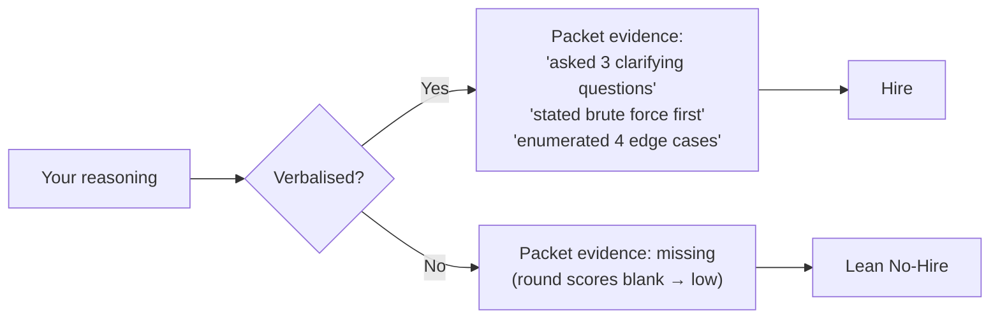
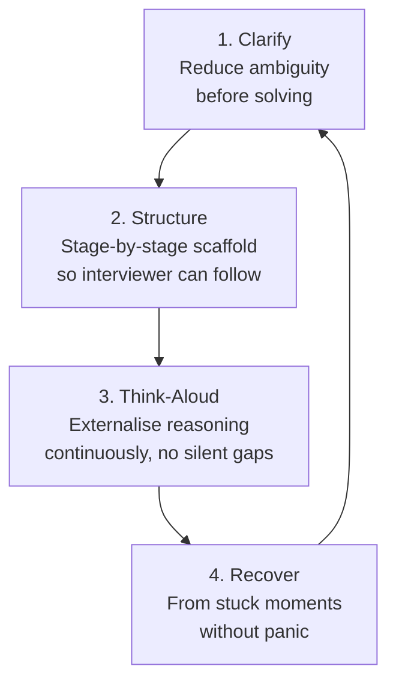
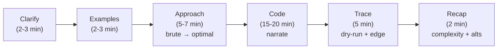
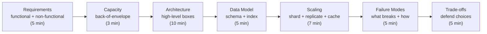
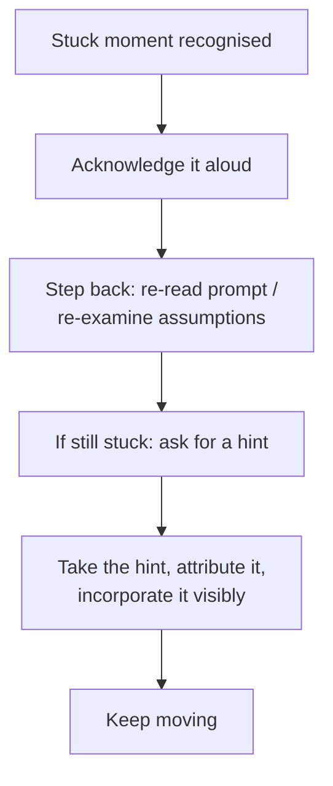

# Communication Mechanics — Clarify, Structure, Think-Aloud, Recover

In every FAANGM packet template, **Communication** is its own scored line. It is not "soft skills" — it is a load-bearing technical signal. The interviewer cannot grade a thought you didn't speak, an edge case you considered silently, a complexity you computed in your head. **Whatever stays inside your skull does not exist in the packet.** This topic is the four-skill toolkit — Clarify, Structure, Think-Aloud, Recover — that converts your internal reasoning into evidence on the scorecard.

Communication mechanics is the single highest-leverage prep area for the largest number of candidates, because most candidates have the technical chops and lose the round on signal density. Two candidates of identical engineering ability will score wildly differently if one narrates and one doesn't.

> [!IMPORTANT]
> "Communication" is the rubric line where mid-level candidates most often unknowingly drop a Hire to a Lean No-Hire. The fix is mechanical, learnable in 2-4 mock rounds, and worth more than any LeetCode pattern.

## Why Communication Is A Technical Signal



The interviewer is fast-summarising the round into structured packet fields. Every minute you spend in silent thinking is a minute the packet field "Edge cases enumerated" stays empty. The interviewer literally cannot write "candidate considered overflow" if you never said the word "overflow" out loud.

This dynamic is **why a verbose mid-level engineer often out-scores a sharper but quieter senior**: the verbose engineer produces visible signal density, the senior produces invisible reasoning. **You can't lose what you make visible. You can lose what you keep private.**

## The Four-Skill Toolkit



Each skill is independently learnable, has specific scripts you can rehearse, and shows up as separate rubric lines on the packet.

## Skill 1 — Clarify

**The single most under-used minute of any coding round** is the first 2-3 minutes spent reducing ambiguity before writing any code. Candidates rush past it because they think the clock starts when they touch the keyboard. The clock starts when the call starts.

### What to clarify, in order

1. **Restate the problem in your own words.** Forces you to confirm understanding; gives the interviewer a moment to correct misreadings.
2. **Bound the input.** Size range? Negative numbers allowed? Sorted? Distinct? Null/empty allowed?
3. **Bound the output.** Single result or all? Sorted? Indexed or value? In-place or new structure?
4. **Confirm edge cases that change the algorithm.** "What if k > n? What if the array is empty? What about negative numbers — do they count?"
5. **Confirm scale.** "Roughly how big is n? Are we optimising for time, memory, or both?"
6. **Confirm constraints.** "Can I modify the input? Can I assume Java collections, or pure primitives?"

### Scripts that work

> *"Let me restate to make sure I have it right: given an array of integers and a target k, return the k most-frequent values. A few clarifying questions:*
> - *Can the array be empty? What should I return if so?*
> - *Can k be larger than the number of distinct values?*
> - *How do I handle ties — say two values share the same frequency and k cuts between them?*
> - *Roughly how large is n? I'm asking because if it's small, brute force is acceptable; if it's billions, I'll lean toward a streaming approach.*
> - *Can I modify the input array in place, or should I treat it as immutable?"*

Five questions, ~45 seconds. Every one of them goes into the packet under **Problem comprehension** and **Clarifying questions** as a positive signal.

### Anti-patterns

- **No clarification, straight to code.** Scores low everywhere.
- **One clarification, then code.** Better, but you've left signal on the table.
- **Asking questions whose answer is obvious from the prompt.** ("Is this an array of integers?" when the prompt says "given an array of integers". Wastes time and reads as not listening.)
- **Asking too many questions and never starting.** Stop at 4-5 high-value questions; commit.

## Skill 2 — Structure

A coding round has a natural scaffold: Clarify → Examples → Approach → Code → Trace → Recap. A design round has Requirements → Capacity → Architecture → Data Model → Scaling → Failure Modes → Trade-offs. **Announcing the scaffold up-front lets the interviewer follow you** and check off the structure-points on their rubric.

### The coding-round scaffold



### The design-round scaffold



### How to announce the scaffold

> *"My plan for the next 45 minutes: I'll spend 3-4 minutes clarifying and walking through examples, then propose two approaches with their complexity, then code the better one and dry-run it. Sound good?"*

This single sentence does three things: (1) signals you have a structured approach, (2) gives the interviewer a chance to redirect ("actually, let's spend more time on design") before you've invested in the wrong path, (3) acts as a checklist you can return to under pressure.

### Anti-patterns

- **Jumping randomly between phases.** Going back to "what's the input format?" 20 minutes in.
- **Skipping examples.** Without examples you'll often misread the problem.
- **Going to code without articulating approach.** Even if your code is right, the interviewer scores low on algorithmic reasoning because you didn't show your work.
- **Forgetting to recap.** Closing in silence after the final test passes leaves the packet ending "ran out of time" instead of "stated final complexity O(n log k), discussed alternative".

## Skill 3 — Think-Aloud

Think-aloud is the constant low-level narration of your reasoning while you work. Silent rounds score poorly even when the silent reasoning was correct. The packet field for **Thought process** is filled by what the interviewer heard, not what you thought.

### The 30-second silence rule

If you have been silent for 30 seconds, the interviewer is starting to wonder. At 60 seconds, the packet starts gaining a note like "went silent for 90 seconds during approach selection — unclear what was being considered." **Set yourself a 30-second budget.** When you hit it, surface *something*:

- *"I'm weighing two options here — the sorting approach or the heap approach…"*
- *"I'm trying to decide if this edge case is worth handling now or after main logic…"*
- *"Let me dry-run this loop on the small example to make sure the index arithmetic is right…"*

You don't have to know the answer — you just have to expose the considering. The interviewer is happy to wait if they know what they're waiting for.

### The "narrate before you write" rule

Before each line of code, say what it does:

```text
You [aloud]:  "I'll initialise a min-heap of size k, keyed on frequency."
You [code]:   PriorityQueue<int[]> heap = new PriorityQueue<>((a, b) -> a[1] - b[1]);

You [aloud]:  "Now iterate the frequency map, push each entry into the heap,
               pop when size exceeds k."
You [code]:   for (var e : freq.entrySet()) { heap.offer(...); if (heap.size() > k) heap.poll(); }
```

This pattern produces continuous signal density without slowing you down — saying the line aloud takes 2 seconds and writing it takes 10.

### When to deliberately pause

Some pauses are productive: a 5-second pause to choose the right variable name, a 10-second pause to verify a complexity. Mark them: *"Just thinking through the edge case here for a moment."* Marked pauses score fine. Unmarked pauses score badly.

### Think-aloud in design rounds

Same pattern, different content. When weighing Postgres vs Cassandra:

> *"I'm leaning toward Postgres because we have relational joins between users and orders, and the scale — back-of-envelope says ~10TB — fits a single Postgres instance with read replicas. The trade-off is we lose Cassandra's linear write scaling, but our write load is ~1000 RPS sustained which Postgres handles fine. If we expected 100k write RPS I'd flip the decision."*

Three signals captured in 25 seconds: data-model reasoning, capacity estimation, trade-off articulation, and the threshold at which you'd flip — all in the packet.

### Anti-patterns

- **Long silent stretches** in any round.
- **Mumbling.** Quiet narration the interviewer can't hear scores zero.
- **Narrating *after* you write.** "Just wrote the heap initialisation" — pointless, the interviewer saw you write it. Narrate *what you're about to do*.
- **Narrating in a way that obscures your reasoning.** "OK so… um… maybe… let me try this…" produces noise without signal.

## Skill 4 — Recover

Every interview has a stuck moment. Your bug-fix isn't working, your design has a hole you didn't see, your behavioural story collapsed under follow-up. **Recovery is a signal in itself** — interviewers explicitly score how you handle stuck moments, because production is full of stuck moments and they want to see your real working style.

### The recovery loop



### The four steps in detail

1. **Acknowledge it.** *"I'm stuck on the indexing here, let me step back."* This single sentence prevents the packet from saying "candidate seemed lost".
2. **Step back deliberately.** Re-read the prompt out loud. Re-examine your assumptions. Look at your dry-run trace. This is where silent thinking is acceptable — but mark it: *"Let me re-read the prompt for a second."*
3. **Ask for a hint after ~2 minutes.** Senior interviewers respect a candidate who recognises a dead-end and asks for help, far more than one who silently spirals. *"I think I'm going down a wrong path — can you nudge me toward the right approach?"*
4. **Take the hint, attribute it, incorporate it visibly.** *"Right, sorting first simplifies this — let me rewrite the loop using a sorted iteration."* Attributing the hint shows you listened and integrated it. Refusing to acknowledge a hint or pretending you "had it" reads as defensive.

### Behavioural recovery — when your story collapses

A follow-up question can expose a weak point in your STAR story. *"You said 'we cut latency by 40%' — what was the baseline number?"* If you don't have the number, recovery is:

> *"Honestly, I don't remember the exact baseline number — I'd want to check before quoting. What I do remember is the production impact: customer-reported complaints dropped from 11/week to 2/week over the following month."*

This recovers honestly while pivoting to a stronger anchor (the customer-reported metric). **Defensive recovery** ("I'm sure it was around 200ms… something like that…") scores poorly because it reads as embellishment-now-being-walked-back.

### Anti-patterns

- **Silent panic.** Stuck without acknowledging is the worst pattern.
- **Refusing hints.** Reads as "didn't listen" or "ego". Take the hint with grace.
- **Pretending you had the hint already.** "Right, that's what I was going to do" when you weren't — interviewer sees through this.
- **Bluffing the answer.** Better to say "I don't remember the exact number" than to invent one. Senior interviewers fact-check.
- **Apologising profusely.** "Sorry, I should have known this!" Wastes time and emphasises the gap. Recover and move forward.

## Putting The Four Together — A Worked Round

Imagine a coding round on "Top K Frequent Elements". Here is what high-signal communication looks like end-to-end:

> **[0:00 — Clarify]** *"Let me restate: given an int array and a number k, return the k most frequent values. Quick questions: can the array be empty? What if k > distinct count? Ties — say two values have the same frequency at the cutoff?"*
>
> **[0:02 — Examples]** *"Let's walk through: [1,1,1,2,2,3], k=2 → [1,2]. Edge: [1], k=1 → [1]. Edge: [1,2,3], k=5 → I'll assume return all three with k clamped to distinct."*
>
> **[0:04 — Approach]** *"My plan: I see two approaches. Brute force is to count with a hashmap and sort by frequency — that's O(n + k log n) if I sort the n distinct entries, O(n log n) overall. Optimisation: a min-heap of size k as I iterate the frequency map, which is O(n log k). I'll go with the heap since k is typically much smaller than n. Trade-off: if memory is tight and k is close to n, sorting wins."*
>
> **[0:06 — Code, narrating]** *"First, build the frequency map…"* `Map<Integer, Integer> freq = new HashMap<>(); for (int x : nums) freq.merge(x, 1, Integer::sum);`
> *"Now the min-heap, comparing on frequency…"* `PriorityQueue<int[]> heap = new PriorityQueue<>((a, b) -> a[1] - b[1]);`
> *"Iterate the map, push, pop when size > k…"* `for (var e : freq.entrySet()) { heap.offer(new int[]{e.getKey(), e.getValue()}); if (heap.size() > k) heap.poll(); }`
> *"Extract result…"* `int[] result = new int[k]; for (int i = k - 1; i >= 0; i--) result[i] = heap.poll()[0]; return result;`
>
> **[0:20 — Dry-run]** *"Trace on [1,1,1,2,2,3], k=2: freq = {1:3, 2:2, 3:1}. Iterate — push (1,3), push (2,2), push (3,1). Size 3 > 2, poll min — pops (3,1). Heap = {(2,2), (1,3)}. Extract reverse: [1, 2]. Matches expected."*
>
> **[0:24 — Edge cases]** *"Edge cases I considered: empty array — would return empty. k > distinct — I'd add a clamp at top: k = Math.min(k, freq.size()). Tied frequencies at boundary — current code is non-deterministic which one wins; if a stable tie-break matters, I'd extend the comparator."*
>
> **[0:28 — Recap]** *"Final complexity: O(n) to build the map, O(n log k) for the heap pass, O(k log k) for extraction — overall O(n log k) time, O(n + k) space. The bucket-sort variant would be O(n) time but adds code complexity; I'd take the heap unless we needed to push for absolute lowest complexity."*

Every paragraph above produces ≥1 specific packet entry. Every sentence is the kind of phrase the interviewer can quote in the packet. Total round runs ~28 minutes leaving 17 minutes for follow-ups. **This is what a strong round looks like.** The technical work is the same as any candidate's — the *visibility* of the work is what distinguishes the score.

## Habits To Build In Mocks

1. **Set a 30-second silence timer.** Have a friend buzz you when you've been silent 30 seconds. After 4-5 mocks you'll feel the silence without the timer.
2. **Record yourself.** Listen back. Count silent gaps. Count mumbled sentences. Count clarifying questions. The recording is the most reliable mirror.
3. **Practice the scaffold announcement out loud.** It should fit in 15 seconds. Drill it.
4. **Drill "take the hint" responses.** Have your mock partner offer hints at random points; practice attributing and integrating them in one breath.
5. **Drill the four-sentence complexity pattern from [T04 Big-O](./T04-big-o-time-and-space-complexity.md).** Brute, optimised, trade-off, final.
6. **Drill the recovery loop.** Have your mock partner deliberately blow up your behavioural story; practice the "I don't remember the exact number, but the impact was…" pivot.

## What This Looks Like In Each Round Type

| Round | Highest-leverage communication move |
|---|---|
| **Coding** | Narrate before each line; state complexity at end |
| **System design** | Announce scaffold; verbalise trade-offs as you make them |
| **LLD / OOD** | Explain class-boundary rationale (SRP, OCP) as you draw each class |
| **Behavioural** | STAR structure spoken explicitly: "Situation: … Task: … Action: … Result: …" |
| **Hiring manager** | Reflect their question back before answering ("What I'm hearing you ask is X — let me think about that") |

## Sources & Further Reading

- [interviewing.io — How to talk during a coding interview](https://interviewing.io/blog) — multiple posts on think-aloud
- [Gergely Orosz — Pragmatic Engineer](https://blog.pragmaticengineer.com/author/gergely/) — communication in senior interviews
- [Hello Interview](https://www.hellointerview.com/) — round-specific communication patterns
- [Tech Interview Handbook — How to think about coding interviews](https://www.techinterviewhandbook.org/coding-interview-techniques/)

## Practice

1. **The silent-time audit.** Record yourself solving a LeetCode Medium. Mark every silent gap > 15 seconds. Count them. Aim for zero over 30 seconds.
2. **Scaffold-announcement drill.** Practice the 15-second scaffold announcement (coding + design). Get fluent enough that it comes out the same way under stress.
3. **Take-the-hint drill.** Have a mock partner interject hints at random; practice attributing and integrating them in one breath.
4. **Recovery-loop drill.** Have your partner deliberately push back on a behavioural story; practice the honest pivot.
5. **The clarify-first drill.** For 10 LeetCode problems, force yourself to ask 4-5 clarifying questions out loud before writing any code. Notice how often the clarification catches a misreading you would have run with.
6. **The narrate-before-write drill.** For one mock, force yourself to say what each line does *before* writing it. Notice how often the verbalisation reveals a bug.
7. **Behavioural-honesty drill.** Take one of your STAR stories. Have a partner ask the "what was the baseline number?" follow-up. Practice the honest pivot to a stronger anchor.
8. **Mock packet exercise.** After every mock, write the packet on yourself. Identify the rounds where communication mechanics dragged the score.

## Recap

You should now be able to:

- Explain why **communication is a technical signal**, not a soft skill — it determines whether your reasoning becomes packet evidence.
- Apply the **four-skill toolkit**: Clarify, Structure, Think-Aloud, Recover.
- **Clarify** with 4-5 high-value questions before any code.
- **Structure** by announcing the round scaffold up-front (coding scaffold: Clarify → Examples → Approach → Code → Trace → Recap; design: Requirements → Capacity → Architecture → Data → Scaling → Failures → Trade-offs).
- **Think-aloud** continuously, applying the 30-second silence rule, narrating before each line of code or design decision.
- **Recover** from stuck moments using the recovery loop (acknowledge → step back → ask for hint at ~2 min → take, attribute, integrate).
- Distinguish **honest recovery** ("I don't remember the exact number, but the impact was…") from **defensive recovery** ("I'm sure it was around…").
- Avoid the **anti-patterns** in each of the four skills (no clarification, no structure, silent thinking, refused hints, bluffed answers).
- Apply the highest-leverage communication move per round type (narrate before each line in coding; announce scaffold in design; explain class-boundary rationale in LLD; spoken STAR structure in behavioural).
- Build the **habits** in mocks: silence timer, recordings, scaffold drill, take-the-hint drill, recovery drill.

## Next

Continue to [Prep System — Weeks-Out Plan, Mock Cadence, Day-Of Routine](./T06-prep-system-weeks-out-plan-mock-cadence-day-of-routine.md).
