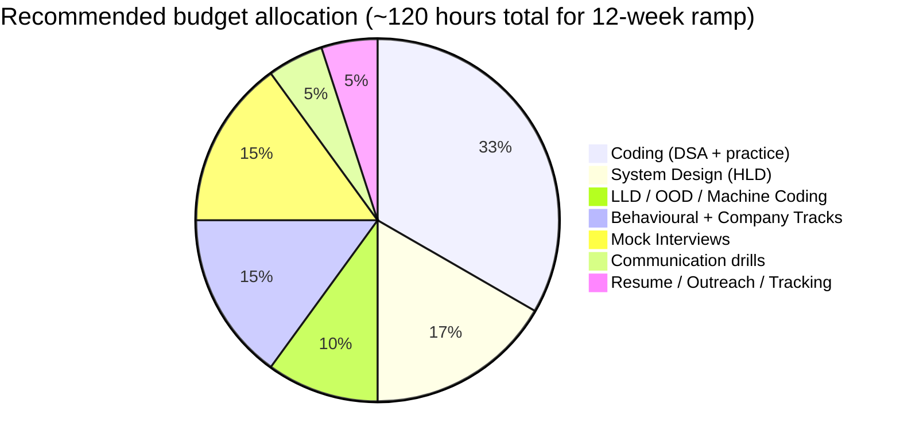
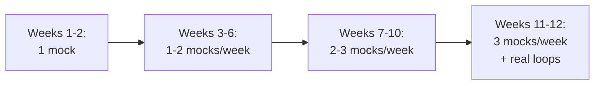
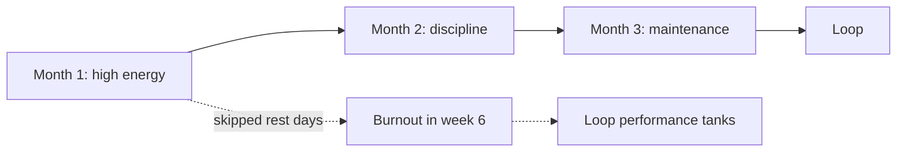

# Prep System — Weeks-Out Plan, Mock Cadence, Day-Of Routine

The candidates who land FAANGM offers are not the ones who studied the most material — they are the ones who **executed a sustainable prep system** that allocated time across all five signal areas (coding, design, behavioural, communication, company-specific) and arrived at the loop fresh, not depleted. The hardest part of FAANGM prep is not any single topic; it is **running the prep marathon without burning out**.

This topic is the system. Three time horizons: a **12-week ramp** (the right window for a serious offer-chasing cycle), a **weekly cadence** (what each week looks like), and a **day-of routine** (what to do in the 24 hours before the loop). Adapt the totals to your starting point and target — the structure scales.

> [!IMPORTANT]
> Most candidates start LeetCode-grinding the moment they decide to interview, then realise 4 weeks in that they've drilled coding to the exclusion of everything else and have no design or behavioural prep. **The single biggest prep mistake is over-investing in one signal area.** This topic prevents it.

## The Prep Budget — How Much Time, Across What?

A serious FAANGM cycle is 12 weeks of part-time prep (~10-15 hours/week for an employed candidate) or 6 weeks of full-time prep (~30-40 hours/week for someone on sabbatical). Inside that budget, the allocation across signal areas is the load-bearing decision.

### Why these proportions

- **Coding (~33%)** — Largest single share because it's the rubric line you can grind into shape, and it's the gate before any other round.
- **Design (~17%)** — Highest leverage for senior+ candidates; under-invested for L4-L5 because it feels far from current work.
- **LLD (~10%)** — Critical for Indian unicorns (machine coding) and FAANGM L4-L5 OOD rounds.
- **Behavioural + company tracks (~15%)** — Underrated. Behavioural failure auto-rejects at Meta, drags variance at Google, vetoes at Amazon Bar Raiser. Company tracks (Amazon LPs, Meta values, Google Googleyness, Netflix Keeper Test) need study.
- **Mock interviews (~15%)** — Highest signal-to-effort ratio of any prep activity. Your only honest mirror.
- **Communication drills (~5%)** — Small absolute budget, huge effect on score-per-effort.
- **Resume / outreach / tracking (~5%)** — Up-front investment that compounds throughout the cycle.

### Shrinking the budget

- **6-week full-time**: same proportions, doubled hours per week.
- **8-week part-time**: drop LLD to 8% if not targeting Indian unicorns; trim communication to 4%; aim for 10 hours/week.
- **4-week emergency**: cut design to 12%, push coding to 45%, mocks to 18%. This is suboptimal but workable for laterals already strong in design.

## The 12-Week Plan

```mermaid
gantt
  title 12-week FAANGM prep plan (~10-15 h/week)
  dateFormat  X
  axisFormat  Week %V
  section Phase 1: Foundation
  Resume rewrite + LinkedIn      :p1a, 0, 1w
  Big-O + collection cheatsheet  :p1b, 0, 1w
  Communication mechanics drill  :p1c, after p1a, 1w
  Patterns survey (sliding window/two-pointer/hashing) :p1d, after p1b, 2w
  section Phase 2: Coding bulk
  DSA: arrays/strings/hashing/linked lists :p2a, after p1d, 2w
  DSA: trees/BST/graphs                    :p2b, after p2a, 2w
  DSA: heaps/tries/DP/greedy/backtracking  :p2c, after p2b, 2w
  section Phase 3: Design + behavioural
  HLD framework + 3 worked designs :p3a, after p1d, 3w
  LLD framework + 3 case studies   :p3b, after p3a, 1w
  Behavioural story bank (12 stories) :p3c, after p1d, 2w
  Company tracks (target 3-4)      :p3d, after p3c, 2w
  section Phase 4: Mock + apply
  Mocks weekly                     :p4a, after p1c, 11w
  Referrals + apply (rolling)      :p4b, after p1a, 11w
  Final-week loop polish           :p4c, after p2c, 1w
```

### Phase 1 (Weeks 1-2): Foundation

- Resume + LinkedIn rewrite ([C05/T01](../C05-resume-profile-and-career/T01-resume-fundamentals-structure-length-ats-friendly-format.md))
- Big-O + Java collection complexity cold-recall ([T04](./T04-big-o-time-and-space-complexity.md))
- Patterns survey: sliding window, two-pointer, hashing, recursion — one pattern per day, 2-3 problems each
- Communication mechanics — record one mock per week starting now

### Phase 2 (Weeks 3-8): Coding bulk

- DSA topic per week from [C02 syllabus](../C02-dsa-for-interviews/) — 8-10 problems per topic
- Mix LeetCode tags: company-specific (Amazon-tagged, Meta-tagged) + pattern-tagged
- Weekly mock with mock partner or Interviewing.io / Pramp
- **Resist** treating LeetCode count as the metric. Quality of pattern recognition > problem count.

### Phase 3 (Weeks 4-10, parallel): Design + behavioural

- Read 1 HLD case per week from [C03](../C03-design-interviews/); whiteboard it solo, then compare to reference solution
- Read 1 LLD case per week; code it from scratch (90-min Machine Coding timer if targeting Indian unicorns)
- Build a **12-story behavioural bank** (see [C04/T01](../C04-behavioral-and-company-tracks/T01-behavioral-interviews-star-car-sbi.md)). Practice telling each one in 4-5 minutes.
- Read company tracks for your top 3-4 target companies ([C04/T03](../C04-behavioral-and-company-tracks/) onward); map your stories to each company's values/LPs.

### Phase 4 (Weeks 9-12): Mocks + apply

- 2-3 mocks per week (mix of coding, design, behavioural)
- Reach out for referrals at every target company
- Run loops in parallel — competing offers are your strongest leverage
- **Final week**: only review, no new material. Sleep, exercise, light mocks.

## The Weekly Cadence

For an employed candidate, ~12 hours/week breaks down like this:

| Day | Slot | Activity |
|---|---|---|
| **Mon** | Evening 1 hr | DSA: pattern of the week, 2 medium problems |
| **Tue** | Evening 1 hr | DSA: 2 problems on same pattern |
| **Wed** | Evening 2 hr | Design: 1 HLD case or 1 LLD case (alternating weeks) |
| **Thu** | Evening 1 hr | Behavioural: rehearse 2 STAR stories aloud (recorded) |
| **Fri** | OFF | Rest day. Critical for sustainability. |
| **Sat** | Morning 3-4 hr | Mock interview + post-mock review + one fresh DSA problem |
| **Sun** | Morning 2 hr | Company-track reading + weak-area drilling + week planning |

### Why a Friday rest day

Burnout in prep is real and cumulative. A weekly rest day prevents the late-cycle collapse where you push through weeks 1-10 and then under-perform in the actual loop because you're depleted. **Cadence over volume.** Twelve months of 10-hour weeks beats three months of 30-hour weeks for almost everyone.

### The Saturday mock ritual

The Saturday mock is the most valuable 3 hours of your week:

1. **9:00-9:45** — Mock round (coding, design, or behavioural — rotate)
2. **9:45-10:00** — Mock partner's verbal feedback
3. **10:00-10:30** — You write a packet on yourself (full structure from [T03 Rubric](./T03-the-interviewer-s-rubric-signals-scoring-calibration.md))
4. **10:30-11:15** — Drill the specific gap surfaced in the mock
5. **11:15-12:00** — One fresh DSA problem, applying any communication/pattern insight from the mock

Recording the mock is non-negotiable. Listen back during the post-mock review.

### When you have a real interview that week

Drop everything else. The week before a FAANGM loop:

- Mon-Wed: review your behavioural stories, do 2 low-stress problems per day to stay warm
- Thu: one design dry-run
- Fri: rest, sleep early
- Sat: real loop or final mock

## Mock-Interview Cadence

### Where to get mocks

- **Pramp** (free, peer-based) — basic but available
- **Interviewing.io** (paid, includes ex-FAANG interviewers) — closer to real bar
- **Hello Interview** (paid, design-focused) — strong for L5+ system design
- **Friends / ex-colleagues** at target companies — most realistic for company-specific rubrics
- **Self-mocks** (timer + LeetCode + record yourself) — 2nd best to a human partner, but always available

### Mock rotation

- **Coding mocks**: weekly throughout Phase 2-4
- **Design mocks**: starting Phase 3, weekly
- **Behavioural mocks**: starting Phase 3, biweekly
- **Full loops** (4 mocks in a day): 1-2 times in final two weeks. Simulates real exhaustion.

### What to actually score yourself on

For every mock, fill the packet template from [T03](./T03-the-interviewer-s-rubric-signals-scoring-calibration.md). Track over time:

- Number of clarifying questions asked
- Whether you stated brute-force first
- Whether you stated complexity at the end
- Number of silent gaps > 30 sec
- Whether you took hints constructively
- Whether your final code compiled

Numbers, not vibes. Watch the trend.

## Day-Of Routine

The 24 hours before the loop are about **arriving fresh**, not about cramming. Treat it like the day before a marathon: light, structured, conservative.

### T-24h to T-12h (the night before)

- Light dinner (no heavy meal, no alcohol)
- Re-read your 12 behavioural stories (10-15 min) — don't memorise, just refresh
- Re-read the company's track from [C04](../C04-behavioral-and-company-tracks/) (10 min)
- Re-read your one-page DSA pattern cheatsheet (10 min) — see [C10 Cheatsheets](../C11-cheatsheets/)
- Lay out clothes, charger, notebook, water, snacks
- Test your interview setup: camera, mic, screen-share, IDE, browser, backup
- **Sleep 8 hours.** Not 7, not 6. Sleep is the single highest-ROI prep activity in this window.

### T-12h to T-3h (morning of)

- Wake up 3 hours before the first round
- Light breakfast (protein + slow carbs, no sugar crash)
- 20-minute walk or stretch — moves blood, calms nerves
- Re-read your 1-page "today's reminders" sheet:
  - Clarify first (4-5 questions)
  - Announce scaffold
  - State complexity at end
  - Take hints with attribution
  - Use 'I' not 'we' in behavioural

### T-3h to T-30min

- Solve one easy LeetCode warm-up (NOT a medium — you want a win, not a struggle)
- One 5-min behavioural rehearsal aloud
- Stop reviewing. Anything you don't know now you won't learn in the next 3 hours.

### T-30min to T-0

- Toilet, water bottle filled, notebook open
- Earphones, do-not-disturb on phone
- Camera + mic test in the actual platform (CoderPad / Chime / Google Meet)
- Three deep breaths
- Stand and walk for 2 minutes to flush adrenaline

### During the loop

- **Between rounds (5-15 min gaps)**: stand up, drink water, walk if possible. Reset.
- **Do not review previous rounds.** Whatever happened is locked. Don't drag it into the next round.
- **Eat between blocks.** Long loops are 4-6 hours; bonking mid-loop is a real risk.

### T+0 (after the loop)

- Send a brief thank-you to your recruiter the same day. Recap one positive moment from a round.
- Write your own debrief — what went well, what you'd do differently. Useful for the next loop.
- **Do not obsess.** The packet is filed; you can't change it. Move on.

## Sustainability — Avoiding The Burnout Trap

### The patterns that burn people out

- **Skipping the Friday rest day.** Cumulative fatigue compounds.
- **LeetCode count as the metric.** "300 problems solved" feels productive but doesn't translate to mock performance.
- **Solo isolation.** No mocks, no community, no feedback. The grind feels endless because you can't see progress.
- **Pushing through illness.** A bad cold should pause prep, not be ignored.
- **Drinking / late nights / poor sleep.** Sleep is the lever.

### The patterns that sustain

- **Weekly cadence with built-in rest.** Friday off, half-day Sunday.
- **Mock-driven feedback loop.** Numbers from the packet template give you visible progress.
- **A peer or study group.** Other people in the cycle = accountability + perspective.
- **Time-boxing.** A LeetCode problem gets 45 minutes, not 3 hours. Move on.
- **Tracking weak areas, not strong ones.** Drill what's broken, not what's already strong.

## Adapting The Plan To Your Starting Point

- **Strong coder, weak on design**: invert proportions — design gets 30%, coding gets 20%. Bring design mocks forward to week 3.
- **Strong on design, weak on coding**: standard plan, but front-load Phase 2 starting week 1.
- **Returning from a career break**: add 4 weeks of Phase 1 foundation. Don't skip ramp-up.
- **Senior+ with weak behavioural**: triple the behavioural bank size (24 stories not 12) and add 2 behavioural mocks per week starting week 4.
- **First-time FAANGM candidate, currently at a service company**: expect to need closer to 16 weeks. Phase 1 expands to cover patterns you've never used in your current role.

## Sources & Further Reading

- [Tech Interview Handbook — Coding Interview Prep](https://www.techinterviewhandbook.org/)
- [Pragmatic Engineer — preparing for senior+ interviews](https://blog.pragmaticengineer.com/author/gergely/)
- [Hello Interview — Study Plans](https://www.hellointerview.com/)
- [Interviewing.io — Practice Platforms](https://interviewing.io/)
- [LeetCode Patterns](https://github.com/SeanPrashad/leetcode-patterns) — community-curated 170-problem list

## Practice

1. **Build your own 12-week calendar.** Block the weekly cadence (Mon-Sun) into your real calendar. Defend the Friday rest day against work intrusions.
2. **Pick your mock platform.** Sign up for Pramp or Interviewing.io this week. Schedule the first mock for Saturday.
3. **Audit your budget.** Look at your last 2 weeks of prep. Estimate hours per signal area. Compare to the recommended pie chart. Adjust.
4. **Write your day-of routine.** Tailor the routine above to your timing and platform. Print or save as a checklist.
5. **Run a self-mock with the packet template.** Pick a LeetCode Medium, solve it under 45-min timer, record yourself, then write the full packet on yourself afterward.
6. **Identify your highest-leverage weak area.** From the rubric ([T03](./T03-the-interviewer-s-rubric-signals-scoring-calibration.md)) and your mock packets, what's the one signal that consistently drags? Write a 2-week drill targeting only that signal.
7. **Plan your final week.** Block the 7 days before your scheduled loop. No new material, light volume, prioritise sleep.
8. **Sustainability check.** List the burnout patterns from above. Mark which ones you're already doing. Build one habit change per week to remove them.

## Recap

You should now be able to:

- Allocate prep time across the **five signal areas** in roughly the recommended proportions (coding 33% / design 17% / LLD 10% / behavioural 15% / mocks 15% / communication 5% / resume 5%).
- Execute the **12-week plan** in four phases (Foundation, Coding bulk, Design + behavioural, Mocks + apply).
- Run a **sustainable weekly cadence** with a built-in rest day and a Saturday mock ritual.
- Apply a **mock-driven feedback loop** using packet self-scoring for visible progress.
- Run the **day-of routine** — sleep 8 hours, light warmup, scaffold reminder sheet, between-round reset, post-loop thank-you.
- Avoid the **burnout patterns** (no rest day, LeetCode-count metric, solo isolation, sleep debt) and build the **sustainability patterns** (cadence, mocks, peer accountability, time-boxing).
- **Adapt the plan** to different starting points (weak coding vs weak design vs senior vs returning vs first-time FAANGM).
- Recognize that **sleep, mocks, and rest are higher-ROI prep activities than additional LeetCode volume** in the final two weeks.

## Next

Continue to [C02 DSA for Interviews / Java — T01 Arrays & Strings](../C02-dsa-for-interviews/T01-arrays-and-strings.md).
