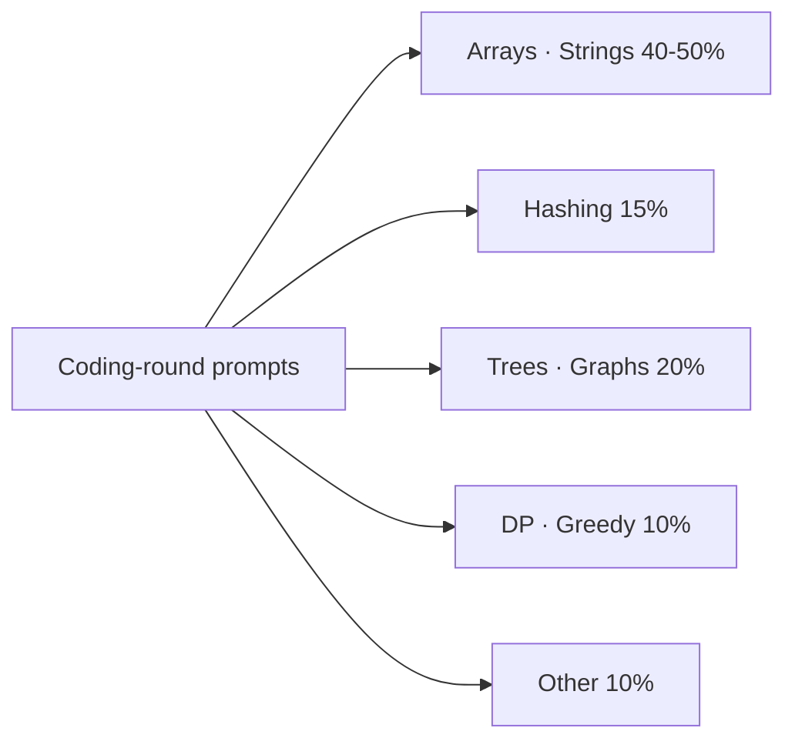
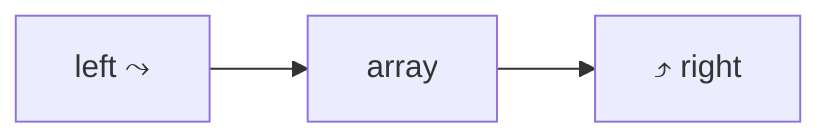
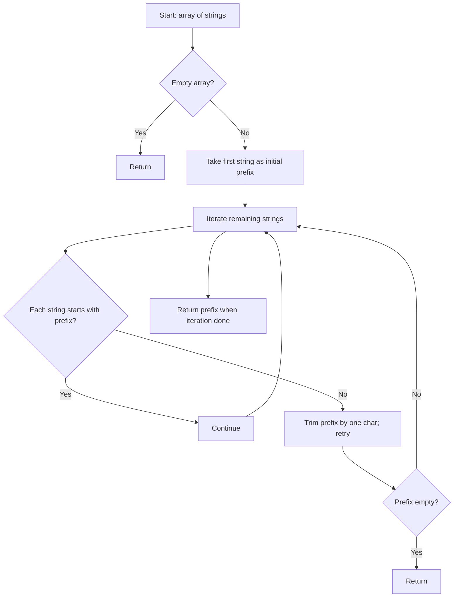

# Arrays & Strings

Arrays and strings are the bread-and-butter of coding interviews — **roughly 40-50% of all coding-round problems** at FAANGM and Indian unicorns are array/string problems or have an array/string as the core data structure. The patterns interviewers reach for repeatedly are a small set: **two pointers, prefix sum, in-place mutation, sliding window** (its own topic in [T03](./T03-two-pointers-and-sliding-window.md)), **string parsing, character-frequency counting**. Mastering these eight patterns covers most warm-up rounds and the easier loop rounds across every FAANGM.

This topic walks the patterns, the Java-specific idioms that score well, and the gotchas that trip mid-level candidates (boxing pitfalls, `String` immutability cost, `Arrays.asList` trap, char-vs-int arithmetic).

## Why Arrays + Strings Dominate



The reasons:

1. **Universal vocabulary.** Every candidate knows arrays + strings; no time wasted on prerequisites.
2. **Pattern-rich.** A single 45-min slot can probe two-pointer, edge cases, complexity, and Java idiom all on one problem.
3. **Edge-case-rich.** Empty array, single element, all-same, sorted vs unsorted, ASCII vs unicode — every problem produces 4-6 edge cases interviewers like to probe.
4. **Scales by sub-pattern.** "Find a subarray with X property" is two-pointer, sliding window, prefix sum, or hashing — same input, four different mental models.

## Java Array & String Foundations (60 Seconds)

### Arrays in Java

```java
int[] a = new int[10];               // primitive int array, default 0
int[] b = {1, 2, 3};                 // initialiser
Integer[] c = new Integer[10];       // boxed; default null
int[][] grid = new int[m][n];        // 2D — actually array of arrays
a.length;                            // size — note: no parens, it's a field
Arrays.sort(a);                       // O(n log n) — Dual-Pivot Quicksort, NOT stable
Arrays.fill(a, -1);                  // O(n) fill with value
int[] copy = Arrays.copyOf(a, n);    // O(n) clone, can resize
int[] sub  = Arrays.copyOfRange(a, from, to);  // [from, to) — to is exclusive
```

**Pitfalls**: `Arrays.asList(new int[]{1,2,3})` produces a `List<int[]>` of size 1 (boxed array, not List<Integer>). Use `Arrays.stream(a).boxed().toList()` if you need a `List<Integer>`.

### Strings in Java

```java
String s = "hello";
s.length();                          // O(1) — char count NOT byte count (UTF-16 code units)
s.charAt(i);                          // O(1)
s.substring(from, to);                // O(n) — copies since Java 7u6 (was O(1) view pre-7u6)
s.indexOf("lo");                      // O(n·m) naive, sometimes Boyer-Moore-ish
s.equals(other);                      // O(n)
s + t;                                // O(n+m), allocates new String — DON'T loop this
StringBuilder sb = new StringBuilder(); // mutable, amortised O(1) append
sb.append(c); sb.toString();
char[] arr = s.toCharArray();         // O(n), useful when you need mutation
new String(arr);                      // O(n) back to String
```

**Critical**: `String` is immutable. Every `+` allocates. **Use `StringBuilder` for any concatenation in a loop**; `O(n²) → O(n)` time win.

**Unicode trap**: `"😀".length()` returns 2, not 1. A surrogate pair occupies two `char` slots in Java's UTF-16 representation. Use `s.codePointAt(i)` and iterate by code points if your input has emoji or non-BMP scripts.

## Pattern 1 — Two Pointers

**When**: sorted array, or pairs/triples whose property is monotonic.



```java
// "Two Sum II" — sorted input
public int[] twoSum(int[] nums, int target) {
    int lo = 0, hi = nums.length - 1;
    while (lo < hi) {
        int sum = nums[lo] + nums[hi];
        if (sum == target) return new int[]{lo + 1, hi + 1};
        if (sum < target)  lo++;
        else               hi--;
    }
    return new int[]{-1, -1};
}
// O(n) time, O(1) space
```

**Variants**: 3Sum (fix one, two-pointer the rest), 4Sum, container-with-most-water, trapping-rain-water (two-pointer variant), remove-duplicates-from-sorted-array (in-place two-pointer).

## Pattern 2 — Prefix Sum

**When**: many sub-array sum queries on a fixed array; or sub-array sum equals target.

```java
// "Subarray Sum Equals K" — works even with negatives
public int subarraySum(int[] nums, int k) {
    Map<Integer, Integer> count = new HashMap<>();
    count.put(0, 1);                         // empty prefix
    int sum = 0, result = 0;
    for (int n : nums) {
        sum += n;
        result += count.getOrDefault(sum - k, 0);
        count.merge(sum, 1, Integer::sum);
    }
    return result;
}
// O(n) time, O(n) space
```

**Key insight**: `prefix[j] - prefix[i] = sum(i..j)`. A hashmap of seen prefix sums turns "find pair (i,j) with prefix[j]-prefix[i]=k" into O(n).

## Pattern 3 — In-Place Mutation

**When**: O(1) extra space requested, or you want to "use the input array as the data structure".

```java
// "Move Zeros" — push zeros to the end, preserve order of non-zeros
public void moveZeroes(int[] nums) {
    int write = 0;
    for (int read = 0; read < nums.length; read++) {
        if (nums[read] != 0) nums[write++] = nums[read];
    }
    while (write < nums.length) nums[write++] = 0;
}
// O(n) time, O(1) space
```

**Variants**: remove-duplicates-from-sorted-array, remove-element, partition-array (Dutch-flag), rotate-array (reverse-trick).

### The reverse-trick for rotate-array

```java
public void rotate(int[] nums, int k) {
    k %= nums.length;
    reverse(nums, 0, nums.length - 1);
    reverse(nums, 0, k - 1);
    reverse(nums, k, nums.length - 1);
}
private void reverse(int[] a, int i, int j) {
    while (i < j) { int t = a[i]; a[i++] = a[j]; a[j--] = t; }
}
// O(n) time, O(1) space
```

Three reverses. Visualise: `[1,2,3,4,5,6,7]` k=3 → reverse all → `[7,6,5,4,3,2,1]` → reverse first 3 → `[5,6,7,4,3,2,1]` → reverse rest → `[5,6,7,1,2,3,4]`. ✓

## Pattern 4 — Sliding Window (Preview; deep in [T03](./T03-two-pointers-and-sliding-window.md))

**When**: contiguous subarray / substring with size or sum constraint.

```java
// "Longest Substring Without Repeating Characters"
public int lengthOfLongestSubstring(String s) {
    Map<Character, Integer> last = new HashMap<>();
    int best = 0, start = 0;
    for (int end = 0; end < s.length(); end++) {
        char c = s.charAt(end);
        if (last.containsKey(c) && last.get(c) >= start) {
            start = last.get(c) + 1;
        }
        last.put(c, end);
        best = Math.max(best, end - start + 1);
    }
    return best;
}
// O(n) time, O(min(n, alphabet)) space
```

## Pattern 5 — Character Frequency Counting

For lowercase-only strings, use a primitive `int[26]` not a `HashMap<Character, Integer>` — 10× faster constant factor.

```java
// "Valid Anagram"
public boolean isAnagram(String s, String t) {
    if (s.length() != t.length()) return false;
    int[] count = new int[26];
    for (int i = 0; i < s.length(); i++) {
        count[s.charAt(i) - 'a']++;
        count[t.charAt(i) - 'a']--;
    }
    for (int c : count) if (c != 0) return false;
    return true;
}
// O(n) time, O(1) space (fixed-size 26)
```

**Key idiom**: `s.charAt(i) - 'a'` gives 0-25 for lowercase letters. This char-to-index trick saves the hashmap overhead.

## Pattern 6 — Sorting As A Reduction

Some problems become trivial after sorting. Default to `Arrays.sort` unless you specifically need stability (then use `Arrays.sort` on `Integer[]` not `int[]` — only object-array sort is stable in Java).

```java
// "Merge Intervals"
public int[][] merge(int[][] intervals) {
    Arrays.sort(intervals, (a, b) -> a[0] - b[0]);  // sort by start
    List<int[]> out = new ArrayList<>();
    for (int[] interval : intervals) {
        if (out.isEmpty() || out.get(out.size() - 1)[1] < interval[0]) {
            out.add(interval);
        } else {
            out.get(out.size() - 1)[1] = Math.max(out.get(out.size() - 1)[1], interval[1]);
        }
    }
    return out.toArray(new int[0][]);
}
// O(n log n) time, O(n) space for output
```

## Pattern 7 — Hashing For Lookup

Trade space for time: a hashmap of "what we've seen" turns many O(n²) brute-force scans into O(n).

```java
// "Two Sum" — unsorted
public int[] twoSum(int[] nums, int target) {
    Map<Integer, Integer> seen = new HashMap<>();
    for (int i = 0; i < nums.length; i++) {
        Integer j = seen.get(target - nums[i]);
        if (j != null) return new int[]{j, i};
        seen.put(nums[i], i);
    }
    return new int[]{-1, -1};
}
// O(n) time, O(n) space
```

## Pattern 8 — String Parsing

Parsing — splitting, tokenising, building a result — comes up in calculator problems, palindromes, anagram families, version-number comparison.

```java
// "Valid Palindrome" — ignore non-alphanumerics, case-insensitive
public boolean isPalindrome(String s) {
    int lo = 0, hi = s.length() - 1;
    while (lo < hi) {
        while (lo < hi && !Character.isLetterOrDigit(s.charAt(lo))) lo++;
        while (lo < hi && !Character.isLetterOrDigit(s.charAt(hi))) hi--;
        if (Character.toLowerCase(s.charAt(lo)) != Character.toLowerCase(s.charAt(hi))) return false;
        lo++; hi--;
    }
    return true;
}
// O(n) time, O(1) space
```

## Edge Cases To Always Consider

For every array/string problem, mentally walk through:

- **Empty input** (`[]`, `""`)
- **Single element** (`[5]`, `"a"`)
- **All same elements** (`[3,3,3]`, `"aaaa"`)
- **Already sorted / reverse-sorted** (when sorting matters)
- **Maximum size** (does `O(n²)` fit in the time budget?)
- **Negative numbers** (when the prompt allows them)
- **Integer overflow** (sum of large positives)
- **Null input** (does the prompt allow null? — usually no, but clarify)
- **Unicode / surrogate pairs** (strings beyond ASCII)
- **Repeated values** (does duplicate handling matter?)

Enumerating 4-5 of these unprompted in the interview is a strong rubric signal.

## Java Idioms That Score Well

- **`int[26]` for lowercase-letter counting** (not `HashMap<Character, Integer>`).
- **`StringBuilder` for any string-build-in-loop**.
- **`Map.merge(key, 1, Integer::sum)`** for clean frequency counting.
- **`Arrays.sort` with a comparator** for non-default ordering.
- **`Math.max(a, b)`** beats branching `if (a > b)` for clarity.
- **`Map.computeIfAbsent`** for building maps-of-lists (`map.computeIfAbsent(k, x -> new ArrayList<>()).add(v)`).
- **`ArrayDeque` over `Stack`** when you need a stack (Stack is legacy-synchronized).
- **Avoid `Integer` for hot loops** — use primitive `int[]`.

## Common Mistakes That Score Low

- **`String == String`** — uses reference equality, not value. Always `.equals`.
- **`Integer.valueOf(127) == Integer.valueOf(127)` returns true but 128 returns false** — the autoboxing cache trap. Use `.equals` or primitive `int`.
- **`StringBuilder` for one concatenation** — over-engineering. `+` is fine for one-off; only loops need `StringBuilder`.
- **`s.substring(i, j)` in tight loops** — allocates; consider `s.charAt(i)` iteration or a `char[]`.
- **Mutating an array while iterating it with for-each** — `ConcurrentModificationException` on collections; arrays may silently produce wrong results.
- **Off-by-one in two-pointer** — `lo < hi` vs `lo <= hi` matters and depends on whether you allow pointers to meet.
- **Not handling `nums.length == 0`** — most array problems need this guard.

## Worked End-To-End Example

**Problem**: "Longest Common Prefix" of an array of strings.



```java
public String longestCommonPrefix(String[] strs) {
    if (strs == null || strs.length == 0) return "";
    String prefix = strs[0];
    for (int i = 1; i < strs.length; i++) {
        while (strs[i].indexOf(prefix) != 0) {
            prefix = prefix.substring(0, prefix.length() - 1);
            if (prefix.isEmpty()) return "";
        }
    }
    return prefix;
}
// O(S) time where S is total characters; O(1) extra space.
```

**Talking through the round** (from [T05 Communication](../C01-foundations-of-interviewing/T05-communication-mechanics-clarify-structure-think-aloud-recover.md)):

> *"Clarifying: empty input returns ""; single string returns itself; case-sensitive I assume. Approach: pick the first string as initial prefix, iterate the rest, trim the prefix until each string starts with it. Complexity: O(S) total characters. Edge cases: empty array, one string, all-empty strings, no common chars, full equality. Final: O(S) time, O(1) extra space. Alternative: sort the array and compare first and last — also O(S log n + S) but simpler comparison."*

This script hits 7 rubric points in under a minute.

## Sources & Further Reading

- [Tech Interview Handbook — Arrays](https://www.techinterviewhandbook.org/algorithms/array/)
- [NeetCode 150](https://neetcode.io/practice) — curated array/string problem set
- [LeetCode Arrays tag](https://leetcode.com/tag/array/)
- [Java String docs](https://docs.oracle.com/en/java/javase/21/docs/api/java.base/java/lang/String.html)

## Practice

1. **Two Sum** — Hash-map approach, O(n).
2. **Two Sum II (sorted)** — Two-pointer, O(n).
3. **3Sum** — Sort + two-pointer, dedup carefully.
4. **Move Zeros** — In-place two-pointer.
5. **Valid Palindrome** — Two-pointer with character filtering.
6. **Longest Substring Without Repeating Characters** — Sliding window.
7. **Container With Most Water** — Two-pointer optimisation over brute-force.
8. **Merge Intervals** — Sort + linear merge.
9. **Product of Array Except Self** — Prefix + suffix products, O(n) no division.
10. **Rotate Array** — Reverse-trick.
11. **Group Anagrams** — Hashmap keyed on sorted-chars or frequency-signature.
12. **Longest Common Prefix** — As worked above.
13. **Valid Anagram** — Frequency count with int[26].
14. **Subarray Sum Equals K** — Prefix sum + hashmap.
15. **Trapping Rain Water** — Two-pointer with max-from-left + max-from-right insight.

## Detailed Worked Solutions

Full code + complexity + edge cases for the most-asked practice problems above. Read each problem first, attempt yourself, then compare.

### 1. Two Sum (unsorted, O(n) hashmap)

**Problem.** Given `int[] nums` and `int target`, return indices of the two numbers that add to target. Exactly one solution exists; cannot use the same element twice.

**Approach.** As we iterate, store each value's index. For each `nums[i]`, check if `target - nums[i]` is already in the map. If yes, return both indices; else store `nums[i] → i`.

```java
public int[] twoSum(int[] nums, int target) {
    Map<Integer, Integer> seen = new HashMap<>();
    for (int i = 0; i < nums.length; i++) {
        Integer j = seen.get(target - nums[i]);
        if (j != null) return new int[]{j, i};
        seen.put(nums[i], i);
    }
    throw new IllegalArgumentException("No two sum solution");
}
// O(n) time, O(n) space
```

**Walkthrough on `nums=[2,7,11,15], target=9`**: i=0 seen={}, store 2→0; i=1, target-7=2 found at index 0, return [0,1].

**Edge cases**: duplicates (`[3,3], target=6` → store first, find on second; works); negatives (works); single element (no pair, throws); `target = 2 × nums[i]` requires duplicates.

### 2. Two Sum II (sorted, O(n) two-pointer)

**Problem.** Same as above but `nums` is sorted in non-decreasing order. Return **1-indexed** positions.

**Approach.** Two pointers — start at both ends; if sum too small advance left, too big retreat right.

```java
public int[] twoSum(int[] nums, int target) {
    int lo = 0, hi = nums.length - 1;
    while (lo < hi) {
        int sum = nums[lo] + nums[hi];
        if (sum == target) return new int[]{lo + 1, hi + 1};
        if (sum < target) lo++;
        else hi--;
    }
    return new int[]{-1, -1};
}
// O(n) time, O(1) space — wins over hashmap on space
```

**Why monotonic move is safe**: when `sum < target`, no smaller `hi` index can fix it (sum only gets smaller); must advance `lo` to grow the sum. Symmetric for `sum > target`.

### 3. 3Sum (sort + two-pointer, dedup carefully)

**Problem.** Given `int[] nums`, return all unique triplets `[a, b, c]` such that `a + b + c == 0`.

**Approach.** Sort; fix one element `nums[i]` (skip if equal to previous → dedup); two-pointer the rest for the complement `-nums[i]`. Skip equals after a match.

```java
public List<List<Integer>> threeSum(int[] nums) {
    Arrays.sort(nums);
    List<List<Integer>> result = new ArrayList<>();
    for (int i = 0; i < nums.length - 2; i++) {
        if (nums[i] > 0) break;                                // sorted; positives can't sum to 0 with two more positives
        if (i > 0 && nums[i] == nums[i-1]) continue;           // dedup outer
        int lo = i + 1, hi = nums.length - 1, target = -nums[i];
        while (lo < hi) {
            int sum = nums[lo] + nums[hi];
            if (sum == target) {
                result.add(List.of(nums[i], nums[lo], nums[hi]));
                while (lo < hi && nums[lo] == nums[lo+1]) lo++; // dedup inner
                while (lo < hi && nums[hi] == nums[hi-1]) hi--;
                lo++; hi--;
            } else if (sum < target) lo++;
            else hi--;
        }
    }
    return result;
}
// O(n²) time (n × inner two-pointer), O(1) extra (output ignored)
```

**Why two passes of skips**: outer skip removes duplicate fix-elements; inner skip removes duplicate triplets on the same fix. Both required for uniqueness.

### 4. Move Zeros (in-place, O(1) extra)

**Problem.** In-place move all zeros in `int[] nums` to the end, preserving relative order of non-zeros.

**Approach.** Two pointers — `write` advances only on non-zero; copy `nums[read]` to `nums[write]`; tail-fill zeros after.

```java
public void moveZeroes(int[] nums) {
    int write = 0;
    for (int read = 0; read < nums.length; read++) {
        if (nums[read] != 0) nums[write++] = nums[read];
    }
    while (write < nums.length) nums[write++] = 0;
}
// O(n) time, O(1) space
```

**Optimisation (single pass with swap)**: swap when read finds non-zero. Saves the tail-fill loop but does more swaps overall; mostly stylistic.

### 5. Valid Palindrome (two-pointer with filter)

**Problem.** Return true if `String s` is a palindrome considering only alphanumerics, case-insensitive.

```java
public boolean isPalindrome(String s) {
    int lo = 0, hi = s.length() - 1;
    while (lo < hi) {
        while (lo < hi && !Character.isLetterOrDigit(s.charAt(lo))) lo++;
        while (lo < hi && !Character.isLetterOrDigit(s.charAt(hi))) hi--;
        if (Character.toLowerCase(s.charAt(lo)) != Character.toLowerCase(s.charAt(hi))) return false;
        lo++; hi--;
    }
    return true;
}
// O(n) time, O(1) space
```

**Edge cases**: empty string → true; all non-alnum (`",.;:"`) → true; single char → true; unicode emoji (`Character.isLetterOrDigit` handles BMP only — for surrogate pairs use code-point iteration).

### 6. Longest Substring Without Repeating Characters (sliding window)

**Problem.** Return length of the longest substring of `s` with all distinct characters.

```java
public int lengthOfLongestSubstring(String s) {
    Map<Character, Integer> last = new HashMap<>();
    int best = 0, start = 0;
    for (int end = 0; end < s.length(); end++) {
        char c = s.charAt(end);
        if (last.containsKey(c) && last.get(c) >= start) {
            start = last.get(c) + 1;          // jump past last occurrence
        }
        last.put(c, end);
        best = Math.max(best, end - start + 1);
    }
    return best;
}
// O(n) time, O(min(n, alphabet)) space
```

**Walkthrough on `"abcabcbb"`**:
- end=0 'a' → last={a:0}, best=1
- end=1 'b' → last={a:0,b:1}, best=2
- end=2 'c' → last={a:0,b:1,c:2}, best=3
- end=3 'a' → 'a' at 0 ≥ start(0) → start=1; last={a:3,b:1,c:2}, best=3
- end=4 'b' → 'b' at 1 ≥ start(1) → start=2; last={a:3,b:4,c:2}, best=3
- ... pattern continues; answer 3.

**Optimisation for ASCII-only**: replace HashMap with `int[128]` for ~5× speedup.

### 7. Container With Most Water (two-pointer with monotonic insight)

**Problem.** Given `int[] height`, find max area `(j - i) × min(height[i], height[j])`.

```java
public int maxArea(int[] height) {
    int lo = 0, hi = height.length - 1, best = 0;
    while (lo < hi) {
        int area = Math.min(height[lo], height[hi]) * (hi - lo);
        best = Math.max(best, area);
        if (height[lo] < height[hi]) lo++; else hi--;
    }
    return best;
}
// O(n) time, O(1) space
```

**Why moving the shorter side is correct**: area = `min × width`. If we move the **taller** side, width shrinks AND min stays ≤ shorter side — area can only decrease. So moving the shorter side is the only chance to improve.

### 8. Merge Intervals (sort + linear scan)

**Problem.** Given `int[][] intervals` where `intervals[i] = [start, end]`, merge overlapping intervals.

```java
public int[][] merge(int[][] intervals) {
    Arrays.sort(intervals, Comparator.comparingInt(a -> a[0]));
    List<int[]> out = new ArrayList<>();
    for (int[] iv : intervals) {
        if (out.isEmpty() || out.get(out.size() - 1)[1] < iv[0]) {
            out.add(iv);
        } else {
            out.get(out.size() - 1)[1] = Math.max(out.get(out.size() - 1)[1], iv[1]);
        }
    }
    return out.toArray(new int[0][]);
}
// O(n log n) time (sort dominates), O(n) output
```

**Walkthrough on `[[1,3],[2,6],[8,10],[15,18]]`**:
- After sort: `[[1,3],[2,6],[8,10],[15,18]]`
- iv=[1,3] → out=[[1,3]]
- iv=[2,6] → 2 ≤ 3 (overlap) → merge end to max(3,6)=6 → out=[[1,6]]
- iv=[8,10] → 8 > 6 → out=[[1,6],[8,10]]
- iv=[15,18] → 15 > 10 → out=[[1,6],[8,10],[15,18]]

**Edge cases**: empty input (return empty); single interval (return single); identical intervals (collapse to one); touching intervals `[1,4],[4,5]` — typical convention is to merge (problem-dependent — clarify).

### 9. Product of Array Except Self (prefix + suffix, O(n), no division)

**Problem.** Return `int[] answer` where `answer[i]` = product of all elements of `nums` except `nums[i]`. Solve in O(n) **without using division** (handles zeros gracefully).

```java
public int[] productExceptSelf(int[] nums) {
    int n = nums.length;
    int[] out = new int[n];
    out[0] = 1;
    for (int i = 1; i < n; i++) out[i] = out[i-1] * nums[i-1];   // prefix
    int suffix = 1;
    for (int i = n - 1; i >= 0; i--) {
        out[i] *= suffix;
        suffix *= nums[i];
    }
    return out;
}
// O(n) time, O(1) extra space (output not counted)
```

**Walkthrough on `[1,2,3,4]`**: prefix pass → out=[1,1,2,6]; suffix pass right-to-left: i=3 → out[3]=6·1=6, suffix=4; i=2 → out[2]=2·4=8, suffix=12; i=1 → out[1]=1·12=12, suffix=24; i=0 → out[0]=1·24=24. Result: [24,12,8,6].

**Edge cases**: zeros — handled naturally; multiple zeros — all outputs 0; single element — returns [1] (empty product).

### 10. Rotate Array (reverse-trick)

**Problem.** Rotate `int[] nums` right by `k` steps, in-place, in O(n) time + O(1) extra space.

```java
public void rotate(int[] nums, int k) {
    k %= nums.length;
    reverse(nums, 0, nums.length - 1);
    reverse(nums, 0, k - 1);
    reverse(nums, k, nums.length - 1);
}
private void reverse(int[] a, int i, int j) {
    while (i < j) { int t = a[i]; a[i++] = a[j]; a[j--] = t; }
}
// O(n) time, O(1) space
```

**Why it works** on `[1,2,3,4,5,6,7], k=3`:
- Reverse all → `[7,6,5,4,3,2,1]`
- Reverse first 3 → `[5,6,7,4,3,2,1]`
- Reverse rest → `[5,6,7,1,2,3,4]` ✓

**Alternative**: extra-array (O(n) space) is simpler if memory allows. Cyclic-replace algorithm achieves O(1) without reversing but is trickier to write correctly.

### 11. Group Anagrams (hashmap keyed on signature)

**Problem.** Group strings that are anagrams of each other.

```java
public List<List<String>> groupAnagrams(String[] strs) {
    Map<String, List<String>> groups = new HashMap<>();
    for (String s : strs) {
        char[] arr = s.toCharArray();
        Arrays.sort(arr);
        String key = new String(arr);
        groups.computeIfAbsent(key, k -> new ArrayList<>()).add(s);
    }
    return new ArrayList<>(groups.values());
}
// O(n·k log k) time, O(n·k) space (k = max string length)
```

**Faster variant** — frequency-string key in O(n·k):

```java
private String freqKey(String s) {
    int[] c = new int[26];
    for (char ch : s.toCharArray()) c[ch - 'a']++;
    StringBuilder sb = new StringBuilder();
    for (int x : c) sb.append(x).append('#');                  // delimiter avoids "1212" vs "12,12"
    return sb.toString();
}
```

### 12. Valid Anagram (frequency count, int[26])

**Problem.** Return true if `t` is an anagram of `s`.

```java
public boolean isAnagram(String s, String t) {
    if (s.length() != t.length()) return false;
    int[] count = new int[26];
    for (int i = 0; i < s.length(); i++) {
        count[s.charAt(i) - 'a']++;
        count[t.charAt(i) - 'a']--;
    }
    for (int c : count) if (c != 0) return false;
    return true;
}
// O(n) time, O(1) space (fixed 26)
```

**For Unicode**: switch to `HashMap<Integer, Integer>` keyed on code point.

### 13. Subarray Sum Equals K (prefix sum + hashmap)

**Problem.** Return the number of contiguous subarrays whose sum equals `k`. Negative integers allowed.

```java
public int subarraySum(int[] nums, int k) {
    Map<Integer, Integer> count = new HashMap<>();
    count.put(0, 1);                                  // empty prefix counts once
    int sum = 0, result = 0;
    for (int n : nums) {
        sum += n;
        result += count.getOrDefault(sum - k, 0);
        count.merge(sum, 1, Integer::sum);
    }
    return result;
}
// O(n) time, O(n) space
```

**Key insight**: `sum(i..j) = prefix[j+1] - prefix[i]`. We want pairs where `prefix[j+1] - prefix[i] == k`, i.e., `prefix[i] == prefix[j+1] - k`. Hashmap tracks how many times each prefix value has appeared; lookup gives the count of subarrays ending at current position.

**Why this beats sliding window**: window assumes monotonic sum-growth, which negative numbers violate.

### 14. Trapping Rain Water (two-pointer)

**Problem.** Given non-negative `int[] height` representing bar elevations, compute trapped rainwater.

```java
public int trap(int[] height) {
    int lo = 0, hi = height.length - 1;
    int leftMax = 0, rightMax = 0, water = 0;
    while (lo < hi) {
        if (height[lo] < height[hi]) {
            if (height[lo] >= leftMax) leftMax = height[lo];
            else water += leftMax - height[lo];
            lo++;
        } else {
            if (height[hi] >= rightMax) rightMax = height[hi];
            else water += rightMax - height[hi];
            hi--;
        }
    }
    return water;
}
// O(n) time, O(1) space
```

**Why it works**: at index `lo`, water trapped = `min(leftMax, rightMax) - height[lo]`. When `height[lo] < height[hi]`, we know the **right side** is at least `height[hi]` ≥ `height[lo]`, so the bottleneck on the right won't matter — `min` will be `leftMax`. Symmetric for the other side. Lets us compute without pre-computing both maxes.

**Alternative O(n) two-pass**: pre-compute `leftMax[]` and `rightMax[]` arrays, then sum `min(leftMax[i], rightMax[i]) - height[i]`. Same time, O(n) extra space. Cleaner to write; two-pointer is the optimisation.

## Recap

You should now be able to:

- Recognise the **eight array/string patterns** (two-pointer, prefix sum, in-place, sliding window, frequency count, sort-as-reduction, hashing, parsing) and apply each to its prompt shape.
- Use the **Java idioms that score** (`int[26]`, `StringBuilder`, `Map.merge`, `ArrayDeque`, primitive arrays for hot loops).
- Avoid the **common pitfalls** (`==` vs `equals`, Integer cache trap, surrogate pairs, off-by-one in two-pointer, allocation in tight loops).
- Enumerate the **10 edge cases** unprompted in every array/string round.
- Write idiomatic Java for the **15 staple problems** listed in Practice.
- Talk through a problem using the **4-sentence pattern** from [T05](../C01-foundations-of-interviewing/T05-communication-mechanics-clarify-structure-think-aloud-recover.md) and the **complexity pattern** from [T04](../C01-foundations-of-interviewing/T04-big-o-time-and-space-complexity.md).

## Next

Continue to [Hashing](./T02-hashing.md).
