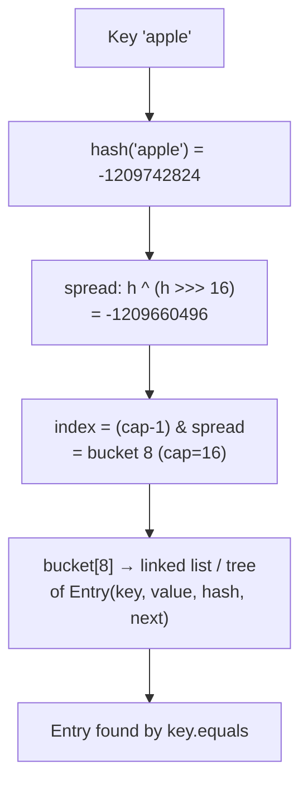
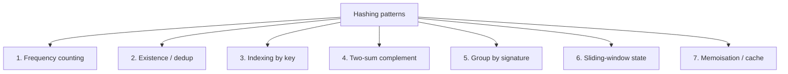

# Hashing

Hashing is **the single most-leveraged data structure technique in coding interviews**. Steve Yegge's 2008 Google-interview essay called hash tables *"arguably the single most important data structure"*, and the claim has only strengthened since. Roughly one in three FAANGM coding problems can be solved or accelerated with a hashmap or hashset; many "hard" problems reduce to "obvious once you see the hash". Mastering hashing — both the *Java HashMap mechanics* that interviewers love to probe, and the *problem patterns* hashing unlocks — is the highest single-topic ROI in the entire DSA syllabus.

This topic covers both layers: (1) how Java's `HashMap` / `HashSet` actually work under the hood (interviewers ask this verbatim at every banking + product interview in India), and (2) the **seven hashing patterns** that recur across interviews.

## Hash Maps Aren't Magic — They're Buckets + Hash Function



A hash map is an **array of buckets**, where each bucket holds the entries whose hashed keys land there. Two questions decide everything: *which bucket?* (the hash function + modulo) and *what's in the bucket?* (linked list or tree of collisions).

### Java HashMap internals — the version interviewers expect

Java 8+ HashMap design (this is the verbatim probe in 80% of Java interviews — know it cold):

- **Bucket array** is `Node<K,V>[] table`, initial capacity 16, always a power of 2.
- **Index** = `(table.length - 1) & hash`. The power-of-2 capacity lets `&` replace `%` (cheaper and works because `n-1` is all 1-bits below `n`).
- **Spread function** = `(h = key.hashCode()) ^ (h >>> 16)`. XORs the high bits down into the low bits, because the index only uses low bits — without spreading, keys with same low bits collide.
- **Collision handling**: linked list inside each bucket initially. Once a bucket grows to **TREEIFY_THRESHOLD = 8** entries (and total capacity ≥ **MIN_TREEIFY_CAPACITY = 64**), the bucket converts to a **red-black tree** for O(log n) worst-case lookup. Shrinks back to list at **UNTREEIFY_THRESHOLD = 6**.
- **Load factor** = 0.75. When `size > capacity × load_factor`, **resize** doubles the array and rehashes every entry.
- **Resize cost**: O(n) on the resize call; amortised O(1) per insertion.

```java
// Pseudo of HashMap.put — close to the real code
V put(K key, V value) {
    int hash = (key == null) ? 0 : (key.hashCode() ^ (key.hashCode() >>> 16));
    int i = (table.length - 1) & hash;
    if (table[i] == null) {
        table[i] = new Node<>(hash, key, value, null);
    } else {
        // Walk list / tree, find by equals, replace or append
        Node<K,V> p = table[i];
        while (p != null) {
            if (p.hash == hash && (p.key == key || (key != null && key.equals(p.key)))) {
                V old = p.value; p.value = value; return old;
            }
            p = p.next;
        }
        // append new node, treeify if list ≥ 8 AND capacity ≥ 64
    }
    if (++size > threshold) resize();  // double + rehash all
    return null;
}
```

### Why these constants

- **Capacity 16, power of 2**: enables `&` masking, simple resize semantics.
- **Load factor 0.75**: Java's empirical sweet spot — lower wastes memory, higher increases collisions.
- **TREEIFY_THRESHOLD 8**: with a good hash function, Poisson statistics predict bucket size 8 with probability < 10⁻⁷. If you hit 8, your hash is *probably* adversarial or your `hashCode()` is broken — treeification limits damage.
- **UNTREEIFY 6 / TREEIFY 8**: gap prevents thrashing back-and-forth on resize edges.
- **MIN_TREEIFY_CAPACITY 64**: at tiny capacities, just resize instead of treeifying.

### Worst-case behaviour

- **Pre-Java-8**: collisions degraded to O(n) per operation. With adversarial inputs (deliberately-colliding keys), an attacker could DoS a Java server by sending requests that all hashed to the same bucket.
- **Java 8+**: treeification caps worst-case at O(log n). Still vulnerable to non-Comparable keys (treeification needs `Comparable` to balance the tree; falls back to `System.identityHashCode` if not).

This is the answer to *"What's the worst case of HashMap.put?"* — **O(log n) post-Java-8 if keys are Comparable, O(n) otherwise.**

### HashMap vs Hashtable vs ConcurrentHashMap vs synchronizedMap

| | HashMap | Hashtable | ConcurrentHashMap | synchronizedMap |
|---|---|---|---|---|
| **Thread-safe** | No | Yes | Yes | Yes |
| **Lock granularity** | — | whole map | bucket-level (Java 8+) / segment (Java 7) | whole map |
| **Null keys** | Yes (1) | No | No | Yes (1) |
| **Null values** | Yes | No | No | Yes |
| **Iterator** | Fail-fast | Fail-fast | Weakly consistent | Fail-fast |
| **Performance under contention** | N/A | Bad (single lock) | Excellent | Bad (single lock) |
| **When to use** | Single-threaded | Never (legacy) | Multi-threaded production | Rare; CHM is better |

**ConcurrentHashMap evolution**:
- Java 7: 16 **Segments**, each a mini HashMap with its own lock. Concurrency = segment count.
- Java 8+: **bucket-level CAS** for empty-bucket inserts + **`synchronized` on the bucket head** for collisions + tree-bucket for chain ≥ 8. Lock granularity is per-bucket, not per-segment — much higher concurrency.

Why CHM rejects nulls: in a concurrent setting, `m.get(k) == null` is ambiguous — is the key absent, or present-with-null? Java chose to forbid the ambiguity.

### HashSet = HashMap with PRESENT sentinel

```java
// Real Java HashSet.add — uses an internal HashMap<E, Object> with a dummy PRESENT value
public boolean add(E e) {
    return map.put(e, PRESENT) == null;
}
```

So HashSet inherits HashMap's properties: O(1) average, O(log n) worst-case, fail-fast iterator, null-allowed.

## The Seven Hashing Patterns



### Pattern 1 — Frequency counting

```java
// "Top K Frequent Elements"
public int[] topKFrequent(int[] nums, int k) {
    Map<Integer, Integer> freq = new HashMap<>();
    for (int n : nums) freq.merge(n, 1, Integer::sum);
    PriorityQueue<int[]> heap = new PriorityQueue<>((a, b) -> a[1] - b[1]);
    for (var e : freq.entrySet()) {
        heap.offer(new int[]{e.getKey(), e.getValue()});
        if (heap.size() > k) heap.poll();
    }
    int[] result = new int[k];
    for (int i = k - 1; i >= 0; i--) result[i] = heap.poll()[0];
    return result;
}
// O(n log k) time, O(n + k) space
```

`Map.merge(k, 1, Integer::sum)` is the cleanest frequency-count idiom. Beats `getOrDefault + put`.

### Pattern 2 — Existence / dedup

```java
// "Contains Duplicate"
public boolean containsDuplicate(int[] nums) {
    Set<Integer> seen = new HashSet<>(nums.length);
    for (int n : nums) if (!seen.add(n)) return true;
    return false;
}
// O(n) time, O(n) space
```

`Set.add` returns `false` if already present — saves the `contains` + `add` pair.

### Pattern 3 — Indexing by key

```java
// "First Unique Character in a String"
public int firstUniqChar(String s) {
    Map<Character, Integer> idx = new LinkedHashMap<>();        // preserves order
    Set<Character> seen = new HashSet<>();
    for (int i = 0; i < s.length(); i++) {
        char c = s.charAt(i);
        if (seen.contains(c)) { idx.remove(c); }
        else { idx.put(c, i); seen.add(c); }
    }
    return idx.isEmpty() ? -1 : idx.values().iterator().next();
}
// O(n) time, O(min(n, alphabet)) space
```

### Pattern 4 — Two-sum complement (one of the most-asked interview patterns)

```java
// "Two Sum" — see also T01
public int[] twoSum(int[] nums, int target) {
    Map<Integer, Integer> seen = new HashMap<>();
    for (int i = 0; i < nums.length; i++) {
        Integer j = seen.get(target - nums[i]);
        if (j != null) return new int[]{j, i};
        seen.put(nums[i], i);
    }
    return new int[]{-1, -1};
}
```

### Pattern 5 — Group by signature

```java
// "Group Anagrams"
public List<List<String>> groupAnagrams(String[] strs) {
    Map<String, List<String>> groups = new HashMap<>();
    for (String s : strs) {
        char[] arr = s.toCharArray();
        Arrays.sort(arr);
        String key = new String(arr);
        groups.computeIfAbsent(key, k -> new ArrayList<>()).add(s);
    }
    return new ArrayList<>(groups.values());
}
// O(n · k log k) time where k is max string length
```

**Faster variant**: encode the signature as a 26-letter frequency string instead of sorting → O(n · k).

### Pattern 6 — Sliding-window state

```java
// "Longest Substring Without Repeating Characters" — also in T01
public int lengthOfLongestSubstring(String s) {
    Map<Character, Integer> last = new HashMap<>();
    int best = 0, start = 0;
    for (int end = 0; end < s.length(); end++) {
        char c = s.charAt(end);
        if (last.containsKey(c) && last.get(c) >= start) {
            start = last.get(c) + 1;
        }
        last.put(c, end);
        best = Math.max(best, end - start + 1);
    }
    return best;
}
```

### Pattern 7 — Memoisation / cache

```java
// "Climbing Stairs" — recursion + memo
private Map<Integer, Integer> memo = new HashMap<>();
public int climbStairs(int n) {
    if (n <= 2) return n;
    Integer cached = memo.get(n);
    if (cached != null) return cached;
    int result = climbStairs(n - 1) + climbStairs(n - 2);
    memo.put(n, result);
    return result;
}
// O(n) time + space; turns O(2ⁿ) naive recursion into O(n)
```

## When NOT To Hash

- **Sorted input**: two pointers usually beat hashing (same time, O(1) space vs O(n)).
- **Range queries**: prefix sums or segment trees, not hashing.
- **Ordered iteration**: TreeMap, not HashMap.
- **Heap problems**: PriorityQueue, though often combined with hashing.
- **Very small alphabets**: `int[26]` or bitmask, not HashMap (constant-factor 10×).

## Java Hashing Pitfalls

### equals / hashCode contract

If you override `equals`, you **must** override `hashCode`. The contract:

1. `a.equals(b)` ⇒ `a.hashCode() == b.hashCode()` (consistency).
2. `a.equals(a)` (reflexivity).
3. `a.equals(b)` ⇒ `b.equals(a)` (symmetry).
4. Multiple invocations return the same value while the object is unchanged.

Violating (1) breaks `HashSet` / `HashMap` — `set.add(a); set.contains(b)` returns false even though `a.equals(b)`.

```java
// Correct
@Override public boolean equals(Object o) {
    if (this == o) return true;
    if (!(o instanceof Point)) return false;
    Point p = (Point) o;
    return x == p.x && y == p.y;
}
@Override public int hashCode() {
    return Objects.hash(x, y);
}
```

### Mutable keys

**Never mutate a key after inserting it into a HashMap.** Mutation changes `hashCode()`, the key lands in the wrong bucket, the lookup fails — silently. Use immutable keys (Strings, primitives, records, frozen value objects).

### `(a == b)` on `Integer`

```java
Integer a = 127, b = 127;
System.out.println(a == b);  // true — both come from the IntegerCache
Integer c = 128, d = 128;
System.out.println(c == d);  // false — outside cache range
```

Always `.equals()` on boxed types, or use primitive `int`.

### Iteration order

- `HashMap` — unspecified, may change on resize.
- `LinkedHashMap` — insertion order (or access order with `accessOrder=true`).
- `TreeMap` — sorted by key.

If you need predictable iteration, choose the right map.

## Common Mistakes That Score Low

- **Claiming HashMap is O(1) without qualifying "average"**.
- **Not knowing the load factor 0.75 + capacity 16 + treeify-at-8** constants.
- **Saying HashMap is thread-safe** — it is emphatically not.
- **Overriding `equals` but not `hashCode`** (or vice versa).
- **Using `HashMap<Character, Integer>` for lowercase-letter frequency** — `int[26]` is 5-10× faster.
- **`map.get(k); map.put(k, ...)`** when `map.compute(k, ...)` or `merge` does it in one lookup.

## Sources & Further Reading

- [Java HashMap source (OpenJDK)](https://github.com/openjdk/jdk/blob/master/src/java.base/share/classes/java/util/HashMap.java) — read it once
- [JEP — HashMap Java 8 changes](https://openjdk.org/projects/jdk8/) — the treeification design
- [InterviewBit — HashMap interview questions](https://www.interviewbit.com/hashmap-interview-questions/)
- [Javarevisited — ConcurrentHashMap Java 7 vs Java 8](https://javarevisited.blogspot.com/2017/08/top-10-java-concurrenthashmap-interview.html)
- [HowToDoInJava — HashMap deep dive](https://howtodoinjava.com/interview-questions/hashmap-concurrenthashmap-interview-questions/)

## Practice

1. **Two Sum** — Pattern 4.
2. **Contains Duplicate / Contains Duplicate II / III** — Pattern 2 with window variants.
3. **Top K Frequent Elements** — Pattern 1.
4. **Group Anagrams** — Pattern 5.
5. **Valid Anagram** — Frequency count with int[26].
6. **First Unique Character** — Pattern 3.
7. **Longest Substring Without Repeating Characters** — Pattern 6.
8. **Subarray Sum Equals K** — Prefix sum + hashing.
9. **Longest Consecutive Sequence** — HashSet for O(n) (skip non-sequence-starts).
10. **Encode and Decode TinyURL** — Hashing for ID generation.
11. **Design HashMap** — Implement HashMap from scratch with chaining.
12. **LRU Cache** — LinkedHashMap with `removeEldestEntry`.
13. **Insert Delete GetRandom O(1)** — HashMap + ArrayList; swap-with-last on delete.
14. **Word Pattern** — Two-way hashmap for bijective check.

## Detailed Worked Solutions

Hashing-specific full code for problems not already worked in [T01](./T01-arrays-and-strings.md).

### 1. Contains Duplicate II (within K distance)

**Problem.** Return true if there exist indices `i ≠ j` such that `nums[i] == nums[j]` AND `|i - j| <= k`.

```java
public boolean containsNearbyDuplicate(int[] nums, int k) {
    Map<Integer, Integer> last = new HashMap<>();
    for (int i = 0; i < nums.length; i++) {
        Integer prev = last.get(nums[i]);
        if (prev != null && i - prev <= k) return true;
        last.put(nums[i], i);
    }
    return false;
}
// O(n) time, O(min(n, k)) space (last only stores window-relevant)
```

**Sliding-window variant** (saves memory when k << n): `HashSet` of last-k values; add current + remove leftmost when window slides past:

```java
public boolean containsNearbyDuplicate(int[] nums, int k) {
    Set<Integer> window = new HashSet<>();
    for (int i = 0; i < nums.length; i++) {
        if (i > k) window.remove(nums[i - k - 1]);
        if (!window.add(nums[i])) return true;
    }
    return false;
}
```

### 2. Top K Frequent Elements

**Problem.** Given `int[] nums` and `k`, return the k most-frequent values.

```java
public int[] topKFrequent(int[] nums, int k) {
    Map<Integer, Integer> freq = new HashMap<>();
    for (int n : nums) freq.merge(n, 1, Integer::sum);
    PriorityQueue<int[]> heap = new PriorityQueue<>(Comparator.comparingInt(a -> a[1]));
    for (var e : freq.entrySet()) {
        heap.offer(new int[]{e.getKey(), e.getValue()});
        if (heap.size() > k) heap.poll();
    }
    int[] result = new int[k];
    for (int i = k - 1; i >= 0; i--) result[i] = heap.poll()[0];
    return result;
}
// O(n log k) time, O(n + k) space
```

**Faster bucket-sort variant — O(n)** when k can be up to n:

```java
public int[] topKFrequent(int[] nums, int k) {
    Map<Integer, Integer> freq = new HashMap<>();
    for (int n : nums) freq.merge(n, 1, Integer::sum);
    List<Integer>[] buckets = new List[nums.length + 1];      // index = frequency
    for (var e : freq.entrySet()) {
        int f = e.getValue();
        if (buckets[f] == null) buckets[f] = new ArrayList<>();
        buckets[f].add(e.getKey());
    }
    int[] result = new int[k];
    int idx = 0;
    for (int f = buckets.length - 1; f >= 0 && idx < k; f--) {
        if (buckets[f] == null) continue;
        for (int v : buckets[f]) { result[idx++] = v; if (idx == k) break; }
    }
    return result;
}
// O(n) time, O(n) space
```

### 3. First Unique Character in a String

**Problem.** Return the index of the first non-repeating character in `s`; `-1` if none.

```java
public int firstUniqChar(String s) {
    int[] count = new int[26];
    for (int i = 0; i < s.length(); i++) count[s.charAt(i) - 'a']++;
    for (int i = 0; i < s.length(); i++) if (count[s.charAt(i) - 'a'] == 1) return i;
    return -1;
}
// O(n) time, O(1) space (26 alphabet)
```

**For unicode**: switch to `HashMap<Character, Integer>` and `LinkedHashMap` to preserve insertion order, or first-pass-count + second-pass-find as above.

### 4. Longest Consecutive Sequence

**Problem.** Given an unsorted `int[] nums`, return the length of the longest consecutive elements sequence (e.g., `[100, 4, 200, 1, 3, 2]` → 4 for [1,2,3,4]). Required: **O(n)** average.

```java
public int longestConsecutive(int[] nums) {
    Set<Integer> set = new HashSet<>();
    for (int n : nums) set.add(n);
    int best = 0;
    for (int n : set) {
        if (!set.contains(n - 1)) {           // only start at sequence beginnings
            int curr = n, len = 1;
            while (set.contains(curr + 1)) { curr++; len++; }
            best = Math.max(best, len);
        }
    }
    return best;
}
// O(n) time (each element visited at most twice), O(n) space
```

**Why O(n)**: although the inner while looks like O(n²), we only enter the loop when `n-1` is NOT in the set — i.e., once per sequence-start. Total inner-iterations sum = n across all sequences.

### 5. LRU Cache

**Problem.** Design a data structure with `get(key)` and `put(key, value)`, both in O(1), evicting least-recently-used when capacity exceeded.

```java
class LRUCache extends LinkedHashMap<Integer, Integer> {
    private final int capacity;
    public LRUCache(int capacity) {
        super(capacity, 0.75f, true);          // accessOrder = true
        this.capacity = capacity;
    }
    public int get(int key) { return super.getOrDefault(key, -1); }
    public void put(int key, int value) { super.put(key, value); }
    @Override
    protected boolean removeEldestEntry(Map.Entry<Integer, Integer> eldest) {
        return size() > capacity;
    }
}
// O(1) get + put — LinkedHashMap does it all
```

**Hand-rolled version** (HashMap + doubly-linked list — common interview ask):

```java
class LRUCache {
    private static class Node { int k, v; Node prev, next; Node(int k, int v){this.k=k;this.v=v;} }
    private final int cap;
    private final Map<Integer, Node> map = new HashMap<>();
    private final Node head = new Node(0,0), tail = new Node(0,0);
    public LRUCache(int cap) {
        this.cap = cap;
        head.next = tail; tail.prev = head;
    }
    private void remove(Node n) { n.prev.next = n.next; n.next.prev = n.prev; }
    private void addToFront(Node n) {
        n.next = head.next; n.prev = head;
        head.next.prev = n; head.next = n;
    }
    public int get(int key) {
        Node n = map.get(key);
        if (n == null) return -1;
        remove(n); addToFront(n);
        return n.v;
    }
    public void put(int key, int value) {
        Node n = map.get(key);
        if (n != null) { n.v = value; remove(n); addToFront(n); return; }
        n = new Node(key, value);
        map.put(key, n); addToFront(n);
        if (map.size() > cap) {
            Node lru = tail.prev;
            remove(lru); map.remove(lru.k);
        }
    }
}
```

**Why doubly-linked list**: O(1) removal of any node given its reference (no scan). HashMap gives O(1) node-by-key.

### 6. Insert Delete GetRandom O(1)

**Problem.** Design a set supporting `insert`, `delete`, `getRandom` all in average O(1).

```java
class RandomizedSet {
    private final List<Integer> list = new ArrayList<>();
    private final Map<Integer, Integer> idx = new HashMap<>();  // value → list index
    private final Random rand = new Random();
    public boolean insert(int val) {
        if (idx.containsKey(val)) return false;
        idx.put(val, list.size());
        list.add(val);
        return true;
    }
    public boolean remove(int val) {
        Integer i = idx.remove(val);
        if (i == null) return false;
        int last = list.size() - 1;
        if (i != last) {
            int lastVal = list.get(last);
            list.set(i, lastVal);
            idx.put(lastVal, i);
        }
        list.remove(last);
        return true;
    }
    public int getRandom() { return list.get(rand.nextInt(list.size())); }
}
// All ops average O(1)
```

**Trick: swap-with-last on delete** — keeps the list dense so `getRandom` is just `list.get(random index)`.

### 7. Word Pattern (bijective mapping)

**Problem.** Given a pattern (`"abba"`) and a string (`"dog cat cat dog"`), return true iff word-tokens follow a **bijection** with characters.

```java
public boolean wordPattern(String pattern, String s) {
    String[] words = s.split(" ");
    if (pattern.length() != words.length) return false;
    Map<Character, String> charToWord = new HashMap<>();
    Map<String, Character> wordToChar = new HashMap<>();
    for (int i = 0; i < pattern.length(); i++) {
        char c = pattern.charAt(i);
        String w = words[i];
        if (charToWord.containsKey(c)) {
            if (!charToWord.get(c).equals(w)) return false;
        } else {
            if (wordToChar.containsKey(w)) return false;     // bijection violation
            charToWord.put(c, w);
            wordToChar.put(w, c);
        }
    }
    return true;
}
// O(n) time, O(n) space
```

**Key insight**: a one-way map check (only `char → word`) would accept `"abba"` ↔ `"dog dog dog dog"` because `a→dog` and `b→dog` are individually consistent. The reverse map enforces uniqueness in the other direction.

### 8. Design HashMap (implement from scratch)

**Problem.** Implement `MyHashMap` with `put(key, value)`, `get(key)`, `remove(key)`, all O(1) average.

```java
class MyHashMap {
    private static class Node { int k, v; Node next; Node(int k, int v){this.k=k;this.v=v;} }
    private final Node[] table = new Node[1024];
    private int bucket(int k) { return Integer.hashCode(k) & (table.length - 1); }   // power-of-2 trick
    public void put(int key, int value) {
        int i = bucket(key);
        for (Node n = table[i]; n != null; n = n.next) {
            if (n.k == key) { n.v = value; return; }
        }
        Node n = new Node(key, value);
        n.next = table[i];
        table[i] = n;
    }
    public int get(int key) {
        for (Node n = table[bucket(key)]; n != null; n = n.next) if (n.k == key) return n.v;
        return -1;
    }
    public void remove(int key) {
        int i = bucket(key);
        Node prev = null;
        for (Node n = table[i]; n != null; n = n.next) {
            if (n.k == key) {
                if (prev == null) table[i] = n.next; else prev.next = n.next;
                return;
            }
            prev = n;
        }
    }
}
// O(1) average; O(n) worst-case if all keys collide; no resize (interview shortcut)
```

**Real HashMap differences**: dynamic resize at load factor 0.75; treeify buckets at threshold 8 (covered in topic). Interview-grade hand-roll usually omits resize.

## Recap

You should now be able to:

- Explain **Java HashMap internals**: bucket array, hash spread, `(n-1) & hash` indexing, load factor 0.75, capacity 16, treeify at 8 / untreeify at 6 / MIN_TREEIFY_CAPACITY 64, resize doubles.
- Distinguish **HashMap vs Hashtable vs ConcurrentHashMap vs synchronizedMap** on thread-safety, lock granularity, null-handling, iterator semantics.
- Recall **ConcurrentHashMap evolution** Java 7 (segments) → Java 8 (bucket-level CAS + synchronized + treeify).
- Apply the **seven hashing patterns** (frequency, existence/dedup, indexing, two-sum complement, group-by-signature, sliding-window state, memoisation).
- Recognise the **equals/hashCode contract** and what breaks if violated.
- Avoid the **mutable-key trap, Integer cache trap, HashMap-is-thread-safe** misconceptions.
- Use the **right map for the workload** (HashMap for unordered, LinkedHashMap for insertion order or LRU, TreeMap for sorted).
- Talk through worst-case complexity: **O(log n) post-Java-8 if keys are Comparable, O(n) otherwise**.

## Next

Continue to [Two Pointers & Sliding Window](./T03-two-pointers-and-sliding-window.md).
