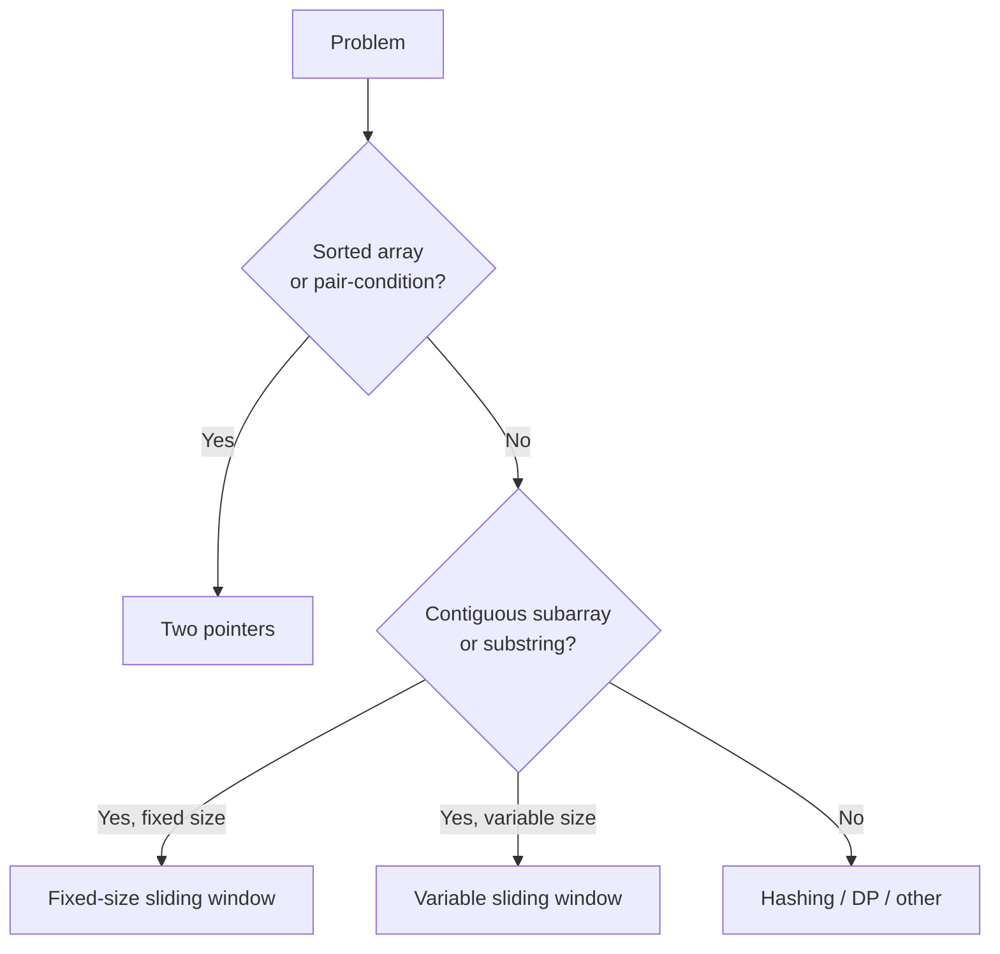

# Two Pointers & Sliding Window

Two-pointer and sliding-window techniques are **the second-most-leveraged pattern family in interviews after hashing**. They let you replace O(n²) brute-force scans with O(n) walks by maintaining a "window" or "pair of cursors" over the input, exploiting monotonic properties. Half of all "longest/shortest subarray with property X" problems collapse to sliding window; most "find pair in sorted array" problems are two-pointer. The patterns are small in number but apply to dozens of interview prompts.

This topic covers the two pattern families, their precise applicability rules, and the Java idioms for fixed-window, variable-window, and two-pointer.

## When To Reach For Each



**Two pointers**: usually two cursors moving toward each other (or both moving forward at different rates) over a sorted or monotonic structure.

**Sliding window**: one cursor expands, another shrinks; maintain a state about the current window; track best/longest/shortest.

The two are cousins — sliding window IS a flavour of two pointer where both move in the same direction.

## Two Pointers — The Three Flavours

### Flavour 1: Converging pointers on sorted input

```java
// "Two Sum II — Input Array Sorted"
public int[] twoSum(int[] nums, int target) {
    int lo = 0, hi = nums.length - 1;
    while (lo < hi) {
        int sum = nums[lo] + nums[hi];
        if (sum == target) return new int[]{lo + 1, hi + 1};
        else if (sum < target) lo++;
        else hi--;
    }
    return new int[]{-1, -1};
}
// O(n) time, O(1) space
```

The monotonic property: when sum < target, increasing `lo` is the only way to reach target (decreasing `hi` makes sum smaller).

**Variants**: 3Sum (fix one, two-pointer the rest), 3Sum Closest, 4Sum, Container With Most Water.

```java
// "Container With Most Water"
public int maxArea(int[] height) {
    int lo = 0, hi = height.length - 1, best = 0;
    while (lo < hi) {
        int area = Math.min(height[lo], height[hi]) * (hi - lo);
        best = Math.max(best, area);
        if (height[lo] < height[hi]) lo++; else hi--;
    }
    return best;
}
// O(n) time, O(1) space
```

The insight: the shorter side limits area, so moving the taller side cannot improve area — always move the shorter side.

### Flavour 2: Same-direction pointers (fast & slow)

```java
// "Remove Duplicates from Sorted Array" — return new length, in-place
public int removeDuplicates(int[] nums) {
    if (nums.length == 0) return 0;
    int write = 1;
    for (int read = 1; read < nums.length; read++) {
        if (nums[read] != nums[read - 1]) {
            nums[write++] = nums[read];
        }
    }
    return write;
}
// O(n) time, O(1) space
```

`read` walks the input; `write` advances only on "kept" elements. Pattern: read ≥ write always.

### Flavour 3: Cycle detection (Floyd's tortoise + hare)

```java
// "Linked List Cycle"
public boolean hasCycle(ListNode head) {
    ListNode slow = head, fast = head;
    while (fast != null && fast.next != null) {
        slow = slow.next;
        fast = fast.next.next;
        if (slow == fast) return true;
    }
    return false;
}
// O(n) time, O(1) space
```

Fast moves 2× speed; if there's a cycle, fast catches slow inside it. (Linked-list specific — see [T06](./T06-linked-lists.md).)

## Sliding Window — The Two Flavours

### Fixed-size window

```java
// "Maximum Average Subarray I" — fixed window size k
public double findMaxAverage(int[] nums, int k) {
    int sum = 0;
    for (int i = 0; i < k; i++) sum += nums[i];
    int best = sum;
    for (int i = k; i < nums.length; i++) {
        sum += nums[i] - nums[i - k];           // slide: add new, remove old
        best = Math.max(best, sum);
    }
    return best / (double) k;
}
// O(n) time, O(1) space
```

Pattern: initialise window of size k, then slide one step at a time, updating state in O(1) per step.

### Variable-size window (expand-shrink)

```java
// "Minimum Size Subarray Sum" — smallest contiguous sum ≥ target
public int minSubArrayLen(int target, int[] nums) {
    int lo = 0, sum = 0, best = Integer.MAX_VALUE;
    for (int hi = 0; hi < nums.length; hi++) {
        sum += nums[hi];                          // expand
        while (sum >= target) {                   // shrink while still valid
            best = Math.min(best, hi - lo + 1);
            sum -= nums[lo++];
        }
    }
    return best == Integer.MAX_VALUE ? 0 : best;
}
// O(n) time — each element added once and removed at most once
```

Two-cursor expand-then-shrink. The `hi` cursor walks forward; `lo` advances only when the window can shrink while remaining valid.

### Variable window with state map

```java
// "Longest Substring Without Repeating Characters"
public int lengthOfLongestSubstring(String s) {
    Map<Character, Integer> last = new HashMap<>();
    int lo = 0, best = 0;
    for (int hi = 0; hi < s.length(); hi++) {
        char c = s.charAt(hi);
        if (last.containsKey(c) && last.get(c) >= lo) {
            lo = last.get(c) + 1;                 // jump past last occurrence
        }
        last.put(c, hi);
        best = Math.max(best, hi - lo + 1);
    }
    return best;
}
// O(n) time, O(min(n, alphabet)) space
```

When the window contains a duplicate, jump `lo` past the duplicate's previous position.

### Variable window with frequency state

```java
// "Minimum Window Substring" — smallest window of s containing all chars of t
public String minWindow(String s, String t) {
    Map<Character, Integer> need = new HashMap<>();
    for (char c : t.toCharArray()) need.merge(c, 1, Integer::sum);
    int needed = need.size(), formed = 0;
    Map<Character, Integer> window = new HashMap<>();
    int lo = 0, bestLen = Integer.MAX_VALUE, bestLo = 0;
    for (int hi = 0; hi < s.length(); hi++) {
        char c = s.charAt(hi);
        window.merge(c, 1, Integer::sum);
        if (need.containsKey(c) && window.get(c).equals(need.get(c))) formed++;
        while (formed == needed) {
            if (hi - lo + 1 < bestLen) { bestLen = hi - lo + 1; bestLo = lo; }
            char d = s.charAt(lo++);
            window.merge(d, -1, Integer::sum);
            if (need.containsKey(d) && window.get(d) < need.get(d)) formed--;
        }
    }
    return bestLen == Integer.MAX_VALUE ? "" : s.substring(bestLo, bestLo + bestLen);
}
// O(|s| + |t|) time, O(|s| + |t|) space
```

The hardest template: window + need-map + formed-counter. Used for "smallest window containing all", "permutation in string", "find all anagrams" family.

## The Sliding-Window Template

```text
initialise lo = 0, state = empty, best = bad-default
for hi in 0..n-1:
    add nums[hi] / s.charAt(hi) to state
    while window invalid OR shrinkable while still valid:
        update best (if window-valid)
        remove nums[lo] / s.charAt(lo) from state
        lo++
    update best (if outside while loop is the right place)
return best
```

The two key decisions:
1. **What's the validity condition?** (sum ≥ target, no duplicates, formed == needed)
2. **Where do you update `best`?** Inside the shrink loop (for "smallest"), or after expanding (for "largest" — when the while loop ensures validity, the max is outside).

## When Sliding Window DOESN'T Apply

- **Subarrays with negatives where you need a target sum** — window doesn't monotonically grow/shrink. Use prefix sum + hashmap instead.
- **Non-contiguous subsequences** — sliding window is contiguous only.
- **Need all subarrays of size k**, not just min/max — sliding window gives min/max in O(n) but enumerating all is O(n·k).

## Common Mistakes That Score Low

- **Confusing "subarray" (contiguous) with "subsequence" (any order)**. Subarray → window; subsequence → DP or recursion.
- **Wrong while-loop condition** — invalidates the window or fails to shrink.
- **Updating `best` in the wrong place** — outside the shrink loop for "smallest" gives wrong answer.
- **Forgetting to remove from state on shrink** — window state diverges from actual window.
- **Off-by-one on window length** — `hi - lo + 1`, not `hi - lo`.

## Worked End-To-End Example

**Problem**: "Longest Substring with At Most K Distinct Characters."

```java
public int lengthOfLongestSubstringKDistinct(String s, int k) {
    if (k == 0) return 0;
    Map<Character, Integer> count = new HashMap<>();
    int lo = 0, best = 0;
    for (int hi = 0; hi < s.length(); hi++) {
        count.merge(s.charAt(hi), 1, Integer::sum);
        while (count.size() > k) {
            char d = s.charAt(lo++);
            if (count.merge(d, -1, Integer::sum) == 0) count.remove(d);
        }
        best = Math.max(best, hi - lo + 1);
    }
    return best;
}
// O(n) time, O(k) space
```

**Talking through**: *"Sliding window with a frequency map of the current window's chars. Window invalid when distinct count > k; shrink by advancing `lo` until valid again. Update best after the shrink (since we want the largest valid window). Edge case: k=0 returns 0. Final: O(n) time, O(k) space."*

## Sources & Further Reading

- [LeetCode Sliding Window tag](https://leetcode.com/tag/sliding-window/)
- [Educative — Grokking the Coding Interview](https://www.educative.io/courses/grokking-the-coding-interview)
- [Tech Interview Handbook — Two Pointers](https://www.techinterviewhandbook.org/algorithms/two-pointers/)

## Practice

1. **Two Sum II (sorted)** — converging two-pointer.
2. **3Sum** — fix-one + two-pointer.
3. **Container With Most Water** — converging with monotonic insight.
4. **Trapping Rain Water** — two-pointer with max-from-left + max-from-right.
5. **Remove Duplicates from Sorted Array** — same-direction.
6. **Move Zeros** — same-direction (also in T01).
7. **Maximum Average Subarray I** — fixed window.
8. **Minimum Size Subarray Sum** — variable window.
9. **Longest Substring Without Repeating Characters** — variable + state map.
10. **Minimum Window Substring** — variable + need-formed counter.
11. **Permutation in String** — variable window with frequency comparison.
12. **Find All Anagrams in a String** — fixed window with frequency comparison.
13. **Longest Substring with At Most K Distinct Characters** — variable + frequency map size.
14. **Fruit Into Baskets** — same as "at most 2 distinct".
15. **Sliding Window Maximum** — monotonic deque (covered in T07 Stacks/Queues).

## Detailed Worked Solutions

### 1. Remove Duplicates from Sorted Array

**Problem.** In-place remove duplicates; return new length. Elements beyond new length don't matter.

```java
public int removeDuplicates(int[] nums) {
    if (nums.length == 0) return 0;
    int write = 1;
    for (int read = 1; read < nums.length; read++) {
        if (nums[read] != nums[read - 1]) nums[write++] = nums[read];
    }
    return write;
}
// O(n) time, O(1) space
```

**Walkthrough on `[1,1,2,2,3]`**: write=1, read=1→nums[1]==nums[0] skip; read=2→nums[2]=2, write=2; read=3→skip; read=4→nums[3]=3, write=3. Returns 3; array=[1,2,3,2,3].

### 2. Maximum Average Subarray I (fixed window)

**Problem.** Find the contiguous subarray of length `k` with maximum average.

```java
public double findMaxAverage(int[] nums, int k) {
    int sum = 0;
    for (int i = 0; i < k; i++) sum += nums[i];
    int best = sum;
    for (int i = k; i < nums.length; i++) {
        sum += nums[i] - nums[i - k];
        best = Math.max(best, sum);
    }
    return best / (double) k;
}
// O(n) time, O(1) space
```

**Key trick**: maintain `sum` incrementally — add new element, remove old leftmost. O(1) per slide.

### 3. Minimum Size Subarray Sum

**Problem.** Find the minimal length of a contiguous subarray with sum ≥ `target`. Return 0 if none.

```java
public int minSubArrayLen(int target, int[] nums) {
    int lo = 0, sum = 0, best = Integer.MAX_VALUE;
    for (int hi = 0; hi < nums.length; hi++) {
        sum += nums[hi];
        while (sum >= target) {
            best = Math.min(best, hi - lo + 1);
            sum -= nums[lo++];
        }
    }
    return best == Integer.MAX_VALUE ? 0 : best;
}
// O(n) time — each element added once + removed at most once
```

**Walkthrough on `nums=[2,3,1,2,4,3], target=7`**:
- hi=0 sum=2
- hi=1 sum=5
- hi=2 sum=6
- hi=3 sum=8 → shrink: best=4 (len 4), sum=6, lo=1 → loop exits (sum<7)
- hi=4 sum=10 → best=4, sum=8, lo=2 → best=3 (len 3), sum=7, lo=3 → best=2 (len 2), sum=6, lo=4 → exit
- hi=5 sum=9 → best=2 (len 2), sum=6 → exit. Return 2 (subarray [4,3]).

### 4. Minimum Window Substring (the hardest sliding window)

**Problem.** Find the smallest substring of `s` that contains every character of `t` (with multiplicity).

```java
public String minWindow(String s, String t) {
    if (t.length() > s.length()) return "";
    Map<Character, Integer> need = new HashMap<>();
    for (char c : t.toCharArray()) need.merge(c, 1, Integer::sum);
    int needed = need.size(), formed = 0;
    Map<Character, Integer> window = new HashMap<>();
    int lo = 0, bestLen = Integer.MAX_VALUE, bestLo = 0;
    for (int hi = 0; hi < s.length(); hi++) {
        char c = s.charAt(hi);
        window.merge(c, 1, Integer::sum);
        if (need.containsKey(c) && window.get(c).intValue() == need.get(c).intValue()) formed++;
        while (formed == needed) {
            if (hi - lo + 1 < bestLen) { bestLen = hi - lo + 1; bestLo = lo; }
            char d = s.charAt(lo++);
            window.merge(d, -1, Integer::sum);
            if (need.containsKey(d) && window.get(d) < need.get(d)) formed--;
        }
    }
    return bestLen == Integer.MAX_VALUE ? "" : s.substring(bestLo, bestLo + bestLen);
}
// O(|s| + |t|) time, O(|s| + |t|) space
```

**Walkthrough on `s="ADOBECODEBANC", t="ABC"`**:
- need = {A:1, B:1, C:1}, needed=3.
- Expand until `formed==3`: window `"ADOBEC"` has all → record best.
- Shrink from left: remove `A` → formed=2 → expand again.
- Eventually best = `"BANC"` (length 4).

**Critical**: `.intValue()` comparison avoids `Integer == Integer` cache trap.

### 5. Permutation in String (sliding window with frequency comparison)

**Problem.** Return true if `s2` contains any permutation of `s1` as a substring.

```java
public boolean checkInclusion(String s1, String s2) {
    if (s1.length() > s2.length()) return false;
    int[] need = new int[26], have = new int[26];
    for (char c : s1.toCharArray()) need[c - 'a']++;
    int k = s1.length();
    for (int i = 0; i < s2.length(); i++) {
        have[s2.charAt(i) - 'a']++;
        if (i >= k) have[s2.charAt(i - k) - 'a']--;
        if (Arrays.equals(have, need)) return true;
    }
    return false;
}
// O(n × 26) ≈ O(n) time, O(1) space
```

**Why `Arrays.equals` on 26-element arrays is OK**: 26 is constant; total O(n).

### 6. Find All Anagrams in a String

**Problem.** Return all starting indices where any anagram of `p` is a substring of `s`.

```java
public List<Integer> findAnagrams(String s, String p) {
    List<Integer> result = new ArrayList<>();
    if (s.length() < p.length()) return result;
    int[] need = new int[26], have = new int[26];
    for (char c : p.toCharArray()) need[c - 'a']++;
    int k = p.length();
    for (int i = 0; i < s.length(); i++) {
        have[s.charAt(i) - 'a']++;
        if (i >= k) have[s.charAt(i - k) - 'a']--;
        if (i >= k - 1 && Arrays.equals(have, need)) result.add(i - k + 1);
    }
    return result;
}
// O(n) time, O(1) space (26 alphabet)
```

### 7. Longest Substring with At Most K Distinct Characters

**Problem.** Length of longest substring containing ≤ k distinct characters.

```java
public int lengthOfLongestSubstringKDistinct(String s, int k) {
    if (k == 0) return 0;
    Map<Character, Integer> count = new HashMap<>();
    int lo = 0, best = 0;
    for (int hi = 0; hi < s.length(); hi++) {
        count.merge(s.charAt(hi), 1, Integer::sum);
        while (count.size() > k) {
            char d = s.charAt(lo++);
            if (count.merge(d, -1, Integer::sum) == 0) count.remove(d);
        }
        best = Math.max(best, hi - lo + 1);
    }
    return best;
}
// O(n) time, O(k) space
```

**Edge case**: `k = 0` → return 0 (no characters allowed).

### 8. Fruit Into Baskets (k=2 variant)

**Problem.** Equivalent to "longest substring with at most 2 distinct" — return max length.

```java
public int totalFruit(int[] fruits) {
    Map<Integer, Integer> count = new HashMap<>();
    int lo = 0, best = 0;
    for (int hi = 0; hi < fruits.length; hi++) {
        count.merge(fruits[hi], 1, Integer::sum);
        while (count.size() > 2) {
            int d = fruits[lo++];
            if (count.merge(d, -1, Integer::sum) == 0) count.remove(d);
        }
        best = Math.max(best, hi - lo + 1);
    }
    return best;
}
// O(n) time, O(1) space (at most 3 entries in map)
```

**Same pattern as problem 7 with k=2 hardcoded** — pattern recognition matters more than memorising each problem.

## Recap

You should now be able to:

- Pick between **two pointers, fixed window, and variable window** for any "subarray / substring with property" prompt.
- Apply the **three two-pointer flavours**: converging (sorted), same-direction (read/write), Floyd's cycle (slow/fast).
- Apply the **two sliding-window flavours**: fixed-size (slide by one) and variable-size (expand-shrink).
- Use the **standard variable-window template** (lo + hi + state + while-invalid shrink + update best).
- Handle the **frequency-state variant** (need map + formed counter) for the "minimum window containing all" family.
- Recognise when **sliding window does NOT apply** (negatives + target sum, subsequences, all-subarrays-of-size-k).
- Avoid the **common mistakes** (subarray vs subsequence, wrong shrink condition, wrong update-best placement, off-by-one length).

## Next

Continue to [Recursion & Backtracking](./T04-recursion-and-backtracking.md).
