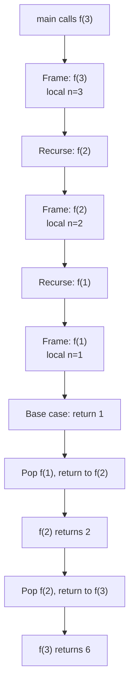
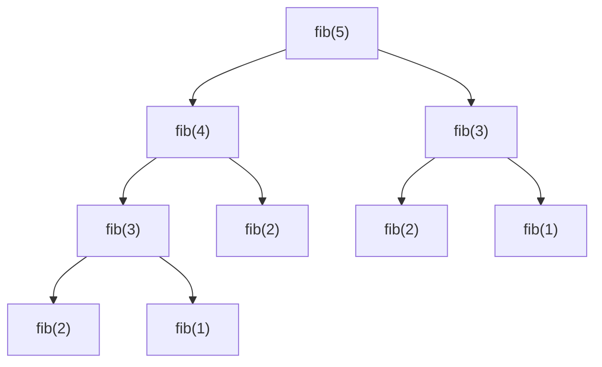

# Recursion & Backtracking

Recursion is the mental model behind half of the algorithm syllabus — trees, graphs, DP, divide-and-conquer all reduce to "what's the recursive structure?". Backtracking is recursion with **state mutation and undo**: explore one branch, undo, explore the next. The two patterns together cover combinatorial generation (subsets, permutations, combinations), constraint-satisfaction (N-Queens, Sudoku), and any "enumerate all possible Xs" prompt. Mastering them is essential for the harder coding rounds at FAANGM senior loops.

This topic walks recursion mechanics (stack, base case, return type), the four canonical backtracking templates (subsets, permutations, combinations, partition), pruning, and the gotchas (recursion-stack overflow, shared mutable state, dedup of duplicate inputs).

## Recursion Mechanics — What Actually Happens



Each recursive call pushes a **stack frame** with its own locals. The JVM stack is finite (default ~512 KB → ~10k-50k frames for typical Java methods). Deep recursion → **`StackOverflowError`**. Tail-call optimisation: Java does NOT do it. Convert to iteration for very deep recursion (or use explicit `Deque` as your own stack).

### The three pieces of every recursive function

1. **Base case** — when does recursion stop?
2. **Recursive case** — how do we shrink the problem?
3. **Combination** — how do we combine sub-results?

```java
// Factorial — three pieces visible
int fact(int n) {
    if (n <= 1) return 1;           // base case
    return n * fact(n - 1);         // recurse on n-1, combine via *
}
```

### Tracing recursion: the recursion tree

For `fib(5)`:



The tree's **leaves** are base cases. The **height** is recursion depth (stack space). The **total node count** is recursive call count (time). Naive `fib(n)` has 2ⁿ nodes — exponential. With memoisation, each `fib(k)` runs once, giving O(n).

## Recursion Patterns

### Pattern 1 — Linear recursion

```java
// Sum 1..n
int sum(int n) {
    if (n == 0) return 0;
    return n + sum(n - 1);
}
// O(n) time, O(n) stack space
```

### Pattern 2 — Divide and conquer

```java
// Merge sort
void sort(int[] a, int lo, int hi) {
    if (hi - lo <= 1) return;
    int mid = (lo + hi) / 2;
    sort(a, lo, mid);
    sort(a, mid, hi);
    merge(a, lo, mid, hi);
}
// T(n) = 2T(n/2) + O(n) → O(n log n)
```

### Pattern 3 — Multi-branch recursion (combinatorial)

```java
// Count paths in a grid (only right/down)
int paths(int row, int col, int m, int n) {
    if (row == m - 1 && col == n - 1) return 1;
    if (row >= m || col >= n) return 0;
    return paths(row + 1, col, m, n) + paths(row, col + 1, m, n);
}
// O(2^(m+n)) without memo; O(m·n) with memo
```

### Pattern 4 — Recursion with memo (top-down DP)

See [T12 Dynamic Programming](./T12-dynamic-programming.md).

## Backtracking — Recursion + State + Undo

```mermaid
flowchart TB
  S[State at level k] --> C[Choose option]
  C --> R[Recurse with new state]
  R --> U[Undo choice (restore state)]
  U --> N{More options?}
  N -->|Yes| C
  N -->|No| Ret[Return to caller]
```

The pattern: maintain a *path* (the current partial solution), recurse to extend it, and on return, **undo the extension** so the next iteration starts from the original state.

### Template 1 — Subsets (2ⁿ subsets)

```java
public List<List<Integer>> subsets(int[] nums) {
    List<List<Integer>> result = new ArrayList<>();
    backtrack(nums, 0, new ArrayList<>(), result);
    return result;
}
private void backtrack(int[] nums, int start, List<Integer> path, List<List<Integer>> result) {
    result.add(new ArrayList<>(path));              // every state is a valid subset
    for (int i = start; i < nums.length; i++) {
        path.add(nums[i]);                          // choose
        backtrack(nums, i + 1, path, result);       // recurse
        path.remove(path.size() - 1);               // undo
    }
}
// O(n · 2ⁿ) time (2ⁿ subsets × O(n) to copy each), O(n) stack space
```

`new ArrayList<>(path)` is essential — otherwise all the lists in `result` reference the same mutating `path`.

### Template 2 — Permutations (n! permutations)

```java
public List<List<Integer>> permute(int[] nums) {
    List<List<Integer>> result = new ArrayList<>();
    boolean[] used = new boolean[nums.length];
    backtrack(nums, used, new ArrayList<>(), result);
    return result;
}
private void backtrack(int[] nums, boolean[] used, List<Integer> path, List<List<Integer>> result) {
    if (path.size() == nums.length) {
        result.add(new ArrayList<>(path));
        return;
    }
    for (int i = 0; i < nums.length; i++) {
        if (used[i]) continue;
        used[i] = true;
        path.add(nums[i]);
        backtrack(nums, used, path, result);
        path.remove(path.size() - 1);
        used[i] = false;
    }
}
// O(n · n!) time, O(n) stack space
```

### Template 3 — Combinations (C(n, k))

```java
public List<List<Integer>> combine(int n, int k) {
    List<List<Integer>> result = new ArrayList<>();
    backtrack(1, n, k, new ArrayList<>(), result);
    return result;
}
private void backtrack(int start, int n, int k, List<Integer> path, List<List<Integer>> result) {
    if (path.size() == k) {
        result.add(new ArrayList<>(path));
        return;
    }
    for (int i = start; i <= n; i++) {
        path.add(i);
        backtrack(i + 1, n, k, path, result);
        path.remove(path.size() - 1);
    }
}
// O(C(n, k) · k) time
```

### Template 4 — Partition / Sum

```java
// "Combination Sum" — find all unique combinations summing to target (repeats allowed)
public List<List<Integer>> combinationSum(int[] candidates, int target) {
    List<List<Integer>> result = new ArrayList<>();
    Arrays.sort(candidates);                          // for pruning + dedup
    backtrack(candidates, target, 0, new ArrayList<>(), result);
    return result;
}
private void backtrack(int[] cand, int remaining, int start, List<Integer> path, List<List<Integer>> result) {
    if (remaining == 0) { result.add(new ArrayList<>(path)); return; }
    for (int i = start; i < cand.length; i++) {
        if (cand[i] > remaining) break;               // pruning: sorted, so no later will fit
        path.add(cand[i]);
        backtrack(cand, remaining - cand[i], i, path, result); // i, not i+1 — repeats allowed
        path.remove(path.size() - 1);
    }
}
```

The `i` (not `i+1`) in the recursive call allows reuse of the same element. For unique-only, pass `i+1`.

## Pruning — Cut Branches Early

Backtracking's worst case is exponential. **Pruning** kills branches that can't lead to a valid solution, often turning intractable problems into fast.

```java
// "N-Queens" — backtrack with column / diagonal pruning
public List<List<String>> solveNQueens(int n) {
    List<List<String>> result = new ArrayList<>();
    char[][] board = new char[n][n];
    for (char[] row : board) Arrays.fill(row, '.');
    boolean[] cols = new boolean[n];
    boolean[] diag1 = new boolean[2 * n];             // r - c + n
    boolean[] diag2 = new boolean[2 * n];             // r + c
    backtrack(board, 0, cols, diag1, diag2, result);
    return result;
}
private void backtrack(char[][] b, int row, boolean[] cols, boolean[] d1, boolean[] d2, List<List<String>> result) {
    if (row == b.length) { result.add(toBoard(b)); return; }
    for (int c = 0; c < b.length; c++) {
        if (cols[c] || d1[row - c + b.length] || d2[row + c]) continue;  // PRUNE
        b[row][c] = 'Q'; cols[c] = d1[row - c + b.length] = d2[row + c] = true;
        backtrack(b, row + 1, cols, d1, d2, result);
        b[row][c] = '.'; cols[c] = d1[row - c + b.length] = d2[row + c] = false;
    }
}
```

The three boolean arrays prune entire columns and diagonals in O(1).

## Dedup For Duplicate Inputs

When the input has duplicates and you want unique outputs, sort and **skip duplicates at the same level**:

```java
// "Subsets II" — input may have duplicates; output should be unique
public List<List<Integer>> subsetsWithDup(int[] nums) {
    Arrays.sort(nums);
    List<List<Integer>> result = new ArrayList<>();
    backtrack(nums, 0, new ArrayList<>(), result);
    return result;
}
private void backtrack(int[] nums, int start, List<Integer> path, List<List<Integer>> result) {
    result.add(new ArrayList<>(path));
    for (int i = start; i < nums.length; i++) {
        if (i > start && nums[i] == nums[i - 1]) continue;       // skip duplicate at same level
        path.add(nums[i]);
        backtrack(nums, i + 1, path, result);
        path.remove(path.size() - 1);
    }
}
```

The `i > start` check is crucial — at the *root* of a level, the first occurrence of a duplicate is the canonical one; later occurrences must be skipped, but only if we're at the same recursive level.

## Common Mistakes That Score Low

- **Forgetting to undo state**. Mutating a shared list / array without restoring leaks state across branches.
- **Not deep-copying the path** before adding to result. All lists in result end up referencing the same final path.
- **Missing base case** or wrong base case condition → infinite recursion → `StackOverflowError`.
- **Repeated state on same level vs across levels** — dedup wrong with `i > 0` instead of `i > start`.
- **Not using `i, i+1`** consistently for "with replacement" vs "without".
- **Forgetting recursion stack space** in space complexity.
- **Picking recursion when iteration is clearly cleaner** (e.g. linear sum). Use the right tool.

## Recursion vs Iteration — When To Convert

Convert recursion to iteration (or use `Deque` explicit stack) when:

- **Stack depth could exceed ~10k** — risk of `StackOverflowError`.
- **Tail-call**: Java doesn't optimise it; iterative is faster.
- **Very deep DFS on huge graphs** — explicit stack avoids overflow.

Keep recursion when:

- **Natural recursive structure** (trees, divide-and-conquer, backtracking).
- **Code clarity** matters and depth is bounded.

```java
// Recursive tree traversal
void inorder(TreeNode n, List<Integer> out) {
    if (n == null) return;
    inorder(n.left, out); out.add(n.val); inorder(n.right, out);
}
// Iterative equivalent with explicit stack
void inorderIter(TreeNode root, List<Integer> out) {
    Deque<TreeNode> stack = new ArrayDeque<>();
    TreeNode curr = root;
    while (curr != null || !stack.isEmpty()) {
        while (curr != null) { stack.push(curr); curr = curr.left; }
        curr = stack.pop(); out.add(curr.val); curr = curr.right;
    }
}
```

## Sources & Further Reading

- [LeetCode Backtracking tag](https://leetcode.com/tag/backtracking/)
- [Stanford CS161 — Recursion lecture](https://web.stanford.edu/class/cs161/)
- [NeetCode — Backtracking playlist](https://neetcode.io/practice)

## Practice

1. **Subsets** — Template 1.
2. **Subsets II** — Template 1 + dedup.
3. **Permutations** — Template 2.
4. **Permutations II** — Template 2 + dedup.
5. **Combinations** — Template 3.
6. **Combination Sum** — Template 4 with repeats.
7. **Combination Sum II** — Template 4 + dedup, no repeats.
8. **Combination Sum III** — Template 4 with k constraint.
9. **Palindrome Partitioning** — Partition string into palindromic substrings.
10. **N-Queens** — Backtrack with column / diagonal pruning.
11. **Sudoku Solver** — Backtrack with row / column / box constraints.
12. **Word Search** — DFS backtrack on a grid with mark-visited.
13. **Letter Combinations of a Phone Number** — Multi-branch backtrack.
14. **Generate Parentheses** — Constrained backtrack with open/close counters.
15. **Restore IP Addresses** — Constrained partition with 4-segment requirement.

## Detailed Worked Solutions

### 1. Palindrome Partitioning

**Problem.** Given a string `s`, partition it such that every substring is a palindrome. Return all possible partitionings.

```java
public List<List<String>> partition(String s) {
    List<List<String>> result = new ArrayList<>();
    backtrack(s, 0, new ArrayList<>(), result);
    return result;
}
private void backtrack(String s, int start, List<String> path, List<List<String>> result) {
    if (start == s.length()) { result.add(new ArrayList<>(path)); return; }
    for (int end = start + 1; end <= s.length(); end++) {
        if (isPalindrome(s, start, end - 1)) {
            path.add(s.substring(start, end));
            backtrack(s, end, path, result);
            path.remove(path.size() - 1);
        }
    }
}
private boolean isPalindrome(String s, int lo, int hi) {
    while (lo < hi) if (s.charAt(lo++) != s.charAt(hi--)) return false;
    return true;
}
// O(n × 2ⁿ) time worst case; O(n) recursion depth
```

**Walkthrough on `"aab"`**: at start=0, try "a" (palindrome) → recurse start=1, try "a" → recurse start=2, try "b" → start=3 ✓ add ["a","a","b"]. Try "ab" (not palindrome) skip. Back at start=0, try "aa" (palindrome) → start=2, try "b" → add ["aa","b"]. Try "aab" not palindrome. Result: [["a","a","b"], ["aa","b"]].

### 2. Word Search (DFS backtrack on grid with visited-mark)

**Problem.** Given a 2D `char[][] board` and a `word`, return true if `word` exists as a path of adjacent cells (no reuse).

```java
private int[][] DIRS = {{0,1},{0,-1},{1,0},{-1,0}};
public boolean exist(char[][] board, String word) {
    for (int r = 0; r < board.length; r++)
        for (int c = 0; c < board[0].length; c++)
            if (dfs(board, r, c, word, 0)) return true;
    return false;
}
private boolean dfs(char[][] b, int r, int c, String word, int idx) {
    if (idx == word.length()) return true;
    if (r < 0 || r >= b.length || c < 0 || c >= b[0].length || b[r][c] != word.charAt(idx)) return false;
    char saved = b[r][c];
    b[r][c] = '#';                                            // mark visited
    for (int[] d : DIRS) if (dfs(b, r + d[0], c + d[1], word, idx + 1)) {
        b[r][c] = saved;
        return true;
    }
    b[r][c] = saved;                                          // undo
    return false;
}
// O(m·n·4^L) worst case (L = word length), O(L) recursion depth
```

**Key trick**: mutate the cell to mark visited; restore on return. Saves O(m·n) visited array.

### 3. Letter Combinations of a Phone Number (multi-branch backtrack)

**Problem.** Given digits 2-9, return all letter combos per phone keypad mapping.

```java
private static final String[] MAP = {"", "", "abc", "def", "ghi", "jkl", "mno", "pqrs", "tuv", "wxyz"};
public List<String> letterCombinations(String digits) {
    List<String> result = new ArrayList<>();
    if (digits.isEmpty()) return result;
    backtrack(digits, 0, new StringBuilder(), result);
    return result;
}
private void backtrack(String d, int idx, StringBuilder path, List<String> result) {
    if (idx == d.length()) { result.add(path.toString()); return; }
    for (char c : MAP[d.charAt(idx) - '0'].toCharArray()) {
        path.append(c);
        backtrack(d, idx + 1, path, result);
        path.deleteCharAt(path.length() - 1);
    }
}
// O(4^n × n) where n = digit count
```

### 4. Generate Parentheses (constrained backtrack with counters)

**Problem.** Generate all valid combinations of `n` pairs of parentheses.

```java
public List<String> generateParenthesis(int n) {
    List<String> result = new ArrayList<>();
    backtrack(new StringBuilder(), 0, 0, n, result);
    return result;
}
private void backtrack(StringBuilder path, int open, int close, int n, List<String> result) {
    if (path.length() == 2 * n) { result.add(path.toString()); return; }
    if (open < n) {
        path.append('(');
        backtrack(path, open + 1, close, n, result);
        path.deleteCharAt(path.length() - 1);
    }
    if (close < open) {                                       // close must trail open
        path.append(')');
        backtrack(path, open, close + 1, n, result);
        path.deleteCharAt(path.length() - 1);
    }
}
// O(catalan(n)) ≈ O(4^n / sqrt(n)) — output size
```

**Why valid**: at each step, can add `(` if more available; can add `)` only if more `(` have been added than `)`. Guarantees balanced output.

### 5. Restore IP Addresses (constrained partition, 4 segments)

**Problem.** Given a string of digits, return all valid IP addresses (4 segments, each 0-255, no leading zeros).

```java
public List<String> restoreIpAddresses(String s) {
    List<String> result = new ArrayList<>();
    backtrack(s, 0, 0, new ArrayList<>(), result);
    return result;
}
private void backtrack(String s, int start, int segs, List<String> parts, List<String> result) {
    if (segs == 4 && start == s.length()) { result.add(String.join(".", parts)); return; }
    if (segs == 4 || start == s.length()) return;
    for (int len = 1; len <= 3 && start + len <= s.length(); len++) {
        String piece = s.substring(start, start + len);
        if (piece.length() > 1 && piece.charAt(0) == '0') break;        // no leading zero
        if (Integer.parseInt(piece) > 255) break;                       // > 255
        parts.add(piece);
        backtrack(s, start + len, segs + 1, parts, result);
        parts.remove(parts.size() - 1);
    }
}
// Bounded: at most 3 choices per segment × 4 segments = 81 paths
```

**Walkthrough on `"25525511135"`**: tries first segment "2", "25", "255". Each leads to recursion. Final result: ["255.255.11.135", "255.255.111.35"].

### 6. Sudoku Solver (backtracking with constraint validation)

**Problem.** Fill a 9×9 Sudoku grid (`'.'` for empty); each row/column/3×3 box has digits 1-9 exactly once.

```java
public void solveSudoku(char[][] board) {
    solve(board);
}
private boolean solve(char[][] b) {
    for (int r = 0; r < 9; r++) {
        for (int c = 0; c < 9; c++) {
            if (b[r][c] != '.') continue;
            for (char d = '1'; d <= '9'; d++) {
                if (isValid(b, r, c, d)) {
                    b[r][c] = d;
                    if (solve(b)) return true;
                    b[r][c] = '.';                            // undo
                }
            }
            return false;                                     // no digit fits
        }
    }
    return true;
}
private boolean isValid(char[][] b, int r, int c, char d) {
    for (int i = 0; i < 9; i++) {
        if (b[r][i] == d) return false;
        if (b[i][c] == d) return false;
        if (b[3*(r/3) + i/3][3*(c/3) + i%3] == d) return false;
    }
    return true;
}
// O(9^k) where k = empty cells; trivial pruning by isValid cuts it dramatically
```

**Optimisation**: pre-compute bitsets per row/col/box for O(1) constraint check (instead of O(27) scan).

### 7. Combination Sum II (dedup with sorted input)

**Problem.** Find all unique combinations summing to `target`. Each number can be used **at most once**; input may contain duplicates.

```java
public List<List<Integer>> combinationSum2(int[] candidates, int target) {
    Arrays.sort(candidates);
    List<List<Integer>> result = new ArrayList<>();
    backtrack(candidates, target, 0, new ArrayList<>(), result);
    return result;
}
private void backtrack(int[] cand, int remaining, int start, List<Integer> path, List<List<Integer>> result) {
    if (remaining == 0) { result.add(new ArrayList<>(path)); return; }
    for (int i = start; i < cand.length; i++) {
        if (cand[i] > remaining) break;
        if (i > start && cand[i] == cand[i-1]) continue;      // dedup at this level
        path.add(cand[i]);
        backtrack(cand, remaining - cand[i], i + 1, path, result);  // i+1, no replacement
        path.remove(path.size() - 1);
    }
}
// Bounded by output size; sorted-input pruning makes most cases tractable
```

**Critical dedup**: `i > start && cand[i] == cand[i-1] → skip`. Same value at the same recursion level is skipped (would produce duplicate combinations); different recursion levels OK.

## Recap

You should now be able to:

- Identify the **three pieces of every recursive function** (base, recurse, combine).
- Draw a **recursion tree** to reason about time and space.
- Apply the **four backtracking templates** (subsets, permutations, combinations, partition).
- Apply **pruning** to cut infeasible branches early.
- Apply **dedup** with `i > start` for unique results from duplicate inputs.
- Know **when to convert recursion to iteration** (deep stack risk, tail-call, code clarity).
- Avoid the **mutable-state mistakes** (forgetting to undo, not deep-copying path).
- Compute time and space for backtracking solutions (state-space × per-state-work; depth = stack).

## Next

Continue to [Sorting & Searching](./T05-sorting-and-searching.md).
