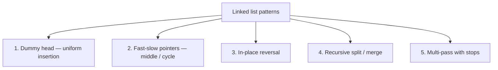

# Linked Lists

Linked lists are the canonical pointer-manipulation interview topic. The data structure itself is trivial — a chain of nodes — but the *manipulation patterns* (reverse, merge, detect cycle, find middle, partition) are surprisingly hard to get right in the 15-minute interview window because **one wrong assignment loses the entire list**. Mastering the **dummy-head trick, fast-slow pointers, in-place reversal, and recursive splits** covers ~90% of linked-list interview prompts.

## The Node

```java
class ListNode {
    int val;
    ListNode next;
    ListNode(int val) { this.val = val; }
    ListNode(int val, ListNode next) { this.val = val; this.next = next; }
}
```

For doubly-linked: add `ListNode prev`. Java's `LinkedList` is doubly-linked, but interviewers nearly always have you implement on the bare `ListNode`.

## The Five Core Patterns



### Pattern 1 — Dummy head

The dummy-head trick simplifies code by removing the special case for inserting at the front. Any insertion or removal becomes uniform.

```java
// "Remove Linked List Elements" — delete all nodes with value == val
public ListNode removeElements(ListNode head, int val) {
    ListNode dummy = new ListNode(0, head);
    ListNode prev = dummy;
    while (prev.next != null) {
        if (prev.next.val == val) prev.next = prev.next.next;
        else prev = prev.next;
    }
    return dummy.next;
}
// O(n) time, O(1) space
```

Without the dummy, you'd need a special "if removing head" branch. With it, every node looks the same.

### Pattern 2 — Fast-slow (tortoise & hare)

Two pointers advance at different rates. Used for find-middle, cycle-detection, kth-from-end, and palindrome check.

```java
// Find middle node
public ListNode middleNode(ListNode head) {
    ListNode slow = head, fast = head;
    while (fast != null && fast.next != null) {
        slow = slow.next;
        fast = fast.next.next;
    }
    return slow;
}
// O(n) time, O(1) space; for even length, returns the SECOND middle
```

```java
// Detect cycle (Floyd's algorithm)
public boolean hasCycle(ListNode head) {
    ListNode slow = head, fast = head;
    while (fast != null && fast.next != null) {
        slow = slow.next;
        fast = fast.next.next;
        if (slow == fast) return true;
    }
    return false;
}
// O(n) time, O(1) space
```

```java
// Find cycle start (Floyd's two-phase)
public ListNode detectCycle(ListNode head) {
    ListNode slow = head, fast = head;
    while (fast != null && fast.next != null) {
        slow = slow.next;
        fast = fast.next.next;
        if (slow == fast) {
            ListNode p = head;
            while (p != slow) { p = p.next; slow = slow.next; }
            return p;
        }
    }
    return null;
}
// O(n) time, O(1) space
```

**Why Floyd's works**: at meeting point inside cycle, distance from head to cycle-start equals distance from meeting point to cycle-start (going forward). Two pointers from head and meeting point at speed 1 each meet at cycle-start.

### Pattern 3 — In-place reversal

```java
public ListNode reverse(ListNode head) {
    ListNode prev = null, curr = head;
    while (curr != null) {
        ListNode next = curr.next;
        curr.next = prev;
        prev = curr;
        curr = next;
    }
    return prev;
}
// O(n) time, O(1) space
```

The dance of three pointers — prev, curr, next — is **the most-tested linked-list mechanic**. Practice it cold.

**Recursive variant**:

```java
public ListNode reverse(ListNode head) {
    if (head == null || head.next == null) return head;
    ListNode rest = reverse(head.next);
    head.next.next = head;
    head.next = null;
    return rest;
}
// O(n) time, O(n) stack space
```

The iterative version wins on space; both score equally on correctness.

### Pattern 4 — Recursive split / merge

Used for mergesort on linked lists, and any divide-and-conquer pattern.

```java
// "Merge Two Sorted Lists"
public ListNode mergeTwoLists(ListNode l1, ListNode l2) {
    ListNode dummy = new ListNode(0), tail = dummy;
    while (l1 != null && l2 != null) {
        if (l1.val <= l2.val) { tail.next = l1; l1 = l1.next; }
        else                  { tail.next = l2; l2 = l2.next; }
        tail = tail.next;
    }
    tail.next = (l1 != null) ? l1 : l2;
    return dummy.next;
}
// O(n + m) time, O(1) space
```

```java
// "Sort List" — mergesort on linked list
public ListNode sortList(ListNode head) {
    if (head == null || head.next == null) return head;
    // Find middle, split
    ListNode slow = head, fast = head, prev = null;
    while (fast != null && fast.next != null) { prev = slow; slow = slow.next; fast = fast.next.next; }
    prev.next = null;
    return mergeTwoLists(sortList(head), sortList(slow));
}
// O(n log n) time, O(log n) stack space — linked-list mergesort is O(1) extra non-stack space
```

### Pattern 5 — Multi-pass with stops

Some problems require two passes: e.g. find length first, then operate; or find kth-from-end with one-pointer + offset.

```java
// "Remove Nth From End of List"
public ListNode removeNthFromEnd(ListNode head, int n) {
    ListNode dummy = new ListNode(0, head);
    ListNode fast = dummy, slow = dummy;
    for (int i = 0; i <= n; i++) fast = fast.next;       // gap of n+1
    while (fast != null) { fast = fast.next; slow = slow.next; }
    slow.next = slow.next.next;
    return dummy.next;
}
// O(n) time, O(1) space, ONE-PASS
```

The gap-of-n+1 trick converts "kth from end" into a one-pass operation. Worth memorising.

## Reverse In Groups (K)

A staple harder-medium problem.

```java
public ListNode reverseKGroup(ListNode head, int k) {
    ListNode curr = head;
    int count = 0;
    while (curr != null && count < k) { curr = curr.next; count++; }
    if (count < k) return head;                          // less than k remaining, leave alone
    curr = reverseKGroup(curr, k);                       // recursively reverse the rest
    while (count-- > 0) {                                // reverse the first k
        ListNode next = head.next;
        head.next = curr;
        curr = head;
        head = next;
    }
    return curr;
}
// O(n) time, O(n/k) stack space
```

## Java Specifics

### LinkedList vs ArrayList

`java.util.LinkedList` is a **doubly-linked list with O(1) head/tail operations** and `O(n)` random access. In interviews, **almost always prefer `ArrayList`** for index access; `ArrayDeque` for queue/stack patterns; raw `ListNode` for traditional linked-list problems.

| Operation | ArrayList | LinkedList |
|---|---|---|
| `get(i)` | O(1) | O(n) |
| `add(x)` at end | O(1) amortised | O(1) |
| `add(0, x)` at head | O(n) | O(1) |
| `remove(i)` | O(n) | O(n) (walk to index) |
| Iteration | O(n), cache-friendly | O(n), cache-unfriendly |

Cache locality: ArrayList wins almost every benchmark for typical workloads. LinkedList is only better when you're doing many head/tail O(1) ops AND not doing random access. **Senior interview probe**: "When would you actually pick LinkedList over ArrayList?" Answer: very rarely; head/tail-only workloads with known indices — and even then `ArrayDeque` usually beats it.

### When the prompt mentions doubly-linked

LRU Cache is the canonical use of a doubly-linked list — needed for O(1) eviction from the middle.

```java
// LRU Cache using LinkedHashMap (Java's simplest correct implementation)
class LRUCache extends LinkedHashMap<Integer, Integer> {
    private final int capacity;
    public LRUCache(int capacity) {
        super(capacity, 0.75f, true);                    // accessOrder = true
        this.capacity = capacity;
    }
    public int get(int key) { return super.getOrDefault(key, -1); }
    public void put(int key, int value) { super.put(key, value); }
    @Override protected boolean removeEldestEntry(Map.Entry<Integer, Integer> eldest) {
        return size() > capacity;
    }
}
// O(1) get + put
```

The full hand-rolled HashMap + doubly-linked-list implementation is also a classic — covered in [C03/T02 OOD case studies](../C03-design-interviews/) where Machine Coding problems often include it.

## Common Mistakes That Score Low

- **Losing the rest of the list when reversing** — failing to save `curr.next` before overwriting it.
- **Forgetting to terminate the reversed list** — old head's `next` should be null, not the second node.
- **Off-by-one on fast pointer initialization** — for "find middle of even-length", does fast start at head or head.next?
- **Modifying `head` without using a dummy** — special-cases everywhere.
- **Recursion stack overflow** on very long lists (>10k) — convert to iterative.
- **Confusing `==` (reference) with `.equals` for ListNode comparisons** — for cycle detection, `==` is correct.

## Sources & Further Reading

- [Tech Interview Handbook — Linked Lists](https://www.techinterviewhandbook.org/algorithms/linked-list/)
- [LeetCode Linked List tag](https://leetcode.com/tag/linked-list/)
- [Floyd's Cycle Detection — Wikipedia](https://en.wikipedia.org/wiki/Cycle_detection)

## Practice

1. **Reverse Linked List** — iterative + recursive.
2. **Middle of the Linked List** — fast-slow.
3. **Linked List Cycle** — Floyd's basic.
4. **Linked List Cycle II** — find cycle start.
5. **Merge Two Sorted Lists** — dummy + tail.
6. **Remove Nth From End of List** — gap-of-n+1.
7. **Palindrome Linked List** — find middle + reverse second half + compare.
8. **Add Two Numbers** — carry-propagation.
9. **Sort List** — mergesort on list.
10. **Reverse Nodes in k-Group** — recursive reverse-then-recurse.
11. **Reverse Linked List II** — reverse a sub-range.
12. **Rotate List** — find length, modulo, re-link.
13. **Copy List with Random Pointer** — interleave-then-split, or HashMap.
14. **LRU Cache** — LinkedHashMap or hand-rolled.
15. **Flatten Multilevel Doubly Linked List** — DFS in-place.

## Detailed Worked Solutions

### 1. Palindrome Linked List

**Problem.** Return true if a singly-linked list reads the same forwards and backwards. O(n) time, **O(1)** space.

```java
public boolean isPalindrome(ListNode head) {
    // 1. Find middle.
    ListNode slow = head, fast = head;
    while (fast != null && fast.next != null) {
        slow = slow.next;
        fast = fast.next.next;
    }
    // 2. Reverse second half.
    ListNode second = reverse(slow);
    // 3. Compare.
    ListNode first = head;
    while (second != null) {
        if (first.val != second.val) return false;
        first = first.next;
        second = second.next;
    }
    return true;
}
private ListNode reverse(ListNode head) {
    ListNode prev = null, curr = head;
    while (curr != null) {
        ListNode next = curr.next;
        curr.next = prev;
        prev = curr;
        curr = next;
    }
    return prev;
}
// O(n) time, O(1) space
```

**Tradeoff**: this mutates the list (second half is reversed at end). For non-mutating, use O(n) stack or O(n) array copy.

### 2. Add Two Numbers (linked-list digits in reverse)

**Problem.** Two non-empty linked lists representing non-negative integers; each node holds a single digit; digits stored in **reverse order**. Return the sum as a linked list.

```java
public ListNode addTwoNumbers(ListNode l1, ListNode l2) {
    ListNode dummy = new ListNode(0), tail = dummy;
    int carry = 0;
    while (l1 != null || l2 != null || carry != 0) {
        int sum = carry;
        if (l1 != null) { sum += l1.val; l1 = l1.next; }
        if (l2 != null) { sum += l2.val; l2 = l2.next; }
        carry = sum / 10;
        tail.next = new ListNode(sum % 10);
        tail = tail.next;
    }
    return dummy.next;
}
// O(max(m,n)) time, O(max(m,n)) space (output)
```

**Edge case**: trailing carry — handled by the `carry != 0` loop condition (e.g., 99 + 1 = 100 requires an extra node).

### 3. Reverse Linked List II (reverse a sub-range)

**Problem.** Reverse nodes from position `left` to `right` (1-indexed). One pass + in-place.

```java
public ListNode reverseBetween(ListNode head, int left, int right) {
    ListNode dummy = new ListNode(0, head), prev = dummy;
    for (int i = 1; i < left; i++) prev = prev.next;     // node just before "left"
    ListNode start = prev.next, then = start.next;
    for (int i = 0; i < right - left; i++) {
        start.next = then.next;
        then.next = prev.next;
        prev.next = then;
        then = start.next;
    }
    return dummy.next;
}
// O(n) time, O(1) space
```

**Insight**: instead of fully reversing then reattaching, "rotate" — pull each successive node to the front of the reversed segment one at a time.

### 4. Rotate List

**Problem.** Rotate the list right by `k` steps.

```java
public ListNode rotateRight(ListNode head, int k) {
    if (head == null || head.next == null || k == 0) return head;
    // 1. Find length + tail.
    int len = 1;
    ListNode tail = head;
    while (tail.next != null) { tail = tail.next; len++; }
    k %= len;
    if (k == 0) return head;
    // 2. Make it circular.
    tail.next = head;
    // 3. Find new tail (len - k - 1 steps from head).
    ListNode newTail = head;
    for (int i = 0; i < len - k - 1; i++) newTail = newTail.next;
    ListNode newHead = newTail.next;
    newTail.next = null;
    return newHead;
}
// O(n) time, O(1) space
```

### 5. Copy List with Random Pointer

**Problem.** Each node has `next` + `random` (arbitrary or null). Return a deep copy.

```java
public Node copyRandomList(Node head) {
    if (head == null) return null;
    Map<Node, Node> map = new HashMap<>();
    // Pass 1: clone nodes, store original → copy mapping.
    for (Node n = head; n != null; n = n.next) map.put(n, new Node(n.val));
    // Pass 2: wire up next + random on copies.
    for (Node n = head; n != null; n = n.next) {
        map.get(n).next = map.get(n.next);
        map.get(n).random = map.get(n.random);
    }
    return map.get(head);
}
// O(n) time, O(n) space
```

**O(1)-space variant**: interleave clones into original list (`a → a' → b → b' → c → c'`), set random pointers via interleave structure, then unweave. More clever but harder to write correctly under interview pressure.

### 6. Flatten Multilevel Doubly Linked List

**Problem.** Each node has `prev`, `next`, `child` (another doubly-linked list). Flatten depth-first so all `child`s become inline.

```java
public Node flatten(Node head) {
    if (head == null) return null;
    Deque<Node> stack = new ArrayDeque<>();
    Node curr = head, prev = null;
    stack.push(curr);
    while (!stack.isEmpty()) {
        curr = stack.pop();
        if (prev != null) { prev.next = curr; curr.prev = prev; }
        if (curr.next != null) stack.push(curr.next);
        if (curr.child != null) { stack.push(curr.child); curr.child = null; }
        prev = curr;
    }
    return head;
}
// O(n) time, O(d) space (d = max depth)
```

**Stack-based DFS** — push next first, then child (so child pops first). Clear `child` field on visit.

### 7. Merge K Sorted Lists (heap-based)

**Problem.** Merge `ListNode[] lists` (each sorted) into a single sorted list.

```java
public ListNode mergeKLists(ListNode[] lists) {
    PriorityQueue<ListNode> heap = new PriorityQueue<>(Comparator.comparingInt(n -> n.val));
    for (ListNode list : lists) if (list != null) heap.offer(list);
    ListNode dummy = new ListNode(0), tail = dummy;
    while (!heap.isEmpty()) {
        ListNode min = heap.poll();
        tail.next = min;
        tail = min;
        if (min.next != null) heap.offer(min.next);
    }
    return dummy.next;
}
// O(N log k) time (N total nodes, k lists), O(k) heap space
```

**Alternative — divide and conquer**: pairwise merge — same complexity, less heap overhead. Heap is more intuitive in interviews.

## Recap

You should now be able to:

- Implement the **five core linked-list patterns** (dummy head, fast-slow, in-place reverse, recursive split/merge, multi-pass with stops).
- Recall the **three-pointer reversal dance** (prev / curr / next) without hesitation.
- Apply **Floyd's cycle detection** including the two-phase find-cycle-start.
- Choose between **ArrayList, LinkedList, ArrayDeque, raw ListNode** for each interview prompt.
- Implement **LRU Cache** via LinkedHashMap or hand-rolled HashMap + doubly-linked-list.
- Avoid the **classic mistakes** (losing `curr.next` before reassigning, missing termination, special-casing head without dummy).

## Next

Continue to [Stacks & Queues](./T07-stacks-and-queues.md).
