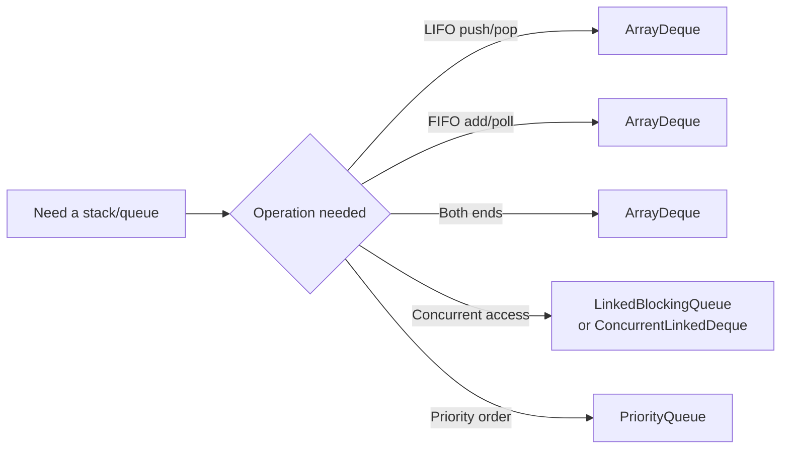

# Stacks & Queues

Stacks and queues are simple data structures but they unlock a disproportionate number of interview patterns: **valid-parentheses** family (stack), **next-greater-element** family (monotonic stack), **BFS** family (queue), **sliding-window-max** (monotonic deque). Knowing when each applies — and using `ArrayDeque` instead of legacy `Stack` / `LinkedList` — separates seniors from juniors.

## Java Stack/Queue Idioms



**The single rule**: in Java, **use `ArrayDeque` for stacks and queues**. Reasons:
- **`Stack`** (java.util.Stack) extends `Vector` — synchronised, legacy from Java 1.0. **Never use in interview code.**
- **`LinkedList`** works as a Deque but has poor cache locality. ArrayDeque is faster and equally featured.
- **`Queue<Integer> q = new LinkedList<>();`** — works but slower than `ArrayDeque`.

```java
// Stack
Deque<Integer> stack = new ArrayDeque<>();
stack.push(1); stack.push(2);                  // push to top
int top = stack.peek();                        // 2, doesn't remove
int popped = stack.pop();                      // 2, removes
// Queue
Deque<Integer> queue = new ArrayDeque<>();
queue.offer(1); queue.offer(2);                // add to tail
int front = queue.peek();                      // 1, doesn't remove
int polled = queue.poll();                     // 1, removes
```

> [!INTERVIEW]
> Saying "I'd use `ArrayDeque` here because `Stack` is legacy-synchronized" in a coding round is a one-line free positive signal.

## Stack Pattern 1 — Matching / Validation

```java
// "Valid Parentheses"
public boolean isValid(String s) {
    Deque<Character> stack = new ArrayDeque<>();
    for (char c : s.toCharArray()) {
        if (c == '(' || c == '[' || c == '{') stack.push(c);
        else {
            if (stack.isEmpty()) return false;
            char open = stack.pop();
            if (open == '(' && c != ')') return false;
            if (open == '[' && c != ']') return false;
            if (open == '{' && c != '}') return false;
        }
    }
    return stack.isEmpty();
}
// O(n) time, O(n) space
```

## Stack Pattern 2 — Monotonic Stack

A **monotonic stack** maintains elements in sorted order (increasing or decreasing) from bottom to top. Used for "next greater element", "stock span", "largest rectangle in histogram", "daily temperatures".

```java
// "Next Greater Element" — for each element, find the next greater to the right
public int[] nextGreaterElements(int[] nums) {
    int n = nums.length;
    int[] result = new int[n];
    Arrays.fill(result, -1);
    Deque<Integer> stack = new ArrayDeque<>();          // stack of indices
    for (int i = 0; i < n; i++) {
        while (!stack.isEmpty() && nums[stack.peek()] < nums[i]) {
            result[stack.pop()] = nums[i];
        }
        stack.push(i);
    }
    return result;
}
// O(n) amortised — each element pushed once, popped once
```

**Why O(n) not O(n²)**: each element is pushed at most once and popped at most once across the whole walk.

```java
// "Largest Rectangle in Histogram"
public int largestRectangleArea(int[] heights) {
    Deque<Integer> stack = new ArrayDeque<>();
    int best = 0;
    for (int i = 0; i <= heights.length; i++) {
        int h = (i == heights.length) ? 0 : heights[i];
        while (!stack.isEmpty() && heights[stack.peek()] > h) {
            int height = heights[stack.pop()];
            int width = stack.isEmpty() ? i : i - stack.peek() - 1;
            best = Math.max(best, height * width);
        }
        stack.push(i);
    }
    return best;
}
// O(n) time, O(n) space
```

## Stack Pattern 3 — Expression Evaluation

```java
// "Basic Calculator II" — eval +/-/*/ with precedence
public int calculate(String s) {
    Deque<Integer> stack = new ArrayDeque<>();
    int num = 0; char op = '+';
    for (int i = 0; i < s.length(); i++) {
        char c = s.charAt(i);
        if (Character.isDigit(c)) num = num * 10 + (c - '0');
        if ((!Character.isDigit(c) && c != ' ') || i == s.length() - 1) {
            switch (op) {
                case '+' -> stack.push(num);
                case '-' -> stack.push(-num);
                case '*' -> stack.push(stack.pop() * num);
                case '/' -> stack.push(stack.pop() / num);
            }
            op = c; num = 0;
        }
    }
    int total = 0;
    while (!stack.isEmpty()) total += stack.pop();
    return total;
}
// O(n) time, O(n) space
```

## Queue Pattern 1 — BFS

The canonical queue use is breadth-first search. See [T09 Graphs](./T09-graphs-bfs-dfs-shortest-paths.md) for the full BFS template.

```java
// BFS skeleton
Deque<Node> queue = new ArrayDeque<>();
queue.offer(start);
Set<Node> visited = new HashSet<>(); visited.add(start);
while (!queue.isEmpty()) {
    Node n = queue.poll();
    for (Node next : n.neighbors) {
        if (visited.add(next)) queue.offer(next);
    }
}
```

## Queue Pattern 2 — Level-Order Tree Traversal

```java
public List<List<Integer>> levelOrder(TreeNode root) {
    List<List<Integer>> result = new ArrayList<>();
    if (root == null) return result;
    Deque<TreeNode> queue = new ArrayDeque<>();
    queue.offer(root);
    while (!queue.isEmpty()) {
        int size = queue.size();                       // snapshot — this level's nodes
        List<Integer> level = new ArrayList<>();
        for (int i = 0; i < size; i++) {
            TreeNode n = queue.poll();
            level.add(n.val);
            if (n.left != null) queue.offer(n.left);
            if (n.right != null) queue.offer(n.right);
        }
        result.add(level);
    }
    return result;
}
// O(n) time, O(n) space
```

The **size-snapshot trick** (`int size = queue.size()`) lets you process one level at a time. Used for "level order", "zigzag traversal", "right-side view", "average of levels".

## Deque Pattern — Monotonic Deque For Sliding Window Max

```java
// "Sliding Window Maximum"
public int[] maxSlidingWindow(int[] nums, int k) {
    Deque<Integer> dq = new ArrayDeque<>();              // stores indices
    int[] result = new int[nums.length - k + 1];
    for (int i = 0; i < nums.length; i++) {
        while (!dq.isEmpty() && dq.peekFirst() <= i - k) dq.pollFirst();       // expire
        while (!dq.isEmpty() && nums[dq.peekLast()] < nums[i]) dq.pollLast();  // maintain decreasing
        dq.offerLast(i);
        if (i >= k - 1) result[i - k + 1] = nums[dq.peekFirst()];
    }
    return result;
}
// O(n) time, O(k) space — each index pushed and popped once
```

The deque's front always holds the index of the current window's max; smaller elements behind are useless and get pruned.

## Implementing Stack Using Queues (Or Vice Versa)

A common probe of fundamentals.

```java
// Stack using two queues
class MyStack {
    Deque<Integer> q1 = new ArrayDeque<>(), q2 = new ArrayDeque<>();
    public void push(int x) {
        q2.offer(x);
        while (!q1.isEmpty()) q2.offer(q1.poll());
        Deque<Integer> tmp = q1; q1 = q2; q2 = tmp;
    }
    public int pop() { return q1.poll(); }
    public int top() { return q1.peek(); }
    public boolean empty() { return q1.isEmpty(); }
}
// push O(n), pop O(1)
```

## Common Mistakes That Score Low

- **Using `Stack` or `LinkedList`** instead of `ArrayDeque`.
- **Confusing `peek/pop` (stack/deque) with `peek/poll` (queue) order semantics** — `peekFirst/peekLast` for deque clarity.
- **Forgetting to handle empty stack/queue** before peek/pop.
- **Not knowing why monotonic stack is O(n) amortised** — each element pushed and popped once.
- **Wrong direction of monotonic-deque pruning** — decreasing for max, increasing for min.

## Sources & Further Reading

- [Java ArrayDeque docs](https://docs.oracle.com/en/java/javase/21/docs/api/java.base/java/util/ArrayDeque.html)
- [LeetCode Monotonic Stack tag](https://leetcode.com/tag/monotonic-stack/)
- [Tech Interview Handbook — Stacks](https://www.techinterviewhandbook.org/algorithms/stack/)

## Practice

1. **Valid Parentheses** — basic stack.
2. **Min Stack** — stack with O(1) min.
3. **Evaluate Reverse Polish Notation** — stack arithmetic.
4. **Basic Calculator I / II / III** — stack with parens / precedence.
5. **Next Greater Element I / II** — monotonic stack.
6. **Daily Temperatures** — monotonic stack on temperatures.
7. **Largest Rectangle in Histogram** — monotonic stack.
8. **Maximal Rectangle** — extend histogram per row.
9. **Trapping Rain Water (stack variant)** — monotonic stack alternative.
10. **Asteroid Collision** — stack simulation.
11. **Implement Stack Using Queues**.
12. **Implement Queue Using Stacks**.
13. **Sliding Window Maximum** — monotonic deque.
14. **First Unique Number** — queue + map.
15. **Design Circular Queue** — array-based implementation.

## Detailed Worked Solutions

### 1. Min Stack (O(1) `getMin`)

**Problem.** Design a stack supporting push, pop, top, and `getMin` — all in O(1).

```java
class MinStack {
    private final Deque<Integer> stack = new ArrayDeque<>();
    private final Deque<Integer> mins = new ArrayDeque<>();   // running mins
    public void push(int v) {
        stack.push(v);
        mins.push(mins.isEmpty() ? v : Math.min(v, mins.peek()));
    }
    public void pop() { stack.pop(); mins.pop(); }
    public int top() { return stack.peek(); }
    public int getMin() { return mins.peek(); }
}
// O(1) per op, O(n) extra space
```

**Two-stack trick**: `mins` mirrors `stack` with running minimum. Memory-optimised variant pushes onto `mins` only when value ≤ current min — saves space on increasing sequences.

### 2. Evaluate Reverse Polish Notation

**Problem.** Evaluate RPN expression (operators after operands). Example: `["2","1","+","3","*"]` → `(2+1)*3 = 9`.

```java
public int evalRPN(String[] tokens) {
    Deque<Integer> stack = new ArrayDeque<>();
    for (String t : tokens) {
        switch (t) {
            case "+", "-", "*", "/" -> {
                int b = stack.pop(), a = stack.pop();
                stack.push(switch (t) {
                    case "+" -> a + b;
                    case "-" -> a - b;
                    case "*" -> a * b;
                    default -> a / b;
                });
            }
            default -> stack.push(Integer.parseInt(t));
        }
    }
    return stack.pop();
}
// O(n) time, O(n) space
```

**Operand-order trap**: when popping for binary ops, **first pop is right operand**, second is left. Getting this wrong breaks `-` and `/`.

### 3. Daily Temperatures (monotonic stack)

**Problem.** Given daily temperatures, return for each day how many days until a warmer one (`0` if none).

```java
public int[] dailyTemperatures(int[] T) {
    int[] result = new int[T.length];
    Deque<Integer> stack = new ArrayDeque<>();           // stack of indices, decreasing temp
    for (int i = 0; i < T.length; i++) {
        while (!stack.isEmpty() && T[i] > T[stack.peek()]) {
            int prev = stack.pop();
            result[prev] = i - prev;
        }
        stack.push(i);
    }
    return result;
}
// O(n) amortised time, O(n) space
```

**Classic monotonic-stack pattern**: stack holds indices with values monotonically decreasing. New element pops everything smaller (each popped index now knows its "next greater" index).

### 4. Asteroid Collision (stack simulation)

**Problem.** Asteroids on a number line; positive = moving right, negative = moving left. Equal-sized asteroids destroy each other; larger destroys smaller. Return surviving asteroids in order.

```java
public int[] asteroidCollision(int[] asteroids) {
    Deque<Integer> stack = new ArrayDeque<>();
    outer:
    for (int a : asteroids) {
        while (!stack.isEmpty() && a < 0 && stack.peek() > 0) {
            int top = stack.peek();
            if (top < -a) { stack.pop(); continue; }    // top destroyed, keep checking
            if (top == -a) { stack.pop(); }              // both destroyed
            continue outer;                              // a is destroyed (or both destroyed)
        }
        stack.push(a);
    }
    int[] result = new int[stack.size()];
    for (int i = result.length - 1; i >= 0; i--) result[i] = stack.pop();
    return result;
}
// O(n) time (each asteroid pushed + popped at most once), O(n) space
```

**Logic**: collisions occur only when top is positive AND incoming is negative.

### 5. Implement Queue Using Two Stacks

**Problem.** Implement `MyQueue` with push, pop, peek, empty using only stack operations.

```java
class MyQueue {
    private final Deque<Integer> in = new ArrayDeque<>(), out = new ArrayDeque<>();
    public void push(int x) { in.push(x); }
    public int pop() { moveIfNeeded(); return out.pop(); }
    public int peek() { moveIfNeeded(); return out.peek(); }
    public boolean empty() { return in.isEmpty() && out.isEmpty(); }
    private void moveIfNeeded() {
        if (out.isEmpty()) while (!in.isEmpty()) out.push(in.pop());
    }
}
// Amortised O(1) per op
```

**Trick**: two stacks. `in` for new pushes. `out` reverses order when we transfer (only when `out` is empty, to keep amortised O(1)).

### 6. Sliding Window Maximum (monotonic deque)

**Problem.** Given `int[] nums` and window size `k`, return max in each sliding window.

```java
public int[] maxSlidingWindow(int[] nums, int k) {
    Deque<Integer> dq = new ArrayDeque<>();              // stores indices, decreasing values
    int[] result = new int[nums.length - k + 1];
    for (int i = 0; i < nums.length; i++) {
        while (!dq.isEmpty() && dq.peekFirst() <= i - k) dq.pollFirst();         // expire old
        while (!dq.isEmpty() && nums[dq.peekLast()] < nums[i]) dq.pollLast();    // keep decreasing
        dq.offerLast(i);
        if (i >= k - 1) result[i - k + 1] = nums[dq.peekFirst()];
    }
    return result;
}
// O(n) time (each index pushed + popped once), O(k) space
```

**Deque invariant**: indices in deque are within current window, values are monotonically decreasing — so front always holds the current window's max.

### 7. Design Circular Queue (array-based)

**Problem.** Implement a fixed-capacity queue using a circular array.

```java
class MyCircularQueue {
    private final int[] arr;
    private int head = 0, tail = -1, size = 0;
    public MyCircularQueue(int k) { arr = new int[k]; }
    public boolean enQueue(int v) {
        if (isFull()) return false;
        tail = (tail + 1) % arr.length;
        arr[tail] = v;
        size++;
        return true;
    }
    public boolean deQueue() {
        if (isEmpty()) return false;
        head = (head + 1) % arr.length;
        size--;
        return true;
    }
    public int Front() { return isEmpty() ? -1 : arr[head]; }
    public int Rear()  { return isEmpty() ? -1 : arr[tail]; }
    public boolean isEmpty() { return size == 0; }
    public boolean isFull()  { return size == arr.length; }
}
// All ops O(1), O(k) space
```

**Why modulo**: wraps indices around the fixed array — true ring buffer.

### 8. Largest Rectangle in Histogram (monotonic stack)

**Problem.** Given heights, find the largest rectangle's area.

```java
public int largestRectangleArea(int[] heights) {
    Deque<Integer> stack = new ArrayDeque<>();
    int best = 0;
    for (int i = 0; i <= heights.length; i++) {
        int h = (i == heights.length) ? 0 : heights[i];
        while (!stack.isEmpty() && heights[stack.peek()] > h) {
            int height = heights[stack.pop()];
            int width = stack.isEmpty() ? i : i - stack.peek() - 1;
            best = Math.max(best, height * width);
        }
        stack.push(i);
    }
    return best;
}
// O(n) time, O(n) space
```

**Sentinel trick**: append a virtual `0` at `i == n` to drain the stack at end. Without it, leftover bars never get evaluated.

## Recap

You should now be able to:

- Use **`ArrayDeque` as both stack and queue** — and explain why over `Stack` / `LinkedList`.
- Apply the **stack patterns**: matching/validation, monotonic stack, expression evaluation.
- Apply the **queue patterns**: BFS, level-order with size-snapshot.
- Apply the **monotonic deque** for sliding window max/min in O(n).
- Understand the **amortised O(n)** argument for monotonic stack/deque.
- Implement **stack-from-queues / queue-from-stacks** when probed.
- Avoid the **legacy-collection mistake** (using `Stack` or unsynchronized `LinkedList`).

## Next

Continue to [Trees & BSTs](./T08-trees-and-bsts.md).
