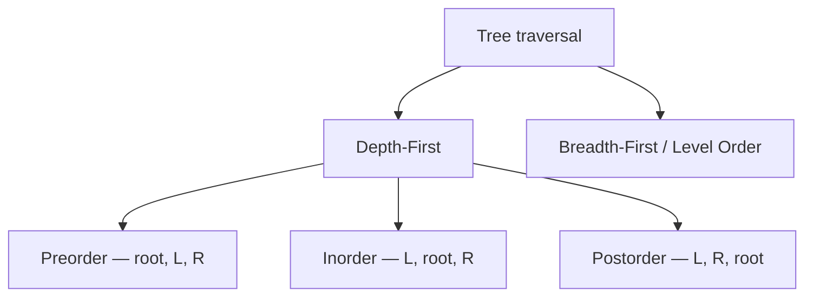
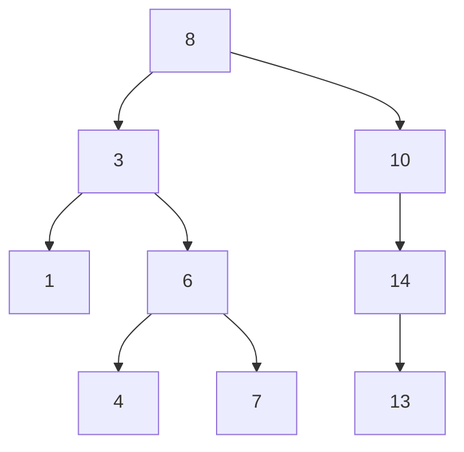

# Trees & BSTs

Trees are the second-most-asked DSA topic at FAANGM (after arrays/strings). Roughly 20-25% of medium/hard coding rounds involve a tree, and interviewers love trees because they probe recursion mechanics, traversal patterns, and edge-case discipline simultaneously. **Binary trees** dominate (traversal, LCA, diameter, serialization); **BSTs** add ordering invariants that unlock O(log n) operations.

This topic covers the four canonical traversals, the recursion + iterative templates for each, BST mechanics and the validation gotcha, and the harder patterns (LCA, diameter, serialize/deserialize, path-sum variants).

## The Node

```java
class TreeNode {
    int val;
    TreeNode left, right;
    TreeNode(int val) { this.val = val; }
    TreeNode(int val, TreeNode left, TreeNode right) {
        this.val = val; this.left = left; this.right = right;
    }
}
```

Convention: `null` = no child. Tree problems almost always start with `if (root == null) return ...`.

## The Four Traversals



### Preorder

```java
public void preorder(TreeNode n, List<Integer> out) {
    if (n == null) return;
    out.add(n.val);
    preorder(n.left, out);
    preorder(n.right, out);
}
// O(n) time, O(h) stack space (h = tree height)

// Iterative version
public List<Integer> preorderIter(TreeNode root) {
    List<Integer> out = new ArrayList<>();
    if (root == null) return out;
    Deque<TreeNode> stack = new ArrayDeque<>();
    stack.push(root);
    while (!stack.isEmpty()) {
        TreeNode n = stack.pop();
        out.add(n.val);
        if (n.right != null) stack.push(n.right);   // push right FIRST so left pops first
        if (n.left  != null) stack.push(n.left);
    }
    return out;
}
```

### Inorder

```java
public void inorder(TreeNode n, List<Integer> out) {
    if (n == null) return;
    inorder(n.left, out);
    out.add(n.val);
    inorder(n.right, out);
}

// Iterative — useful pattern for BST in-order processing
public List<Integer> inorderIter(TreeNode root) {
    List<Integer> out = new ArrayList<>();
    Deque<TreeNode> stack = new ArrayDeque<>();
    TreeNode curr = root;
    while (curr != null || !stack.isEmpty()) {
        while (curr != null) { stack.push(curr); curr = curr.left; }
        curr = stack.pop();
        out.add(curr.val);
        curr = curr.right;
    }
    return out;
}
```

**Inorder of a BST gives sorted order** — the most-asked BST fact.

### Postorder

```java
public void postorder(TreeNode n, List<Integer> out) {
    if (n == null) return;
    postorder(n.left, out);
    postorder(n.right, out);
    out.add(n.val);
}
// Iterative is trickier — use two-stack or modified preorder + reverse.
```

### Level Order (BFS)

```java
public List<List<Integer>> levelOrder(TreeNode root) {
    List<List<Integer>> result = new ArrayList<>();
    if (root == null) return result;
    Deque<TreeNode> queue = new ArrayDeque<>();
    queue.offer(root);
    while (!queue.isEmpty()) {
        int size = queue.size();
        List<Integer> level = new ArrayList<>();
        for (int i = 0; i < size; i++) {
            TreeNode n = queue.poll();
            level.add(n.val);
            if (n.left != null) queue.offer(n.left);
            if (n.right != null) queue.offer(n.right);
        }
        result.add(level);
    }
    return result;
}
// O(n) time, O(w) space (w = max width)
```

The **size-snapshot trick** (`int size = queue.size()`) — covered in [T07](./T07-stacks-and-queues.md) — separates level boundaries.

## The Recursive Tree-Pattern Template

Most tree problems fit this template:

```text
T solve(TreeNode node):
    if node == null:
        return base_case_value          // 0, -1, true, null, ...
    T left  = solve(node.left)
    T right = solve(node.right)
    return combine(node.val, left, right)
```

### Examples

**Max depth**:

```java
public int maxDepth(TreeNode root) {
    if (root == null) return 0;
    return 1 + Math.max(maxDepth(root.left), maxDepth(root.right));
}
```

**Diameter** (longest path between any two nodes):

```java
private int best = 0;
public int diameterOfBinaryTree(TreeNode root) {
    height(root);
    return best;
}
private int height(TreeNode n) {
    if (n == null) return 0;
    int l = height(n.left), r = height(n.right);
    best = Math.max(best, l + r);                   // path through current node
    return 1 + Math.max(l, r);                       // height contribution upward
}
// O(n) time, O(h) space
```

The pattern: at each node, the **path-through-node** is `l + r` (left height + right height); the **return value** is `1 + max(l, r)` (height upward). Best so far tracked in a field.

**Same Tree**:

```java
public boolean isSameTree(TreeNode p, TreeNode q) {
    if (p == null && q == null) return true;
    if (p == null || q == null) return false;
    return p.val == q.val && isSameTree(p.left, q.left) && isSameTree(p.right, q.right);
}
```

## Binary Search Trees (BST)

**BST invariant**: for every node `n`, all values in `n.left` are `< n.val` and all values in `n.right` are `> n.val`. (Equality handling varies; clarify in interview.)



In-order traversal gives `1 3 4 6 7 8 10 13 14` — sorted.

### BST search / insert

```java
public TreeNode search(TreeNode root, int val) {
    while (root != null && root.val != val) {
        root = (val < root.val) ? root.left : root.right;
    }
    return root;
}
// O(h) time — O(log n) balanced, O(n) skewed

public TreeNode insert(TreeNode root, int val) {
    if (root == null) return new TreeNode(val);
    if (val < root.val) root.left = insert(root.left, val);
    else                root.right = insert(root.right, val);
    return root;
}
```

### BST Validation (the gotcha)

```java
// WRONG — only checks immediate children
public boolean isValidBSTWrong(TreeNode root) {
    if (root == null) return true;
    if (root.left != null && root.left.val >= root.val) return false;
    if (root.right != null && root.right.val <= root.val) return false;
    return isValidBSTWrong(root.left) && isValidBSTWrong(root.right);
}

// CORRECT — propagates min/max bounds down
public boolean isValidBST(TreeNode root) {
    return validate(root, null, null);
}
private boolean validate(TreeNode n, Integer min, Integer max) {
    if (n == null) return true;
    if ((min != null && n.val <= min) || (max != null && n.val >= max)) return false;
    return validate(n.left, min, n.val) && validate(n.right, n.val, max);
}
// O(n) time, O(h) space
```

The wrong version fails for `[5, 1, 4, null, null, 3, 6]` — the `3` under `4` is greater than its parent `4`'s requirement (anything in left subtree of `5` must be `< 5`, and `3 < 5`, but `3` is in the right subtree of `4` which is correct relative to `4`, but…) — these are exactly the cases interviewers craft. Always propagate bounds.

### Lowest Common Ancestor (LCA) — BST version

```java
public TreeNode lowestCommonAncestor(TreeNode root, TreeNode p, TreeNode q) {
    while (root != null) {
        if (p.val < root.val && q.val < root.val) root = root.left;
        else if (p.val > root.val && q.val > root.val) root = root.right;
        else return root;
    }
    return null;
}
// O(h) time, O(1) space
```

### LCA — General binary tree

```java
public TreeNode lowestCommonAncestor(TreeNode root, TreeNode p, TreeNode q) {
    if (root == null || root == p || root == q) return root;
    TreeNode l = lowestCommonAncestor(root.left, p, q);
    TreeNode r = lowestCommonAncestor(root.right, p, q);
    if (l != null && r != null) return root;          // both sides — root is LCA
    return l != null ? l : r;                          // one side or neither
}
// O(n) time, O(h) space
```

## Serialize / Deserialize Binary Tree

```java
public String serialize(TreeNode root) {
    StringBuilder sb = new StringBuilder();
    ser(root, sb);
    return sb.toString();
}
private void ser(TreeNode n, StringBuilder sb) {
    if (n == null) { sb.append("#,"); return; }
    sb.append(n.val).append(',');
    ser(n.left, sb); ser(n.right, sb);
}
public TreeNode deserialize(String data) {
    return des(new ArrayDeque<>(Arrays.asList(data.split(","))));
}
private TreeNode des(Deque<String> tokens) {
    String s = tokens.poll();
    if (s.equals("#")) return null;
    TreeNode n = new TreeNode(Integer.parseInt(s));
    n.left = des(tokens);
    n.right = des(tokens);
    return n;
}
// O(n) time, O(n) space
```

## Path Sum Variants

```java
// "Path Sum" — root-to-leaf sums to target?
public boolean hasPathSum(TreeNode root, int sum) {
    if (root == null) return false;
    if (root.left == null && root.right == null) return root.val == sum;
    return hasPathSum(root.left, sum - root.val) || hasPathSum(root.right, sum - root.val);
}

// "Path Sum III" — any path (not necessarily root-to-leaf) summing to target — prefix-sum + hashmap
public int pathSum(TreeNode root, int target) {
    Map<Long, Integer> count = new HashMap<>();
    count.put(0L, 1);
    return dfs(root, 0L, target, count);
}
private int dfs(TreeNode n, long sum, int target, Map<Long, Integer> count) {
    if (n == null) return 0;
    sum += n.val;
    int result = count.getOrDefault(sum - target, 0);
    count.merge(sum, 1, Integer::sum);
    result += dfs(n.left, sum, target, count) + dfs(n.right, sum, target, count);
    count.merge(sum, -1, Integer::sum);              // BACKTRACK
    return result;
}
```

## Common Mistakes That Score Low

- **Validate-BST with parent-only check** — needs bound propagation.
- **Forgetting the `null` base case** — first line of every recursive tree function.
- **Confusing height (edges) vs depth (nodes from root)** — clarify in interview.
- **Recursion stack overflow on skewed tree** with depth > 10k — convert to iterative.
- **Mutating shared state across branches** — see backtracking section.
- **Wrong traversal for BST sorted output** — use inorder, not preorder.

## Sources & Further Reading

- [LeetCode Tree tag](https://leetcode.com/tag/tree/)
- [Tech Interview Handbook — Tree](https://www.techinterviewhandbook.org/algorithms/tree/)
- [CLRS Chapter 12 — Binary Search Trees](https://mitpress.mit.edu/9780262046305/)

## Practice

1. **Maximum Depth of Binary Tree** — basic recursion.
2. **Invert Binary Tree** — swap left/right.
3. **Same Tree / Symmetric Tree**.
4. **Level Order Traversal** — BFS with size snapshot.
5. **Zigzag Level Order** — BFS with direction flip.
6. **Binary Tree Right Side View** — BFS or DFS with depth tracking.
7. **Validate BST** — bound-propagation.
8. **Lowest Common Ancestor** — BST and general binary tree variants.
9. **Diameter of Binary Tree**.
10. **Binary Tree Maximum Path Sum** — diameter with negative-handling.
11. **Serialize and Deserialize Binary Tree**.
12. **Construct Binary Tree from Preorder and Inorder**.
13. **Path Sum I / II / III**.
14. **Kth Smallest Element in BST** — inorder traversal.
15. **Convert Sorted Array to BST** — recursive midpoint.

## Detailed Worked Solutions

### 1. Invert Binary Tree

```java
public TreeNode invertTree(TreeNode root) {
    if (root == null) return null;
    TreeNode l = invertTree(root.left), r = invertTree(root.right);
    root.left = r; root.right = l;
    return root;
}
// O(n) time, O(h) stack
```

### 2. Symmetric Tree

**Problem.** Is the tree a mirror of itself around the root?

```java
public boolean isSymmetric(TreeNode root) {
    return root == null || mirror(root.left, root.right);
}
private boolean mirror(TreeNode a, TreeNode b) {
    if (a == null && b == null) return true;
    if (a == null || b == null) return false;
    return a.val == b.val && mirror(a.left, b.right) && mirror(a.right, b.left);
}
// O(n) time, O(h) stack
```

### 3. Zigzag Level Order Traversal (BFS with direction flip)

```java
public List<List<Integer>> zigzagLevelOrder(TreeNode root) {
    List<List<Integer>> result = new ArrayList<>();
    if (root == null) return result;
    Deque<TreeNode> queue = new ArrayDeque<>();
    queue.offer(root);
    boolean ltr = true;
    while (!queue.isEmpty()) {
        int size = queue.size();
        Deque<Integer> level = new ArrayDeque<>();
        for (int i = 0; i < size; i++) {
            TreeNode n = queue.poll();
            if (ltr) level.offerLast(n.val);
            else level.offerFirst(n.val);
            if (n.left != null) queue.offer(n.left);
            if (n.right != null) queue.offer(n.right);
        }
        result.add(new ArrayList<>(level));
        ltr = !ltr;
    }
    return result;
}
// O(n) time, O(w) space (w = max width)
```

### 4. Binary Tree Right Side View

**Problem.** Return values visible from the right side (one per depth).

```java
public List<Integer> rightSideView(TreeNode root) {
    List<Integer> result = new ArrayList<>();
    dfs(root, 0, result);
    return result;
}
private void dfs(TreeNode n, int depth, List<Integer> result) {
    if (n == null) return;
    if (depth == result.size()) result.add(n.val);    // first visit of depth = rightmost
    dfs(n.right, depth + 1, result);
    dfs(n.left, depth + 1, result);
}
// O(n) time, O(h) stack
```

**Trick**: traverse right-first; first node at each depth is the rightmost.

### 5. Binary Tree Maximum Path Sum (recursive height pattern)

**Problem.** Path = sequence of connected nodes. Find maximum path sum where path can start/end anywhere.

```java
private int best;
public int maxPathSum(TreeNode root) {
    best = Integer.MIN_VALUE;
    gain(root);
    return best;
}
private int gain(TreeNode n) {
    if (n == null) return 0;
    int l = Math.max(0, gain(n.left));       // drop negative contributions
    int r = Math.max(0, gain(n.right));
    best = Math.max(best, n.val + l + r);    // path through current node
    return n.val + Math.max(l, r);            // best one-side path upward
}
// O(n) time, O(h) stack
```

**Two-quantity dance**: at each node, compute (a) best path THROUGH this node (left+self+right) — candidate for global best; (b) best path that EXTENDS upward (self + one side only).

### 6. Construct Binary Tree from Preorder and Inorder

```java
private int preIdx;
private Map<Integer, Integer> inMap;
public TreeNode buildTree(int[] preorder, int[] inorder) {
    preIdx = 0;
    inMap = new HashMap<>();
    for (int i = 0; i < inorder.length; i++) inMap.put(inorder[i], i);
    return build(preorder, 0, inorder.length - 1);
}
private TreeNode build(int[] pre, int inLo, int inHi) {
    if (inLo > inHi) return null;
    int rootVal = pre[preIdx++];
    TreeNode root = new TreeNode(rootVal);
    int mid = inMap.get(rootVal);
    root.left = build(pre, inLo, mid - 1);
    root.right = build(pre, mid + 1, inHi);
    return root;
}
// O(n) time, O(n) space
```

**Insight**: preorder gives next root; inorder gives split point — left of root in inorder = left subtree size.

### 7. Kth Smallest Element in BST (inorder iterative)

```java
public int kthSmallest(TreeNode root, int k) {
    Deque<TreeNode> stack = new ArrayDeque<>();
    TreeNode curr = root;
    while (curr != null || !stack.isEmpty()) {
        while (curr != null) { stack.push(curr); curr = curr.left; }
        curr = stack.pop();
        if (--k == 0) return curr.val;
        curr = curr.right;
    }
    throw new IllegalArgumentException();
}
// O(h + k) time, O(h) stack — better than full inorder for small k
```

### 8. Convert Sorted Array to Balanced BST

```java
public TreeNode sortedArrayToBST(int[] nums) {
    return build(nums, 0, nums.length - 1);
}
private TreeNode build(int[] a, int lo, int hi) {
    if (lo > hi) return null;
    int mid = lo + (hi - lo) / 2;
    TreeNode root = new TreeNode(a[mid]);
    root.left = build(a, lo, mid - 1);
    root.right = build(a, mid + 1, hi);
    return root;
}
// O(n) time, O(log n) stack
```

**Why balanced**: always picking midpoint keeps left + right subtree sizes within 1.

### 9. Path Sum III (any-to-any path summing to k — prefix-sum trick)

**Problem.** Count paths in a binary tree (not necessarily root-to-leaf, just top-down) summing to `target`.

```java
public int pathSum(TreeNode root, int target) {
    Map<Long, Integer> count = new HashMap<>();
    count.put(0L, 1);
    return dfs(root, 0L, target, count);
}
private int dfs(TreeNode n, long sum, int target, Map<Long, Integer> count) {
    if (n == null) return 0;
    sum += n.val;
    int result = count.getOrDefault(sum - target, 0);
    count.merge(sum, 1, Integer::sum);
    result += dfs(n.left, sum, target, count) + dfs(n.right, sum, target, count);
    count.merge(sum, -1, Integer::sum);              // BACKTRACK to release the prefix
    return result;
}
// O(n) time, O(h) space (recursion + map size)
```

**Key insight**: combines prefix-sum (count current_sum - target) with tree-DFS + backtracking (release the prefix on the way up so siblings don't see it).

## Recap

You should now be able to:

- Implement the **four traversals** (preorder, inorder, postorder, level-order), recursive and iterative.
- Apply the **recursive tree template** (base case + left + right + combine).
- Use the **size-snapshot trick** for level-order with level boundaries.
- Implement **BST search, insert, validation** (with bound propagation, not parent-only).
- Implement **LCA** for both BST and general binary trees.
- Implement **serialize/deserialize** via preorder with sentinels.
- Solve **path-sum variants** including the prefix-sum + hashmap trick for Path Sum III.
- Recognize when to **switch from recursion to iteration** for very deep trees.

## Next

Continue to [Graphs (BFS/DFS, Shortest Paths)](./T09-graphs-bfs-dfs-shortest-paths.md).
