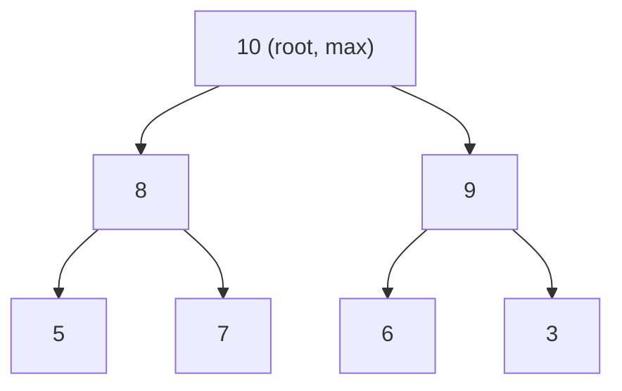

# Heaps & Priority Queues

A **heap** is a complete binary tree where every parent is ≤ (min-heap) or ≥ (max-heap) its children. The **priority queue** (`java.util.PriorityQueue`) is Java's binary-heap implementation. Heaps unlock the **top-K**, **k-th largest**, **merge-k sorted**, **median of stream**, and **Dijkstra** patterns — all O(log k) per operation. Mastering when to use a heap (and which size/direction) is the single highest-leverage move for many "find the K best/worst" problems.

## How A Heap Works



Represented in an **array**: parent of index `i` is `(i-1)/2`, children are `2i+1` and `2i+2`. This gives O(1) parent/child lookup with no pointer overhead.

| Op | Time |
|---|---|
| `peek` (top) | O(1) |
| `offer` (insert) | O(log n) |
| `poll` (extract top) | O(log n) |
| `heapify` (build from array) | **O(n)** (not n log n) |
| `contains(x)` | O(n) |
| `remove(x)` | O(n) (find) + O(log n) (sift) |

## Java PriorityQueue

```java
PriorityQueue<Integer> minHeap = new PriorityQueue<>();             // natural order — min-heap
PriorityQueue<Integer> maxHeap = new PriorityQueue<>(Comparator.reverseOrder());
PriorityQueue<int[]> byFreq = new PriorityQueue<>((a, b) -> a[1] - b[1]);   // OVERFLOW RISK
PriorityQueue<int[]> safe   = new PriorityQueue<>(Comparator.comparingInt(a -> a[1]));

minHeap.offer(5);                  // O(log n) insert
int min = minHeap.peek();          // O(1) view top
int top = minHeap.poll();          // O(log n) extract top
```

**Iteration order is NOT sorted.** `for (var x : pq)` gives the internal array order. To extract in order, repeatedly `poll`.

## Pattern 1 — Top K (the canonical heap pattern)

```java
// "Top K Frequent Elements" — also in T02 Hashing
public int[] topKFrequent(int[] nums, int k) {
    Map<Integer, Integer> freq = new HashMap<>();
    for (int n : nums) freq.merge(n, 1, Integer::sum);
    PriorityQueue<int[]> heap = new PriorityQueue<>(Comparator.comparingInt(a -> a[1]));
    for (var e : freq.entrySet()) {
        heap.offer(new int[]{e.getKey(), e.getValue()});
        if (heap.size() > k) heap.poll();    // expel smallest, keep top k
    }
    int[] result = new int[k];
    for (int i = k - 1; i >= 0; i--) result[i] = heap.poll()[0];
    return result;
}
// O(n log k) time, O(n + k) space
```

**Key insight**: for **top-k-largest** use a **min-heap of size k** (so the smallest of the "best so far" is at the top, ready to be ejected). For **top-k-smallest** use a **max-heap of size k**. Symmetric.

## Pattern 2 — K-th Largest / K-th Smallest

```java
// "Kth Largest Element in an Array"
public int findKthLargest(int[] nums, int k) {
    PriorityQueue<Integer> heap = new PriorityQueue<>();      // min-heap
    for (int n : nums) {
        heap.offer(n);
        if (heap.size() > k) heap.poll();
    }
    return heap.peek();
}
// O(n log k) time, O(k) space
```

**Quickselect alternative** runs in O(n) average / O(n²) worst-case for the same problem. Mention as alternative in interview ("if k is known to be small, heap is simpler; for very large n, quickselect is faster on average").

## Pattern 3 — Merge K Sorted

```java
// "Merge k Sorted Lists"
public ListNode mergeKLists(ListNode[] lists) {
    PriorityQueue<ListNode> heap = new PriorityQueue<>(Comparator.comparingInt(n -> n.val));
    for (ListNode list : lists) if (list != null) heap.offer(list);
    ListNode dummy = new ListNode(0), tail = dummy;
    while (!heap.isEmpty()) {
        ListNode min = heap.poll();
        tail.next = min; tail = min;
        if (min.next != null) heap.offer(min.next);
    }
    return dummy.next;
}
// O(N log k) time where N is total nodes, O(k) space
```

Replace "list" with "array" or any sorted source. Same pattern.

## Pattern 4 — Two Heaps For Streaming Median

```java
// "Find Median from Data Stream"
class MedianFinder {
    PriorityQueue<Integer> lo = new PriorityQueue<>(Comparator.reverseOrder()); // max-heap of lower half
    PriorityQueue<Integer> hi = new PriorityQueue<>();                          // min-heap of upper half
    public void addNum(int num) {
        lo.offer(num);
        hi.offer(lo.poll());                  // funnel through
        if (hi.size() > lo.size()) lo.offer(hi.poll());     // keep lo ≥ hi in size
    }
    public double findMedian() {
        return lo.size() == hi.size() ? (lo.peek() + hi.peek()) / 2.0 : lo.peek();
    }
}
// O(log n) per add, O(1) per median query
```

The two-heap pattern (lower-half max-heap + upper-half min-heap) keeps the median at the boundary, always accessible in O(1).

## Pattern 5 — Heap For Dijkstra

Already shown in [T09 Graphs](./T09-graphs-bfs-dfs-shortest-paths.md). Heap orders nodes by current shortest distance.

## Pattern 6 — Scheduling / Resource Allocation

```java
// "Meeting Rooms II" — minimum rooms needed
public int minMeetingRooms(int[][] intervals) {
    Arrays.sort(intervals, (a, b) -> a[0] - b[0]);
    PriorityQueue<Integer> heap = new PriorityQueue<>();      // end times of ongoing meetings
    for (int[] m : intervals) {
        if (!heap.isEmpty() && heap.peek() <= m[0]) heap.poll();  // free a room
        heap.offer(m[1]);
    }
    return heap.size();
}
// O(n log n) time, O(n) space
```

## Building A Heap In O(n) Vs O(n log n)

```java
// O(n log n) — repeated insertion
PriorityQueue<Integer> heap = new PriorityQueue<>();
for (int x : arr) heap.offer(x);

// O(n) — bulk construction via constructor (uses Floyd's heapify)
PriorityQueue<Integer> heap = new PriorityQueue<>(Arrays.asList(arr));
```

The constructor that takes a Collection does Floyd's heapify in O(n) — strictly better than `offer` in a loop.

## Common Mistakes That Score Low

- **`(a, b) -> a - b` comparator** overflow on negative values. Use `Comparator.comparingInt` or `Integer.compare`.
- **Wrong direction**: max-heap for "top-k-largest" is wrong (you'd evict the largest). Use min-heap of size k.
- **Calling `contains(x)` on heap** — O(n) silent slowdown. If you need contains, use a HashMap alongside.
- **Iterating a PriorityQueue and expecting sorted order** — iteration is internal-array order.
- **Forgetting `null` check** when polling empty heap.

## Sources & Further Reading

- [Java PriorityQueue docs](https://docs.oracle.com/en/java/javase/21/docs/api/java.base/java/util/PriorityQueue.html)
- [CLRS Chapter 6 — Heapsort](https://mitpress.mit.edu/9780262046305/)
- [LeetCode Heap tag](https://leetcode.com/tag/heap-priority-queue/)

## Practice

1. **Kth Largest Element in an Array** — min-heap of size k.
2. **Top K Frequent Elements** — min-heap on frequency.
3. **Last Stone Weight** — max-heap.
4. **K Closest Points to Origin** — max-heap of size k on distance².
5. **Merge k Sorted Lists** — heap of list heads.
6. **Find Median from Data Stream** — two-heap median.
7. **Sliding Window Median** — two-heap with removal (or use TreeSet).
8. **Meeting Rooms II** — heap of end times.
9. **Task Scheduler** — frequency heap + cooldown.
10. **Reorganize String** — max-heap by remaining count.
11. **Schedule Tasks Cool-down** — variant of above.
12. **Kth Smallest Element in a Sorted Matrix** — min-heap or binary search.
13. **Ugly Number II** — three pointers (or heap variant).
14. **Smallest Range Covering K Lists** — heap of one element per list.
15. **Network Delay Time** — Dijkstra with heap (see T09).

## Detailed Worked Solutions

### 1. Kth Largest Element in an Array (min-heap of size k)

```java
public int findKthLargest(int[] nums, int k) {
    PriorityQueue<Integer> heap = new PriorityQueue<>();
    for (int n : nums) {
        heap.offer(n);
        if (heap.size() > k) heap.poll();
    }
    return heap.peek();
}
// O(n log k) time, O(k) space
```

**Why min-heap of size k for k-th largest**: top of heap is the smallest of the k largest seen → eject smallest, keep k. After all elements, top is the k-th largest.

### 2. K Closest Points to Origin (max-heap of size k)

```java
public int[][] kClosest(int[][] points, int k) {
    PriorityQueue<int[]> heap = new PriorityQueue<>((a, b) ->
        (b[0]*b[0] + b[1]*b[1]) - (a[0]*a[0] + a[1]*a[1]));
    for (int[] p : points) {
        heap.offer(p);
        if (heap.size() > k) heap.poll();
    }
    return heap.toArray(new int[0][]);
}
// O(n log k) time, O(k) space
```

**Skip sqrt**: comparing distance² preserves order, avoids floating-point cost.

### 3. Last Stone Weight (greedy + max-heap)

**Problem.** Repeatedly take two heaviest stones, smash them; if unequal, remaining weight returns to pile. Return final stone weight (or 0).

```java
public int lastStoneWeight(int[] stones) {
    PriorityQueue<Integer> heap = new PriorityQueue<>(Comparator.reverseOrder());
    for (int s : stones) heap.offer(s);
    while (heap.size() > 1) {
        int y = heap.poll(), x = heap.poll();
        if (y > x) heap.offer(y - x);
    }
    return heap.isEmpty() ? 0 : heap.poll();
}
// O(n log n) time, O(n) space
```

### 4. Task Scheduler (frequency heap + cooldown)

**Problem.** Tasks (`A`-`Z`); same-type tasks need `n`-cycle cool-down between them. Return minimum cycles to finish.

```java
public int leastInterval(char[] tasks, int n) {
    int[] freq = new int[26];
    for (char t : tasks) freq[t - 'A']++;
    PriorityQueue<Integer> heap = new PriorityQueue<>(Comparator.reverseOrder());
    for (int f : freq) if (f > 0) heap.offer(f);
    int time = 0;
    while (!heap.isEmpty()) {
        List<Integer> taken = new ArrayList<>();
        for (int i = 0; i <= n; i++) {
            if (!heap.isEmpty()) taken.add(heap.poll());
            time++;
            if (heap.isEmpty() && taken.stream().noneMatch(x -> x > 1)) break;  // all done
        }
        for (int t : taken) if (t > 1) heap.offer(t - 1);
    }
    return time;
}
// O(time × log 26) ≈ O(time) time
```

**Closed-form variant** (O(n) without heap): `max(tasks.length, (maxFreq - 1) * (n + 1) + countOfMaxFreq)`.

### 5. Reorganize String (greedy max-heap)

**Problem.** Rearrange string so no two adjacent characters are the same. Return rearranged or `""` if impossible.

```java
public String reorganizeString(String s) {
    int[] freq = new int[26];
    int maxFreq = 0, maxChar = 0;
    for (char c : s.toCharArray()) {
        freq[c - 'a']++;
        if (freq[c - 'a'] > maxFreq) { maxFreq = freq[c - 'a']; maxChar = c - 'a'; }
    }
    if (maxFreq > (s.length() + 1) / 2) return "";   // impossible
    PriorityQueue<int[]> heap = new PriorityQueue<>((a, b) -> b[1] - a[1]);   // max-heap by freq
    for (int i = 0; i < 26; i++) if (freq[i] > 0) heap.offer(new int[]{i, freq[i]});
    StringBuilder sb = new StringBuilder();
    while (heap.size() >= 2) {
        int[] a = heap.poll(), b = heap.poll();
        sb.append((char)('a' + a[0]));
        sb.append((char)('a' + b[0]));
        if (--a[1] > 0) heap.offer(a);
        if (--b[1] > 0) heap.offer(b);
    }
    if (!heap.isEmpty()) sb.append((char)('a' + heap.poll()[0]));
    return sb.toString();
}
// O(n log 26) ≈ O(n) time
```

### 6. Kth Smallest Element in a Sorted Matrix (min-heap multi-source)

**Problem.** `int[][] matrix` sorted in rows AND columns; find k-th smallest.

```java
public int kthSmallest(int[][] matrix, int k) {
    int n = matrix.length;
    PriorityQueue<int[]> heap = new PriorityQueue<>((a, b) -> a[0] - b[0]);
    for (int r = 0; r < Math.min(k, n); r++) heap.offer(new int[]{matrix[r][0], r, 0});
    int[] curr = null;
    for (int i = 0; i < k; i++) {
        curr = heap.poll();
        int r = curr[1], c = curr[2];
        if (c + 1 < n) heap.offer(new int[]{matrix[r][c+1], r, c+1});
    }
    return curr[0];
}
// O(k log min(k, n)) time
```

**Multi-source heap pattern**: each row contributes its leftmost-unseen value; pull min, push next from same row.

### 7. Find Median from Data Stream (two-heap)

```java
class MedianFinder {
    PriorityQueue<Integer> lo = new PriorityQueue<>(Comparator.reverseOrder()); // max-heap lower half
    PriorityQueue<Integer> hi = new PriorityQueue<>();                          // min-heap upper half
    public void addNum(int num) {
        lo.offer(num);
        hi.offer(lo.poll());                       // funnel through hi
        if (hi.size() > lo.size()) lo.offer(hi.poll());  // keep lo same size or +1
    }
    public double findMedian() {
        return lo.size() == hi.size() ? (lo.peek() + hi.peek()) / 2.0 : lo.peek();
    }
}
// O(log n) per add, O(1) per query
```

**Invariant**: `lo.size() == hi.size()` or `lo.size() == hi.size() + 1`. Median is lo.top() or avg of both tops.

### 8. Meeting Rooms II (heap of end times)

**Problem.** Given meeting intervals, minimum rooms needed?

```java
public int minMeetingRooms(int[][] intervals) {
    Arrays.sort(intervals, (a, b) -> a[0] - b[0]);
    PriorityQueue<Integer> rooms = new PriorityQueue<>();         // end times
    for (int[] m : intervals) {
        if (!rooms.isEmpty() && rooms.peek() <= m[0]) rooms.poll();   // free a room
        rooms.offer(m[1]);
    }
    return rooms.size();
}
// O(n log n) time, O(n) space
```

## Recap

You should now be able to:

- Explain **heap mechanics**: complete binary tree, array representation, parent/child index math, O(log n) insert/extract, O(n) heapify.
- Use Java **PriorityQueue** for min-heap (default) and max-heap (reverse comparator).
- Apply the **top-K pattern**: min-heap of size k for top-k-largest, max-heap of size k for top-k-smallest.
- Apply the **k-th element** pattern (heap or quickselect alternative).
- Apply the **merge-k-sorted** pattern with heap of source heads.
- Apply the **two-heap median** pattern for streaming median.
- Use heap for **scheduling / resource allocation** (meeting rooms).
- Build a heap in **O(n)** via constructor, not O(n log n) via repeated offer.
- Avoid the **comparator overflow, wrong-direction-heap, contains-on-heap** mistakes.

## Next

Continue to [Tries](./T11-tries.md).
