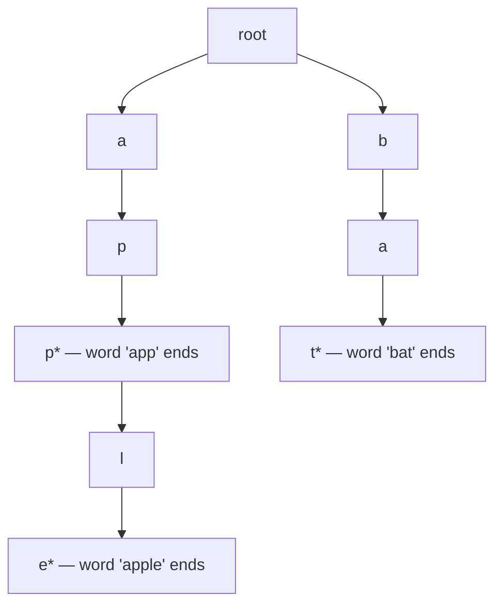

# Tries

A **trie** (prefix tree) is a tree where each path from root to node represents a prefix of stored strings. Tries unlock O(L) lookups (where L is word length, not the dictionary size) and are the canonical data structure for **autocomplete**, **prefix search**, **dictionary lookup with wildcards**, and **word-search-on-grid** problems. They appear often in interviews for senior+ candidates and are a Flipkart Machine Coding favourite.

## The Node

```java
class TrieNode {
    TrieNode[] children = new TrieNode[26];    // for lowercase a-z
    boolean isEnd = false;                      // marks end of a word
}
```

For arbitrary characters, swap `TrieNode[26]` for `Map<Character, TrieNode> children = new HashMap<>()`. The array is faster (constant-factor) for fixed alphabets.



## Insert + Search + StartsWith

```java
class Trie {
    private final TrieNode root = new TrieNode();

    public void insert(String word) {
        TrieNode n = root;
        for (char c : word.toCharArray()) {
            int i = c - 'a';
            if (n.children[i] == null) n.children[i] = new TrieNode();
            n = n.children[i];
        }
        n.isEnd = true;
    }

    public boolean search(String word) {
        TrieNode n = find(word);
        return n != null && n.isEnd;
    }

    public boolean startsWith(String prefix) {
        return find(prefix) != null;
    }

    private TrieNode find(String s) {
        TrieNode n = root;
        for (char c : s.toCharArray()) {
            int i = c - 'a';
            if (n.children[i] == null) return null;
            n = n.children[i];
        }
        return n;
    }
}
// insert: O(L), search/startsWith: O(L), where L = word length
```

## Pattern 1 — Autocomplete

```java
public List<String> autocomplete(Trie t, String prefix, int limit) {
    List<String> result = new ArrayList<>();
    TrieNode n = t.findPrefix(prefix);
    if (n == null) return result;
    dfsCollect(n, new StringBuilder(prefix), result, limit);
    return result;
}
private void dfsCollect(TrieNode n, StringBuilder path, List<String> out, int limit) {
    if (out.size() >= limit) return;
    if (n.isEnd) out.add(path.toString());
    for (int i = 0; i < 26; i++) {
        if (n.children[i] != null) {
            path.append((char)('a' + i));
            dfsCollect(n.children[i], path, out, limit);
            path.deleteCharAt(path.length() - 1);
        }
    }
}
```

## Pattern 2 — Wildcard Search (`.`)

```java
// "Add and Search Word — Data structure design"
public boolean search(String word) {
    return dfs(word, 0, root);
}
private boolean dfs(String word, int idx, TrieNode n) {
    if (idx == word.length()) return n.isEnd;
    char c = word.charAt(idx);
    if (c == '.') {
        for (TrieNode child : n.children) {
            if (child != null && dfs(word, idx + 1, child)) return true;
        }
        return false;
    } else {
        TrieNode child = n.children[c - 'a'];
        return child != null && dfs(word, idx + 1, child);
    }
}
// O(26^numDots · L) worst case
```

## Pattern 3 — Word Search II (Trie + DFS)

The famous "find all words in a grid" problem becomes tractable by inserting all words into a trie, then DFS-ing the grid against the trie. Brute force is O(W · m · n · 4^L); trie approach prunes infeasible paths early.

```java
public List<String> findWords(char[][] board, String[] words) {
    TrieNode root = new TrieNode();
    for (String w : words) insert(root, w);
    Set<String> result = new HashSet<>();
    for (int r = 0; r < board.length; r++)
        for (int c = 0; c < board[0].length; c++)
            dfs(board, r, c, root, new StringBuilder(), result);
    return new ArrayList<>(result);
}
private void dfs(char[][] b, int r, int c, TrieNode n, StringBuilder path, Set<String> out) {
    if (r < 0 || r >= b.length || c < 0 || c >= b[0].length) return;
    char ch = b[r][c]; if (ch == '#') return;
    TrieNode next = n.children[ch - 'a']; if (next == null) return;
    path.append(ch);
    if (next.isEnd) out.add(path.toString());
    b[r][c] = '#';                                       // mark visited
    dfs(b, r+1, c, next, path, out); dfs(b, r-1, c, next, path, out);
    dfs(b, r, c+1, next, path, out); dfs(b, r, c-1, next, path, out);
    b[r][c] = ch;                                        // restore
    path.deleteCharAt(path.length() - 1);
}
```

## Trie Space Cost

For a dictionary of W words with average length L, naive trie is `O(W · L · 26)` bytes worst case if using `TrieNode[26]`. The HashMap variant is more compact for sparse alphabets. **Radix tree / compressed trie** stores edges as strings (collapsing single-child chains) to save space — out of scope for most interviews but worth naming.

## When NOT To Use A Trie

- **Single lookup**: HashMap is simpler and as fast for exact match.
- **No prefix queries**: HashMap wins.
- **Very few words**: HashMap's constant factor wins.

Tries shine when you need **prefix-based queries** at scale.

## Sources & Further Reading

- [Trie (Wikipedia)](https://en.wikipedia.org/wiki/Trie)
- [LeetCode Trie tag](https://leetcode.com/tag/trie/)
- [Algorithms by Sedgewick — Tries chapter](https://algs4.cs.princeton.edu/52trie/)

## Practice

1. **Implement Trie (Prefix Tree)** — basic insert/search/startsWith.
2. **Add and Search Word — wildcard `.`**.
3. **Word Search II** — trie + DFS grid.
4. **Replace Words** — find shortest prefix root.
5. **Map Sum Pairs** — trie with sums at nodes.
6. **Longest Word in Dictionary** — BFS or DFS through trie.
7. **Concatenated Words** — DFS through trie of all words.
8. **Top K Frequent Words** — heap + trie (or PriorityQueue alone).
9. **Stream of Characters** — reverse trie for suffix matching.
10. **Maximum XOR of Two Numbers in an Array** — bit-trie.

## Detailed Worked Solutions

### 1. Implement Trie (full insert + search + startsWith)

```java
class Trie {
    private static class Node { Node[] children = new Node[26]; boolean end; }
    private final Node root = new Node();
    public void insert(String word) {
        Node n = root;
        for (char c : word.toCharArray()) {
            int i = c - 'a';
            if (n.children[i] == null) n.children[i] = new Node();
            n = n.children[i];
        }
        n.end = true;
    }
    public boolean search(String word) {
        Node n = find(word);
        return n != null && n.end;
    }
    public boolean startsWith(String prefix) { return find(prefix) != null; }
    private Node find(String s) {
        Node n = root;
        for (char c : s.toCharArray()) {
            n = n.children[c - 'a'];
            if (n == null) return null;
        }
        return n;
    }
}
// All ops O(L) — L = word length
```

### 2. Add and Search Word (`.` wildcard)

```java
class WordDictionary {
    private static class Node { Node[] children = new Node[26]; boolean end; }
    private final Node root = new Node();
    public void addWord(String word) {
        Node n = root;
        for (char c : word.toCharArray()) {
            int i = c - 'a';
            if (n.children[i] == null) n.children[i] = new Node();
            n = n.children[i];
        }
        n.end = true;
    }
    public boolean search(String word) { return dfs(word, 0, root); }
    private boolean dfs(String w, int idx, Node n) {
        if (n == null) return false;
        if (idx == w.length()) return n.end;
        char c = w.charAt(idx);
        if (c == '.') {
            for (Node child : n.children) if (dfs(w, idx + 1, child)) return true;
            return false;
        }
        return dfs(w, idx + 1, n.children[c - 'a']);
    }
}
// Worst case O(26^numDots × L)
```

### 3. Replace Words (find shortest dictionary prefix)

**Problem.** Replace each word in a sentence with its shortest dictionary-root prefix (if any).

```java
public String replaceWords(List<String> dictionary, String sentence) {
    Trie trie = new Trie();
    for (String d : dictionary) trie.insert(d);
    StringBuilder sb = new StringBuilder();
    for (String word : sentence.split(" ")) {
        if (sb.length() > 0) sb.append(' ');
        sb.append(shortestRoot(trie, word));
    }
    return sb.toString();
}
private String shortestRoot(Trie t, String word) {
    Node n = t.root;
    StringBuilder prefix = new StringBuilder();
    for (char c : word.toCharArray()) {
        int i = c - 'a';
        if (n.children[i] == null) return word;
        n = n.children[i];
        prefix.append(c);
        if (n.end) return prefix.toString();
    }
    return word;
}
// O(N · L) — N words, L max word length
```

### 4. Word Search II (trie + DFS grid)

```java
private List<String> result = new ArrayList<>();
public List<String> findWords(char[][] board, String[] words) {
    Node root = new Node();
    for (String w : words) insert(root, w);
    for (int r = 0; r < board.length; r++)
        for (int c = 0; c < board[0].length; c++)
            dfs(board, r, c, root, new StringBuilder());
    return result;
}
private void insert(Node root, String w) {
    Node n = root;
    for (char c : w.toCharArray()) {
        if (n.children[c - 'a'] == null) n.children[c - 'a'] = new Node();
        n = n.children[c - 'a'];
    }
    n.word = w;
}
private static class Node { Node[] children = new Node[26]; String word; }
private void dfs(char[][] b, int r, int c, Node n, StringBuilder path) {
    if (r < 0 || r >= b.length || c < 0 || c >= b[0].length) return;
    char ch = b[r][c]; if (ch == '#') return;
    Node next = n.children[ch - 'a']; if (next == null) return;
    path.append(ch);
    if (next.word != null) { result.add(next.word); next.word = null; }   // dedup
    b[r][c] = '#';
    dfs(b, r+1, c, next, path); dfs(b, r-1, c, next, path);
    dfs(b, r, c+1, next, path); dfs(b, r, c-1, next, path);
    b[r][c] = ch;
    path.deleteCharAt(path.length() - 1);
}
```

### 5. Map Sum Pairs

**Problem.** Implement `insert(key, val)` and `sum(prefix)` — sum of values for all keys starting with prefix.

```java
class MapSum {
    private static class Node { Node[] children = new Node[26]; int total; }
    private final Node root = new Node();
    private final Map<String, Integer> map = new HashMap<>();
    public void insert(String key, int val) {
        int delta = val - map.getOrDefault(key, 0);
        map.put(key, val);
        Node n = root;
        for (char c : key.toCharArray()) {
            if (n.children[c - 'a'] == null) n.children[c - 'a'] = new Node();
            n = n.children[c - 'a'];
            n.total += delta;
        }
    }
    public int sum(String prefix) {
        Node n = root;
        for (char c : prefix.toCharArray()) {
            n = n.children[c - 'a'];
            if (n == null) return 0;
        }
        return n.total;
    }
}
```

**Trick**: each Trie node stores the cumulative sum of all keys passing through it. Insert is O(L); sum is O(L).

## Recap

You should now be able to:

- Implement a **basic Trie** with array-of-children or map-of-children.
- Apply tries to **autocomplete, prefix search, wildcard search, word-search-on-grid**.
- Recognise when **HashMap beats trie** (no prefix queries, small dictionary).
- Compute trie **time and space** complexity.
- Apply **bit-tries** for max-XOR problems (mention; not deep-drilled here).

## Next

Continue to [Dynamic Programming](./T12-dynamic-programming.md).
