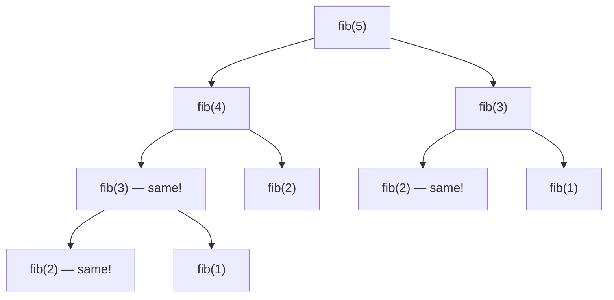
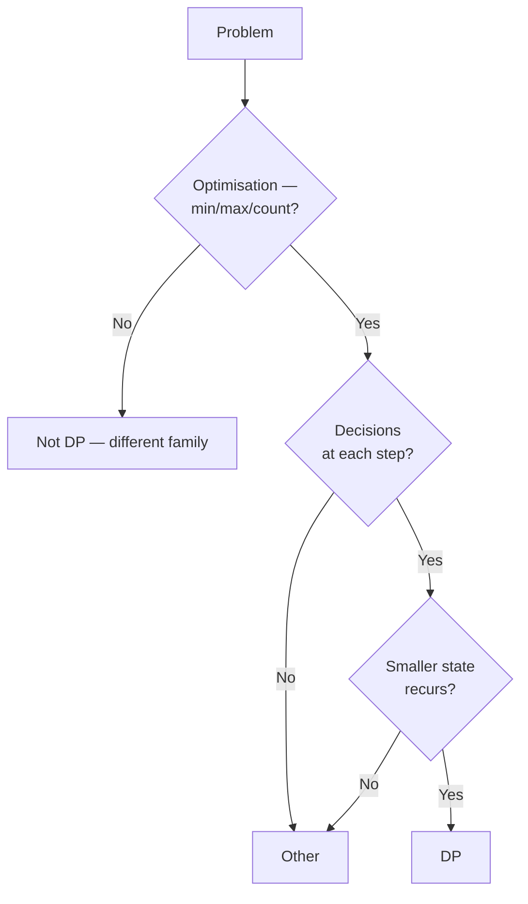

# Dynamic Programming

DP is the topic that separates the candidates who studied algorithms from those who didn't. **Around 15-20% of medium/hard interview rounds at Google, Microsoft, and senior Indian product rounds** involve DP — and Meta has famously **banned DP from coding rounds** to keep speed-first ([interviewing.io Meta](https://interviewing.io/guides/hiring-process/meta-facebook)). When DP shows up, candidates who haven't drilled the patterns flounder; those who have, recognise the prompt in 30 seconds.

This topic covers the two DP styles (memoisation top-down, tabulation bottom-up), the classification (1D, 2D, knapsack family, LIS, LCS, edit distance, interval), and the recognition framework for "is this DP?".

## What DP Actually Is

**Dynamic Programming = recursion + memoisation + optimal substructure.** Three pieces:

1. **Recursion**: the problem reduces to smaller subproblems.
2. **Overlapping subproblems**: the same subproblem appears in multiple recursion paths — so memoising saves exponential work.
3. **Optimal substructure**: the optimal solution to the problem composes from optimal solutions to subproblems.

Without **both** overlapping subproblems and optimal substructure, it's just recursion. DP applies when memoising the recursion turns exponential to polynomial.



`fib(3)` and `fib(2)` repeat. Memoising each makes total calls O(n), not O(2ⁿ).

## Top-Down vs Bottom-Up

### Top-down (memoisation)

```java
// "Climbing Stairs" — memoised recursion
private Map<Integer, Integer> memo = new HashMap<>();
public int climbStairs(int n) {
    if (n <= 2) return n;
    Integer cached = memo.get(n);
    if (cached != null) return cached;
    int result = climbStairs(n - 1) + climbStairs(n - 2);
    memo.put(n, result);
    return result;
}
// O(n) time + space
```

**Pros**: closer to the natural recursive formulation; only computes needed states.

**Cons**: recursion-stack overhead and risk of stack overflow on deep DP.

### Bottom-up (tabulation)

```java
public int climbStairs(int n) {
    if (n <= 2) return n;
    int[] dp = new int[n + 1];
    dp[1] = 1; dp[2] = 2;
    for (int i = 3; i <= n; i++) dp[i] = dp[i - 1] + dp[i - 2];
    return dp[n];
}
// O(n) time, O(n) space (further reducible to O(1) by keeping only last 2 values)
```

**Pros**: iterative, no stack; often easier to optimise for space.

**Cons**: requires figuring out fill order; computes all states (sometimes unnecessary).

### Space optimisation

```java
public int climbStairs(int n) {
    if (n <= 2) return n;
    int a = 1, b = 2;
    for (int i = 3; i <= n; i++) {
        int c = a + b; a = b; b = c;
    }
    return b;
}
// O(n) time, O(1) space
```

When `dp[i]` only depends on `dp[i-1]` and `dp[i-2]`, you only need two variables.

## The DP Recognition Framework



If the answer is "what is the max/min/count of X" AND you can frame it as a sequence of decisions AND each decision depends on a smaller state — it's DP.

**State definition first.** "Let `dp[i]` = the max/min/count of … up to index i." If you can write that sentence, you can write the recurrence.

## The Six Families

### Family 1 — 1D linear DP

`dp[i]` depends on `dp[i-1]` and constant-look-back. Examples:

- **Climbing Stairs**: `dp[i] = dp[i-1] + dp[i-2]`
- **House Robber**: `dp[i] = max(dp[i-1], dp[i-2] + nums[i])`
- **Decode Ways**: `dp[i]` = ways to decode s[0..i)
- **Coin Change**: `dp[amount] = min over coins of dp[amount - coin] + 1`

```java
// "Coin Change" — minimum coins to make amount
public int coinChange(int[] coins, int amount) {
    int[] dp = new int[amount + 1];
    Arrays.fill(dp, amount + 1);              // sentinel: "impossible"
    dp[0] = 0;
    for (int a = 1; a <= amount; a++) {
        for (int c : coins) {
            if (c <= a) dp[a] = Math.min(dp[a], dp[a - c] + 1);
        }
    }
    return dp[amount] > amount ? -1 : dp[amount];
}
// O(amount × coins) time, O(amount) space
```

### Family 2 — 2D grid DP

`dp[i][j]` depends on `dp[i-1][j]` and `dp[i][j-1]`. Examples:

- **Unique Paths**: `dp[i][j] = dp[i-1][j] + dp[i][j-1]`
- **Minimum Path Sum**: `dp[i][j] = grid[i][j] + min(dp[i-1][j], dp[i][j-1])`
- **Maximal Square**: `dp[i][j] = min(dp[i-1][j], dp[i][j-1], dp[i-1][j-1]) + 1` if cell is `1`

```java
public int uniquePaths(int m, int n) {
    int[][] dp = new int[m][n];
    for (int[] row : dp) Arrays.fill(row, 1);
    for (int i = 1; i < m; i++)
        for (int j = 1; j < n; j++)
            dp[i][j] = dp[i-1][j] + dp[i][j-1];
    return dp[m-1][n-1];
}
// O(m·n) time, O(m·n) space (reducible to O(n) with rolling array)
```

### Family 3 — Knapsack family

**0/1 Knapsack**: pick or skip each item. `dp[i][w]` = max value using first i items with weight ≤ w.

```java
public int knapsack(int[] weights, int[] values, int W) {
    int n = weights.length;
    int[][] dp = new int[n + 1][W + 1];
    for (int i = 1; i <= n; i++)
        for (int w = 0; w <= W; w++) {
            dp[i][w] = dp[i-1][w];          // skip
            if (weights[i-1] <= w)
                dp[i][w] = Math.max(dp[i][w], dp[i-1][w - weights[i-1]] + values[i-1]);
        }
    return dp[n][W];
}
// O(n·W) time, O(n·W) space (reducible to O(W) with reverse iteration)
```

**Unbounded Knapsack**: pick each item any number of times. Same shape, forward iteration instead of reverse.

Variants: **Partition Equal Subset Sum**, **Target Sum**, **Coin Change**, **Last Stone Weight II**.

### Family 4 — LIS (Longest Increasing Subsequence)

```java
public int lengthOfLIS(int[] nums) {
    int[] dp = new int[nums.length];
    Arrays.fill(dp, 1);
    int best = 1;
    for (int i = 1; i < nums.length; i++) {
        for (int j = 0; j < i; j++) {
            if (nums[j] < nums[i]) dp[i] = Math.max(dp[i], dp[j] + 1);
        }
        best = Math.max(best, dp[i]);
    }
    return best;
}
// O(n²) time, O(n) space

// O(n log n) variant with patience-sort / binary search
public int lengthOfLISFast(int[] nums) {
    List<Integer> tails = new ArrayList<>();
    for (int x : nums) {
        int idx = Collections.binarySearch(tails, x);
        if (idx < 0) idx = -idx - 1;
        if (idx == tails.size()) tails.add(x); else tails.set(idx, x);
    }
    return tails.size();
}
```

### Family 5 — LCS / Edit Distance (2D string DP)

```java
// "Longest Common Subsequence"
public int longestCommonSubsequence(String a, String b) {
    int m = a.length(), n = b.length();
    int[][] dp = new int[m + 1][n + 1];
    for (int i = 1; i <= m; i++)
        for (int j = 1; j <= n; j++) {
            if (a.charAt(i-1) == b.charAt(j-1)) dp[i][j] = dp[i-1][j-1] + 1;
            else dp[i][j] = Math.max(dp[i-1][j], dp[i][j-1]);
        }
    return dp[m][n];
}
// O(m·n) time, O(m·n) space

// "Edit Distance" — Levenshtein
public int minDistance(String a, String b) {
    int m = a.length(), n = b.length();
    int[][] dp = new int[m + 1][n + 1];
    for (int i = 0; i <= m; i++) dp[i][0] = i;
    for (int j = 0; j <= n; j++) dp[0][j] = j;
    for (int i = 1; i <= m; i++)
        for (int j = 1; j <= n; j++) {
            if (a.charAt(i-1) == b.charAt(j-1)) dp[i][j] = dp[i-1][j-1];
            else dp[i][j] = 1 + Math.min(dp[i-1][j-1], Math.min(dp[i-1][j], dp[i][j-1]));
        }
    return dp[m][n];
}
```

### Family 6 — Interval DP

`dp[i][j]` for ranges `[i, j]`. Examples: matrix chain multiplication, palindrome partitioning min cuts, burst balloons.

```java
// "Longest Palindromic Subsequence"
public int longestPalindromeSubseq(String s) {
    int n = s.length();
    int[][] dp = new int[n][n];
    for (int i = 0; i < n; i++) dp[i][i] = 1;
    for (int len = 2; len <= n; len++) {
        for (int i = 0; i + len <= n; i++) {
            int j = i + len - 1;
            if (s.charAt(i) == s.charAt(j))
                dp[i][j] = (len == 2 ? 2 : dp[i+1][j-1] + 2);
            else
                dp[i][j] = Math.max(dp[i+1][j], dp[i][j-1]);
        }
    }
    return dp[0][n-1];
}
// O(n²) time, O(n²) space
```

## The DP Solving Process

1. **Identify the decision** — what choice are you making at each step?
2. **Define the state** — `dp[i]` = what does it represent?
3. **Write the recurrence** — how does `dp[i]` relate to smaller states?
4. **Initialise the base case** — `dp[0]`, `dp[1]`, boundary rows/cols.
5. **Determine fill order** — bottom-up needs to fill prerequisites first.
6. **Extract the answer** — usually `dp[n]` or `dp[n][m]`; sometimes max over the table.
7. **Optimise space** — collapse to 1D or constant if only previous row needed.

## Common Mistakes That Score Low

- **Not recognising DP**. Brute-forcing what's a DP problem fails the round.
- **Wrong state definition** — vague `dp[i] = answer up to i` without precise meaning leads to wrong recurrence.
- **Off-by-one on base case** — `dp[0]` vs `dp[1]` confusion.
- **Reverse vs forward iteration** for 0/1 vs unbounded knapsack — getting it wrong silently changes the problem.
- **Forgetting integer overflow** in DP on large counts (use `long`).
- **Bottom-up when top-down is clearer** — pick the shape that matches the problem; both score equally.

## Sources & Further Reading

- [CLRS Chapter 15 — Dynamic Programming](https://mitpress.mit.edu/9780262046305/)
- [LeetCode DP tag](https://leetcode.com/tag/dynamic-programming/)
- [Educative — Grokking Dynamic Programming Patterns](https://www.educative.io/courses/grokking-dynamic-programming-patterns-for-coding-interviews)
- [NeetCode 1D / 2D DP](https://neetcode.io/practice)

## Practice

1. **Climbing Stairs** — 1D linear.
2. **House Robber I / II** — 1D linear with constraint.
3. **Coin Change I / II** — 1D unbounded knapsack.
4. **Decode Ways** — 1D with conditional jumps.
5. **Longest Increasing Subsequence** — 1D with binary-search O(n log n) variant.
6. **Unique Paths I / II** — 2D grid.
7. **Minimum Path Sum** — 2D grid with values.
8. **Maximal Square** — 2D grid with min trick.
9. **Partition Equal Subset Sum** — 0/1 knapsack on booleans.
10. **0/1 Knapsack**.
11. **Longest Common Subsequence** — 2D string DP.
12. **Edit Distance** — 2D string DP with three choices.
13. **Longest Palindromic Subsequence** — interval DP.
14. **Burst Balloons** — interval DP (hard).
15. **Best Time to Buy and Sell Stock I / II / III / IV / Cooldown / Fee** — state-machine DP.
16. **Word Break** — 1D linear with dictionary.
17. **Wildcard / Regex Matching** — 2D with three choices.

## Detailed Worked Solutions

### 1. House Robber (1D linear DP)

**Problem.** Rob houses in a line; cannot rob two adjacent. Maximize total.

```java
public int rob(int[] nums) {
    int prev2 = 0, prev1 = 0;
    for (int n : nums) {
        int curr = Math.max(prev1, prev2 + n);
        prev2 = prev1;
        prev1 = curr;
    }
    return prev1;
}
// O(n) time, O(1) space
```

**Recurrence**: `dp[i] = max(dp[i-1], dp[i-2] + nums[i])` — skip or rob.

### 2. House Robber II (circular array)

**Problem.** Houses in a circle — first and last are adjacent.

```java
public int rob(int[] nums) {
    if (nums.length == 1) return nums[0];
    return Math.max(robRange(nums, 0, nums.length - 2),     // skip last
                    robRange(nums, 1, nums.length - 1));    // skip first
}
private int robRange(int[] nums, int lo, int hi) {
    int prev2 = 0, prev1 = 0;
    for (int i = lo; i <= hi; i++) {
        int curr = Math.max(prev1, prev2 + nums[i]);
        prev2 = prev1; prev1 = curr;
    }
    return prev1;
}
// O(n) time, O(1) space
```

**Trick**: split into two linear House-Robber problems (one excludes first, one excludes last). Max of both = answer.

### 3. Decode Ways

**Problem.** Given a digit string, count decodings ('A'=1, ..., 'Z'=26).

```java
public int numDecodings(String s) {
    if (s.charAt(0) == '0') return 0;
    int prev2 = 1, prev1 = 1;
    for (int i = 1; i < s.length(); i++) {
        int curr = 0;
        if (s.charAt(i) != '0') curr += prev1;
        int two = Integer.parseInt(s.substring(i - 1, i + 1));
        if (two >= 10 && two <= 26) curr += prev2;
        prev2 = prev1; prev1 = curr;
    }
    return prev1;
}
// O(n) time, O(1) space
```

**Edge cases**: leading zero → 0; "10" → 1 (only "J"); "27" → 1 (only "BG"); "0" anywhere needs preceding 1 or 2.

### 4. LIS — O(n log n) via patience sort

**Problem.** Longest strictly increasing subsequence.

```java
public int lengthOfLIS(int[] nums) {
    List<Integer> tails = new ArrayList<>();
    for (int x : nums) {
        int idx = Collections.binarySearch(tails, x);
        if (idx < 0) idx = -idx - 1;
        if (idx == tails.size()) tails.add(x);
        else tails.set(idx, x);
    }
    return tails.size();
}
// O(n log n) time, O(n) space
```

**Insight**: `tails[i]` = smallest tail of any increasing subsequence of length `i+1`. Binary-search for the position to replace.

### 5. Coin Change (1D unbounded knapsack)

```java
public int coinChange(int[] coins, int amount) {
    int[] dp = new int[amount + 1];
    Arrays.fill(dp, amount + 1);
    dp[0] = 0;
    for (int a = 1; a <= amount; a++) {
        for (int c : coins) if (c <= a) dp[a] = Math.min(dp[a], dp[a - c] + 1);
    }
    return dp[amount] > amount ? -1 : dp[amount];
}
// O(amount × coins) time, O(amount) space
```

### 6. Edit Distance (Levenshtein) — 2D string DP

```java
public int minDistance(String a, String b) {
    int m = a.length(), n = b.length();
    int[][] dp = new int[m + 1][n + 1];
    for (int i = 0; i <= m; i++) dp[i][0] = i;
    for (int j = 0; j <= n; j++) dp[0][j] = j;
    for (int i = 1; i <= m; i++)
        for (int j = 1; j <= n; j++) {
            if (a.charAt(i - 1) == b.charAt(j - 1)) dp[i][j] = dp[i - 1][j - 1];
            else dp[i][j] = 1 + Math.min(dp[i - 1][j - 1],
                              Math.min(dp[i - 1][j], dp[i][j - 1]));   // replace, delete, insert
        }
    return dp[m][n];
}
// O(m·n) time, O(m·n) space (reducible to O(n) with rolling row)
```

### 7. Best Time to Buy and Sell Stock III (state-machine DP)

**Problem.** At most TWO transactions; max profit.

```java
public int maxProfit(int[] prices) {
    int buy1 = Integer.MAX_VALUE, sell1 = 0, buy2 = Integer.MAX_VALUE, sell2 = 0;
    for (int p : prices) {
        buy1 = Math.min(buy1, p);
        sell1 = Math.max(sell1, p - buy1);
        buy2 = Math.min(buy2, p - sell1);          // effective price after sell1 profit
        sell2 = Math.max(sell2, p - buy2);
    }
    return sell2;
}
// O(n) time, O(1) space
```

**State-machine framing**: 4 states tracking effective cost/profit at each transaction stage. Generalises to k transactions with a 2k-state DP.

### 8. Maximal Square (2D grid DP)

**Problem.** Largest square of `1`s in a binary matrix; return area.

```java
public int maximalSquare(char[][] matrix) {
    int m = matrix.length, n = matrix[0].length, best = 0;
    int[][] dp = new int[m + 1][n + 1];
    for (int i = 1; i <= m; i++)
        for (int j = 1; j <= n; j++)
            if (matrix[i-1][j-1] == '1') {
                dp[i][j] = 1 + Math.min(dp[i-1][j-1], Math.min(dp[i-1][j], dp[i][j-1]));
                best = Math.max(best, dp[i][j]);
            }
    return best * best;
}
// O(m·n) time, O(m·n) space (reducible to O(n))
```

**Recurrence**: `dp[i][j]` = side length of largest square ending at `(i,j)` = `1 + min(top, left, diagonal)` if cell is `1`.

### 9. Word Break

**Problem.** Can `s` be segmented into space-separated dictionary words?

```java
public boolean wordBreak(String s, List<String> wordDict) {
    Set<String> dict = new HashSet<>(wordDict);
    boolean[] dp = new boolean[s.length() + 1];
    dp[0] = true;
    for (int i = 1; i <= s.length(); i++)
        for (int j = 0; j < i; j++)
            if (dp[j] && dict.contains(s.substring(j, i))) { dp[i] = true; break; }
    return dp[s.length()];
}
// O(n²) time, O(n) space (assuming dictionary lookup O(L))
```

### 10. Partition Equal Subset Sum (0/1 knapsack as booleans)

```java
public boolean canPartition(int[] nums) {
    int sum = 0; for (int n : nums) sum += n;
    if (sum % 2 != 0) return false;
    int half = sum / 2;
    boolean[] dp = new boolean[half + 1];
    dp[0] = true;
    for (int n : nums)
        for (int j = half; j >= n; j--) dp[j] |= dp[j - n];   // reverse for 0/1
    return dp[half];
}
// O(n × sum/2) time, O(sum/2) space
```

**Reverse iteration**: prevents using one item twice (0/1 knapsack rule).

## Recap

You should now be able to:

- Distinguish DP from plain recursion (overlapping subproblems + optimal substructure).
- Choose between **top-down memoisation** and **bottom-up tabulation** based on problem shape.
- Apply space optimisation when only the last 1-2 states are needed.
- Recognise problems from the **six families** (1D linear, 2D grid, knapsack, LIS, LCS/edit, interval).
- Apply the **seven-step DP process** (decision → state → recurrence → base → order → answer → optimise).
- Avoid the common DP mistakes (wrong state, off-by-one base, wrong knapsack iteration direction).

## Next

Continue to [Greedy Algorithms](./T13-greedy-algorithms.md).
