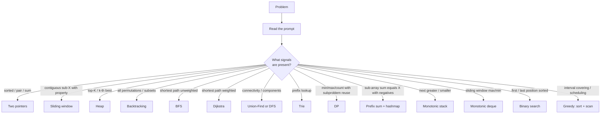
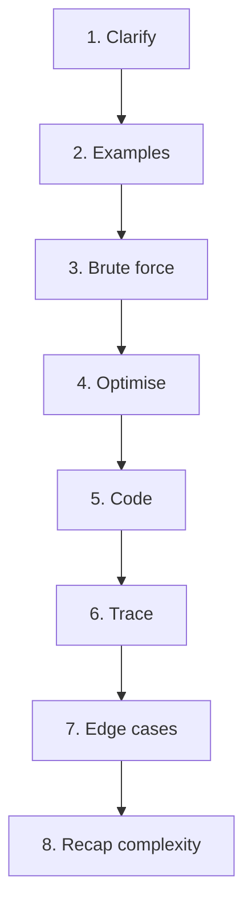
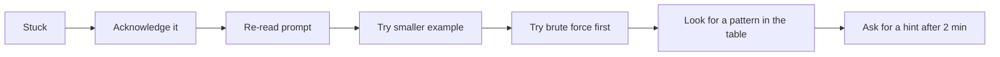

# Coding Interview Patterns & Problem-Solving Framework

By the end of C02 you have the *vocabulary* — every major data structure and algorithm. The skill that wins interviews is **pattern recognition**: in the first 60 seconds of a problem, identifying which technique applies. This topic is the consolidation pass: the **pattern-recognition cheat-table**, the **30-second triage process**, and the **8-step problem-solving framework** you run on every coding round.

## The 30-Second Triage

## The Pattern-Recognition Cheat Table

| Signal in prompt | Pattern |
|---|---|
| "sorted array" + pair/triple/sum | Two pointers |
| Contiguous subarray/substring + size/sum/k-distinct property | Sliding window |
| "find pair summing to target" (unsorted) | Hashing |
| "subarray sum equals K" (negatives allowed) | Prefix sum + hashmap |
| "top K" or "k-th most/least" | Heap of size k |
| "all permutations / subsets / combinations" | Backtracking |
| "min/max/count" + can-decompose-into-subproblems | DP |
| "shortest" + unweighted | BFS |
| "shortest" + weighted non-negative | Dijkstra |
| "shortest" + weighted with negatives | Bellman-Ford |
| "are u and v connected" + dynamic edges | Union-Find |
| "cycle in graph" | DFS (parent-skip undirected; 3-colour directed) |
| "course schedule" / "task ordering" | Topological sort |
| "longest path in DAG" | Topological sort + relaxation |
| "next greater / smaller" | Monotonic stack |
| "sliding window max/min" | Monotonic deque |
| "first / last index in sorted" | Binary search (lower/upper bound) |
| "minimum X such that Y satisfied" with monotonic Y | Binary search on the answer |
| Prefix-based queries on strings | Trie |
| "schedule N tasks with K constraint" | Greedy + heap |
| "intervals non-overlap / merge" | Sort + greedy |
| Recursion on tree | Recursive template (base + left + right + combine) |
| BST + sorted order | In-order traversal |

## The 8-Step Problem-Solving Framework

Run this on every coding round.

### Step 1 — Clarify (2-3 min)

Restate the problem in your own words. Ask 4-5 clarifying questions:

- Input bounds — size, range, sorted, distinct, negatives, null
- Output format — single result vs all; sorted; indices vs values
- Edge cases that change the algorithm — empty input, k > n, ties
- Constraints — time/space, modify input allowed, target environment

See [T05 Communication](../C01-foundations-of-interviewing/T05-communication-mechanics-clarify-structure-think-aloud-recover.md) for the script.

### Step 2 — Examples (2-3 min)

Walk through 2-3 examples on the whiteboard / IDE. Cover: happy path, edge case, a tricky case. Examples confirm understanding and often reveal misreadings.

### Step 3 — Brute Force (3-5 min)

State the brute-force approach first **with complexity**. Even if you immediately know the optimal, state brute force as the baseline.

> *"Brute force is to check every pair, O(n²) time, O(1) space."*

This scores on **algorithmic reasoning** in the rubric. Always do it.

### Step 4 — Optimise (3-5 min)

Identify the pattern (from the table above), articulate the optimisation, state new complexity.

> *"I can use a hashmap to lookup the complement in O(1), bringing the total to O(n) time, O(n) space — trading space for time."*

### Step 5 — Code (15-20 min)

Narrate as you write. Use the language idioms appropriate to your level (`Map.merge`, `ArrayDeque`, `Comparator.comparingInt`, primitive arrays for hot loops).

### Step 6 — Trace (3-5 min)

Walk through your code on one or two examples. Catches bugs before the interviewer does.

### Step 7 — Edge Cases (2-3 min)

Enumerate edge cases unprompted. Implement guards or note which the code already handles.

### Step 8 — Recap Complexity (1-2 min)

> *"Final: O(n) time, O(n) space. The trade vs brute force is the hashmap — if memory were tight, brute would win on space at the cost of n× time. Final code: O(n) time, O(n) space."*

## The "When Stuck" Recovery

Don't grind silently. Acknowledge, step back, try simpler, ask for a hint. (See [T05](../C01-foundations-of-interviewing/T05-communication-mechanics-clarify-structure-think-aloud-recover.md).)

## A Mental Library Of "Have I Seen This Before?"

After ~150 problems across patterns, every new problem starts to feel like a variant of one you've seen. Build this library by:

1. **Tagging each problem** by pattern after you solve it.
2. **Reviewing the tag** weekly — "what's my list of two-pointer problems?".
3. **Solving problems in pattern-blocks** (5-10 problems of the same pattern in a row).
4. **Writing pattern templates** in your own words — the act of writing the template reveals what you understand.

## The Three Final Failure Modes

Three patterns where strong DSA candidates still lose rounds:

### Failure 1 — Over-engineering

Picking heap when ArrayList would do; LinkedList when ArrayList wins; complex algorithm when O(n²) is acceptable given the input bounds. **Pick the simplest correct algorithm for the input size.**

### Failure 2 — Premature optimisation

Spending 25 minutes optimising when the interviewer is happy with O(n²) given the input size of 100. Get a correct solution first; optimise only if asked.

### Failure 3 — Knowledge without communication

Solving in your head, writing perfect code in silence, finishing in 20 minutes — and scoring poorly because the interviewer has no notes on your reasoning. **Narrate.** (See [T03 Rubric](../C01-foundations-of-interviewing/T03-the-interviewer-s-rubric-signals-scoring-calibration.md) and [T05 Communication](../C01-foundations-of-interviewing/T05-communication-mechanics-clarify-structure-think-aloud-recover.md).)

## Putting It All Together — A 3-Month Drill Plan

Combine with [T06 Prep System](../C01-foundations-of-interviewing/T06-prep-system-weeks-out-plan-mock-cadence-day-of-routine.md):

- **Weeks 1-2**: Foundation — Big-O, patterns survey, 2 problems per day on warm-up topics.
- **Weeks 3-8**: Pattern blocks — one pattern per week, 8-10 problems per pattern.
- **Weeks 9-10**: Mixed practice — random problems, simulate real interview unpredictability.
- **Weeks 11-12**: Mocks-heavy, real loops.

## Sources & Further Reading

- [NeetCode 150](https://neetcode.io/practice) — curated 150 by pattern
- [Tech Interview Handbook — Best Practices](https://www.techinterviewhandbook.org/coding-interview-techniques/)
- [Educative — Grokking Coding Patterns](https://www.educative.io/courses/grokking-the-coding-interview)
- [LeetCode Patterns by Sean Prashad](https://github.com/SeanPrashad/leetcode-patterns)

## Practice

1. **Run the 8-step framework on 5 random LeetCode mediums.** Time-box each.
2. **Build your pattern-tag spreadsheet.** For every problem you've solved, tag its pattern.
3. **Solve 5 problems in a single pattern block.** Two pointers, then sliding window, then heaps — one block per week.
4. **Self-mock with the cheat table beside you.** Read the prompt; identify the pattern within 60 seconds; then solve.
5. **Replay your past mocks.** Identify failure modes (over-engineering, premature opt, silent reasoning).
6. **Run a mixed-pattern day.** Pick 5 random problems across patterns; can you recognise each in 60 seconds?
7. **Teach the framework to a peer.** Teaching forces you to articulate it.

## Recap

You should now be able to:

- Apply the **30-second pattern triage** to recognise problem type quickly.
- Use the **pattern-recognition cheat table** to map prompt signals to algorithms.
- Run the **8-step problem-solving framework** on every coding round (Clarify → Examples → Brute → Optimise → Code → Trace → Edges → Complexity).
- Apply the **"when stuck" recovery loop** (acknowledge → re-read → simpler → brute → pattern lookup → hint).
- Build your **pattern library** through tagged practice and pattern-block drills.
- Avoid the **three final failure modes** (over-engineering, premature optimisation, silent solving).
- Combine this with [T06 Prep System](../C01-foundations-of-interviewing/T06-prep-system-weeks-out-plan-mock-cadence-day-of-routine.md) for a complete 12-week ramp.

## Next

Continue to [C03 Design Interviews — Low-Level Design (OOD) Interviews — Framework](../C03-design-interviews/T01-low-level-design-ood-interviews-framework.md).
