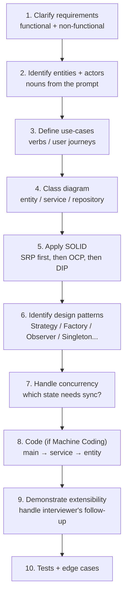
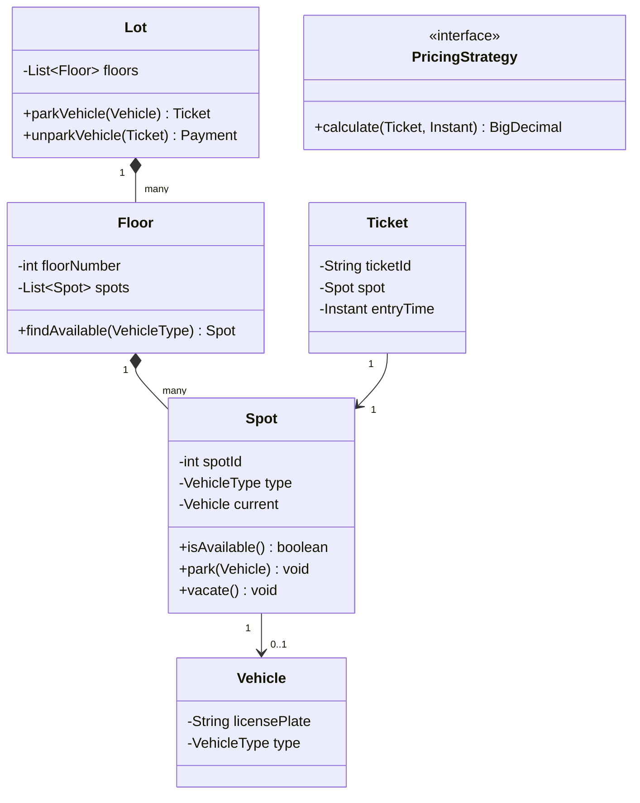

# Low-Level Design (OOD) Interviews — Framework

The Low-Level Design (LLD) round — also called Object-Oriented Design (OOD), Object Design, or simply "the design round" — is the **single most-distinctive round at Indian product unicorns and increasingly at FAANGM L4-L5 loops**. You are given a real-world domain ("design a parking lot", "design Splitwise", "design a chess game") and asked to produce a working object-oriented design with clean class boundaries, applied SOLID principles, and — at Indian product shops in Machine Coding form — actual compiling code with unit tests in 60-90 minutes.

This topic is the **framework** for the round: the 10-step process, the rubric the interviewer scores against, the canonical patterns you'll reach for, and the anti-patterns that tank candidates. Subsequent topics ([T02 Parking Lot](./T02-ood-case-study-parking-lot.md), [T03 Splitwise](./T03-ood-case-study-splitwise.md), [T04 Library](./T04-ood-case-study-library-management.md), [T05 Machine Coding](./T05-machine-coding-round-flipkart-style-90-minute-build.md)) are full worked examples applying this framework.

## What LLD Actually Tests

```mermaid
flowchart TB
  L[LLD Round Signals] --> S1[Requirements clarity<br/>scope a vague brief]
  L --> S2[Class identification<br/>extract right abstractions]
  L --> S3[SOLID application<br/>SRP / OCP / LSP / ISP / DIP]
  L --> S4[Design pattern selection<br/>Strategy / Factory / Observer / etc.]
  L --> S5[Extensibility<br/>handle new requirement live]
  L --> S6[Concurrency awareness<br/>thread-safe state]
  L --> S7[Code quality (machine coding)<br/>compiles, runs, tests]
```

Interviewers score these signals separately. A round that nails class boundaries but ignores SOLID scores worse than one with weaker boundaries but explicit Strategy + clean OCP.

## The 10-Step Framework



### Step 1 — Clarify requirements

The vague brief is intentional. Bound it before designing.

> *"For the parking lot — single building or multi-building? Multiple floors? Vehicle types? Pricing per hour or flat? Reservations allowed? Real-time payment integration or just track? Concurrent users — how many spots are filled per minute?"*

5-7 questions, 90 seconds. Bounds the design.

### Step 2 — Identify entities + actors

Re-read the prompt; **circle the nouns**. Most become entities.

Parking lot: `Vehicle`, `Spot`, `Floor`, `Lot`, `Ticket`, `Payment`, `Receipt`, `Operator`, `Pricing`.

Some are entities (`Vehicle`, `Ticket`, `Payment`), some are services (`Pricing`), some are aggregates (`Lot` contains `Floors` contains `Spots`).

### Step 3 — Define use-cases

The verbs:

- `parkVehicle(vehicle) → ticket`
- `findAvailableSpot(vehicleType) → spot`
- `unparkVehicle(ticket) → payment`
- `calculatePrice(ticket, durationHours) → amount`
- `processPayment(payment, method) → receipt`

These become **service methods**.

### Step 4 — Class diagram

Sketch (Mermaid in remote interviews; whiteboard in-person):



Three layers: **entities** (data), **services** (logic), **strategies/policies** (variation).

### Step 5 — Apply SOLID

The five principles, with the most-tested two named first:

- **SRP — Single Responsibility**: each class has one reason to change. `Spot` knows occupancy, not pricing. `Pricing` knows pricing, not occupancy.
- **OCP — Open/Closed**: open for extension, closed for modification. New `PricingStrategy` is added as a new class, not by editing existing logic.
- **LSP — Liskov Substitution**: subtypes work wherever the base type works without surprising the caller. `MotorcycleSpot extends Spot` only if it doesn't break invariants.
- **ISP — Interface Segregation**: don't force clients to depend on methods they don't use. Split fat interfaces.
- **DIP — Dependency Inversion**: depend on abstractions (interfaces), not concretions. `Lot` depends on `PricingStrategy`, not `HourlyPricing`.

> [!INTERVIEW]
> When the interviewer says *"now add VIP pricing — half-rate for VIP members"*, the right move is to **plug in a new `VipPricing implements PricingStrategy`** and inject it — demonstrating OCP. The wrong move is to add an `if (isVip)` branch to existing code.

### Step 6 — Design patterns

The seven you'll reach for most often in LLD:

| Pattern | Use |
|---|---|
| **Strategy** | Pluggable algorithm (pricing, sorting, matching) |
| **Factory / Abstract Factory** | Create objects whose concrete type depends on input |
| **Singleton** | Single shared instance (Lot itself, registry) — use sparingly |
| **Observer** | Notify multiple parties of state change (slot freed → notify waitlist) |
| **Command** | Encapsulate request as object (undo/redo, request log) |
| **Decorator** | Wrap an object to extend behaviour without subclassing |
| **State** | Object's behaviour depends on its state (Order: PLACED → PAID → SHIPPED → DELIVERED) |

Name the pattern aloud when you apply it: *"I'll use a Strategy for pricing because we expect multiple pricing schemes and want to add new ones without modifying existing code — Open/Closed."*

### Step 7 — Concurrency

Most real LLD systems have concurrent users. Identify the shared mutable state:

- `Spot` occupancy — multiple cars trying to park in the same spot.
- `Lot` capacity counters.
- `Ticket` ID generation.

Choices:

- `ConcurrentHashMap` for spot/vehicle lookups.
- `AtomicInteger` for ID generation.
- `ReentrantLock` per Floor (not per Spot — too granular) for atomic find-and-claim.
- `synchronized` on `Spot.park()` if the cost is acceptable.

State the concurrency model explicitly: *"I'll lock per Floor when claiming a spot — finer than lock-the-whole-lot, coarser than lock-per-spot which adds overhead."*

### Step 8 — Code (Machine Coding round only)

Build in this order:

1. **Enums** for finite states (`VehicleType`, `SpotStatus`, `PaymentMethod`).
2. **Entities** (`Vehicle`, `Spot`, `Ticket`).
3. **Interfaces / Strategies** (`PricingStrategy`).
4. **Services** (`ParkingService` with `parkVehicle`, `unparkVehicle`).
5. **Wiring** (constructor DI for strategies).
6. **`main()` driver** demonstrating the API.

Keep ~80 minutes for coding, ~20 minutes for follow-up requirements + tests.

### Step 9 — Extensibility

The interviewer **will** ask you to extend the design mid-round: *"Now add reservation. Now add multiple branches with a unified search. Now add EV charging."* The design's quality is judged by how cleanly you can absorb the new requirement.

**Strong response**: *"Reservation is a new state in the Ticket lifecycle — I'd add `RESERVED` to the enum and a `ReservationService` that holds a `Spot` for a future time slot. The existing `parkVehicle` becomes a method that takes either a new arrival or a reservation. Pricing stays unchanged."*

**Weak response**: hacking an `if (isReservation)` branch into `parkVehicle`.

### Step 10 — Tests + edge cases

For Machine Coding rounds, 3-5 JUnit tests covering happy path + 1-2 edge cases lifts the score. Edge cases for parking lot: full lot, vehicle without spot of its type, double-park attempt, invalid ticket.

## The LLD Round Rubric

| Signal | Strong evidence |
|---|---|
| **Requirements clarity** | Asked 5-7 clarifying questions; stated assumptions |
| **Class boundaries** | Entity/service/strategy separation; no god class |
| **SOLID** | Named SRP/OCP/DIP explicitly; applied them visibly |
| **Patterns** | Used Strategy / Factory / Observer / State by name |
| **Concurrency** | Identified shared state; chose lock granularity |
| **Extensibility** | Absorbed new requirement cleanly |
| **Code quality** | (Machine coding) Compiles, runs, demo passes |

## The Five Anti-Patterns That Tank Rounds

1. **God class.** `ParkingLot` with 30 methods doing everything.
2. **Hardcoded if-else for variation.** `if (type == VIP) ... else if (type == REGULAR) ...` — should be Strategy.
3. **No interfaces.** Concrete classes depending on each other; can't unit-test, can't swap.
4. **Mutating an enum's behaviour by adding fields.** Use a class hierarchy, not a fat enum.
5. **Skipping the requirements clarification.** Designing immediately reveals weak senior judgment.

## Java Idioms That Score Well

- **`enum` for finite states** (`VehicleType`, `OrderStatus`) — never `String` constants.
- **`Optional<T>`** for nullable returns from finders.
- **`record`** (Java 16+) for immutable value objects / DTOs.
- **Constructor DI** (no Spring needed in interview code) — pass dependencies in the constructor.
- **`Map.computeIfAbsent`** for building maps-of-lists.
- **`ConcurrentHashMap`** instead of `synchronized HashMap`.
- **Custom exceptions** per failure mode (not raw `RuntimeException`).
- **Builder pattern** when an entity has 5+ optional fields.

## Worked Skeleton

```java
// Domain enum
enum VehicleType { CAR, MOTORCYCLE, TRUCK }
enum SpotStatus { AVAILABLE, OCCUPIED, RESERVED }

// Entity (record for immutability where possible)
record Vehicle(String licensePlate, VehicleType type) {}

// Strategy
interface PricingStrategy {
    BigDecimal calculate(Ticket ticket, Instant exitTime);
}
class HourlyPricing implements PricingStrategy {
    public BigDecimal calculate(Ticket t, Instant exit) {
        long hours = Math.max(1, Duration.between(t.entryTime(), exit).toHours());
        return BigDecimal.valueOf(hours * 50);
    }
}

// Service
class ParkingService {
    private final Lot lot;
    private final PricingStrategy pricing;          // constructor DI

    public ParkingService(Lot lot, PricingStrategy pricing) {
        this.lot = lot; this.pricing = pricing;
    }

    public Ticket parkVehicle(Vehicle v) {
        Spot spot = lot.findAvailable(v.type())
            .orElseThrow(() -> new NoSpotAvailableException(v.type()));
        spot.park(v);
        return new Ticket(UUID.randomUUID().toString(), spot, Instant.now());
    }

    public Payment unparkVehicle(Ticket t) {
        BigDecimal amount = pricing.calculate(t, Instant.now());
        t.spot().vacate();
        return new Payment(t, amount);
    }
}

// Main driver
public static void main(String[] args) {
    Lot lot = new Lot(List.of(new Floor(1, List.of(new Spot(1, VehicleType.CAR)))));
    ParkingService svc = new ParkingService(lot, new HourlyPricing());
    Vehicle v = new Vehicle("KA-01-1234", VehicleType.CAR);
    Ticket t = svc.parkVehicle(v);
    Payment p = svc.unparkVehicle(t);
    System.out.println("Paid: " + p.amount());
}
```

## Sources & Further Reading

- [Workat.tech Machine Coding practice](https://workat.tech/machine-coding/practice)
- [Refactoring Guru — Design Patterns](https://refactoring.guru/design-patterns)
- [SOLID Principles — Robert Martin](https://web.archive.org/web/20150906155800/http://www.objectmentor.com/resources/articles/Principles_and_Patterns.pdf)

## Practice

1. Run the 10-step framework on a vague prompt — *"design a vending machine"*. Aim to complete it in 60 minutes solo.
2. Take the Parking Lot skeleton above and extend it for the *"add VIP pricing"* requirement using Strategy. Time-box at 15 minutes.
3. Identify the 7 most-used design patterns and write a 2-line description of each.
4. For one prompt, sketch the class diagram (no code) in 20 minutes and defend each class boundary.
5. Code a `ParkingService` with constructor DI, custom exceptions, and one unit test. 45 minutes.
6. Find a god-class anti-pattern in your codebase; refactor into 3 classes following SRP. Time how long it takes.
7. Pair-design with a peer: one person plays interviewer, one candidate. Use the rubric to score afterward.

## Recap

You should now be able to:

- Apply the **10-step LLD framework** to any vague domain prompt.
- Score against the **LLD rubric** (requirements, class boundaries, SOLID, patterns, concurrency, extensibility, code).
- Recognise and avoid the **five anti-patterns** (god class, hardcoded variation, no interfaces, fat enum, no clarification).
- Use **Java idioms that score** (enum, record, Optional, constructor DI, ConcurrentHashMap, custom exceptions).
- Apply the **seven design patterns** most often used in LLD (Strategy, Factory, Singleton, Observer, Command, Decorator, State).
- Articulate **concurrency choices** (lock granularity, ConcurrentHashMap, AtomicInteger).
- Handle the interviewer's **mid-round extension** cleanly (plug a new strategy/state, don't add if-else).

## Next

Continue to [OOD Case Study: Parking Lot](./T02-ood-case-study-parking-lot.md).
