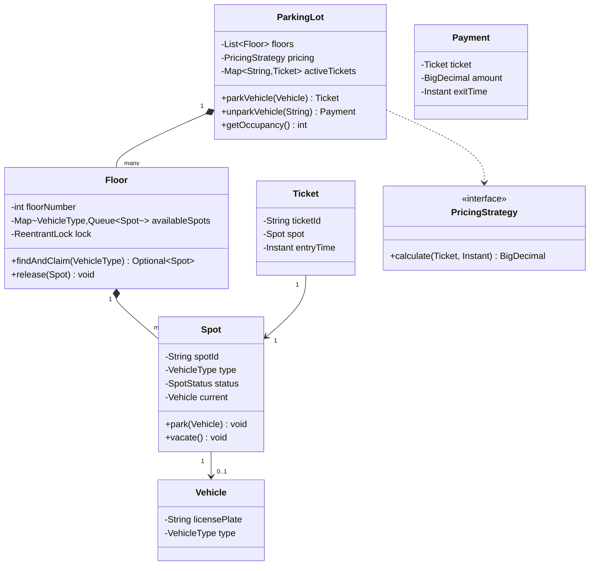

# OOD Case Study: Parking Lot

The Parking Lot problem is the **most-asked LLD prompt in the world** — Flipkart, Amazon, Microsoft, Uber, PhonePe, Razorpay, and dozens of Indian product shops all use it. It is the rite-of-passage problem for the LLD round because it surfaces every design lever: entities vs services, SRP, OCP via Strategy, concurrency under contention, and extensibility for inevitable follow-ups (multi-floor, multi-vehicle-type, reservation, pricing variants).

This topic walks the **full worked design** end-to-end using the [10-step framework from T01](./T01-low-level-design-ood-interviews-framework.md): clarify, classes, SOLID, patterns, concurrency, code, extensibility, tests.

## Step 1 — Clarify

Five questions to bound the design:

1. **Capacity / structure**: single floor or multi-floor? How many spots per floor? Multiple lots / branches?
2. **Vehicle types**: car only, or motorcycle + car + truck + bus + EV? Does each have its own spot size?
3. **Pricing**: hourly / flat / per-vehicle-type / VIP-discounted? Real money or just track?
4. **Reservation**: walk-in only, or can users reserve future slots?
5. **Concurrency**: how many parking events per minute at peak? Reserved spots vs first-come-first-served?

For this worked design we'll assume: **single lot, multi-floor, three vehicle types (motorcycle, car, truck), hourly pricing, no reservation, ~10 events/minute peak**.

## Step 2 — Entities + Actors

Nouns from the prompt:

- `ParkingLot` — root aggregate
- `Floor` — physical level
- `Spot` — single parking space
- `Vehicle` — what enters
- `Ticket` — issued on entry
- `Payment` — issued on exit
- `Operator` — staff member (optional)
- `EntryGate` / `ExitGate` — entry/exit points

Actors: `Driver`, `Operator`.

## Step 3 — Use cases

- `parkVehicle(vehicle) → ticket` (Driver entering)
- `findAvailableSpot(vehicleType) → spot` (internal)
- `unparkVehicle(ticket) → payment` (Driver exiting)
- `getOccupancy() → int` (Operator dashboard)
- `getAvailableSpotCount(VehicleType) → int` (display board)

## Step 4 — Class diagram



## Step 5 — SOLID

- **SRP**: `Spot` knows its own state, not pricing. `PricingStrategy` knows pricing. `Floor` knows spot allocation. `ParkingLot` orchestrates.
- **OCP**: Adding new pricing scheme (VIP, weekend) means new `PricingStrategy` impl, no edits.
- **LSP**: Future `MotorcycleSpot extends Spot` (if needed) must not break Spot invariants.
- **ISP**: `PricingStrategy` has one method; not a fat interface.
- **DIP**: `ParkingLot` depends on `PricingStrategy` (interface), not `HourlyPricing` (concrete).

## Step 6 — Design patterns

- **Strategy**: `PricingStrategy` with `HourlyPricing`, `FlatRatePricing`, `VipPricing`.
- **Factory**: `SpotFactory.create(type)` if Spot has subtypes.
- **Singleton** (sparingly): `ParkingLot` itself could be singleton if the system has one lot.
- **Observer**: when a spot frees, notify waitlist (extension — covered in step 9).

## Step 7 — Concurrency

Shared mutable state: `Spot.status`, `Floor.availableSpots`, `ParkingLot.activeTickets`.

Choices:

- **`activeTickets`** → `ConcurrentHashMap` (multiple drivers entering/exiting simultaneously).
- **`Floor.findAndClaim`** → `ReentrantLock` per Floor. This is the critical section: two cars trying to claim the last spot on a floor.
- **`Spot.park` / `vacate`** → no extra lock needed; the floor's lock has already serialised the find-and-claim.

State the reasoning aloud: *"I'll lock per Floor — finer than lock-the-whole-lot (which would serialise all parking), coarser than lock-per-spot (which adds overhead without benefit since the rare contention is on the same floor)."*

## Step 8 — Code

```java
import java.math.BigDecimal;
import java.time.*;
import java.util.*;
import java.util.concurrent.*;
import java.util.concurrent.locks.*;

enum VehicleType { MOTORCYCLE, CAR, TRUCK }
enum SpotStatus { AVAILABLE, OCCUPIED }

record Vehicle(String licensePlate, VehicleType type) {}

class Spot {
    private final String spotId;
    private final VehicleType type;
    private SpotStatus status = SpotStatus.AVAILABLE;
    private Vehicle current;

    public Spot(String spotId, VehicleType type) {
        this.spotId = spotId; this.type = type;
    }
    public String getSpotId() { return spotId; }
    public VehicleType getType() { return type; }
    public boolean isAvailable() { return status == SpotStatus.AVAILABLE; }
    public void park(Vehicle v) {
        this.current = v; this.status = SpotStatus.OCCUPIED;
    }
    public void vacate() {
        this.current = null; this.status = SpotStatus.AVAILABLE;
    }
}

class Floor {
    private final int floorNumber;
    private final Map<VehicleType, Deque<Spot>> available = new EnumMap<>(VehicleType.class);
    private final ReentrantLock lock = new ReentrantLock();

    public Floor(int floorNumber, List<Spot> spots) {
        this.floorNumber = floorNumber;
        for (VehicleType t : VehicleType.values()) available.put(t, new ArrayDeque<>());
        for (Spot s : spots) available.get(s.getType()).offer(s);
    }
    public Optional<Spot> findAndClaim(VehicleType type) {
        lock.lock();
        try {
            Spot s = available.get(type).poll();
            return Optional.ofNullable(s);
        } finally { lock.unlock(); }
    }
    public void release(Spot s) {
        lock.lock();
        try {
            s.vacate();
            available.get(s.getType()).offer(s);
        } finally { lock.unlock(); }
    }
    public int getAvailableCount(VehicleType type) {
        return available.get(type).size();
    }
}

record Ticket(String ticketId, Spot spot, Floor floor, Instant entryTime) {}
record Payment(Ticket ticket, BigDecimal amount, Instant exitTime) {}

interface PricingStrategy {
    BigDecimal calculate(Ticket ticket, Instant exitTime);
}
class HourlyPricing implements PricingStrategy {
    private final Map<VehicleType, BigDecimal> ratePerHour;
    public HourlyPricing(Map<VehicleType, BigDecimal> ratePerHour) {
        this.ratePerHour = ratePerHour;
    }
    public BigDecimal calculate(Ticket t, Instant exit) {
        long hours = Math.max(1, Duration.between(t.entryTime(), exit).toHours());
        return ratePerHour.get(t.spot().getType()).multiply(BigDecimal.valueOf(hours));
    }
}
class VipPricing implements PricingStrategy {
    private final PricingStrategy base;
    public VipPricing(PricingStrategy base) { this.base = base; }
    public BigDecimal calculate(Ticket t, Instant exit) {
        return base.calculate(t, exit).multiply(BigDecimal.valueOf(0.5));
    }
}

class NoSpotAvailableException extends RuntimeException {
    public NoSpotAvailableException(VehicleType t) { super("No spot for " + t); }
}
class TicketNotFoundException extends RuntimeException {
    public TicketNotFoundException(String id) { super("Ticket not found: " + id); }
}

class ParkingLot {
    private final List<Floor> floors;
    private final PricingStrategy pricing;
    private final Map<String, Ticket> active = new ConcurrentHashMap<>();

    public ParkingLot(List<Floor> floors, PricingStrategy pricing) {
        this.floors = floors; this.pricing = pricing;
    }

    public Ticket parkVehicle(Vehicle v) {
        for (Floor f : floors) {
            Optional<Spot> opt = f.findAndClaim(v.type());
            if (opt.isPresent()) {
                Spot s = opt.get();
                s.park(v);
                Ticket t = new Ticket(UUID.randomUUID().toString(), s, f, Instant.now());
                active.put(t.ticketId(), t);
                return t;
            }
        }
        throw new NoSpotAvailableException(v.type());
    }

    public Payment unparkVehicle(String ticketId) {
        Ticket t = active.remove(ticketId);
        if (t == null) throw new TicketNotFoundException(ticketId);
        BigDecimal amount = pricing.calculate(t, Instant.now());
        t.floor().release(t.spot());
        return new Payment(t, amount, Instant.now());
    }

    public int getAvailableCount(VehicleType type) {
        int sum = 0;
        for (Floor f : floors) sum += f.getAvailableCount(type);
        return sum;
    }
}

// Driver
public class Main {
    public static void main(String[] args) {
        Spot s1 = new Spot("F1-C-01", VehicleType.CAR);
        Spot s2 = new Spot("F1-C-02", VehicleType.CAR);
        Spot s3 = new Spot("F1-M-01", VehicleType.MOTORCYCLE);
        Floor f1 = new Floor(1, List.of(s1, s2, s3));
        Map<VehicleType, BigDecimal> rates = Map.of(
            VehicleType.MOTORCYCLE, new BigDecimal("20"),
            VehicleType.CAR, new BigDecimal("50"),
            VehicleType.TRUCK, new BigDecimal("100"));
        ParkingLot lot = new ParkingLot(List.of(f1), new HourlyPricing(rates));

        Vehicle car = new Vehicle("KA-01-AB-1234", VehicleType.CAR);
        Ticket t = lot.parkVehicle(car);
        System.out.println("Parked at " + t.spot().getSpotId());
        Payment p = lot.unparkVehicle(t.ticketId());
        System.out.println("Paid: " + p.amount());
    }
}
```

## Step 9 — Extensibility

The interviewer asks: *"Now add VIP pricing — half-rate."*

**Response**: *"I already wrote `VipPricing` as a Decorator around any base `PricingStrategy`. To use: wrap the existing `HourlyPricing` with `new VipPricing(hourly)`. The `ParkingLot` doesn't change."*

```java
PricingStrategy vipPricing = new VipPricing(new HourlyPricing(rates));
ParkingLot vipLot = new ParkingLot(floors, vipPricing);
```

The interviewer asks: *"Now add EV charging spots."*

**Response**: *"Add `EV` to `VehicleType` enum, ensure floors carry EV-capable spots. The `findAndClaim` already handles per-type allocation. If pricing differs by charging vs not, that's a new `EvPricing` decorator on top of `HourlyPricing`."*

The interviewer asks: *"What if a spot for a car isn't available but a truck spot is?"*

**Response**: *"That's a fallback policy — I'd add a `SpotAllocationStrategy` interface so allocation can be one-of-its-own-type, or compatible-bigger-spot. Pluggable as Strategy."*

## Step 10 — Tests + edge cases

```java
@Test
void parkAndUnpark_happyPath() {
    ParkingLot lot = newLotWithOneCarSpot();
    Vehicle car = new Vehicle("KA-01-AB-1234", VehicleType.CAR);
    Ticket t = lot.parkVehicle(car);
    assertNotNull(t.ticketId());
    Payment p = lot.unparkVehicle(t.ticketId());
    assertTrue(p.amount().compareTo(BigDecimal.ZERO) > 0);
}

@Test
void parkFails_whenNoSpotAvailable() {
    ParkingLot lot = newLotWithOneCarSpot();
    lot.parkVehicle(new Vehicle("V1", VehicleType.CAR));
    assertThrows(NoSpotAvailableException.class,
        () -> lot.parkVehicle(new Vehicle("V2", VehicleType.CAR)));
}

@Test
void unparkFails_whenTicketUnknown() {
    ParkingLot lot = newLotWithOneCarSpot();
    assertThrows(TicketNotFoundException.class, () -> lot.unparkVehicle("bogus"));
}
```

Edge cases to enumerate aloud:

- Lot fully occupied
- Vehicle type with no matching spot type
- Double-park (same vehicle parks twice without exiting)
- Unpark with invalid ticket
- Concurrent park on the same floor (the `ReentrantLock` handles)
- Spot status drift (a spot marked AVAILABLE but pointing to a vehicle)

## Sources & Further Reading

- [Workat.tech — Parking Lot Machine Coding](https://workat.tech/machine-coding/practice)
- [GeeksforGeeks — Parking Lot OOD](https://www.geeksforgeeks.org/system-design-of-parking-lot/)

## Practice

1. **Build it solo from scratch** in 60 minutes. Time-box strictly. Compare to the code above.
2. **Add reservation** as a follow-up. Decide your data model (reservation = a future ticket with start time?).
3. **Add multi-lot search**: extend so `find` searches across multiple lots and prefers the closest.
4. **Write 5 JUnit tests** covering happy path + 4 edge cases.
5. **Refactor**: identify any SRP violation in your version; split.
6. **Add Observer pattern**: notify a waitlist when a spot frees.

## Recap

You should now be able to:

- Apply the **10-step framework** to a concrete prompt in 60 minutes.
- Write a clean **class diagram** with entity / service / strategy separation.
- Apply **SOLID** visibly: SRP on Spot/Floor/Lot/Pricing; OCP via Strategy; DIP on ParkingLot ← PricingStrategy.
- Apply **Strategy + Decorator** for pricing extensibility (VIP wraps any base).
- Choose **per-floor `ReentrantLock`** as the concurrency boundary.
- Absorb **mid-round extensions** (VIP pricing, EV, fallback allocation) without breaking the design.
- Write **JUnit tests** for happy path + edge cases.

## Next

Continue to [OOD Case Study: Splitwise](./T03-ood-case-study-splitwise.md).
