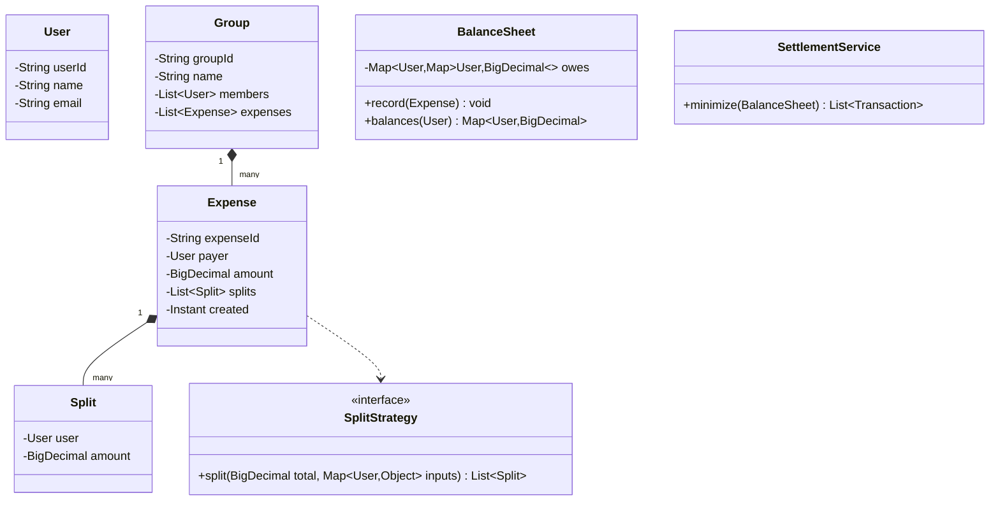

# OOD Case Study: Splitwise

Splitwise is the **second most-asked Machine Coding prompt** in Indian product interviews (after Parking Lot). The domain — track who-owes-whom across friends and groups — is small enough to fit in 60-90 minutes but rich enough to surface meaningful design choices: how to model expenses, how to compute balances, how to plug pluggable split strategies (equal / exact / percentage), and how to compute a minimum-transaction settlement.

This topic walks the full worked design using the [10-step framework](./T01-low-level-design-ood-interviews-framework.md).

## Step 1 — Clarify

1. **Scope**: pair-wise tracking or groups too?
2. **Split types**: equal / exact / percentage / shares? All four or just equal?
3. **Currency**: single currency or multi? (Single for simplicity.)
4. **Settlement**: just show balances, or compute min-transaction settlement?
5. **Concurrency / persistence**: in-memory or DB? Single-user demo or concurrent?

Assume: **groups supported, three split types (equal/exact/percentage), single currency, settlement = min transactions, in-memory, single-threaded demo with thread-safe data structures**.

## Step 2 — Entities + Actors

Nouns: `User`, `Group`, `Expense`, `Split`, `Balance`, `Transaction`.

Actors: `User`.

## Step 3 — Use cases

- `createUser(name, email) → user`
- `createGroup(name, members) → group`
- `addExpense(payerId, amount, splitType, splits, groupId?) → expense`
- `showBalances(userId) → Map<UserId, BigDecimal>`
- `settle(groupId) → List<Transaction>`

## Step 4 — Class diagram



## Step 5 — SOLID

- **SRP**: `Split` carries a single user's share. `BalanceSheet` aggregates. `SettlementService` minimizes transactions.
- **OCP**: New `ShareSplit` (proportional to shares) added as a new strategy.
- **DIP**: `Expense` builds splits via a `SplitStrategy` interface, not hard-coded.

## Step 6 — Design patterns

- **Strategy**: `SplitStrategy` with `EqualSplit`, `ExactSplit`, `PercentageSplit`.
- **Factory** (optional): `SplitStrategyFactory.create(splitType)`.
- **Visitor** (alternative for split): probably overkill in 90 minutes.

## Step 7 — Concurrency

Shared mutable: `BalanceSheet.owes` map.

Choice: `ConcurrentHashMap` of `ConcurrentHashMap`. For atomicity on update of two entries (debit one, credit other), a `ReentrantLock` on the sheet or `synchronized` on a per-pair lock. For a demo, simple `synchronized` on `BalanceSheet.record` is acceptable.

## Step 8 — Code

```java
import java.math.*;
import java.time.Instant;
import java.util.*;
import java.util.concurrent.*;

record User(String userId, String name, String email) {}

interface SplitStrategy {
    List<Split> split(BigDecimal total, List<User> users, Map<User, BigDecimal> inputs);
}

record Split(User user, BigDecimal amount) {}

class EqualSplit implements SplitStrategy {
    public List<Split> split(BigDecimal total, List<User> users, Map<User, BigDecimal> ignored) {
        BigDecimal share = total.divide(BigDecimal.valueOf(users.size()), 2, RoundingMode.HALF_UP);
        return users.stream().map(u -> new Split(u, share)).toList();
    }
}
class ExactSplit implements SplitStrategy {
    public List<Split> split(BigDecimal total, List<User> users, Map<User, BigDecimal> exacts) {
        BigDecimal sum = exacts.values().stream().reduce(BigDecimal.ZERO, BigDecimal::add);
        if (sum.compareTo(total) != 0) throw new IllegalArgumentException("exact sum != total");
        return users.stream().map(u -> new Split(u, exacts.get(u))).toList();
    }
}
class PercentageSplit implements SplitStrategy {
    public List<Split> split(BigDecimal total, List<User> users, Map<User, BigDecimal> percents) {
        BigDecimal pSum = percents.values().stream().reduce(BigDecimal.ZERO, BigDecimal::add);
        if (pSum.compareTo(new BigDecimal("100")) != 0) throw new IllegalArgumentException("percent sum != 100");
        return users.stream().map(u ->
            new Split(u, total.multiply(percents.get(u)).divide(new BigDecimal("100"), 2, RoundingMode.HALF_UP))
        ).toList();
    }
}

record Expense(String id, User payer, BigDecimal amount, List<Split> splits, Instant created) {}

class BalanceSheet {
    // owes[A][B] = amount A owes B; negative means B owes A
    private final Map<User, Map<User, BigDecimal>> owes = new ConcurrentHashMap<>();

    public synchronized void record(Expense e) {
        for (Split s : e.splits()) {
            if (s.user().equals(e.payer())) continue;
            updatePair(s.user(), e.payer(), s.amount());
        }
    }
    private void updatePair(User debtor, User creditor, BigDecimal amount) {
        owes.computeIfAbsent(debtor, k -> new ConcurrentHashMap<>())
            .merge(creditor, amount, BigDecimal::add);
        owes.computeIfAbsent(creditor, k -> new ConcurrentHashMap<>())
            .merge(debtor, amount.negate(), BigDecimal::add);
    }
    public Map<User, BigDecimal> balancesOf(User user) {
        return owes.getOrDefault(user, Collections.emptyMap()).entrySet().stream()
            .filter(e -> e.getValue().compareTo(BigDecimal.ZERO) != 0)
            .collect(java.util.stream.Collectors.toMap(Map.Entry::getKey, Map.Entry::getValue));
    }
    public Map<User, BigDecimal> netBalances() {
        Map<User, BigDecimal> net = new HashMap<>();
        for (var entry : owes.entrySet()) {
            BigDecimal n = entry.getValue().values().stream().reduce(BigDecimal.ZERO, BigDecimal::add).negate();
            net.put(entry.getKey(), n);
        }
        return net;
    }
}

record Transaction(User from, User to, BigDecimal amount) {}

class SettlementService {
    public List<Transaction> minimize(BalanceSheet sheet) {
        Map<User, BigDecimal> net = sheet.netBalances();
        PriorityQueue<Map.Entry<User, BigDecimal>> creditors = new PriorityQueue<>(
            (a, b) -> b.getValue().compareTo(a.getValue()));  // max-heap by credit
        PriorityQueue<Map.Entry<User, BigDecimal>> debtors = new PriorityQueue<>(
            (a, b) -> a.getValue().compareTo(b.getValue()));   // min-heap by (negative) debt
        for (var e : net.entrySet()) {
            if (e.getValue().compareTo(BigDecimal.ZERO) > 0) creditors.offer(e);
            else if (e.getValue().compareTo(BigDecimal.ZERO) < 0) debtors.offer(e);
        }
        List<Transaction> result = new ArrayList<>();
        while (!creditors.isEmpty() && !debtors.isEmpty()) {
            var c = creditors.poll(); var d = debtors.poll();
            BigDecimal settled = c.getValue().min(d.getValue().abs());
            result.add(new Transaction(d.getKey(), c.getKey(), settled));
            BigDecimal newCredit = c.getValue().subtract(settled);
            BigDecimal newDebt = d.getValue().add(settled);
            if (newCredit.compareTo(BigDecimal.ZERO) > 0) creditors.offer(Map.entry(c.getKey(), newCredit));
            if (newDebt.compareTo(BigDecimal.ZERO) < 0) debtors.offer(Map.entry(d.getKey(), newDebt));
        }
        return result;
    }
}

class SplitwiseService {
    private final Map<String, User> users = new ConcurrentHashMap<>();
    private final BalanceSheet sheet = new BalanceSheet();

    public User addUser(String name, String email) {
        User u = new User(UUID.randomUUID().toString(), name, email);
        users.put(u.userId(), u);
        return u;
    }
    public Expense addExpense(User payer, BigDecimal amount, List<User> participants,
                              SplitStrategy strategy, Map<User, BigDecimal> inputs) {
        List<Split> splits = strategy.split(amount, participants, inputs);
        Expense e = new Expense(UUID.randomUUID().toString(), payer, amount, splits, Instant.now());
        sheet.record(e);
        return e;
    }
    public Map<User, BigDecimal> balancesOf(User u) { return sheet.balancesOf(u); }
    public List<Transaction> settle() { return new SettlementService().minimize(sheet); }
}
```

## Step 9 — Extensibility

The interviewer asks: *"Now support multiple currencies."*

**Response**: *"Add a `Currency` field on `Expense` and `Split`. The `BalanceSheet` becomes keyed `Map<User, Map<User, Map<Currency, BigDecimal>>>`. Settlement is computed per-currency. Conversion to a base currency could be a `CurrencyConverter` strategy."*

The interviewer asks: *"Now support recurring expenses."*

**Response**: *"Add a `RecurrenceRule` (cron-like) to `Expense`. A scheduled job (Quartz or `ScheduledExecutorService`) fires on the rule and creates a new `Expense` each occurrence."*

## Step 10 — Tests

```java
@Test
void equalSplit_threeUsers() {
    var svc = new SplitwiseService();
    User a = svc.addUser("A", "a@x"); User b = svc.addUser("B", "b@x"); User c = svc.addUser("C", "c@x");
    svc.addExpense(a, new BigDecimal("300"), List.of(a, b, c), new EqualSplit(), Map.of());
    assertEquals(new BigDecimal("100.00"), svc.balancesOf(b).get(a));
    assertEquals(new BigDecimal("100.00"), svc.balancesOf(c).get(a));
    assertEquals(new BigDecimal("-200.00"), svc.balancesOf(a).get(b).add(svc.balancesOf(a).get(c)));
}

@Test
void settlement_minimisesTransactions() {
    // A owes B 50, B owes C 50, A owes C 0 → after minimize: A→C 50
    // (not A→B 50 + B→C 50)
}
```

## Edge Cases

- Payer included in splits vs not.
- Rounding errors on EqualSplit when total doesn't divide evenly (`100/3`).
- Exact split where sum doesn't match total → reject.
- Percentage split where sum != 100 → reject.
- Self-payment (payer == only participant).

## Sources & Further Reading

- [Splitwise's own engineering blog](https://blog.splitwise.com/) — design context

## Practice

1. **Build solo in 60 minutes.** Time-box.
2. **Add the "settle one pair" command** in addition to global minimize.
3. **Add ShareSplit** (each user gets `share/total_shares × total`).
4. **Add transactional persistence** — sketch the DB schema.
5. **Compute settlement min-transactions on paper** for the case `A owes B 50, B owes C 50, C owes A 50`. The answer is zero transactions (cycle).

## Recap

You should now be able to:

- Model **users, groups, expenses, splits, balances, settlements**.
- Apply **Strategy** for `SplitStrategy` (Equal / Exact / Percentage).
- Maintain a thread-safe **BalanceSheet** with `ConcurrentHashMap`.
- Compute **min-transaction settlement** via two heaps (creditors / debtors).
- Handle **edge cases**: rounding on equal split, mismatched exact/percentage sums, self-payment.

## Next

Continue to [OOD Case Study: Library Management](./T04-ood-case-study-library-management.md).
