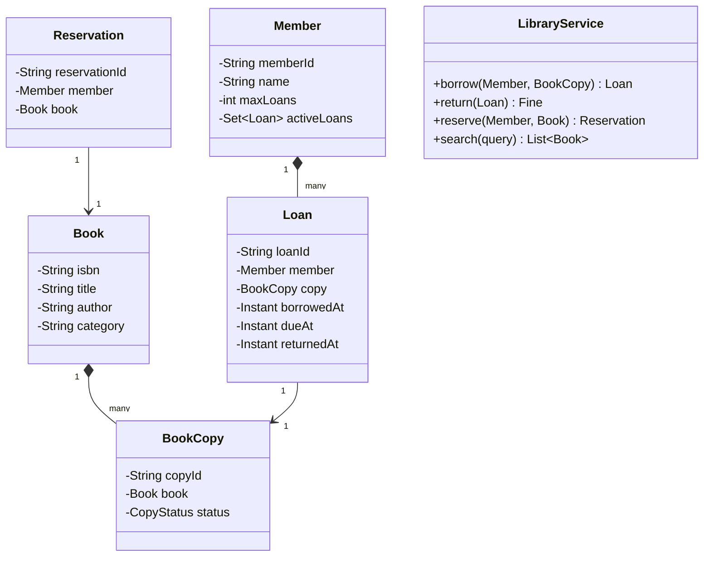

# OOD Case Study: Library Management

Library Management is a third canonical Machine Coding prompt. It exercises the **State pattern** more clearly than Parking Lot or Splitwise: a book copy moves through `AVAILABLE → RESERVED → BORROWED → OVERDUE` states, and the design's quality is judged by how cleanly those transitions are modelled.

## Step 1 — Clarify

1. **Catalogue vs copies**: each book title can have multiple physical copies. Search is by title; borrow is per copy.
2. **Members**: can borrow up to N books concurrently; cap configurable.
3. **Reservation**: hold a copy for a future borrow.
4. **Fines**: per-day overdue fine.
5. **Search**: by title, author, ISBN, category.

## Step 2 — Entities

- `Book` (catalogue item: title, author, ISBN, category)
- `BookCopy` (physical copy with ID + status)
- `Member` (user)
- `Loan` (active borrow record)
- `Reservation` (active hold)
- `Fine` (calculated overdue charge)

## Step 3 — Use cases

- `addBook(book) → ISBN`
- `addCopy(isbn) → copyId`
- `searchByTitle(query) → List<Book>`
- `borrowBook(memberId, copyId) → Loan`
- `returnBook(loanId) → Fine` (zero if on time)
- `reserveBook(memberId, isbn) → Reservation`

## Step 4 — Class diagram



## Step 5 — SOLID + Step 6 — Patterns

- **State pattern**: `BookCopy.status` transitions through enum values; behaviour gated on status. Could be a full State subclass hierarchy if interviewer pushes — for 90 minutes, enum + guards usually suffices.
- **Strategy**: `FinePolicy` interface (`FlatFinePolicy`, `TieredFinePolicy`).
- **Observer**: when a reserved book is returned, notify the reserver.

## Step 8 — Code

```java
import java.math.*;
import java.time.*;
import java.util.*;
import java.util.concurrent.*;

enum CopyStatus { AVAILABLE, RESERVED, BORROWED }

record Book(String isbn, String title, String author, String category) {}

class BookCopy {
    private final String copyId;
    private final Book book;
    private volatile CopyStatus status = CopyStatus.AVAILABLE;
    public BookCopy(String copyId, Book book) { this.copyId = copyId; this.book = book; }
    public synchronized boolean tryBorrow() {
        if (status == CopyStatus.AVAILABLE || status == CopyStatus.RESERVED) {
            status = CopyStatus.BORROWED; return true;
        }
        return false;
    }
    public synchronized void markReturned() { status = CopyStatus.AVAILABLE; }
    public synchronized void markReserved() {
        if (status == CopyStatus.AVAILABLE) status = CopyStatus.RESERVED;
    }
    public CopyStatus getStatus() { return status; }
    public Book getBook() { return book; }
    public String getCopyId() { return copyId; }
}

record Member(String memberId, String name, int maxLoans) {}

class Loan {
    private final String loanId;
    private final Member member;
    private final BookCopy copy;
    private final Instant borrowedAt;
    private final Instant dueAt;
    private Instant returnedAt;
    public Loan(Member m, BookCopy c, int loanDays) {
        this.loanId = UUID.randomUUID().toString();
        this.member = m; this.copy = c;
        this.borrowedAt = Instant.now();
        this.dueAt = borrowedAt.plus(Duration.ofDays(loanDays));
    }
    public Instant getDueAt() { return dueAt; }
    public Instant getReturnedAt() { return returnedAt; }
    public void markReturned() { this.returnedAt = Instant.now(); }
    public BookCopy getCopy() { return copy; }
}

interface FinePolicy {
    BigDecimal compute(Loan loan, Instant returnedAt);
}
class FlatFinePolicy implements FinePolicy {
    private final BigDecimal perDay;
    public FlatFinePolicy(BigDecimal perDay) { this.perDay = perDay; }
    public BigDecimal compute(Loan l, Instant ret) {
        long over = Math.max(0, Duration.between(l.getDueAt(), ret).toDays());
        return perDay.multiply(BigDecimal.valueOf(over));
    }
}

class LibraryService {
    private final Map<String, Book> catalogue = new ConcurrentHashMap<>();
    private final Map<String, List<BookCopy>> copiesByIsbn = new ConcurrentHashMap<>();
    private final Map<String, Loan> activeLoans = new ConcurrentHashMap<>();
    private final Map<String, Member> members = new ConcurrentHashMap<>();
    private final FinePolicy finePolicy;
    private final int loanDays;

    public LibraryService(FinePolicy finePolicy, int loanDays) {
        this.finePolicy = finePolicy; this.loanDays = loanDays;
    }

    public Loan borrow(Member m, BookCopy copy) {
        long active = activeLoans.values().stream().filter(l -> l.getReturnedAt() == null
            && l.getCopy().getCopyId().equals(copy.getCopyId())).count();
        // Replace with member's own active-loan count check
        if (!copy.tryBorrow()) throw new IllegalStateException("Copy unavailable");
        Loan loan = new Loan(m, copy, loanDays);
        activeLoans.put(loan.loanId, loan);
        return loan;
    }

    public BigDecimal returnBook(Loan loan) {
        loan.markReturned();
        loan.getCopy().markReturned();
        return finePolicy.compute(loan, Instant.now());
    }

    public List<Book> searchByTitle(String q) {
        String needle = q.toLowerCase();
        return catalogue.values().stream()
            .filter(b -> b.title().toLowerCase().contains(needle))
            .toList();
    }
}
```

## Step 9 — Extensibility

- **Multiple branches**: add a `Branch` entity; `BookCopy` belongs to a branch; search across branches.
- **E-books**: add a `Format` enum (PRINT, EBOOK, AUDIOBOOK). E-books have unlimited "copies" — virtual borrows.
- **Reservation waitlist**: priority queue of reservers per ISBN; notify next when a copy returns.

## Sources & Further Reading

- [Workat.tech Library Machine Coding](https://workat.tech/machine-coding/practice)
- [GeeksforGeeks Library System Design](https://www.geeksforgeeks.org/design-online-library-management-system-low-level-design/)

## Practice

1. **Build solo in 60 minutes**. Compare with the skeleton above.
2. **Add reservation with waitlist** using a per-ISBN PriorityQueue of reservation timestamps.
3. **Add fine policies**: tiered (first 3 days 0, next 7 days ₹5/day, after ₹20/day).
4. **Search by author + category** in addition to title.
5. **Persistence sketch**: design the DB schema (Books, BookCopies, Members, Loans, Reservations, Fines).

## Recap

You should now be able to:

- Model the **catalogue/copy split** (titles vs physical instances).
- Apply **State pattern** for `BookCopy.status` transitions.
- Apply **Strategy** for `FinePolicy`.
- Handle **concurrency** with `synchronized` per-copy and `ConcurrentHashMap` for service state.
- Extend the design to **branches, e-books, reservation waitlists**.

## Next

Continue to [Machine Coding round (Flipkart-style 90-minute build)](./T05-machine-coding-round-flipkart-style-90-minute-build.md).
