# Machine Coding Round (Flipkart-Style 90-Minute Build)

The Machine Coding round is **the most distinctive Indian-product interview round**, originated at Flipkart and now standard at PhonePe, Razorpay, Swiggy, Zomato, Cred, Myntra, Uber India, Atlassian Bengaluru. It is a **90- to 120-minute live build session** where you produce **compiling, runnable code with clean OO, applied SOLID, and ideally unit tests** for a real-world domain problem.

This topic is the **time-boxed execution playbook** for this round — what to do in each 10-minute window, what to skip, and what scores well in the post-build code review.

## What Distinguishes The Round

- **You write the code yourself in your IDE** (not whiteboard / shared CoderPad). The interviewer hands you the prompt and walks away (or watches silently).
- **The deliverable must compile and run.** A `main()` driver that demonstrates the API end-to-end is mandatory.
- **In-memory persistence.** No DB. Use `Map`, `List`, `Set`.
- **Standard library only.** No Spring, no external libraries (sometimes Guava is allowed; clarify).
- **Time pressure.** 90 minutes for the build; 20-30 minutes for the post-build review where the interviewer extends the requirements live.

## The Canonical Problem Set

- **Parking Lot** ([T02](./T02-ood-case-study-parking-lot.md))
- **Splitwise** ([T03](./T03-ood-case-study-splitwise.md))
- **Library Management** ([T04](./T04-ood-case-study-library-management.md))
- **Snake & Ladder / Tic-Tac-Toe / Chess** (turn engine, rule pluggability)
- **Hotel / Movie Ticket Booking** (BookMyShow)
- **Cab Booking / Ride Matching**
- **Elevator System** (multi-car scheduling)
- **LRU / LFU / multi-level cache** (PhonePe 2024 reported)
- **In-memory SQL-like KV store** (Razorpay)
- **Stock Trading Platform** (Flipkart SDE-2)
- **Flight booking with shortest-hop and cheapest-cost**
- **Payment Processing Module** (Cred)
- **Vending Machine**

## The 90-Minute Time Box

```mermaid
gantt
  title 90-minute Machine Coding
  dateFormat  m
  axisFormat  %M min
  section Plan
  Clarify requirements        :a1, 0, 10
  Sketch class diagram + APIs :a2, after a1, 10
  section Build
  Enums + Entities            :b1, after a2, 10
  Strategies + Services       :b2, after b1, 20
  Main driver + manual smoke  :b3, after b2, 10
  section Polish
  Edge case handling          :c1, after b3, 10
  Unit tests (bonus)          :c2, after c1, 10
  section Buffer
  Buffer / debugging          :d1, after c2, 10
```



### 0-10 min — Clarify

Ask 5-7 high-value questions. Don't burn 25 minutes here; the goal is bounded scope, not perfect understanding. Write the assumptions on the side so you can show your reasoning later.

### 10-20 min — Class diagram + APIs

Sketch the class hierarchy on paper or in a comment block. Define the API of each service (method signatures). This is your blueprint for the build.

### 20-30 min — Enums + Entities

Start with the simplest: enums for finite states, record/POJO entities. These are the foundation; getting them right early prevents rework.

### 30-50 min — Strategies + Services

Build the strategies (interfaces + one or two impls) and the main service that orchestrates. This is the meat.

### 50-60 min — Main driver + smoke

Write a `main()` that exercises every API: create the system, run happy path, run one variation. **The interviewer must see it work end-to-end.**

### 60-70 min — Edge cases

Add guards for empty inputs, invalid state transitions, capacity limits, concurrent access. Use custom exceptions per failure mode.

### 70-80 min — Unit tests (bonus)

Even 2-3 JUnit tests covering happy path + 1-2 edge cases lift the rubric. Use JUnit 5 (`@Test`, `assertEquals`, `assertThrows`).

### 80-90 min — Buffer / debugging

Polish, fix the bug you noticed in smoke, refactor any obvious god-class.

## What The Interviewer Scores (The Rubric)

| Signal | Strong evidence |
|---|---|
| **Compiles + runs** | `main()` executes without error; demo prints expected output |
| **Class boundaries** | Entity / service / strategy separation; no god class |
| **SOLID applied** | SRP visible; OCP via Strategy; DIP via interface injection |
| **Concurrency** | Thread-safe collections where needed; named lock granularity |
| **Code quality** | Idiomatic Java (enum, record, Optional, `Map.computeIfAbsent`) |
| **Exception design** | Custom exceptions per failure; not raw `RuntimeException` |
| **Tests (bonus)** | 2-3 JUnit tests, happy + edge |
| **Extensibility** | When interviewer adds requirement, plugs in cleanly |
| **Code organisation** | Separate packages / clear file structure (if multi-file allowed) |

## Java Idioms That Score Well

(Repeating from [T01 framework](./T01-low-level-design-ood-interviews-framework.md) for emphasis — these come up *every time*.)

- **`enum`** for finite states
- **`record`** (Java 16+) for immutable value objects
- **`Optional<T>`** for nullable returns
- **`Map.computeIfAbsent`** for building maps-of-lists / maps-of-sets
- **`Map.merge`** for atomic counter updates
- **`ConcurrentHashMap`** over `synchronized HashMap`
- **`ArrayDeque`** over `Stack` / `LinkedList`
- **`ReentrantLock`** when you need `tryLock` or fairness
- **Constructor DI** (no Spring needed)
- **Custom exceptions** (`NoSpotAvailableException`, `TicketNotFoundException`)
- **Static factory methods** when construction logic varies

## The Most Common Failures

1. **Spending 25+ minutes on requirements clarification.** Stop at 10.
2. **Gold-plating with a DB-style ORM layer.** In-memory means `Map`.
3. **Single-class implementation.** God class kills score even if it works.
4. **No `main()` driver.** Code that compiles but doesn't demonstrate the API doesn't count.
5. **Hardcoded variation** (`if (type == VIP)`) instead of polymorphism / Strategy.
6. **No exception design.** Throwing raw `RuntimeException` everywhere.
7. **Panic when the interviewer asks for an extension** at minute 95. The whole point is graceful absorption.

## The Post-Build Code Review

After the build, the interviewer typically:

1. **Asks you to walk through the design** (class diagram, key choices). Practice this — be able to summarise in 3 minutes.
2. **Probes one or two design choices** (*"why per-floor lock not per-spot?"*). Have rationale ready.
3. **Adds a new requirement** (*"now add VIP pricing"*, *"now support multiple branches"*, *"now persist to DB"*). Walk through how the design absorbs it, ideally without touching existing code (OCP).
4. **Asks about edge cases / failure modes** you didn't handle.

This phase is **half the score**. A weaker build with a strong walkthrough often beats a stronger build with a weak walkthrough.

## Concrete Project Structure

For a 90-minute build, a reasonable file structure:

```text
src/main/java/parking/
├── Main.java                          // driver
├── model/
│   ├── Vehicle.java
│   ├── VehicleType.java
│   ├── Spot.java
│   ├── Floor.java
│   ├── Ticket.java
│   └── Payment.java
├── service/
│   ├── ParkingService.java
│   └── ParkingLot.java
├── pricing/
│   ├── PricingStrategy.java
│   ├── HourlyPricing.java
│   └── VipPricing.java
└── exception/
    ├── NoSpotAvailableException.java
    └── TicketNotFoundException.java

src/test/java/parking/
├── ParkingServiceTest.java
└── HourlyPricingTest.java
```

Multi-package is *bonus* — single-file with multiple classes is acceptable when time is tight.

## Practice Approach

1. **Pick 5 problems from the canonical set**.
2. **Build each solo, 90-minute timer**, no looking up references mid-build.
3. **Compare to a reference solution** afterward; identify what you missed.
4. **Re-build one problem from scratch a week later** — the second build should be ~40 minutes.
5. **Mock with a peer** doing the post-build review.

## Deeper Dive — Three Worked Problem Skeletons

Three classic Machine Coding prompts with full Java skeletons. Read each problem first; attempt your own 60-minute build; then compare.

### 1. Vending Machine

**Problem**. Stock multiple products (Coke, Pepsi, Water) with prices + inventory. Accept coins (1, 5, 10, 25); dispense product + change. Handle out-of-stock, insufficient money.

```java
enum Coin { ONE(1), FIVE(5), TEN(10), QUARTER(25);
    final int value;
    Coin(int v) { this.value = v; }
}

enum ProductStatus { AVAILABLE, OUT_OF_STOCK }

class Product {
    final String code;
    final String name;
    final int priceCents;
    int stock;
    Product(String code, String name, int priceCents, int stock) {
        this.code = code; this.name = name; this.priceCents = priceCents; this.stock = stock;
    }
    public synchronized boolean tryDispense() {
        if (stock <= 0) return false;
        stock--;
        return true;
    }
    public synchronized void restock(int n) { stock += n; }
    public ProductStatus status() { return stock > 0 ? AVAILABLE : OUT_OF_STOCK; }
}

class VendingMachine {
    private final Map<String, Product> products = new ConcurrentHashMap<>();
    private final EnumMap<Coin, Integer> coinReserve = new EnumMap<>(Coin.class);
    private final ThreadLocal<List<Coin>> currentDeposit = ThreadLocal.withInitial(ArrayList::new);

    public VendingMachine() { for (Coin c : Coin.values()) coinReserve.put(c, 0); }

    public void addProduct(Product p) { products.put(p.code, p); }

    public void insertCoin(Coin c) {
        currentDeposit.get().add(c);
    }

    public int currentDepositValue() {
        return currentDeposit.get().stream().mapToInt(c -> c.value).sum();
    }

    public TransactionResult buy(String productCode) {
        Product p = products.get(productCode);
        if (p == null) throw new IllegalArgumentException("Unknown product: " + productCode);
        if (p.status() == ProductStatus.OUT_OF_STOCK) {
            return TransactionResult.refund(currentDeposit.get(), "Out of stock");
        }
        int deposit = currentDepositValue();
        if (deposit < p.priceCents) {
            return TransactionResult.refund(currentDeposit.get(), "Insufficient — need " + (p.priceCents - deposit) + " more");
        }
        // Atomic: take stock then return change.
        if (!p.tryDispense()) {
            return TransactionResult.refund(currentDeposit.get(), "Out of stock (raced)");
        }
        int change = deposit - p.priceCents;
        List<Coin> changeCoins = computeChange(change);
        // Update reserve: add deposit, subtract change.
        for (Coin c : currentDeposit.get()) coinReserve.merge(c, 1, Integer::sum);
        for (Coin c : changeCoins) coinReserve.merge(c, -1, Integer::sum);
        currentDeposit.remove();
        return TransactionResult.success(p, changeCoins);
    }

    public TransactionResult cancel() {
        List<Coin> refund = currentDeposit.get();
        currentDeposit.remove();
        return TransactionResult.refund(refund, "User cancelled");
    }

    private List<Coin> computeChange(int amount) {
        // Greedy with largest coins; fails for non-canonical denominations (covered: 25,10,5,1 is canonical).
        List<Coin> result = new ArrayList<>();
        Coin[] sorted = {Coin.QUARTER, Coin.TEN, Coin.FIVE, Coin.ONE};
        for (Coin c : sorted) {
            while (amount >= c.value && coinReserve.get(c) > 0) {
                amount -= c.value;
                result.add(c);
                coinReserve.merge(c, -1, Integer::sum);
            }
        }
        if (amount > 0) throw new IllegalStateException("Cannot make change");
        return result;
    }
}

record TransactionResult(boolean success, Product product, List<Coin> coinsReturned, String message) {
    static TransactionResult success(Product p, List<Coin> change) {
        return new TransactionResult(true, p, change, "Dispensed " + p.name);
    }
    static TransactionResult refund(List<Coin> coins, String why) {
        return new TransactionResult(false, null, coins, why);
    }
}
```

**Extensions to handle live** (interviewer asks at minute 60):
- **VIP discount**: introduce `PricingStrategy` interface (`DefaultPricing`, `VipPricing(decorator)`).
- **Card payment**: add `PaymentMethod` interface (`CashPayment`, `CardPayment`).
- **Multi-machine restock**: hoist `coinReserve` + `products` into a `MachineRepository`.

### 2. Snake & Ladder

**Problem**. NxN board, snakes + ladders, M players, six-sided die. Players take turns; first to reach square N²; print game log.

```java
class SnakeAndLadder {
    private final int boardSize;
    private final Map<Integer, Integer> moves;   // start → end (positive=ladder, negative direction = snake)
    private final List<Player> players;
    private final Die die;
    private int currentPlayerIndex = 0;

    public SnakeAndLadder(int size, Map<Integer, Integer> jumps, List<Player> players, Die die) {
        this.boardSize = size * size;
        this.moves = new HashMap<>(jumps);
        this.players = new ArrayList<>(players);
        this.die = die;
    }

    public Player playUntilWinner() {
        while (true) {
            Player current = players.get(currentPlayerIndex);
            int roll = die.roll();
            int newPos = current.position + roll;
            if (newPos > boardSize) {
                log(current + " rolled " + roll + " — exceeds " + boardSize + "; skip");
            } else {
                newPos = moves.getOrDefault(newPos, newPos);
                current.position = newPos;
                log(current + " rolled " + roll + " → position " + newPos);
                if (newPos == boardSize) {
                    log(current + " WINS!");
                    return current;
                }
            }
            currentPlayerIndex = (currentPlayerIndex + 1) % players.size();
        }
    }

    private void log(String msg) { System.out.println(msg); }
}

class Player {
    final String name;
    int position = 0;
    Player(String name) { this.name = name; }
    public String toString() { return name; }
}

interface Die { int roll(); }

class StandardDie implements Die {
    private final Random rand = new Random();
    public int roll() { return rand.nextInt(6) + 1; }
}
```

**Extensions**:
- Multiple dice (`new MultiDie(2)`).
- Bounce-back (if roll exceeds, bounce back from boardSize): change the "skip" branch.
- Persistent game state (save/resume): serialize `players` + `currentPlayerIndex`.

### 3. In-Memory Cache with TTL + LRU

**Problem**. Cache with capacity N + per-entry TTL. Eviction: TTL first, then LRU.

```java
class TimedLruCache<K, V> {
    private static class Node<K, V> {
        K key; V value; long expiresAt; Node<K,V> prev, next;
        Node(K k, V v, long e) { key = k; value = v; expiresAt = e; }
    }

    private final int capacity;
    private final Map<K, Node<K, V>> map = new HashMap<>();
    private final Node<K, V> head = new Node<>(null, null, 0);
    private final Node<K, V> tail = new Node<>(null, null, 0);
    private final Clock clock;

    public TimedLruCache(int capacity, Clock clock) {
        this.capacity = capacity;
        this.clock = clock;
        head.next = tail;
        tail.prev = head;
    }

    public synchronized void put(K key, V value, long ttlMs) {
        evictExpired();
        Node<K, V> existing = map.get(key);
        if (existing != null) {
            existing.value = value;
            existing.expiresAt = clock.millis() + ttlMs;
            moveToFront(existing);
            return;
        }
        if (map.size() >= capacity) {
            Node<K, V> lru = tail.prev;
            remove(lru);
            map.remove(lru.key);
        }
        Node<K, V> n = new Node<>(key, value, clock.millis() + ttlMs);
        addFirst(n);
        map.put(key, n);
    }

    public synchronized Optional<V> get(K key) {
        Node<K, V> n = map.get(key);
        if (n == null) return Optional.empty();
        if (clock.millis() >= n.expiresAt) {
            remove(n);
            map.remove(key);
            return Optional.empty();
        }
        moveToFront(n);
        return Optional.of(n.value);
    }

    private void evictExpired() {
        long now = clock.millis();
        Iterator<Map.Entry<K, Node<K, V>>> it = map.entrySet().iterator();
        while (it.hasNext()) {
            Node<K, V> n = it.next().getValue();
            if (now >= n.expiresAt) {
                remove(n);
                it.remove();
            }
        }
    }

    private void addFirst(Node<K, V> n) {
        n.next = head.next; n.prev = head;
        head.next.prev = n; head.next = n;
    }
    private void remove(Node<K, V> n) { n.prev.next = n.next; n.next.prev = n.prev; }
    private void moveToFront(Node<K, V> n) { remove(n); addFirst(n); }
}
```

**Extensions**:
- Background eviction thread (avoid sweep on each put): `ScheduledExecutorService` runs `evictExpired()` every 30 sec.
- Stats (hits, misses, evictions): `LongAdder` counters.
- Promote to size-bounded cluster mode: shard by `key.hashCode() % N`.
- Pluggable eviction policy: add `EvictionStrategy` interface (LRU, LFU, FIFO).

## Sources & Further Reading

- [Workat.tech Machine Coding (Flipkart team built)](https://workat.tech/machine-coding/practice)
- [Workat.tech — How to prepare](https://workat.tech/machine-coding/article/how-to-prepare-for-machine-coding-round-naf2ih7a9e5l)
- [Workat.tech — What is Machine Coding](https://workat.tech/machine-coding/article/what-is-a-machine-coding-round-omfn1w54ojlg)

## Practice

1. **Run the 90-minute timer on Parking Lot** (you've seen the design in [T02](./T02-ood-case-study-parking-lot.md)). Build solo, no peeking.
2. **Run the 90-minute timer on Splitwise** ([T03](./T03-ood-case-study-splitwise.md)).
3. **Pick one un-covered problem** (Snake & Ladder, Vending Machine, Hotel Booking) and run the framework solo.
4. **Mock the post-build review** with a peer: pretend they extend the requirement; absorb it cleanly.
5. **Self-score** against the rubric.

## Recap

You should now be able to:

- Execute the **10-minute time box** for a 90-minute Machine Coding round.
- Recognise the **canonical problem set** asked across Flipkart, PhonePe, Razorpay, Swiggy, Cred, Atlassian Bengaluru.
- Apply the **Java idioms that score** (enum, record, Optional, ConcurrentHashMap, constructor DI, custom exceptions).
- Avoid the **seven most common failures** (over-clarify, gold-plate, god class, no driver, hardcoded variation, no exceptions, panic on extension).
- Execute the **post-build code review** with a clear walkthrough and graceful extension absorption.

## Next

Continue to [High-Level / System Design Interviews — Framework](./T06-high-level-system-design-interviews-framework.md).
