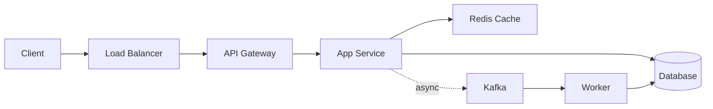
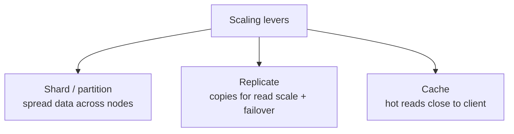
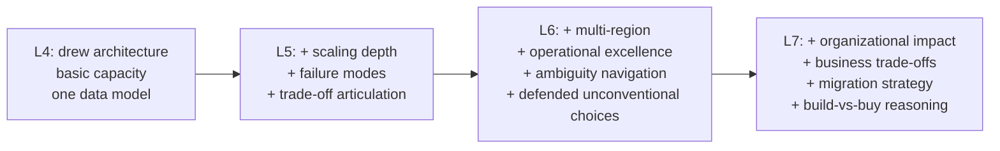
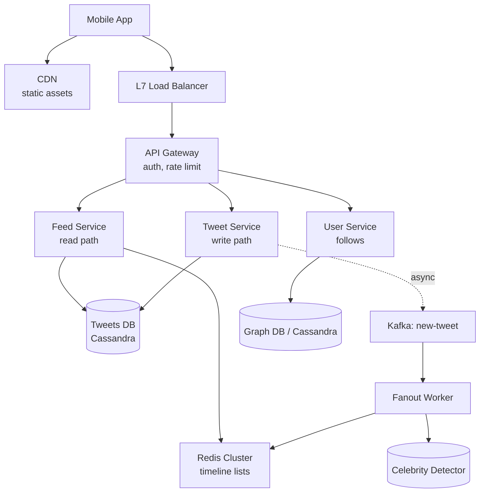

# High-Level / System Design Interviews — Framework

The High-Level Design (HLD) — also called System Design — round is **where senior offers are won or lost**. At Google L5+, Meta E5+, Amazon SDE-II+, Microsoft 62+, and Indian unicorn Staff loops, HLD is the round that decides the level (E5 vs E6, SDE-II vs SDE-III). Netflix is so design-focused that the saying inside is *"Netflix is to system design as Google is to coding."*

This topic is the **7-step framework** that takes you through any HLD prompt in 45 minutes — Requirements → Capacity → Architecture → Data Model → Scaling → Failure Modes → Trade-offs — with the specific questions to ask in each phase, the rubric the interviewer scores, and the depth signals that distinguish L5 from L6 from L7.

## The 45-Minute Time Box

```mermaid
gantt
  title 45-minute HLD round
  dateFormat  m
  axisFormat  %M min
  section
  Clarify requirements (functional + non-functional) :a1, 0, 5
  Capacity estimation                                :a2, after a1, 3
  High-level architecture (boxes + flows)            :a3, after a2, 10
  Data model + storage choice                        :a4, after a3, 5
  Scaling (shard, replicate, cache)                  :a5, after a4, 7
  Failure modes + reliability                        :a6, after a5, 5
  Trade-offs + Q&A                                   :a7, after a6, 10
```



## The 7-Step Framework

### Step 1 — Clarify requirements (4-5 min)

Separate **functional** (what the system does) from **non-functional** (how well).

**Functional**:

- What are the core user-facing features? (e.g., for URL shortener: shorten URL, redirect, analytics)
- What's out of scope? (custom domain, billing, analytics dashboard — push these to "v2")

**Non-functional**:

- **Scale**: DAU? RPS sustained / peak? Data volume?
- **Latency**: p50, p99 targets?
- **Availability**: 99.9%, 99.99%?
- **Consistency**: strong, eventual, read-your-writes?
- **Durability**: data loss tolerance?
- **Geographic distribution**: single region, multi-region, global edge?

State assumptions: *"I'll assume 100M DAU, 1k RPS sustained / 10k peak, p99 < 100ms, 99.99% availability, eventual consistency acceptable for analytics, strong for redirect."*

### Step 2 — Capacity estimation (3 min)

Back-of-envelope numbers. Senior interviewers expect this **unprompted**.

- **Storage**: items × avg-size × retention. *"100M URLs × 500 bytes × forever = 50 GB. With analytics, 10× — 500 GB."*
- **Throughput**: writes/sec, reads/sec. *"1k write RPS sustained, 10k read peak."*
- **Bandwidth**: RPS × avg-payload. *"10k RPS × 1 KB = 10 MB/s outbound."*
- **Memory for cache**: 80/20 rule — 80% of reads hit 20% of items. *"Hot 20% = 100 MB → easily fits in Redis."*

The math doesn't have to be exact; it has to **shape the design**. If your math says 50 GB total data, you don't need sharding; if it says 50 TB, you do.

### Step 3 — High-level architecture (10 min)

Draw boxes and flows. Components typically include:

- **Client** (mobile/web)
- **Load balancer** (L4 or L7)
- **API gateway** (auth, rate limit, routing)
- **Application service(s)**
- **Cache** (Redis, Memcached)
- **Datastore** (SQL, NoSQL — choose based on access pattern)
- **Message queue** (Kafka, SQS — for async work)
- **CDN** (for static / cacheable content)



State each component's role: *"Load balancer for L4 health-check routing; API gateway for auth and rate limit; app service stateless for horizontal scale; Redis for hot reads; Postgres for source of truth; Kafka for async fan-out to analytics worker."*

### Step 4 — Data model + storage choice (5 min)

Define the schema and defend the storage choice.

```text
URLs table (Postgres):
  id BIGINT PRIMARY KEY
  short_code VARCHAR(8) UNIQUE NOT NULL  -- INDEX
  long_url TEXT NOT NULL
  user_id BIGINT NULL                     -- INDEX
  created_at TIMESTAMP NOT NULL
  expires_at TIMESTAMP NULL

Click events (Kafka topic; sink to ClickHouse for analytics):
  short_code, ts, ip, ua, referrer
```

**Why this storage**: *"Postgres for the URL table because the access pattern is point-lookup by short_code (well-handled by a B-tree index) and the total size fits a single instance with read replicas. ClickHouse for click events because the access pattern is OLAP — aggregate billions of rows for analytics."*

Trade-offs:

- **SQL vs NoSQL**: pick based on join needs, schema flexibility, scale.
- **Postgres vs Cassandra**: Postgres for relational + ACID; Cassandra for linear-write-scale + AP.
- **Redis vs Memcached**: Redis for data structures + persistence; Memcached for pure caching.

### Step 5 — Scaling (7 min)

Three levers: **shard, replicate, cache**.



- **Sharding**: by which key? (`short_code` hash for URL shortener; `user_id` for user data.) **Hot keys** problem — what if one key takes 80% of traffic? (Celebrity user, viral URL.) **Resharding** pain.
- **Replication**: primary + N read replicas. Async replication = read-your-writes problem. Quorum writes for stronger consistency.
- **Caching**: cache-aside is default. Hot-key TTL + probabilistic early expiration to avoid stampede.

### Step 6 — Failure modes + reliability (5 min)

For each component, ask **"what happens if this dies?"**

- **DB primary fails**: failover to replica; brief read-only window; lag.
- **Cache cluster dies**: load on DB spikes; need circuit breaker or rate limit.
- **Region goes down**: multi-region active-passive or active-active.
- **Message queue backed up**: backpressure; DLQ for poisoned messages.

Reliability tools:

- **SLI/SLO/SLA**: define them.
- **Circuit breaker** (Resilience4j; Hystrix EOL): fail fast when downstream is sick.
- **Bulkhead**: isolate resources so one bad subsystem doesn't drain everything.
- **Retry with exponential backoff + jitter**: avoid retry storm.
- **Idempotency keys**: safe to retry.

### Step 7 — Trade-offs + Q&A (10 min)

The interviewer will probe. Be ready to defend:

- **Why this DB?** Justify against the alternative.
- **Why this consistency model?** Strong adds latency; eventual adds complexity.
- **Why this cache strategy?** Cache-aside vs write-through vs write-behind.
- **What's the cost of this design?** Rough estimate: storage + compute + bandwidth.
- **What would you change at 10× scale?** Show you can think ahead.

## The HLD Rubric

| Signal | Strong evidence |
|---|---|
| **Requirements clarity** | Separated functional / non-functional; named numbers |
| **Capacity estimation** | Did back-of-envelope unprompted; shaped the design with it |
| **Architecture clarity** | Drew clear boxes; named each component's role |
| **Data model** | Defined schema; chose storage with defended reason |
| **Scaling depth** | Discussed sharding, replication, caching; hot-key mitigation |
| **Failure modes** | Named what breaks; designed for graceful degradation |
| **Trade-off articulation** | Compared two-three approaches; said "I'd pick X because Y, but if Z then I'd flip" |
| **Operational depth (senior+)** | Discussed oncall, blast radius, deploy strategy, observability |
| **Java/JVM context (when relevant)** | Specified concurrency primitives, GC choice, JVM heap |

## Depth Signals By Level



## The Five HLD Anti-Patterns

1. **Box drawing without depth.** Sketches an architecture but can't justify any component.
2. **AWS service-name drop without explanation.** "I'd use SNS + SQS + Lambda + DynamoDB" — but why each?
3. **Naming patterns without applying them.** "I'd use CQRS." — but what's the read model and write model?
4. **Ignoring non-functional requirements.** Build a feature-complete design that ignores 99.99% availability or 10k RPS.
5. **No trade-off discussion.** Picks one approach without comparing alternatives.

## Common Probes And How To Handle

| Probe | Strong response |
|---|---|
| *"How would you handle 10× more traffic?"* | Walk through: cache layer, shard count, replica count, queue capacity. State which becomes the bottleneck first. |
| *"What if the DB primary dies?"* | Failover to replica; brief read-only; data lag implication; pager. |
| *"What if this design needs to be multi-region?"* | Active-passive vs active-active; cross-region replication strategy; conflict resolution; cost. |
| *"How would you migrate from the old system?"* | Strangler pattern; dual-write + comparison; gradual cutover; rollback plan. |
| *"What metrics would you monitor?"* | RED method (Rate, Errors, Duration) per service; SLO error budgets; cache hit rate; queue depth. |

## Deeper Dive — Complete Worked Example (Twitter Timeline)

Walk through the 7-step framework end-to-end on **"Design Twitter Timeline"**. This is your script for any HLD round.

### Step 1 — Clarify (4 min)

**Functional**:
- User posts tweets (text up to 280 chars, optional image).
- User follows other users.
- Home timeline = tweets from followed users, reverse-chronological.
- User profile page = own tweets, reverse-chronological.
- Likes, retweets, replies? (Defer to v2 — focus on core.)
- Search? (Out of scope.)

**Non-functional**:
- Scale: 300M MAU, 50M DAU, 100M tweets/day, ~1B home-timeline reads/day.
- Read:write = 10:1 (timeline reads dominate).
- Latency: p99 home timeline < 500ms.
- Availability: 99.99% for read; 99.9% for write.
- Consistency: eventual OK (small lag acceptable).
- Geo: global; users in NA, EU, Asia.

State explicitly: *"I'll assume 50M DAU, 100M tweets/day, ~12k tweets/sec peak, ~120k timeline reads/sec peak."*

### Step 2 — Capacity Estimation (3 min)

| Metric | Calc | Value |
|---|---|---|
| Tweets/sec sustained | 100M / 86400 | ~1,160 |
| Tweets/sec peak | × 10 | ~12k |
| Timeline reads/sec peak | 12k × 10 ratio | ~120k |
| Storage per tweet | text 280B + metadata 200B | ~500B |
| Storage/year (tweets) | 100M × 500B × 365 | ~18 TB |
| Storage 5 years | ~90 TB | — |
| Avg followers | 200 | — |
| Fanout writes/sec at peak | 12k × 200 | ~2.4M writes/sec |
| Cache memory (hot timelines, 50M DAU × 100 recent tweets × 500B) | | ~2.5 TB |
| Egress bandwidth | 120k × 30 tweets × 500B | ~1.8 GB/s |

Math shapes the design: **need sharding (90 TB), need fanout-on-write with cache (2.4M writes/sec stresses DB), need distributed cache cluster (2.5 TB)**.

### Step 3 — High-Level Architecture (10 min)



State each component:
- **CDN**: cache images + static assets.
- **LB**: L7 routing.
- **Gateway**: JWT auth, per-user rate limit.
- **Tweet Service**: write tweets, validate, persist, publish event.
- **Feed Service**: read home + profile timelines.
- **User Service**: manage follow graph.
- **Tweets DB**: Cassandra — partition by `(user_id, tweet_ts)` for fast profile reads.
- **Kafka**: durable event log.
- **Fanout Worker**: consume new-tweet events, push to followers' caches (skip celebrities).
- **Redis Cluster**: per-user pre-computed timeline list (capped at 1000 recent).

### Step 4 — Data Model (5 min)

```text
-- Tweets table (Cassandra)
PRIMARY KEY ((user_id), tweet_ts DESC, tweet_id)
columns: user_id, tweet_ts, tweet_id, text, image_url, like_count

-- Follow graph (Cassandra)
PRIMARY KEY ((user_id), followee_id)   -- "I follow"
PRIMARY KEY ((followee_id), user_id)   -- "follows me" (reverse index for fanout)

-- Timeline cache (Redis)
Key: timeline:{user_id}
Value: List of serialized tweets (capped at 1000)
TTL: 7 days
```

**Why Cassandra**: linear write scale handles 2.4M writes/sec via partitioning. Reverse index on follow graph supports fanout. No JOIN needed at this scale.

### Step 5 — Scaling (7 min)

**Sharding**: by `user_id` hash across N Cassandra nodes. Reads + writes routed deterministically. Follow-graph sharding similar.

**Replication**: Cassandra RF=3 (3 copies); QUORUM reads + writes for strong-ish consistency.

**Caching**:
- L1: per-user timeline in Redis (60-80% hit rate for active users).
- L2: hot tweets (likes ≥ 1k) cached separately.
- L3: Cassandra is source of truth.

**Hot-key mitigation — celebrity problem**:
- Define celebrity = followers ≥ 100k.
- For celebrities, **DON'T fanout-on-write** (1M followers × 100k celebs × X tweets/day → infeasible cache writes).
- Followers of celebrities **pull on read** — query celeb's recent tweets from Cassandra, merge into pre-computed timeline.
- Tradeoff: read path more complex; write path much cheaper.

**Capacity grows**:
- Add Cassandra nodes for storage.
- Add Redis shards for cache memory.
- Add fanout workers for throughput.
- Stateless services → autoscale on RPS.

### Step 6 — Failure Modes (5 min)

- **Cassandra node down**: RF=3 + QUORUM → still serves with 2 nodes; auto-repair on recovery.
- **Redis shard down**: cache miss falls through to Cassandra; latency spikes. Mitigate with circuit breaker + degraded mode (serve stale or fewer tweets).
- **Kafka outage**: fanout stops; new tweets land in DB but don't propagate to caches. Cache eventually catches up via background reconciliation. Worst case: timeline shows old data briefly.
- **Fanout worker lags**: per-user timeline updates delayed. Monitor consumer lag; auto-scale workers.
- **Region outage**: failover to other region via DNS + global LB. Last few minutes of writes might lag.

### Step 7 — Trade-offs (10 min)

- **Cassandra vs Postgres**: Cassandra for write scale + linear horizontal scaling. Trade-off: no JOINs, eventual consistency.
- **Fanout-on-write vs on-read**: hybrid as above. Write-on-fanout reads are fast; pull-on-read for celebrities saves massive write cost.
- **Cache invalidation**: TTL 7 days + LRU eviction; rare updates (delete tweet) → invalidate timeline entries lazily (mark deleted, skip on read).
- **Eventual consistency**: user sees their own tweet may lag in others' timelines by ~1 sec. Acceptable.
- **Cost at 10× scale**: ~10× infra cost; need additional sharding logic for follow graph (could split into geographic shards).

### Speaking script (for the round)

> "I'll design Twitter timeline. Let me clarify scope — focus on posting, follow, home timeline, profile timeline; defer likes/retweets/search.
>
> Scale assumptions: 50M DAU, 100M tweets/day, peak 12k tweets/sec, 120k timeline reads/sec, 200 avg followers, 10:1 read/write ratio. Eventual consistency OK.
>
> Capacity math: 90TB tweets over 5 years; 2.4M cache writes/sec at peak from fanout; 2.5TB hot-timeline cache memory.
>
> Architecture: Mobile → CDN + LB → API Gateway → Tweet Service (writes) / Feed Service (reads) / User Service. Cassandra for tweets + follow graph, Redis cluster for timeline cache, Kafka for new-tweet events, Fanout Worker for cache population.
>
> Cassandra schema: tweets partitioned by user_id; follow graph has bidirectional indexes for fanout lookup. Redis: per-user timeline list capped at 1000, TTL 7 days.
>
> Scaling levers: shard Cassandra by user_id hash, RF=3 + QUORUM, Redis cluster shards, stateless services autoscale on RPS. Hot-key: celebrities (≥100k followers) skip fanout; followers pull-on-read and merge.
>
> Failure modes: Cassandra node — RF=3 handles; Redis miss — falls through; Kafka — fanout pauses, cache lags. Region — failover via DNS.
>
> Trade-offs: Cassandra over Postgres for write scale at cost of JOINs. Hybrid fanout balances write cost vs read complexity. Eventual consistency for non-critical reads."

End-to-end in ~30 minutes with full conversation. Q&A in remaining 15.

## Sources & Further Reading

- [Hello Interview](https://www.hellointerview.com/) — round-by-level guides
- [DesignGurus — System Design](https://www.designgurus.io/blog/system-design-interview-guide)
- [ByteByteGo](https://bytebytego.com/) — system design newsletter + courses
- [The System Design Primer](https://github.com/donnemartin/system-design-primer)
- [Designing Data-Intensive Applications — Martin Kleppmann](https://dataintensive.net/)

## Practice

1. **Run the 7-step framework solo on a prompt you haven't seen** (e.g., design Yelp). Time-box at 45 minutes.
2. **Compare your solution to a published reference** (ByteByteGo, DesignGurus, Hello Interview).
3. **For one prompt, write the full back-of-envelope** (storage, RPS, bandwidth) and defend each number.
4. **Pick one architecture you drew and walk through every failure mode** for each component.
5. **Articulate two trade-offs per design choice** in writing. Practice until the language is fluent.
6. **Mock with a peer** at your target-level rubric. Use the table above.

## Recap

You should now be able to:

- Execute the **7-step HLD framework** (Requirements → Capacity → Architecture → Data Model → Scaling → Failure Modes → Trade-offs) in 45 minutes.
- Separate **functional vs non-functional** requirements and state numbers.
- Do **back-of-envelope capacity** unprompted (storage, RPS, bandwidth, cache memory).
- Draw a **clear architecture diagram** with each component's role named.
- Choose **storage** with defended reason (SQL vs NoSQL; Postgres vs Cassandra; Redis vs Memcached).
- Apply **scaling levers** (shard, replicate, cache) including hot-key mitigation.
- Identify **failure modes** per component and design for graceful degradation.
- Articulate **trade-offs** explicitly (chose X over Y because Z; flip if W).
- Hit the **depth signal** for your target level (L5 / L6 / L7).
- Avoid the **five HLD anti-patterns**.

## Next

Continue to [HLD Case Study: URL Shortener](./T07-hld-case-study-url-shortener.md).
