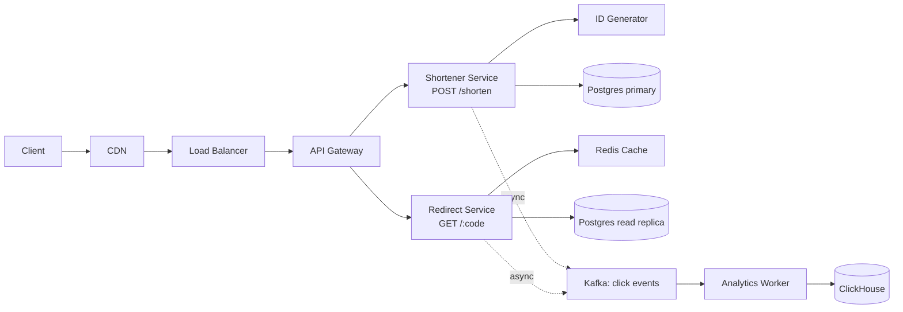

# HLD Case Study: URL Shortener

URL Shortener (TinyURL, bit.ly) is the **most-asked HLD prompt at FAANGM and Indian product senior loops** — perhaps even more than Parking Lot in LLD. It's the canonical first HLD because it surfaces every system-design lever: read-heavy access pattern, ID generation, caching, sharding, analytics, expiry — but with a small enough domain to fit 45 minutes.

This topic walks the full worked design using the [7-step framework from T06](./T06-high-level-system-design-interviews-framework.md).

## Step 1 — Clarify

**Functional**:

- Shorten a long URL → return short URL (e.g., `bit.ly/abc123`).
- Redirect short URL → long URL.
- Custom short codes (optional)?
- Expiration / TTL (optional)?
- Analytics dashboard (out of scope for v1)?

**Non-functional**:

- **Scale**: 100M URLs/year (~3 RPS write sustained), 10× peak. **Read:write = 100:1** typical.
- **Reads**: ~1k RPS sustained, ~10k peak.
- **Latency**: p99 < 100ms for redirect (critical user-facing).
- **Availability**: 99.99% for redirect (downtime = broken links).
- **Durability**: no data loss.

State: *"~100M writes/year, ~10B reads/year, read-heavy 100:1, p99 100ms redirect, 99.99% available."*

## Step 2 — Capacity

- **Storage**: 100M URLs × 500 bytes × 10 years = 500 GB. With indexes, ~1 TB. Fits a single Postgres node with read replicas.
- **Write QPS**: 100M / (365 × 86400) ≈ 3 RPS sustained, 30 RPS peak.
- **Read QPS**: 100× write = 300-3000 RPS sustained, 3000-30000 peak.
- **Cache memory**: 80% hits on 20% of URLs = 20% × 100M × 500 bytes = 10 GB. Fits Redis cluster.
- **Bandwidth**: read peak × redirect (HTTP 301 ~200 bytes) = 30k × 200 = ~6 MB/s outbound.

## Step 3 — Architecture



- **CDN**: cache popular redirects at edge (very high hit rate, low marginal cost).
- **LB**: L4 health-check routing across app instances.
- **API gateway**: auth (if private codes), rate limit, routing.
- **Shortener service** (writes): generates short code, writes to DB.
- **Redirect service** (reads): cache-first, falls back to DB read replica.
- **ID generator**: dedicated service (e.g., Snowflake-like) or DB sequence; emits 64-bit IDs.
- **Postgres**: source of truth; primary for writes, replicas for reads.
- **Redis**: hot-cache for reads.
- **Kafka + Analytics worker**: async fan-out of click events to ClickHouse for analytics.

## Step 4 — Data model

```sql
-- urls table
CREATE TABLE urls (
  id BIGINT PRIMARY KEY,                    -- snowflake / sequence
  short_code VARCHAR(8) UNIQUE NOT NULL,    -- INDEX (covering)
  long_url TEXT NOT NULL,
  user_id BIGINT NULL,
  created_at TIMESTAMP NOT NULL,
  expires_at TIMESTAMP NULL
);
CREATE INDEX idx_urls_short_code ON urls(short_code);
CREATE INDEX idx_urls_user_id ON urls(user_id) WHERE user_id IS NOT NULL;
```

Why Postgres: relational, B-tree index on `short_code` perfect for point lookup, ACID for the write side, well-understood ops.

## Step 5 — Short code generation

Two approaches:

### Approach 1: Hash long URL (MD5 or SHA-256) → base62 of first N bytes

```java
String shortCode(String longUrl) {
    byte[] hash = MessageDigest.getInstance("SHA-256").digest(longUrl.getBytes(UTF_8));
    long n = ByteBuffer.wrap(hash, 0, 8).getLong();
    return base62Encode(n & 0xFFFFFFFFFFL);   // 40 bits → ~7 chars in base62
}
```

**Pro**: stateless, easy to reproduce.
**Con**: collisions need resolution; same long URL collides on retry (could be a feature).

### Approach 2: Auto-increment ID + base62 encode

```java
long id = idGenerator.next();              // distributed Snowflake-like ID
String code = base62Encode(id);            // 7-char codes from 64-bit IDs
```

**Pro**: collision-free by construction; short for low IDs.
**Con**: sequential IDs are guessable.

**Recommended**: Snowflake-like distributed ID (timestamp + worker + counter) → base62. Gives ~7-char codes that are not trivially guessable, no collisions.

### Base62 alphabet

`[0-9, A-Z, a-z] = 62 characters`. 62⁶ = 56 billion; 62⁷ = 3.5 trillion. Enough for any realistic scale.

## Step 6 — Scaling

### Sharding

For 1 TB of data on a single Postgres instance: doable with read replicas, but at 10× scale → shard.

**Shard key**: `hash(short_code) % N`. Reads are point-lookup, easily routed. Writes also routed. No cross-shard joins needed.

### Replication

Postgres primary + 5 read replicas. Async replication → small read-your-writes lag (rare for URL shortener since users don't read what they just wrote in <100ms).

### Caching

- **L1 (CDN edge)**: cache popular redirects with `Cache-Control: max-age=3600` on the HTTP 301 response.
- **L2 (Redis)**: cache-aside; key = short_code, value = long_url, TTL = 1 day. Hit rate target: 80%+ on hot URLs.
- **L3 (DB)**: source of truth, B-tree index makes lookup fast.

### Hot-key problem

A viral URL gets 1M RPS. Solutions:

- **CDN absorbs most**: the 301 is cacheable at edge.
- **Cache stampede protection**: probabilistic early expiration so all clients don't simultaneously miss.
- **Read replica fanout**: spread the (rare) cache miss across many replicas.

## Step 7 — Failure modes + trade-offs

### Failure modes

- **Cache cluster dies**: load on DB primary spikes. Mitigate with circuit breaker + degraded mode (return 503 if DB latency spikes).
- **DB primary fails**: failover to a replica (Postgres streaming replication; ~30 sec automated failover). Writes paused briefly; reads continue.
- **ID generator unavailable**: writes paused. Use multi-region ID generator (Snowflake-style with workerID).
- **CDN outage**: load shifts to origin (10× more reads); cache stampede risk.

### Trade-offs articulated

- **SQL vs NoSQL**: chose SQL because data is highly structured, scale fits, and ACID simplifies the write path. If we expected 10× more writes (very write-heavy), Cassandra or DynamoDB would scale linearly without sharding choreography.
- **Hash vs ID-based codes**: chose ID-based because collision-free; mention the hash variant as alternative.
- **Cache TTL vs explicit invalidation**: chose 1-day TTL — URLs rarely change; explicit invalidation only needed if we add edit-URL capability.

## Step 8 — Additional considerations

### Analytics

Click events → Kafka topic → ClickHouse for OLAP. Aggregates: total clicks per URL, country breakdown, hourly trend.

### Security

- **Rate limit** at API gateway: 100 req/min/IP for shortener; higher for redirect.
- **Spam URL filtering**: integrate Google Safe Browsing API before issuing short codes.
- **Auth for delete/edit** (if supported): JWT validation at gateway.

### Multi-region

Active-passive: primary region writes, replicas read globally. Failover on regional outage.

Active-active for reads only: redirect service in every region, reads from local cache + replica. Writes still flow to primary region.

## Deeper Dive — Concrete Java Implementation

Full Spring Boot service skeleton for the shortener. Read alongside the architecture above.

### Snowflake-like ID generator

```java
public final class SnowflakeIdGenerator {
    private static final long EPOCH = 1704067200000L;      // 2024-01-01 UTC
    private static final long WORKER_BITS = 10L;            // up to 1024 workers
    private static final long SEQ_BITS = 12L;               // 4096 IDs per ms per worker
    private static final long MAX_WORKER_ID = (1L << WORKER_BITS) - 1;
    private static final long MAX_SEQ = (1L << SEQ_BITS) - 1;

    private final long workerId;
    private long lastTs = -1L;
    private long seq = 0L;

    public SnowflakeIdGenerator(long workerId) {
        if (workerId < 0 || workerId > MAX_WORKER_ID)
            throw new IllegalArgumentException("workerId out of range");
        this.workerId = workerId;
    }

    public synchronized long nextId() {
        long now = System.currentTimeMillis();
        if (now < lastTs) throw new IllegalStateException("Clock moved backwards");
        if (now == lastTs) {
            seq = (seq + 1) & MAX_SEQ;
            if (seq == 0) {
                // Sequence overflow; wait for next ms.
                while (now <= lastTs) now = System.currentTimeMillis();
            }
        } else {
            seq = 0;
        }
        lastTs = now;
        return ((now - EPOCH) << (WORKER_BITS + SEQ_BITS))
             | (workerId << SEQ_BITS)
             | seq;
    }
}
```

64-bit ID layout: `[1 sign bit | 41 ms-timestamp | 10 worker | 12 sequence]`. ~69 years from EPOCH; 4096 IDs/ms per worker; 1024 workers. Single instance handles ~4M IDs/sec; for higher, scale with multiple workers.

### Base62 codec

```java
public final class Base62 {
    private static final String ALPHABET = "0123456789ABCDEFGHIJKLMNOPQRSTUVWXYZabcdefghijklmnopqrstuvwxyz";
    private static final int BASE = 62;

    public static String encode(long n) {
        if (n == 0) return "0";
        StringBuilder sb = new StringBuilder();
        long value = n;
        while (value > 0) {
            sb.append(ALPHABET.charAt((int)(value % BASE)));
            value /= BASE;
        }
        return sb.reverse().toString();
    }

    public static long decode(String s) {
        long n = 0;
        for (char c : s.toCharArray()) {
            n = n * BASE + ALPHABET.indexOf(c);
        }
        return n;
    }
}
```

62⁷ ≈ 3.5T → 7-char codes cover any realistic scale. For human-readable codes, drop confusable chars (0/O, 1/l/I) — alphabet shrinks to 56.

### Spring Boot service

```java
@RestController
@RequestMapping("/api")
public class ShortenerController {
    private final ShortenerService service;

    public ShortenerController(ShortenerService service) { this.service = service; }

    @PostMapping("/shorten")
    public ShortenResponse shorten(@Valid @RequestBody ShortenRequest req) {
        UrlMapping mapping = service.shorten(req.longUrl(), req.userId());
        return new ShortenResponse(mapping.shortCode(), mapping.shortUrl());
    }

    @GetMapping("/{code}")
    public ResponseEntity<Void> redirect(@PathVariable String code) {
        String longUrl = service.resolve(code);
        return ResponseEntity.status(HttpStatus.MOVED_PERMANENTLY)
                .location(URI.create(longUrl))
                .cacheControl(CacheControl.maxAge(Duration.ofHours(1)))
                .build();
    }
}

public record ShortenRequest(@NotBlank @URL String longUrl, Long userId) {}
public record ShortenResponse(String shortCode, String shortUrl) {}
```

### Service layer with cache-aside + Kafka events

```java
@Service
public class ShortenerService {
    private static final String CACHE_PREFIX = "url:";
    private static final Duration CACHE_TTL = Duration.ofDays(1);

    private final UrlMappingRepository repo;
    private final SnowflakeIdGenerator idGen;
    private final StringRedisTemplate redis;
    private final KafkaTemplate<String, ClickEvent> kafka;
    private final String publicBaseUrl;

    public ShortenerService(UrlMappingRepository repo,
                            SnowflakeIdGenerator idGen,
                            StringRedisTemplate redis,
                            KafkaTemplate<String, ClickEvent> kafka,
                            @Value("${app.public-base-url}") String publicBaseUrl) {
        this.repo = repo;
        this.idGen = idGen;
        this.redis = redis;
        this.kafka = kafka;
        this.publicBaseUrl = publicBaseUrl;
    }

    @Transactional
    public UrlMapping shorten(String longUrl, Long userId) {
        long id = idGen.nextId();
        String code = Base62.encode(id);
        UrlMapping mapping = new UrlMapping(id, code, longUrl, userId, Instant.now(), null);
        repo.save(mapping);
        // Warm cache so first redirect hits L2.
        redis.opsForValue().set(CACHE_PREFIX + code, longUrl, CACHE_TTL);
        return mapping.withShortUrl(publicBaseUrl + "/" + code);
    }

    public String resolve(String code) {
        // L2: Redis cache.
        String cached = redis.opsForValue().get(CACHE_PREFIX + code);
        if (cached != null) {
            publishClickAsync(code);
            return cached;
        }
        // L3: DB.
        UrlMapping mapping = repo.findByShortCode(code)
                .orElseThrow(() -> new ShortCodeNotFoundException(code));
        // Repopulate cache.
        redis.opsForValue().set(CACHE_PREFIX + code, mapping.longUrl(), CACHE_TTL);
        publishClickAsync(code);
        return mapping.longUrl();
    }

    private void publishClickAsync(String code) {
        kafka.send("url-clicks", code, new ClickEvent(code, Instant.now()));
    }
}
```

### JPA entity + repository

```java
@Entity
@Table(name = "urls",
       indexes = @Index(name = "ix_urls_short_code", columnList = "short_code", unique = true))
public class UrlMapping {
    @Id private Long id;
    @Column(name = "short_code", unique = true, nullable = false, length = 8) private String shortCode;
    @Column(name = "long_url", nullable = false, columnDefinition = "TEXT") private String longUrl;
    @Column(name = "user_id") private Long userId;
    @Column(name = "created_at", nullable = false) private Instant createdAt;
    @Column(name = "expires_at") private Instant expiresAt;
    // constructor, getters, withShortUrl()...
}

public interface UrlMappingRepository extends JpaRepository<UrlMapping, Long> {
    Optional<UrlMapping> findByShortCode(String shortCode);
}
```

### Flyway migration

```sql
-- V1__urls.sql
CREATE TABLE urls (
  id           BIGINT       PRIMARY KEY,
  short_code   VARCHAR(8)   UNIQUE NOT NULL,
  long_url     TEXT         NOT NULL,
  user_id      BIGINT       NULL,
  created_at   TIMESTAMPTZ  NOT NULL DEFAULT NOW(),
  expires_at   TIMESTAMPTZ  NULL
);
CREATE INDEX ix_urls_short_code ON urls(short_code);
CREATE INDEX ix_urls_user_id ON urls(user_id) WHERE user_id IS NOT NULL;
```

### Capacity worksheet (the math you'd whiteboard)

| Metric | Calculation | Value |
|---|---|---|
| Writes/year | 100M | — |
| Writes/sec sustained | 100M ÷ (365·86400) | ~3.2 RPS |
| Writes/sec peak | sustained × 10 | ~32 RPS |
| Reads:writes ratio | typical 100:1 | — |
| Reads/sec sustained | ~320 RPS | — |
| Reads/sec peak | sustained × 10 | ~3,200 RPS |
| Storage/URL | id 8B + code 8B + url avg 500B + meta 30B | ~550 B |
| Annual storage | 100M × 550B | ~55 GB |
| 10-year storage (with indexes ~1.5×) | 55 GB × 10 × 1.5 | ~825 GB |
| Cache memory (80% hits on 20% URLs) | 20M × 550B | ~11 GB |
| Bandwidth peak | 3,200 RPS × ~250B response | ~800 KB/s |

**Conclusion**: single Postgres + Redis cluster + 3 app instances handle this comfortably. Sharding only needed at 100× scale.

### Decision matrix — alternatives considered

| Decision | Chosen | Alternative | Why chosen |
|---|---|---|---|
| ID scheme | Snowflake + base62 | Hash(long_url) → base62 | Collision-free; not trivially guessable; sortable by creation time |
| DB | Postgres | DynamoDB | Relational tooling, ACID for writes, fits at our scale |
| Cache | Redis cache-aside | Caffeine in-process | Multi-instance consistency; survives instance restart |
| ID generator scope | Per-app-instance | Centralized service | Lower latency; no SPOF; coordinate via worker-id config |
| Redirect HTTP code | 301 (cacheable) | 302 (not cacheable) | Browser + CDN cache reduces backend load; OK because URL mappings are immutable |
| Analytics | Kafka → ClickHouse | Direct DB insert | Decouples write path; OLAP-optimised analytics |

### Test plan

```java
@SpringBootTest
@AutoConfigureMockMvc
@Testcontainers
class ShortenerIntegrationTest {

    @Container @ServiceConnection
    static PostgreSQLContainer<?> postgres = new PostgreSQLContainer<>("postgres:16");

    @Container @ServiceConnection
    static GenericContainer<?> redis = new GenericContainer<>("redis:7").withExposedPorts(6379);

    @Autowired MockMvc mvc;
    @Autowired ShortenerService service;

    @Test
    void shorten_then_redirect_works() throws Exception {
        var resp = mvc.perform(post("/api/shorten")
                .contentType(APPLICATION_JSON)
                .content("""{ "longUrl": "https://example.com/abc" }"""))
            .andExpect(status().isOk())
            .andReturn();
        // Extract code from response, follow the redirect.
        // ...
    }

    @Test
    void redirect_unknown_code_returns_404() throws Exception {
        mvc.perform(get("/api/bogus")).andExpect(status().isNotFound());
    }
}
```

## Sources & Further Reading

- [ByteByteGo — Design URL Shortener](https://bytebytego.com/courses/system-design-interview/design-a-url-shortener)
- [Hello Interview — TinyURL](https://www.hellointerview.com/learn/system-design/answer-keys/tinyurl)
- [System Design Primer — URL Shortener](https://github.com/donnemartin/system-design-primer)

## Practice

1. **Run the 7-step framework solo on URL Shortener** in 45 minutes. Compare to this design.
2. **Defend Postgres over DynamoDB** for this workload in 2 minutes.
3. **Compute back-of-envelope for 10× scale** — what changes in the design? (Sharding becomes mandatory; CDN load grows; DB primary becomes a bottleneck.)
4. **Add the analytics dashboard** as an extension — design the read path from ClickHouse.
5. **Add custom domains** as an extension — design the routing.

## Recap

You should now be able to:

- Apply the **7-step framework** to URL Shortener end-to-end.
- Compute **back-of-envelope** capacity for read-heavy systems.
- Choose **Snowflake-like ID + base62** for short codes.
- Articulate the **cache hierarchy** (CDN edge → Redis → DB).
- Defend **storage choice** (Postgres) against alternatives.
- Handle the **hot-key problem** with CDN + stampede protection.
- Name **failure modes** per component.
- Extend the design to **analytics, security, multi-region**.

## Next

Continue to [HLD Case Study: Chat / Messaging](./T08-hld-case-study-chat-messaging.md).
