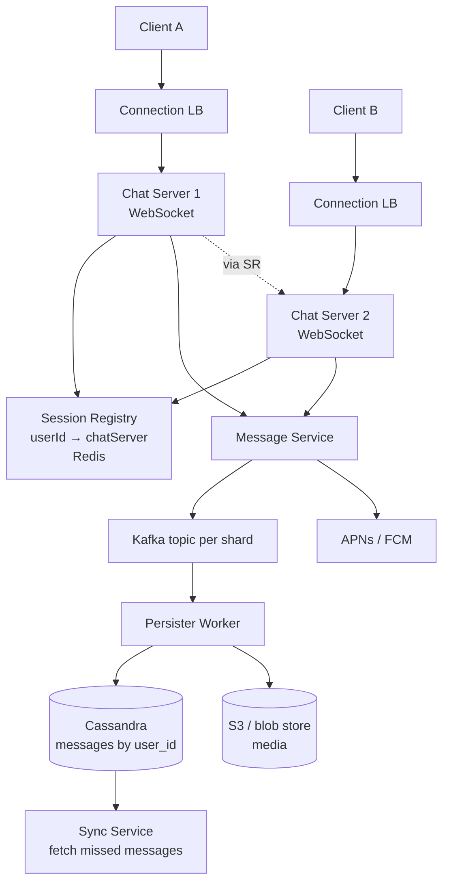
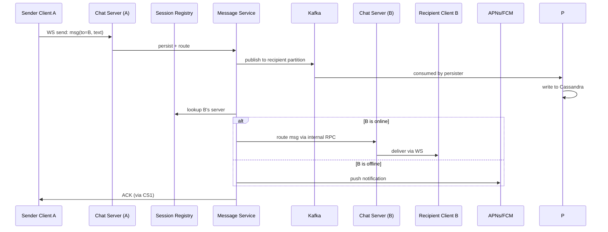

# HLD Case Study: Chat / Messaging

A chat / messaging system (WhatsApp, Messenger, Slack) is **the hardest of the canonical HLD prompts** because it forces you to engage with the **bidirectional communication problem** (long-lived connections), **fanout** (1:1 + group + broadcast), **delivery guarantees** (at-least-once + idempotency), and **mobile + offline mechanics** (push notifications, sync after reconnect). It comes up at Meta E5+, Apple iCloud/Messages teams, and senior Indian unicorn loops.

This topic walks the full design with focus on the messaging-specific patterns.

## Step 1 — Clarify

**Functional**:

- 1:1 chat (send / receive text).
- Group chat (small ~256 members, not broadcast).
- Read receipts? Typing indicators? Online status? (Pick: read receipts + online status; defer typing.)
- Media (images, video)? (Yes, via blob URL.)
- Offline support (messages delivered when recipient reconnects).
- Push notifications for offline.

**Non-functional**:

- **Scale**: 2B users, 100B messages/day.
- **Throughput**: avg ~1M messages/sec sustained, ~10M peak.
- **Latency**: < 1 sec end-to-end perceived for online users.
- **Availability**: 99.99%.
- **Consistency**: per-conversation total order; eventual across conversations.
- **Durability**: never lose a delivered message.

## Step 2 — Capacity

- **Storage**: 100B messages/day × 100 bytes (text) × 30 days hot + cold tier = ~9 PB total over a year for hot data.
- **Connections**: 2B users × avg 5 hours/day online = 400M concurrent at peak.
- **Per-server connections**: 100k WebSocket connections per server → 4000 chat servers at peak.
- **Push notifications**: ~50% of messages arrive when recipient offline → 50B pushes/day → APNs + FCM.

## Step 3 — Architecture



- **Chat servers**: hold long-lived WebSocket connections. Stateless beyond the connection — session info in Redis.
- **Session Registry (Redis)**: maps `userId → currently_connected_chat_server_id`. Updated on connect/disconnect.
- **Message Service**: receives a message, persists, routes to recipient(s).
- **Kafka**: durable log of messages; partition by recipient user_id for ordering.
- **Persister**: consumes Kafka, writes to Cassandra (eventual consistency, linear write scale).
- **Cassandra**: stores messages keyed by user_id + timestamp (clustering). Both sender and recipient have a copy (fanout-on-write for small groups, fanout-on-read for huge ones).
- **APNs / FCM**: push notification to offline recipients.

## Step 4 — Data model

**Messages table (Cassandra)**:

```text
PRIMARY KEY ((user_id, conversation_id), message_ts)
WITH CLUSTERING ORDER BY (message_ts DESC)
```

Partition key = `(user_id, conversation_id)` → all messages for a user in one conversation in one partition. Clustering key = timestamp → ordered. Fast retrieval of latest N messages.

**Sessions (Redis)**: `user:{userId}:server → chat_server_id` with TTL = connection lifetime.

**User metadata (Postgres)**: profile, settings, group membership.

## Step 5 — Send-message flow



Key points:

- **Sender ACK** as soon as the message is durably in Kafka.
- **Delivery to recipient** is at-least-once; client-side dedup by message_id.
- **Read receipt** is a separate small message: `read_receipt(msg_id, by_user_id)`.

## Step 6 — Group chat fanout

For a group of N members, sending one message means N delivery operations. Two approaches:

- **Fanout-on-write** (small groups, ≤256): Message Service iterates members and routes to each. Latency = max(per-member route). Storage = N × message_size (per-recipient copy).
- **Fanout-on-read** (huge broadcast, channels): one message stored in a `group_messages` table; readers query on poll. Storage = 1× message_size. Latency = client poll cycle.

WhatsApp uses fanout-on-write because groups are small. Slack channels with thousands of users use fanout-on-read.

## Step 7 — Failure modes

- **Chat server crash**: clients reconnect to new server (LB picks alive); Session Registry updates; any in-flight message → re-delivered from Kafka.
- **Kafka outage**: writes blocked (degraded mode); senders get "send failed" → client retries with exponential backoff + idempotency key.
- **Cassandra slow**: persistence falls behind Kafka; Kafka acts as buffer (hours of buffer = good design).
- **APNs outage**: push notifications drop; once recipient reconnects, sync pulls missed messages from Cassandra.
- **Recipient device offline**: messages queue in Cassandra; on reconnect, client requests "messages since last_sync_ts".

## Step 8 — Trade-offs

- **Cassandra vs Postgres**: Cassandra for linear-write scale (100B messages/day); Postgres can't keep up at this scale. Loss: weaker joins; we work around by denormalising.
- **WebSocket vs polling**: WS for low-latency push; polling fallback for restrictive networks. Cost: long-lived connections.
- **At-least-once vs exactly-once**: at-least-once + idempotent client dedup; exactly-once is impossible in distributed systems.
- **Per-recipient copy vs shared message**: per-recipient (fanout-on-write) for small groups; trades storage for read simplicity.
- **End-to-end encryption** (WhatsApp Signal protocol): plaintext never seen by server; storage holds encrypted blobs. Big design implication: server-side message search becomes hard.

## Step 9 — Operational concerns

- **Connection thrashing on deploy**: rolling restart drops 100k connections per server; clients reconnect → thundering herd on remaining servers. Mitigate with graceful drain + connection draining LB.
- **Region failover**: WS connections can't span regions; on regional outage, clients reconnect to neighbour region.
- **Monitoring**: per-server WS count, message dispatch latency, Kafka lag, Cassandra write latency, push notification delivery rate.

## Java/JVM Concerns

- **WebSocket server**: Netty (event-loop) or Spring WebFlux (reactive). Handles 100k+ connections per JVM.
- **GC choice**: ZGC for low-pause; long-lived connections = many tenured objects; pause spikes drop connections.
- **Heap size**: ~16-32 GB; not too large to avoid long young-gen GCs.
- **CompletableFuture** or **Project Reactor** for async pipelines (lookup session → route → ack).
- **Virtual threads (Java 21)**: blocking I/O per connection becomes cheap; alternative to reactive model.

## Deeper Dive — Concrete Java Implementation

### WebSocket handler (Spring + STOMP-style routing)

```java
@Configuration
@EnableWebSocket
public class WebSocketConfig implements WebSocketConfigurer {
    private final ChatHandler chatHandler;
    public WebSocketConfig(ChatHandler chatHandler) { this.chatHandler = chatHandler; }
    @Override
    public void registerWebSocketHandlers(WebSocketHandlerRegistry registry) {
        registry.addHandler(chatHandler, "/ws/chat")
                .setAllowedOrigins("*");
    }
}

@Component
public class ChatHandler extends TextWebSocketHandler {
    private final SessionRegistry sessions;
    private final MessageService messageService;
    private final ObjectMapper json;

    public ChatHandler(SessionRegistry sessions, MessageService messageService, ObjectMapper json) {
        this.sessions = sessions; this.messageService = messageService; this.json = json;
    }

    @Override
    public void afterConnectionEstablished(WebSocketSession session) {
        String userId = (String) session.getAttributes().get("userId");
        sessions.register(userId, session);
    }

    @Override
    public void afterConnectionClosed(WebSocketSession session, CloseStatus status) {
        String userId = (String) session.getAttributes().get("userId");
        sessions.unregister(userId);
    }

    @Override
    protected void handleTextMessage(WebSocketSession session, TextMessage message) throws IOException {
        IncomingMessage incoming = json.readValue(message.getPayload(), IncomingMessage.class);
        String fromUserId = (String) session.getAttributes().get("userId");
        Message persisted = messageService.send(fromUserId, incoming.toUserId(), incoming.text());
        // Ack to sender.
        session.sendMessage(new TextMessage(json.writeValueAsString(new MessageAck(persisted.id()))));
    }

    public void deliver(WebSocketSession session, Message msg) throws IOException {
        session.sendMessage(new TextMessage(json.writeValueAsString(msg)));
    }
}

public record IncomingMessage(String toUserId, String text) {}
public record MessageAck(String messageId) {}
```

### Session registry backed by Redis

```java
@Component
public class SessionRegistry {
    private final StringRedisTemplate redis;
    private final Map<String, WebSocketSession> localSessions = new ConcurrentHashMap<>();
    private final String serverInstanceId;

    public SessionRegistry(StringRedisTemplate redis,
                           @Value("${app.server-id}") String serverInstanceId) {
        this.redis = redis;
        this.serverInstanceId = serverInstanceId;
    }

    public void register(String userId, WebSocketSession session) {
        localSessions.put(userId, session);
        redis.opsForValue().set("session:" + userId, serverInstanceId, Duration.ofMinutes(30));
    }

    public void unregister(String userId) {
        localSessions.remove(userId);
        redis.delete("session:" + userId);
    }

    public String getServerFor(String userId) {
        return redis.opsForValue().get("session:" + userId);
    }

    public WebSocketSession getLocalSession(String userId) {
        return localSessions.get(userId);
    }

    public boolean isLocal(String userId) {
        WebSocketSession session = localSessions.get(userId);
        return session != null && session.isOpen();
    }
}
```

### Message service with Kafka durability

```java
@Service
public class MessageService {
    private final SessionRegistry sessions;
    private final ChatHandler handler;
    private final KafkaTemplate<String, OutboundEvent> kafka;
    private final PushNotificationService push;

    @Transactional
    public Message send(String fromUserId, String toUserId, String text) {
        Message msg = new Message(UUID.randomUUID().toString(), fromUserId, toUserId, text, Instant.now());
        // 1. Publish to Kafka (partition by recipient for ordering).
        kafka.send("messages", toUserId, new OutboundEvent(msg));
        // 2. If recipient is connected locally, deliver inline.
        if (sessions.isLocal(toUserId)) {
            try { handler.deliver(sessions.getLocalSession(toUserId), msg); }
            catch (IOException e) { /* lost connection; rely on sync on reconnect */ }
        } else {
            // 3. If recipient on another server, RPC to that server (or rely on Kafka consumer there).
            String otherServer = sessions.getServerFor(toUserId);
            if (otherServer == null) push.send(toUserId, msg);  // offline → push notif
        }
        return msg;
    }
}

public record Message(String id, String fromUserId, String toUserId, String text, Instant sentAt) {}
public record OutboundEvent(Message message) {}
```

### Cassandra schema for message persistence

```cql
CREATE TABLE messages_by_user_convo (
    user_id          TEXT,
    conversation_id  TEXT,
    message_ts       TIMESTAMP,
    message_id       TEXT,
    from_user_id     TEXT,
    text             TEXT,
    PRIMARY KEY ((user_id, conversation_id), message_ts)
) WITH CLUSTERING ORDER BY (message_ts DESC);
```

**Partition key** `(user_id, conversation_id)` → all messages for one user in one conversation in one partition. **Clustering** by timestamp descending → fast "last N messages" query without scan. Storage cost: per-recipient copy (fanout-on-write).

### Sync-on-reconnect

```java
@RestController
@RequestMapping("/api/sync")
public class SyncController {
    private final MessageRepository repo;

    @GetMapping
    public List<Message> sync(@AuthenticationPrincipal String userId,
                              @RequestParam Instant since) {
        return repo.findByUserIdAndConversation_idAndMessageTsGreaterThan(userId, "all", since);
    }
}
```

Client posts `since` = last-seen-timestamp; server returns missed messages from Cassandra. Client dedup by `message.id()` in case of overlap with WebSocket-delivered messages.

### Capacity worksheet

| Metric | Calculation | Value |
|---|---|---|
| DAU | 100M | — |
| Messages/day/user (avg) | 50 | — |
| Messages/sec sustained | 100M × 50 / 86400 | ~58k/sec |
| Messages/sec peak | × 3 | ~175k/sec |
| Storage per message | text avg 200B + metadata 100B = 300B (Cassandra encoded) | — |
| Storage/day | 100M × 50 × 300B × 2 (sender + recipient copies) | ~3 TB/day |
| Storage/year | 3 TB × 365 | ~1.1 PB |
| Concurrent WebSocket connections | DAU × 25% online | 25M concurrent |
| Per-chat-server connections | 50k | — |
| Chat servers needed | 25M / 50k | 500 servers |
| Push notifications (50% offline) | 175k × 0.5 | ~87k/sec to APNs/FCM |

### Decision matrix

| Decision | Chosen | Alternative | Why |
|---|---|---|---|
| Real-time transport | WebSocket | Long polling | Low latency; bidi; established standard |
| Routing across servers | Redis Session Registry + RPC | Sticky LB | RPC supports any-to-any; no LB rebalance on reconnect |
| Message ordering | Per-recipient Kafka partition | Global ordering | Scales; per-user FIFO is what users perceive |
| Delivery semantics | At-least-once + client dedup | Exactly-once | Exactly-once distributed delivery impossible |
| Storage | Cassandra | DynamoDB | Open-source; better tooling; horizontal write scale |
| Fanout for groups | On-write (small groups ≤ 256) | On-read | Small groups → cheap; ≥ 1k members switch to on-read |
| Offline delivery | APNs / FCM | Email fallback | Mobile-first; FCM is free |

### Test plan (integration)

```java
@SpringBootTest
@Testcontainers
class ChatIntegrationTest {
    @Container @ServiceConnection
    static KafkaContainer kafka = new KafkaContainer(DockerImageName.parse("confluentinc/cp-kafka:7.5.0"));

    @Test
    void send_to_online_user_delivers_via_websocket() {
        // 1. Connect user A WebSocket.
        // 2. Connect user B WebSocket.
        // 3. A sends message to B.
        // 4. Assert B receives it within timeout.
    }

    @Test
    void send_to_offline_user_persists_and_pushes() {
        // 1. Connect user A only.
        // 2. A sends to B (not connected).
        // 3. Assert Kafka has the event.
        // 4. Assert push notification mock was called.
        // 5. Connect B; assert sync returns the missed message.
    }
}
```

## Sources & Further Reading

- [ByteByteGo — Design WhatsApp](https://bytebytego.com/courses/system-design-interview/design-a-chat-system)
- [High Scalability — WhatsApp Architecture](http://highscalability.com/blog/2014/2/26/the-whatsapp-architecture-facebook-bought-for-19-billion.html)
- [Engineering at Meta — Messenger backend](https://engineering.fb.com/category/data-infrastructure/)

## Practice

1. **Run 7-step framework on Chat solo** in 45 minutes.
2. **Sketch the send-message flow** end-to-end including failure modes.
3. **Compare fanout-on-write vs fanout-on-read** with specific scale numbers.
4. **Design the read-receipt flow** without doubling message volume.
5. **Add typing indicators** — how do you avoid flooding the system with per-keystroke messages?

## Recap

You should now be able to:

- Design a **WebSocket-based chat system** with session-registry for routing.
- Apply **Cassandra partition design** for messages keyed by (user, conversation).
- Choose **fanout-on-write vs fanout-on-read** based on group size.
- Implement **at-least-once + idempotent dedup** for delivery semantics.
- Handle **offline recipients** via push + sync-on-reconnect.
- Name **failure modes** at every layer.
- Make **Java/JVM-specific choices** (Netty, ZGC, virtual threads, reactive).

## Next

Continue to [HLD Case Bundle: News Feed, Rate Limiter, Payments, Notifications](./T09-hld-case-bundle-news-feed-rate-limiter-payments-notifications.md).
