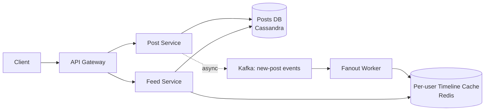
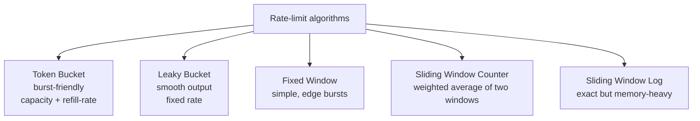
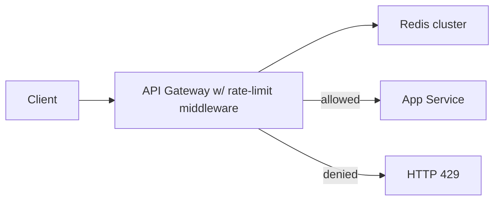
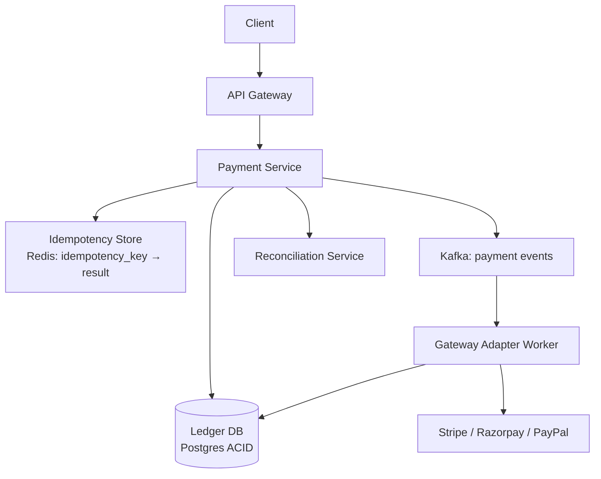
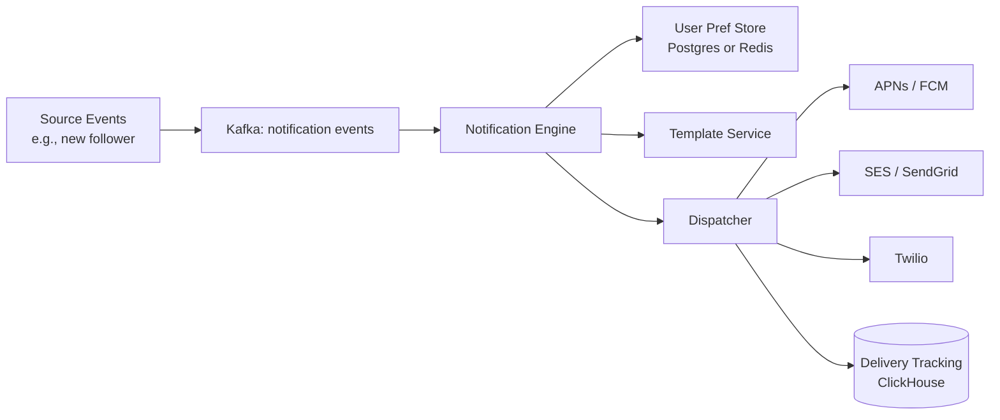
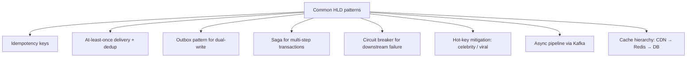

# HLD Case Bundle: News Feed, Rate Limiter, Payments, Notifications

Four canonical HLD prompts in one topic — each shorter than a dedicated chapter, but each surfaces a distinctive design lever you'll be asked about at senior loops: **News Feed** (fanout strategy), **Rate Limiter** (algorithms + distributed coordination), **Payment System** (idempotency + Saga + double-spend), **Notification System** (fanout + delivery guarantees). Reading these four covers ~70% of the design prompts you'll see beyond URL Shortener and Chat.

## 1. News Feed (Twitter / Instagram / Facebook Newsfeed)

### Requirements

- Users post content (text/image/video).
- Users follow other users.
- Feed = posts from followed users, ordered by time / relevance.
- Scale: 1B users, 100M DAU, ~100M posts/day, ~10B feed reads/day.

### Architecture



### Fanout strategies (the central decision)

- **Fanout-on-write (push model)**: when user X posts, push the post to every follower's pre-computed timeline cache. Read = O(1) cache lookup.
- **Fanout-on-read (pull model)**: store posts; when user requests feed, fetch from all followed users + merge.
- **Hybrid**: push for normal users, pull for celebrities (1M+ followers).

The **celebrity problem**: pushing one post by Cristiano Ronaldo (~500M followers) means 500M cache writes — infeasible. So celebrities switch to pull: their followers fetch their posts on feed-read.

Twitter's published architecture: hybrid. Most users push (cheap); celebs pull (server-side merge at read).

### Storage

- **Posts**: Cassandra, partition by `(user_id, post_ts)`.
- **Following graph**: Cassandra or graph DB (Neo4j). Hot users = denormalised follower lists in Redis.
- **Per-user timeline cache**: Redis list, capped at most recent 1000.

### Trade-offs

- Push optimises read latency at cost of write amplification.
- Pull optimises write cost at cost of read latency.
- Hybrid wins in practice but adds complexity (celebrity detection, dual code path).

## 2. Rate Limiter

### Requirements

- Limit per-key (user, IP, API key) requests per time window.
- Both burst-friendly (token bucket) and smooth (leaky bucket) policies.
- Distributed: limit applies across multiple app servers.
- Low latency overhead (sub-millisecond).

### Algorithms



### Token Bucket implementation (Redis)

```text
key = "rl:user:123"
value = {tokens: 8, last_refill_ts: 1717900000}

On each request:
  1. Read current state from Redis (Lua script for atomicity)
  2. Compute refill: tokens += (now - last_refill_ts) * refill_rate, cap at capacity
  3. If tokens >= 1: tokens -= 1, allow; else deny.
  4. Write updated state back.
```

The Lua script ensures the read-modify-write is atomic, avoiding race conditions across app servers.

### Architecture



The rate-limit check is in the gateway / sidecar — not in each app service.

### Trade-offs

- **Distributed strict accuracy** requires Redis round-trip (1-2ms). **Eventually-consistent local counters** (per-server) are faster but allow up to N× burst (N = server count).
- **Token bucket** allows bursts up to capacity; smooth average over time. Best default for APIs.
- **Sliding window log** is most accurate but memory-heavy; use only for low-RPS endpoints.

## 3. Payment System

### Requirements

- Process payments: charge, refund, settle.
- Strong consistency: never lose money, never double-charge.
- Idempotency: client retries safe.
- Scale: 1M TPS peak (large e-commerce / fintech).
- Integrate with multiple payment gateways (Stripe, Razorpay, PayPal, bank rails).

### Architecture



### Critical patterns

- **Idempotency key**: client supplies `Idempotency-Key` header. Server stores key → response for 24h. Retries return cached response, not re-charge.
- **Ledger**: append-only `ledger_entries` table — every state change (charge initiated, succeeded, refunded) is a row. Source of truth.
- **Saga for multi-step transactions**: order placement = inventory reservation + charge + shipping. If any step fails, compensating transactions undo prior steps.
- **Outbox pattern**: payment service writes to DB + outbox table atomically; outbox poller publishes to Kafka. Avoids dual-write inconsistency.

### Data model

```sql
CREATE TABLE payments (
  id UUID PRIMARY KEY,
  idempotency_key VARCHAR(64) UNIQUE NOT NULL,
  user_id BIGINT NOT NULL,
  amount_cents BIGINT NOT NULL,
  currency VARCHAR(3) NOT NULL,
  status VARCHAR(20) NOT NULL,  -- INITIATED, AUTHORIZED, CAPTURED, REFUNDED, FAILED
  gateway_ref VARCHAR(64),
  created_at TIMESTAMP NOT NULL,
  updated_at TIMESTAMP NOT NULL,
  CHECK (amount_cents > 0)
);

CREATE TABLE ledger_entries (
  id BIGSERIAL PRIMARY KEY,
  payment_id UUID NOT NULL REFERENCES payments(id),
  entry_type VARCHAR(20) NOT NULL,  -- DEBIT, CREDIT
  amount_cents BIGINT NOT NULL,
  ts TIMESTAMP NOT NULL
);
```

### Failure modes

- **Gateway timeout**: payment may have succeeded at gateway. Reconciliation service polls gateway for status.
- **Double-spend**: prevented by idempotency-key check + DB unique constraint.
- **Lost message between services**: outbox + Kafka with consumer-group commit handles.

### Why this matters

Payments demand **strong consistency** + **at-least-once + idempotency** + **eventual reconciliation**. Loose any one and you lose money or charge twice. This is why senior loops drill on it.

## 4. Notification System

### Requirements

- Send notifications via push (APNs / FCM), email (SES / SendGrid), SMS (Twilio).
- Fanout to millions of users on event.
- Honour user preferences (silence times, frequency caps).
- Track delivery: sent / delivered / opened / bounced.

### Architecture



### Critical patterns

- **Async pipeline via Kafka**: decouples source events from delivery. Source emits "new follower" event; notification engine decides who/how to notify.
- **Per-channel adapter**: separate adapter for push / email / SMS. New channel = new adapter.
- **Template service**: renders per-user content (i18n, personalisation).
- **Rate limiting per user**: cap "notifications/day" per user to prevent spam.
- **Quiet hours**: per-user setting respected at dispatch.
- **Bounce handling**: dead-letter queue for unreachable destinations; back off retries; eventually mark address invalid.

### Trade-offs

- **Push vs email vs SMS**: push is cheapest + fastest but requires app install; email is universal but slow; SMS is high-cost + intrusive.
- **At-least-once delivery**: with client-side dedup (notification_id) to handle duplicates.
- **Throttling vs immediate**: bursty source events (e.g., breaking news) can saturate APNs; throttle dispatcher to APNs limits.

### Failure modes

- **Channel provider down (APNs/FCM outage)**: messages queue; deliver on recovery. Long outage → drop oldest, alert ops.
- **User token expired** (e.g., uninstalled app): bounce → invalidate token.
- **Spam complaints**: feedback loop from provider triggers preference change.

## Cross-Cutting Patterns Across All Four



These appear in every senior HLD round. Internalise them as defaults; reach for them whenever the prompt mentions failure modes, retries, or scale.

## Deeper Dive — Concrete Java Code Per System

### 1. News Feed — fanout-on-write with celebrity escape hatch

```java
@Service
public class FeedService {
    private static final long CELEBRITY_THRESHOLD = 100_000;
    private final FollowGraph follow;
    private final StringRedisTemplate redis;            // user → cached timeline list
    private final PostRepository posts;

    public void onNewPost(Post post) {
        long followerCount = follow.countFollowers(post.userId());
        if (followerCount < CELEBRITY_THRESHOLD) {
            // Fanout-on-write: push to each follower's cached timeline.
            for (String followerId : follow.getFollowerIds(post.userId())) {
                String key = "timeline:" + followerId;
                redis.opsForList().leftPush(key, serialize(post));
                redis.opsForList().trim(key, 0, 999);   // cap at 1000 most recent
            }
        }
        // Celebrities: do not fanout; followers will pull on read.
    }

    public List<Post> getFeed(String userId) {
        // 1. Read pre-computed timeline cache.
        List<String> serialized = redis.opsForList().range("timeline:" + userId, 0, 99);
        List<Post> feed = serialized.stream().map(this::deserialize).collect(Collectors.toList());

        // 2. For each celebrity I follow, fetch their recent posts (pull).
        for (String celebId : follow.getCelebrityFollows(userId, CELEBRITY_THRESHOLD)) {
            feed.addAll(posts.findRecentByUserId(celebId, 20));
        }

        // 3. Merge by timestamp, dedup, return top N.
        return feed.stream()
                .sorted(Comparator.comparing(Post::createdAt).reversed())
                .distinct()
                .limit(100)
                .collect(Collectors.toList());
    }

    private String serialize(Post p) { /* JSON or Protobuf */ return ""; }
    private Post deserialize(String s) { /* JSON or Protobuf */ return null; }
}
```

### 2. Rate Limiter — Redis + Lua atomic token bucket

```java
@Component
public class TokenBucketRateLimiter {
    private static final String LUA_SCRIPT = """
        local key = KEYS[1]
        local capacity = tonumber(ARGV[1])
        local refillPerSec = tonumber(ARGV[2])
        local nowMs = tonumber(ARGV[3])
        local cost = tonumber(ARGV[4])

        local data = redis.call('HMGET', key, 'tokens', 'lastRefillMs')
        local tokens = tonumber(data[1])
        local lastRefillMs = tonumber(data[2])

        if tokens == nil then
            tokens = capacity
            lastRefillMs = nowMs
        end

        local elapsedSec = (nowMs - lastRefillMs) / 1000
        tokens = math.min(capacity, tokens + elapsedSec * refillPerSec)
        lastRefillMs = nowMs

        local allowed = 0
        if tokens >= cost then
            tokens = tokens - cost
            allowed = 1
        end

        redis.call('HMSET', key, 'tokens', tokens, 'lastRefillMs', lastRefillMs)
        redis.call('EXPIRE', key, 3600)
        return allowed
        """;

    private final StringRedisTemplate redis;
    private final DefaultRedisScript<Long> script;

    public TokenBucketRateLimiter(StringRedisTemplate redis) {
        this.redis = redis;
        this.script = new DefaultRedisScript<>(LUA_SCRIPT, Long.class);
    }

    public boolean tryAcquire(String key, int capacity, int refillPerSec, int cost) {
        Long allowed = redis.execute(
            script,
            List.of("rl:" + key),
            String.valueOf(capacity),
            String.valueOf(refillPerSec),
            String.valueOf(System.currentTimeMillis()),
            String.valueOf(cost)
        );
        return allowed != null && allowed == 1;
    }
}
```

**Why Lua**: Redis runs scripts atomically — no race between read + write. Without it, two clients reading "tokens=1" simultaneously would both decrement, allowing 2 calls instead of 1.

### 3. Payment System — idempotency key with DB-backed dedup

```java
@RestController
@RequestMapping("/api/payments")
public class PaymentController {
    private final PaymentService payments;

    @PostMapping
    public ResponseEntity<PaymentResult> charge(
            @RequestHeader("Idempotency-Key") @NotBlank String idempotencyKey,
            @Valid @RequestBody ChargeRequest req) {
        PaymentResult result = payments.charge(idempotencyKey, req);
        return ResponseEntity.ok(result);
    }
}

@Service
public class PaymentService {
    private final IdempotencyKeyRepository keys;
    private final LedgerRepository ledger;
    private final PaymentGatewayClient gateway;
    private final ApplicationEventPublisher events;

    @Transactional
    public PaymentResult charge(String idempotencyKey, ChargeRequest req) {
        // 1. Check if we've seen this key before.
        Optional<IdempotencyKeyRecord> existing = keys.findByKey(idempotencyKey);
        if (existing.isPresent()) {
            // Replay cached response — same request, same result.
            return existing.get().toResult();
        }

        // 2. Atomically reserve the key (DB unique constraint prevents duplicates).
        IdempotencyKeyRecord record = new IdempotencyKeyRecord(
            idempotencyKey, req.hash(), Instant.now(), null);
        try {
            keys.save(record);
        } catch (DataIntegrityViolationException dup) {
            // Another concurrent request reserved it first; reload.
            return keys.findByKey(idempotencyKey).orElseThrow().toResult();
        }

        // 3. Call gateway.
        GatewayResponse gw = gateway.charge(req.amount(), req.currency(), req.cardToken());

        // 4. Write ledger entries (debit user, credit account).
        LedgerEntry debit = new LedgerEntry(req.userId(), "DEBIT", req.amount(), gw.transactionId());
        LedgerEntry credit = new LedgerEntry(req.merchantId(), "CREDIT", req.amount(), gw.transactionId());
        ledger.saveAll(List.of(debit, credit));

        // 5. Update idempotency record with result.
        PaymentResult result = new PaymentResult(gw.transactionId(), gw.status());
        record.setResult(result);
        keys.save(record);

        // 6. Outbox: schedule async events (payment.completed).
        events.publishEvent(new PaymentCompletedEvent(gw.transactionId(), req.userId(), req.amount()));

        return result;
    }
}

public record ChargeRequest(
    @NotNull Long userId,
    @NotNull Long merchantId,
    @Positive BigDecimal amount,
    @NotBlank String currency,
    @NotBlank String cardToken) {
    public String hash() {
        return DigestUtils.sha256Hex(userId + "|" + merchantId + "|" + amount + "|" + currency + "|" + cardToken);
    }
}
```

### 4. Notification System — fanout dispatcher with channel adapters

```java
@Service
public class NotificationDispatcher {
    private final UserPreferenceService prefs;
    private final TemplateService templates;
    private final Map<Channel, ChannelAdapter> adapters;
    private final TokenBucketRateLimiter rateLimiter;

    public NotificationDispatcher(UserPreferenceService prefs, TemplateService templates,
                                  List<ChannelAdapter> adapterList, TokenBucketRateLimiter rateLimiter) {
        this.prefs = prefs;
        this.templates = templates;
        this.adapters = adapterList.stream().collect(Collectors.toMap(ChannelAdapter::channel, x -> x));
        this.rateLimiter = rateLimiter;
    }

    @KafkaListener(topics = "notification-events")
    public void onEvent(NotificationEvent event) {
        UserPreferences userPrefs = prefs.get(event.userId());

        // Quiet hours.
        if (userPrefs.isInQuietHours(Instant.now())) {
            scheduleForLater(event, userPrefs.quietHoursEnd());
            return;
        }

        // Per-user-per-day cap (e.g., 20 notifications/day).
        if (!rateLimiter.tryAcquire("notif:" + event.userId(), 20, 1, 1)) {
            // Skipped due to quota.
            return;
        }

        // For each channel the user opted into.
        for (Channel channel : userPrefs.enabledChannels()) {
            String body = templates.render(event.templateId(), channel, userPrefs.locale(), event.params());
            adapters.get(channel).send(event.userId(), body);
        }
    }
}

public interface ChannelAdapter {
    Channel channel();
    void send(String userId, String body);
}

@Component
public class FcmPushAdapter implements ChannelAdapter {
    private final FirebaseMessaging fcm;
    private final DeviceTokenRepository devices;
    public Channel channel() { return Channel.PUSH; }
    public void send(String userId, String body) {
        for (String token : devices.findTokensForUser(userId)) {
            try {
                fcm.send(com.google.firebase.messaging.Message.builder()
                        .setToken(token)
                        .setNotification(Notification.builder().setBody(body).build())
                        .build());
            } catch (FirebaseMessagingException e) {
                if (e.getMessagingErrorCode() == MessagingErrorCode.UNREGISTERED) {
                    devices.invalidate(token);
                }
            }
        }
    }
}
```

### Capacity worksheets

| System | Key metric | Calc | Value |
|---|---|---|---|
| News Feed | Cache writes/sec at peak (fanout-on-write, avg 200 followers) | 100M posts/day × 200 fanout / 86400 | ~230k/sec |
| Rate Limiter | Redis ops/sec | API peak RPS × 1 op | ~50k/sec (1 Lua call per request) |
| Payment | Idempotency lookups/sec | Payment peak | ~5k/sec |
| Notification | APNs/FCM dispatch/sec | DAU × avg 5 notif/day / 86400 | ~6k/sec |

## Sources & Further Reading

- [ByteByteGo — News Feed](https://bytebytego.com/courses/system-design-interview/design-a-news-feed-system)
- [System Design Primer — Rate Limiter](https://github.com/donnemartin/system-design-primer)
- [Stripe Engineering — Idempotency](https://stripe.com/blog/idempotency)
- [Uber Engineering — Notification Architecture](https://www.uber.com/blog/engineering/)
- [Hello Interview](https://www.hellointerview.com/) — all four problems covered with answer keys

## Practice

1. **Run 45-min HLD on Twitter News Feed** solo. Compare fanout strategies.
2. **Design a token-bucket rate limiter in Redis** with Lua script for atomicity.
3. **Design the idempotency layer of a payments API** including key format, TTL, race conditions.
4. **Design a notification system that honours quiet hours** and per-user frequency caps.
5. **Identify the 4 cross-cutting patterns** in each of your designs.

## Recap

You should now be able to:

- Design a **News Feed** with push / pull / hybrid fanout and celebrity-problem handling.
- Design a **Rate Limiter** with Token Bucket in Redis using Lua atomicity.
- Design a **Payment System** with idempotency keys, ledger, Saga, Outbox.
- Design a **Notification System** with multi-channel adapters, preferences, throttling.
- Apply the **eight cross-cutting HLD patterns** (idempotency, at-least-once + dedup, outbox, saga, circuit breaker, hot-key mitigation, async via Kafka, cache hierarchy) as defaults.

## Next

Continue to [C04 Behavioural & Company Tracks — Behavioural Interviews (STAR, CAR, SBI)](../C04-behavioral-and-company-tracks/T01-behavioral-interviews-star-car-sbi.md).
