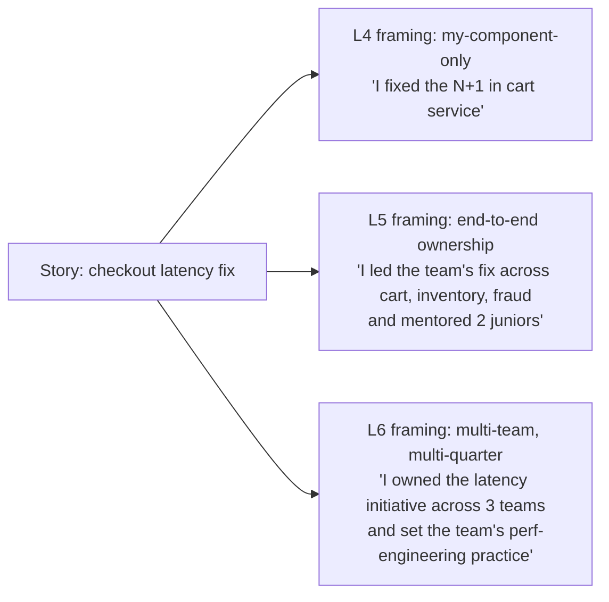
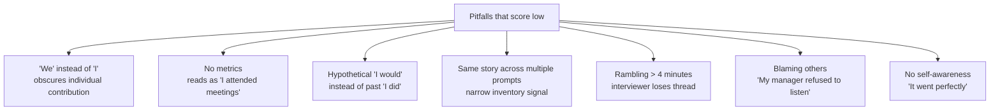
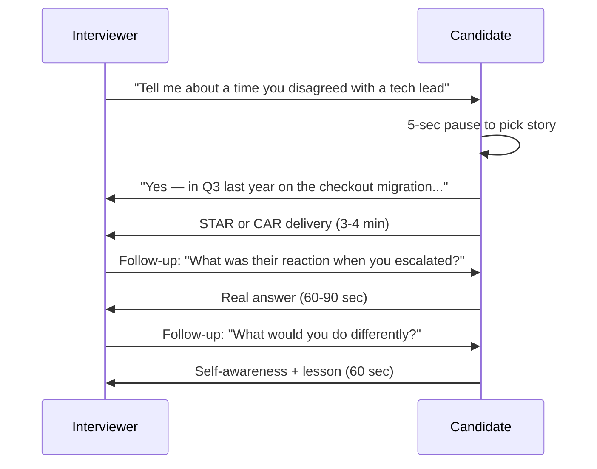

# Behavioural Interviews (STAR, CAR, SBI)

The behavioural round — Meta's "Jedi", Amazon's LP rounds, Google's "Googleyness & Leadership", Netflix's culture interview, Apple's hiring-manager rounds — is **load-bearing in every FAANGM loop**. It is the round that decides level (E5 vs E6 at Meta is often a behavioural decision), the round whose failure auto-rejects (Meta), and the round that vetoes (Amazon Bar Raiser). Yet most candidates under-invest in behavioural prep because it feels less "technical".

This topic is the **mechanics of behavioural performance**: the three answer structures (STAR, CAR, SBI), the story-bank approach, the universal pitfalls, and the level-calibration that makes the same story score E4 or E5 depending on how you frame it.

## Why Behavioural Decides Offers

```mermaid
flowchart LR
  T[Technical strong] --> O{Outcome?}
  B[Behavioural strong] --> O
  T -->|alone| L[Lean No-Hire]
  B -->|alone| L2[No-Hire (no tech)]
  T --> O
  B --> O
  O -->|both strong| H[Hire / Strong Hire]
```

Companies prefer "good engineer + good colleague" over "great engineer + difficult". The behavioural round is the only place the colleague signal is measured.

## The Three Answer Structures

### STAR — the universal default

**S**ituation → **T**ask → **A**ction → **R**esult

```text
Situation: "Last quarter, our checkout service was hitting 4-second p99 latency
            during Black Friday peak — we had ~3 weeks before the next sales event."

Task:      "I was tech lead on the checkout team. My job: cut p99 below 500ms
            for the next event."

Action:    "I profiled with async-profiler and identified three culprits: N+1 JPA
            queries in the cart service, an unindexed lookup in the inventory call,
            and a synchronous external fraud-check.
            I fixed the N+1 with JOIN FETCH + DTO projection (took 2 days),
            added a covering index (1 day), and moved the fraud-check to async
            with a fallback to optimistic-confirm (5 days).
            Plus mentoring two juniors through the JFR analysis."

Result:    "p99 dropped to 320ms — under the target. No incidents that Black Friday.
            Conversion rate went up 1.8%, attributed by product to the latency win.
            Both juniors I mentored now lead similar perf work on their teams."
```

**The four blocks should be balanced** — many candidates over-spend on Situation and under-spend on Action. **Action is where the signal lives**; spend ~50-60% of your time there.

### CAR — concise alternative

**C**ontext → **A**ction → **R**esult

For high-volume rounds (Meta Jedi has 5-6 stories in 45 min) where STAR is too long. Drop Task into Context.

```text
Context: "Checkout latency was 4s at peak, 3 weeks to fix."
Action:  "Profiled with async-profiler; fixed N+1 with JOIN FETCH, added index,
          async fraud-check with fallback. Mentored 2 juniors through it."
Result:  "p99 320ms; no incidents at peak; +1.8% conversion."
```

~90 seconds vs STAR's 3-4 minutes. Use when you need to compress.

### SBI — for feedback / conflict stories

**S**ituation → **B**ehaviour → **I**mpact

```text
Situation: "Sprint retro after a missed deadline."
Behaviour: "Our senior engineer dismissed a junior's testing concern in front of
            the team without engaging with it."
Impact:    "The junior went quiet for the rest of the retro and started filing
            issues privately instead of raising in standup."
```

The SBI structure is the standard for delivering / receiving feedback at top companies. Used when the prompt asks about giving difficult feedback, navigating conflict, or handling a colleague's behaviour.

## The Story-Bank Approach

Don't try to invent stories under pressure. **Build a story bank** of 10-15 stories before any loop. Each story should:

- Span **at least one quarter** (E5+ stories; E3-E4 can be smaller).
- Have **measurable outcome** (latency %, revenue $, MAU change, error rate, deploy time).
- Demonstrate **one or two clear signals** (ownership, conflict, ambiguity, leadership without authority, mentoring).
- Be told in **STAR in 4 minutes** or **CAR in 90 seconds**.

### The 12-story coverage matrix

Map your stories to cover this matrix. **Aim for 1-2 stories per row.**

| Theme | Example prompt |
|---|---|
| **Owning a project end-to-end** | "Tell me about a project you owned." |
| **Resolving a tough conflict** | "Disagreed with a peer / manager / cross-team." |
| **Driving multi-team alignment** | "Influenced without authority." |
| **Handling ambiguity** | "A problem with no clear definition — how did you scope?" |
| **Mentoring / growing others** | "Helped someone grow." |
| **Tech-debt or refactor at scale** | "Migrated / decommissioned / refactored." |
| **Failure / lesson learned** | "A project that didn't go as planned." |
| **Delivering under pressure** | "Tight deadline + scope cut." |
| **Going beyond scope** | "Saw a problem outside your remit; fixed it." |
| **Customer / user impact** | "Decision driven by user feedback." |
| **Innovation / new approach** | "Did something the team hadn't done before." |
| **Long-term thinking** | "Decision whose benefit took >6 months." |

## Level Calibration — Same Story, Different Level

The same story can be framed at L4, L5, or L6 scope depending on what you emphasise. **Match the level of the role you're interviewing for.**



If you over-claim (E4 work framed as E6 strategic), the interviewer probes ("how many people reported to you on this? what was the cross-team disagreement?") and the story collapses. **Pick the framing your story actually supports.**

## The Universal Pitfalls



### Pitfall 1 — 'We' instead of 'I'

Interviewers literally count: "she said 'I' 3 times, 'we' 19 times in that story." Reads as the candidate riding on a team's work without owning a piece.

**Fix**: phrase shared work as *"the team did X; my specific contribution was Y"*. Be explicit about your slice.

### Pitfall 2 — No metrics

"I improved the system" tells the interviewer nothing. "I cut p99 from 4s to 320ms over 3 weeks" tells them what scale and what scope you operate at.

**Fix**: quantify everything. Even estimated/proxy metrics. If you don't remember, say so: "I don't remember the exact number, but the impact was..."

### Pitfall 3 — Hypothetical answers

Amazon explicitly bans this — *"answering hypothetically ('I would…') instead of with a real past event"* is on their published list of mistakes ([amazon.jobs](https://www.aboutamazon.com/news/workplace/amazon-jobs-interview-mistakes)).

**Fix**: ground in real past. If you've never done X, say "I haven't done exactly this; the closest is..."

### Pitfall 4 — Story recycling

Using the "checkout latency fix" story for *"tell me about owning a project"* AND *"tell me about resolving conflict"* AND *"tell me about leadership"* — signals narrow experience.

**Fix**: build the 12-story bank. Use a different story for each prompt theme.

### Pitfall 5 — Rambling

A 6-minute story loses the interviewer at minute 4. They start writing "rambled" in the packet.

**Fix**: time yourself in mocks. STAR = 4 min max; CAR = 90 sec. Practice tightening.

### Pitfall 6 — Blaming

*"My manager refused to listen so the project failed."* Signals inability to navigate up — a red flag at every level.

**Fix**: own your contribution to the failure. *"I should have escalated earlier with concrete data instead of repeating my concerns verbally."*

### Pitfall 7 — No self-awareness

*"It went perfectly."* No project goes perfectly. The interviewer probes — *"what would you do differently?"* — and you have no answer.

**Fix**: every story ends with a *"what I learned / what I'd do differently"* paragraph. Even successful projects.

## Mapping Stories To Company Values

Each FAANGM company has values/principles your stories should map to:

- **Amazon**: 16 LPs — see [T03](./T03-company-track-amazon-leadership-principles.md).
- **Meta**: Move Fast, Be Bold, Focus on Impact, Be Open, Build Social Value — see [T05](./T05-company-track-meta.md).
- **Google**: Googleyness + Leadership (4 signals) — see [T04](./T04-company-track-google.md).
- **Apple**: Per-team; broadly craft, attention to detail, "Why Apple" — see [T06](./T06-company-track-apple.md).
- **Netflix**: Keeper Test, Freedom & Responsibility — see [T07](./T07-company-track-netflix.md).
- **Microsoft**: Growth Mindset, Customer Obsession, Diverse & Inclusive — see [T08](./T08-company-track-microsoft.md).

**Map each of your 12 stories to which value/principle it best evidences.** Walk into the loop knowing which story to deploy for which prompt.

## The Real-Round Mechanics



Each prompt gets 1 story (5-7 min total: 3-4 min STAR + 2-3 min follow-ups). A 45-min behavioural round covers 5-6 stories. Plan to deliver 5-6 strong stories — that's the volume.

## Practice Drills

1. **The recording drill**: record yourself telling your 12 stories. Listen back. Count "we" vs "I"; count metrics; count silent gaps.
2. **The 4-minute STAR drill**: time yourself. Stop at 4 min; if the story isn't done, it's too long.
3. **The follow-up drill**: have a partner ask the standard 3 follow-ups: "what was their reaction?", "what did you learn?", "what would you do differently?". Practice the honest 60-90 sec answers.
4. **The story-mapping drill**: take each of your 12 stories; map to each company's values/principles. Identify gaps.
5. **The hypothetical-to-real drill**: take a prompt where you don't have a real story. Practice the "I haven't done exactly this; the closest is..." opening.
6. **The "we" → "I" drill**: take a story you told in "we" language; rewrite using "I" for your specific contribution.

## Deeper Dive — Five Fully Worked STAR Stories

Use these as **templates** — replace specifics with your own experiences. Each is sized for a 4-minute delivery and includes the standard 3 follow-ups + recovery patterns.

### Story 1 — Ownership / Bias for Action (Amazon LP-tagged, ~4 min)

**Prompt**: *"Tell me about a time you took ownership of something nobody else wanted to."*

> **Situation**: At PaymentsCo last year, we had an on-call alert that fired ~3 times a week — "settlement-reconciliation-mismatch" — that had been open for 14 months with no root cause. The standard response was to manually re-trigger the job and close the ticket. Everyone treated it as "just noise." I joined the team in Q2 and inherited the on-call rotation.
>
> **Task**: After my second week of getting paged at 3 AM for this, I decided to actually find the root cause. There was no formal mandate; my manager said "if you can fix it, great, but it's been around a long time."
>
> **Action**: I started by extracting 90 days of historical incident data and correlating the timing of mismatches with deploys, traffic patterns, and DB load. I noticed mismatches clustered in 5-minute windows after deploys of any service that shared the payments DB connection pool — about 70% correlation. I hypothesized a race in our two-phase commit where the second phase was timing out under contention. I instrumented the pool with HikariCP's `leak-detection-threshold` and added MDC tracing. After 2 weeks of observation I confirmed: when the connection pool saturated past 80%, the 2PC commit phase exceeded the 5-second timeout, leaving rows half-committed. I proposed three options to the team: (a) increase pool size, (b) shorten the 2PC window, (c) move reconciliation to async outbox pattern. The team agreed on (c) — I designed it, paired with two mid-level engineers through the implementation (4 weeks), and we rolled it out behind a feature flag with shadow traffic.
>
> **Result**: After full rollout, the 3-per-week alert went to **zero** for 8 weeks. We freed ~6 hours/week of on-call toil across 4 engineers. The two engineers I paired with both used the outbox-pattern experience in their next promo packets — both promoted to SDE-2 within 8 months. Going forward I established a "month 1 of any new team: read all open chronic incidents" practice that I still follow.

**Follow-up handling**:

- *"Who pushed back on this approach?"* → "The DB team initially pushed back on the outbox table — concerns about table bloat. I addressed by partitioning the outbox by week + auto-drop partitions older than 30 days; got their sign-off."
- *"What would you do differently?"* → "I'd have flagged the chronic alert to my manager earlier — I waited 6 weeks before raising it. A skip-level peer mentioned later that visibility on this kind of work matters for org-wide trust, not just for fixing the bug."
- *"How did you know your fix worked vs natural variance?"* → "I ran shadow comparison for 2 weeks before cutover: old + new logic ran in parallel, mismatch count diverged from old's ~3/week to new's 0. Strong signal before full deploy."

### Story 2 — Disagreement / Have Backbone (Amazon LP, Meta E5+ behavioural)

**Prompt**: *"Tell me about a time you disagreed with a senior engineer or tech lead."*

> **Situation**: In Q3 we were designing the migration of our checkout service from a monolith to microservices. Our TL proposed extracting payments + cart + inventory as 3 services in parallel, with a shared MySQL DB to "avoid the distributed-transaction complexity for now."
>
> **Task**: I had concerns about the shared DB — it would tightly couple all 3 services and make independent deploy impossible, which was the original goal of the migration. As an SDE-2 disagreeing with the TL on a project I was the IC on, I needed to either get on board or push back constructively.
>
> **Action**: I asked for 30 minutes 1:1 with the TL. I prepared: a 1-page comparison of "shared DB" vs "DB-per-service with saga pattern" — listing 6 specific trade-offs (deploy independence, schema-change blast radius, data ownership clarity, operational complexity, latency, code complexity). I acknowledged his concern (distributed transactions are hard) but argued that without DB separation we'd be doing "microservices in name only." He listened, pushed back on the saga complexity — said our team didn't have experience with it. I proposed a middle path: start with payments-only as a separate DB + saga (smaller scope), defer cart + inventory to phase 2. If saga worked, we'd extend; if not, we'd revisit. He agreed to this scoped version. I wrote the design doc, got broader buy-in from 2 other senior engineers, and we shipped phase 1 successfully over 6 weeks.
>
> **Result**: Payments service shipped on time with the outbox + saga pattern. After it ran cleanly for 3 months, the team extended to cart + inventory using the same pattern. Independent deploy reduced our checkout deploy time from 45 minutes to 4 minutes. The TL later told me in a 1:1 he was glad I pushed back — he'd been deferring complexity, and the project was better for the conversation. I learned: structured disagreement with data wins; framing your concern as "I want this to succeed" not "you're wrong" matters.

**Follow-up handling**:

- *"What if he had said no entirely?"* → "I would have committed to his plan and worked to make it succeed. Disagree-and-commit. I'd have flagged my concerns in the design doc for the record, and tried to revisit in 6 months if the issues materialised. I wouldn't go around him."
- *"Why didn't you escalate to his manager?"* → "Escalation would have damaged the working relationship and signaled I couldn't handle conflict. I escalate when (a) safety/integrity, (b) deadlock with no path forward. This was neither."

### Story 3 — Cross-Team Influence (Staff+ scope)

**Prompt**: *"Tell me about a time you aligned multiple teams on a technical direction."*

> **Situation**: 6 months ago, 4 teams in our org (payments, fraud, ledger, reporting) each independently started building their own audit-trail systems — different schemas, different storage, all duplicating work and creating future integration debt.
>
> **Task**: I noticed this during a cross-team architecture review. As the senior IC on the payments team, I had no authority over the others, but I had context on all of them through past collaborations. I decided to drive convergence on a single shared audit-trail service.
>
> **Action**: I wrote a 12-page design doc proposing a single Audit Service backed by Kafka + ClickHouse. I included: (1) a comparison of the 4 in-flight approaches; (2) the consolidated schema satisfying all 4 use cases; (3) migration plan per team; (4) ownership model (which team owns the service post-launch). I circulated to each team's TL with a private 1:1 first — got their initial reactions, addressed concerns. I then convened a working group with reps from each team (one 60-minute meeting). I facilitated discussion of trade-offs and concerns — let everyone voice objections. By the end of the meeting, we converged on the proposal with three minor amendments (added a per-team prefix on event types, made schema evolution rules explicit, agreed on SLO of < 1 sec event ingest). I assigned the implementation to the team with the most spare capacity (fraud) and stayed involved as design reviewer.
>
> **Result**: 4 months later, the shared Audit Service launched. All 4 teams migrated within 6 months. We eliminated ~3 person-quarters of duplicate work. Audit query performance improved 4x for cross-team queries (previously required joining 4 different datastores). The fraud team's tech lead later asked me to be tech advisor on their next initiative — relationship that compounded for years.

**Follow-up handling**:

- *"What if a team had refused to adopt?"* → "I had a fallback — the proposal allowed teams to stay on their existing system if they exposed a Kafka adapter to publish to the shared schema. Less ideal, but no team got vetoed. If anyone had refused outright, I'd have escalated to their director with the cost analysis."

### Story 4 — Mentoring / Hire and Develop (Amazon LP, manager-track loops)

**Prompt**: *"Tell me about how you've grown someone on your team."*

> **Situation**: 14 months ago, I was paired with Priya, a recent hire from a startup, joining as an SDE-1. Her technical skills were solid (Java, Spring), but she struggled with: scoping ambiguous tasks, navigating cross-team conflicts, and articulating decisions in design reviews. Her manager paired us in a 1:1 mentoring structure — weekly 30 min.
>
> **Task**: My goal was to help her grow from "executes scoped tasks well" to "owns features end-to-end" — the SDE-2 bar at our company. Estimated 12-18 month journey.
>
> **Action**: Phase 1 (months 1-3) — we spent 1:1s deconstructing her active tickets. I asked questions: "what's the customer impact?", "what are 2 alternatives you considered?", "what would change if scope doubled?". Pattern: she'd been jumping to code without scoping. I introduced our team's design-doc template; she wrote 4 design docs in 3 months, each one getting better. Phase 2 (months 4-7) — I had her lead a small cross-team integration with the fraud team, with me as observer/coach. She struggled the first month — the fraud TL pushed back on her proposal, she went silent. We did a recovery session: I taught her to "name the concern" — "fraud TL is concerned about X, here's how I'd address it." She re-engaged with that framing and got the integration shipped. Phase 3 (months 8-12) — she owned the next feature solo. I rotated to observer-only, met monthly. She presented at a team showcase, got positive feedback. I wrote her promo packet sponsorship letter with specific examples of growth.
>
> **Result**: She was promoted to SDE-2 at month 13 — 6 months ahead of average tenure. Her promo packet was approved on first review. 8 months later she started mentoring her own junior. I learned: mentoring isn't about giving answers — it's about creating reps + safe failure + reflection. Best mentor-investment-per-hour I've made.

**Follow-up handling**:

- *"What if she hadn't grown despite your investment?"* → "I'd have had a direct conversation about role fit at month 6. Some engineers don't want the scope of SDE-2; that's fine, but I'd be honest about what the role requires. Worst case is letting them coast and surprising them at the perf review."

### Story 5 — Failure / Learning (Amazon LP, Google Googleyness, universal)

**Prompt**: *"Tell me about a project that failed — what did you learn?"*

> **Situation**: 18 months ago I led a 6-month re-platforming of our notification service from synchronous HTTP to event-driven Kafka. The goal: cut p99 latency from 4 sec to < 500ms. Team: 4 engineers, including 2 mid-levels new to Kafka.
>
> **Task**: I owned the design + delivery. Quarterly OKR commitment.
>
> **Action — what went wrong**: I made three mistakes that compounded.
>
> 1. **I under-estimated the migration complexity** by 30% — I planned a "lift-and-shift" with backwards-compat, but the existing HTTP API had subtle ordering guarantees the team had relied on for years that weren't documented. We discovered them only when integration tests started failing in month 3.
>
> 2. **I deferred the observability story** thinking "we'll add metrics last" — when we hit the ordering issue, we had no per-message tracing to diagnose. Spent 2 weeks adding observability we should have built first.
>
> 3. **I didn't have a feature-flag cutover plan** — we attempted a big-bang switch, which failed in pre-prod due to a downstream service we'd missed. Had to revert and re-plan as a per-tenant gradual rollout.
>
> By month 5 we were 4 weeks behind schedule. I delivered the bad news to the org in a written status update — owned it without blaming the team. We re-scoped to ship 60% of the migration (the easy 60% by traffic share) by quarter end, defer the rest.
>
> **Result**: We delivered the 60% — p99 for that portion improved from 4s to 350ms. Customer-facing wins were real. The other 40% migrated over the following 2 quarters, more carefully. Lessons I made permanent in my practice:
>
> 1. Always **interview the existing system's invariants** in week 1 — written + verbal — before assuming I know them.
> 2. **Observability before features** — instrument the migration target before cutting traffic; can't fix what you can't see.
> 3. **Feature-flag every infrastructure change** that touches the request path. No big-bang cutovers ever again.

**Follow-up handling**:

- *"What was the customer impact?"* → "No customer-visible regressions because we had pre-prod validation; we just delivered slower than committed. Internal disappointment but no business damage."
- *"What's a recent project where you applied the lesson?"* → "Our recent k8s migration — I spent the first 2 weeks just talking to consumers of the current deploy pipeline + instrumenting before changing anything. Different domain, same discipline."

## Sources & Further Reading

- [amazon.jobs — Interview mistakes to avoid](https://www.aboutamazon.com/news/workplace/amazon-jobs-interview-mistakes)
- [Hello Interview — Behavioural guides per company](https://www.hellointerview.com/)
- [The Day One Career — STAR Method Pitfalls](https://blog.dayone.careers/star-method-pitfalls/)

## Practice

1. Build your **12-story bank**. Use the coverage matrix above; aim for 1-2 stories per row.
2. Tell each story in **STAR in 4 minutes**, then again in **CAR in 90 sec**. Time yourself.
3. **Map each story** to Amazon LPs, Meta values, Google signals.
4. Have a friend ask the **standard 3 follow-ups** on each; practice the answers.
5. **Self-audit** for the seven pitfalls; identify your top one and drill it for a week.
6. **Mock round** of 5 prompts in 45 min; self-score against the rubric in [T03 Rubric](../C01-foundations-of-interviewing/T03-the-interviewer-s-rubric-signals-scoring-calibration.md).

## Recap

You should now be able to:

- Apply the three structures: **STAR** (default), **CAR** (concise), **SBI** (conflict / feedback).
- Build a **12-story bank** covering the universal prompt themes.
- **Frame stories at the level** of the role (L4 / L5 / L6 calibration).
- Avoid the **seven universal pitfalls** (we vs I, no metrics, hypothetical, recycling, rambling, blaming, no self-awareness).
- **Map stories to company values/principles** for each target FAANGM.
- Run a **45-minute round** with 5-6 strong stories and clean follow-ups.

## Next

Continue to [Java-Specific Interview Q&A (by Level)](./T02-java-specific-interview-q-and-a-by-level.md).
