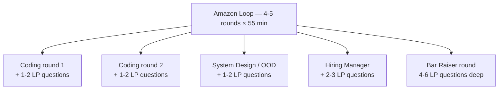

# Company Track: Amazon (Leadership Principles)

Amazon's interview is **the most behavioural-heavy of any FAANGM** — 50-60% of the loop's weight is on the **16 Leadership Principles (LPs)**, every interviewer scores 1-3 LPs, and the **Bar Raiser** runs a dedicated 45-55 min LP round with effective veto power. Bombing one LP in the Bar Raiser is usually fatal, regardless of how strong your technical rounds were. Preparing for Amazon's LP rounds is **half of the prep budget** for an Amazon loop, no exceptions.

## The 16 Leadership Principles (current as of 2024+)

Two were added in July 2021 ([CNBC](https://www.cnbc.com/2021/07/01/amazon-adds-leadership-principles-to-prepare-for-post-jeff-bezos-era.html)) bringing the total to 16 (not 17 — some lists are outdated).

| # | LP | Probe |
|---|---|---|
| 1 | **Customer Obsession** | Decisions driven by user impact, not internal politics |
| 2 | **Ownership** | Acting like an owner; "it's not my job" is the anti-pattern |
| 3 | **Invent and Simplify** | New solutions; simplifying existing systems |
| 4 | **Are Right, A Lot** | Sound judgment under uncertainty; calibrated confidence |
| 5 | **Learn and Be Curious** | Continuous growth; new tech / domains learned |
| 6 | **Hire and Develop the Best** | Mentoring; raising the bar in hiring |
| 7 | **Insist on the Highest Standards** | Refusing to accept "good enough" |
| 8 | **Think Big** | Vision beyond immediate scope; multi-year bets |
| 9 | **Bias for Action** | Shipping despite incomplete data |
| 10 | **Frugality** | Doing more with less; cost discipline |
| 11 | **Earn Trust** | Honest communication; admitting mistakes |
| 12 | **Dive Deep** | Going beyond dashboards into actual data |
| 13 | **Have Backbone; Disagree and Commit** | Pushing back constructively; committing once decided |
| 14 | **Deliver Results** | Outcomes, not effort |
| 15 | **Strive to be Earth's Best Employer** (added 2021) | Inclusive team building |
| 16 | **Success and Scale Bring Broad Responsibility** (added 2021) | Ethics and social impact |

## How LPs Are Tested In The Loop



Across a 5-round loop: **~10-15 LP stories asked total**. Interviewers triangulate — telling the same story to multiple LPs raises a flag in debrief.

## The Bar Raiser

- An **outside-team senior** (typically L6+) trained in Amazon's Bar Raiser program.
- Has **effective veto power**: if Bar Raiser votes "Inclined Not to Hire" or "Strong No Hire", the loop typically rejects regardless of HM's vote.
- Charter: the candidate must be **"at least as good as 50% of current Amazonians at this level"** ([Carrus.io](https://www.carrus.io/blog/all-about-bar-raisers-amazons-essential-element-to-the-hiring-process)) — i.e., better than the team median.
- Probes deeply, with multiple follow-ups per LP designed to test whether stories hold up under scrutiny.

## The LP Story Bank — Coverage Matrix

You need **at least 2 strong stories per LP** so you can use different stories across the loop without recycling. That's **~32 stories**. In practice most candidates can map one story to 2-3 LPs each, so the actual unique-story count is ~12-15. Use the [12-story bank from T01](./T01-behavioral-interviews-star-car-sbi.md) as the starting point and map each story to LPs.

### Example mapping

| Story | Primary LPs |
|---|---|
| Checkout latency fix (3-week project, p99 4s → 320ms, +1.8% conversion) | Customer Obsession, Deliver Results, Dive Deep, Bias for Action |
| Disagreed with TL on architecture, escalated with data, drove pivot | Have Backbone, Earn Trust, Are Right A Lot |
| Migrated team off legacy framework (6 months, cross-team alignment) | Think Big, Insist on Highest Standards, Ownership |
| Mentored 2 juniors to promotion in 12 months | Hire and Develop the Best, Earn Trust |
| Identified $40k/mo infra waste; cut to $19k/mo | Frugality, Ownership, Deliver Results |
| Shipped to production despite product team's "wait for full data" pushback | Bias for Action, Deliver Results, Are Right A Lot |
| Owned an oncall escalation no-one else wanted; root-caused a year-old bug | Dive Deep, Ownership, Customer Obsession |

## LP-Targeted Question Templates

Interviewers reach for predictable prompt shapes:

- **Ownership**: *"Tell me about a time you went beyond your job description / took on something nobody else would."*
- **Customer Obsession**: *"Tell me about a decision you made driven by customer impact, even when internally controversial."*
- **Dive Deep**: *"Tell me about a time you went into the weeds on a metric others were ignoring."*
- **Bias for Action**: *"Tell me about a time you delivered without complete data — how did you decide?"*
- **Have Backbone**: *"Tell me about disagreeing with your manager / senior peer — what happened?"*
- **Earn Trust**: *"Tell me about a time you admitted you were wrong."*
- **Insist on Highest Standards**: *"Tell me about a time you rejected 'good enough'."*
- **Hire and Develop the Best**: *"Tell me about someone you mentored."*
- **Think Big**: *"Tell me about a long-term initiative you championed."*
- **Frugality**: *"Tell me about cutting cost or doing more with less."*
- **Learn and Be Curious**: *"Tell me about a technology / domain you learned recently outside your job."*
- **Are Right A Lot**: *"Tell me about a tough call you made with incomplete information; how do you know it was the right call?"*
- **Deliver Results**: *"Tell me about a high-stakes deadline / commitment you delivered on."*

## Anti-Patterns Amazon's Own Page Calls Out

[Amazon's own published list](https://www.aboutamazon.com/news/workplace/amazon-jobs-interview-mistakes) of interview mistakes:

1. **Answering hypothetically** ("I would…") instead of with a real past event.
2. **Using "we" instead of "I"** — Amazon needs to score *your* contribution.
3. **No metrics / quantified outcome.**
4. **Rambling > 4 minutes per story.**
5. **Recycling one story across multiple LPs** (signals shallow story inventory).
6. **Overselling beyond actual scope.**
7. **Not asking clarifying questions** before answering.
8. **Failing the two-way street** — no thoughtful questions for the interviewer at the end.

## The Bar Raiser's Probing Pattern

The Bar Raiser will ask **deep follow-ups** on each story:

- *"What was their exact reaction?"*
- *"Who pushed back hardest and why?"*
- *"What were the alternatives you considered?"*
- *"What metrics did you track to know it worked?"*
- *"What would you do differently?"*
- *"Walk me through the decision in more detail."*

**Stories that survive 4-5 probing follow-ups are real**. Stories that collapse on follow-up read as embellished. Practice the follow-ups with a mock partner.

## The Two-Way Street — Questions YOU Ask

Amazon explicitly scores the candidate's **questions at the end of each round**. Pass on questions = negative signal.

Good question themes:

- *"How does the team measure success?"* (Customer Obsession)
- *"What's the on-call burden look like?"* (Ownership)
- *"How does the team approach tech-debt decisions?"* (Insist on Highest Standards)
- *"What's the biggest open architectural question for the team right now?"* (Think Big)

Bad questions: anything Google-able (perks, comp, basic team size, public product).

## Round-Specific LP Weight

| Round | LP weight | What to prep |
|---|---|---|
| Coding | Light (1-2 LPs woven in) | Standard coding prep |
| OOD / System Design | Light to medium | Design prep + LP context |
| Hiring Manager | Heavy | 4-5 stories prepped, mapped to multiple LPs |
| Bar Raiser | **Heaviest** | 6-8 stories prepped, all able to survive 4-5 probes |

## The Day-Of Cue Card

Print or save a 1-page cue card:

```text
TODAY'S LP REMINDERS
- Always START with "I" or "the team did X; my contribution was Y"
- STAR: 4 min max per story
- Always END with what you learned / would do differently
- Always have a story ready for: Ownership, Customer Obsession, Bias for Action,
  Dive Deep, Earn Trust (Bar Raiser favourites)
- Always ask 2 thoughtful questions at end of each round
```

## Deeper Dive — Worked STAR Stories Mapped To Each LP

One concrete sample STAR per LP — use as templates, substitute your own specifics. Each is ~3-4 min in delivery.

### 1. Customer Obsession

**Prompt**: *"Tell me about a decision you made driven by customer impact, even when internally controversial."*

> **Situation**: At PaymentsCo, we had a 4-week sprint to ship a new fraud-detection ML model. The model boosted fraud catch-rate by 11% but increased false-positive rate by 0.8%. PM wanted to ship; engineering instinct was "the metric improvement justifies it."
>
> **Task**: As tech lead on the integration team, I had to make the ship/don't-ship call.
>
> **Action**: I pulled support-ticket data: that 0.8% false-positive rate would translate to ~4,000 legitimate users having transactions blocked per day. Reading 50 sampled tickets, I saw real customer pain — wedding bookings declined, parent's medication purchases blocked. I called a meeting with PM + ML team + support lead and presented the data. Proposed alternative: ship the model in *shadow mode* for 2 weeks (model decides, but humans approve blocks), use that period to tune the threshold. PM initially pushed back on the 2-week delay; I held the line citing customer impact. Got buy-in from VP based on the shadow-mode data.
>
> **Result**: 2-week shadow showed we could lift fraud catch by 9% while keeping false-positives at 0.2% — better than the original tradeoff. Shipped the tuned version. Estimated 15,000 wrongly-blocked customers/month avoided. Got direct emails from 3 customer-support agents thanking us.

### 2. Ownership

**Prompt**: *"Tell me about a time you took ownership of something beyond your job description."*

> See [the on-call settlement-reconciliation story in C04/T01 Story 1](./T01-behavioral-interviews-star-car-sbi.md) — 14-month chronic incident no-one fixed; I rooted it out + fixed it because I was paged once too many. Quantified: 3-per-week alert → 0, ~6 hours/week of on-call toil saved across team.

### 3. Invent and Simplify

**Prompt**: *"Tell me about a time you simplified an existing system."*

> **Situation**: Our team owned a 200-line YAML config per service for deployment specs (env vars, scaling rules, secrets, alerts). Adding a new service required copy-pasting + manually editing ~30 fields, error-prone, frequently broken.
>
> **Task**: I noticed engineers spending hours on this. No-one had asked me to fix it.
>
> **Action**: Designed a config-generator: declarative top-level intent ("medium-traffic stateless service") expands to the verbose YAML. Built it as a 600-line Python tool with templates for our 5 common service archetypes. Wrote docs + ran 2 brown-bag sessions. Adopted by 3 teams in 2 months.
>
> **Result**: New-service config setup: 4 hours → 12 min. Config-driven incidents: ~3/quarter → 0 in 6 months. Tool is now part of standard onboarding for new engineers.

### 4. Are Right, A Lot

**Prompt**: *"Tell me about a judgment call you made with incomplete information."*

> **Situation**: Q3, midway through Black Friday prep. Our load-test showed payments service holding 8k RPS but crashed at 9k. Black Friday forecast was 7.5k. Two paths: (a) ship as-is + monitor, or (b) defer scaling work to harden against 10k.
>
> **Task**: Lead engineer on the call.
>
> **Action**: I dug into the load-test failure: not a fundamental limit but a HikariCP-pool-exhaustion at high concurrency due to a single slow query. Two-hour fix. I asked the team to (a) make that fix, (b) re-run load test, (c) ship if it now held 12k. Did the work over the weekend. New ceiling: 14k RPS sustained.
>
> **Result**: Black Friday peak was 11.4k — higher than forecast. We held with margin. No incidents. The judgment was "fix the specific bottleneck instead of speculatively scaling everything."

### 5. Learn and Be Curious

**Prompt**: *"Tell me about a technology you learned recently outside your job."*

> **Situation**: I noticed our team relied entirely on bash + Python for tooling — slow + error-prone. I'd heard about Rust + its single-binary deployment + memory safety.
>
> **Task**: Self-investment, no work mandate.
>
> **Action**: Spent 6 weekends going through *The Rust Book*, then built a small CLI tool (Kafka-topic-stats inspector) in Rust as a project. Replaced a 200-line Python equivalent. Shared on team Slack; 2 engineers expressed interest. Ran a lunch-and-learn.
>
> **Result**: 2 engineers now use Rust for internal tooling. I picked it up enough to be a credible reviewer if someone proposes Rust for a service. Investment: ~30 hours. Return: broader options + the team's tooling stack diversified.

### 6. Hire and Develop the Best

**Prompt**: *"Tell me about how you've grown someone on your team."*

> See [the Priya mentoring story in C04/T01 Story 4](./T01-behavioral-interviews-star-car-sbi.md) — 14-month journey from SDE-1 to SDE-2 with structured mentoring + pairing + cross-team work + design-review practice. Promoted 6 months ahead of average tenure.

### 7. Insist on the Highest Standards

**Prompt**: *"Tell me about a time you rejected 'good enough'."*

> **Situation**: Our team's PR review culture had drifted to "looks-fine LGTM" reviews. Bug-escape rate had crept up over 2 quarters; my own bugs were getting through.
>
> **Task**: As senior on the team, I felt responsible to address it.
>
> **Action**: At team retro, raised it directly without naming names. Proposed 5 specific changes: (1) PR template with "what does this break?" question; (2) required reviewer must run the tests locally for PRs in critical-path code; (3) staff-engineer review required for changes touching the payments path; (4) bug-escape postmortems become a team ritual (15 min monthly); (5) explicit "approval is your name on the bug" framing. Got team buy-in via vote.
>
> **Result**: Bug-escape rate dropped 50% over the following quarter. PR review time went up ~15 min on average — accepted cost. Pattern adopted by 2 sibling teams.

### 8. Think Big

**Prompt**: *"Tell me about a long-term initiative you championed."*

> **Situation**: 18 months ago I started seeing that our org was approaching the JVM cliff — Java 8 EOL, fragmented frameworks across 80+ services, no consistent observability. No single team owned "platform health."
>
> **Task**: No assigned scope. I decided to drive it.
>
> **Action**: Wrote a 12-page "Platform 2.0" RFC — vision of unified Spring Boot 3 + Java 17 + OpenTelemetry + standardised deploy pipeline. Got reviewed by 4 senior engineers + 2 directors. Got 1.5 FTE allocated for 12 months. Ran a working group across 5 teams. Migrated 80+ services over 14 months in waves.
>
> **Result**: Platform unified by end of plan period. P99 latency platform-wide -18%; deploy time -60%; on-call toil -30%. Estimated $2.1M annualised cost savings.

### 9. Bias for Action

**Prompt**: *"Tell me about a time you shipped despite incomplete data."*

> See [the fraud-model story under Customer Obsession above](#1-customer-obsession) — but framed differently. The shadow-mode approach was the "Bias for Action" decision: ship the model to gather real data instead of further deliberating in conference rooms.

### 10. Frugality

**Prompt**: *"Tell me about cutting cost or doing more with less."*

> **Situation**: Joined the team Q1; saw our cloud bill was $164k/month. Manager mentioned "we should look at it sometime."
>
> **Task**: Self-assigned a cost-audit deep-dive.
>
> **Action**: Spent 2 weeks pulling AWS Cost Explorer data + Datadog metrics per service. Found: (a) 8 underutilised RDS instances (5% avg CPU) — right-sized to smaller class; (b) 23 services on always-on EC2 that could move to spot — moved 18 (kept 5 on-demand for state); (c) S3 lifecycle policy missing on log buckets — archived to Glacier; (d) one runaway test environment never decommissioned. Worked across 4 teams to get approvals.
>
> **Result**: Bill went $164k/mo → $98k/mo (-40%). No latency or reliability regression. Established quarterly cost-review cadence; now run by a rotating engineer.

### 11. Earn Trust

**Prompt**: *"Tell me about a time you admitted you were wrong."*

> **Situation**: Pushed hard for a particular database choice (DynamoDB) for a new service. Got the team to commit. Six weeks in, the access patterns didn't fit DynamoDB's key model — joins we hadn't anticipated.
>
> **Task**: I had to publicly recant.
>
> **Action**: Called a team meeting + slack post: "I pushed for DynamoDB; I was wrong. The access patterns require relational joins I underweighted. Recommend we switch to Postgres before more work is built on this." Took full responsibility. Did the migration design + sized the cost (3 weeks of work loss).
>
> **Result**: Switched to Postgres; service shipped 4 weeks late but on a sound foundation. The team's trust in my judgment — counterintuitively — *increased*. The "I was wrong, here's why, here's the fix" pattern became part of the team's norms.

### 12. Dive Deep

**Prompt**: *"Tell me about a time you went into the weeds on a metric others were ignoring."*

> See [the on-call settlement story in C04/T01 Story 1](./T01-behavioral-interviews-star-car-sbi.md) — root-caused a 14-month chronic alert by going from dashboard metrics → connection-pool instrumentation → 2PC timing analysis.

### 13. Have Backbone; Disagree and Commit

**Prompt**: *"Tell me about disagreeing with your manager or senior peer."*

> See [the disagreement story in C04/T01 Story 2](./T01-behavioral-interviews-star-car-sbi.md) — pushed back on TL's "shared DB" microservices plan; proposed compromise (payments-only first with saga). Got the better outcome through structured disagreement.

### 14. Deliver Results

**Prompt**: *"Tell me about delivering on a high-stakes deadline."*

> See [the Black Friday checkout-latency story in C04/T01 Story 1](./T01-behavioral-interviews-star-car-sbi.md) — 3-week sprint to cut p99 from 4s to 320ms. Delivered; conversion +1.8%.

### 15. Strive to be Earth's Best Employer (added July 2021)

**Prompt**: *"Tell me about how you've made your team a better place to work."*

> **Situation**: Joining our team in Q1, I noticed our oncall rotation had 4 engineers; ~30% of nights/weekends had pages. Burnout was visible in retros.
>
> **Action**: Quietly analysed page volume by source — 70% came from 3 services with known reliability gaps. Made the case to the manager: spend the next 2 sprints on reliability work for those 3 services, projected to cut paging 60%. Got the green light. Led the work — added retries, circuit breakers, graceful degradation. Also organised a 1-week "stop the bleeding" rotation where only the on-call engineer was on the relevant fixes (no other distractions).
>
> **Result**: Pages dropped from ~12/week to ~3/week. Two engineers told me in 1:1s they were now less anxious about being on-call. Retention on the team improved (no attrition that year vs 1 the prior year — small sample but real).

### 16. Success and Scale Bring Broad Responsibility (added July 2021)

**Prompt**: *"Tell me about a time you considered the broader impact of a technical decision."*

> **Situation**: Our team's recommendation algorithm was being tested with a new model that increased engagement by 8% but increased filter-bubble metrics (recommended content became more similar over time).
>
> **Task**: I was one of the engineers reviewing the proposal.
>
> **Action**: Raised the filter-bubble concern in design review. Suggested we test with an "exploration" parameter that injects 5% random / diverse content. PM was open. Ran A/B with 3 variants (control, model, model+exploration). Engagement was similar across model variants; filter-bubble metric was 40% lower with exploration. Shipped the exploration variant.
>
> **Result**: Engagement gain captured (~7.5%); user diversity maintained. Pattern adopted in the team's recommendation roadmap going forward. Demonstrated to product partners that engineering can credibly raise non-engagement-metric concerns.

## Deeper Dive — Real Amazon Interview Questions From Recent Loops

Compiled from public sources (Glassdoor, LeetCode Discuss, IGotAnOffer, Blind). **Recent, India + US, SDE-II and SDE-III**. Use to identify whether your STAR bank covers the spread:

### Coding round (LP weaving allowed)

- "Top K Frequent Elements" — explain the heap approach + complexity.
- "Number of Islands" — DFS + variations (max area, distinct shapes).
- "LRU Cache" — design + implement.
- "Word Ladder" — BFS on implicit graph.
- "Meeting Rooms II" — heap-based.
- "Merge K Sorted Lists" — heap of list heads.

### LP-targeted questions reported

- "Tell me about a time you missed a deadline." (Deliver Results + Earn Trust)
- "Tell me about a customer who pushed back on your recommendation." (Customer Obsession)
- "Tell me about a time you mentored someone struggling on your team." (Hire and Develop)
- "Tell me about a hard architectural decision you made." (Are Right A Lot + Have Backbone)
- "Tell me about a time you took on something nobody else would." (Ownership)
- "Tell me about a time you reduced cost without sacrificing quality." (Frugality)
- "Tell me about a project that didn't go as planned." (Earn Trust + Learn and Be Curious)
- "Tell me about pushing back on your manager." (Have Backbone)
- "Tell me about a customer pain you fixed proactively." (Customer Obsession + Ownership)
- "Tell me about a recent technology you learned." (Learn and Be Curious)
- "Tell me about delivering with incomplete data." (Bias for Action + Are Right A Lot)
- "Tell me about a high-stakes deadline you delivered on." (Deliver Results)
- "Tell me about a time you went beyond what was asked." (Ownership + Insist on Highest Standards)
- "Tell me about getting alignment across teams that resisted." (Earn Trust + Have Backbone + Think Big)
- "What's something you wish you had done differently in your last project?" (any LP — Earn Trust framing)

### System design (Amazon-flavoured) prompts

- Design URL shortener (focus on durability + ops).
- Design distributed cache (LRU at cluster scale).
- Design notification system (fanout to 100M devices).
- Design CDN.
- Design ride-share matching.
- Design Amazon's recommend-similar-items.
- Design a real-time inventory system.

### Bar-Raiser-typical follow-up probes

Whatever story you tell, expect these 4-5 follow-ups:

1. "What were the metrics — specifically?"
2. "Who pushed back, and what was their exact concern?"
3. "What's one thing you'd do differently?"
4. "How did you know your fix worked?"
5. "Walk me through the decision in more detail."

Rehearse these answers for every story in your bank.

## Sources & Further Reading

- [amazon.jobs — Leadership Principles](https://www.amazon.jobs/content/our-workplace/leadership-principles)
- [amazon.jobs — Interview mistakes](https://www.aboutamazon.com/news/workplace/amazon-jobs-interview-mistakes)
- [amazon.jobs — SDE-II Interview Prep](https://amazon.jobs/content/en/how-we-hire/sde-ii-interview-prep)
- [amazon.jobs — SDE-III Interview Prep](https://amazon.jobs/content/en/how-we-hire/sde-iii-interview-prep)
- [Carrus.io — Bar Raiser](https://www.carrus.io/blog/all-about-bar-raisers-amazons-essential-element-to-the-hiring-process)
- [Apex Interviewer — 16 LPs with STAR Examples](https://www.apexinterviewer.com/resources/amazon-leadership-principles)

## Practice

1. **Map your 12-story bank to all 16 LPs.** Identify gaps — LPs you can't cover.
2. **For each gap LP, build one fresh story.** Aim for 2 stories per LP.
3. **Drill the Bar Raiser probes** — have a partner ask the 5-6 standard follow-ups on each story.
4. **Self-record a 4-min STAR.** Listen back; count "we" vs "I"; count metrics.
5. **Prep 2-3 thoughtful questions** for each round type (Coding, Design, HM, Bar Raiser).
6. **Run a mock 45-min LP round** (5-6 stories). Self-score the rubric.

## Recap

You should now be able to:

- Recall the **16 LPs** and their probe themes.
- Map your **12-story bank to all 16 LPs** with at least 2 strong stories per LP.
- Handle the **Bar Raiser's probing follow-ups** without your stories collapsing.
- Avoid the **8 Amazon-published anti-patterns**.
- Prep **thoughtful questions** for each round type.
- Manage **round-specific LP weight** (light in coding, heavy in HM + Bar Raiser).

## Next

Continue to [Company Track: Google](./T04-company-track-google.md).
