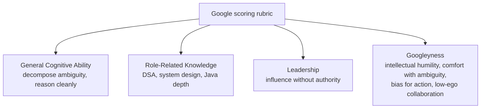
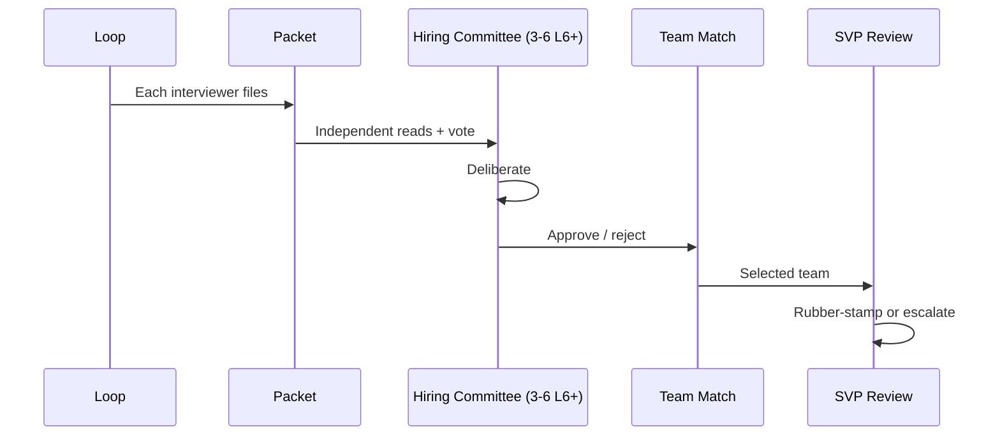

# Company Track: Google

Google's interview is **the most calibrated** of any FAANGM — driven by the Hiring Committee (HC) instead of in-room decisions, with the **four signals** explicitly scored: General Cognitive Ability (GCA), Role-Related Knowledge (RRK), Leadership, and Googleyness. Coding rounds dominate; Java is fully supported but no team writes it as their primary language at scale.

## Pipeline + Levels

Pipeline ([T02](../C01-foundations-of-interviewing/T02-the-interview-funnel-recruiter-screen-loop-debrief-offer.md)): Recruiter → Phone screen (Google Doc, no execution) → Virtual onsite 4-6 rounds → Hiring Committee → Team match → SVP review.

Levels ([T01](../C01-foundations-of-interviewing/T01-how-tech-interviews-and-leveling-work-mnc-vs-faangm.md)): L3 (new grad) → L4 (SWE III) → **L5 Senior (terminal)** → L6 Staff → L7 Senior Staff → L8 Principal.

## The Four Signals

**Critical 2024+ shift**: Googleyness is now scored on **behaviours observed during the loop**, not on what candidates *claim* about themselves. Accepting hints constructively, admitting uncertainty, asking for input when stuck — all move the needle ([dglearning — 2026 Loop](https://dglearning.substack.com/p/inside-the-google-2026-loop-rounds)).

## What Distinguishes Google Coding Rounds

- **45 min in Google Docs** (or whiteboard for in-person rounds returning in 2025+).
- **No autocomplete, no execution.** You trace by hand.
- **1-2 problems per round.**
- **Strong emphasis on edge cases, complexity articulation, clean code under time pressure.**

Question favourites (per Steve Yegge's 2008 essay still echoed today): **graphs** (BFS/DFS/Dijkstra/topo), **trees**, **DP**, **strings + arrays**, **OOP modelling** at L4+. Java-specific things Google interviewers value: **Effective Java idioms**, **immutability + thread safety**, **concurrency primitives** including `CompletableFuture`, **Guava fluency** (`ImmutableList`, `Multimap`, `Preconditions`).

## System Design at Google

- **L5+**: 1 round.
- **L6+**: typically **2 rounds**; one is often the deciding factor.
- **L4**: usually no, sometimes yes for backend/infra — **ask the recruiter**.

Prompts: YouTube subset, Google Maps shortest-path, GFS-style file system, Bigtable, web crawler + indexer, Google Docs real-time collab, Google Photos storage. **Google's design lens**: **planet-scale, multi-region, billions of users, petabytes default**. Anti-pattern: relying on AWS service names. Google's design culture is **build-from-primitives** ([DesignGurus](https://www.designgurus.io/blog/google-system-design-interview-questions-ultimate-guide)).

## The Hiring Committee

Vote scale: **Strong Hire / Hire / Leaning Hire / Leaning No-Hire / No-Hire / Strong No-Hire**. Variance is risk — a **consistent 4-of-5 packet beats inconsistent 5-of-5 + 3-of-5**. A coding Strong Hire + leadership Leaning No-Hire = no-hire.

## Behavioural / Googleyness Round

Single ~45 min round (sometimes folded with RRK at senior levels).

Sample prompts:

- *"Tell me about a time you disagreed with a tech lead."*
- *"Describe a project that failed and what you learned."*
- *"How do you align peers without authority?"* (L5+)
- *"Walk through a multi-team architectural decision you drove."* (L6+)

What scores well: **specificity**, **measurable outcomes**, **engineering judgment over narrative polish**. Narrative polish actually scores slightly worse — Googlers prize concrete data over rhetoric.

## Team Match — The Painful Stage

HC approval is **not an offer**. Without a team that picks you, no offer. 2024-25 saw team-match stretch to **2-8+ weeks** due to constrained headcount. Niche specialisation + narrow location preference + holding out for AI/Search teams = slower match.

## 2024-2026 Changes

- **2025 return to in-person interviews** announced by Sundar Pichai to counter AI-assisted virtual cheating ([Business Standard](https://www.business-standard.com/companies/news/google-ai-cheating-job-interviews-in-person-hiring-shift-sundar-pichai-125082600492_1.html)).
- **AI-assisted coding pilot 2026** with **Gemini** as the candidate's assistant, for junior/mid US roles, rolling out H2 2026 ([Exponent](https://www.tryexponent.com/blog/google-ai-coding-interview)).
- **Hiring bar tightened** post-layoffs; HC variance tolerance dropped.
- **Googleyness rubric tightened** to behaviour-observed during the loop.

## Java-Specific Signals At Google

- **Effective Java idioms**: composition over inheritance; favour immutability; static factory methods; equals/hashCode/toString discipline.
- **Concurrency**: `synchronized` vs `ReentrantLock`; `ConcurrentHashMap`; `ExecutorService`; `CompletableFuture`; `java.util.concurrent.atomic`.
- **Guava (Google's own)**: `ImmutableList`/`ImmutableMap`, `Multimap`, `Preconditions`, `RateLimiter`, `Cache`. Knowing why `ImmutableList` differs from `Collections.unmodifiableList()` is a classic probe.
- **Streams** are acceptable but defended on complexity and correctness.

## Prep Strategy For Google

1. **DSA grind** — Google's coding bar is one of the highest. NeetCode 150 minimum; LeetCode Google-tagged set.
2. **System design at L5+** — 2-3 worked designs at planet-scale.
3. **Googleyness stories** focused on humility + collaboration, not heroics.
4. **Effective Java** — re-read Bloch's book.
5. **HC packet awareness** — produce consistent evidence in every round.

## Deeper Dive — Real Recent Google Interview Questions

Compiled from Glassdoor + LeetCode Discuss + IGotAnOffer + Onsites.fyi (2024-2026 reports for L3-L6 US + India).

### L4 (SWE III) coding rounds

- "Implement an iterator that flattens a 2D vector" — most common L4 first-round.
- "Number of Islands" + "Max Area of Island" + "Surrounded Regions" — grid DFS family.
- "Word Ladder" (BFS on word graph).
- "Insert Delete GetRandom O(1)" — designs come up at L4.
- "Encode and Decode Strings" — implementation question.
- "Top K Frequent Elements".
- "Trapping Rain Water".
- "Course Schedule II" (topological sort).
- "Kth Smallest Element in a BST".
- "Find Median from Data Stream" (two-heap).

### L5 (Senior SWE) coding + design

**Coding** (still 3 of 5 rounds at L5):

- "Design In-Memory File System" — class design + traversal.
- "Alien Dictionary" (topological sort).
- "Word Search II" (trie + DFS).
- "Reconstruct Itinerary" (Eulerian path).
- "Sliding Window Maximum" (monotonic deque).
- "Random Pick With Weight" — implementation + math.
- "Find All Anagrams in a String" (sliding window).
- "Longest Substring with K Distinct Characters".

**System design**:

- "Design Google Calendar" (event scheduling + cross-timezone + reminders).
- "Design YouTube subset" (upload, transcoding, CDN, view counts).
- "Design Google Drive subset" (storage, sync, sharing, permissions).
- "Design a typeahead service" (Google Suggest).
- "Design a distributed web crawler".
- "Design an ad-bidding system".

### L6 (Staff) — two design rounds

**Round 1** (Product/Architecture):

- "Design Google Maps" — routing algorithm + tile serving + traffic data.
- "Design Google Photos" — upload, dedup, ML face/object index, sharing.
- "Design a real-time collaborative doc editor" (Google Docs).
- "Design a distributed file system" (GFS-style).

**Round 2** (Infra/Low-level):

- "Design Bigtable" — wide-column storage + sharding + replication.
- "Design Spanner" — globally-distributed transactions + TrueTime.
- "Design a planet-scale rate-limiter".
- "Design a sharded primary-replica DB with automatic failover".

### Googleyness & Leadership

- "Tell me about a time you disagreed with a tech lead."
- "Tell me about a project that failed — what would you do differently?"
- "Tell me about aligning multiple teams without authority." (L5+)
- "Tell me about admitting you were wrong publicly."
- "Tell me about helping a teammate who was struggling."
- "Tell me about a technology you learned in the last 6 months."
- "How do you approach a problem with no clear definition?"
- "Tell me about driving a multi-team architectural decision." (L6+)
- "What's your perspective on [ethics question about scale + responsibility]?" (L6+)
- "Tell me about an asymmetric bet you made + how it turned out."

### Recent 2026 changes (per [tryexponent](https://www.tryexponent.com/blog/google-ai-coding-interview))

- **AI-assisted coding round** for some L3-L4 US loops. Format: 60-min code review + extend an AI-generated solution. You evaluate AI output + improve it.
- **More in-person interviews** for L6+ (post-AI-cheating concerns; Pichai announced 2025).
- **Hiring committee variance**: more scrutiny on "leaning hire" packets; needs unanimous strong+ signals for borderline candidates.

## Sources & Further Reading

- [levels.fyi — Google SWE Interview Process](https://www.levels.fyi/blog/google-software-engineer-interview-process.html)
- [Hello Interview — Google L6 Guide](https://www.hellointerview.com/guides/google/l6)
- [IGotAnOffer — Google SWE Interview](https://igotanoffer.com/blogs/tech/google-software-engineer-interview)
- [Pragmatic — Inside the Google 2026 Loop](https://dglearning.substack.com/p/inside-the-google-2026-loop-rounds)
- [DesignGurus — Google System Design](https://www.designgurus.io/blog/google-system-design-interview-questions-ultimate-guide)
- [Effective Java — Joshua Bloch](https://www.oreilly.com/library/view/effective-java-3rd/9780134686097/)

## Practice

1. **Read 3 of the sources above** for your target level (L4 / L5 / L6).
2. **Build 5 Googleyness stories** specifically themed on humility, hint-taking, collaboration.
3. **Run 1 mock system design** at planet-scale (Google Maps, YouTube, GFS).
4. **Drill Effective Java idioms** — write code samples; defend the idiom choice.
5. **Read Guava docs** — focus on ImmutableList, Multimap, Preconditions, Cache.
6. **Practice consistent packet evidence**: every coding round, state complexity unprompted; every design round, articulate trade-offs.

## Recap

You should now be able to:

- Distinguish Google's **four signals** (GCA, RRK, Leadership, Googleyness) and what each scores.
- Navigate the **Google Doc coding round** without execution / autocomplete.
- Apply **Effective Java + Guava** idioms during Google rounds.
- Design at **planet-scale** with **build-from-primitives** culture.
- Survive the **Hiring Committee** by optimising for consistency, not peaks.
- Manage **team-match patience** — HC approval ≠ offer.
- Prep for the **2026 AI-assisted coding pilot** if your loop is in scope.

## Next

Continue to [Company Track: Meta](./T05-company-track-meta.md).
