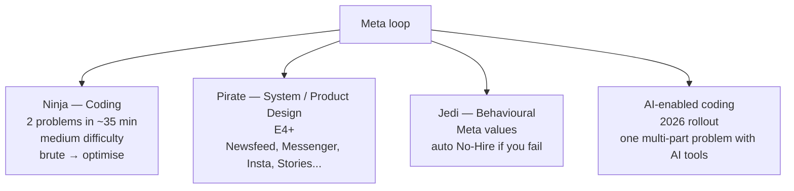

# Company Track: Meta

Meta's interview is **speed-first** — the signature "Ninja" coding round packs **two LeetCode-medium problems into 45 minutes** (effectively ~35 minutes coding time + 5 each for intro/Q&A). System design (the "Pirate" round) and behavioural (the "Jedi" round) decide the level. **Behavioural failure is an auto No-Hire** regardless of how strong the rest of the loop. Meta is also **up-or-out at E3-E4** with a documented promotion clock.

## Pipeline + Levels

Pipeline: Recruiter → CodeSignal OA (added 2025) → CoderPad phone screen (Ninja) → Onsite loop 4-6 rounds → Team match (now pre-offer since 2023).

Levels: **E3** (SWE I) → **E4** (SWE II) → **E5 Senior (terminal)** → **E6 Staff** → **E7 Senior Staff**.

Up-or-out: E3→E4 expected in ~24 months; E4→E5 in another ~33 months. Red zone at 20/27 months means you must perform at the next level to even get "Meets All" rating ([Taro](https://www.jointaro.com/question/X3ccTVVCpuS1T76HI5fX/)).

## The Three Round Types

## The Ninja Coding Round

**Format**: 45 min in CoderPad; **execution disabled** on the phone screen. Two problems in ~35 min of coding time. The interviewer reserves 5 min for intro + 5 for Q&A.

**Distinctive Meta rules**:

- **Speed first** — pack 2-3× more questions per round than other FAANGs.
- **Brute-force-then-optimise** — explicitly expected. State O(n²) first, code it if asked, then optimise.
- **Bugs are tolerated** — Meta is the only company whose published guideline says *"sometimes, in certain rounds, bugs are okay"* (empty input / null edge cases) so long as the core algorithm is correct ([interviewing.io](https://interviewing.io/guides/hiring-process/meta-facebook)).
- **DP is banned** as a coding-round topic — Meta thinks it doesn't fit the 35-min speed format.
- **Code execution disabled** on phone screen — mental verification only.

**Meta-favoured problem patterns** (from LeetCode Meta-tagged set, 563+ problems):

- BFS/DFS on graphs and grids (Number of Islands, Clone Graph, Word Ladder)
- Trees (Binary Tree Vertical Order, Diameter, BST validation, LCA)
- Sliding window (Longest Substring Without Repeating, Min Window Substring)
- Hash-based optimisation (Two Sum, Group Anagrams)
- K-th element / heap (Top K Frequent, Merge K Sorted)
- Intervals (Merge Intervals, Meeting Rooms II)
- Stack / string parsing (Valid Parens, Decode String)
- LRU/LFU cache (use `LinkedHashMap` in Java)

## The Pirate System Design Round

E4+. 45 min in Excalidraw. Two flavours candidates can request:

- **Product Architecture**: Newsfeed, Messenger, Instagram, Stories, Notifications, Type-ahead, Live Streaming, Ads ranking.
- **System Design** (infra-flavoured): rate limiter, distributed cache, ad click aggregator. At E6+, becomes **low-level**: "Design Redis", "Design Kafka", "Design Memcached".

**Depth bar** — Meta interviewers reward knowing Meta's actual stack:

- **TAO** — Meta's read-optimised social-graph store; 2-layer (cache + MySQL), one full copy per region, intra-region <1ms reads, >99% read traffic, "favours efficiency over consistency" ([Micah Lerner](https://www.micahlerner.com/2021/10/13/tao-facebooks-distributed-data-store-for-the-social-graph.html)).
- **MyRocks** — LSM-tree on RocksDB plugged into MySQL; replaced InnoDB for social graph, cut storage ~50%.
- **Fanout-on-write vs fanout-on-read** — News Feed canonical trade-off; expect celebrity (hot-key) discussion.

**Rubric**: requirements (10-15%), high-level architecture (20-25%), deep-dives on 2-3 components without being asked, failure modes with named tech ("Cassandra over Dynamo because writes are append-heavy"), last 10-15 min for caching/consistency/hot keys.

**E6+ specific**: must **pass both** design rounds (low-level + product-architecture); E5 can carry one weak design round if other signals are strong.

## The Jedi Behavioural Round

Meta's **five public values** (refreshed; older guides cite "Build Social Value" and "Be Open" too):

1. **Move Fast** — bias to action.
2. **Build Awesome Things / Be Bold** — calculated risks.
3. **Focus on Long-Term Impact** — outcomes > activity.
4. **Live in the Future** — anticipate where the product is going.
5. **Meta Mates / Be Direct & Respect Your Colleagues** — feedback, conflict, openness.

**Five competencies scored at E5+**: Resolving Conflicts, Driving Results, Embracing Ambiguity, Growing Continuously, Communicating Effectively.

**Common question themes**:

- Project you're most proud of (E5+: must span >1 quarter, quantified impact)
- Time you handled pressure / conflict / a difficult person
- Time you worked on something outside your OKRs
- Time the project was ambiguous
- Time you disagreed with a senior person
- Failure / mistake

**Critical**: behavioural fail = **auto No-Hire regardless of the rest**. No mulligan on Jedi. ([interviewing.io](https://interviewing.io/guides/hiring-process/meta-facebook))

**Behavioural is also a leveling lever** — your behavioural performance alone can decide E4 vs E5 down-leveling ([Hello Interview E5](https://www.hellointerview.com/guides/meta/e5)).

## The 2025-2026 AI-Enabled Coding Round

- Rolled out Q4 2025; **all SWE roles in 2026**.
- 60 minutes in specialised CoderPad with file tree, terminal, unit-test runner, AI assistant dropdown.
- AI defaults to **Llama 4**; switchable to GPT-4o mini, Claude Haiku 3.5, Claude Sonnet 4, Gemini 2.5 Pro mid-interview.
- **One thematic multi-part problem** (read existing code → add feature → handle edge cases → discuss scaling).
- **E6 and below**: one AI-assisted round PLUS one standard coding round.
- **E7+ / M1**: only ONE coding round, and it IS the AI-assisted one.
- **Failure mode interviewers flag**: *"Candidates who struggle are the ones who just accept whatever the AI suggests without reading it. You're basically doing continuous code review."* ([Hello Interview](https://www.hellointerview.com/blog/meta-ai-enabled-coding))

## Java At Meta

Java is **fully accepted** in coding rounds alongside Python, C++, C#, JS/TS, Kotlin. Meta uses Hack/PHP/C++ internally but doesn't require you to interview in those.

**Java idioms that win**:

- **`ArrayDeque`** for stack/queue (not legacy `Stack`).
- **`LinkedHashMap` for LRU cache** with `accessOrder=true` + `removeEldestEntry`.
- **`PriorityQueue`** for top-K / k-th element.
- **`TreeMap` / `TreeSet`** with `floorKey`/`ceilingKey` for "k closest" / "interval overlap".
- **Streams** for one-liners (don't lean on them; interviewers want to see your loop logic).

**Java gotchas Meta interviewers love** (especially in the AI-enabled round):

- equals/hashCode contract violation
- HashMap collision (Java 8+ treeify at threshold 8)
- Fail-fast vs fail-safe iterators
- `ConcurrentModificationException` in single-threaded code
- Integer cache trap (-128..127)
- Comparator overflow (`a - b` for `Integer.MIN_VALUE`)
- String concatenation in loops

## Team Matching — Now Pre-Offer (2023+)

Mechanics:

- Happens **before** offer (not after).
- Meet **multiple hiring managers** — sometimes 10+.
- **Mutual opt-in** — both sides must agree.
- Typical 2-6 weeks; max ~60 days.
- 2025: Meta sometimes routes candidates directly to **Monetization org**, skipping the open-team-match dance.

## 2024-2026 Changes

- **"Year of Efficiency"** permanent. Cumulative layoffs: 11K (2022), 10K (2023), additional cuts 2024-25.
- **Hiring bar raised**; behavioural failures auto-reject; E6+ requires passing both design rounds.
- **CodeSignal OA** added as pre-phone-screen filter in 2025.
- **AI-enabled coding round** rolling out to all SWE in 2026.
- **Hybrid 3 days/week** in office in Meta-office metros.

## Deeper Dive — Real Recent Meta Interview Questions

Compiled from Hello Interview + interviewing.io + Hack MNC + Blind reports (2024-2026, E4-E6).

### Ninja (Coding) — 2 problems in 35 min

Meta-tagged LeetCode favourites (frequency-ranked):

1. **Two Sum** (warmup; almost universal).
2. **Number of Islands** (DFS / BFS on grid).
3. **Binary Tree Vertical Order Traversal** (BFS with column index).
4. **Diameter of Binary Tree** (recursive height pattern).
5. **Lowest Common Ancestor of a Binary Tree** (recursive).
6. **Validate BST** (bound-propagation).
7. **Top K Frequent Elements** (heap or bucket sort).
8. **Merge Intervals** (sort + merge).
9. **Merge K Sorted Lists** (min-heap of heads).
10. **Longest Substring Without Repeating Characters** (sliding window).
11. **Minimum Window Substring** (variable window + freq map).
12. **Valid Palindrome II** (allow one deletion).
13. **Add Binary** (two pointer string).
14. **Decode Ways** (1D DP).
15. **Read N Characters Given Read4 II** (stateful Meta-favourite).
16. **Clone Graph** (BFS / DFS with hashmap).
17. **Random Pick with Weight** (binary search on prefix sums).
18. **Subarray Sum Equals K** (prefix sum + hashmap).
19. **Kth Largest Element in an Array** (quickselect or heap).
20. **Buildings With An Ocean View** (monotonic stack reverse).

### Pirate (System Design) — E4+

**Product architecture** prompts:

- "Design Facebook News Feed" — fanout-on-write vs read; celebrity handling.
- "Design Instagram" — feed + photo storage + tags.
- "Design WhatsApp" — 1:1 messaging at scale (deep on Cassandra-equivalent + Kafka).
- "Design Messenger group chat".
- "Design Instagram Stories" (24-hour ephemeral).
- "Design Live Streaming" (Facebook Live).
- "Design Type-ahead Search" (Facebook search bar).
- "Design Newsfeed Ranking" (relevance model + serving).

**System design** (E6+ low-level):

- "Design Redis" (in-memory KV with persistence).
- "Design Kafka" (durable log + replication + partitioning).
- "Design Memcached" (consistent-hashing distributed cache).
- "Design Distributed Counter" (CRDT or sharded counter).

### Jedi (Behavioural) — Meta values

Probed across 1-2 rounds + woven into coding/design:

- "Tell me about a project you're most proud of." (Move Fast + Focus on Impact)
- "Tell me about a time you handled pressure or conflict." (Build Awesome Things + Meta Mates)
- "Tell me about working on something outside your OKRs." (Move Fast)
- "Tell me about a time the project was ambiguous." (Embracing Ambiguity)
- "Tell me about disagreeing with a senior person." (Be Open)
- "Tell me about a failure or mistake." (Growing Continuously)
- "Tell me about leading a project without direct authority." (E5+)
- "Tell me about driving a multi-quarter initiative." (E5+ scope)
- "Tell me about influencing across orgs." (E6+ scope)
- "Tell me about scaling impact through others." (E6+)
- "Tell me about a project that span >1 quarter where you saw it through." (E5 scope minimum)

**Critical**: behavioural failure at Meta = **auto No-Hire**. There is no recovery; rehearse stories aloud + record yourself.

### Leadership Assessment (E6+ only) — separate from Jedi

E6+ candidates get a dedicated round with a director:

- "Walk me through how you decided where to invest 12 months of team capacity."
- "Tell me about a hire you regretted — what signals did you miss?"
- "How do you measure your team's success beyond OKRs?"
- "Tell me about a strategic pivot you led."
- "Describe how you mentor mid-level engineers vs new staff hires differently."

### AI-enabled coding round (rolling out 2026)

Per [Hello Interview](https://www.hellointerview.com/blog/meta-ai-enabled-coding):

- 60-minute multi-part problem with AI assistant available (Llama 4 default; switchable).
- Format: read existing code → add feature → handle edge cases → discuss scaling.
- Common failure: **blindly accepting AI suggestions without code review**.
- Practice: do continuous PR-review of AI output, push back when wrong.

## Sources & Further Reading

- [interviewing.io — Meta Hiring Process](https://interviewing.io/guides/hiring-process/meta-facebook)
- [Exponent — Meta SWE Guide](https://www.tryexponent.com/guides/facebook-meta-swe-interview)
- [Hello Interview — Meta E5 / E6](https://www.hellointerview.com/guides/meta/e5)
- [Hello Interview — AI-enabled coding](https://www.hellointerview.com/blog/meta-ai-enabled-coding)
- [Coditioning — Meta AI-enabled coding guide](https://www.coditioning.com/blog/13/meta-ai-enabled-coding-interview-guide)
- [Pragmatic Engineer — Meta levels + manager track](https://x.com/GergelyOrosz/status/1526529038034120704)

## Practice

1. **Drill the 2-in-35 speed format**: pair LeetCode mediums under tight timer.
2. **Read 2 ByteByteGo or Hello Interview design walkthroughs** of Meta-shape products (News Feed, Messenger).
3. **Build 5 Meta-values behavioural stories** mapped to the five values.
4. **For E6+**: prep both Product Architecture AND low-level system design ("Design Redis").
5. **Practice the AI-enabled round** — set up a sandbox with Cursor / Copilot; practice directing it + reading its output critically.
6. **Re-read LinkedHashMap docs** — the LRU cache trick is Meta-favourite.

## Recap

You should now be able to:

- Run a **2-questions-in-35-min** Ninja coding round, brute-then-optimise.
- Apply **Java idioms Meta favours** (`ArrayDeque`, `LinkedHashMap` LRU, `PriorityQueue`, `TreeMap`).
- Navigate the **Pirate design round** with Product Architecture vs System Design distinction.
- Reference **Meta's actual stack** (TAO, MyRocks, fanout-on-write) for depth.
- Deliver **5 Jedi behavioural stories** mapped to Meta values, knowing one fail = auto No-Hire.
- Prepare for the **AI-enabled coding round** — direct AI, read critically, don't blindly accept.
- Navigate **team match pre-offer** with multiple HM calls.

## Next

Continue to [Company Track: Apple](./T06-company-track-apple.md).
