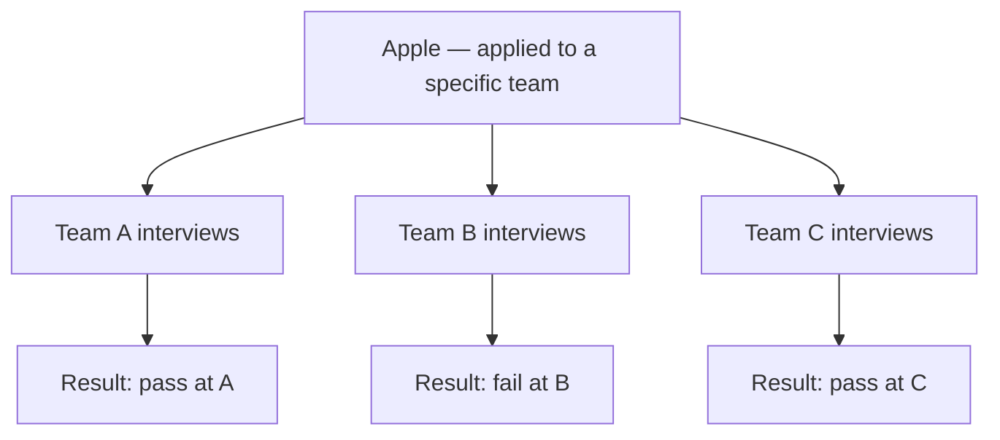

# Company Track: Apple

Apple's interview is **the most team-driven of any FAANGM**. There is no single "Apple interview" — every team designs its own loop, the same candidate can pass at one team and fail at another with identical skills, and **secrecy is structural**: interviewers often can't tell you what the team builds until late in the loop. The "Why Apple?" question carries more weight than at any other company.

## Pipeline + Levels

Pipeline: Recruiter → Hiring Manager screen (technical from minute one) → Phone screen (CoderPad / CodeSignal) → Onsite loop 4-8 rounds (6-8 at senior+) → Live debrief with thumbs vote.

Levels: **ICT2** (entry) → ICT3 (mid) → **ICT4 (senior, terminal for most)** → ICT5 (staff, notoriously hard) → ICT6 (principal).

## The Team-Driven Model

The same candidate, with identical answers, gets different verdicts because each team has its own bar and culture. Candidates routinely interview with multiple teams in parallel.

## What Distinguishes Apple Rounds

- **No single rubric**: each team chooses what to probe.
- **Hiring manager round is HEAVY**: technical from minute one, deep dive on past projects and the *why* behind every decision.
- **"Why Apple?" is gating**: interviewers explicitly look for genuine product passion. *"Just another job"* signals reject.
- **Attention to detail / "make it just work"** narrative threads through every round.
- **Privacy + security mindset** comes up across teams, not just Pay/iCloud.
- **Cross-functional partnership** (with hardware, design, legal) is probed at ICT4+.

## Coding At Apple

DSA-focused, but **team-by-team variation is the rule**. Common patterns:

- Arrays / strings, binary trees, graph traversal, lightweight DP.
- **Concurrency-safe state management** is a recurring theme (consistent with Apple's systems-heavy codebase): race conditions, `volatile`, `synchronized`, `ConcurrentHashMap`, `CompletableFuture`.
- Some teams hand you a laptop and ask you to build something small end-to-end (closer to a take-home in real time).
- Domain deep-dives are common (e.g., Java team will drill JMM happens-before semantics).

**Java/Scala fluency**: Apple runs significant backend on the JVM (iCloud, Apple Music, iTunes Connect, Maps). At ICT4+ for backend roles, interviewers expect deep JVM knowledge — GC tuning, memory model, async/reactive, large-scale data processing, streaming architecture.

## System Design

Lens varies sharply by team:

- **Apple Pay**: end-to-end encryption, secure enclaves, tokenisation, idempotent transactions, 99.999% uptime, fraud detection.
- **iCloud**: cross-device sync, conflict resolution (CRDTs, operational transforms come up by name at ICT4+), billion-file storage, end-to-end encryption.
- **Apple Music**: CDN/edge caching, adaptive bitrate streaming, global content delivery, media encoding pipelines.
- **iOS / services backend**: APNs (push notifications), high-fan-out delivery, low-latency at hundreds of millions of devices.

**Red thread**: **privacy and security are non-negotiable design constraints**. Any design that ignores encryption-at-rest/in-transit, PII minimisation, threat modelling loses points.

## Behavioural

Often **more important than coding** at Apple. Heavy themes:

- *"Why Apple?"* — genuine product passion required. Reference a specific product, hardware/software detail, or design choice you admire.
- **Attention-to-detail stories** — a time you obsessed over the last 1% of polish.
- **Privacy/security mindset** — a decision where you chose the harder path because of a user-data concern.
- **Cross-functional partnership** especially with hardware, design, or legal.
- **At ICT4+**: Think Big, innovation, mentorship at scale, crisis management, stakeholder management across engineering / legal / product.

## Java-Specific At Apple

- **JVM**: GC tuning (G1, ZGC), heap sizing, off-heap structures, JFR/JMC for production debugging.
- **Concurrency**: JMM, `synchronized` vs `Lock`, `CompletableFuture`, `ForkJoinPool`, reactive (Project Reactor, RxJava).
- **Frameworks**: Spring / Spring Boot widespread for new services; some teams run Akka/Play (Scala), especially in iTunes/Music infra.
- **Data**: Cassandra, Kafka, **FoundationDB** (Apple acquired and uses heavily), Redis.
- **Tooling**: Bazel/Buck in some teams; team-by-team variation again.

## The Quirks

- **Secrecy is structural** ([Apple's logic](https://ophyai.com/blog/company-guides/apple-interview-guide): if 100 candidates know about "Project Titan", that's 100 leak vectors). Interviewers may not be able to tell you what the team builds until late in the loop (or post-offer).
- **NDA-heavy** during the loop, in offer letters, throughout onboarding.
- **Recruiter opacity** — notably less forthcoming about process, team, even compensation bands than other FAANG.
- **Team match is part of every round** — interviewers evaluate fit-with-this-team specifically.

## ICT4 → ICT5 — The Hardest Jump In FAANGM

Many engineers reportedly get **perfect ICT4 reviews for years without moving** to ICT5. The bar shifts from execution to **cross-team influence**, RSU weight rises sharply, and ICT5 promo committee is notoriously selective ([ResumeAdapter](https://www.resumeadapter.com/companies/apple/levels)).

## 2024-2026 Changes

- **No major layoffs** — Apple dodged 2022-23 cuts and the 2024-25 wave; last round was Nov 2025, a few dozen non-engineering.
- **20,000 hires committed over 4 years** (announced early 2025).
- **Hybrid 3 days/week** since late 2022; enforced with documented reprisals against non-compliance.
- **AI in interviews prohibited**; detection in place (typing-pattern analysis, clipboard event monitoring).

## Prep Strategy For Apple

1. **Research the specific team** — read their public engineering posts, products they ship, recent tech-talk slides.
2. **Build a "Why Apple — Why this team" answer** referencing a specific product detail.
3. **Prep 4-5 attention-to-detail stories** with privacy/security woven in.
4. **JVM depth** (GC, JMM, concurrency primitives) — Apple's Java teams probe deep.
5. **System design with privacy-first framing** — every design choice gets the privacy lens.
6. **Be patient with recruiter opacity** — ask focused questions; accept "I can't share that yet" with grace.

## Deeper Dive — Real Recent Apple Interview Questions

Per-team variation is the rule; below are common patterns from interviewing.io + Onsites.fyi + Glassdoor (2024-2026, ICT3-ICT5 US + India).

### Coding (DSA-focused, team-dependent)

- **Threads/concurrency-heavy** (especially Services backends):
  - "Thread-safe LRU cache" — implement + walk through races.
  - "Producer-consumer with bounded buffer" — using `BlockingQueue` and using bare `wait/notify`.
  - "Read-write lock implementation from primitives."
  - "Build a basic ThreadPool from scratch."
- **Standard DSA**:
  - "Merge K Sorted Lists."
  - "Word Break I + II."
  - "Course Schedule."
  - "Number of Islands."
  - "Median of Two Sorted Arrays."
  - "Serialize and Deserialize Binary Tree."

### Java/Scala backend-team-specific deep-dives

- "Walk through GC tuning for a 32GB-heap streaming service. ZGC vs G1?"
- "How would you detect a memory leak in production with minimum overhead?"
- "Difference between `synchronized` and `ReentrantLock`. When use each?"
- "Walk through Java Memory Model happens-before edges."
- "Show me CompletableFuture composition for two parallel async calls + a third dependent."
- "Implement double-checked locking correctly. Why does it need `volatile` post-Java-5?"
- "What's `volatile` semantics? When is it sufficient + when not?"
- "Explain why `synchronized` pins a virtual thread but `ReentrantLock` doesn't."

### System design (team-flavoured)

- **iCloud / sync teams**: "Design Apple Photos sync across 10 devices per user, ensuring eventual consistency + bandwidth efficiency."
- **Apple Pay teams**: "Design end-to-end encrypted payment authorisation including secure-enclave attestation."
- **Apple Music teams**: "Design adaptive bitrate streaming + global CDN."
- **iMessage teams**: "Design federated messaging with end-to-end encryption + multi-device sync."
- **Services backend**: "Design a notification service for 1B+ Apple devices with delivery SLAs."

### Privacy + security questions (recurring)

- "How would you store user data such that a database breach cannot expose PII?"
- "Walk through end-to-end encryption protocols (Signal-style)."
- "Design a key-rotation strategy for per-user data keys."
- "What does threat-modelling look like for [team's product]?"
- "How do you ensure secrets never appear in logs / metrics / error reports?"

### Behavioural (Apple "why us" + craft)

- "**Why Apple specifically** vs other top-tier companies?" (heavily probed)
- "Tell me about a time you obsessed over the last 1% of polish."
- "Tell me about a decision driven by user-data-privacy concerns."
- "Tell me about working with hardware engineers (or other non-software disciplines)."
- "Tell me about disagreeing with a designer or product person."
- "Tell me about something you shipped that you're personally proud of."
- "Tell me about a time you said no to a feature for quality reasons."

### Team-match quirks

Apple loops are **highly team-driven**. The same candidate can pass at one team + fail at another. Tactics:

- **Apply to specific teams** (read the JD carefully — different reqs may be for very different teams).
- **Research the team's tech stack publicly** (engineering blog posts, conference talks).
- **Custom answer for "Why this team" per loop** — generic answers tank.
- **Expect recruiter opacity** (Apple legitimately can't share details about unreleased products).
- **Be flexible across multiple teams in parallel** if first preference doesn't pan out.

## Sources & Further Reading

- [interviewing.io — Apple Hiring Process](https://interviewing.io/guides/hiring-process/apple)
- [Interview Query — Apple SWE](https://www.interviewquery.com/interview-guides/apple-software-engineer)
- [Onsites.fyi — Apple ICT4 2025](https://www.onsites.fyi/blog/article/apple-ict4-software-engineer-interview-questions)
- [ResumeAdapter — Apple ICT Levels](https://www.resumeadapter.com/companies/apple/levels)
- [DesignGurus — Apple System Design](https://www.designgurus.io/answers/detail/apple-system-design-interview-questions)
- [InterviewStack — Apple Senior SWE Preparation](https://www.interviewstack.io/preparation-guide/apple/software_engineer/senior)

## Practice

1. **Research one specific Apple team** (Apple Pay, iCloud, Apple Music, Maps backend). Write a 60-sec "Why this team" pitch.
2. **Build 4 attention-to-detail / privacy stories**.
3. **Drill JVM internals**: GC algorithms, JMM happens-before, concurrent collections.
4. **One system design with privacy-first framing**: design Apple Pay; lead with encryption + tokenisation.
5. **Practice graceful response to recruiter opacity** — *"Understood, happy to learn more later in the loop."*

## Recap

You should now be able to:

- Navigate the **team-driven model** — apply to specific teams, prep per-team.
- Deliver a **specific "Why Apple — Why this team"** answer with product detail.
- Apply **privacy + security framing** to every system design.
- Reference Apple's **JVM stack** (Java/Scala on FoundationDB / Cassandra / Kafka).
- Handle **recruiter opacity** gracefully.
- Recognise the **ICT4 → ICT5 difficulty** if targeting Staff.

## Next

Continue to [Company Track: Netflix](./T07-company-track-netflix.md).
