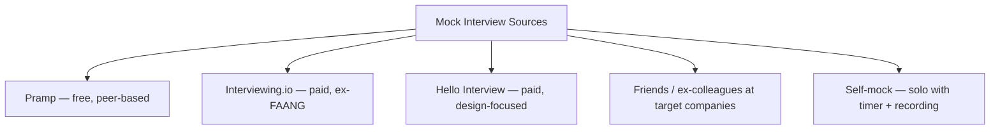
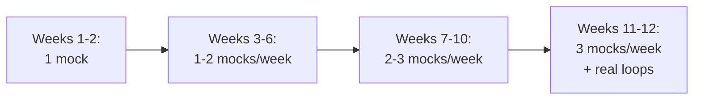

# Mock Interviews & Self-Grading Rubrics

Mock interviews are the **single highest-leverage prep activity by signal-per-hour ratio**. A mock gives you (a) realistic time pressure, (b) the *experience* of articulating under stress, (c) honest external feedback you can't get from solo practice, and (d) a packet to self-score against the rubric. This topic covers **where to source mocks**, **how to score yourself**, and the **full self-grading rubric** for each round type.

## Where To Source Mocks



| Platform | Cost | Strength | Weakness |
|---|---|---|---|
| **Pramp** | Free | Peer-based; always available | Variable quality; not company-specific |
| **Interviewing.io** | $$ | Anonymous mock with ex-FAANG interviewers; close to real bar | Per-mock cost adds up |
| **Hello Interview** | $$ | Design-focused; strong for L5+ system design | Smaller question pool for coding |
| **Friends at target co** | Free | Most realistic; company-specific rubric | Limited availability; bias |
| **Self-mock** | Free | Always available; record + review | No human feedback |

## Mock Cadence Through The Prep Cycle



Mock rotation:

- **Coding mocks**: weekly throughout Phase 2-4.
- **Design mocks**: starting Phase 3, weekly.
- **Behavioural mocks**: starting Phase 3, biweekly.
- **Full loops** (4-5 mocks in a day): 1-2 times in final two weeks. Simulates real exhaustion.

## The Self-Scoring Packet

After every mock, write a packet on yourself using the structure from [T03 Rubric](../C01-foundations-of-interviewing/T03-the-interviewer-s-rubric-signals-scoring-calibration.md).

```text
ROUND TYPE:     [Coding / Design / Behavioural / LLD]
DURATION:       [actual time taken]
PROBLEM:        [name + topic]
OUTCOME:        [Strong Hire / Inclined / Not Inclined / Strong No-Hire]

EVIDENCE — CLARIFY:
  • Asked X clarifying questions before coding
  • Examples covered: happy path + Y edge cases
  • Stated Z assumptions

EVIDENCE — APPROACH:
  • Stated brute force first (Y/N)
  • Time complexity stated (Y/N)
  • Optimisation articulated (Y/N)
  • Trade-off compared (Y/N)

EVIDENCE — CODE:
  • Compiling Java (Y/N)
  • Idiomatic collections used (Y/N)
  • Variable naming clear (Y/N)
  • Mid-code bugs (count)

EVIDENCE — EDGE CASES:
  • Enumerated X edge cases unprompted
  • Missed: [list]

COMMUNICATION:
  • Silent gaps > 30 sec (count)
  • Mumbling instances (count)
  • Took hint constructively (Y/N)
  • Asked thoughtful Q at end (Y/N)

VERDICT: [packet outcome]
LEVELING: [strong at L4 / L5 / L6]
ONE THING TO FIX BEFORE NEXT MOCK: [single specific behaviour]
```

The "one thing to fix" line is the most important — drill that one thing for a week before the next mock.

## The Full Rubric — Coding Round

| Signal | Strong evidence | Weak evidence |
|---|---|---|
| **Problem comprehension** | Restated problem; asked 3-5 clarifying Qs; covered edge cases in examples | Jumped to code; missed misreading |
| **Algorithmic reasoning** | Stated brute force + complexity; articulated optimisation; defended trade-off | Picked one approach without comparison |
| **Code quality** | Compiling Java; idiomatic collections; clean naming; method-extracted | Single 80-line method; cryptic vars; non-compiling |
| **Edge cases** | Enumerated 4-5 unprompted (empty, single, overflow, unicode, max-size) | Only handled cases interviewer named |
| **Complexity statement** | Stated final O at end unprompted; explained dominant term | Skipped; gave wrong answer; only stated when asked |
| **Debugging** | Spotted off-by-one in dry-run unprompted; took hint with attribution | Silent panic; refused hint; bluffed past bug |
| **Testing** | Walked through 2-3 examples covering happy + edge | Skipped; only the example interviewer gave |
| **Communication** | Narrated continuously; no silent gap > 30 sec | Long silent stretches; mumbled |
| **Java idioms** | `ArrayDeque`, `Map.merge`, `PriorityQueue`, `Comparator.comparingInt` | Legacy `Stack`; `Integer.valueOf` traps; manual increment patterns |

## The Full Rubric — System Design Round

| Signal | Strong evidence | Weak evidence |
|---|---|---|
| **Requirements clarity** | Separated functional / non-functional; named numbers | Vague "build TikTok" without scope |
| **Capacity estimation** | Back-of-envelope unprompted (storage, RPS, bandwidth) | Skipped; or stated numbers without backing math |
| **Architecture clarity** | Clear boxes; each component's role named | Sketches that aren't justified |
| **Data model** | Defined schema with key + indexes; chose storage with reason | Skipped; named "DB" without specifying |
| **Scaling depth** | Sharding key + replication + caching, hot-key mitigation | Mentioned "add servers" without specifics |
| **Failure modes** | Named what breaks per component; designed graceful degradation | Skipped failure analysis |
| **Trade-off articulation** | Compared 2-3 approaches; said "I'd pick X because Y, flip if Z" | Single approach without alternatives |
| **Operational depth** (L5+) | Discussed oncall, blast radius, deploy strategy, monitoring | Skipped operations |

## The Full Rubric — Behavioural Round

| Signal | Strong evidence | Weak evidence |
|---|---|---|
| **STAR completeness** | All four blocks (S/T/A/R) present; balanced | Over-spent on S; missing R or T |
| **Specificity** | Named real project, dates, teammates, metrics | Vague "we improved performance significantly" |
| **'I' vs 'we'** | Mostly 'I' with attribution to team where appropriate | Mostly 'we' with no individual contribution |
| **Quantified outcome** | Concrete number (latency %, $ saved, RPS, MAU) | No numbers; only qualitative impact |
| **Self-awareness** | Named what you'd do differently | "It went perfectly" |
| **Story breadth** | Different story for each prompt; 12-story bank | Recycled one story across 3 prompts |
| **Story length** | STAR ≤ 4 min; CAR ≤ 90 sec | Rambled > 5 min |
| **Conflict handling** | Showed disagreement skill without aggression | Blamed others; or avoided showing disagreement |

## The Full Rubric — LLD / OOD Round

| Signal | Strong evidence | Weak evidence |
|---|---|---|
| **Clarification** | 5-7 questions; bounded scope | Designed immediately |
| **Class boundaries** | Entity / service / strategy separation | God class |
| **SOLID** | Named SRP/OCP/DIP explicitly; applied them | Hardcoded if-else for variation |
| **Patterns** | Used Strategy / Factory / Observer / State by name | Re-implemented patterns without naming |
| **Concurrency** | Identified shared state; chose lock granularity | Ignored concurrency or over-locked |
| **Extensibility** | Absorbed new requirement cleanly | If-else hacking on extension |
| **Code quality** (Machine Coding) | Compiles, runs, demo works | Build break; no driver |

## Self-Mock Process

When no human partner is available:

1. **Pick a problem from a fresh source** (LeetCode random, ByteByteGo design).
2. **Set a strict timer**: 45 min coding; 45 min design; 5 min behavioural per story.
3. **Record yourself** — phone voice memo + screen recording for coding rounds.
4. **Solve out loud** — same narration as a real mock.
5. **After**: write the self-packet using the rubric above.
6. **Listen back** to the recording with the rubric beside you — count silent gaps, mumbling, missed signal opportunities.

## Tracking Mock Performance Over Time

Build a spreadsheet:

| Date | Mock Type | Source | Problem | Outcome | One-Thing-To-Fix | Trend |
|---|---|---|---|---|---|---|

After 8-10 mocks, patterns emerge:

- *"I consistently skip complexity at the end."*
- *"I silent-think during the approach phase."*
- *"I recycle the same behavioural story."*

These patterns are your **systematic gaps** — drill them deliberately.

## Mock Anti-Patterns

- **Doing too few mocks** (most candidates do 3-4 before the loop; should be 12-20).
- **Doing the same problem twice in mocks** — wastes the mock; you already know the solution.
- **Not recording** — can't audit yourself reliably.
- **Skipping the post-mock self-scoring** — half the value lost.
- **Picking only easy problems** — comfort grade.
- **Picking only hard problems** — anxiety grade.
- **Mocking without a watch** — speed is a signal; never untimed.

## When To Stop Mocking

You're ready for the real loop when:

- Your self-packet outcomes are consistently "Hire" or "Strong Hire" on coding mocks.
- Your design mocks cover the 7-step framework reliably in 45 min.
- Your behavioural stories are 4-min STAR; you've covered all 12 themes.
- Your communication mechanics (silent gaps, narration, hint-taking) are habitual.
- You're more energised than anxious about the actual loop.

If any of these fail consistently in mocks, fix them before the real loop — that's exactly what mocks are for.

## Sources & Further Reading

- [Pramp](https://www.pramp.com/)
- [Interviewing.io](https://interviewing.io/)
- [Hello Interview](https://www.hellointerview.com/)
- [LeetCode mock interviews](https://leetcode.com/interview/)

## Practice

1. **Schedule 1 mock this week**. Pramp is free.
2. **Build your self-scoring template** in a note app. Use the rubrics above.
3. **Record your next 5 mocks** (audio at minimum).
4. **Track your one-thing-to-fix** across 5 mocks. Identify the pattern.
5. **Run one full-loop mock day** (4-5 mocks in 1 day) in week 11 of your prep cycle.

## Recap

You should now be able to:

- Source mocks from the **5 platforms** (Pramp, Interviewing.io, Hello Interview, friends, self-mock).
- Run the **mock cadence** matching your 12-week prep phase.
- Self-score every mock using the **packet template** + **round-specific rubric**.
- Identify your **systematic gaps** and drill them between mocks.
- Recognise the **mock anti-patterns** (too few, same problem twice, no recording, no scoring).
- Know **when you're ready** for the real loop.

## Next

Continue to [C05 Resume — Writing Impactful Bullet Points (XYZ Formula, Metrics)](../C05-resume-profile-and-career/T02-writing-impactful-bullet-points-xyz-formula-metrics.md).
