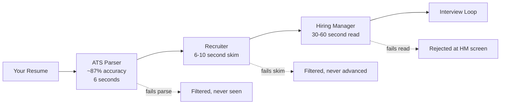
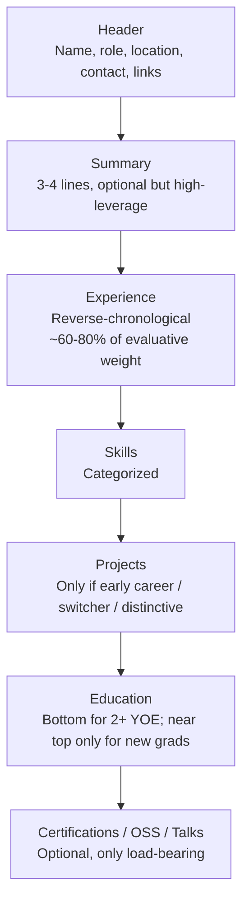
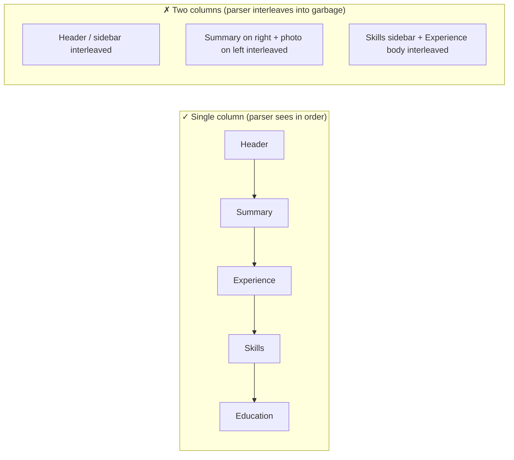

# Resume Fundamentals — Structure, Length, ATS-Friendly Format

Your resume is the single highest-leverage document of your career. It is read, on average, for **6 to 10 seconds** by a human recruiter (Ladders eye-tracking studies, repeated in every modern resume guide), and *before* that human ever sees it, it passes through a machine parser that gets at best **~87% field-level accuracy** even on clean documents ([Resume Optimizer Pro — How Resume Parsers Actually Work](https://resumeoptimizerpro.com/blog/how-resume-parsers-actually-work)). A well-designed resume is two documents at once — a machine-parseable structured record, *and* a 6-second persuasion artifact for a human skim. A poorly-designed resume fails one or both, and most candidates' resumes fail both because they never decided which audience they were optimizing for.

This topic is the **foundation** of the Resume, Profile & Career chapter. It covers the four load-bearing decisions every Java backend engineer's resume must get right: **structure** (section order and length), **format** (the technical layout that survives ATS parsing), **content scaffolding** (what goes in the header, summary, experience, skills, education), and **the non-negotiables** (no photo, no DOB, no multi-column for ATS-driven roles, no fluff verbs). Later topics in this chapter drill into [bullet-point craft and the XYZ formula](./T02-writing-impactful-bullet-points-xyz-formula-metrics.md), [per-company tailoring](./T03-tailoring-resume-per-company-and-role.md), [LinkedIn alignment](./T04-linkedin-profile-and-recruiter-seo.md), [GitHub portfolio](./T05-github-profile-projects-and-portfolio.md), [cover letters](./T06-cover-letters-and-cold-outreach.md), [referrals](./T07-referrals-sourcing-and-asking.md), [pipeline tracking](./T08-job-search-pipeline-and-application-tracking.md), [offer negotiation](./T09-offer-evaluation-and-salary-negotiation.md), and [first-90-days impact](./T10-first-90-days-onboarding-and-demonstrating-impact.md).

> [!IMPORTANT]
> A resume is the *gateway* to the loop you spent months preparing for. Spending 1 weekend perfecting your resume can multiply your interview rate 5-10× by changing nothing about your underlying experience — only how it's presented. There is no other career artifact with that leverage ratio.

## The Two Audiences — And Why You Optimize for the Machine First

Every resume passes through two readers in this order:



The mistake most candidates make is optimizing for the human reader (pretty layout, multi-column design, Canva templates with icons) without realizing the **machine reader rejects them before the human ever sees the document.** A beautifully designed Canva resume that hits ATS columns and parses garbage scores 0% no matter how good the human-readable content is.

The hierarchy is strict: **make it parseable first, then make it persuasive.**

## The Page-Length Rule (The Only One That Matters)

| Experience | Page count | Reasoning |
|------------|-----------|-----------|
| **0–7 YOE** | **1 page** | Recruiter expects a one-pager; longer reads as fluff |
| **8+ YOE OR Staff/Principal target** | **1–2 pages max** | Two pages allowed *only* if there's load-bearing content to fill page 2 |
| **Academia / research / publications-heavy** | **Curriculum vitae (CV), multi-page** | Different format; not covered here |

The page-length panic is overblown. The actual rule: **one page until you genuinely cannot fit your strongest material on it.** A fluffed two-pager is worse than a tight one-pager. ([Gergely Orosz — The Tech Resume Inside Out](https://thetechresume.com/)).

### What "load-bearing content" looks like for page 2

- Multiple senior roles at recognized companies, each with quantified impact
- Significant OSS maintainership or technical talks
- A second deeply-relevant project (only at senior+)
- Real publications

What is **not** load-bearing content for page 2: stretched bullets to fill space, every npm package you've touched, every meetup talk you ever gave, decade-old internships.

> [!WARNING]
> **The "I have 4 years of experience and a 3-page resume" anti-pattern is universal and universally penalized.** Recruiters read it as "doesn't understand what's important." Cut to the load-bearing 60-70% of content. Less is more.

## Section Order for a Java Backend SWE

Reverse-chronological is the only safe default for FAANGM and ATS-driven shops. Functional and combination formats trip both human readers and parsers ([DesignGurus — Best Resume Formats for FAANG 2025](https://www.designgurus.io/blog/best-resume-formats-for-faang-and-top-tech-companies-2025)).



The exact ordering for the most common case (2+ YOE Java backend, targeting FAANGM or Indian product unicorn):

1. **Header** — Name + role title + city/country + phone + email + LinkedIn + GitHub
2. **Summary** — 3-4 line outcome-focused paragraph (optional but recommended; objectives are obsolete)
3. **Experience** — Each role: company, title, dates (Month YYYY – Month YYYY), 4-6 bullets per role
4. **Skills** — Categorized (Languages / Frameworks / Datastores / Cloud / DevOps / Concepts)
5. **Projects** — Skip entirely at 5+ YOE unless project is genuinely distinctive
6. **Education** — Degree + university + year (drop GPA at 5+ YOE)
7. **Optional**: Certifications, Open Source, Talks, Publications

## Header — Five Required Fields, One Killer Detail

```text
PRIYA SHARMA
Senior Java Backend Engineer
Bengaluru, India · +91 98XXX XXXXX · priya.sharma@gmail.com
linkedin.com/in/priyasharma · github.com/priyasharma
```

Required:

1. **Full name** — first line, largest font.
2. **Role title** — match the role you're applying for (within reason). "Senior Java Backend Engineer" if you're a senior Java BE; "Java Backend Engineer" if mid; "Backend Engineer (Java)" if you're broadening.
3. **City + country** — *not* street address. Recruiters need to know your time zone and visa context.
4. **Professional email** — `firstnamelastname@gmail.com` or your own domain. **Never** `xXxJavaWizardxXx@…`.
5. **Phone with country code** — +91 for India, +1 for US.

Two essentially-required:

6. **LinkedIn** with **custom URL** — `/in/priyasharma`, not `/in/priya-sharma-9b7a4c2e1`. The custom URL signals attention to detail.
7. **GitHub** — *only* if your repos look good. An empty or abandoned GitHub *hurts* your application; better to omit. ([T05 GitHub Portfolio](./T05-github-profile-projects-and-portfolio.md) covers what "good" looks like.)

Optional:

- Personal site / blog (if it's good)
- X/Twitter handle (only if it's professional and technical)
- Pronouns (if you'd discuss them at work)
- Work authorization for US / EU roles ("US Citizen", "GC", "H1B / requires sponsorship", "EU work permit")

### NEVER include — for US, EU, UK, Canada, Australia, and increasingly even India

- **Photo** — discriminatory in the listed markets; even in India, modern ATS-driven Indian portals don't require it.
- **DOB / age** — discriminatory.
- **Marital status** — irrelevant and discriminatory.
- **Religion / nationality / caste** — never relevant.
- **Hobbies** — unless genuinely distinctive (a hobby that connects to a story you'll tell, or an outlier-grade hobby like marathon running, competitive chess Master, etc.).
- **References** — "Available on request" is wasted space. They'll be requested if needed.
- **Full street address** — privacy risk; recruiters need only city.

> [!NOTE]
> **India context (2025-2026).** The legacy MNC (TCS, Infosys, Wipro, HCL, Cognizant) culture historically expected photo, DOB, marital status, even father's name. Modern Indian product (Flipkart, Razorpay, PhonePe, Cred, etc.) and Indian GCCs of FAANGM no longer expect or want these. Default to the modern format; if a specific application portal *form* requires DOB or marital status, fill them in the form, not on the resume. ([ResumeVera — Infosys/Wipro/HCL 2026 Format Guide](https://resumevera.com/blogs/infosys-wipro-hcl-resume-format-2026))

## Summary — The 6-Second Pitch

A 3–4 line summary at the top of the resume is high-leverage real estate. It is the *one* paragraph that determines whether the recruiter reads the rest of the document with attention or skims past it. Most candidates either skip it (missed opportunity) or fill it with fluff ("results-driven, passionate Java engineer with a track record of success").

### The structure that lands

`[Years + tier] [Java backend engineer] specializing in [2–3 specific things]. Shipped [biggest measurable result]. Currently doing [present scope]. Looking for [next scope].`

### Example summary lines

**Strong (mid-level senior):**

> Backend engineer with 6 years building JVM systems on Spring Boot 3 / Java 21. Shipped a payments service handling 8k RPS at p99 of 78ms; led migration off monolithic Hibernate stack to event-driven Kafka pipeline that cut infra spend 31%.

**Strong (early-career mid):**

> Java engineer with 3 years at a fintech startup, owning the payment-reconciliation service end-to-end (Spring Boot 3, PostgreSQL, Kafka). Cut nightly batch job from 4hr to 12min via parallel-stream + DB-indexing redesign. Looking to grow into ownership of multi-service architectures.

**Strong (Staff target):**

> Staff backend engineer, 11 years on JVM. Led re-platforming of $40M ARR e-commerce stack from monolith to 14 services on Spring Cloud + Kafka, reducing p99 checkout latency 62% and on-call paging frequency 78%. Now seeking Staff-scope work across multiple teams.

### Anti-patterns (what to never write)

- *Results-driven, passionate Java engineer with a track record of success* — fluff, says nothing, recruiter glazes over.
- *Seeking a challenging role where I can grow my skills* — this is an objective, not a summary, and it's about you, not about value.
- *Java | Spring | Microservices | AWS | Kubernetes | Docker | CI/CD | Agile | Scrum* — keyword soup with no narrative.
- 7+ lines of paragraph — recruiter skips it.

### When to skip the summary

If you're a new grad / entry-level (no shipped impact to lead with), skip the summary and let your education + projects carry the top of the resume.

## Experience — 60-80% of Evaluative Weight

The Experience section is where the resume is actually evaluated. Structure of each role:

```text
COMPANY NAME · City, Country
Job Title · Month YYYY – Month YYYY (or "– Present")

• [Bullet 1: biggest impact with metric]
• [Bullet 2: technical achievement with metric]
• [Bullet 3: ownership / leadership story with metric]
• [Bullet 4: cross-functional / system-design contribution]
• [Bullet 5 (optional): notable additional impact]
```

### Bullets per role

- **4–6 bullets** for most-recent role (the role recruiters scan hardest).
- **3–4 bullets** for the second role.
- **2–3 bullets** for older roles (and only the most impactful ones).
- **1 bullet or omit entirely** for roles >7 years old or unrelated (early-career stuff like internships, support roles).

### Date format

- **Always**: `Month YYYY – Month YYYY` (e.g., "Jan 2022 – Mar 2026") or "– Present" for current role.
- **Never**: ambiguous "2022 – 2026" (interviewers and ATS both parse YYYY-only weirdly), "01/22 – 03/26" (international ambiguity), or no dates at all.

Workday's parser is famously strict on date formats — `Month YYYY – Month YYYY` is the safest ([ATSHiring — Workday Guide 2025](https://www.atshiring.com/en/learn/workday-ats-guide-2025)).

### Detailed bullet-craft is covered in [T02](./T02-writing-impactful-bullet-points-xyz-formula-metrics.md)

This topic establishes the structure; T02 drills the XYZ formula, metric selection, and action-verb taxonomy. The one rule to remember here: **every bullet must lead with an action verb and end with measurable impact (or estimated impact, honestly tagged).**

## Skills — Categorized, Not a Wall of Tokens

A wall of 60 comma-separated technologies is unparseable for humans and dilutes signal. Categorize. For a Java backend engineer:

```text
Languages       Java 21 (primary), Java 17, Kotlin, SQL, Python (scripting), Bash
Frameworks      Spring Boot 3, Spring Cloud, Spring Security, Spring Data JPA, Hibernate 6, gRPC, JAX-RS
Datastores      PostgreSQL, MySQL, MongoDB, Redis, Elasticsearch, Cassandra
Messaging       Apache Kafka, RabbitMQ, AWS SQS/SNS
Cloud / DevOps  AWS (EC2, ECS, EKS, S3, RDS, Lambda, CloudWatch), Docker, Kubernetes, Terraform, Helm, GitHub Actions
Observability   Prometheus, Grafana, OpenTelemetry, ELK, Datadog
Testing         JUnit 5, Mockito, Testcontainers, REST Assured, Pact, JMeter, Gatling
Concepts        Microservices, Event-Driven Architecture, DDD, CQRS, Saga, OAuth2/OIDC, Distributed Systems
```

### Java-specific must-haves for 2025-2026

- **Java 17 LTS** (still the most common production version) and **Java 21 LTS** (rapidly adopted) — list both.
- **Spring Boot 3.x** (Jakarta EE namespace migration matters here — Boot 2 → 3 is a significant migration story).
- **Virtual threads** (Project Loom) — list **only if you've actually used them in production**, not just experimented.
- **Reactive (Project Reactor / WebFlux)** — list only if you've shipped on it.
- **Native compilation (GraalVM)** — list if relevant.

### Anti-patterns (kill on sight)

- **10-bar / star-rating proficiency graphs** — ATS sees nothing; humans don't trust your self-rating ([resume101 — mreza0100](https://github.com/mreza0100/resume101)).
- **Soft skills in the technical skills list** — "Communication", "Teamwork" belong in the summary, not the skills section.
- **MS Word, MS Excel, MS Outlook** — insulting at SWE level.
- **Every npm/Maven package you've touched** — dilutes the senior signal.
- **"Familiar with"** — if you have to qualify it, don't list it.

## Education — Concise, Bottom of Page

For 2+ YOE candidates:

```text
EDUCATION
B.Tech, Computer Science · IIT Madras · 2018
```

### Rules

- **List GPA** only if you graduated within the last 3-5 years *and* GPA is ≥ 3.5/4.0 (or ≥ 8.0/10 in India).
- **Drop GPA at 5+ YOE** — nobody cares; it consumes line space.
- **Drop graduation year at 15+ YOE** to mitigate age-discrimination signaling in markets where it exists (US, parts of EU). In India, graduation year is conventionally always listed.
- **Coursework** — list only if early-career (within ~2 YOE) and directly relevant ("Operating Systems, Distributed Systems, Compilers, Computer Networks").
- **Bootcamps + online courses** — go in a separate Certifications section, not Education.

## Optional Sections — Only When Load-Bearing

### Certifications

List only if currently valid and relevant:

- AWS Solutions Architect Associate / Professional, AWS DevOps
- Google Cloud Professional Cloud Architect
- Azure: AZ-204, AZ-305
- Kubernetes: CKA, CKAD
- Oracle Certified Professional, Java SE
- Spring Professional Certification

Drop certifications older than 5 years or for technologies you no longer use.

### Open Source / Talks / Publications

Worth listing only when **load-bearing**:

- Merged non-trivial PRs into major OSS projects (Spring, Kafka, Quarkus, OpenJDK, Apache Camel). Link the PR by number.
- Maintaining a library with measurable adoption (>100 GitHub stars, >1k npm/Maven downloads).
- Spoke at a recognized conference (Devoxx, SpringOne, KubeCon, JavaOne, regional Java User Group). List title + venue + year.
- Wrote a technical blog post that got real distribution (HN front page, Medium piece >10k reads).

What **not** to list: Stack Overflow rep, generic "open source enthusiast" claims, every meetup you ever attended.

## Format — The Technical Layout That Survives ATS

This is the section that decides whether your resume *exists* in the recruiter's system. Get it wrong and the parser silently drops fields or interleaves columns into garbage text.

### The five parsers you actually face

| Parser | Used by | Failure modes |
|--------|---------|---------------|
| **Workday** | Most Big Tech (Google, Salesforce, FedEx, Citi, etc.) | Strict date formats; merges bullets; **drops contact info in header/footer**; sensitive to multi-column ([ATSHiring](https://www.atshiring.com/en/learn/workday-ats-guide-2025)) |
| **Greenhouse** | Many startups + scale-ups (Airbnb, Stripe, Coinbase, etc.) | Most complete skill extraction; sensitive to non-standard section labels ("Career Highlights" vs "Experience") |
| **Lever** | Many startups | Forgiving on contacts; **aggressively drops sidebar content** — multi-column kills it |
| **Ashby** | Modern startups (Notion, Linear, etc.) | More forgiving than Workday/Taleo but still single-column-safe |
| **iCIMS** | Many large enterprises | Strictest validator; flags uncertain fields for manual review; drops education entries ([Resume Optimizer Pro](https://resumeoptimizerpro.com/blog/how-resume-parsers-actually-work)) |
| **Taleo (legacy)** | Older Indian MNCs (HCL) | Strictest of all; expects exact section labels and MM/YYYY; silently deletes content |

### The single-column rule



Single-column. Single-column. **Single-column.** Workday and Taleo "fail hard" on multi-column; Lever silently drops the sidebar; iCIMS scrambles the order. Single-column PDFs achieve ~94% parse fidelity vs ~71% for two-column designs ([ATSHiring](https://www.atshiring.com/en/learn/workday-ats-guide-2025)).

### Format checklist

| Element | Do | Don't |
|---------|----|-------|
| **Layout** | Single column | Multi-column, sidebars, photo blocks |
| **File format** | DOCX if portal accepts both; PDF only when required | Image-based PDF (Canva exports without selectable text) |
| **File size** | < 2 MB | > 2 MB (some parsers truncate) |
| **Fonts** | Calibri, Arial, Helvetica, Georgia, Times New Roman | Decorative fonts (script, display, custom) — render as "gibberish" |
| **Font sizes** | 10-12pt body, 14-18pt headings | < 9pt (unreadable for humans) or > 14pt body (wastes space) |
| **Margins** | 0.5–1.0 inch | < 0.5" (cramped, looks desperate) |
| **Contact info** | In the body of the page | In page header/footer (Workday often skips) |
| **Tables** | Avoid entirely | Skill-grids or experience-tables (parsers garble cells) |
| **Icons** | Avoid | Phone/email/LinkedIn icons (parsers see pixels) |
| **Proficiency bars** | Avoid | Star ratings, percentage bars (zero parser value) |
| **Section labels** | Standard ("Experience", "Skills", "Education") | Creative ("My Story", "Career Highlights" — Greenhouse and Taleo trip on these) |
| **Date format** | "Month YYYY – Month YYYY" | "MM/YY", "YYYY only", "Present" without dash |
| **Hyperlinks** | Plain text URLs (most parsers strip clickable links) | Embedded clickable text without the URL also written |

### Tools — what to use

| Tool | ATS-safe | Recommendation |
|------|---------|----------------|
| **LaTeX (Jake's Resume, Awesome-CV)** | Yes (single-column variant) | **Recommended** for engineers comfortable with LaTeX |
| **Google Docs (default templates)** | Yes (single-column) | **Most pragmatic** — export to PDF or DOCX |
| **Microsoft Word** | Yes (single-column) | Same as Docs |
| **Overleaf** | Yes (LaTeX-based) | Same as LaTeX |
| **Notion → PDF** | Risky | Often produces text-as-images; **avoid** for online apps |
| **Canva** | **No** | Multi-column + icons + text-in-image; kills ATS. **Avoid** ([CVGenius](https://cvgenius.com/cv-templates/latex-cv-template)) |
| **Pre-made "designer" templates** | **No** | Almost universally multi-column. **Avoid** |

> [!TIP]
> **Verify your parse.** Run your final resume through a real ATS preview (Jobscan, Resume Worded, or Greenhouse's "preview parsed text" feature) before submitting. Most candidates have never seen what their resume looks like *after* the parser eats it.

## The ATS Keyword Question — Myth and Truth

The internet is full of "ATS-beating" advice: hide white-text keywords in invisible margins, stuff "Java Java Java Kafka Kafka Kafka" in a footer, mirror the exact phrasing of the job description 50 times.

The reality:

- **Modern parsers (2025-2026) detect keyword stuffing** and penalize it ([InterviewPal — Keyword Stuffing 2026](https://www.interviewpal.com/blog/what-is-keyword-stuffing-in-a-resume-and-why-you-should-be-more-tactical-in-2026)).
- **White-text tricks are detected** by every major parser.
- **What actually works**: use each relevant keyword 2-3 times in natural context — once in the summary, once in a bullet, once in the skills section ([AskCruit — Trick ATS Myth](https://www.askcruit.com/resume/ats/trick-ats-myth)).
- **Mirror the JD's vocabulary**, not its exact phrasing. If the JD says "Kafka pipelines", your resume can have "event-driven Kafka pipeline" — naturally placed in a bullet.

**The hard truth from Gergely Orosz**: *"Real people look at resumes, not robots"* — the parse is just the gate. Optimize for the gate, then optimize for the human.

## Tailoring per Company — Format Stays, Emphasis Shifts

All FAANGM and top MNCs prefer the same *format*: single-column, reverse-chronological, quantified bullets. What changes is **emphasis** — covered in depth in [T03](./T03-tailoring-resume-per-company-and-role.md). A preview:

- **Amazon** — Lead with Ownership, Customer Obsession, Deliver Results stories. Map bullets to the 16 [Leadership Principles](../C04-behavioral-and-company-tracks/T03-company-track-amazon-leadership-principles.md).
- **Google** — Technical depth, scale, distributed systems, "petabyte-scale", "millions of users".
- **Meta** — Impact, speed, A/B test wins, "shipped to billions", developer velocity.
- **Apple** — Craft, polish, shipped products (not internal tools), performance, privacy.
- **Netflix** — Judgment, autonomy, senior-grade independent decisions, business outcomes.
- **Microsoft** — Combination: technical depth + ownership + growth-mindset framing.
- **Indian MNCs (TCS / Infosys / Wipro / HCL)** — Stack match is everything. List Java versions, Spring Boot, Hibernate, JPA, REST, microservices, the specific frameworks on the JD.
- **Indian unicorns (Flipkart, Razorpay, PhonePe)** — Scope + ownership + scale ("services handling X RPS", "team of N").
- **Banking / finance tech** — Java depth + low-latency + correctness + the specific banking domain (FICC / Equities / Risk / Payments).

## What Makes Indian Resumes Different (Briefly)

Indian-market resumes have a few unique constraints that don't apply globally:

- **Notice period** matters. List your current notice period (typically 30 / 60 / 90 days) in the summary or near the contact info — it materially affects which roles you're considered for.
- **Indian product unicorns and Indian-FAANGM offices now mirror the global format.** They do *not* want photo / DOB / marital status. Default to the modern format.
- **Legacy MNCs (TCS, Infosys, Wipro, HCL, Cognizant)** may still expect older-style resumes with more personal information. If you must tailor for them, do so in a separate variant. But even they have modernized in 2025-2026.
- **Service-company experience formatting**: the project deep-dive matters more than the bullet-per-role count. Indian service-company resumes often list each major client project as its own sub-section under the company entry.

## The Common Mistakes That Tank Resumes

From hiring managers and recruiters across the major firms:

1. **Typos / grammar errors** — instant disqualifier at senior+ in FAANGM. Run through Grammarly + a human proofreader.
2. **Stale dates** ("Present" on a role you left 8 months ago).
3. **Unexplained employment gaps >6 months** — see "Employment gaps" below.
4. **"Responsible for…"** — passive, no ownership. Replace with action verbs.
5. **No metrics** — every bullet without a number reads as "I attended meetings".
6. **Inflated titles** — claiming "Tech Lead" when you were a senior IC on a 4-person team. Backchannel verification kills offers.
7. **Claiming team work as solo** — "Built a payments service handling X RPS" when you were one of 12 engineers. Use "Led", "Owned the X subsystem", "Contributed Y" instead.
8. **Fake metrics** — "Reduced latency 40%" without being able to explain how, measured by what. Interviewers catch this in seconds.
9. **Buzzword soup** — "Synergistic blockchain-enabled AI-first cloud-native engineer" reads as zero signal.
10. **Wall-of-text bullets** — 4+ lines per bullet means no one finishes them. **Two lines maximum.**
11. **Inconsistent formatting** — mixed date formats, alternating bullet styles, inconsistent capitalization.
12. **Outdated tech as headline** — "Java 8 / Spring 4" as your top line in 2026 is a flag for "I haven't kept up."

### Employment gaps

As of 2025, **76% of hiring managers say employment gaps matter less than 5 years ago** (post-layoff normalization); only 30% still view them negatively ([Novorésumé — Employment Gap](https://novoresume.com/career-blog/employment-gap-in-resume)).

- **Gaps < 6 months**: don't address on the resume; address in interview if asked.
- **Gaps 6-18 months**: one positive line in the summary ("Following 2024 restructuring, completed AWS Solutions Architect and contributed to OSS Spring Cloud Function") is sufficient.
- **Gaps > 18 months**: a brief "Career break / Caregiving / Health / Personal sabbatical · Month YYYY – Month YYYY" entry between roles, with one factual line of explanation.

**The unexplained gap is the red flag, not the gap itself.** Recruiters fill the silence with the worst-case story.

## Putting It Together — A Compliant Skeleton

Here is a complete, ATS-safe, single-column skeleton for a Java backend engineer with 4-8 YOE:

```text
PRIYA SHARMA
Senior Java Backend Engineer
Bengaluru, India · +91 98XXX XXXXX · priya.sharma@gmail.com
linkedin.com/in/priyasharma · github.com/priyasharma

SUMMARY
Backend engineer with 6 years building JVM systems on Spring Boot 3 / Java 21.
Shipped a payments service handling 8k RPS at p99 of 78ms; led migration off
monolithic Hibernate stack to event-driven Kafka pipeline that cut infra spend 31%.

EXPERIENCE

PAYMENTSCO · Bengaluru, India
Senior Software Engineer · Mar 2023 – Present
• Led extraction of payments service from Java 8 monolith to Spring Boot 3 / Java 21
  on EKS, cutting deploy time 45min → 4min and infra spend $28k/mo → $19k/mo.
• Built 14 REST endpoints powering checkout flow, sustaining 8k RPS at p99 of 78ms
  during Black Friday (3.2× prior year peak).
• Cut order-history query latency 62% (1.4s → 530ms) via covering index + JOIN FETCH
  rewrite + Caffeine cache layer.
• Mentored 2 mid-level engineers; both promoted within 12 months. Drove team's
  test-coverage uplift from 34% → 87% (JUnit 5 + Mockito + Testcontainers).

FINTECHCO · Bengaluru, India
Software Engineer II · Jan 2021 – Mar 2023
• Owned reconciliation service end-to-end (Spring Boot 2 → 3, PostgreSQL 14, Kafka).
  Cut nightly batch from 4hr → 12min via parallel-stream + DB index redesign.
• Designed and implemented saga-based distributed-transaction handling for 3-step
  refund flow; eliminated 11 inconsistency-related incidents/quarter.
• Migrated 4-service deployment from EC2 to ECS Fargate, reducing operational toil
  by ~8 hours/week and infra cost 22%.

INFOSYS · Bengaluru, India
Software Engineer · Jul 2019 – Dec 2020
• Built Spring Boot REST APIs for a US-bank client (BFSI domain).
• Maintained Hibernate-based persistence layer; reduced 4 critical bugs per quarter.

SKILLS
Languages       Java 21, Java 17, Kotlin, SQL, Python (scripting), Bash
Frameworks      Spring Boot 3, Spring Cloud, Spring Security, Spring Data JPA, Hibernate 6
Datastores      PostgreSQL, MySQL, Redis, Elasticsearch
Messaging       Apache Kafka, RabbitMQ, AWS SQS/SNS
Cloud / DevOps  AWS (EC2, ECS, EKS, S3, RDS, Lambda), Docker, Kubernetes, Terraform, GitHub Actions
Observability   Prometheus, Grafana, OpenTelemetry, ELK
Testing         JUnit 5, Mockito, Testcontainers, REST Assured, Pact
Concepts        Microservices, Event-Driven Architecture, DDD, Saga, OAuth2/OIDC

EDUCATION
B.Tech, Computer Science · IIT Madras · 2019
```

This skeleton:

- Parses cleanly in Workday / Greenhouse / Lever / Ashby / iCIMS
- Fits on one page in 11pt Calibri with 0.75" margins
- Has zero buzzwords, every bullet has a metric or scope number, every action verb is concrete
- Is readable in 8 seconds for a recruiter skim and tells a coherent story
- Has the load-bearing material in the top half of page 1 (the "above the fold" the recruiter actually reads)

## Deeper Dive — Three Complete Sample Resumes

Three reference resumes at different levels. Each follows the rules in this topic — single column, ATS-safe, quantified bullets, no fluff. Adapt the structure to your own background; do **not** copy bullets verbatim.

### Sample 1 — New Grad / SDE-1 (no work experience; projects-heavy)

```text
ARJUN PATEL
Software Engineer · New Graduate (May 2025)
Bengaluru, India · +91 98XXX XXXXX · arjun.patel@gmail.com
linkedin.com/in/arjunpatel · github.com/arjun-patel · arjun.dev

SUMMARY
Computer Science graduate (BITS Pilani '25, CGPA 8.6) seeking Software Engineer roles
in backend / distributed systems. Shipped 3 production-deployed Spring Boot projects
on personal infrastructure (Fly.io); maintain an OSS Spring Cloud Gateway plugin
(48 GitHub stars). Strong on Java, Kafka, Spring Boot, Kubernetes basics.

EDUCATION
B.E. Computer Science · BITS Pilani · 2021 – 2025
CGPA 8.6 / 10  ·  Relevant coursework: Operating Systems, Distributed Systems,
Database Systems, Networks, Algorithms, Compilers

PROJECTS

URL-SHORTENER-AT-SCALE  ·  github.com/arjun-patel/url-shortener  ·  live: snip.arjun.dev
- Designed and built a production URL shortener handling 800 RPS sustained on a
  $5/mo Hetzner instance — Spring Boot 3, PostgreSQL 16, Redis 7, Snowflake IDs,
  base62 codec. Detailed DESIGN.md with capacity math + ADRs for each tech choice.
- Cut p99 redirect latency from 180ms → 12ms via cache-aside (Redis) + 1-day HTTP
  Cache-Control headers. Reduced DB load 87% under sustained traffic test.
- CI/CD: GitHub Actions → Docker → Fly.io blue-green deploy. 87% test coverage
  (JUnit 5 + Testcontainers).

EVENT-DRIVEN INVENTORY DEMO  ·  github.com/arjun-patel/inventory-saga
- Built a multi-service Spring Boot demo (cart, inventory, payment) coordinated via
  Kafka + Outbox pattern; demonstrates eventual consistency + saga compensation.
- Implements idempotent producer + transactional API for exactly-once write
  semantics. Validates with chaos testing (kills one consumer mid-saga).

SPRING-CLOUD-GATEWAY-RATE-LIMIT-LUA  ·  github.com/arjun-patel/scg-rl-lua  ·  48 ★
- OSS plugin for Spring Cloud Gateway: token-bucket rate-limiter via Redis Lua,
  ~5× faster than the default Redis-rate-limiter due to atomic single round-trip.
- 6 merged PRs from external contributors; documentation + benchmarks in repo.

INTERNSHIPS
Razorpay (Summer 2024)  ·  SWE Intern, Payment Gateway team
- Contributed 8 PRs (merged) to the gateway service: idempotency-key dedup window
  fix (reduced duplicate refunds by ~2k/day), Kafka consumer rebalance logging.
- Built internal admin dashboard for ops team using React + Spring Boot REST.

SKILLS
Languages       Java 21, Python, JavaScript, SQL, Bash
Frameworks      Spring Boot 3, Spring Cloud Gateway, JUnit 5, Mockito
Datastores      PostgreSQL, Redis, MongoDB, Elasticsearch (basics)
Messaging       Apache Kafka (producer, consumer, streams basics)
Cloud / DevOps  Docker, Kubernetes (basics), Fly.io, Hetzner, GitHub Actions
Concepts        Distributed systems, microservices, REST, OAuth2, observability

ACHIEVEMENTS
- Smart India Hackathon 2024 — runner-up (national); built a road-condition
  reporting app with offline-first sync.
- ACM ICPC 2024 — regional, ranked 47 / 850 teams.
- 250+ LeetCode problems solved (medium+).
```

**Why this works**: no fake work experience inflated; projects + internship carry weight; live URLs allow recruiter verification; GitHub link goes to genuine OSS work. ATS-safe single column. Quantified outcomes throughout (800 RPS, 87% coverage, 2k duplicate refunds).

### Sample 2 — Mid-level / SDE-2 (4 YOE Java backend at fintech)

```text
PRIYA SHARMA
Senior Java Backend Engineer
Bengaluru, India · +91 98XXX XXXXX · priya.sharma@gmail.com
linkedin.com/in/priyasharma · github.com/priyasharma

SUMMARY
Backend engineer with 6 years building JVM systems on Spring Boot 3 / Java 21.
Shipped a payments service handling 8k RPS at p99 of 78ms during Black Friday;
led migration off monolithic Hibernate stack to event-driven Kafka pipeline that
cut infra spend 31% ($28k/mo → $19k/mo). Strong on distributed transactions,
observability, and team mentorship.

EXPERIENCE

PAYMENTSCO · Bengaluru, India
Senior Software Engineer · Mar 2023 – Present
- Led extraction of payments service from Java 8 monolith to Spring Boot 3 / Java 21
  on EKS; cut deploy time 45min → 4min and infra spend $28k/mo → $19k/mo.
- Built 14 REST endpoints powering checkout flow, sustaining 8k RPS at p99 of 78ms
  during Black Friday (3.2× prior year peak). Zero incidents during the window.
- Cut order-history query latency 62% (1.4s → 530ms) via covering index + JOIN
  FETCH rewrite + Caffeine cache layer.
- Implemented saga-based refund flow across 3 services using Kafka + outbox pattern;
  eliminated 11 inconsistency incidents/quarter.
- Mentored 2 mid-level engineers; both promoted to SDE-2 within 12 months.

FINTECHCO · Bengaluru, India
Software Engineer II · Jan 2021 – Mar 2023
- Owned reconciliation service end-to-end (Spring Boot 2 → 3, PostgreSQL 14, Kafka).
  Cut nightly batch from 4hr → 12min via parallel-stream + DB index redesign.
- Migrated 4-service deployment from EC2 to ECS Fargate; reduced operational toil
  ~8 hours/week and infra cost 22%.
- Drove team's test-coverage uplift 34% → 87% (JUnit 5 + Mockito + Testcontainers);
  cut bug-escape rate 60%.

INFOSYS · Bengaluru, India
Software Engineer · Jul 2019 – Dec 2020
- Built Spring Boot REST APIs for a US-bank client (BFSI domain); 6 services.
- Maintained Hibernate-based persistence layer; reduced 4 critical bugs / quarter.

SKILLS
Languages       Java 21, Java 17, Kotlin, SQL, Python (scripting), Bash
Frameworks      Spring Boot 3, Spring Cloud, Spring Security, Spring Data JPA, Hibernate 6
Datastores      PostgreSQL, MySQL, Redis, Elasticsearch
Messaging       Apache Kafka, RabbitMQ, AWS SQS/SNS
Cloud / DevOps  AWS (EC2, ECS, EKS, S3, RDS, Lambda), Docker, Kubernetes, Terraform, GitHub Actions
Observability   Prometheus, Grafana, OpenTelemetry, ELK
Testing         JUnit 5, Mockito, Testcontainers, REST Assured, Pact
Concepts        Microservices, Event-Driven Architecture, DDD, Saga, OAuth2/OIDC

EDUCATION
B.Tech, Computer Science · IIT Madras · 2019
```

**Why this works**: every bullet has a metric; "I" vs "we" clearly attributed; full stack name-dropped (so ATS catches keywords); progression visible (Infosys → fintech → senior at PaymentsCo).

### Sample 3 — Senior / Staff (10 YOE, leadership-scope)

```text
RAVI KUMAR
Staff Software Engineer · Distributed Systems & Platform
Pune, India · +91 98XXX XXXXX · ravi.kumar@gmail.com
linkedin.com/in/ravikumar · github.com/ravikumar

SUMMARY
Staff engineer with 11 years on JVM platform systems. Led re-platforming of $40M-
ARR e-commerce stack from monolith to 14 services on Spring Cloud + Kafka, reducing
p99 checkout latency 62% and on-call paging frequency 78%. Currently scoping
multi-region active-active rollout for 30M-user platform. Mentor to 6+ engineers
across two teams; deep on JVM internals, distributed coordination, and team building.

EXPERIENCE

ECOMHQ · Pune, India
Staff Software Engineer · Feb 2022 – Present
- Owned 9-month re-platforming of checkout stack: monolith → 14 microservices on
  Spring Cloud + Kafka + EKS. Cross-team scope: 14 engineers across 3 teams.
  Outcome: p99 checkout latency 4.1s → 1.6s; on-call paging frequency 78% lower;
  deploy cadence 1/week → 8/day; engineer velocity +25% (cycle-time measure).
- Currently scoping multi-region active-active deployment for 30M-user platform
  to cut cross-region read latency 60% and meet new regulatory data-residency rules
  (DPDPA, India). Driving cross-team alignment via working group + 8-page RFC.
- Established team's chaos-engineering practice (Gremlin + custom fault injection);
  reduced major incident MTTR 47min → 6min.
- Mentor to 4 senior + 2 mid-level engineers; 3 promotions in 18 months.

ECOMHQ
Senior Software Engineer · Aug 2019 – Feb 2022
- Designed + delivered platform's first event-driven architecture (Kafka, ~200 topics,
  exactly-once semantics for payment events). Foundation for the 2022+ re-platforming.
- Drove JVM upgrade from Java 8 → 17 across 80+ services; cut p99 latency 18%
  + infra cost 12% across the platform.
- Authored ADRs for 4 architecturally-significant decisions (event-bus selection,
  observability stack, deploy pipeline, IDP). All adopted org-wide.

WALMART GLOBAL TECH · Bengaluru, India
Senior Software Engineer · Jul 2017 – Aug 2019
- Owned ML feature pipeline for product-recommendation service (10M+ DAU, 200ms
  p99); transitioned from Hadoop batch to Flink streaming.
- Reduced feature-staleness 4hr → 30 sec; lifted recommendation CTR 3.1%.

GOLDMAN SACHS · Bengaluru, India
Analyst → Associate · Jun 2013 – Jul 2017
- Built low-latency trade-pricing service for fixed-income desk (Java + Chronicle Map);
  sub-100µs p99 on critical path.
- Wrote risk-aggregation jobs (Spring Batch) processing 800GB nightly.

OPEN SOURCE / TALKS
- Spring Cloud Gateway contributor: 7 merged PRs (PR#1842, PR#1903, ...); active
  reviewer on rate-limiter + observability modules.
- Speaker: DevoxxIN 2024 ("Outbox + CDC: production-grade exactly-once with Spring
  Boot + Debezium"); SpringOne 2023 ("Migrating 80 services from Java 8 to 17").

SKILLS
Languages       Java 21, Java 17, Scala, Kotlin, Python, SQL
Frameworks      Spring Boot 3, Spring Cloud, Spring Cloud Gateway, Resilience4j,
                Hibernate, JOOQ, Kafka Streams, Apache Flink
Datastores      PostgreSQL, Cassandra, Redis, Elasticsearch, ClickHouse, DynamoDB
Messaging       Apache Kafka (deep), Pulsar, RabbitMQ, AWS SQS / SNS / Kinesis
Cloud / DevOps  AWS (EKS, ECS, RDS, MSK, CloudWatch, KMS), Terraform, ArgoCD, Helm
Observability   OpenTelemetry, Prometheus, Grafana, Loki, Tempo, Datadog
Concepts        Distributed transactions (saga, outbox, 2PC), JVM internals (G1/ZGC),
                JMM, multi-region active-active, chaos engineering, DDD, ADRs

EDUCATION
B.E. Computer Science · IIT Bombay · 2013
```

**Why this works**: scope language (multi-team, multi-quarter, multi-region) signals staff level; metrics span business impact (latency, cost, MTTR, velocity); mentorship + promotions evidenced; OSS + talks add external credibility; depth across 4 employers shows growth trajectory.

### Common patterns across all three

1. **Single-column.** Survives every ATS.
2. **Reverse-chronological** under Experience.
3. **Every bullet starts with an action verb**; no "responsible for."
4. **Every bullet has a metric** (or honest scope number).
5. **"I" vs "we" disciplined** — sole credit only when truly individual.
6. **Skills categorized** — Languages / Frameworks / Datastores / Messaging / Cloud-DevOps / Observability / Concepts.
7. **Header has** name + role + location + phone + email + LinkedIn + GitHub. No photo / DOB / marital status.

## Sources & Further Reading

- [The Tech Resume Inside Out — Gergely Orosz](https://thetechresume.com/) — the most-cited tech-resume reference; pragmatic, recruiter-tested
- [Resume Optimizer Pro — How Resume Parsers Actually Work](https://resumeoptimizerpro.com/blog/how-resume-parsers-actually-work) — parser failure modes by vendor
- [ATSHiring — Workday Guide 2025](https://www.atshiring.com/en/learn/workday-ats-guide-2025) — Workday-specific gotchas
- [DesignGurus — Best Resume Formats for FAANG 2025](https://www.designgurus.io/blog/best-resume-formats-for-faang-and-top-tech-companies-2025) — format consensus across FAANG
- [resume101 — mreza0100 (GitHub)](https://github.com/mreza0100/resume101) — senior-SWE resume principles
- [InterviewPal — Keyword Stuffing 2026](https://www.interviewpal.com/blog/what-is-keyword-stuffing-in-a-resume-and-why-you-should-be-more-tactical-in-2026) — what modern parsers detect
- [Awesome-CV (posquit0)](https://github.com/posquit0/Awesome-CV) — clean LaTeX template
- [ResumeVera — Infosys/Wipro/HCL Format Guide 2026](https://resumevera.com/blogs/infosys-wipro-hcl-resume-format-2026) — Indian-MNC-specific guidance
- [Novorésumé — Employment Gap](https://novoresume.com/career-blog/employment-gap-in-resume) — gap-explanation patterns

## Practice

1. **Audit your current resume.** Pull your most recent resume and check every item in the **Format checklist** table above. Note every violation. Count how many would have killed your parse at Workday.
2. **Run a real parse.** Upload your resume to Jobscan, Resume Worded, or any free ATS-preview tool. Compare what the parser extracted vs. what's actually on the page. Identify the gaps.
3. **Single-column conversion.** If your resume has *any* multi-column layout (even a sidebar with skills), rewrite it as single-column. Export both versions; show both to a friend and ask which is faster to read.
4. **Header cleanup.** Remove (if present) — photo, DOB, marital status, religion, full street address, references, hobbies (unless distinctive). Add (if missing) — custom LinkedIn URL, professional email, country code on phone, work authorization for US/EU roles.
5. **Summary rewrite.** Write three versions of your professional summary: one current, one with quantified shipped impact, one with the next-scope ask. Show all three to a recruiter or senior peer; ask which lands.
6. **Bullet audit.** Pick the 5 bullets you're most proud of from your current resume. Rewrite each in the form `[Action verb] + [what you did] + [metric or estimated metric]`. If any bullet can't be rewritten with a metric (real or honest estimate), rewrite the *scope* of the bullet to one that can.
7. **Skills categorization.** If your current Skills section is a comma-separated wall, restructure into the categories: Languages / Frameworks / Datastores / Messaging / Cloud-DevOps / Observability / Testing / Concepts. Drop anything you wouldn't be ready to defend in an interview.
8. **Length triage.** If your resume is more than 1 page and you have < 8 YOE, find the 30% of content that's least load-bearing and cut it. Re-read the result; check it tells the same story without the cut content.
9. **Page-2 justification.** If you have 8+ YOE and a 2-page resume, look at page 2 and identify the *single most load-bearing* bullet on it. If you can't find one, cut page 2 entirely.
10. **The 8-second test.** Hand your resume to someone who hasn't read it before. Give them 8 seconds. Then ask: what's your current role, what's the one thing you shipped, what's the headline tech stack? If they can't answer all three, the top of your resume is not doing its job.

## Recap

You should now be able to:

- Explain why a resume must be optimized for the **machine first, human second**, and the rough conversion rates at each stage.
- Apply the **page-length rule** (1 page until 7 YOE; 2 pages max for senior+).
- Order the standard sections: **Header → Summary → Experience → Skills → Projects (only if relevant) → Education → Optional**.
- Build a **header** with the five required fields plus the two essential add-ons (LinkedIn custom URL + GitHub when good), and know exactly what to **never** include.
- Write a **3-4 line summary** that leads with years, specialization, biggest shipped result, and the next scope ask.
- Structure each **Experience entry** with consistent date format, 4-6 bullets for most-recent role tapering to 2-3 for older roles.
- Categorize the **Skills section** and recall the Java-specific must-haves for 2025-2026 (Java 17/21, Spring Boot 3, virtual threads, GraalVM if relevant).
- Apply the **format checklist** — single-column, DOCX or single-column PDF, < 2 MB, standard fonts, no tables/icons/columns/headers-or-footers for contact info.
- Recognize and avoid the **12 common mistakes** that tank resumes.
- Handle **employment gaps** honestly without inflating their negative impact.
- Verify the resume passes a **real ATS parser** before submitting.

## Next

Continue to [Writing Impactful Bullet Points (XYZ Formula, Metrics)](./T02-writing-impactful-bullet-points-xyz-formula-metrics.md).
