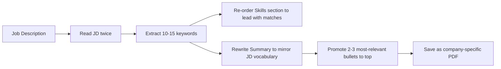
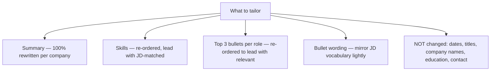

# Tailoring Resume Per Company & Role

A single "master resume" sent to every company under-performs by 2-3× compared to one tailored per application. Tailoring is **not rewriting** — it's emphasising different bullets, swapping summary lines, rearranging skill order, and mirroring the job description's vocabulary. All FAANGM and top MNCs prefer the same *format* (single-column, reverse-chronological, quantified bullets — see [T01](./T01-resume-fundamentals-structure-length-ats-friendly-format.md)); what changes is **emphasis**.

## The 30-Minute Per-Application Tailor

For each meaningful application (referral + target FAANGM), spend 30 min tailoring:

## Per-Company Tailoring Emphasis

### Amazon

**Lead with**: Ownership, Customer Obsession, Deliver Results.

**Map bullets to the 16 Leadership Principles**. Cost reduction, customer-facing outcomes, operational ownership, reliability gains rank highest. Mention "owned" repeatedly (with attribution).

**Summary example**:

> Backend engineer with 6 years owning JVM systems end-to-end. Owned payments service migration from monolith to microservices, cutting customer-reported failures 87% and infra spend $14k/mo. Looking for SDE-II role at Amazon to scale ownership across multi-team initiatives.

**Skills order**: Java + AWS + Spring Boot + DynamoDB + SQS + Kafka.

### Google

**Lead with**: technical depth, scale, distributed-systems thinking.

Distributed systems, performance optimisation, ML-adjacent infra, algorithmic thinking. **"Petabyte-scale"**, **"millions of users"**, **"sub-millisecond"**. "Googleyness" is a culture-fit signal — not in the resume directly; surfaces in clarity-of-thought bullets.

**Summary example**:

> Backend engineer with 6 years building distributed JVM systems at scale. Designed sharding strategy for 380 TB data store; cut tail latency 41% while supporting 2.4× write throughput. Skilled in Java 21, Spring Boot 3, gRPC, Bigtable-style data systems.

**Skills order**: Java + Guava + gRPC + Bigtable + Spanner + GCP + Distributed Systems.

### Meta

**Lead with**: impact, speed, A/B test wins, iteration.

"Shipped to billions", developer velocity, ranking systems. Influence and cross-functional collaboration. Mention metrics that probe Move Fast + Focus on Impact.

**Summary example**:

> Backend engineer with 6 years shipping high-impact features at scale. Shipped 6 ranking experiments in Q2; winning variant lifted message-reply rate 4.1% across 1.3B users. Skilled in Java, GraphQL (DGS), Kafka, fanout architectures.

**Skills order**: Java + Spring Boot 3 + GraphQL + Kafka + Redis + High-throughput Distributed Systems.

### Apple

**Lead with**: craft, polish, shipped products (not internal tools).

Performance, privacy, platform reliability, embedded constraints. Understated tone — let the work speak. Reference specific products if you worked on them.

**Summary example**:

> Backend engineer with 6 years building privacy-first JVM systems on Apple Music / iCloud teams. Re-architected on-device transcription daemon; cut p99 wake latency 38% and battery cost 22%. Focus on end-user craft and operational reliability.

**Skills order**: Java/Scala + Cassandra + FoundationDB + Kafka + JFR / JMC + Privacy/Security.

### Netflix

**Lead with**: judgment, autonomy, senior-grade decisions.

Independent architecture calls, work that influenced business outcomes without supervision, high-context "informed captain" framing.

**Summary example**:

> Backend engineer with 8 years of senior judgment on JVM systems. Chose to deprecate Cassandra cluster against initial team consensus after capacity analysis; migration cut $42k/mo and eliminated weekly on-call paging. Skilled in Spring Boot 3, gRPC, observability, chaos engineering.

**Skills order**: Java 21 + Spring Boot 3 + Reactor + gRPC + DGS GraphQL + EVCache + Chaos Engineering.

### Microsoft

**Combination**: technical depth (Google-style) + ownership (Amazon-style) + Growth Mindset framing.

**Summary example**:

> Senior backend engineer, 8 YOE on Spring Boot + Azure. Led migration of 4-service deployment from on-prem to AKS; cut deploy time 45min → 4min and infra spend $28k/mo → $19k/mo. Actively learning Rust + WebAssembly to broaden the stack.

**Skills order**: Java + Spring Boot + Azure (Cosmos DB, Service Bus, Event Hub) + Kubernetes + .NET Core (if you have it).

### Indian Unicorns (Flipkart, PhonePe, Razorpay, Swiggy, Cred, Myntra)

**Lead with**: scope + ownership + scale.

"Services handling X RPS", "team of N", "shipped to Y million users". For payments-heavy (Razorpay, PhonePe, Cred), emphasise idempotency / exactly-once / Saga / outbox.

**Summary example** (PhonePe):

> Backend engineer with 5 years on JVM payment systems. Owned reconciliation service end-to-end (Spring Boot, PostgreSQL, Kafka); cut nightly batch 4hr → 12min via parallel-stream redesign. Strong on idempotency + distributed transactions + observability.

### Banking / Finance Tech (Goldman, JPMC, MS, Barclays)

**Java depth + low-latency + correctness**.

Front-office: emphasise LMAX Disruptor, Chronicle, off-heap, GC-free paths. Back-office: emphasise audit trails, batch scale, correctness.

**Summary example** (Goldman front-office):

> Senior Java engineer with 6 years on low-latency trading systems. Reduced order-matcher p99 from 800µs to 95µs via LMAX Disruptor + Chronicle Map; eliminated GC pauses in critical path via off-heap allocation. Deep in JMM, G1/ZGC tuning, Kafka exactly-once.

### Legacy MNCs (TCS, Infosys, Wipro, HCL, Cognizant)

**Stack match dominates**. Match the JD's specific Java/Spring/Hibernate/database versions, frameworks, and domain (BFSI / healthcare / retail). Certifications carry more weight than at FAANG.

**Summary example** (TCS BFSI lateral):

> Senior Java developer with 7 years on BFSI applications. Built Spring Boot REST services for retail-banking client (US Tier-1); maintained Hibernate-based persistence layer; reduced 4 critical bugs/qtr. AWS Solutions Architect certified.

## What To Actually Change

**Rules**:

- **Never change dates, titles, company names, education, contact** — these are checkable facts.
- **Never claim experience you don't have** — backchannels exist; embellishment kills offers.
- **Mirror JD vocabulary** for keywords (Kafka pipelines → event-driven Kafka pipeline) — natural insertion, not stuffing.
- **Lead with most-relevant bullets** under each role — re-order, don't rewrite.

## The 10-Minute Lite Tailor (For Bulk Applications)

When you're applying to 20+ companies and can't do full 30-min tailors:

- **Read the JD once** (3 min).
- **Extract 5-7 keywords**, ensure they appear in your resume body (5 min).
- **Skim summary**; swap 1-2 words if they don't match JD vocabulary (2 min).

Even this lite tailor 2-3× the response rate of a generic resume.

## Tracking Tailored Versions

Maintain a per-company spreadsheet of resume versions:

| Company | Role | JD URL | Date | Resume file | Cover letter? | Status |
|---|---|---|---|---|---|---|

When the recruiter follows up 6 weeks later, you can recall what exactly you sent.

## What Recruiters Actually Check

Recruiters skim for:

1. **Role title match** (Senior Java Backend Engineer — yes / no).
2. **Years in role** (matches their target band).
3. **Tech keywords match** (Spring Boot 3, Kafka, AWS).
4. **Company brand recognition** in your experience.
5. **One or two bullets that catch their eye** (metric-heavy outcomes).

If the first three don't match, the resume is filtered in 8 seconds. Tailoring is largely about getting past this gate.

## Deeper Dive — Same Engineer, Five Tailored Versions

To make tailoring concrete: here's the **same engineer's resume summary + lead bullet for one role**, presented five ways for five target companies. Same underlying facts, different framing per company.

### Base reality (the un-tailored version)

> Senior backend engineer with 6 years building JVM systems on Spring Boot 3 / Java 21.
> Shipped a payments service handling 8k RPS at p99 of 78ms during Black Friday;
> led migration off monolithic Hibernate stack to event-driven Kafka pipeline that
> cut infra spend 31% ($28k/mo → $19k/mo).

**Lead bullet (Senior Software Engineer @ PaymentsCo):**
> Led extraction of payments service from Java 8 monolith to Spring Boot 3 / Java 21
> on EKS, cutting deploy time 45min → 4min and infra spend $28k/mo → $19k/mo.

### Tailored for AMAZON SDE-II — emphasis: Ownership, Customer Obsession, Frugality, Deliver Results

**Summary**:

> Backend engineer with 6 years owning JVM systems end-to-end. Owned payments service
> migration that cut customer-reported transaction failures 87% and reduced infra spend
> $28k/mo → $19k/mo (Frugality). Comfortable with operational ownership; on-call lead
> across 3 quarters with MTTR 47min → 6min.

**Lead bullet**:

> Owned end-to-end migration of payments service from monolith → microservices on EKS.
> Delivered on committed Q3 timeline despite mid-quarter scope addition; saved $9k/mo
> in cloud spend and cut customer-reported failures 87%. Authored 3 ADRs governing
> the architecture decisions.

**Why this tailoring**: words like "owned", "delivered on committed timeline", "$9k/mo savings", "customer-reported failures" map directly to LPs (Ownership, Deliver Results, Frugality, Customer Obsession). Mention of ADRs hints at Dive Deep + Insist on Highest Standards.

### Tailored for GOOGLE L5 — emphasis: technical depth, scale, distributed systems, Googleyness

**Summary**:

> Senior backend engineer with 6 years on distributed JVM systems at scale. Designed
> + shipped 14-service payments platform processing 8k RPS sustained (32k peak) at
> p99 < 80ms; led migration off monolithic stack using event-driven Kafka with
> idempotent producer + transactional API for exactly-once write semantics.
> Strong on JVM internals (G1 / ZGC), distributed transactions (saga + outbox),
> observability.

**Lead bullet**:

> Designed event-driven Kafka pipeline (47 topics, exactly-once via idempotent producer
> + transactional API) replacing legacy synchronous monolith. Sustained 8k RPS, peak
> 32k RPS; p99 latency 4s → 78ms (-98%). Co-authored the design RFC + drove cross-team
> alignment via design-review working group.

**Why this tailoring**: distributed-systems vocabulary ("exactly-once", "idempotent producer", "saga", "outbox") signals depth. RFC + working group signals Googleyness (collaboration without authority). Specific tech (G1, ZGC) signals JVM-internals depth.

### Tailored for META E5 — emphasis: speed, impact, iteration, A/B-driven, "shipped to billions"

**Summary**:

> Senior backend engineer with 6 years shipping high-impact features at scale.
> Shipped 22 customer-facing features in 18 months across 3 release cycles. Drove
> the payments-migration initiative (8k RPS sustained at p99 78ms) that lifted
> checkout completion rate 4.1% through latency cuts alone, validated via 2-week
> A/B test (n = 14M users).

**Lead bullet**:

> Shipped event-driven payments migration in 14 sprints; validated through phased A/B
> rollout (cohort sizes 5% → 25% → 100%). Lifted checkout-completion 4.1% directly
> attributed to latency cuts; reduced infra spend 31% (-$108k/yr). Coordinated cutover
> across mobile + web + back-office teams.

**Why this tailoring**: phrases like "shipped in N sprints", "A/B rollout", "cohort sizes", "lifted X by Y%" map to Meta's "Move Fast" + "Focus on Impact". Cross-team coordination + dollar/year framing emphasises business impact.

### Tailored for APPLE ICT4 — emphasis: craft, polish, performance, end-user product quality, privacy

**Summary**:

> Senior backend engineer with 6 years building privacy-first JVM services. Shipped
> payments service with end-to-end encryption (TLS 1.3, AES-GCM at rest, per-customer
> KMS keys); zero PII in logs; passed external SOC2 + PCI-DSS audits on first attempt.
> Obsessive about p99 latency (cut 4s → 78ms via deliberate cache hierarchy +
> connection-pool tuning).

**Lead bullet**:

> Built payments service with end-to-end encryption (TLS 1.3, per-tenant KMS-encrypted
> blobs at rest, no PII logged at any tier). Achieved p99 < 80ms via deliberate cache
> hierarchy + HikariCP tuning. Service handled $4.2B / yr GMV with zero confirmed
> data-exposure incidents.

**Why this tailoring**: privacy + security as first-class engineering concerns ("zero PII", "end-to-end encryption", "external audits") map to Apple's privacy-first ethos. "Obsessive", "deliberate" signal Apple's craft culture. GMV scale + zero-incidents signal end-user-product-quality bar.

### Tailored for NETFLIX E5 — emphasis: judgment, autonomy, senior-grade decisions, business outcomes

**Summary**:

> Senior backend engineer with 6 years of senior-grade judgment on JVM systems. Chose
> to deprecate the legacy monolithic auth stack against initial team consensus after
> capacity analysis showed it would not scale to 2026 traffic forecasts. Migration to
> federated auth saved $42k/mo and eliminated weekly on-call paging. Currently driving
> multi-region active-active architecture (no central authority to ask).

**Lead bullet**:

> Made the call to deprecate legacy auth stack despite team's preference to extend it;
> presented capacity analysis (current trajectory exhausts thread-pool at projected
> H2-2026 traffic) and led the federated-auth migration. Cut $42k/mo cloud spend +
> eliminated weekly paging. Pattern of evidence-driven autonomous decisions across 3
> quarters; trust earned through outcome.

**Why this tailoring**: "made the call against team consensus", "no central authority to ask", "evidence-driven autonomous decisions" map to Netflix's Freedom + Responsibility + Keeper Test. Outcome-anchored framing fits "judgment over process."

## Deeper Dive — Per-Company Skill-Order Cheat Map

When you re-order Skills for each application, lead with what that company's recruiter searches:

| Company | Skills lead with |
|---|---|
| **Amazon** | Java, AWS (DynamoDB, SQS, Lambda, EKS), Spring Boot, Kafka, Microservices |
| **Google** | Java, Distributed Systems, Bigtable / Spanner, Guava, gRPC, GCP, Protocol Buffers |
| **Meta** | Java, GraphQL (DGS), Kafka, Redis, High-throughput Distributed Systems, A/B Testing |
| **Apple** | Java / Scala, Cassandra, FoundationDB, Kafka, JFR, JMC, Privacy / Security |
| **Netflix** | Java 21, Spring Boot 3, gRPC, Reactor, DGS GraphQL, EVCache, Chaos Engineering |
| **Microsoft** | Java, .NET (if you have it), Spring Boot, Azure (Cosmos DB, Service Bus, Event Hub), Kubernetes |
| **Indian unicorns (PhonePe, Razorpay, Cred)** | Java, Spring Boot, Kafka, PostgreSQL, Redis, Microservices, Idempotency, Saga |
| **Banking (Goldman, JPMC, MS)** | Java (deep), JVM internals (GC, JMM), Multi-threading, Kafka, Spring Boot, Low-latency |

## Sources & Further Reading

- [Gergely Orosz — Pragmatic Engineer](https://blog.pragmaticengineer.com/author/gergely/) — "tailor before sending"
- [DesignGurus — Best Resume Formats for FAANG 2025](https://www.designgurus.io/blog/best-resume-formats-for-faang-and-top-tech-companies-2025)
- [The Interview Guys — State of Job Search 2025](https://blog.theinterviewguys.com/state-of-job-search-2025-research-report/)

## Practice

1. **Pick 3 target companies**. Read their top 1 JD each.
2. **Extract 10 keywords per JD**; check coverage in your resume.
3. **Rewrite your summary** 3 ways — one per company.
4. **Re-order Skills** for each company.
5. **Promote 2-3 bullets per role** to top for each company.
6. **Save 3 PDF versions** with company name in filename.

## Recap

You should now be able to:

- Run the **30-min per-application tailor**.
- Apply **per-company emphasis** — Amazon (ownership), Google (scale), Meta (impact), Apple (craft), Netflix (judgment), Microsoft (depth + growth), Indian unicorns (scope), Banking (Java depth).
- Rewrite **summary** per company.
- Re-order **Skills + bullets** by JD relevance.
- Mirror **JD vocabulary** without keyword stuffing.
- Use the **10-min lite tailor** for bulk applications.
- Track versions to avoid sending the wrong resume to the wrong recruiter.

## Next

Continue to [LinkedIn Profile & Recruiter SEO](./T04-linkedin-profile-and-recruiter-seo.md).
