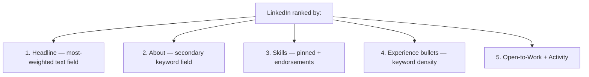

# LinkedIn Profile & Recruiter SEO

LinkedIn is the **single largest inbound source of FAANGM recruiter reach-outs**. 72% of recruiters use LinkedIn for hiring, and a comprehensive profile yields ~71% higher interview rate ([Best Job Search Apps 2025](https://bestjobsearchapps.com/articles/en/the-complete-linkedin-job-search-guide-for-2025)). At the same time, **recruiter trust in LinkedIn is dropping** due to inbound spam, and pedigree candidates report 20-50× more reach-outs than non-pedigree peers ([Pragmatic Engineer — Tech Jobs Market 2025](https://newsletter.pragmaticengineer.com/p/tech-jobs-market-2025-part-3)). Optimising LinkedIn for recruiter search is mechanical — change a handful of fields and you'll get measurably more outreach.

This topic is the **LinkedIn recruiter SEO playbook** for a Java backend engineer.

## How Recruiter Search Actually Works

LinkedIn Recruiter (the paid sourcing tool every FAANG/Indian-unicorn recruiter uses) lets recruiters search by:

- **Headline keywords**
- **Title** (current + past)
- **Skills** (with endorsements weighting)
- **Years of experience**
- **Location**
- **Company** (current + past)
- **Open to Work** flag (private — only recruiters see it)

Your profile is **ranked** in the search results by:

- **Keyword density** in headline + about + experience
- **Skill match** with the recruiter's filter
- **Connection degree** (1st > 2nd > 3rd)
- **Profile completeness** (LinkedIn explicitly down-ranks incomplete)
- **Activity recency** (recent posts / engagement)

## The Five Fields That Actually Matter



### 1. Headline (the most important field)

220-character limit. **Pack with keywords + level + stack**.

**Weak**:

> Software Engineer at PaymentsCo

**Strong**:

> Senior Java Backend Engineer | Spring Boot 3 / Kafka / AWS | ex-Stripe | Distributed Systems

Why: contains "Senior", "Java", "Backend", "Spring Boot", "Kafka", "AWS", "Distributed Systems" — exact filters recruiters search.

### 2. About section

3-4 short paragraphs. **First-person**. Lead with what you do, what you've shipped, what you want next. **Mirror keywords** from target job descriptions.

**Template**:

```text
[Para 1: what you do + level]
Senior backend engineer with 6 years building distributed JVM systems on
Spring Boot 3 + Java 21. Currently at PaymentsCo, owning the payment-reconciliation
service end-to-end.

[Para 2: what you've shipped — XYZ-style]
Shipped a payments service handling 8k RPS at p99 of 78ms during Black Friday
(3.2× prior year peak). Led migration from monolithic Hibernate stack to
event-driven Kafka pipeline that cut infra spend $28k/mo → $19k/mo.

[Para 3: tech stack — keyword-dense]
Stack: Java 21, Spring Boot 3, Spring Cloud, Hibernate 6, Kafka, Redis,
PostgreSQL, AWS (EKS, RDS, SQS), Docker, Kubernetes, Terraform.

[Para 4: what you want — open to recruiters]
Open to senior backend roles at FAANGM, Indian unicorns, or fintech. Especially
interested in payment systems, distributed transactions, observability.
```

### 3. Skills section

LinkedIn lets you list up to 100 skills. Pin your **top 3** (most-prominent in recruiter search). Endorsements still mildly affect rank.

**Pin order for Java backend**:

1. **Java** (the table-stakes filter)
2. **Spring Boot** (most-searched framework)
3. **System Design** OR **Apache Kafka** OR **AWS** — whichever you're targeting

After top 3, list 20-30 specific skills: Java 21, Spring Cloud, Spring Security, Hibernate, JPA, gRPC, GraphQL, Microservices, Kubernetes, Docker, Terraform, Redis, PostgreSQL, MongoDB, Elasticsearch, Kafka, RabbitMQ, AWS, Azure, GCP, etc.

### 4. Experience bullets

**Match your resume bullets verbatim**. If they diverge, your "story" looks inconsistent and recruiters notice fast.

For each role: company, title, dates (Month YYYY – Month YYYY), 3-4 bullets per role. Use the [XYZ formula from T02](./T02-writing-impactful-bullet-points-xyz-formula-metrics.md).

### 5. Open to Work + Activity

- **Open to Work** (private toggle, visible only to recruiters) — turn on if you're actively looking. Recruiters filter on this.
- **Activity**: 1-2 posts per month on technical topics (a war story, a learning, a project). LinkedIn algorithm boosts profiles with recent activity in search rank.

## Additional Profile Polish

### Custom URL

Change to `/in/firstnamelastname`. Default `/in/firstname-lastname-9b7a4c2e1` looks unprofessional.

### Profile photo

Yes — LinkedIn is one place a photo helps. Use a clear, recent, professional headshot. Don't use a vacation photo, group photo, or cartoon avatar.

### Banner image

Use a tech-relevant banner (your company's banner, a stock distributed-systems image, your own GitHub commit graph). Default LinkedIn banner is fine but unmissable as default.

### Location

Set to your actual metro. Recruiters filter by location strictly. If you're open to relocation, indicate in the About section.

### Education

Match your resume. Add relevant coursework only if early-career.

### Certifications

AWS Solutions Architect, Spring Professional, Oracle Java SE, etc. Add as separate certs — they show up in search.

### Recommendations

Get 3-5 recommendations from past managers / senior peers. LinkedIn algorithm weights these.

## What To NEVER Do

- **Stuff keywords irrelevantly**. *"Java Java Java Java Kafka Kafka Kafka"* in your About section — LinkedIn detects this and down-ranks.
- **Lie about years or titles**. Backchannels exist; recruiters cross-check with old colleagues.
- **List 100 skills with no proficiency**. Dilutes signal; LinkedIn weights skills inversely with quantity.
- **Leave the About blank**. LinkedIn down-ranks empty fields.
- **Inactive profile**. Last activity > 6 months ago = down-ranked.

## Tactics That Generate Recruiter Reach-Outs

1. **Headline density**: pack 5-7 specific keywords (Senior, Java, Spring Boot, Kafka, AWS, your level).
2. **Pin the highest-search-volume skills** (Java + Spring Boot + AWS for general; Kafka + Kubernetes for infra; Distributed Systems for senior+).
3. **Set Open to Work** (private) — this single toggle 2-3× inbound rate.
4. **Post 1-2 technical articles per month** on a topic in your stack — algorithm boost.
5. **Connect with recruiters at target companies** — they review your profile and may reach out.
6. **Update activity weekly** — even a like or comment counts.
7. **Get recent recommendations** — algorithmic and human weight.

## What Pedigree Does To Outreach

Per [Gergely Orosz's 2025 Tech Jobs Market](https://newsletter.pragmaticengineer.com/p/tech-jobs-market-2025-part-3):

- **Pedigree candidates** (FAANG, Tier-1 Indian unicorns, top universities) report **20-50× more recruiter reach-outs**.
- **Non-pedigree** candidates often get ghosted on cold apps; profile optimisation matters even more.
- **Brand recognition in your experience** (recognisable companies) is a force-multiplier — recruiters search for it explicitly.

If you don't have pedigree, compensate with: **public OSS contributions**, **technical writing on Medium / personal blog**, **conference talks**, **GitHub portfolio with deployed projects** (see [T05](./T05-github-profile-projects-and-portfolio.md)).

## LinkedIn vs Resume Alignment

The two are read together. Discrepancies (company name slightly different; dates off by months; titles inflated on one) are red flags that surface in 30 seconds.

| Field | Should match resume exactly |
|---|---|
| Company names | ✅ |
| Titles | ✅ |
| Dates | ✅ |
| Top 3 bullets per role | ✅ (verbatim or near-verbatim) |
| Education + dates | ✅ |
| Skills | ✅ (LinkedIn has more, but Skills mentioned on resume must appear on LinkedIn) |

## Active Sourcing Strategy

If you want to be **actively sourced** (vs. cold-applying):

1. **Optimise as above**.
2. **Open to Work — visible to recruiters only** (the "@OpenToWork" badge is visible publicly — use the private version unless you want your current employer to see).
3. **Connect with FAANGM recruiters** by name (search "Recruiter at Google" + your geo).
4. **Engage with recruiter posts** — they remember names.
5. **DM 5-10 recruiters at target companies per month** with a 4-line pitch.

## Deeper Dive — Three Complete Sample LinkedIn Profiles

Three reference profiles at different levels. Adapt the structure; substitute your own specifics.

### Sample 1 — Mid-level (4-7 YOE) Senior Backend Engineer

```text
HEADLINE
Senior Java Backend Engineer | Spring Boot 3 + Kafka + AWS | ex-Stripe
Open to Senior / Staff backend roles in Payments / Fintech

ABOUT
Backend engineer with 6 years building distributed JVM systems on Spring Boot 3 / Java 21.
Currently at PaymentsCo, owning the payments-reconciliation service end-to-end (8k RPS at
p99 of 78ms during Black Friday).

Recent wins:
- Led migration off monolithic Hibernate stack to event-driven Kafka pipeline; cut infra
  spend 31% ($28k/mo → $19k/mo)
- Reduced p99 checkout latency 62% via covering index + JOIN FETCH rewrite + Caffeine cache
- Implemented saga-based refund flow across 3 services using Kafka + outbox; eliminated 11
  inconsistency incidents/quarter
- Mentored 2 mid-level engineers; both promoted within 12 months

Stack: Java 21, Spring Boot 3, Spring Cloud, Hibernate 6, Kafka, Redis, PostgreSQL, AWS
(EKS, RDS, SQS), Docker, Kubernetes, Terraform.

Open to senior backend roles at FAANGM, Indian unicorns, or fintech. Especially interested
in payment systems, distributed transactions, observability.

EXPERIENCE
[mirrors resume — same company names, titles, dates, top bullets per role]

SKILLS (pin top 3)
📌 Java
📌 Spring Boot
📌 Apache Kafka

(then 25-30 more: Distributed Systems, Microservices, AWS, Kubernetes, PostgreSQL, Redis,
Kafka Streams, Spring Cloud, Hibernate, JPA, gRPC, Spring Security, Resilience4j,
OpenTelemetry, Prometheus, Grafana, Docker, Terraform, GitHub Actions, JUnit 5, Testcontainers,
OAuth2/OIDC, Saga, Outbox, Java 21, Reactive Streams)

LOCATION
Bengaluru, Karnataka, India

OPEN TO WORK (private toggle)
- Senior Software Engineer / Senior Backend Engineer / Staff Engineer
- Remote, Hybrid, On-site
- Bengaluru, Hyderabad, Remote-India
- Available immediately
```

### Sample 2 — Junior (1-3 YOE) at a mid-tier company, targeting FAANGM

```text
HEADLINE
SDE at Razorpay | Java + Spring Boot + Kafka | LeetCode 250+ | Open to Senior SDE roles

ABOUT
Software Engineer at Razorpay with 3 years on the payments-gateway team. Strong on Java
backend, distributed systems, and operational ownership.

Recent work:
- Contributed to the idempotency-key dedup-window fix (reduced duplicate refunds by ~2k/day)
- Built admin dashboard for ops team (React + Spring Boot REST)
- Owned 4 of 12 services in our domain; on-call rotation across 3 quarters

Side projects:
- URL shortener at scale (live: snip.aniket.dev) — Spring Boot 3, PostgreSQL, Redis,
  Snowflake IDs, 800 RPS on $5/mo Hetzner box
- OSS contributor: 6 PRs merged into Spring Cloud Gateway

Currently learning: Kafka Streams + Generative AI integration patterns.

Open to senior SDE roles at FAANGM (US + India). Targeting payments / fintech / distributed
systems teams.

📌 Java  📌 Spring Boot  📌 Kafka

(skills: Distributed Systems, Microservices, REST, AWS, PostgreSQL, Redis, OpenTelemetry,
Docker, Kubernetes, GitHub Actions, OAuth2, OOP, Data Structures, Algorithms, Python, SQL)
```

### Sample 3 — Senior / Staff (10+ YOE) seeking Principal / Director-track

```text
HEADLINE
Staff Engineer | Multi-region Distributed Systems | 11 YOE | ex-Walmart Labs, Goldman Sachs

ABOUT
Staff Engineer with 11 years on JVM platform systems. Currently leading the multi-region
active-active migration at ECommerceHQ (30M user platform) — designing for sub-100ms
cross-region read latency + regulatory data-residency compliance (DPDPA, India).

Recent impact:
- Led re-platforming of $40M-ARR checkout stack from monolith → 14 microservices on
  Spring Cloud + Kafka + EKS. Outcome: p99 latency 4.1s → 1.6s; on-call paging 78% lower;
  deploy cadence 1/week → 8/day
- Drove organization's Java 8 → 17 migration across 80+ services; cut p99 latency 18%,
  infra spend 12% platform-wide
- Established team's chaos-engineering practice; reduced major-incident MTTR 47min → 6min
- Mentor to 6+ engineers across two teams (3 promotions in 18 months)
- Speaker: DevoxxIN 2024 ("Outbox + CDC with Spring Boot + Debezium"); SpringOne 2023

Open to Principal Engineer or Senior Staff roles. Especially interested in platform infra,
distributed transactions, and developer-productivity work at scale.

📌 Java  📌 Distributed Systems  📌 Apache Kafka

EXPERIENCE
[full list — ECommerceHQ, Walmart Labs, Goldman Sachs across 11 years]

OPEN SOURCE
- Spring Cloud Gateway: 7 merged PRs (active reviewer on rate-limiter + observability modules)

TALKS
- DevoxxIN 2024 — "Outbox + CDC with Spring Boot + Debezium" (~14k YouTube views)
- SpringOne 2023 — "Migrating 80 services from Java 8 to 17"
```

## Deeper Dive — LinkedIn SEO Cheat Map

For each field, here's what recruiters search + what to optimise:

| Field | Recruiter searches | Optimise for |
|---|---|---|
| **Headline** | "Senior Java backend", "Staff Engineer Spring Boot" | Pack 5-7 specific keywords: Senior/Staff + primary language + framework + main tech |
| **About** | Long-form keyword matching | First 2 lines visible without expand — pack keywords |
| **Skills** | Filter by skill | Pin top 3 (recruiter views in priority); list 20-30 specific |
| **Experience titles** | "Senior Software Engineer" | Use the actual market title, not your company's quirky one |
| **Location** | Geo filter | Set your actual metro; consider "Bengaluru Area" vs just "India" |
| **Open to Work** | Internal filter | Enable (private) when actively looking |
| **Activity** | Recent activity boost | 1-2 posts/month boosts ranking |
| **Recommendations** | Quality signal | Get 3-5 from former managers / senior peers |

## Deeper Dive — Outreach Script Templates

### Engaging a recruiter who reached out

> Hi [Name], thanks for reaching out about [role] at [company].
>
> I'd love to learn more. Some context on what I'm looking for: [scope / domain / location].
>
> If [company]'s [role] aligns, I'd be happy to schedule a 30-min initial call. Some times
> that work for me:
> - [Day] [Time] [Timezone]
> - [Day] [Time] [Timezone]
> - [Day] [Time] [Timezone]
>
> Or feel free to propose other slots. Resume attached for context.
>
> Best, [Your name]

### Recruiter check-in after silence

> Hi [Name], hope all is well. Following up on our [date] conversation about [role] at
> [company]. Has there been any update on next steps?
>
> Happy to schedule a sync if helpful. No pressure if timing isn't right.
>
> Best, [Your name]

### Cold connecting with a peer engineer at a target company

> Hi [Name], saw your recent post on [topic] — really insightful, especially the part
> about [specific reference].
>
> I'm a senior backend engineer at [PaymentsCo] focusing on similar problems
> ([brief context]). Would love to connect.

Don't immediately ask for a referral on first connection. Build the connection first; then
ask after a few interactions.

## Sources & Further Reading

- [OphyAI — LinkedIn Profile Tips 2026](https://ophyai.com/blog/resume-writing/linkedin-profile-optimization-job-search)
- [Best Job Search Apps — Complete LinkedIn Job Search Guide 2025](https://bestjobsearchapps.com/articles/en/the-complete-linkedin-job-search-guide-for-2025)
- [Pragmatic Engineer — Tech Jobs Market 2025](https://newsletter.pragmaticengineer.com/p/tech-jobs-market-2025-part-3)

## Practice

1. **Rewrite your headline** to pack 5-7 keywords.
2. **Rewrite your About** using the template above. 3-4 paragraphs.
3. **Pin top 3 skills**; list 20-30 specific.
4. **Toggle Open to Work** (private if you're employed).
5. **Update your custom URL** to `/in/firstnamelastname`.
6. **Write one technical post** on a topic in your stack. Publish.
7. **Get 1 new recommendation** from a recent peer / manager.

## Recap

You should now be able to:

- Optimise the **five fields that matter** (headline, about, skills, experience, open-to-work).
- Pack the **headline** with 5-7 keywords + level + stack.
- Write the **About** with the 4-paragraph template.
- Pin the **top 3 skills** that match recruiter-search filters.
- Match **LinkedIn to resume verbatim** to avoid red flags.
- Drive **inbound recruiter reach-outs** via Open to Work + activity + connections.
- Compensate for **lack of pedigree** with OSS + writing + GitHub portfolio.

## Next

Continue to [GitHub Profile, Projects & Portfolio](./T05-github-profile-projects-and-portfolio.md).
