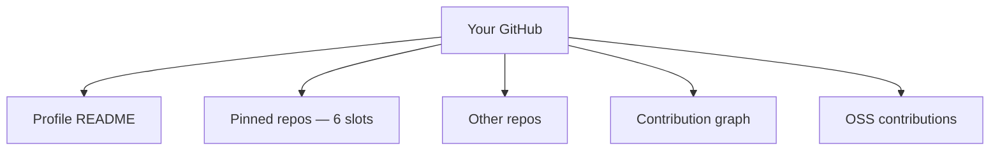

# GitHub Profile, Projects & Portfolio

A strong GitHub profile is a **force-multiplier for non-pedigree candidates** and a non-negotiable for early-career engineers. Recruiters at FAANGM and Indian unicorns explicitly visit GitHub for: (a) verifying claims on the resume, (b) judging code quality and engineering taste, (c) finding projects to discuss in interviews. **An empty or abandoned GitHub *hurts* you — better to omit the link.** Conversely, one polished portfolio project with a deployed URL and a great README outperforms ten half-finished experiments.

This topic is the **GitHub portfolio playbook** for a Java backend engineer.

## The GitHub Profile Layers



### Profile README (`username/username` repo)

GitHub's special-named repo that shows as your profile front-page. Use it to:

- One-line intro: *"Senior Java backend engineer based in Bengaluru, India."*
- Stack badges (Java, Spring Boot, Kafka, AWS, etc.) — use [Shields.io](https://shields.io/).
- Pinned project blurbs with screenshots.
- Links: LinkedIn, personal site, blog.
- Currently-learning / recently-shipped.

### Pinned Repos — Your Top 6

GitHub lets you pin 6 repos at the top of your profile. **These are the only repos most recruiters see.** Pin your best work:

1. **Your strongest production-grade Spring Boot project**.
2. **A second showpiece** (different stack flavour — e.g., reactive, or different domain).
3. **An OSS contribution** if you have a merged PR into a major project.
4. **A learning project** that shows breadth (e.g., a Rust experiment, a small ML project).
5. **A tooling project** (a small utility you actually use — e.g., a JFR analyser).
6. **A code-katas / dotfiles / config repo** (signals engineering hygiene).

**Don't pin**: tutorial clones, abandoned hackathons, empty placeholder repos.

## What A "Hireable" Java Side Project Looks Like

From [Toyez Yadav's pragmatic guide](https://medium.com/@toyezyadav/your-portfolio-is-just-crud-the-java-spring-boot-system-design-that-actually-gets-you-hired-3fe905587d21):

**NOT**: a "todo app" / "blog clone" / "library management system" copied from a YouTube tutorial. Recruiters see hundreds of these per week; they read as zero signal.

**YES** a production-grade Spring Boot service that:

- **Solves a real problem** (yours or a niche community's).
- **Has a professional README** with architecture diagram, deployment steps, what-problem-it-solves. Recruiters open the README first; bad README = closed tab.
- **Is deployed somewhere accessible** (Railway / Fly.io / AWS free tier / Render) with a live URL.
- **Has Docker + CI/CD** (GitHub Actions running tests + linting).
- **Has observability** (structured logs, `/health` endpoint, `/metrics` endpoint).
- **Has tests** (JUnit 5 + Testcontainers; not just happy-path).
- **Includes a system design write-up** as `DESIGN.md` covering data model, scale trade-offs, why-not-X choices, known limitations.

**One polished system > ten half-finished experiments.**

## Concrete Project Ideas (Java Backend)

That actually signal seniority:

- **URL shortener** with rate-limiting, idempotency, Redis layer, click analytics.
- **Order management service** with outbox pattern + Kafka.
- **Payment-flow demo** with saga + retries + DLQ + reconciliation.
- **Feature-flag service** with REST API + admin UI.
- **Notification fan-out service** with backpressure and multi-channel.
- **Small distributed cache** (Memcached/Redis-style protocol) — implement subset of the wire protocol.
- **Mini-Kafka or pub-sub** — implement subset of Kafka semantics in-memory + persisted log.
- **Personal dashboard** that pulls from APIs you actually use (Spotify, GitHub, Strava).

The pattern: **adjacent-to-FAANGM-system-design** at smaller scale. Demonstrates the same engineering muscles.

## README Template

A professional README has these sections in order:

```markdown
# Project Name
One-line description.
[](https://...)  [](https://...)

## What this is
2-3 sentences: what problem does it solve, who is it for.

## Live demo
- URL: https://your-deployed-url
- Demo credentials: user `demo` / password `demo` (or "sign up — verified by email")

## Tech stack
- Language: Java 21
- Framework: Spring Boot 3.2
- DB: PostgreSQL 16
- Cache: Redis
- Messaging: Kafka
- Deployed: AWS EKS via Terraform

## Architecture
[Mermaid diagram or image]

## Local development
[How to clone, build, run with Docker Compose]

## Running tests
[How to run unit + integration tests]

## Project structure
[Where's the model layer, service layer, etc.]

## Design decisions
Link to DESIGN.md
```

`DESIGN.md` covers: data model, scale trade-offs, why-not-alternative-X, known limitations, future work.

## Code Quality Signals Recruiters Look For

When a recruiter (or hiring manager later) clicks into a repo:

- **Recent activity** (commits in last 3 months) — abandoned projects hurt
- **Tests present** (not just `helloWorldTest.java`)
- **CI badge green** — broken CI = unfinished
- **Reasonable commit history** — descriptive messages, not just "fix" / "update"
- **Branching discipline** (PRs against main, not all-commits-to-main)
- **README quality** — first impression
- **Code organisation** — packages, no god classes
- **Java idiom** (records, Optional, ConcurrentHashMap) — modern Java
- **Dependency hygiene** — Maven/Gradle BOM, no version-conflict suppression

## Contribution Graph

GitHub's green-squares graph. A consistently-active graph is a positive signal (~3-5 commits/week). An empty graph or one with a single hackathon-burst hurts.

Easy ways to keep it green:

- Commit to your own learning repos (dotfiles, code-katas).
- Contribute small OSS PRs (typo fixes, doc updates).
- Use GitHub for issue tracking on personal projects.

Don't fake it (`commit -m "update README"` daily). The pattern is recognisable.

## OSS Contributions

A merged PR into a major project (Spring, Kafka, Quarkus, OpenJDK, Apache Camel) is a strong signal. Way to start:

1. **Pick a project you actually use** in your day job.
2. **Read CONTRIBUTING.md** — every major OSS has one.
3. **Start with "good-first-issue" labels** — maintainers welcome these.
4. **Submit small PRs first** (typo, missing test, doc improvement) to build trust.
5. **Scale up** to feature/bug PRs.

On your resume, list as: *"Merged 3 PRs into Spring Boot (PR #38421, #38500, #38612) — added support for X / fixed bug in Y."*

## What NOT To Put On GitHub

- **Anything from your day job** without explicit permission (NDA / IP issues).
- **Credentials, API keys, .env files**. Use `.gitignore`. Scan with `gitleaks` before committing.
- **Tutorial clones** with the original author's name still in commits.
- **Half-finished hackathon code** with no README.
- **Joke / meme repos** as pinned — they're fine to have, just not pinned.

## When NOT To Link GitHub

If your GitHub is genuinely empty or only has half-finished old code, **omit the link from your resume**. An empty link is worse than no link.

Better path: spend 4-6 weekends building one polished project before adding the link.

## The "I Don't Have Time For Side Projects" Reality

This is the most common objection. The answer is honest:

- **For senior+ candidates** (5+ YOE at brand-name shops): side projects matter less. Your job experience is the proof. You can omit GitHub if it's weak.
- **For early-career / career-switchers**: side projects matter a lot. The 4-6 weekends are a high-leverage investment.
- **For laterals from non-pedigree shops** trying to break into FAANGM: side projects are a force-multiplier. Spend the time.

## Sources & Further Reading

- [Toyez Yadav — Your Portfolio Is Just CRUD](https://medium.com/@toyezyadav/your-portfolio-is-just-crud-the-java-spring-boot-system-design-that-actually-gets-you-hired-3fe905587d21)
- [Shields.io](https://shields.io/) — badge generation
- [Awesome README](https://github.com/matiassingers/awesome-readme) — examples
- [Spring guides](https://spring.io/guides) — starting points for production-grade demos

## Practice

1. **Audit your GitHub**: is it currently a hire or hurt? Be honest.
2. **Pick one of the concrete project ideas** above. Set a 4-weekend deadline.
3. **Write the README first** before coding. Forces clarity on what the project does.
4. **Deploy it** (Railway / Fly.io / AWS free tier).
5. **Add CI** (GitHub Actions — Spring Boot template).
6. **Pin the 6 best repos**; un-pin abandoned hackathons.
7. **Write the profile README** with a one-line intro + stack badges + pinned project blurbs.

## Deeper Dive — Complete Sample Profile README

Three sample profile READMEs at different levels. Each is what would appear at
`github.com/<username>` (the special username repo).

### Sample 1 — Mid-level Senior SDE seeking FAANGM Senior

```markdown
### Hi, I'm Aniket 👋

Senior Backend Engineer at PaymentsCo (Bengaluru). 6 YOE on Java + Spring Boot
+ distributed systems. Currently owning the reconciliation service end-to-end
(8k RPS, p99 78ms).

🔭 **Working on:**
- Migrating from monolithic Hibernate to event-driven Kafka pipeline (cut spend 31%)
- Side: `url-shortener-prod` — production-grade shortener live at snip.aniket.dev

💼 **Open to:** Senior / Staff backend roles at FAANGM (US + India).
Especially interested in payments, distributed transactions, observability.

🛠️ **Stack:**


📊 **GitHub stats:**


📝 **Recent writing:**
- [Idempotency at scale: why dedup-windows beat retries](https://aniket.dev/idempotency)
- [Cracking the Kafka exactly-once myth](https://aniket.dev/kafka-eos)

🤝 **Connect:**
- LinkedIn: [linkedin.com/in/aniketkumar](https://linkedin.com/in/aniketkumar)
- Email: hi@aniket.dev
- Resume: [aniket.dev/resume.pdf](https://aniket.dev/resume.pdf)
```

### Sample 2 — Junior SDE (1-3 YOE) at non-FAANGM, targeting FAANGM Senior

```markdown
### Hey, I'm Priya 👋

SDE at Razorpay. 3 YOE. LeetCode 250+ (top 4% India). Love production payment systems.

🚀 **Side projects to check out:**
- **url-shortener** — Spring Boot 3 + PostgreSQL + Redis + Snowflake IDs.
  Live: snip.priya.dev. 800 RPS on a $5/mo VPS.
- **scrapr** — Distributed web-crawler. Java 21 virtual threads + RabbitMQ.
  Crawled 12M pages in 6 hours.
- **otel-spring-demo** — Reference impl of OpenTelemetry traces + metrics + logs
  across 5 Spring Boot services.

🌱 **Currently learning:** Kafka Streams + LLM API integration patterns

📝 **Recent OSS contributions:**
- Spring Cloud Gateway: 6 PRs merged ([#2841](#), [#2912](#), ...)
- Resilience4j: 2 PRs merged ([#1532](#), ...)

🎯 **Targeting:** Senior SDE roles at Stripe, Square, Razorpay (US), Plaid

📊 **Stats:**


🔗 [LinkedIn](https://linkedin.com/in/priya) · [Blog](https://priya.dev) · [Resume](https://priya.dev/r.pdf)
```

### Sample 3 — Staff Engineer with strong public profile

```markdown
### Vikram Singh — Staff Engineer · 11 YOE

Working on platform infra at ECommerceHQ (Bengaluru). Previously: Walmart Labs,
Goldman Sachs (Bengaluru → Singapore → Hong Kong).

📖 **Speaking:**
- DevoxxIN 2024 — [Outbox + CDC with Spring Boot + Debezium](https://youtube.com/...) (14k views)
- SpringOne 2023 — [Migrating 80 services from Java 8 to 17](https://youtube.com/...) (28k views)
- JavaConfIN 2022 — [G1 GC tuning for 200GB heaps](https://youtube.com/...) (8k views)

✍️ **Writing:** [blog.vikramsingh.tech](https://blog.vikramsingh.tech)
Frequent topics: JVM internals, Kafka, distributed transactions, on-call.

🛠️ **Open source maintainer:**
- [spring-cloud-gateway](https://github.com/...) — 47 PRs merged (active reviewer)
- [debezium-spring-boot-starter](https://github.com/vikramsingh/debezium-spring-boot-starter)
  — 1.2k stars, my project

🎯 **What I'm building:**
Multi-region active-active migration at ECommerceHQ (30M MAU, India + SEA).
Designing for sub-100ms cross-region read latency + DPDPA compliance.

📬 **Open to:** Principal Engineer or Senior Staff roles. Reach me via
[vikramsingh.tech/contact](https://vikramsingh.tech/contact).
```

## Deeper Dive — Sample DESIGN.md for the URL Shortener Project

Show this in the project repo. Recruiters / interviewers read it; it differentiates
you from people who just wrote code.

```markdown
# DESIGN.md — Snip (URL Shortener)

## Goals
- Shorten any URL into a 7-char code (62^7 = 3.5T URLs — sufficient for years)
- Redirect <50ms p99
- Survive single-node failure (highly available)
- Support 10M+ URLs without DB bloat
- Be cheap to run ($5-10/mo VPS scale)

## Non-Goals
- Custom slugs (`/snip/my-promo`)
- Multi-region (single region only — V1)
- Auth (V1 is public-shorten only)
- Analytics dashboard (V2)

## API
```
POST /api/v1/shorten
  body: { "url": "https://example.com/very/long" }
  -> 201 { "shortCode": "aBcDeFg", "shortUrl": "https://snip.dev/aBcDeFg" }

GET /aBcDeFg
  -> 302 Location: https://example.com/very/long
```

## Data Model

```sql
CREATE TABLE short_links (
  id BIGINT PRIMARY KEY,                  -- Snowflake ID (sortable)
  short_code VARCHAR(11) NOT NULL UNIQUE, -- Base62 encoded id
  long_url TEXT NOT NULL,
  created_at TIMESTAMPTZ NOT NULL DEFAULT NOW()
);
CREATE INDEX idx_short_code ON short_links(short_code);
```

## ID Generation — Snowflake (not random)

Random codes need collision check → extra DB round-trip → 2× latency. Snowflake
IDs are sortable, monotonic, unique per node — and Base62 encoded to ~7 chars.

```
| 42 bits timestamp | 8 bits node | 14 bits sequence |
```

8 bits node ID = 256 nodes max (sufficient). 14 bits sequence = 16K writes/sec/node.

## Read Path — Two-Tier Cache

```
GET /aBcDeFg
  → Caffeine L1 (in-process, 30s TTL)
    → Redis L2 (3min TTL)
      → PostgreSQL (covering index)
```

L1 hit: ~80ns. L2 hit: ~1ms. DB hit: ~4ms.
Expected ratio: 85% L1 / 12% L2 / 3% DB (Pareto-distributed URL access).

## Write Path

```
POST /shorten
  → validate URL (regex + max length 2KB)
  → snowflake.nextId()
  → base62 encode → shortCode
  → INSERT into short_links
  → return shortCode
```

No retry on collision — Snowflake guarantees uniqueness per node.

## Failure Modes

| Failure | Mitigation |
|---|---|
| Redis down | L1 absorbs hot keys; DB serves cold keys (slower but works) |
| DB down | Cache continues serving; new writes fail with 503 |
| Node restart | L1 warms quickly (90% in 5min from L2) |
| Snowflake clock skew | NTP enforced; reject IDs with negative time delta |

## Observability

- Metrics: Prometheus (RED — Rate, Errors, Duration)
  - `snip_redirect_total{cache_hit="l1|l2|db"}`
  - `snip_shorten_total{result="ok|error"}`
- Tracing: OpenTelemetry → Jaeger
- Logs: structured JSON → Loki
- Alerts: p99 > 200ms (5min), error rate > 1% (5min)

## Capacity (back-of-envelope)

- 10M URLs total · ~150 B avg row size = 1.5 GB DB (trivial)
- 100 RPS redirect target · 30 days = ~260M reads/month
- 1 RPS shorten target = 86K writes/day = 31M/year

## Future (V2+)

- Custom slugs (collision check needed)
- Analytics: ClickHouse for high-volume click events
- Multi-region: bidirectional Redis CRDT or Cassandra primary
- Rate limiting per IP (Bucket4j sliding window)
```

## Deeper Dive — Profile README Anti-Patterns to Avoid

| Anti-pattern | Why it hurts | Fix |
|---|---|---|
| Emoji-spam every word | Reads as inexperienced | Max 1 emoji per section |
| "Coding ninja 🥷" | Cliché — instant skip | Be specific about stack |
| GitHub-stats card with 0 stars / 4 contributions | Highlights weakness | Hide stats card until you have signal |
| "Currently learning Python, JS, Java, Go, Rust, C++..." | Reads as scattered | Pick 1-2 deep stacks |
| Wave/typing animations | Outdated | Plain text + badges |
| No contact info | Recruiter has no path | Email + LinkedIn at minimum |
| Auto-updating quote of the day widget | Distraction | Use space for project blurbs |

## Recap

You should now be able to:

- Build a **GitHub profile that scores** as a hire — pinned repos, profile README, contribution graph.
- Build a **production-grade Spring Boot project** with deployment, tests, observability, CI/CD, DESIGN.md.
- Write a **professional README** following the template.
- Recognise **what to never put** on GitHub.
- Make the **GitHub-link / omit decision** honestly.
- Contribute to **OSS** as a signal for FAANGM laterals.

## Next

Continue to [Cover Letters & Cold Outreach](./T06-cover-letters-and-cold-outreach.md).
