# Cover Letters & Cold Outreach

For SWE roles, **cover letters are rarely required and rarely read** — most FAANGM portals don't even have a field for one. Skip by default. Cover letters and **cold outreach (DMs / emails)** become high-leverage in specific situations: career switches, unusual gaps, founding-engineer roles, government / research labs, and when reaching out directly to hiring managers or potential referrers.

This topic covers when to write a cover letter (and how, in 4 paragraphs), how to write a cold DM/email that gets a reply, and the outreach cadence that actually works.

## When To Write A Cover Letter

```mermaid
flowchart TB
  Q1{Cover letter — when?}
  Q1 -->|Career switcher PM→SWE / FE→BE| Y[YES — explain your "why"]
  Q1 -->|Unusual gap or pivot| Y
  Q1 -->|Founding engineer / very small startup| Y
  Q1 -->|Government / research lab| Y
  Q1 -->|Referral asks for one to attach| Y
  Q1 -->|Application form *requires* it| Y
  Q1 -->|Standard FAANGM application| N[NO — skip]
  Q1 -->|Indian unicorn application| N
  Q1 -->|Cold app via Greenhouse / Lever| N[NO — recruiter won't read it]
```

## The 4-Paragraph SWE Cover Letter

Max ~250 words. Recruiters read 6-10 seconds.

```text
[Para 1: Hook (1-2 sentences) — specific reason for THIS company / role]
I've been running your open-source Kafka connectors in production at $CURRENT_COMPANY
for two years and want to work on the team that builds them.

[Para 2: Why you fit (2-3 sentences) — concrete accomplishment mapped to JD]
I built and shipped the payments service at $X handling 8k RPS at p99 < 80ms on
Spring Boot / Kafka — which maps directly to the senior backend role you're hiring
for. Detailed metrics on my resume.

[Para 3: Why THIS company (2-3 sentences) — specific reference, not generic]
Your team's recent blog post on idempotent Kafka consumer rebalancing changed how
I architected our reconciliation pipeline. I want to contribute to systems that
work at the scale and rigor I learned from.

[Para 4: Call to action (1 sentence)]
I'd love to talk. My resume is attached.
Best,
[Name]
```

**Length cap: 250 words. Test by reading aloud — < 60 seconds.**

### What to never put in a cover letter

- *"I have always been passionate about software engineering."* (Filler.)
- *"I am writing to apply for the Senior Java role."* (Tautological — they know.)
- A paragraph repeating your resume.
- *"Please find my resume attached."* (Old-fashioned; not required.)
- Mention of compensation, location, or visa status (handle in recruiter call).
- Anything > 1 page. **Single page or no letter.**

## Cold DM / Email Outreach

The single highest-ROI outreach: **a brief, specific DM to someone who works at your target company**.

### To recruiters

```text
Subject: SDE-II / Java Backend — interested in roles at [Company]

Hi [Name],

I'm a senior backend engineer with 6 YOE at [PaymentsCo], currently shipping
Spring Boot 3 / Kafka systems handling 8k RPS at p99 < 80ms.

I'm exploring senior roles at [Company] — particularly the payments and
distributed-transactions space. I noticed you're a recruiter for that org;
would you have 15 minutes for a brief conversation about open roles?

My resume + LinkedIn:
- [Resume PDF link]
- [LinkedIn URL]

Best,
[Name]
```

**~80 words. Specific. Has a verifiable claim. Asks for a small ask (15 min).**

### To hiring managers / potential referrers

```text
Subject: Interested in [Team Name] at [Company] — referral request

Hi [Name],

I'm a senior backend engineer with 6 YOE at [PaymentsCo]; I've been following
[Team Name]'s work on [specific OSS / blog post / talk]. I'd like to apply
for the [specific req ID] role and would value a referral.

My resume is attached. The 3-line pitch you can forward as-is:
"[Name] is a senior Java backend engineer with 6 YOE at PaymentsCo. Shipped
[XYZ accomplishment]. Targeting senior Spring Boot / Kafka roles."

No pressure if not — appreciate your time either way.

Best,
[Name]
```

**Pre-write the "3-line pitch" they can forward.** Makes their referral effort trivial. Maximum-impact ask.

### To senior peers at target companies (for advice + soft referral)

```text
Subject: Question about [Team Name] at [Company]

Hi [Name],

I'm a senior backend engineer at [PaymentsCo] exploring roles at [Company].
Saw you're at [Team Name]; would you have 15 min for a brief chat?

Specific questions:
- What's the team's tech stack day-to-day?
- What's the on-call cadence?
- What's the biggest open problem the team's working on?

Happy to share my background (resume attached for context, but not asking for a
referral yet — just want to learn about the team first).

Best,
[Name]
```

**This works because it doesn't ask for a referral up front.** People are more willing to chat than to refer. If the chat goes well, the referral often follows organically.

## What Makes Outreach Get A Reply

```mermaid
flowchart TB
  G[Outreach that gets replies]
  G --> S[Specific to them — not copy-pasted]
  G --> P[Polite, brief — < 100 words]
  G --> A[Asks for a small ask — 15 min chat, not "job please"]
  G --> V[Has a verifiable claim — links, metrics]
  G --> E[Easy to act on — resume attached, pitch pre-written]
```

## What Kills Replies

- **Generic** ("I'm looking for opportunities") — looks copy-pasted; gets ignored.
- **Too long** (> 200 words) — abandoned at the scroll.
- **No specific ask** — recipient doesn't know what to do.
- **No social proof** — no LinkedIn, no resume, no project link.
- **Multiple asks** — "can you refer me / introduce me / review my resume?" — too much.
- **Following up daily** — reads as desperation; flag.

## Outreach Cadence

```mermaid
gantt
  title Weekly outreach cadence
  dateFormat  d
  axisFormat  Day %d
  section Activities
  Recruiter DMs (5/wk)         :a1, 0, 5d
  HM / engineer DMs (3/wk)     :a2, 0, 5d
  Application sends (3-5/wk)   :a3, 0, 5d
  Follow-ups (1 week after)    :a4, 7, 1d
```



**Realistic for an employed candidate**:

- 3-5 high-quality applications/week
- 2-3 referral asks/week
- 1 networking touch/week
- 1 follow-up per outreach, after 1 week, then stop

For full-time job-seekers, 3-4× the above.

## Follow-Up Etiquette

- **One follow-up only.** "Just bumping this in case it got buried" — friendly, brief.
- **Wait 5-7 days** after the original.
- **Don't follow up if they explicitly said no** or scheduled with someone else.
- **Always thank** them in the follow-up, even if no response — relationships compound.

## Tracking Outreach

Spreadsheet schema:

| Date | Target name | Company | Role | Type (recruiter / HM / peer) | Sent message | Response? | Follow-up | Outcome |
|---|---|---|---|---|---|---|---|---|

After 30+ outreach attempts, patterns emerge — which message templates get higher response rate, which companies are receptive, which channels work (LinkedIn DM vs cold email vs Twitter DM).

## Deeper Dive — Five Complete Sample Cover Letters

Read each cover letter; understand which audience it's for; then adapt with your own specifics. **Don't copy verbatim** — recruiters spot it.

### Sample 1 — Career switcher (Frontend → Backend)

> **Subject**: Application for Senior Java Backend Engineer (req #PE-2415)
>
> Dear Stripe Engineering Hiring Team,
>
> I'm a senior frontend engineer at PaymentsCo with 6 years building React + TypeScript
> products on a Spring Boot backend. Over the last 18 months I've shifted into the
> backend side of our payments stack: shipped 4 Spring Boot services, owned a Kafka-
> based reconciliation pipeline (cut nightly batch from 4hr → 12min), and led the
> last platform's Java 8 → 21 migration. I want my next role to be backend-first,
> not frontend with backend on the side.
>
> Your team's recent blog post on idempotency-key dedup windows changed how I
> approached our reconciliation pipeline — the framing of "every API is a state
> machine" is now how I scope new endpoints. I'd like to contribute to systems that
> work at the scale + rigor I learned from your engineering posts.
>
> My resume is attached. Highlights mapped to the senior backend role:
> - Spring Boot 3 / Java 21 fluency (production)
> - Kafka producer + consumer + transactional API in production
> - PostgreSQL deep — indexing, query optimisation, sharding strategy
> - On-call across 3 quarters with MTTR 47min → 6min
>
> I'd love to talk.
>
> Best,
> Priya Sharma
> priya.sharma@gmail.com · linkedin.com/in/priyasharma

**Why this works**: opens with credible backend experience (despite "frontend" title); references a specific company blog post; maps qualifications to the JD; closes with light call-to-action. ~210 words.

### Sample 2 — Founding engineer / very small startup

> **Subject**: Application for Founding Engineer #2 — Notabilis
>
> Hi Maya,
>
> I'm reaching out about the Founding Engineer role at Notabilis. I read your launch
> post + the YC video; the bet on "notebook UX for legal contract analysis" is
> exactly the kind of vertical-AI product where a small senior team can outrun a
> larger one.
>
> Brief background: 9 years backend (Spring Boot, AWS, Kafka). Built the payments
> stack at PaymentsCo from monolith to microservices. Before that, founding engineer
> at a 3-person YC seed-stage company (acqui-hired in 18 months). So I've shipped
> across stages — startup MVP velocity AND large-org-grade reliability.
>
> What attracted me specifically:
> - Greenfield Java + Postgres + LLM-integration stack — I want to build, not maintain.
> - 6-engineer team — fast decisions; no committees.
> - Vertical AI for legal — a moat (regulated industry, hard data, switching cost).
> - Equity-heavy comp matches my conviction in early-stage work.
>
> Concretely useful Week 1: I'd take ownership of the auth + multi-tenant + audit-log
> infra you'll need before the first design partner. Examples of past work in the
> attached resume.
>
> Best,
> Ravi Kumar
> ravi@example.dev · github.com/ravikumar

**Why this works**: shows you read their materials (not a generic blast); names the role's challenge concretely (vertical AI, MVP velocity); references prior startup experience; suggests concrete Week-1 contribution. ~220 words.

### Sample 3 — Re-entering after a career gap

> **Subject**: Senior Java Engineer application — req #GTS-4901
>
> Dear Hiring Manager,
>
> I'm applying for the Senior Java Engineer role on the Payments Platform team. My
> background: 8 years backend at PaymentsCo + Walmart Global Tech (Spring Boot,
> Java, Kafka, AWS), followed by a 14-month parental leave from Jan 2025 to Mar
> 2026.
>
> During the leave I stayed technically current — completed the AWS Solutions
> Architect Professional certification, contributed 6 PRs to Spring Cloud Gateway
> (rate-limiter optimisation + observability tags), and shipped a small open-source
> Kafka admin tool now used by ~80 teams (per GitHub stars).
>
> I'm now ready for a senior backend role and specifically interested in your
> platform team. Your engineering blog's deep-dives on outbox-pattern + Debezium
> match exactly what I built at PaymentsCo. The Kafka admin tool's design was
> directly inspired by your team's posts.
>
> Resume attached. Happy to discuss the gap or the OSS work on a call.
>
> Best,
> Aishwarya Iyer
> aishwarya.iyer@gmail.com · linkedin.com/in/aishwaryaiyer · github.com/aishwaryaiyer

**Why this works**: addresses the gap factually (no apology); demonstrates continued technical growth during the gap; concrete artefact (OSS tool with adoption metric); ties to specific company content. ~210 words.

### Sample 4 — Internal transfer (same company, different team)

> **Subject**: Application for Senior Engineer, Payments Platform (req #INT-2891)
>
> Hi James,
>
> I'm currently a Senior Engineer on the Marketplace team here at CommerceHQ, and
> applying for the Senior Engineer role on Payments Platform.
>
> Why this team specifically: in Q2 I led the Marketplace integration with the new
> payments service (the one your team shipped in 2024). Working with your team's
> APIs + the gRPC + outbox-pattern docs deeply impressed me — the engineering
> rigor was a step-change vs typical internal tooling.
>
> I'd bring to your team:
> - 4 years CommerceHQ context (deep on Marketplace's payment edge cases).
> - 7 years Java + Spring Boot prior to CommerceHQ.
> - Recent experience on the Marketplace → Payments integration that puts me in a
>   strong starting position to ramp on your codebase.
>
> I've cleared this with my current manager (Lakshmi); she's supportive of an
> internal move and we've agreed on a 4-week handoff if accepted.
>
> Resume + recent CommerceHQ project summaries attached. Looking forward to chatting.
>
> Best,
> Naveen Reddy
> nreddy@commerceqh.com · #payments-eng Slack

**Why this works**: cross-team context (worked with their APIs); explicit "I've cleared with current manager" removes a key concern; specific reasons (the engineering rigor); concrete handoff timing. ~190 words.

### Sample 5 — Cold outreach to a hiring manager (not via a job posting)

> **Subject**: Senior Java backend at Forge — interested in a role
>
> Hi Aditi,
>
> I'm a senior backend engineer at PaymentsCo (6 YOE, Spring Boot / Kafka / AWS).
> I've been following Forge's engineering since your launch (esp. the post on
> sharded order matching at 50k orders/sec — really impressive throughput).
>
> I've been planning a move + Forge is on my short list. I notice you don't have an
> open senior backend role on the careers page, but wanted to reach out anyway in
> case (a) one is coming up, (b) you'd be open to a 20-min chat about the team
> + what you're building.
>
> Quick on me:
> - Built PaymentsCo's checkout service end-to-end (8k RPS sustained, p99 78ms).
> - Owned the Kafka-based reconciliation pipeline migration (4hr batch → 12min stream).
> - On-call lead for 3 quarters; MTTR 47min → 6min.
> - LinkedIn: /in/priyasharma · GitHub: /priyasharma · Resume attached.
>
> No pressure if not — appreciate your time either way.
>
> Best,
> Priya Sharma

**Why this works**: opens with their work (not yours); explicit acknowledgment of "no open role" reduces awkwardness; offers a small ask (20-min chat) not "give me a job"; concrete credentials in bullets; resume attached for verification; graceful out. ~180 words.

## Deeper Dive — Cold Outreach Reply Patterns

Once you get a reply, how do you continue? Templates for the typical patterns:

### They reply "yes, send your resume" / "let me forward you"

> Thanks [Name] — really appreciate it. Attaching the resume + a 3-line pitch you
> can forward as-is if helpful:
>
> > Priya is a senior Java backend engineer with 6 YOE at PaymentsCo. Shipped a
> > payments service handling 8k RPS at p99 < 80ms on Spring Boot 3 / Kafka.
> > Targeting senior backend roles in the payments space.
>
> Happy to share more context if useful. Available for a quick call any time this week.

### They reply "we don't have anything open right now"

> Totally understand — no pressure. I'll keep an eye out for the role posting and
> reach back when it appears.
>
> One quick ask: would you be open to a 15-min chat at some point about what your
> team is working on? Even without a current opening, I'd value learning about the
> tech + the team. (Always game to pay it forward later.)
>
> Best, Priya

### They reply "let's chat"

> Great — I'm flexible this week. Some slots that work:
> - Tue [DATE] 10:00 / 14:00 / 16:00 IST
> - Wed [DATE] 11:00 / 15:00 IST
> - Thu [DATE] anytime after 14:00 IST
>
> Happy to defer to your preferred slot. 30 min should be plenty; we can use
> [video link / your preferred tool].
>
> Looking forward, Priya

### They don't reply after 7 days

> Hi [Name], just bumping this in case it got lost. No pressure if the timing isn't
> right; happy to circle back later.

(One follow-up; then stop.)

## Sources & Further Reading

- [Pragmatic Engineer — How to ask for a referral](https://blog.pragmaticengineer.com/)
- [The Interview Guys — State of Job Search 2025](https://blog.theinterviewguys.com/state-of-job-search-2025-research-report/)
- [Haseeb Qureshi — Ten Rules for Negotiating](https://haseebq.com/my-ten-rules-for-negotiating-a-job-offer/) — outreach principles apply

## Practice

1. **Audit your need for a cover letter** — apply the decision tree. For most FAANGM apps, skip.
2. **Write one cover letter** for a hypothetical career switcher scenario; time-box at 250 words.
3. **Write 3 cold DM templates**: to a recruiter, to an HM, to a senior peer.
4. **Send 3 cold DMs this week** to recruiters / engineers at target companies.
5. **Build an outreach tracking spreadsheet** with the schema above.
6. **Set a 7-day follow-up reminder** for each outreach.

## Recap

You should now be able to:

- Decide **when to write a cover letter** vs skip (most FAANGM = skip).
- Write a **4-paragraph 250-word** cover letter when needed.
- Send **cold DMs that get replies** — specific, brief, with a small ask, with a pre-written pitch the recipient can forward.
- Run a **sustainable weekly outreach cadence** with one follow-up per send.
- Track outreach for pattern recognition.

## Next

Continue to [Referrals — Sourcing and Asking](./T07-referrals-sourcing-and-asking.md).
