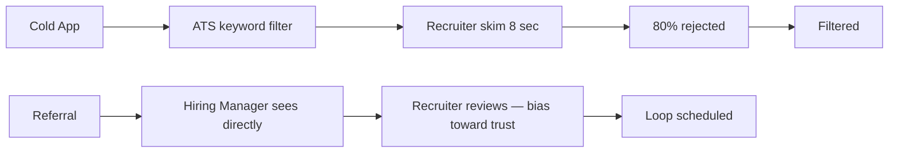
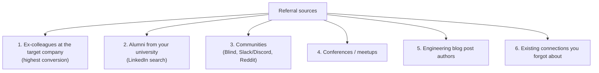
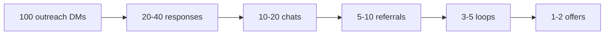

# Referrals — Sourcing and Asking

A referral is **the single highest-leverage move in your job search**. The numbers are overwhelming:

- **One referral ≈ 40 cold applications** in equivalent interview value ([The Interview Guys 2025](https://blog.theinterviewguys.com/how-many-applications-it-takes-to-get-hired-in-2025/)).
- **Employee referrals are ~18× more likely to result in a hire** than cold apps.
- **A sourced candidate is 5× more likely to be hired** than an online applicant.
- **~65% of software engineer hires come through referrals**.
- **Cold-app interview rates: 0.1-2% to offer.** At top firms, ~130 applicants per opening with ~5% interview rate.

(Multipliers vary by source — 40× / 18× / 5× — but the qualitative direction is uncontested. Referrals dominate.)

Gergely Orosz's [2025 jobs-market report](https://newsletter.pragmaticengineer.com/p/tech-jobs-market-2025-part-3): companies "can't trust inbound candidates anymore"; cold-applying engineers report being "ghosted 90% of the time"; recruiters "strongly recommend devs they worked with in the past" — **trust is now the #1 criterion**.

This topic is the **referral-sourcing playbook**: how to find referrers, how to ask, and how to scale.

## Why Referrals Win



A referral gets you past the **resume screen filter** (where 80%+ of cold apps die), gets the recruiter to **read** the resume (not skim), and signals **trust** to the hiring manager.

## Where To Find Referrers (Ranked By Conversion)



### 1. Ex-colleagues at the target company

The highest conversion rate. Search LinkedIn: filter "people" → company = target → past company = yours.

Outreach script:

> *"Hi [Name], it's been a while — saw you're at [Company] now. I'm interviewing in their senior backend space and wondering if you'd be open to a referral. Happy to share the job link + my pitch."*

### 2. Alumni from your university

LinkedIn search: filter "people" → school = your alma mater → company = target.

For India-based candidates: IIT/IIIT/NIT/BITS alumni networks are dense at FAANGM India + Indian unicorns. Hit your batch's WhatsApp/Slack channels if active.

Script (you don't know them personally):

> *"Hi [Name], I'm a [batch year] [school] alum, currently a senior backend engineer at [Company]. Noticed you're at [Target Company]. Would you be open to a 15-min chat about the team, and possibly a referral if it's a fit?"*

### 3. Communities

- **Blind** (anonymous tech): post in the company's verified board asking for a referral.
- **Slack / Discord communities**: Rands Leadership, Engineering Leadership Slack, Spring Boot Slack, Kafka Slack.
- **Reddit**: r/cscareerquestions, r/cscareerquestionsEU, r/leetcode (less for referrals more for company info).
- **Twitter/X**: many FAANGM engineers active there.

### 4. Conferences / meetups

Devoxx, SpringOne, KubeCon, JavaOne, regional Java User Groups, Google Developer Groups. Speaking at one creates referral surface; even attending and DM-ing speakers afterward works.

### 5. Engineering blog post authors

Read their post, comment thoughtfully, then DM with a relevant question. **Builds rapport before the ask**. Convert to referral after the conversation.

### 6. Existing connections

LinkedIn connections you forgot about. Run a search: "1st-degree connections at [Target Company]". You may be surprised who's there.

## The Ask Script — The High-Conversion Template

```text
Subject: Referral request — [Senior Backend Engineer, Payments] at [Company], req #12345

Hi [Name],

I'm applying for the [Senior Backend Engineer, Payments] role at [Company] —
req #12345. Our paths overlap on [Spring / Kafka / specific tech].

Would you be open to a referral? Happy to send my resume and a 3-line pitch
you can forward as-is:

  [Name] is a senior Java backend engineer with 6 YOE at [PaymentsCo].
  Shipped a payments service handling 8k RPS at p99 < 80ms on Spring Boot 3 /
  Kafka. Targeting senior backend roles in the payments space.

No pressure if not — appreciate your time either way.

Best,
[Name]
```

**Why this works**:

- **Specific role + req ID** — no ambiguity about what you want.
- **Connection point** ("our paths overlap on Spring / Kafka") — not generic.
- **Small ask** — pre-written pitch they can forward as-is. **Their effort = 3 clicks**.
- **Easy out** — "no pressure if not".

## Trust + Pre-Existing Relationship

**Cold referral requests from total strangers convert poorly** (~5-10% response rate, much lower conversion).

**Referral requests from "we briefly chatted at conf X" or "we worked together at Y"** convert at 40-60% response rate, 30-40% to actual referral.

To scale: invest 6 months ahead of when you'll need referrals. Build relationships now — attend meetups, comment on posts, DM engineers whose work you admire.

## What If You Don't Know Anyone At Your Target Company?

Sequence:

1. **DM 10 engineers at the target company** with the soft-touch chat script (from [T06](./T06-cover-letters-and-cold-outreach.md)) — *"Would you have 15 min for a chat about the team?"*
2. **Have the chat** — learn about the team, ask thoughtful questions.
3. **End with**: *"Based on what you've shared, this team sounds like a strong fit. Would you be open to referring me?"*

This works because you've **built micro-trust** through the 15-min conversation.

## Referral Bonuses — They Get Paid Too

Most FAANGM and Indian unicorns pay referral bonuses (₹50k - ₹2L in India; $1k-$10k in the US) when their referral gets hired. **Your referrer is incentivised** beyond goodwill.

You don't have to mention this; they know. It softens the ask.

## Referrals From Recruiters

Some recruiters at FAANGM have **target referrals from their network**. If you DM a recruiter and have a strong profile, they may "refer" you internally — which functions the same as an employee referral for routing purposes.

## What If They Say No?

- **Don't push back.** Polite "no problem, appreciate your time" preserves the relationship.
- **Don't ghost them.** Send a thank-you, even for a "no".
- **Re-engage in 3-6 months**. Maybe the team's hiring landscape changed.

Some common "no" reasons:

- Their company has strict referral policies (must know the candidate first-hand).
- They've used up their referral quota.
- They're laid off / inactive at that company.
- They genuinely don't want to vouch for someone they don't know.

All of these are recoverable; none are personal.

## The Referral Pipeline View



These are typical numbers for a non-pedigree candidate targeting FAANGM. For pedigree candidates, response rates 5-10× higher.

## Tracking Referrals

Per-target-company:

| Company | Role | Referrer | Date asked | Date referred | Outcome |
|---|---|---|---|---|---|

After 20-30 referral asks, you'll see what works.

## Sources & Further Reading

- [The Interview Guys — 2025 Application Volume](https://blog.theinterviewguys.com/how-many-applications-it-takes-to-get-hired-in-2025/)
- [Pragmatic Engineer — Tech Jobs Market 2025 Pt 3](https://newsletter.pragmaticengineer.com/p/tech-jobs-market-2025-part-3)
- [Hassan Osman — How to Get Referrals](https://hassanosman.com/)

## Practice

1. **List 5 target companies**.
2. **Search LinkedIn for each**: ex-colleagues at company, alumni at company, 1st-degree at company.
3. **Build a list of 30 potential referrers** (6 per company).
4. **Send 5 referral asks this week** using the ask script template.
5. **Pre-write your 3-line pitch** — keep it in a note for easy copy-paste.
6. **Build the referral tracking spreadsheet**.
7. **Schedule one networking call per week** for the next 4 weeks.

## Deeper Dive — Five Complete Referral Ask Templates

### Template 1 — Ex-Colleague at Target Company (Strongest)

> Hi [Name],
>
> Hope you're doing well! Saw on LinkedIn you've been at Stripe for 18 months
> now — congrats on the principal promo last quarter, that's awesome.
>
> Reaching out because I'm starting an active search for senior backend roles.
> Stripe's payments-platform team has been on my list for a while — saw they
> posted a Senior SDE opening last week ([req# 9381](#)). The work on
> distributed transaction guarantees overlaps almost exactly with what I've
> been building at PaymentsCo (idempotency-keyed saga across 14 services,
> ~2k tps).
>
> Would you be open to referring me for that role? Happy to share my resume +
> a short summary of the relevant work upfront so you can decide if you'd
> vouch for me. Totally fine if it doesn't feel right or you don't have time —
> appreciate you either way.
>
> Best, Aniket

Why this works:
- Acknowledges them as a person (the promo congrats)
- Specific req# / role they can look up
- Names the overlap concretely (not "I work on similar things")
- Explicit out clause — reduces social pressure
- One ask, no follow-up questions

### Template 2 — Alumni Connection (Warm — no prior working relationship)

> Hi [Name],
>
> Aniket here — we both did B.Tech at IIT Madras CSE (class of '21 here).
> Came across your profile when I was searching alumni at Google.
>
> I'm starting to look at senior backend roles and Google Bengaluru has been
> on my list. Saw the Search Platform team is hiring a Senior SWE ([job# G-2891](#)).
> Was wondering — would you be open to a 15-min chat sometime in the next two
> weeks? I'd love to learn what the team's like and, if it sounds like a fit,
> potentially ask about a referral.
>
> Some context on me: 6 YOE Java/distributed-systems, currently at PaymentsCo
> owning a 8k-RPS reconciliation service.
>
> Happy to work with whatever time fits — coffee, video call, or even just
> async over LinkedIn. Thanks in advance!
>
> Best, Aniket

Why this works:
- Establishes the connection upfront (alumni)
- Asks for a chat first — referral is a downstream possibility, not the immediate ask
- Sets the time-bound (15 min)
- Provides relevant context so they can pre-qualify you
- Flexible on medium

### Template 3 — Cold Outreach to Engineering Manager Hiring on LinkedIn

> Hi [Name],
>
> Saw your post yesterday about hiring senior Java engineers for the
> [team] team at Meta — your description of the work on [specific tech detail
> from their post] really resonated.
>
> I'm a senior backend engineer with 6 YOE, currently at PaymentsCo. Most
> relevant overlap with your post:
> - Built our idempotency framework (handles 2k tps with zero double-charges)
> - Migrated our service from synchronous to Kafka event-driven
> - Mentored 2 mid-levels through their promo cycle
>
> Resume attached. If the role feels like a fit, I'd love to be considered —
> happy to share more context async or in a quick chat.
>
> Thanks for posting publicly — it makes lateral discovery so much easier.
>
> Best, Aniket

Why this works:
- References the specific post (proves you actually read it)
- 3 bullet points of relevant overlap (concrete, with metrics)
- Resume attached (saves them a step)
- Acknowledges their effort (the closing line — small thing, big positive impression)
- No "would you be open to a 30-min chat to learn about the role" — they're busy

### Template 4 — Reactivating a Dormant Connection

> Hi [Name],
>
> Long time! Pretty sure we last chatted at the Bengaluru meetup back in
> early 2024 — you'd just joined Razorpay then.
>
> Reaching out because I noticed you moved to Atlassian. How's it going there?
>
> No agenda urgent — just genuinely curious how the move's been. Also, full
> transparency: I'm in the early stages of a job search and Atlassian's been
> on my list. So if it makes sense down the line, I might ask for your read on
> the engineering culture or even a referral. But mostly want to reconnect first.
>
> Coffee in HSR area sometime? Or video call works too.
>
> Best, Aniket

Why this works:
- Honest about why you're reaching out (no fake reconnection)
- Asks about them genuinely first
- Frames the referral ask as "down the line" — not immediate
- Specific, concrete next step (coffee in HSR)

### Template 5 — Asking a Blog/Talk Author Who Doesn't Know You

> Hi [Name],
>
> Saw your DevoxxIN talk on Kafka exactly-once last month — the section on
> producer-side idempotency vs transactional semantics was the clearest
> explanation I've come across. Already shared it with my team.
>
> Quick question that's been nagging me: in slide 47 you mentioned the
> trade-off between EOS overhead (~12% throughput hit in your benchmark) and
> using idempotent producer + dedup-window on consumer side. For workloads
> where double-processing is recoverable (we have a checksum at the end),
> which would you lean toward at 8k RPS?
>
> If you ever have time for a quick chat — would love to learn how the team
> at [Company] approaches problems like this. Also, full transparency, [Company]
> is on my shortlist for my next move; happy to share more about my background
> if it's of interest.
>
> Either way — thanks for putting the talk together publicly.
>
> Best, Aniket

Why this works:
- Specific reference (slide 47 — proves you watched)
- Asks an actual technical question first (you're not just there to ask)
- The referral ask is tucked into a paragraph about learning
- Multiple outs (just the technical reply, or chat, or referral)

## Deeper Dive — Referral Pipeline Tracking Spreadsheet

Column schema for the spreadsheet:

| Column | Type | Example |
|---|---|---|
| Date asked | date | 2026-04-12 |
| Person | text | Priya Kumar |
| Company | text | Stripe |
| Relationship | enum | ex-colleague / alumni / cold / mutual |
| Connection strength | enum | strong / warm / cold |
| Channel | enum | LinkedIn / email / Slack |
| Specific role | text | Sr SDE - Payments Platform |
| Req ID | text | 9381 |
| Status | enum | sent / responded / submitted / interview-scheduled / declined / no-response |
| Response date | date | 2026-04-15 |
| Next action | text | follow up if no response by 4/22 |
| Notes | text | She said yes; submitting on 4/16 |

### Pipeline math (concrete targets)

| Stage | Conversion target | Example |
|---|---|---|
| Asks sent | — | 30 asks |
| Asks responded to | 60-70% | 20 responses |
| Yes responses | 30-50% of responses | 8 yes |
| Submitted referrals | 90% of yes | 7 submitted |
| Interview loops triggered | 40-60% of submitted | 3-4 loops |
| Offers from referrals | 25-40% of loops | 1-2 offers |

So: 30 asks → 1-2 offers from referrals alone is the expected outcome. If
your conversion is below this, debug the funnel — usually it's:
- Asks too generic (≤30% response) → personalize more
- Yes but no submission (long wait) → follow up at day 7 / 14
- Submitted but no loop (≤30%) → resume issue, not referral issue

## Deeper Dive — When NOT to Ask for a Referral

| Situation | Better path |
|---|---|
| You worked together <3 months and weren't on the same team | Send a job-board apply; mention you know them as social proof |
| Their team is the one hiring (overlap conflict of interest) | Ask them for intro to the EM directly, not a referral |
| They've just been laid off | Wait — supporting them comes first |
| You're not actually qualified for the level | Apply 1 level down or build the missing skill first |
| It's <48 hrs after they referred 3 other people | Wait a week — referral quotas are real at most companies |
| They're a junior at the company (E2/E3) | Their referral counts but recruiter weighs senior referrers higher; target seniors |

## Deeper Dive — Following Up Without Annoying

The follow-up cadence:

- Day 0: send ask
- Day 7: if no response — one polite nudge
- Day 14: if no response — final nudge OR drop it
- Day 21+: do not follow up further

### Sample follow-up (day 7)

> Hi [Name], just bumping this up in case it got buried! No pressure — totally
> fine if you've decided to pass. Just want to make sure you got the original
> message. Thanks!

### Sample final nudge (day 14)

> Hi [Name], following up one last time on the referral ask for [Company]'s
> [Role]. I'll assume timing isn't right and stop pinging — but if it makes
> sense in the future, the door's always open. Thanks!

After this, accept the silence as a "no" and move on. Re-ask only if there's
a clear change in circumstances.

## Recap

You should now be able to:

- Internalise the **referral multiplier** (~18-40× cold-app conversion).
- Source referrers from **6 channels** (ex-colleagues, alumni, communities, conferences, blog authors, forgotten connections).
- Use the **high-conversion ask script** with pre-written pitch.
- Convert **cold connections into referrers** via the 15-min soft-touch chat.
- Track and follow up **at scale** (30 asks, 5-10 referrals, 1-2 offers).
- Handle **rejections** gracefully without burning bridges.

## Next

Continue to [Job-Search Pipeline & Application Tracking](./T08-job-search-pipeline-and-application-tracking.md).
