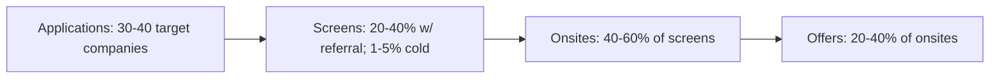
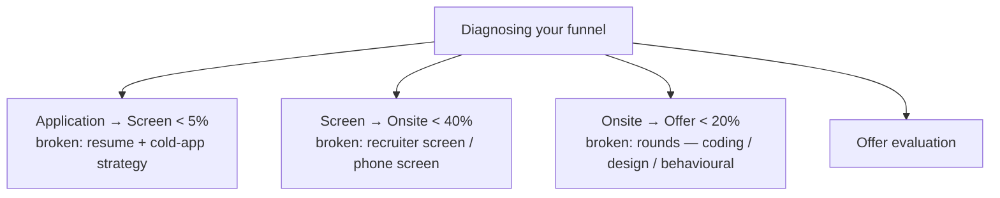

# Job-Search Pipeline & Application Tracking

A serious job search is an **engineering problem**. Treat it as a funnel with **measurable conversion at each stage**, **deliberate cadence**, and **per-stage diagnosis** when something breaks. The candidates who land FAANGM offers in 8-12 weeks are the ones who **track every application, every recruiter touch, every loop outcome**, and adjust strategy from data.

This topic is the **funnel + cadence + tracking system** for a serious FAANGM-tier search.

## The Funnel View



Per-stage benchmarks (for a competitive senior Java backend candidate):

| Stage | Cold App | With Referral |
|---|---|---|
| Application → Recruiter screen | 1-5% | 20-40% |
| Screen → Onsite | 40-60% | 50-70% |
| Onsite → Offer | 20-40% | 25-45% |
| End-to-end cold → offer | **0.1-2%** | **5-10%** |

If you're seeing significantly lower at any stage, that's the broken stage. Diagnose before sending more applications.

## Per-Stage Diagnostics



### Application → Screen rate broken

**Diagnose**:

- Are you applying mostly cold? Switch to referrals (10× the conversion).
- Is your resume single-column ATS-friendly? Run it through Jobscan.
- Are you tailoring? See [T03](./T03-tailoring-resume-per-company-and-role.md).
- Is your LinkedIn aligned with resume? See [T04](./T04-linkedin-profile-and-recruiter-seo.md).

### Screen → Onsite rate broken

**Diagnose**:

- Phone screen (coding) failing? Drill coding ([C02](../C02-dsa-for-interviews/)).
- Recruiter screen failing? You're losing on fit / level / comp mismatch — see [T02 Funnel](../C01-foundations-of-interviewing/T02-the-interview-funnel-recruiter-screen-loop-debrief-offer.md).
- Have you done a mock recruiter screen? Recruiter pre-screens still matter.

### Onsite → Offer rate broken

**Diagnose**:

- Which round consistently? Coding, design, behavioural, or LLD?
- Self-score your last 3 onsites against the rubric ([T03 Rubric](../C01-foundations-of-interviewing/T03-the-interviewer-s-rubric-signals-scoring-calibration.md)).
- Drill the weak round in mocks before the next loop.
- Have you mock-interviewed at company-specific bar (Pramp / Interviewing.io)?

## Weekly Cadence

For an employed senior candidate (10-15 hours/week):

| Day | Slot | Activity |
|---|---|---|
| **Mon** | 30 min | Source 3-5 target roles; tailor resumes |
| **Tue** | 30 min | Send 3-5 referral asks; 2-3 cold DMs |
| **Wed** | 30 min | Schedule mocks; reply to recruiters |
| **Thu** | 30 min | Follow up on outstanding outreach |
| **Fri** | OFF | Rest |
| **Sat** | 4 hr | Mock interview + post-mock review + one DSA problem |
| **Sun** | 2 hr | Week's pipeline review + planning |

For full-time job-seekers: 3-4× the above.

## The Tracking System

The bare minimum: a single spreadsheet. Recommended structure (Notion / Airtable / Google Sheets):

| Column | What |
|---|---|
| Company | Name |
| Role | Title + level |
| JD URL | Link |
| Source | Cold / Referral (name) / Recruiter outreach |
| Date applied | YYYY-MM-DD |
| Recruiter | Name + contact |
| Stage | Applied / Screen / OA / Phone / Onsite / Debrief / Offer / Declined |
| Last touch | Date of last interaction |
| Next step | What's next (recruiter follow-up, onsite scheduled) |
| Resume version | Filename or version tag |
| Cover letter? | Y/N |
| Notes | Anything important (e.g., HM name, team focus, specific questions asked) |
| Outcome | Offered / Rejected / Withdrew / On hold |

### Recommended additional columns for senior candidates

| Column | What |
|---|---|
| Level targeted | SDE-II / Senior / Staff |
| Total comp target | Rough range |
| Recruiter screen date / outcome | Date + brief notes |
| OA date / score | Date + score if known |
| Phone screen date / outcome | Date + score |
| Onsite date(s) / outcomes | Per-round if multi-day |
| Offer details | If applicable: base, signing, equity, RSU refresh |
| Negotiation rounds | Round 1 ask → Round 1 counter → Final |

## Pipeline Health Metrics

Track weekly:

- **Active pipeline depth**: how many companies are in active stages?
- **Recruiter response rate**: % of outreach that gets a reply.
- **Time-in-stage**: how long is each company sitting at "Screen scheduled" before progressing?
- **Funnel conversion rates** at each stage.

When pipeline depth drops below 3-5 active companies, **increase outreach** for the next 2 weeks.

## Avoid: Pipeline Anti-Patterns

- **Applying to everything in sight**. Spray-and-pray gets low conversion. 30-40 target companies tailored beats 200 spray-and-pray.
- **Not tracking**. Recruiter follows up 6 weeks later: *"You applied for the Senior role at [Company]"* — you have no idea what version of resume you sent, what role spec it was, who the HM was. Embarrassing and forfeits trust.
- **One company at a time**. Serial loops = 2 months per offer. Parallel loops = ~3 months for 3+ offers. Competing offers are your strongest negotiation lever.
- **No follow-ups**. Many companies go quiet for 2-3 weeks; gentle follow-up at week 1 keeps you top-of-mind.
- **Letting offers expire while waiting**. If you get an offer with a 1-week deadline and you have 3 loops in progress, **immediately ask all 3 to expedite** — most will accommodate.

## Multi-Offer Timing Strategy

```mermaid
gantt
  title Parallel-loop timing for multi-offer leverage
  dateFormat  w
  axisFormat  Week %V
  section Companies
  Company A   :a1, 0, 6w
  Company B   :a2, 1, 6w
  Company C   :a3, 1, 7w
  Company D   :a4, 2, 6w
  Company E   :a5, 2, 7w
  Negotiation window :crit, milestone, 8w, 1w
```

Start 3-5 loops within 2 weeks of each other. By week 8 you have offers landing in the same window — exactly when you want competing-offer leverage.

If one company gets ahead, **deliberately slow** by asking for "more time to discuss with my family" (legitimate). If one is behind, **expedite** by mentioning competing timeline.

## Recruiter Management

```mermaid
flowchart TB
  R[Recruiter relationship]
  R --> R1[Always reply within 24 hours]
  R --> R2[Even to "no" — graceful exits]
  R --> R3[Internal recruiters are allies]
  R --> R4[Agency recruiters take a cut — different incentives]
  R --> R5[Note their personal context — promotions, transitions]
```

Recruiters move companies. Today's recruiter at Google might be at Stripe next year. Burned bridges don't burn one company — they burn one recruiter, who is one human you'll keep encountering.

## Tools

- **Notion** templates for job-search exist (search "job search tracker Notion template").
- **Airtable** has a free tier; good for filterable views.
- **Google Sheets**: minimal, always works, exportable.
- **Huntr** — purpose-built job-search tracker; free tier.
- **Teal** — similar dedicated job-search tracker; freemium.

Most candidates over-engineer the tracker; **a simple spreadsheet with discipline beats a fancy tracker without discipline.**

## Decision Frameworks At Stage Transitions

### When you have a screen scheduled

- **Confirm role + level + comp range** before the screen.
- **Skim recent blog posts** from the team.
- **Practice your 60-second pitch** (level, last project, why this company).

### When you have an onsite scheduled

- **Reschedule prep priorities** that week — see [T06 Prep System](../C01-foundations-of-interviewing/T06-prep-system-weeks-out-plan-mock-cadence-day-of-routine.md).
- **Confirm round structure** with recruiter.
- **Ask for any prep material** they offer (Hello Interview / IGotAnOffer have company-specific).

### When you have an offer

- **Don't sign immediately**. See [T09 Negotiation](./T09-offer-evaluation-and-salary-negotiation.md).
- **Reach out to other loops in progress** to expedite or politely close.

### When you're rejected

- **Send a polite thank-you** to the recruiter.
- **Ask for feedback** (rarely given but sometimes useful).
- **Self-debrief** while it's fresh.
- **Schedule the next loop** — momentum matters.

## Sources & Further Reading

- [Tech Interview Handbook — Job Search Strategy](https://www.techinterviewhandbook.org/job-search-strategy/)
- [Huntr](https://huntr.co/) — job-search tracker
- [Teal](https://www.tealhq.com/) — job-search tracker
- [Pragmatic Engineer — Job market essays](https://newsletter.pragmaticengineer.com/)

## Practice

1. **Build your tracking spreadsheet** (use the recommended columns).
2. **List your 30-40 target companies** before applying.
3. **Run a weekly Sunday pipeline review** — 30 min planning the next week.
4. **Track funnel conversion** after 10+ applications — diagnose the broken stage.
5. **Parallelise 3-5 loops** within 2 weeks of each other.
6. **Pre-write follow-up templates** so you can send in 30 sec.

## Deeper Dive — Full Tracking Spreadsheet Schema

Build this as a Google Sheet, Notion DB, or Airtable base. Here's the complete
column schema, with definitions.

### Core columns (must have)

| Column | Type | Notes |
|---|---|---|
| Company | text | Stripe |
| Role | text | Senior Software Engineer — Payments Platform |
| Req ID / URL | url | https://stripe.com/jobs/listing/... |
| Channel | enum | referral / recruiter / direct-apply / event |
| Referrer | text | Priya Kumar (if applicable) |
| Date applied | date | 2026-04-15 |
| Stage | enum | applied / recruiter-screen / phone-screen / onsite / decision / offer / declined / withdrew |
| Stage date | date | 2026-04-22 |
| Next step | text | "Phone screen scheduled for 2026-04-28 at 14:00 IST" |
| Status | enum | active / closed-no / closed-yes / paused |
| Recruiter name | text | Jane Smith |
| Recruiter email | email | jane@stripe.com |
| Comp expectations shared | bool | true |
| Notes | long text | Initial screen: focus on idempotency, kafka EOS |

### Stretch columns (add as the search progresses)

| Column | Type | Notes |
|---|---|---|
| Team / Org | text | "Payments Platform - Charge Service" |
| Manager name | text | Met during onsite |
| Comp range (recruiter shared) | text | Base 180-220K, RSU 240K/4y, sign 30K |
| Comp offered | text | Base 210K, RSU 280K/4y, sign 40K |
| Comp negotiated to | text | Base 218K, RSU 320K/4y, sign 50K |
| Onsite date | date | 2026-05-12 |
| Onsite format | enum | virtual / in-person / hybrid |
| Interviewers | list | Sarah (HM), Raj (peer), Kim (cross-team), VP-skip |
| Loop notes | long text | Per-interview notes |
| Decision date | date | 2026-05-19 |
| Decline reason | text | "Lower comp than competing offer at Square" |

### Funnel-monitoring derived columns

Use formulas to compute conversion stages:

| Metric | Formula | Target |
|---|---|---|
| Total applied | COUNT(Stage != "withdrew") | — |
| % screen-converted | COUNT(stage > screen) / total applied | 8-15% direct, 40-60% referral |
| % onsite-converted | COUNT(stage > onsite) / COUNT(stage > screen) | 50-70% |
| % offer-converted | COUNT(stage = offer) / COUNT(stage > onsite) | 50-70% |
| Time-in-stage (days) | TODAY() - stage_date | Use to flag stale items |

## Deeper Dive — Notion Database Template

Reference Notion schema that mirrors the spreadsheet but adds relational links:

```
Database: Applications
  Properties:
    - Company (relation → Companies DB)
    - Role (text)
    - Channel (select: referral/recruiter/direct/event)
    - Referrer (relation → Contacts DB)
    - Recruiter (relation → Contacts DB)
    - Applied date (date)
    - Stage (status: applied → screen → phone → onsite → offer → closed)
    - Comp tier (select: target / stretch / reach)
    - Notes (long text)

Database: Companies
  Properties:
    - Name (text)
    - Industry (multi-select: fintech / e-commerce / FAANGM / banking / ...)
    - Office locations (multi-select)
    - HQ comp band (text)
    - Open reqs (relation → Applications)
    - Contacts (relation → Contacts)
    - Research notes (long text — paste team blog posts, recent news, layoffs context)

Database: Contacts
  Properties:
    - Name (text)
    - Company (relation → Companies)
    - Role (text)
    - LinkedIn URL (url)
    - How I met (text)
    - Last contact date (date)
    - Status (select: active / dormant / unresponsive)
```

This setup pays for itself once you've got 20+ active applications — the
relational links let you ask "all open apps at fintech companies with comp >$300K
where the recruiter has contacted me in the last 7 days."

## Deeper Dive — Weekly Sunday Review Template (30 min)

Run this every Sunday evening. Don't skip — discipline matters most when motivation dips.

```markdown
# Job Search Review — Week of 2026-04-12

## Last week — what happened (5 min)

### Applications sent
- [ ] Stripe — Sr SDE Payments — referral via Priya (Mon)
- [ ] Square — Staff SDE — direct (Wed)
- [ ] Razorpay — Sr SDE — referral via Karthik (Wed)
- [ ] DoorDash — Sr Backend — recruiter inbound (Thu)
- [ ] Plaid — Staff — referral via Vikram (Fri)

### Screens this week
- [x] Stripe — recruiter screen (Mon) — moved to phone (Tue 4/22)
- [x] Plaid — recruiter screen (Wed) — declined: comp band too low

### Interviews held
- Phone screen: Square (Thu) — moved to onsite (May 4)

### Offers
- (none)

## Funnel snapshot
- Applied this month: 18
- Recruiter screens: 9 (50% — good)
- Phone screens: 4 (44% from screen — good)
- Onsites scheduled: 2 (50% — good)
- Offers: 0 — still in flight

## Stuck items (>10 days no movement)
- Meta (applied 3/28) — no recruiter response — drop unless referral path opens
- Apple (recruiter screen 4/2) — no follow-up after wanting timeline — nudge next week

## Next week plan

### Target applications (max 5)
- [ ] PayPal — Sr SDE Risk Platform (refer via Aniket)
- [ ] Atlassian — Sr Backend Bengaluru (direct + LinkedIn EM connect)
- [ ] Adyen — Sr Engineer Payments
- [ ] Visa — Sr SDE Authorization
- [ ] Mastercard — Sr SDE Fraud Platform

### Outreach
- [ ] Follow up: Apple (nudge after 2 weeks silence)
- [ ] New connection: Mastercard EM (saw their blog post; engage on it first)
- [ ] Coffee chat: Sandeep at JPMC (Wed)

### Interview prep
- [ ] Stripe phone screen Tue → review their public engineering blog (last 6 mo)
- [ ] Stripe phone screen Tue → re-read STAR stories on payments fraud
- [ ] Square onsite May 4 → schedule mock with friend on Apr 28
- [ ] System design refresh: Twitter timeline (this weekend)

## Comp / leverage status
- Active offers: 0
- Live loops: 2 (Stripe, Square)
- Decision deadlines: none yet (Stripe likely w/o May 19, Square ~ May 25)

## Self-check
- Energy level: medium — feeling pace is too slow
- Action: pick 3 more companies and parallelize loops by mid-May
- Risk: burnout if interview count exceeds 4/week → cap at 4
```

Maintaining this discipline is what separates candidates who land 3 offers
from those who land 1 (then accept it under no leverage).

## Deeper Dive — Multi-Offer Parallelization Calendar

To get 3 offers in the same 2-week window, work backwards from the offer week.

```
Week -10: Apply broadly to 25-30 companies
Week -9:  Recruiter screens (15-20 happen here)
Week -8:  Phone screens (8-12 happen here)
Week -7:  Onsite invitations
Week -6:  Onsites batch 1 (5 companies)
Week -5:  Onsites batch 2 (5 companies)
Week -4:  Offer week (3-5 offers)
Week -3:  Negotiation
Week -2:  Decision
Week -1:  Sign
```

The critical insight: **don't accept the first offer's "decide by Friday"
deadline if other loops are still mid-flight**. Push back: "I'm in final
stages with two other companies and would like to make a coherent decision
in the next 2 weeks. Can we revisit the timeline?"

Most recruiters will accommodate this. If they won't — that's a culture signal.

## Recap

You should now be able to:

- Apply the **funnel view** and benchmark your per-stage conversion rates.
- **Diagnose** the broken stage (application / screen / onsite) and fix it.
- Run the **weekly cadence** sustainably as an employed candidate.
- Track every application with the **recommended schema**.
- Parallelise loops for **multi-offer negotiation leverage**.
- Manage **recruiter relationships** even for "no" outcomes.
- Use **purpose-built or DIY tools** with discipline over complexity.

## Next

Continue to [Offer Evaluation & Salary Negotiation](./T09-offer-evaluation-and-salary-negotiation.md).
