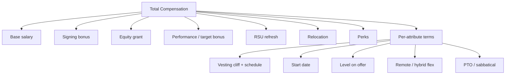
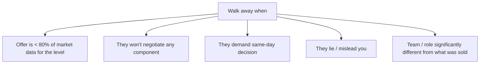

# Offer Evaluation & Salary Negotiation

Negotiation is **the highest-paying 5 hours of your career**. A skilled negotiation lifts a typical FAANGM offer by 10-30% — and that delta compounds over the entire tenure plus future jobs (since past comp anchors future comp). The single biggest leave-money-on-table is **accepting the first offer without negotiating** — out of hundreds of negotiations [Haseeb Qureshi](https://haseebq.com/my-ten-rules-for-negotiating-a-job-offer/) has handled, only ~once or twice has an offer been rescinded for negotiating politely.

This topic is the **negotiation playbook**: how to evaluate an offer beyond base salary, Haseeb Qureshi's ten rules, the ASK formula, and the scripts that actually work.

## What's In An Offer — The Full Package



**Always negotiate the full package, not just base salary.** FAANGM often won't budge much on base (anchored to band) but flexes on signing + equity + start date + level.

### What each component is worth

- **Base salary**: paid every paycheck; compounds in promotions; usually inflexible at FAANG (±5-10%).
- **Signing bonus**: one-time; often the most-flexible component for negotiation. $5k-$50k typical at FAANG.
- **Equity grant** (RSU / stock options): typically 4-year vest with 1-year cliff at FAANG. The grant size + the company stock performance over 4 years = often more than base over the same period.
- **Performance bonus**: usually 10-20% of base; tied to perf rating. Less flexible.
- **RSU refresh**: annual additional grant ("refresh"). Less prominent on offer letter but crucial for Year 2+ comp.
- **Relocation**: lump-sum (taxable) or covered (housing + flight + temporary). Negotiable.
- **Start date**: gives you time to wrap up current role + take a break.
- **Level**: the single highest-leverage dimension. L5 vs L4 = ~$80k/year difference at FAANG. Always negotiate level up if you can defend it.

## Levels.fyi — Your Single Best Data Source

[Levels.fyi](https://www.levels.fyi/) is the crowdsourced comp database. Filter to:

- Your exact level + location + recent (last 12 months).
- Median / 25th / 50th / 75th percentile.

**Anchor to the 75th percentile**, not the median, in your ask. Use the data verbally only if asked: *"Based on levels.fyi for L5 backend in NYC, total comp for this profile lands around $X."*

Levels.fyi also sells a **negotiation service** (flat fee) staffed by ex-FAANG recruiters; useful for $300k+ offers where the upside justifies the fee.

## Haseeb Qureshi's Ten Rules

From [haseebq.com](https://haseebq.com/my-ten-rules-for-negotiating-a-job-offer/) — the canonical SWE-negotiation reference:

1. **Get everything in writing.** Verbal offers drift; written ones cannot.
2. **Always keep the door open.** Never commit prematurely — once you say yes, your leverage is gone.
3. **Information is power.** Don't reveal your minimum acceptable comp. The first anchor wins.
4. **Always be positive.** Enthusiasm is leverage; sour negotiators get the floor.
5. **Don't be the sole decision-maker.** *"I need to discuss with my partner / mentor"* buys time without burning trust.
6. **Have alternatives.** Competing offers (even from less-known companies) are the strongest leverage.
7. **Proclaim reasons for everything.** Every ask comes with a rationale — never "I just want more".
8. **Be motivated by more than money.** Mention growth, team fit, technical interest — softens the money conversation.
9. **Understand what *they* value.** Companies value certainty + start dates + your skill set match. Trade these against money.
10. **Be winnable.** They need to believe a deal exists. Don't ask for the moon.

## The ASK Formula

The single most-leveraged rule: **ask higher than your real target**.

If you're offered $180k TC and you want $210k, **ask for $225-230k**.

This gives the recruiter room to "win" by negotiating you down to your real target. They go back to their team with *"I got him down from $230k to $210k"* — a win they can defend internally.

If you ask exactly for your target, you'll end up below it.

## The Negotiation Conversation Scripts

### When the recruiter calls with the verbal offer

```text
Recruiter: We'd like to extend an offer for [Senior SDE]. Base $180k, signing $20k,
           equity grant 100 RSUs over 4 years, target bonus 15%.

You:       That's exciting — thank you. I'd like to take some time to review the
           full package in writing. When can you send the formal offer?

Recruiter: We can send today. When can you give us a decision?

You:       This is a big decision and I want to discuss with my partner.
           I'll get back to you within a week with a thoughtful response.
```

**Key moves**:

- Don't say "yes" or even "I love it".
- Ask for it in writing.
- Buy time (1 week is standard; 2 weeks is reasonable for senior+).
- Don't reveal you're happy with the number.

### When they push for an immediate decision

```text
Recruiter: We need to know by Friday — the team is moving fast.

You:       I understand the urgency. I'm consulting with my partner and finishing
           interviews elsewhere this week. I can absolutely move quickly on a
           decision; would you be open to Monday week so I can give you my full
           commitment?
```

**Key move**: never accept an exploding offer (< 48 hours). Most "deadlines" are negotiable. If they truly won't move, say *"I'd love to work for you but this is a bigger decision than I can make in 48 hours. If the deadline is firm I'll have to decline."* — and most will move.

### When you have a competing offer

```text
You: I received an offer from [Other Company]. I'm excited about [This Company]
     and want to expedite — what can you do to make this work?

Recruiter: What's the other offer?

You: [Other Company] offered $200k base + $30k signing + 150 RSUs over 4 years.
     Total ~$230k/year. I'd love to be at [This Company]; what flexibility do
     you have?
```

**Key move**: state numbers in the same currency (total comp/year). Don't lie about the other offer — recruiters cross-check via internal channels, and you'll be caught.

### When you don't have a competing offer

You can still credibly walk:

```text
You: I'm grateful for the offer. Comparing to levels.fyi data for L5 backend in
     [location], the 75th percentile total comp is around $X. I'd be more
     enthusiastic about accepting at $Y — is there room to move on signing
     bonus and the equity grant?
```

**Key move**: cite data (levels.fyi), not just "I want more". Ask for movement on specific components, not "the whole package".

### When they ask "what number would close the deal?"

The classic trap. If you say a number, they'll meet it minus 5-10%.

```text
You: I'd rather not anchor on a specific number. Could you share what you'd
     consider a strong package for someone at my level, and we'll go from
     there?
```

**Key move**: deflect to them. They have a band; let them name the top of it.

## Negotiating Each Component

### Base salary

Hardest to move at FAANG — strictly banded. Movement of ±5-10% is realistic.

### Signing bonus

Most flexible component. **Start by asking for 2× their initial offer**; expect to land at 1.3-1.5×. Frame as: *"to bridge the unvested equity I'm leaving at my current role"* or *"to reflect the relocation costs"*.

### Equity grant

Often the largest dollar component. Ask for **20-50% more shares**. Frame as: *"to bring my total comp in line with levels.fyi 75th percentile"*.

### Level

The biggest lever. If they offered SDE-2 and you believe you're SDE-3, ask for re-leveling. Provide 3 examples of SDE-3-scope work in your background. May require a follow-up loop calibrated to the higher level.

### Start date

Easy to negotiate. Most companies will accommodate 2-12 weeks delay. Useful if you want a break or to wrap up a project at current job.

### Remote / hybrid flexibility

If the role is hybrid 3 days/week but you want 2 days, ask. Often flexible at senior+.

## When To Walk



Walking away is sometimes the right move. Companies that won't negotiate at all often have other rigidity problems.

## Evaluating Equity — Don't Get Burned

Equity is **risky**. Two key calculations:

### Public company (FAANG)

- RSUs valued at current stock price.
- 4-year vest, 1-year cliff (typical).
- **Don't assume stock will go up.** Use today's price for evaluation.
- Net of expected tax (RSU vests are taxed as ordinary income).

### Private company (startup / pre-IPO)

- Stock options or RSUs with strike prices.
- 4-year vest, 1-year cliff (typical).
- **Calculate dilution risk**: future funding rounds dilute your shares.
- **Calculate exit probability**: most startups don't IPO or acquihire favourably; equity is often worth $0.
- **Ask for the cap table** (% of outstanding shares your grant represents). Many startups won't share; that's a red flag.

For startups, **weight equity heavily down** in your evaluation. Don't accept startup base 30% below FAANG hoping equity makes up — most don't.

## Multi-Offer Tournament

If you have 3+ offers landing in the same week:

1. **Rank them** by total comp + team fit + growth + commute / WLB.
2. **Talk to all** about your priorities — base + signing + equity + level + start date.
3. **Use highest as anchor** for the others to match.
4. **Be honest** — don't fabricate offers; recruiters cross-check.
5. **Pick the right offer**, not the highest one. Team + tech + growth often matter more long-term than $20k base.

## Net Negotiation Outcome — Realistic Expectations

For a typical FAANG senior offer:

- Without negotiation: $180k base + $20k signing + 100 RSUs.
- With skilled negotiation: $195k base + $40k signing + 130 RSUs.

**Total uplift: ~$50-80k over 4 years** = $12-20k/year. Sometimes more if you also bump level.

This is the **highest-paying 5 hours of your year** by far.

## Common Mistakes That Cost Money

- **Accepting verbally before getting it in writing.**
- **Revealing your current salary** — illegal in many US states; never volunteer.
- **Revealing your minimum acceptable**.
- **Negotiating too aggressively** for a startup — they often have less flexibility.
- **Walking away because pride is hurt** by lowball — counter with data, don't react.
- **Not negotiating level** — biggest lever, most often skipped.
- **Letting deadlines pressure you into accepting a bad offer**.

## Deeper Dive — Four Verbatim Negotiation Exchanges

Real-world back-and-forth so you can see what good negotiation actually sounds like. Practice these aloud with a friend.

### Exchange 1 — First verbal offer (no competing offer yet)

**Recruiter (phone)**: Hi Priya, great news — we'd like to extend an offer for the
Senior SDE-II role on the Payments Platform team. Base $180k, signing $20k, 100 RSUs
over 4 years, target bonus 15%. Total target comp around $230k. What do you think?

**You**: Wow, thank you — that's exciting. Could you send me the formal offer letter
so I can review the full package in writing?

**Recruiter**: Of course, I'll have it to you within the hour. When can you give us
a decision?

**You**: This is a big decision and I want to talk it through with my partner +
finish wrapping up a couple of other conversations. I'd plan to get back to you
within a week with a thoughtful response. Does that work?

**Recruiter**: A week is fine. I'd love to know your thoughts on the offer though —
is there anything that stood out?

**You** (do NOT commit either way yet): I'll need to look at the full details +
think it through before sharing reactions. Could we set up a follow-up call for
[day] to discuss?

**Recruiter**: Sounds good — I'll send a calendar invite.

**Why this works**: doesn't say "yes," "love it," or anything that anchors you to
the initial number; buys time without making the recruiter anxious; doesn't reveal
your reaction. **Anchor preserved**.

### Exchange 2 — Follow-up call (still no competing offer; using levels.fyi)

**Recruiter**: Hi Priya — got a chance to review the offer?

**You**: I did, thank you. I'm genuinely excited about the team + the role. Want to
discuss the package though. Looking at levels.fyi data for Senior SDE-II in
[location], 75th percentile total comp is around $265k — closer to $50K above your
current offer. I'd be much more enthusiastic about accepting at that range. Is
there flexibility on signing + equity to bridge the gap?

**Recruiter**: That's a higher number than we typically come in at, but let me see
what we can do. What about base salary — is that a concern?

**You**: My main concerns are the signing bonus + equity grant; base is fine. I'd
ask for $40k signing + 130 RSUs over 4 years — would that be possible?

**Recruiter**: I'll take this back to the hiring committee + see what we can do.
I'll get back to you by [day].

**You**: I really appreciate that. I'm available any time if you have follow-up
questions.

**Why this works**: cites data (levels.fyi) as the anchor, not "I want more";
specifies which components to adjust (not "everything is too low"); names a specific
ask (signing + equity, not base) so the recruiter has a concrete deliverable;
maintains enthusiasm throughout.

### Exchange 3 — Recruiter comes back with revised offer

**Recruiter**: Hi Priya — we've revised: base $185k (small bump), signing $35k,
120 RSUs. Total target around $250k. That's our best.

**You**: Thank you — that's a real improvement, and I appreciate you advocating.
Couple of clarifying questions before I commit.

First, on the RSU refresh — what's the typical refresh schedule + amount for
someone in good standing at Year 2?

**Recruiter**: Typically $30k-40k refresh annually starting Year 2; depends on perf.

**You**: Got it. And on level — given the scope you described in the loop (multi-
team, multi-quarter projects on the platform team), would Staff Engineer be on the
table? Or is SDE-II the maximum for this role?

**Recruiter**: For this specific role, the loop was calibrated for SDE-II. Staff
would need a different loop + a different hiring committee. We could discuss in
6-9 months after you've established here.

**You**: Understood. Can we firm up the path expectation — what does "Staff in 6-9
months" actually look like? Promo packet review at that point? Or specific
deliverables?

**Recruiter**: We'd review for Staff at the next perf cycle (March), so 5-6 months
in. The bar is multi-team scope + demonstrated tech-lead behaviour.

**You**: Thanks for that clarity. I'll plan to confirm by [day]. Genuinely excited
about the team; just want to make sure I understand the full picture.

**Why this works**: probed RSU refresh (annual extra grant) — often missed but
significant; probed level escalation path (signal that you're aware of leveling
matters); didn't commit yet but communicated genuine enthusiasm. Got 2 valuable
data points (refresh range + promo cycle).

### Exchange 4 — Multiple offers; leveraging the highest

**Recruiter**: How are you leaning, Priya?

**You**: Honest update: I received another offer this week from [other reputable
company] for senior backend on their platform team — they came in at $270k total
comp ($195k base + $40k signing + 140 RSUs). I'd genuinely prefer your team — better
tech fit, better engineering culture from what I've seen — but the comp gap is
material.

**Recruiter**: Do you mind sharing details? Was that competing-offer total verbatim?

**You**: Yes — base $195k, signing $40k, 140 RSUs over 4 years, 15% bonus target.
I can forward the offer letter if helpful.

**Recruiter**: Please do. I'll take this back + see if we can match or get close.
Realistically, when do you need to decide on [other company]'s offer?

**You**: They've given me 10 business days — so end of next week. I'd like to come
back to them with my decision sooner if I can; sitting on offers makes everyone
uncomfortable.

**Recruiter**: Understood. Let me see what I can do; I'll be back to you within 48
hours.

**Why this works**: was honest about both having a competing offer AND preferring
this company; offered to verify the competing-offer claim by forwarding (signals
truthfulness); didn't lie about the timeline; gave a real deadline that's enforceable.

### What the recruiter will likely come back with

The above three exchanges yield typical results:

- **Exchange 2** (data-based, no competing offer): +$15k-25k signing typically, +20-30 RSUs over 4y. Gain: ~$10-15k/yr.
- **Exchange 3** (data + RSU refresh clarification): same comp uplift; but better Year-2+ visibility.
- **Exchange 4** (competing offer): often **full match or 90%+ match** of the other offer. Gain: ~$30-50k/yr.

A skilled negotiation cycle ends with a written revised offer that's typically 10-30% higher than the initial verbal. Don't sign on the verbal — always wait for the written.

## Deeper Dive — Verbal vs Written Offer Timeline

```text
DAY 0 — Verbal offer (phone call)
        → You: "Thanks, please send written. Need 1-2 weeks to decide."
DAY 0-1 — Written offer received via email + DocuSign portal.
DAY 1-7 — You review + research + collect competing offers if running parallel loops.
DAY 7 — Counter-offer call (Exchange 2 or 4 above).
DAY 7-10 — Recruiter returns to hiring committee + gets revised offer.
DAY 10-12 — Revised written offer received.
DAY 12-13 — Final decision call: accept or politely decline.
DAY 13 — Sign the revised offer letter.
DAY 13-30 — Background check + reference check.
DAY 30-45 — Start (typical 2-week notice; negotiable to 4-6 weeks).
```

Key insight: **never sign the verbal**. The verbal is a non-binding indication of intent. Until you have it in writing + signed, you have full negotiation latitude.

## Sources & Further Reading

- [Haseeb Qureshi — Ten Rules for Negotiating a Job Offer](https://haseebq.com/my-ten-rules-for-negotiating-a-job-offer/)
- [Tech Interview Handbook — Negotiation](https://www.techinterviewhandbook.org/negotiation-rules/)
- [Levels.fyi negotiation services](https://www.levels.fyi/services/)
- [Fearless Salary Negotiation](https://fearlesssalarynegotiation.com/)

## Practice

1. **Pull levels.fyi data** for your target level + location.
2. **Identify your minimum acceptable + ideal + reach** total comp numbers.
3. **Pre-write your negotiation scripts** for: verbal offer, exploding deadline, competing offer, no-competing-offer.
4. **Practice with a friend** — they play recruiter; you negotiate.
5. **Read Haseeb Qureshi's full essay** front to back.
6. **Map your 4 weeks before expected offers** — schedule multi-offer landing.

## Recap

You should now be able to:

- Evaluate an offer across **all components** (base + signing + equity + level + start date + flex).
- Apply **Haseeb's ten rules** in your negotiation.
- Use the **ASK formula** (ask higher than target).
- Run **scripted conversations** for each negotiation phase.
- **Walk when appropriate** — don't accept below market or under pressure.
- **Evaluate equity** at FAANG (use current price) and at startups (weight heavily down).
- Run a **multi-offer tournament** for maximum leverage.

## Next

Continue to [First 90 Days — Onboarding & Demonstrating Impact](./T10-first-90-days-onboarding-and-demonstrating-impact.md).
