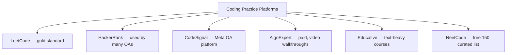

# Tools & Environment for Interview Prep

The right tools cut prep time in half and remove cognitive friction during the real loop. This reference covers the **practice platforms, collaborative editors, whiteboards, mock-interview services, IDE setup, and observability** you should set up *before* week 1 of your prep cycle.

## Practice Platforms — Coding

| Platform | Best for | Cost | Notes |
|---|---|---|---|
| **LeetCode** | Daily DSA practice | Free + Premium ($35/mo) | Company-tag filter is the killer feature on Premium |
| **HackerRank** | OA practice | Free | Many companies' OAs run here (Amazon, banking) |
| **CodeSignal** | Meta OA prep | Free | Specifically Meta's 90-min OA platform |
| **AlgoExpert** | Video walkthroughs | $99/yr | 200+ curated problems with video |
| **NeetCode** | Pattern-based study | Free | Top-150 curated list is the best free resource |
| **InterviewBit** | Indian-shop prep | Free + premium | Company-tag pages for Indian companies |
| **Educative** | Grokking the Coding Interview | $59/mo | Text-heavy pattern courses |
| **Code Forces / Code Chef** | Competitive programming | Free | Overkill for interviews; only for IOI-prep folks |

**Recommendation**: **LeetCode (Premium) + NeetCode for pattern study**. That covers 95% of needs.

## Practice Platforms — System Design

| Platform | Cost | Notes |
|---|---|---|
| **Hello Interview** | Free + paid | Company-specific guides; design walkthroughs |
| **ByteByteGo** | $19/mo | Alex Xu's newsletter + interactive courses |
| **DesignGurus** | $99/yr | Grokking the System Design Interview |
| **Educative — Grokking SD** | $59/mo | Foundational + intermediate |
| **System Design Primer (GitHub)** | Free | The canonical GitHub repo for SD prep |
| **High Scalability blog** | Free | Real-world case studies |

**Recommendation**: **System Design Primer (free) + Hello Interview** for company-specific.

## Practice Platforms — Behavioural

| Platform | Cost | Notes |
|---|---|---|
| **Hello Interview** | Paid | Behavioural prep + mock with ex-FAANG |
| **CrackTheOffer (Netflix specific)** | Paid | Netflix Keeper Test deep-dive |
| **IGotAnOffer** | Paid | Company-specific behavioural prep |
| **Apex Interviewer (Amazon LP)** | Free + paid | 16 LP STAR examples |

## Collaborative Editors (Where The Real Loop Happens)

| Editor | Used by |
|---|---|
| **CoderPad** | Meta, Apple, many others |
| **HackerRank Live** | Banks, some FAANG |
| **CodeSignal Live** | Meta phone screens |
| **Google Docs** | Google (with execution disabled) |
| **Amazon Chime + shared editor / CodePair** | Amazon |
| **Notion / Replit** | Some startups |

**Practice tip**: simulate the editor your target company uses. **Google Doc with no autocomplete is a different skill** from coding in IntelliJ; don't be surprised on the day.

## Whiteboards (System Design Drawing)

| Tool | Cost | Notes |
|---|---|---|
| **Excalidraw** | Free | The dominant remote-whiteboard for FAANG interviews |
| **Miro** | Free + paid | More features; some teams prefer |
| **Lucidchart** | Free + paid | Diagram-heavy; less common in interviews |
| **draw.io** | Free | Open-source alternative |

**Recommendation**: Excalidraw. Open, free, fast, the FAANG default.

## Mock-Interview Services

| Service | Cost | Notes |
|---|---|---|
| **Pramp** | Free | Peer-based mocks; pair-match by topic |
| **Interviewing.io** | $$ | Anonymous mocks with ex-FAANG interviewers |
| **Hello Interview** | $$$ | Design-focused mocks |
| **Karat** | Free (for candidates) | Some companies use Karat for their phone screens |
| **AlgoExpert mocks** | Included with AlgoExpert | Self-paced |

**Recommendation**: **Pramp weekly + Interviewing.io for high-stakes prep**.

## IDE Setup

For Java backend interviews:

- **IntelliJ IDEA Community** (free) — most common Java IDE; install before your loop.
- **VS Code with Java extensions** — alternative; lighter but less idiomatic.
- **OpenJDK 21** (or 17 — choose what your target stack uses).
- **Maven + Gradle** both installed; know how to run a single test class from CLI.

For machine-coding rounds:

- IntelliJ with a clean project template.
- JUnit 5 + Mockito + AssertJ on the classpath.
- Test runner shortcut bound.

## Profilers + Observability Tooling

For JVM-depth questions:

- **JFR (Java Flight Recorder)** — built into the JVM since Java 11. Know how to start/stop a recording.
- **JMC (Java Mission Control)** — GUI for JFR analysis.
- **async-profiler** — flame graphs for CPU + alloc.
- **VisualVM** — older but still useful for heap dumps.
- **Eclipse MAT (Memory Analyzer)** — heap dump deep-dive.

For Spring Boot questions:

- **Spring Boot Actuator** endpoints (`/health`, `/metrics`, `/threaddump`, `/heapdump`).
- **Micrometer + Prometheus + Grafana** for metrics.
- **OpenTelemetry + Tempo / Jaeger** for tracing.

## Note-Taking + Spaced Repetition

| Tool | Use |
|---|---|
| **Notion** | Job-search tracker, story bank, mock notes |
| **Obsidian** | Personal knowledge base; linked notes |
| **Anki** | Spaced-repetition flashcards for Q&A, patterns |
| **RemNote** | Notion + spaced-repetition hybrid |

**Anki workflow**: every concept you keep forgetting (e.g., DP recurrence templates, Spring `@Transactional` propagation modes) becomes a flashcard. Review daily for 5-10 min. Massively reduces re-relearning.

## Data Sources

| Data | Source |
|---|---|
| **Compensation** | [levels.fyi](https://www.levels.fyi/) |
| **Company-specific interviews** | LeetCode discuss, Glassdoor, IGotAnOffer, Onsites.fyi, Hello Interview |
| **Engineering blogs** | Company blogs, ByteByteGo, High Scalability, InfoQ |
| **Industry trends** | Pragmatic Engineer newsletter |
| **Indian-tier specific** | InterviewBit, GeeksforGeeks, AmbitionBox |

## Day-Of Loop Setup

Before each onsite:

- **Camera + mic test** on the platform.
- **Backup connection**: hotspot ready if home wifi flakes.
- **Notebook + pen** for sketching even in remote.
- **Water + snacks** for between-round breaks.
- **DND mode** on phone and laptop notifications.
- **Loop schedule printed** (or in a separate tab) — know each interviewer's name + round type.

## Recommended Free-Tier Stack For A Serious Cycle

For ~$50/month total:

- **LeetCode Premium** ($35/mo) — DSA practice + company tags.
- **Pramp** (free) — weekly mocks.
- **NeetCode** (free) — patterns.
- **System Design Primer** (free) — system design.
- **Hello Interview** (free articles + occasional paid mock).
- **Excalidraw** (free) — whiteboarding practice.
- **Anki** (free) — spaced repetition.
- **Notion** (free tier) — tracker.

If budget allows ($150/month):

- Add **Interviewing.io mocks** ($100+/mock).
- Add **AlgoExpert** or **Educative Grokking SD** ($99/yr or $59/mo).
- Add **levels.fyi negotiation service** when you have offers ($flat fee).

## Sources & Further Reading

- [Tech Interview Handbook — Tools](https://www.techinterviewhandbook.org/)
- [NeetCode](https://neetcode.io/)
- [System Design Primer (GitHub)](https://github.com/donnemartin/system-design-primer)
- [Hello Interview](https://www.hellointerview.com/)

## Recap

You should now have set up:

- A primary **coding practice platform** (LeetCode + NeetCode).
- A **system design study** source (Primer + Hello Interview / ByteByteGo).
- A **collaborative editor** matched to your target company's loop.
- A **whiteboard tool** (Excalidraw) and practiced sketching on it.
- A **mock-interview service** (Pramp weekly).
- An **IDE** ready for the interview (IntelliJ + OpenJDK 21).
- A **tracker** (Notion / spreadsheet).
- A **spaced-repetition tool** (Anki) for forgotten concepts.

## Next

Continue to [Hands-On — Mock Interview Gauntlet (L6 level project)](../C08-hands-on/T01-mock-interview-gauntlet.md).
