# L6 Level Project — Mock Interview Gauntlet

The L6 level project is **the capstone exercise that ties every chapter together**: you simulate a complete FAANGM loop — coding, LLD/machine-coding, HLD, behavioural, and resume rewrite — all in a single weekend, self-graded against the rubric from [T03 Rubric](../C01-foundations-of-interviewing/T03-the-interviewer-s-rubric-signals-scoring-calibration.md). The goal isn't to pass — it's to **find your two systematic gaps** before they show up in a real loop.

## The Gauntlet Structure

```mermaid
gantt
  title L6 Level Project — Mock Interview Gauntlet (weekend simulation)
  dateFormat  H
  axisFormat  Hour %H
  section Saturday
  Round 1 — Coding (45 min)         :a1, 0, 1h
  Break + self-packet                 :a2, after a1, 30m
  Round 2 — Coding (45 min)         :a3, after a2, 1h
  Break + self-packet                 :a4, after a3, 30m
  Round 3 — LLD / Machine Coding (60 min) :a5, after a4, 1h
  Break + self-packet                 :a6, after a5, 30m
  section Sunday
  Round 4 — System Design (45 min)  :b1, 0, 1h
  Break + self-packet                 :b2, after b1, 30m
  Round 5 — Behavioural (45 min, 5-6 stories) :b3, after b2, 1h
  Break + self-packet                 :b4, after b3, 30m
  Round 6 — Resume Rewrite + Negotiation Prep :b5, after b4, 2h
  Final self-debrief                  :b6, after b5, 1h
```

Realistic time budget: **~10 hours over a weekend**, plus prep.

## Pre-Gauntlet Setup (1 hour)

Before starting, lay out:

- A printed copy of each rubric ([T03](../C01-foundations-of-interviewing/T03-the-interviewer-s-rubric-signals-scoring-calibration.md), [C04/T12 Mock Rubrics](../C04-behavioral-and-company-tracks/T12-mock-interviews-and-self-grading-rubrics.md)).
- Recording setup (phone voice memo + screen recording).
- IDE + LeetCode Premium + Excalidraw + a notes app.
- A list of problems for each round (don't peek at solutions in advance):
  - Round 1: LeetCode medium #1 from your weak pattern.
  - Round 2: LeetCode medium #2 from a different weak pattern.
  - Round 3: A machine-coding problem you haven't built (Vending Machine, Hotel Booking, etc.).
  - Round 4: An HLD prompt you haven't solved (Yelp, Twitter, Spotify recommendation).
  - Round 5: 5-6 behavioural prompts your story bank should cover.
- Your current resume + a target company's job description.

## Round 1 + 2 — Coding (45 min each)

**Process per round**:

1. Set a 45-min timer.
2. Use IntelliJ (or Google Doc if simulating Google).
3. Solve the problem narrating *out loud* as if a real interviewer is there.
4. Walk through Clarify → Examples → Approach → Code → Trace → Recap.
5. At end of 45 min, stop — even if not done.

**Self-packet (30 min after)**:

Fill in the coding rubric from [C04/T12](../C04-behavioral-and-company-tracks/T12-mock-interviews-and-self-grading-rubrics.md):

- Clarifying questions asked? (Count)
- Stated brute force first? (Y/N)
- Complexity stated unprompted? (Y/N)
- Silent gaps > 30 sec? (Count)
- Took hints (if you had a partner)? (Y/N)
- Compiling code at end? (Y/N)
- Final verdict: Strong Hire / Inclined / Not Inclined / Strong No-Hire
- **One thing to fix before next mock**: single specific behaviour.

## Round 3 — LLD / Machine Coding (60 min)

Pick a problem you haven't built. Follow the [10-step framework from C03/T01](../C03-design-interviews/T01-low-level-design-ood-interviews-framework.md).

Deliverable:

- Compiling Java code with `main()` driver.
- 3-5 classes minimum showing SOLID.
- One Strategy or Factory in use.
- Custom exception per failure mode.
- 1-2 JUnit tests if time permits.

**Self-packet**:

- Compiles + runs? (Y/N)
- Class boundaries clear? (Y/N)
- SOLID applied (named)? (Y/N)
- Design pattern used? (Which?)
- Extensible to a new requirement? (Test: add VIP / new vehicle type / new state. Does it plug in cleanly?)
- **One thing to fix**.

## Round 4 — System Design (45 min)

Pick an unfamiliar HLD prompt. Follow the [7-step framework from C03/T06](../C03-design-interviews/T06-high-level-system-design-interviews-framework.md).

Whiteboard with Excalidraw. Cover:

- Requirements (functional + non-functional).
- Capacity estimation (storage, RPS, bandwidth).
- High-level architecture.
- Data model + storage choice.
- Scaling.
- Failure modes.
- Trade-offs.

**Self-packet**:

- Capacity estimate done unprompted? (Y/N)
- Drew clear architecture? (Y/N)
- Defended storage choice with reasons? (Y/N)
- Discussed sharding + replication + caching? (Y/N)
- Named failure modes? (Y/N)
- Articulated trade-offs? (Y/N)
- **One thing to fix**.

## Round 5 — Behavioural (45 min, 5-6 stories)

Pick 5-6 prompts from your weakest theme rows in the [12-story matrix](../C04-behavioral-and-company-tracks/T01-behavioral-interviews-star-car-sbi.md):

1. *"Tell me about owning a project end-to-end."*
2. *"Tell me about a tough conflict."*
3. *"Tell me about driving cross-team alignment."*
4. *"Tell me about handling ambiguity."*
5. *"Tell me about mentoring someone."*
6. *"Tell me about a failure or mistake."*

Deliver each story in 4 min using STAR. **Record yourself**.

**Self-packet** (listen back to recording):

- 'I' vs 'we' count.
- Metric per story? (Y/N each)
- Self-awareness ending (what would you do differently)? (Y/N)
- Story length (target ≤ 4 min).
- Recycling? (Same story used twice?)
- **One thing to fix**.

## Round 6 — Resume Rewrite + Negotiation Prep (2 hours)

Using your target company's job description:

- **Rewrite your summary** to mirror the JD vocabulary ([T03 Tailoring](../C05-resume-profile-and-career/T03-tailoring-resume-per-company-and-role.md)).
- **Re-order Skills** to lead with matches.
- **Promote 2-3 most-relevant bullets** to top of each role.
- **Rewrite 5 bullets** using XYZ formula with metrics ([T02 Bullet Points](../C05-resume-profile-and-career/T02-writing-impactful-bullet-points-xyz-formula-metrics.md)).

Then negotiation prep:

- Pull **levels.fyi data** for the target role + location.
- Identify your **minimum acceptable / ideal / reach** numbers.
- **Pre-write 3 scripts**: verbal offer response, exploding deadline response, competing-offer leverage.

**Self-packet**:

- Resume passes ATS preview check? (Y/N)
- All bullets XYZ-formatted? (Y/N)
- Wall-of-text bullets removed? (Y/N)
- Comp data sourced? (Y/N)
- Scripts ready? (Y/N)

## Final Self-Debrief (1 hour)

At end of Sunday:

1. **Aggregate the 6 packets** — what's the overall verdict if this were a real loop?
2. **List your 2 systematic gaps** — patterns across rounds (e.g., "I consistently skip complexity at end", "I recycle the same behavioural story for ambiguity + conflict").
3. **Build a 2-week drill plan** targeting those 2 gaps.
4. **Schedule the next gauntlet** in 4-6 weeks.

## Acceptance Criteria (When Is The Project "Complete"?)

You've completed the L6 level project when:

- ✅ You ran all 6 rounds in a single weekend.
- ✅ You filled in a self-packet for each round.
- ✅ You identified 2 systematic gaps.
- ✅ You built a 2-week drill plan addressing them.
- ✅ Your resume + negotiation scripts are ready for actual loops.

## What Good Looks Like

A strong gauntlet outcome:

- Coding rounds: 1 Strong Hire + 1 Inclined.
- LLD: compiling code with 3-5 classes, one design pattern, extensible.
- HLD: completed all 7 steps in 45 min; defended one trade-off well.
- Behavioural: 5 different stories with metrics; 4 min each; clear "I".
- Resume: ATS-passes, tailored to target JD, XYZ throughout.
- 2 gaps identified honestly; drill plan in place.

If you fall significantly short of any of these, **you've found your prep priority** — exactly the value of the gauntlet.

## Variations

- **The 4-mock gauntlet day**: run 4 mocks back-to-back in one day (4-5 hours). Simulates real onsite exhaustion. Recommended for week 11 of your prep cycle.
- **The company-specific gauntlet**: pick one target company, do their 5-round loop shape exactly. Useful 1 week before that company's real loop.
- **The peer gauntlet**: pair with another candidate; alternate "interviewer" and "candidate" roles across rounds. Most realistic mock format.

## Sources & Further Reading

- [Tech Interview Handbook](https://www.techinterviewhandbook.org/)
- [Hello Interview](https://www.hellointerview.com/) — round-by-level guides
- [Interviewing.io blog](https://interviewing.io/blog) — patterns from anonymous mock data
- [Pramp](https://www.pramp.com/) — peer mock platform

## Recap

You should now have:

- **Run the full 6-round gauntlet** in a weekend.
- **Self-packet for each round** filled in honestly.
- **2 systematic gaps identified**.
- **A 2-week drill plan** targeting those gaps.
- **A polished resume + negotiation scripts** ready for real loops.
- **The next gauntlet scheduled** in 4-6 weeks.

## Next

Continue to [Best Practices & Pitfalls — Interview Anti-Patterns](../C09-best-practices/T01-interview-best-practices-and-pitfalls.md).
