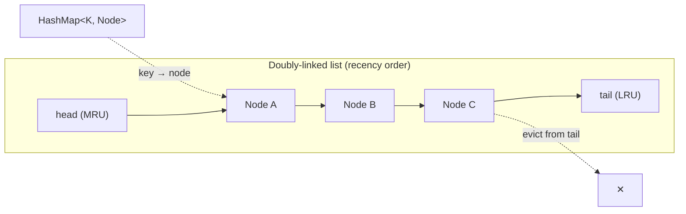

# Mock: FAANG Senior Backend — Coding Round

This is a full, turn-by-turn transcript of a **45-minute senior backend coding round** at a large-cap consumer-tech company (the "FAANG" archetype: high bar, friendly interviewer, scored against a rubric you never see). The problem is a thread-safe LRU cache with per-entry TTL — a near-canonical senior screen because it forces you to combine a data-structure choice with concurrency reasoning, the two things this level is really testing. Code is real and compiles; Big-O is stated correctly; the candidate is strong but human and recovers from one genuine stumble.

Read it twice. The **first pass**, cover the coaching callouts and try to predict what the interviewer is scoring at each turn. The **second pass**, read the callouts and the debrief. This is a *representative* mock built to teach the signals — it is **not** a leaked or proprietary question. Any resemblance to a real prompt is because this problem is industry-standard, not because it came from a specific loop.

> [!NOTE]
> **Why this exact problem shows up so often.** A thread-safe LRU+TTL cache is not an academic toy — it is one of the most *load-bearing* small components in real backend systems, which is precisely why interviewers reach for it. You have almost certainly used three or four of these without noticing. A short list of where this exact shape appears in production:
> - **Web session store.** A login service keeps the last N active sessions in memory keyed by session token, each with a 30-minute idle TTL; when memory fills, the coldest sessions get evicted to a slower backing store. LRU + TTL, exactly.
> - **Rate-limit counters.** An API gateway tracks "requests in the last 60 seconds" per API key in a fixed-size map; the TTL *is* the rate-limit window, and LRU bounds memory when a flood of new keys appears (a botnet hitting random keys).
> - **Hot config / feature flags.** A service caches feature-flag evaluations for the most-recently-seen users with a 5-second TTL so it doesn't hammer the flag service on every request, while staying fresh enough that a flag flip propagates within seconds.
> - **Dedup / idempotency windows.** A payment or message-processing pipeline remembers "message IDs seen in the last 10 minutes" to drop duplicates; the TTL bounds how far back it dedups, LRU bounds memory under a spike of unique IDs.
>
> Keep these four in your head as you read — when the interviewer asks "why these semantics?" you can answer with a concrete system instead of an abstraction, and that lands much harder.

> [!NOTE]
> **Setup.**
> **Candidate:** ~6 years backend, primarily Java/Spring, comfortable with concurrency but not a JVM internals specialist. Interviewing for **Senior Software Engineer (L5-equivalent)**.
> **Interviewer:** an engineer on a platform team, scoring against a **hidden rubric** with five signals:
> 1. **Problem clarification** — does the candidate pin down ambiguity before coding?
> 2. **Data-structure choice** — right structures, and *why*, with the right complexity.
> 3. **Correctness & Big-O** — does it work on edge cases, and is the analysis accurate?
> 4. **Thread-safety / concurrency** — single-threaded toy, or genuinely safe under contention?
> 5. **Testing & communication** — do they verify their own code and narrate their thinking?
> **Time budget:** ~5 min clarify · ~5 min approach · ~15 min implement · ~5 min complexity · ~8 min concurrency · ~5 min tests · ~2 min follow-up.

## The Transcript

### Phase 1 — Clarifying Questions (0:00–0:05)

**Interviewer:** Let's build something. I'd like you to design and implement a **fixed-capacity, in-memory cache** with two extra properties: each entry has a **time-to-live (TTL)** after which it expires, and when the cache is full we evict on a **least-recently-used** policy. Treat it like a library other teams call. Where do you want to start?

**Candidate:** Before I write anything, let me make sure I understand the contract. A few questions. First — **capacity**: is it a fixed maximum number of entries set at construction, or can it be resized at runtime?

**Interviewer:** Fixed at construction. Assume it doesn't change.

**Candidate:** Good. Second — **TTL semantics**. Is the TTL the same for every entry, or per-entry? And is it measured from *insertion* time, or does reading or updating a key refresh it?

**Interviewer:** Per-entry — the caller passes a TTL on `put`. Measure from insertion. A read does **not** refresh the TTL; an overwrite via `put` resets it.

**Candidate:** That matters a lot, and it's worth me saying why so we agree on it. "Insertion-time, not refreshed on read" is the right default for something like a **dedup window** or a **rate-limit counter** — you want "this key is valid for exactly 60 seconds from when it was written," and you specifically do *not* want a busy key to live forever just because it keeps getting read. If instead this were a **session store**, you'd often want read-to-refresh — touching the session extends the idle timeout — so I'm glad we pinned it down, because those two policies produce very different eviction behavior. I'll implement insertion-time TTL with overwrite-resets, as you specified.

> [!NOTE]
> **In Practice.** The candidate just did something subtle and high-value: they tied an abstract semantic choice ("does read refresh TTL?") to two concrete systems where the answer flips. That signals they've actually *operated* caches, not just memorized the data structure. If you can't yet do this naturally, pick one real system per semantic — "refresh-on-read = session store, fixed-from-insert = dedup window" — and rehearse it until it's reflexive.

**Candidate:** That's an important one, thank you. Third — when a `get` lands on an **expired** entry, what should happen? I'd treat it as a miss and evict it lazily on read, rather than running a background sweeper, unless you want active expiry.

> [!TIP]
> Naming "lazy expiry on read vs. an active background sweeper" unprompted is a senior signal. It shows the candidate knows there are two valid strategies and is choosing one deliberately, not stumbling into it.

**Interviewer:** Lazy on read is fine for this. Treat an expired entry as a miss and remove it.

**Candidate:** Last questions. Is this **single-threaded or concurrent**? And on eviction order — when I have to evict for capacity, "least recently used" counts both `get` and `put` as a use, correct?

**Interviewer:** Assume it will be hit by **multiple threads** — that's part of the problem. And yes, both `get` and `put` count as a use for recency.

**Candidate:** Then I'll build the data structure correct single-threaded first, get the complexity right, and then make it thread-safe — I find that ordering catches bugs that a "lock everything from the start" approach hides. Does that work for you?

> [!IMPORTANT]
> *Signal logged: problem clarification — Strong.* The candidate surfaced the five things that actually change the implementation: capacity mutability, TTL refresh-on-read, expiry-on-read behavior, concurrency, and what counts as a "use." They also proposed a build order and got buy-in. The interviewer now expects a clean structure, not a scramble.

### Phase 2 — Approach & Data-Structure Choice (0:05–0:10)

**Candidate:** The core requirement is **O(1) `get` and `put`**, including eviction. That rules out scanning for the LRU element. The standard structure is a **hash map plus a doubly-linked list**: the map gives O(1) lookup from key to node; the doubly-linked list maintains recency order, most-recently-used at the head, least-recently-used at the tail. On every access I unlink the node and move it to the head. Eviction is "remove the tail," which is O(1) because it's doubly-linked and I keep a tail pointer.

**Interviewer:** Why not just `LinkedHashMap` with access-order? It does exactly this.

**Candidate:** It does, and in production I'd reach for it — `LinkedHashMap(capacity, 0.75f, true)` with an overridden `removeEldestEntry` is the idiomatic LRU in Java. I'm choosing to hand-roll the map-plus-list here because (a) it shows I understand the mechanism rather than delegating it, and (b) I need to attach a per-entry **expiry timestamp** and do expiry-aware eviction, which is cleaner when I own the node type. If you'd rather I use `LinkedHashMap`, I can — it's a one-liner shorter.

> [!TIP]
> This is the right answer to a trap question. The interviewer offered `LinkedHashMap` to see if the candidate *knows it exists* (a junior who reinvents it without acknowledging it looks unaware) and whether they can justify hand-rolling. The candidate did both: named the library, then gave two concrete reasons to go manual. Either choice scores — refusing to acknowledge the library would not.

**Interviewer:** Quick sanity check before you start — what does the `true` argument to `LinkedHashMap(capacity, 0.75f, true)` actually do, and what would break if you forgot it?

**Candidate:** That third flag is `accessOrder`. With `false` — the default — the map maintains *insertion order*, so iterating gives you keys in the order they were first put, and a `get` doesn't move anything. With `true` it maintains *access order*: every `get` and every `put` moves that entry to the end of the iteration order, so the eldest entry is genuinely the least-recently-used. If you forgot it and left it at `false`, you'd build a FIFO cache that *looks* like an LRU in simple tests but evicts the wrong entry the moment a read rescues an old key — exactly the recency-rescue case. It's a classic silent bug: passes "put a, put b, put c, a evicted," fails "put a, put b, get a, put c — now b should go." That's also why the real test for an LRU has to include a read between writes, which I'll come back to in the testing phase.

> [!IMPORTANT]
> **In Practice.** This is a knowledge probe disguised as a one-liner, and it's a favorite because the wrong answer is invisible. A surprising number of production "LRU caches" are accidentally FIFO because someone copied `new LinkedHashMap<>(cap)` without the access-order flag. The candidate not only knew the flag but immediately named the *failure mode* and tied it to the test that would catch it — that's the difference between reciting an API and understanding it.

**Interviewer:** Hand-roll it, that's more interesting. Go ahead.



**Candidate:** So the node carries the key (I need it on eviction to remove from the map), the value, and an `expireAt` nanosecond timestamp. The map points key to node; the list orders by recency. Let me write it.

### Phase 3 — Implementation (0:10–0:25)

**Candidate:** I'll start single-threaded, sentinel head and tail nodes so I never special-case the ends.

```java
import java.util.HashMap;
import java.util.Map;

public class LruTtlCache<K, V> {

    private static final class Node<K, V> {
        final K key;
        V value;
        long expireAtNanos;      // System.nanoTime() deadline; Long.MAX_VALUE = no TTL
        Node<K, V> prev, next;
        Node(K key, V value, long expireAtNanos) {
            this.key = key;
            this.value = value;
            this.expireAtNanos = expireAtNanos;
        }
    }

    private final int capacity;
    private final Map<K, Node<K, V>> map;
    private final Node<K, V> head;   // sentinel: head.next == MRU
    private final Node<K, V> tail;   // sentinel: tail.prev == LRU

    public LruTtlCache(int capacity) {
        if (capacity <= 0) throw new IllegalArgumentException("capacity must be > 0");
        this.capacity = capacity;
        this.map = new HashMap<>(capacity * 4 / 3 + 1);
        this.head = new Node<>(null, null, 0);
        this.tail = new Node<>(null, null, 0);
        head.next = tail;
        tail.prev = head;
    }

    // --- doubly-linked list helpers (all O(1)) ---

    private void unlink(Node<K, V> n) {
        n.prev.next = n.next;
        n.next.prev = n.prev;
    }

    private void addToFront(Node<K, V> n) {
        n.next = head.next;
        n.prev = head;
        head.next.prev = n;
        head.next = n;
    }

    private void moveToFront(Node<K, V> n) {
        unlink(n);
        addToFront(n);
    }

    private boolean isExpired(Node<K, V> n, long now) {
        return n.expireAtNanos <= now;
    }
}
```

**Candidate:** Now `get`. Look up the node; if absent, miss. If present but expired, evict it and return a miss. Otherwise it's a hit — move it to the front and return the value.

```java
    public V get(K key) {
        Node<K, V> n = map.get(key);
        if (n == null) return null;
        long now = System.nanoTime();
        if (isExpired(n, now)) {
            unlink(n);
            map.remove(key);
            return null;
        }
        moveToFront(n);
        return n.value;
    }
```

**Candidate:** And `put` with a TTL. If the key already exists, update value and expiry and move to front. If it's new, create the node, add to front and the map, and if we're over capacity, evict the LRU — the node just before the tail sentinel.

```java
    public void put(K key, V value, long ttlMillis) {
        long expireAt = ttlMillis <= 0
                ? Long.MAX_VALUE
                : System.nanoTime() + ttlMillis * 1_000_000L;

        Node<K, V> existing = map.get(key);
        if (existing != null) {
            existing.value = value;
            existing.expireAtNanos = expireAt;
            moveToFront(existing);
            return;
        }

        Node<K, V> node = new Node<>(key, value, expireAt);
        addToFront(node);
        map.put(key, node);

        if (map.size() > capacity) {
            Node<K, V> lru = tail.prev;   // sentinel guarantees this is a real node
            unlink(lru);
            map.remove(lru.key);
        }
    }
```

**Candidate:** Wait — let me reconsider the eviction. When the cache is full, I'd prefer to evict an **expired** entry over a live one if there is one near the tail. Actually... no. Let me not over-engineer that. The contract says LRU eviction; an expired entry near the head is still "recently used" by clock, and scanning for expired entries breaks O(1). I'll keep strict LRU on capacity and let expiry be handled lazily on read. I'll note that as a deliberate trade-off rather than silently doing it.

> [!WARNING]
> The weaker move here is to *silently* add an "evict expired first" scan — it feels clever but it's O(n) in the worst case and changes the eviction contract the interviewer just specified. Junior candidates gold-plate; seniors name the temptation, reject it with a reason, and move on. The candidate caught themselves mid-thought, which is exactly the recovery that scores.

> [!IMPORTANT]
> *Signal logged: correctness — Strong; data-structure choice — Strong.* Sentinels, the key stored on the node so eviction can clean the map, TTL of zero meaning "no expiry," and millis-to-nanos conversion all correct. The brief wobble on eviction policy resolved itself the right way and *out loud* — that reads as judgment, not indecision.

### Phase 4 — Complexity Analysis (0:25–0:30)

**Interviewer:** Walk me through the complexity.

**Candidate:** Time first. `get` is **O(1)**: one hash-map lookup, an expiry comparison, and a constant number of pointer rewrites to move the node to the front. `put` is also **O(1)**: a hash-map lookup, constant-time list insertion at the front, and at most one eviction, which is "remove `tail.prev`" — O(1) because the list is doubly-linked and I hold a tail sentinel. There's no scan anywhere; every operation touches a bounded number of nodes.

**Candidate:** Space is **O(capacity)**. The map holds at most `capacity` entries and the list holds the same nodes — they share node objects, the map doesn't duplicate them. Per entry the overhead is the node: key and value references, a `long` deadline, and two pointers. So roughly a few machine words plus the `HashMap.Node` bookkeeping — call it a constant factor per entry, which is fine. One subtlety: an expired-but-not-yet-read entry still occupies space until something touches its key, because I expire lazily. With pure lazy expiry, dead entries can linger. If that's a memory concern I'd add active expiry.

> [!TIP]
> Volunteering the *lazy-expiry memory leak* — dead entries occupy capacity until read — before being asked is a senior tell. It shows the candidate understands the cost of the strategy they chose, not just that it passes the happy path.

**Interviewer:** Suppose 90% of entries expire but are never read again. What happens to your hit rate and memory?

**Candidate:** Memory stays pinned: those dead entries hold slots and won't be reclaimed until either their key is read (and found expired) or they're evicted as LRU. Worse, they can evict *live* entries under capacity pressure, since to the LRU policy they look like ordinary occupants. That's the case where pure lazy expiry hurts. The fix is **active expiry**: either a background thread that periodically sweeps from the tail, or — better for a cache — store expiry deadlines in a min-heap or a `DelayQueue` keyed by deadline and drain expired heads on each operation in amortized O(log n). I'd reach for the `DelayQueue` approach.

> [!IMPORTANT]
> *Signal logged: Big-O — Strong; depth — Strong.* Correct O(1)/O(capacity), and a precise, correct answer to the pathological case including the second-order effect (dead entries evicting live ones) and a concrete remedy with the right complexity. This is the kind of follow-up that separates "knows the data structure" from "has run a cache in production."

**Interviewer:** Here's a nastier edge case. Capacity is 1000, and at some instant *every* entry in the cache is expired but nothing has read them yet. A `put` of a new key comes in. Walk me through what happens, step by step.

**Candidate:** With my current code: the new node is added to the front, the map size becomes 1001, that trips the over-capacity check, and I evict `tail.prev` — the least-recently-used entry. So I evict *one* expired entry and the map drops back to 1000. The new entry lives. That's actually fine for correctness — we never exceed capacity, and the new key is reachable. The smell is that I just spent an eviction throwing out a dead entry while 999 other dead entries still occupy slots. If puts keep coming, each one evicts exactly one corpse, so the cache slowly self-heals over the next 999 puts — but until then those slots are wasted, and any *live* key I try to insert is competing against dead weight for the LRU position.

**Candidate:** Where this actually bites is a burst of new keys against an all-expired cache — picture a **rate-limiter** at the top of a new minute: every counter from last minute expired at once, and a fresh wave of distinct API keys arrives. My cache is "full" of last-minute's dead counters, so the first ~1000 new keys each pay an eviction even though there's logically tons of room. The lazy strategy is correct but it's doing O(1) cleanup when an O(n) bulk reclaim would be cheaper. This is the exact moment I'd want **active expiry** — sweep the tail, or drain a `DelayQueue` of deadlines — so the all-expired state collapses in one pass instead of bleeding out one eviction at a time.

> [!WARNING]
> **In Practice.** Notice what the candidate did *not* do: panic and declare the code broken. The all-expired-at-capacity case is correct under lazy expiry — it just isn't *efficient*. Confusing "suboptimal" with "incorrect" is a common candidate failure; conversely, claiming it's fine without naming the burst-of-new-keys pathology would be shallow. The senior move is to state precisely what's correct, what's wasteful, and the specific real-world trigger (minute rollover in a rate limiter) that turns the inefficiency into a real problem.

> [!TIP]
> A clean way to frame **expiry-on-read vs. background eviction** if asked to compare them directly: lazy/on-read expiry is *pay-per-access* — zero background cost, but dead entries linger and can pin memory or evict live keys, and you do cleanup on the latency-critical path of a `get`. Background/active eviction is *pay-a-fixed-tax* — a sweeper or `DelayQueue` reclaims dead entries promptly regardless of access, at the cost of a thread, wake-up scheduling, and lock contention with foreground ops. Redis, tellingly, does *both*: lazy expiry on access plus a sampled background sweeper, because neither alone covers every workload. Citing that "real systems combine the two" is a strong close.

### Phase 5 — Concurrency (0:30–0:38)

**Interviewer:** You said multiple threads hit this. Make it thread-safe.

**Candidate:** The structure I built is **not** safe under concurrency — `HashMap` isn't, and the linked-list pointer rewrites are read-modify-write sequences that will corrupt under a race. Two threads both moving nodes to the front can cross-link the list. So I need to serialize the mutations.

**Candidate:** The simplest correct version is **one lock guarding every operation**. I'll use a `ReentrantLock` — or honestly just `synchronized` on each method, but I'll make the lock explicit so I can talk about it.

```java
    private final java.util.concurrent.locks.ReentrantLock lock
            = new java.util.concurrent.locks.ReentrantLock();

    public V get(K key) {
        lock.lock();
        try {
            Node<K, V> n = map.get(key);
            if (n == null) return null;
            long now = System.nanoTime();
            if (isExpired(n, now)) {
                unlink(n);
                map.remove(key);
                return null;
            }
            moveToFront(n);
            return n.value;
        } finally {
            lock.unlock();
        }
    }
```

**Candidate:** `put` gets the same `lock()/try/finally` wrapper. This is **correct** — every mutation is serialized, so the map and list can never be observed mid-update. The cost is **throughput**: every operation, including reads, contends on a single lock, so under heavy load this serializes the whole cache. That's the classic problem with `synchronized` on every method — it's safe but it's a global bottleneck.

> [!IMPORTANT]
> *Signal logged: thread-safety — Strong (correct first), with awareness of the throughput cost.* Many candidates either (a) sprinkle `synchronized` and call it done without naming the bottleneck, or (b) jump straight to a lock-free design and get it subtly wrong. Correct-then-optimize, with the trade-off named, is the senior path.

**Interviewer:** It's correct but it doesn't scale. How would you get more throughput?

**Candidate:** A few options, roughly increasing in complexity.

**Candidate:** First thought is a `ReadWriteLock` so reads run concurrently — but it doesn't help here, because a "read" in an LRU cache **mutates** the recency list. `get` moves a node to the front, so it needs the write lock anyway. So a `ReadWriteLock` buys almost nothing for a true LRU. Good to rule out explicitly.

> [!TIP]
> Proactively rejecting `ReadWriteLock` with the *correct reason* — that LRU reads are writes — is a high-value move. It's a tempting wrong answer, and naming why it fails demonstrates you actually understand what your `get` does to shared state.

**Candidate:** The real answer is **lock striping / sharding**. Partition the keyspace into N independent shards by `key.hashCode()`, each shard its own `LruTtlCache` with its own lock and its own `capacity / N` budget. Operations on keys in different shards don't contend. That's effectively how `ConcurrentHashMap` gets its throughput, and how Guava's and Caffeine's caches scale. Contention drops by roughly the number of shards.

```java
public final class StripedLruTtlCache<K, V> {
    private final LruTtlCache<K, V>[] shards;
    private final int mask;

    @SuppressWarnings("unchecked")
    public StripedLruTtlCache(int capacity, int concurrency) {
        int shardCount = Integer.highestOneBit(Math.max(1, concurrency - 1)) << 1; // next pow2
        this.shards = new LruTtlCache[shardCount];
        this.mask = shardCount - 1;
        int perShard = Math.max(1, capacity / shardCount);
        for (int i = 0; i < shardCount; i++) shards[i] = new LruTtlCache<>(perShard);
    }

    private LruTtlCache<K, V> shardFor(K key) {
        int h = key.hashCode();
        h ^= (h >>> 16);                 // spread bits, like HashMap
        return shards[h & mask];
    }

    public V get(K key)            { return shardFor(key).get(key); }
    public void put(K k, V v, long ttlMs) { shardFor(k).put(k, v, ttlMs); }
}
```

**Candidate:** The honest trade-off: LRU is now **per-shard, not global** — eviction picks the least-recently-used *within its shard*, which can differ from the global LRU if the hash skews. For a cache that's almost always acceptable, and it's exactly the trade-off Caffeine makes. If I needed strict global LRU under heavy concurrency, I'd look at Caffeine, which approximates LRU/LFU with a sampling sketch (TinyLFU) rather than a single global list, precisely to avoid this lock. In an interview I'd say: striping for throughput, and reach for Caffeine in production rather than maintaining this myself.

> [!INTERVIEW]
> **Meta-coaching.** Notice the shape of this whole phase: *correct → name the cost → enumerate options → reject the tempting-but-wrong one with a reason → land on the real answer → name its trade-off → cite the production tool.* That arc is what "senior" sounds like on a concurrency question. You are not scored on reaching a lock-free masterpiece in 8 minutes — you're scored on **judgment under a trade-off** and on knowing where the real engineering risk lives. Saying "I'd use Caffeine in production" is not a cop-out; it signals you know the build-vs-buy line.

**Interviewer:** Let me push on one scenario. Say a single very hot key — a feature-flag config that every request reads — expires. A thousand threads hit `get` in the same millisecond, all miss, and all try to repopulate. How does your cache behave under that thundering herd?

**Candidate:** Two separate questions hide in there: is it *safe*, and is it *efficient*. Safety first: in the single-lock version it's safe but ugly — the thousand threads serialize on the lock, each sees the entry expired (or absent after the first removes it), and if repopulation is "load from the database then `put`," then a thousand threads each fire a database read. The cache stayed correct, but it failed at its one job — it let a stampede through to the backing store. That's the **thundering herd** (also called a cache stampede), and on a hot key it can take down the very database the cache was protecting. I've seen this exact thing in a config service: a 5-second-TTL flag expires, every pod's worth of in-flight requests misses simultaneously, and the flag service gets a synchronized spike every 5 seconds.

**Candidate:** The fix is **request coalescing** — make the *first* missing thread do the load while the others wait for its result instead of each doing their own. Concretely, store a `CompletableFuture<V>` (or a single-flight token) in the map under the key the instant the first thread decides to load; later threads that miss find the in-flight future and `join` it rather than launching their own load. Exactly one backend call happens; the herd collapses into one request fanned out to a thousand waiters. Caffeine builds this in — `AsyncLoadingCache` / `get(key, mappingFunction)` guarantees the mapping function runs once per key even under concurrent misses. So my answer is: single-flight the load, and in production let Caffeine own that guarantee rather than hand-rolling the future-juggling, which is fiddly to get right around exceptions and timeouts.

> [!IMPORTANT]
> **In Practice.** Thundering herd is the cache failure that actually pages people at 3 a.m., and it's invisible in the data-structure view of the problem — your `get`/`put` can be flawlessly O(1) and thread-safe and *still* let a stampede melt your database. The candidate split safety from efficiency, named the concrete production trigger (a short-TTL flag on a hot key), and gave the standard remedy (single-flight / request coalescing) plus the library that implements it. If you take one operational lesson from this whole transcript, make it this: **a cache's job is to protect the thing behind it, and the herd is how that job most often fails.**

> [!NOTE]
> **In Practice — adjacent mitigations worth a sentence each.** Beyond single-flight, two cheap tricks defang the herd: **TTL jitter** (add a small random spread to each entry's TTL so a batch of keys written together don't all expire on the same millisecond — this alone kills the "synchronized spike every 5 seconds" pattern), and **early/probabilistic refresh** (refresh a hot key slightly *before* it expires, in the background, so reads never see a miss on the hottest keys). Naming even one of these unprompted shows you've thought past the textbook answer.

### Phase 6 — Testing (0:38–0:43)

**Interviewer:** How would you test this? Just describe the cases, you don't need full JUnit.

**Candidate:** I'd group them. **Functional / single-threaded** first:

- **Hit and miss:** `put(a)` then `get(a)` returns the value; `get(missing)` returns null.
- **Capacity eviction order:** capacity 2; `put(a), put(b), put(c)` — `a` is evicted, `b` and `c` survive. Then a variant where a `get(a)` between the puts *rescues* `a` by making it most-recently-used, so `b` is evicted instead. That test is the one that actually verifies recency, not just size.
- **Overwrite semantics:** `put(a, v1, ttl)` then `put(a, v2, ttl)` returns `v2`, size stays 1, and recency/TTL reset.
- **Expiry on read:** `put(a, v, 10ms)`, advance the clock past 10ms, `get(a)` returns null *and* the entry is gone (size drops). I'd inject a clock — pass a `LongSupplier nowNanos` into the cache instead of calling `System.nanoTime()` directly — so the test is deterministic instead of using `Thread.sleep`.

> [!TIP]
> Calling out **clock injection** to make expiry tests deterministic is a strong, specific testing signal. `Thread.sleep(11)` in a test is flaky and slow; a controllable clock is what a senior engineer reaches for. Mentioning it unprompted scores better than any number of happy-path cases.

**Candidate:** Then **concurrency tests**, which can only show the *presence* of bugs, not their absence:

- **Concurrency safety smoke test:** N threads hammering `get`/`put` on a shared key range for a fixed duration; assert no exception escaped (a `ConcurrentModificationException` or NPE means the locking is broken) and that the invariant `map.size() == listLength() <= capacity` holds after the run.
- **Eviction-under-contention:** drive far more distinct keys than capacity from many threads and assert size never exceeds capacity at any sampled point.

I'd run those under stress — many iterations, ideally with a tool like `jcstress` for the JMM-sensitive bits — because a passing run once proves nothing about a race.

> [!IMPORTANT]
> *Signal logged: testing & communication — Strong.* Recency-specific test (the `get`-rescues-`a` case), deterministic expiry via injected clock, and the explicit caveat that concurrency tests prove presence not absence of bugs. That last point is exactly the maturity the rubric rewards.

> [!TIP]
> **In Practice.** The injected-clock point is worth one more concrete framing because it's where most real cache test suites are weakest. Picture testing the **rate-limiter** use-case: "after 60 entries in a 60-second window the 61st is rejected, then one second later a slot frees up." With `Thread.sleep`, that test takes a literal minute and is flaky on a loaded CI box; with an injected `LongSupplier nowNanos` you advance a fake clock by 61 seconds in microseconds and the test is both instant and deterministic. The same trick makes the **session-store** idle-timeout test ("inactive 30 min → evicted, active at 29 min → survives") trivial. If you wire the clock in from the constructor, every TTL-dependent scenario — dedup windows, flag freshness, rate windows — becomes a pure function of inputs you control. That is the single highest-leverage testability decision in this whole design.

### Phase 7 — Follow-ups (0:43–0:45)

**Interviewer:** Last question, quickly. This works in one process. Now I want this cache **distributed** across a fleet — many app servers sharing it. What changes?

**Candidate:** I stop building it and use a **distributed cache** — Redis or Memcached — because the moment state is shared across processes, the hard problems are network, consistency, and failure, not the data structure. Concretely:

- **TTL** maps directly: `SET key value PX <ttl>` gives Redis-native per-key expiry, and Redis already does lazy + sampled active expiry, so I get the active-sweep I hand-waved earlier for free.
- **Eviction** is a configured **maxmemory-policy** — `allkeys-lru` or, better, `allkeys-lfu` for most workloads. So LRU becomes a server config, not my code.
- **The real new problem is consistency.** A distributed cache in front of a database introduces stale reads and the classic cache-invalidation races. I'd use **cache-aside** (read-through on miss, explicit invalidation on write) and accept eventual consistency, or **write-through** if I need tighter coupling. The dangerous bug is the read-modify-write race between a DB update and a cache populate — I'd guard hot keys with a short-lived lock or versioned writes.
- **Other fleet concerns:** thundering-herd on a popular expired key (mitigate with request coalescing / a brief lock so one caller repopulates), hot-key sharding, and what happens when the cache is *down* — fail open to the DB, with a circuit breaker so a cache outage doesn't melt the database.

**Candidate:** The one-line summary: in-process, the cache *is* the source of truth for its window and my job is the data structure and the lock; distributed, the cache is a *consistency and availability* problem and my job is invalidation strategy and failure modes.

> [!IMPORTANT]
> *Signal logged: systems judgment — Strong.* The candidate correctly reframed "make it distributed" from a coding problem into a consistency/availability problem, named cache-aside vs. write-through, thundering herd, and fail-open — without rat-holing, since this was a 2-minute closer. Knowing *when to stop* is itself a senior signal.

## Debrief & Scorecard

| Rubric dimension | Signal shown | Rating |
|---|---|---|
| Problem clarification | Pinned capacity, TTL refresh semantics, expiry-on-read, concurrency, and "what counts as a use" before coding; proposed a build order | **Strong** |
| Data-structure choice | Hash map + doubly-linked list with sentinels; acknowledged `LinkedHashMap` and justified hand-rolling; correct node design | **Strong** |
| Correctness & Big-O | O(1) `get`/`put`, O(capacity) space, correct; volunteered the lazy-expiry memory cost and the dead-entries-evict-live-entries effect | **Strong** |
| Thread-safety / concurrency | Correct single-lock first with the throughput cost named; ruled out `ReadWriteLock` for the right reason; landed on striping + Caffeine | **Strong** |
| Testing & communication | Recency-specific test, injected clock for deterministic expiry, concurrency-proves-presence-not-absence caveat; narrated throughout | **Strong** |

**Verdict: Hire (Senior).** The candidate produced correct, idiomatic code with accurate complexity, treated concurrency as the core of the problem rather than an afterthought, and showed production judgment on the distributed follow-up. The single stumble — briefly considering an "evict expired first" scan — was caught and resolved out loud, which read as judgment, not weakness.

**The 2–3 changes that would raise the score toward Strong-Hire / Senior+:**

1. **Inject the clock from the start**, not just mention it during testing — pass a `LongSupplier` into the constructor in the *first* implementation. It makes the design testable by construction and shows the habit, not just the knowledge.
2. **Show the striped version's eviction trade-off with a concrete number** ("16 shards over capacity 1000 means each evicts at ~62 entries, so a hot shard can evict a globally-warm key"). Quantifying the trade-off is stronger than naming it.
3. **State the JMM guarantee explicitly** for the single-lock version — that `ReentrantLock` establishes happens-before so there are no visibility issues, not just no corruption. That extra sentence is the difference between "uses locks" and "reasons about the memory model."

## Where You'll See This On The Job

The reason this problem screens so well is that the skill transfers *directly* to backend work — you will build or debug something shaped exactly like this within your first year on almost any platform or product team. Concrete places the LRU+TTL pattern is the right tool, and what each one stresses:

| Real-world use-case | What it caches | TTL means… | Why LRU/bounding matters | The trap |
|---|---|---|---|---|
| **Web session store** | session token → user/session state | idle timeout (often refresh-on-read) | bound memory; cold sessions spill to Redis/DB | refresh-on-read vs fixed-from-insert is a *product* decision, not a default |
| **API rate-limit counters** | API key → request count in window | the rate window itself (e.g. 60s, fixed) | a key-flood (botnet) must not OOM the gateway | minute-rollover thundering herd; all-counters-expire-at-once |
| **Hot config / feature flags** | flag+user → evaluated value | freshness budget (a few seconds) | bound memory across millions of users; keep hot flags warm | one hot key expiring → stampede onto the flag service |
| **Dedup / idempotency window** | message/request ID → "seen" | how far back you dedup (e.g. 10 min) | bound memory under a spike of unique IDs | correctness depends on TTL ≥ retry horizon, or you double-process |
| **Per-request memoization** | expensive computation key → result | request or short lifetime | avoid recomputing within a hot path | stale results if TTL outlives the underlying data |

A few things to internalize from this table:

- **The data structure is the easy 20%.** In every row, the genuinely hard engineering is the *operational* edge: the stampede, the all-expired burst, the refresh-vs-fixed policy, the failure mode when the cache is down. That is exactly the weighting the interview rubric uses, and why concurrency and follow-ups carry more signal than getting `put` to compile.
- **You will rarely hand-roll this in prod** — you'll configure Caffeine (in-process) or Redis (distributed). But you *must* understand the mechanism to configure it correctly: choosing `maximumSize` vs `expireAfterWrite` vs `expireAfterAccess` vs `refreshAfterWrite` in Caffeine is *literally* choosing among the semantics this problem makes you reason about. The interview is testing whether you'd pick those knobs correctly under real load.
- **The bugs are silent.** An accidentally-FIFO "LRU" (forgot `accessOrder`), a dedup window whose TTL is shorter than the retry horizon, a session cache that refreshes on read when it shouldn't (sessions that never expire) — none of these throw an exception. They show up as a slow memory creep, a doubled charge, or a security finding. Knowing the failure modes *is* the job.

> [!INTERVIEW]
> When an interviewer asks "where would you actually use this?", do not answer "caching" — that's a non-answer. Name a *specific system and its specific semantic*: "A rate limiter, where the TTL is the rate window and LRU stops a key-flood from blowing up memory." Specificity is the tell that you've shipped this, not just studied it. The candidate in this transcript did exactly that throughout, and it's a large part of why the verdict is a clean Hire.

## Variations

- **Active expiry required.** If the interviewer says "dead entries pinning memory is unacceptable," implement the `DelayQueue` / min-heap-by-deadline variant and drain expired heads on each operation (amortized O(log n)), or a background sweeper thread — and discuss the cost of waking it.
- **LFU instead of LRU.** "Evict least-*frequently* used." Now you need a frequency count per node and a structure to find the min-frequency entry in O(1) — the classic O(1) LFU design (frequency buckets as a list of doubly-linked lists). Much harder; usually a follow-up, not the main ask.
- **Strict global LRU under concurrency.** Push back on striping: "I need exact global LRU." Discuss why that reintroduces a global serialization point and why Caffeine deliberately *approximates* with TinyLFU to avoid it.
- **`LinkedHashMap` path.** If told to use the library, show `new LinkedHashMap<>(cap, 0.75f, true)` with `removeEldestEntry` overridden, then explain why TTL still needs a per-value deadline wrapper and that the map itself isn't thread-safe — so you still need `Collections.synchronizedMap` or your own lock.
- **No-TTL simplification.** If TTL is dropped, this collapses to the canonical LRU cache (LeetCode 146) — a useful warm-up the interviewer may start from before adding TTL.
- **Refresh-on-read TTL ("sliding expiration").** "Make it a session store — reading a key extends its life by another TTL." Now `get` must also recompute `expireAtNanos = now + ttl` on a hit, which means you need to remember each entry's *original* TTL on the node (store `ttlNanos` alongside `expireAtNanos`). Discuss that this makes a busy key effectively immortal — fine for sessions, dangerous for a dedup window — and that it changes the eviction story, because now even reads touch the deadline, not just recency.
- **Thundering-herd hardening.** "A hot key expires and a thousand readers miss at once — don't let them all hit the database." Implement single-flight: store a `CompletableFuture<V>` in the map at miss time so concurrent callers join one in-flight load. Bonus branches: add **TTL jitter** so a batch written together doesn't expire on the same tick, and **early refresh** (refresh just before expiry in the background) so the hottest keys never serve a miss.
- **Negative caching.** "We keep hammering the DB for keys that don't exist." Cache the *absence* of a key with a short TTL (a tombstone / sentinel value) so misses are also cheap — common in front of a slow lookup service. Discuss the staleness risk: a key that gets created during the negative-cache window stays "missing" until the tombstone expires.
- **Bounded by bytes, not entries.** "Capacity is 512 MB, not 10,000 entries." Now eviction is driven by a running `sizeInBytes` total and a per-entry weight (a `ToIntFunction<V> weigher`), and a single large `put` may evict several entries. This is exactly Caffeine's `maximumWeight` + `weigher`; mention that estimating value size accurately is the hard part.
- **Get-or-compute API.** "Change the interface to `V get(K key, Function<K,V> loader)` so callers can't forget to populate on miss." This folds the load into the cache, which is where single-flight naturally lives, and is the shape Caffeine's `LoadingCache` actually exposes — a good moment to argue for the loader-based API over raw `get`/`put`.
- **Eviction listener / write-back.** "When an entry is evicted, I need to flush it somewhere (spill a cold session to Redis, persist a dirty value)." Add an `onEvict(K, V, RemovalCause)` callback. Discuss that the callback must run *outside* the lock to avoid holding the whole cache while doing I/O, which reintroduces ordering subtleties.

## Practice

Do these on a timer, out loud, in an empty editor. See [the DSA chapter](../C02-dsa-for-interviews/) for the underlying patterns (hashing, linked lists, heaps).

1. **20 min:** Implement `LruTtlCache` single-threaded from scratch, with an **injected clock**, and write the recency-rescue test (`get(a)` between puts changes who gets evicted). No looking back at this transcript.
2. **10 min:** Add thread-safety with a single `ReentrantLock` and write a one-paragraph explanation of the throughput cost and the happens-before guarantee.
3. **15 min:** Convert it to a striped cache and explain, with a concrete shard count and capacity, exactly how per-shard eviction can diverge from global LRU.
4. **5 min, spoken:** Answer "now make it distributed" in under two minutes without rat-holing — practice *stopping* at the right depth.
5. **10 min:** Re-solve as **LFU** eviction and feel where the O(1) design gets harder.
6. **15 min:** Implement the **refresh-on-read (sliding TTL)** variant for a session store — store the original TTL on the node and reset the deadline on every hit. Write the test that proves a key read at minute 29 survives but one untouched for 31 minutes is evicted, all on an injected clock.
7. **20 min:** Add **single-flight loading** with a `CompletableFuture<V>` so concurrent misses on one key trigger exactly one load. Then write the concurrency test: N threads, one hot key, a loader that increments an `AtomicInteger`; assert the counter ends at 1. Feel how fiddly the exception/timeout cleanup is.
8. **10 min, spoken:** Given the **rate-limiter** use-case, explain out loud what happens at the top of a new minute when every counter expires at once, why it's correct but inefficient, and which one change (active expiry, jitter, or bulk reclaim) you'd make first.
9. **10 min:** Convert eviction from **count-bounded to byte-bounded** — track a running size with a per-entry weigher and evict until under budget on each `put`. Note where a single large value can evict several entries.
10. **5 min, spoken:** For each of the four canonical use-cases (session store, rate-limit counters, hot config/flags, dedup window), state in one sentence whether TTL refreshes on read and why. Drill it until it's reflexive — it's the fastest way to sound like you've operated these.

## Recap

- **Clarify the contract before coding.** The five questions that change this implementation — capacity, TTL refresh, expiry-on-read, concurrency, what-counts-as-a-use — are the whole first phase and a graded signal on their own.
- **Hash map + doubly-linked list** gives O(1) `get`/`put`/eviction; sentinels remove edge cases; store the key on the node so eviction can clean the map. Acknowledge `LinkedHashMap` even when you hand-roll.
- **Get Big-O right and volunteer the costs** — lazy expiry pins dead entries, which can evict live ones. Knowing the cost of your own choice is the senior tell.
- **Concurrency: correct first, then optimize.** One lock is correct but a global bottleneck; `ReadWriteLock` doesn't help because LRU reads are writes; **lock striping** scales at the price of per-shard (not global) LRU; reach for Caffeine in production.
- **Test recency specifically, inject the clock, and admit concurrency tests prove presence not absence of bugs.**
- **"Make it distributed" is a consistency/availability problem, not a coding one** — Redis TTL + `maxmemory-policy`, cache-aside vs. write-through, thundering herd, fail-open. Know when to stop.
- **Tie every semantic to a real system.** Refresh-on-read vs fixed-from-insert = session store vs dedup window; the TTL *is* the rate window in a rate limiter; flags want short TTL for freshness. Naming the concrete system beats describing the abstraction every time.
- **The all-expired-at-capacity case is correct under lazy expiry, just wasteful** — each `put` evicts one corpse, so the cache self-heals over N puts. The real pain is a burst of new keys (minute rollover in a rate limiter); that's where active expiry / bulk reclaim earns its keep.
- **`LinkedHashMap`'s third arg is `accessOrder`** — without `true` you've built a FIFO cache that fails the recency-rescue test silently. The same test that catches it (a read between writes) is the one that actually proves "LRU."
- **Thundering herd is the failure that pages you.** A hot key expiring lets a stampede onto the backing store even when your `get`/`put` are flawless. Single-flight (one `CompletableFuture` per key) collapses the herd; TTL jitter and early refresh defang it further. Caffeine's `AsyncLoadingCache` gives you single-flight for free.
- **Inject the clock and you can test every TTL scenario instantly and deterministically** — rate windows, idle timeouts, dedup horizons all become pure functions of a fake clock you advance, instead of flaky `Thread.sleep`.

## Next

[FAANG Staff — System Design](./T02-mock-faang-staff-system-design.md) — the next mock steps up from a coding round to a full staff-level system design loop, where the rubric shifts from "correct code" to "scoping, trade-offs, and driving an ambiguous design end to end."
