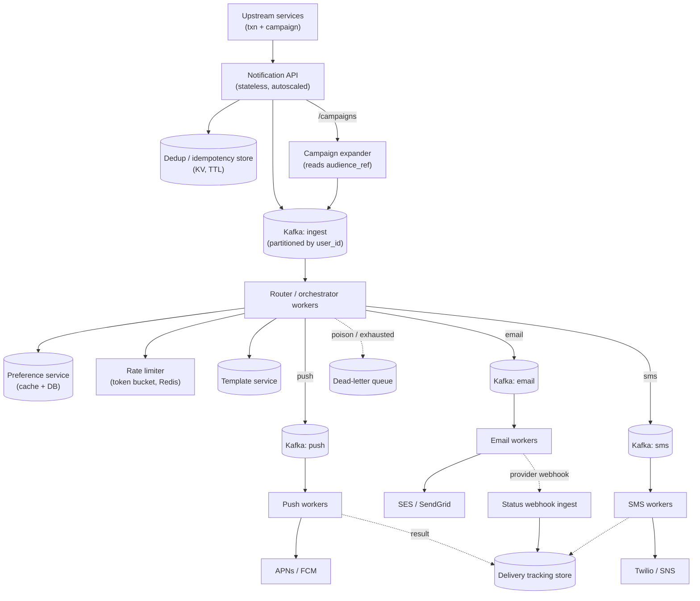
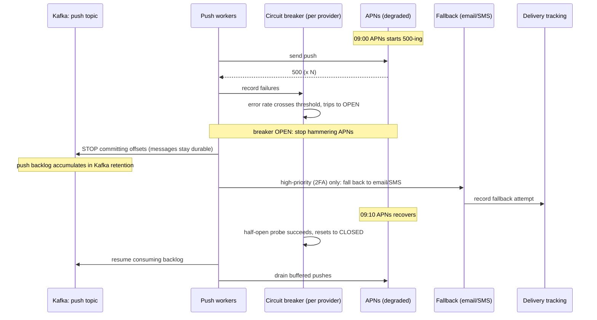
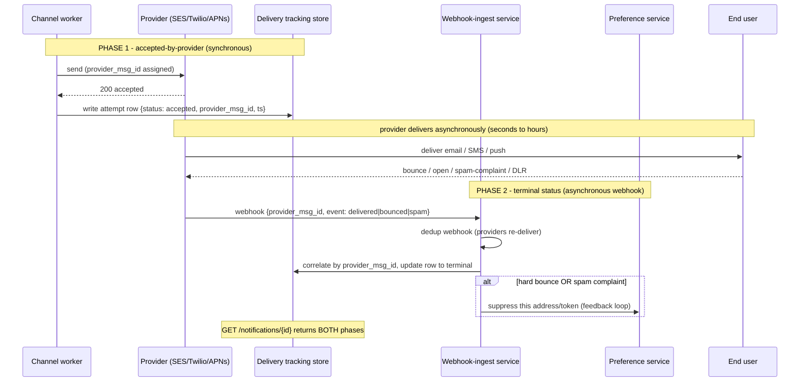
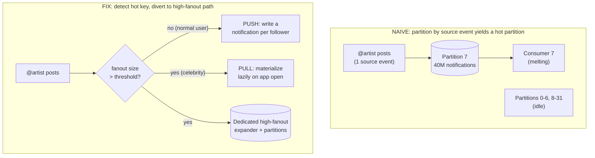
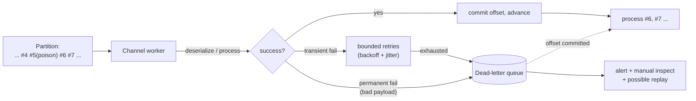

# Mock: FAANG Staff — System Design Round

This is a verbatim-style transcript of a **staff-level system design round** in the FAANG archetype: roughly 50 minutes, one open-ended prompt ("design a large-scale notification system"), and an interviewer whose job is to find the ceiling of how you think, not to check whether you can name Kafka. At staff level the bar shifts: a senior candidate is scored on whether they can produce a correct, scalable design; a staff candidate is scored on whether they **drive** the session — scope the problem, justify numbers, surface the trade-offs the interviewer was hoping to hear *before* being asked, and reason crisply about the one or two places the system actually gets hard.

Read it the way the chapter intends. Cover the coaching callouts and try to predict, turn by turn, what the interviewer is scoring and where the candidate is about to be probed. The candidate here is strong but human: they drive well, do the math, and then miss one real consideration (the celebrity/hot-key fanout problem) that the interviewer has to fish for — and then they recover cleanly, which is itself a staff signal. This is a **representative mock**, not a leaked question; "FAANG staff" denotes the format and bar, not any one company's loop.

> [!NOTE]
> **Setup**
> **Candidate profile.** ~9 years' experience, currently senior, interviewing for a **Staff Engineer (L6/E6/IC6)** backend role. Has shipped real distributed systems but has never formally "designed a notification platform" — exactly the kind of adjacent-but-unfamiliar prompt staff rounds favor.
>
> **The interviewer's hidden rubric (the staff signals).** The interviewer is not scoring "did they get the answer." They are scoring:
> 1. **Drives the problem / handles ambiguity** — do they take ownership of scope instead of waiting to be told what to build?
> 2. **Requirements & scoping** — separate functional from non-functional; name what's explicitly *out* of scope.
> 3. **Capacity estimation** — back-of-envelope math with stated assumptions; do the numbers drive the design?
> 4. **High-level design** — clean component boundaries; async decoupling; correct data flow.
> 5. **Deep dives with correct mechanisms** — idempotency, rate limiting, retries, fanout — described at the mechanism level, not buzzword level.
> 6. **Identifies bottlenecks & trade-offs** — names failure modes *unprompted*; reasons about consistency, cost, and the hot-key problem.
> 7. **Communication / leadership** — structured, time-aware, invites the interviewer in, makes decisions and owns them.
>
> **Time budget (≈50 min).** Requirements & scope 8 · Estimation 6 · API 4 · High-level architecture 8 · Data model 4 · Deep dives 14 · Failure modes & trade-offs 5 · Wrap-up 1.

## The Transcript

### Phase 1 — Clarifying Requirements & Scope (≈8 min)

**Interviewer:** Let's design a large-scale notification system. Take it wherever you want.

**Candidate:** Great — before I draw anything, let me scope it out loud and check my assumptions with you, because "notification system" can mean three very different products. Let me separate functional, non-functional, and explicitly out-of-scope, and you tell me where I'm wrong.

Functionally, I'm assuming we deliver across **three channels — push, email, and SMS** — to end users. We support two traffic classes: **transactional** sends (a password reset, an order-shipped alert — low volume per event, latency-sensitive, must not be dropped) and **bulk/marketing** sends (a "20% off" blast to tens of millions — high volume, latency-tolerant, must respect opt-outs). We need **user preferences and opt-outs** per channel and per category, **rate limiting** so we don't spam a user or blow past a provider quota, **deduplication/idempotency** so a retried request never double-sends, **retries with backoff** when a provider is flaky, and **delivery tracking** so a caller can ask "did it land?" Does that match what you have in mind?

**Interviewer:** That's the system. Keep going on non-functional.

**Candidate:** Non-functional, in priority order: **reliability first** — transactional notifications are at-least-once and effectively must-deliver; losing a 2FA code is a sev1. **Availability** over strong consistency — I'd rather accept a send and deliver it slightly late than reject it. **Latency** — transactional push should be enqueued-to-provider in, say, under a second at p99; marketing can take minutes. **Scale** — I'll size it in a moment. And **cost** matters at this volume because SMS and email providers charge per message, so wasted or duplicate sends are real money.

Out of scope, unless you want them: I'll **not** build the rich in-app inbox / WebSocket feed, I'll treat **template authoring and the marketing campaign UI** as upstream products that call us, and I'll assume **auth** is handled at the gateway. I'll mention compliance — GDPR/TCPA quiet-hours — but not design the legal engine. Fair?

> [!TIP]
> Notice the move: the candidate **declares what's out of scope** before being asked. At senior level you answer the question; at staff level you *bound* it. Naming the in-app inbox and campaign UI as out-of-scope tells the interviewer "I know those exist and I'm choosing to focus" — that's leadership, not a knowledge gap.

**Interviewer:** Good. Let's say in-app inbox is out. One question — who calls you?

**Candidate:** Other backend services, mostly. So our front door is an **internal API** — synchronous accept, asynchronous deliver. A caller does `POST /notifications` and gets back a 202 with an ID; they do *not* block on actual delivery. For marketing, the campaign service hands us an audience reference and a template, not 40 million individual requests — that distinction will matter for fanout. Let me put numbers on it.

### Phase 2 — Capacity Estimation (≈6 min)

**Candidate:** Let me size this so the math drives the design rather than the other way around. I'll state every assumption.

```text
ASSUMPTIONS
- Total users:                 300,000,000  (3 x 10^8)
- Daily active users (DAU):    100,000,000
- Avg transactional notifs / DAU / day:   5
- Marketing: a few large blasts/day, biggest ~ 50M recipients

TRANSACTIONAL THROUGHPUT
- Daily transactional volume = 100M DAU x 5 = 500,000,000 / day
- Seconds per day            ≈ 86,400
- Average QPS                = 500M / 86,400  ≈ 5,800 /s
- Peak factor (diurnal, ~5x) => peak ≈ 30,000 /s  (round to 30k)

MARKETING / FANOUT (the spiky part)
- A 50M-recipient blast we deliver over ~15 min (900s) to be gentle
- Fanout rate = 50,000,000 / 900 ≈ 55,000 /s   (sustained, on top of txn)
- So channel workers must absorb ~30k txn + ~55k bulk ≈ 85k /s peak
- We DON'T accept 50M API calls — we accept 1 campaign request and
  expand it internally. Expansion is the real load, not ingestion.

STORAGE (delivery tracking)
- Records/day ≈ 500M txn + (say) 200M marketing = 700M /day
- Per record ≈ 300 bytes (ids, channel, status, timestamps)
- Raw/day ≈ 700M x 300B ≈ 210 GB/day
- Retain hot status 30 days => ~6.3 TB; older rolls to cold storage

DEDUP STORE
- Keep idempotency keys ~24–72h. Peak inserts track send rate (~85k/s).
- 85k/s x 86,400 ≈ 7.3B keys/day; at ~50B/key ≈ 365 GB/day of keys
  in a TTL'd KV store -> shard it, expire aggressively.
```

So the headline numbers: **~30k QPS transactional peak, ~85k/s of channel sends at peak with a marketing blast running, ~200 GB/day of delivery records, and a dedup store taking ~85k writes/s with short TTL.** Those three numbers — peak send rate, the fanout-from-one-request pattern, and the dedup write rate — are what I'll design around.

> [!IMPORTANT]
> The estimation is *load-bearing*, not decorative. The candidate immediately converts the numbers into three design constraints. A weak candidate computes QPS and then never refers to it again. The single best line here is **"we don't accept 50M API calls — we expand internally"**: it reframes the entire ingestion path and quietly sets up the fanout deep dive.

**Interviewer:** I like that you separated ingestion load from fanout load. Show me the API.

### Phase 3 — API Design (≈4 min)

**Candidate:** Two surfaces — a transactional send and a campaign trigger — plus a status read.

```text
POST /v1/notifications                 (transactional, single recipient)
  Idempotency-Key: <caller-supplied UUID>     # header, REQUIRED
  body:
    user_id, category ("security"|"txn"|"marketing"),
    channel_preference ["push","email","sms"]  # ordered fallback, optional
    template_id, template_params {...},
    priority ("high"|"normal"), ttl_seconds
  -> 202 Accepted { notification_id }

POST /v1/campaigns                      (bulk; expanded internally)
  Idempotency-Key: <campaign UUID>
  body:
    audience_ref (segment id or query handle), template_id,
    channel, category, throttle_rate_per_sec, window
  -> 202 Accepted { campaign_id }

GET  /v1/notifications/{id}             -> { status, per_channel_attempts[] }
```

Two deliberate choices. First, **idempotency is a required header on writes**, not optional — the contract is "send me the same key, I'll give you the same outcome, exactly once delivered." Second, the campaign endpoint takes an **audience reference**, not a recipient list, so the request stays tiny and we own the expansion. `channel_preference` is an *ordered fallback* — try push, fall back to email if there's no device token — but I'll treat that as a v2 nicety so I don't over-scope.

### Phase 4 — High-Level Architecture (≈8 min)

**Candidate:** Here's the shape. The spine is: **synchronous ingest → durable queue → routing → per-channel queues → per-channel workers → providers**, with preference, dedup, rate-limit, and tracking hanging off it.



Walking the path: the **API is stateless** and just does three cheap things — check the dedup store, persist an "accepted" record, and produce one message to the **ingest Kafka topic** — then returns 202. Kafka is the durability boundary: once the event is in Kafka, we own delivery and the caller is off the hook. I'd **partition the ingest topic by `user_id`** so that all of one user's notifications are ordered and land on the same consumer — that's what makes per-user rate limiting and dedup cheap.

The **router** is where the policy lives: it looks up the user's **preferences** (did they opt out of marketing email?), checks the **rate limiter**, renders the **template**, and then fans the message out to the right **per-channel Kafka topic**. Splitting per channel matters because the channels have wildly different rates and failure profiles — APNs is fast and reliable; SMS is slow, carrier-rate-limited, and expensive — so I want to scale and throttle their worker pools independently. The **channel workers** are the only components that talk to providers, and they're the layer that owns retries.

> [!INTERVIEW]
> **Meta-insight:** the single most common reason a strong engineer fails a staff design round is doing *all* of this and never saying *why each boundary exists*. The interviewer already knows what a queue is. What they're scoring is whether you can articulate **"per-channel topics so I can scale and throttle SMS independently of push"** — the boundary justified by a property of the domain. Decompose the system, then defend each cut. Components without justification read as memorized; justified cuts read as judgment.

**Interviewer:** Why a separate router instead of doing preferences and rate limiting at the API?

**Candidate:** Because the API must stay cheap and fast to keep ingest latency low and to absorb spikes — every millisecond of synchronous work there is multiplied by 30k QPS. Preference lookups, template rendering, and rate-limit decisions are heavier and, crucially, **retryable** — if rate limiting says "hold this user for 30 seconds," I want that to happen *behind* the durability boundary, on a consumer that can pause and re-poll, not on the caller's thread. Doing policy after Kafka means the caller's 202 never depends on a slow preference DB.

### Phase 5 — Data Model (≈4 min)

**Candidate:** Three stores, chosen by access pattern.

```text
preferences (per user) — read-heavy, point lookups
  PK user_id
  per-channel + per-category opt-in flags, quiet hours, device tokens[]
  -> KV / wide-column (Cassandra/DynamoDB), cached hot in Redis

idempotency / dedup — write-heavy, TTL, point lookups
  PK idempotency_key
  value { notification_id, status, first_seen }   TTL 24–72h
  -> Redis or DynamoDB w/ TTL; sized for ~85k writes/s

delivery_tracking — append-heavy, range reads by user/time
  PK (user_id, notification_id)  +  per-attempt rows
  { channel, provider, status, attempt#, ts, provider_msg_id }
  -> wide-column / time-series; hot 30d, then to object storage (Parquet)
```

The shape follows the load. Preferences are read-mostly and tiny per user, so wide-column with an aggressive Redis cache. The dedup store is the write-rate monster, so it's a TTL'd KV store, partitioned, where I never keep a key longer than the retry window needs. Delivery tracking is an append-mostly log queried by "show me this user's recent notifications," which is exactly a wide-column / time-series fit, rolled to cheap Parquet in object storage after 30 days.

### Phase 6 — Deep Dives (≈14 min)

**Interviewer:** Let's go deep. Walk me through idempotency end-to-end — I send the same request twice.

**Candidate:** The contract is **exactly-once delivery from a producer's point of view**, even though every link in the chain is at-least-once. Three layers:

1. **At ingest (the API):** the caller's `Idempotency-Key` is checked against the dedup store with an atomic **insert-if-absent** (`SETNX` in Redis, or a conditional put in DynamoDB). First time, I store `{key -> notification_id, status=accepted}` and proceed. On a duplicate, I find the key and return the *same* `notification_id` with its current status — I never produce a second Kafka message. This kills caller-level retries (the classic "the 202 timed out so they retried").

2. **Inside the pipeline:** Kafka is at-least-once, so a router consumer can process the same message twice after a rebalance. I make the router's effect idempotent by deriving a deterministic **send-key** = `hash(notification_id, channel, attempt-bucket)` and recording "this send-key was dispatched" before handing to the channel worker. A redelivery sees the send-key and skips.

3. **At the provider:** this is the honest part — true exactly-once at the carrier is impossible; APNs/SES can themselves duplicate, and many providers accept their own idempotency token. So I pass a provider idempotency key where supported and otherwise accept that the *residual* duplicate rate is tiny and bounded. I'd tell a stakeholder "exactly-once at the API, at-least-once with strong dedup downstream," not promise physics I can't deliver.

One sizing note, since the dedup store is on the hot path of every write: at ~85k inserts/s peak I can't keep keys forever, and I don't need to — the only thing the key protects against is a caller *re-sending the same key*, which happens within their retry window, not days later. So I TTL keys to 24–72h, which caps the store at a few hundred GB rather than unbounded growth, and I shard by a hash of the key so no single Redis node is the bottleneck. The store being **TTL'd and sharded** is what makes this rate affordable.

**Interviewer:** Make it concrete for me. Suppose the idempotency key were *missing* — the caller's client library forgot to set it. Walk me through the incident that causes.

**Candidate:** This is the duplicate-send incident, and it's worth making vivid because it's the single most common production fire in a notification platform. Picture the order-shipped flow: the order service calls `POST /v1/notifications` to send "Your package is on the way." Its first attempt takes 1.2 seconds because our preference DB had a slow moment; the order service's HTTP client has an 800ms timeout, so it gives up, *assumes failure*, and retries. Now there are two requests in flight for the same logical event. With the idempotency key present, the second request hits the dedup store, finds the key, and returns the original `notification_id` — one email. With the key *missing*, both requests look brand new: two Kafka messages, two router passes, two provider hand-offs, two emails. The customer gets "Your package is on the way" twice.

That sounds harmless until you scale it. The same timeout-and-retry pattern fires under load — exactly when the preference DB is slow *because* of load — so the duplicates correlate with traffic spikes. A single retrying caller during a bad five minutes can double a few hundred thousand sends. If it's an SMS, that's real money out the door at a few cents each; if it's a marketing email, it's a sender-reputation hit and a wave of "stop spamming me" complaints; if it's a 2FA code, the user now has two valid codes and a confused support ticket. That's why I make the key a **required header that the API rejects the request without** — I don't want idempotency to be something a caller can forget. The contract is enforced at the door, not hoped for.

> [!IMPORTANT]
> Notice the candidate doesn't just *describe* idempotency — they reach for a concrete, relatable incident (the order-shipped double-send born from a client timeout) and trace it to business consequences: wasted SMS spend, sender-reputation damage, a 2FA support ticket. At staff level, *"a missing key causes duplicates"* is a fact; *"here is the exact timeout-retry sequence, here is who gets paged, here is the dollar cost"* is judgment. Enforcing the key at the API door — rejecting requests without it — is the design decision that follows from having lived the incident.

One sizing note, since the dedup store is on the hot path of every write: at ~85k inserts/s peak I can't keep keys forever, and I don't need to — the only thing the key protects against is a caller *re-sending the same key*, which happens within their retry window, not days later. So I TTL keys to 24–72h, which caps the store at a few hundred GB rather than unbounded growth, and I shard by a hash of the key so no single Redis node is the bottleneck. The store being **TTL'd and sharded** is what makes this rate affordable.

> [!WARNING]
> The trap here is claiming "exactly-once delivery" as an absolute. Distributed exactly-once *delivery* across an external SMS carrier is not achievable; what's achievable is **exactly-once processing with idempotent effects** plus provider-level dedup. The candidate naming that boundary — "I won't promise physics I can't deliver" — is a stronger signal than a candidate who confidently claims end-to-end exactly-once, because the latter reveals they don't know where the guarantee actually breaks.

**Interviewer:** Let me push on the words. You keep saying "at-least-once with dedup." Some people would say "exactly-once." Give me a worked example that shows the difference — a sequence where at-least-once plus dedup produces the right outcome.

**Candidate:** Sure — let me trace one message through a redelivery and show where dedup earns its keep. Say notification `N` is a 2FA code for user `U`, channel `push`.

```text
WORKED EXAMPLE — at-least-once delivery + idempotent effects = "effectively once"

t0  API: Idempotency-Key=K arrives. SETNX K -> stored. notification_id=N. Produce N to ingest. Return 202.
t1  Router consumer C1 polls N. Derives send-key S = hash(N, "push", bucket0). Records "S dispatched". Hands to push worker.
t2  Push worker calls FCM. FCM accepts. Attempt row: accepted.
t3  ** Kafka rebalance ** — partition reassigned; offset for N had not committed.
t4  Router consumer C2 RE-polls N (at-least-once: same message, second time).
t5  C2 derives the SAME send-key S = hash(N, "push", bucket0). Looks it up: "S already dispatched." SKIPS. No second hand-off.
--- Net effect: FCM was called exactly once. User got ONE code. ---

CONTRAST — what at-least-once WITHOUT dedup would have done:
t5' C2 re-polls N, hands to push worker again, FCM called twice, user gets TWO codes.
```

The key insight is that **the delivery channel is at-least-once — Kafka *will* sometimes hand you the same message twice — but the *effect* is made idempotent** by the deterministic send-key. "Exactly-once delivery" would mean the message is physically transmitted across the network exactly once, which no system can promise across a rebalance or a network partition. "At-least-once with idempotent effects" means: it may be *processed* more than once, but the observable result — one push to the user — happens once. That's the honest guarantee, and the worked example is how I'd explain it to a junior engineer who's confused about why we don't just "turn on exactly-once."

> [!NOTE]
> The worked example is doing pedagogical work that a bare claim cannot. By tracing a *specific* redelivery — Kafka rebalance at t3, the same deterministic send-key derived at t5, the skip — the candidate proves they understand the mechanism rather than reciting the slogan. The contrast block (what would happen *without* dedup) is the tell of someone who has debugged a real double-send. In an interview, when you assert a guarantee, immediately offer the smallest example that distinguishes it from the guarantee people confuse it with.

**Interviewer:** Good. Rate limiting — a user shouldn't get hammered, and we shouldn't blow a provider quota. How?

**Candidate:** Two *different* limits with two *different* keys. **Per-user limiting** protects the human: a token bucket keyed by `(user_id, category)` — e.g., at most N marketing pushes/hour — implemented in Redis with an atomic Lua script so the check-and-decrement is race-free. Because I partitioned ingest by `user_id`, the router consumer for a user is effectively single-threaded for that user, which makes the bucket cheap and contention-free. If the bucket is empty, I don't drop — I **defer** by re-enqueuing with a delay (or parking on a per-user delay topic) so the notification still lands later, respecting quiet hours.

**Provider quota limiting** protects the *provider relationship*: Twilio gives you a messages-per-second ceiling per number/account, SES has a send-rate cap. That's a **global** limit shared across all SMS workers, so it lives as a distributed token bucket in Redis keyed by provider, and the SMS worker pool collectively pulls tokens. When tokens run dry, the workers apply **backpressure** — they slow their Kafka consumption rather than failing sends — which is the right behavior because the channel queue absorbs the burst.

> [!TIP]
> Two keys, two intents — that distinction (**protect the user** vs. **protect the provider relationship**) is the staff-level discriminator. A senior answer is "use a token bucket." A staff answer explains that the per-user limit and the global provider limit are *different problems with different blast radii* and shows that backpressure (slow consumption) beats rejection (drop sends) when the queue is your shock absorber.

**Interviewer:** Let me make that concrete with two real workloads. A **2FA / OTP code** for one user logging in, versus a **50-million-recipient "20% off everything" marketing blast**. Same rate-limiting rules for both?

**Candidate:** No — and this is exactly where the two traffic classes I scoped earlier earn their keep, because they hit the limiter from opposite directions. Let me contrast them along every axis that matters:

```text
                    2FA / OTP (transactional)        50M MARKETING BLAST (bulk)
SLA                 enqueue-to-provider < 1s p99     deliver over ~15 min is fine
Volume per event    1 recipient                      50,000,000 recipients
Per-user limit      MUST bypass / very high ceiling  strict: e.g. <=1 marketing push/user/day
                    (never throttle a login code)
Quiet hours         IGNORED (security overrides)     RESPECTED (no 3am coupon push)
Provider quota      reserve headroom; high priority  fills spare capacity, preemptible
Batching            none — send immediately          batch by chunk; throttle the expansion
Idempotency window  short, per login attempt         per (campaign_id, user_id)
Failure direction   fail toward delivery (dupe ok)   fail toward NOT sending (dupe annoying)
```

The OTP is latency-sensitive and security-critical, so the per-user bucket has to *exempt* it — you never want to tell a user "you've hit your notification limit, no login code for you." It also overrides quiet hours, because a 3am login is a 3am login. The marketing blast is the mirror image: the per-user limit is *strict* (one marketing message a day, say), quiet hours are *respected*, and it's the elastic class that fills whatever provider headroom the transactional traffic leaves. So the rate limiter isn't one policy — it's **keyed by `category`**, and `category` decides whether a send bypasses the per-user bucket, whether quiet hours apply, and which way it fails. Same machinery, opposite tuning.

> [!IMPORTANT]
> This is the "relatable scenario" doing real design work. By forcing the candidate to put a 2FA code and a 50M blast through the *same* limiter, the interviewer checks whether the candidate sees that **`category` is a first-class routing dimension**, not a label. The strong answer notices that *every* policy axis — per-user ceiling, quiet hours, batching, failure direction — flips between the two classes, which is why they can't share one configuration. A weaker candidate applies one token bucket to both and silently throttles a login code.

**Interviewer:** Earlier you said the per-user bucket is keyed by `(user_id, category)`. Why not also limit per channel? Walk me through per-user versus per-channel.

**Candidate:** Because they answer different questions, and you usually want both at once. **Per-user limiting** answers *"is this human getting too many messages?"* — it's about the recipient's experience and is channel-agnostic in spirit: ten pushes plus ten emails plus ten texts in an hour is still a spammed user even though no single channel looks abusive. So the per-user bucket is keyed by `(user_id, category)` and, for the "am I annoying this person overall" check, sometimes `(user_id)` across channels.

**Per-channel limiting** answers a *completely different* question: *"can this delivery pipe physically and economically absorb the load?"* SMS is carrier-rate-limited and costs real money per message; push is effectively free and high-throughput; email sits in between with reputation constraints. Those are properties of the *pipe*, not the *person*. So the per-channel limit is really the provider-quota limit I described — keyed by provider/channel, global across all workers for that channel. Concretely: a single user might be under their per-user ceiling (only their 3rd push this hour), but the SMS *channel as a whole* could be at its Twilio ceiling, so a fallback-to-SMS for that user has to wait. Two independent gates: one protects the person, one protects the pipe. You need both because a system that only limited per-user could still melt a provider during a blast, and a system that only limited per-channel could still spam one unlucky user who happens to trigger many events.

> [!TIP]
> The discriminator: **per-user is about the recipient's experience; per-channel is about the pipe's capacity and cost.** A candidate who collapses them into "rate limiting" misses that a user under their personal ceiling can still be blocked by a channel at quota, and vice versa. Naming the two questions explicitly — *"is this human getting too many messages?"* vs. *"can this pipe absorb the load?"* — is the kind of crisp framing that reads as having operated the system, not just read about it.

**Interviewer:** What about retries when a provider call fails?

**Candidate:** Classify the failure first, because not everything should be retried. **Transient** failures — a 5xx, a timeout, a 429 from the provider — retry with **exponential backoff and jitter**, capped at, say, 5 attempts over a few minutes; the jitter is essential to avoid a synchronized retry storm. **Permanent** failures — an invalid phone number, an unsubscribed email, a dead device token — do *not* retry; they go straight to the delivery log as failed (and a bad device token should trigger cleanup of that token in preferences). After retries are exhausted, the message goes to a **dead-letter queue** for inspection and possible manual replay, not silent loss. I keep retry state on the message/attempt record so a worker crash mid-retry doesn't lose the count.

**Interviewer:** Let's stress one of those. It's 9am, peak login traffic, and **APNs starts returning 500s for ten minutes** — Apple's push gateway is having a bad day. Walk me through what your system does, minute by minute.

**Candidate:** This is the provider-outage scenario, and the whole point of the async spine is that this is a *degradation*, not an outage of *our* system. Let me trace it:



Minute by minute: as soon as the error rate on APNs crosses a threshold, a **per-provider circuit breaker opens**, so the push workers stop hammering a dying gateway — that protects both APNs and us from a synchronized retry storm. Crucially, the **push backlog doesn't get dropped; it sits in the Kafka push topic** under its retention, because Kafka is my durability boundary and my shock absorber. Marketing pushes simply wait. For **high-priority transactional** — the 2FA codes — I don't want them to wait ten minutes, so the channel-fallback logic kicks in: a notification with `channel_preference: ["push","email","sms"]` falls back to email or SMS for the duration. When APNs recovers, the breaker half-opens, a probe succeeds, it closes, and the workers drain the buffered backlog. Total user-visible impact: marketing pushes delivered ~10 minutes late, security codes rerouted to a working channel, zero lost notifications.

The same playbook generalizes across providers — **FCM, SES, Twilio**. If SES (email) degrades, the email backlog buffers and high-priority sends can fall back to SMS; if Twilio (SMS) has a regional carrier problem, I can fail over to a secondary SMS provider (SNS, MessageBird) because I abstracted the channel worker behind a provider-agnostic interface. That multi-provider abstraction is the design decision that makes failover *possible* — if I'd hard-coded Twilio into the SMS worker, I'd have no escape hatch during an outage.

> [!IMPORTANT]
> The provider-outage scenario separates candidates who *drew* a queue from those who understand *why it's there*. The queue is the shock absorber that turns "APNs is down" from a lost-notification incident into a delayed-delivery non-event. The strong answers stacked here: a **per-provider circuit breaker** (don't hammer a dying gateway), **buffering in Kafka retention** rather than dropping, **channel fallback for high-priority only** (don't reroute 50M marketing pushes to expensive SMS), and a **provider-agnostic worker interface** that makes secondary-provider failover possible at all. "Providers are always up" is the assumption that fails staff candidates.

> [!INTERVIEW]
> **Meta-insight:** when an interviewer injects a specific failure ("APNs returns 500s for ten minutes"), they are not testing whether you know circuit breakers exist — they are testing whether your *architecture already had an answer*. The tell of a strong design is that the candidate doesn't bolt on a new component; they say "the queue already buffers this, the breaker already protects this, the fallback already handles the high-priority case." If you find yourself *inventing* machinery to answer the failure question, the design was under-specified. Pre-load your high-level architecture with the durability boundary and the provider abstraction so failure questions become "here's what already happens," not "let me add something."

**Interviewer:** You keep mentioning delivery tracking. The caller asks "did it land?" — but you said the API returns a 202 immediately. How do you actually know the final status?

**Candidate:** Right — there are *two* notions of "delivered" and I track them separately, because conflating them is a classic mistake. The first is **accepted-by-provider**: the synchronous response from APNs/SES/Twilio when the worker hands off the message. That's recorded immediately on the attempt row. But "the provider took it" is not "the user got it" — the email can bounce later, the carrier can fail the SMS, the push can be undeliverable. So the second notion is **terminal delivery status**, which arrives **asynchronously via the provider's webhook** minutes or hours later (`delivered`, `bounced`, `spam`, `clicked` for email; carrier DLRs for SMS).

So the tracking path is: workers write the `accepted` attempt synchronously, and a separate **webhook-ingest service** receives provider callbacks, dedups them (providers re-deliver webhooks too), correlates by `provider_msg_id`, and updates the same delivery-tracking row to its terminal state. The `GET /notifications/{id}` then returns both — "accepted at T, delivered at T+90s" or "bounced." A subtlety: a *hard bounce* on email or a *user-reported-spam* signal should feed back into the preference service to suppress that address, both to protect our sender reputation and to comply with opt-out. So delivery tracking isn't just observability — it's a control loop back into preferences.

Let me draw the end-to-end status flow so the two phases and the feedback loop are explicit:



Reading it: Phase 1 is the synchronous "the provider took it" write; Phase 2 is the asynchronous webhook that arrives later carrying the *real* outcome — `delivered`, `bounced`, `spam`, or a carrier delivery receipt (DLR) for SMS. The webhook-ingest service dedups (because providers re-send webhooks), correlates by `provider_msg_id`, and writes the terminal state. And the branch at the bottom is the control loop: a hard bounce or spam complaint suppresses that address in preferences so we never send to it again. That last edge is what keeps our sender reputation alive — mailbox providers like Gmail will start junking *all* our mail if we keep hammering dead addresses.

> [!TIP]
> The discriminator here is refusing to conflate **accepted-by-provider** with **delivered-to-user**. A senior candidate says "I store the status." A staff candidate knows the status arrives in two phases, that the terminal phase comes back **asynchronously via webhook** (which itself must be idempotent), and that bounce/complaint signals are a *feedback loop into preferences and sender reputation* — not just a row in a log.

**Interviewer:** Now the marketing blast. 50 million recipients, one campaign request. Expand it.

**Candidate:** The campaign service hands us `audience_ref`, not a list. A pool of **campaign-expander workers** resolves the audience — paging through the segment in chunks of, say, 10k user IDs — and for each chunk produces messages onto the same ingest topic the transactional path uses, so everything downstream (preferences, dedup, rate limit, tracking) is shared and consistent. I gate the expansion with the campaign's `throttle_rate_per_sec` so I deliver the 50M over ~15 minutes instead of instantaneously — that's how I keep the ~55k/s sustained rate I estimated rather than a 50M-message thundering herd. Expansion is **checkpointed**: each expander records how far it got, so if it crashes I resume from the last chunk and don't re-expand the whole segment.

**Interviewer:** And how do you keep the transactional traffic from being starved while a 50M blast is running?

**Candidate:** Priority isolation. Transactional and marketing don't share a queue — either separate topics or separate partitions with **dedicated worker pools**, so a security code never sits behind ten million coupon emails. The per-channel split already helps, but I'd go further and give high-priority transactional its own lane end-to-end with its own consumer group, and let marketing be the elastic, preemptible class. That way a blast consumes spare capacity but can never push transactional p99 past the SLA.

**Interviewer:** You expanded the audience and fanned out evenly. Is the load actually even?

**Candidate:** ...No. Good catch — let me reconsider. *(pauses)* I was implicitly assuming recipients are uniformly distributed across partitions, but the load can be deeply skewed in two ways. The obvious one is a **hot user / celebrity**: if the trigger is "an account someone follows posted," a single source event can fan out to tens of millions of *followers*, and those notifications can hash unevenly. And even on my even-looking blast, partitioning by `user_id` means one unlucky partition can get a hot run. So "fan out evenly" was too glib.

**Interviewer:** Right — so what do you actually do about the celebrity case?

**Candidate:** Two things. First, **detect the hot key**: track per-source fanout size, and when a single event's fanout crosses a threshold, route it down a **dedicated high-fanout path** instead of the normal one — a separate expander pool and separate channel partitions so it can't monopolize the shared lanes. Second, **don't fan out at all where I can avoid it**: for a follow-style feed this is the classic push-vs-pull trade-off — for an ordinary user, push (write a notification per follower); for a celebrity with tens of millions of followers, switch to **pull**, materializing the notification lazily when the follower next opens the app, so I never write 50M rows for one post. The threshold for flipping push→pull is itself a tunable. For pure marketing blasts the mitigation is simpler — shard the expansion finely and rate-limit per partition so no single partition gets a hot run. I should have surfaced the hot-key problem unprompted; it's the most interesting part of fanout.

> [!IMPORTANT]
> This is the deliberate human moment. The candidate's first fanout answer was clean but assumed uniform load — a real and common miss. What recovers it to a *strong* outcome: they don't get defensive, they **immediately name the two skew sources, reach for the canonical push-vs-pull / hot-key playbook**, and explicitly own the gap ("I should have surfaced this unprompted"). At staff level, how you handle being probed is itself scored — a candidate who argues their original answer was fine scores worse than one who upgrades it gracefully. See the Meta fanout case study in [L5/C12](../../L5-architecture-leadership/C12-real-world-case-studies/).

**Interviewer:** Make the celebrity case concrete for me. Give me a real example and show me what actually goes wrong at the partition level.

**Candidate:** Take a creator with 40 million followers — call her a top musician — who posts "tour dates just dropped." A single source event ("@artist posted") triggers a notification to *every follower*. Now watch what happens to my partitions. I partitioned the ingest topic by `user_id` (the *recipient*), so in principle 40M followers spread across all partitions evenly. But two things break that. First, if I'd naively partitioned by the *source* event or by the artist's ID — which is tempting, because the event originates from one account — then **all 40M notifications hash to one partition**, and that single partition's consumer has to do work that 39 other consumers sit idle through. That's the classic hot-key: one key, one partition, one overwhelmed consumer, while the rest of the cluster is bored.



Even with correct partition-by-recipient, the *expansion* work for one event is enormous and bursty — 40M rows to write in a short window — so it can saturate the expander pool and the downstream channel topics, starving the steady transactional traffic. So the two fixes I named map directly onto this picture. **Detect the hot key**: track per-source fanout size; when one event crosses a threshold (say, >100k recipients), route it down a *dedicated high-fanout path* with its own expander pool and its own channel partitions, so it physically cannot monopolize the lanes that carry 2FA codes. **Flip push to pull**: for an ordinary user with 200 followers, push is fine — write 200 notification rows. For the 40M-follower celebrity, switch to pull — don't write 40M rows; instead materialize each follower's notification lazily the next time they open the app, reading from the artist's "recent posts" rather than from 40M pre-written rows. The threshold for flipping push→pull is a tunable, and it's the same insight that powers timeline fanout at Twitter/Meta scale: you cannot afford to fan out writes for the hyper-connected nodes, so you read-time-merge them instead.

> [!NOTE]
> The concrete example (a 40M-follower musician posting tour dates) turns an abstract "hot-key problem" into something the interviewer can *see*: one source event, the temptation to partition by the source, the resulting single melting consumer while the cluster idles. The candidate then maps each fix onto the picture — detect-and-divert for the bursty expansion, push→pull for the write amplification. Connecting it to real timeline-fanout systems (Twitter/Meta) signals the candidate knows this is a solved, named pattern, not something they're inventing on the spot.

### Phase 7 — Bottlenecks & Failure Modes (≈5 min)

**Interviewer:** Before the general list — two specific scenarios. First: a single message has a malformed payload that makes the channel worker throw every time it deserializes it. What happens, and how do you stop it from taking the system down?

**Candidate:** This is the **poison-message** problem, and the dangerous version is when it silently blocks a partition. Here's the failure: Kafka delivers messages from a partition in order, and a naive consumer commits the offset only *after* successful processing. So if message #5 is poison and the worker throws, it never commits offset 5 — it re-polls #5, throws again, re-polls, throws, forever. Message #6, #7, and everything behind #5 on that partition never gets processed. One bad record has now stalled an entire partition's worth of users. If that partition happened to carry 2FA codes, those users can't log in, and the cause is one malformed coupon notification.

The fix is to make failure *move the message out of the way* rather than retry it in place:



The rule is: **a poison message must be routed to the dead-letter queue and its offset committed, so the partition advances.** Transient failures get bounded retries with backoff and jitter first; a genuinely malformed payload skips straight to the DLQ. Either way, the partition never stalls — #6 and #7 flow. The DLQ then raises an alert for a human to inspect and, if it was a code bug we've since fixed, replay. The principle I'd state in one line: *never let one bad record hold a partition hostage.*

**Interviewer:** Second scenario: a 50M blast is running, and your channel workers can't keep up — the providers are slower than your send rate. Where does the pressure go, and how do you keep the system stable instead of falling over?

**Candidate:** This is **back-pressure**, and the good news is that the queue-based design has a natural place for the pressure to go: it accumulates as **consumer lag in Kafka**, which is bounded by retention, rather than as unbounded memory growth in a worker. Let me trace the chain of valves from provider back to source:

```text
BACK-PRESSURE CHAIN (provider is the slow point)

Provider rate ceiling (Twilio: N msg/s)
   ^  workers can't push faster than this
   |
SMS workers: provider token bucket runs dry
   -> workers SLOW their Kafka consumption (don't fail sends)   <- valve 1
   |
SMS Kafka topic: consumer lag grows (messages wait, durably)   <- shock absorber
   |
Campaign expander: gated by throttle_rate_per_sec
   -> if downstream lag exceeds a threshold, expander SLOWS expansion  <- valve 2
   |
Source: the 50M campaign delivers over 25 min instead of 15 — late, not lost
```

Three things keep this stable. First, **workers throttle consumption instead of failing sends** — when the provider token bucket is dry, they just poll slower; the messages wait in Kafka, which is exactly what a queue is for. Second, the **expander watches downstream lag and slows expansion** — there's no point expanding 50M messages onto a topic that's draining at half the rate, so the expander's `throttle_rate_per_sec` becomes adaptive: back off when lag climbs. Third, and this is the priority bit, **marketing is the class that absorbs the slowdown** — if lag threatens the transactional SLA, I shed or deprioritize marketing first, because a coupon arriving ten minutes late is fine and a login code arriving ten minutes late is a sev1. The worst outcome I'm designing *against* is a worker that keeps accepting work it can't drain, runs out of memory, crashes, drops in-flight messages, and triggers a rebalance that makes everything worse. Back-pressure that propagates as bounded lag is how you avoid that spiral.

> [!WARNING]
> Back-pressure is where "it scales" candidates fall apart. The wrong instinct is to *fail* sends when the worker is overwhelmed, or to let a worker buffer unboundedly in memory until it OOMs and triggers a cascade. The right instinct — and the staff signal — is that **pressure should propagate backward as bounded queue lag**: workers slow consumption, the expander slows expansion, and the *low-priority class* absorbs the delay so the SLA-bound class is protected. The queue is the shock absorber precisely because lag is bounded by retention and memory is not.

**Interviewer:** Let's pressure-test it. What breaks, and what happens when it does?

**Candidate:** Let me go failure by failure with the blast radius and the mitigation:

```text
FAILURE                  EFFECT                          MITIGATION
Provider outage          One channel's sends fail        Channel queue buffers (Kafka
(APNs / Twilio down)     en masse                        retention) while we backoff;
                                                          retry on recovery; for
                                                          high-priority, fall back to
                                                          an alternate channel/provider.

Poison message           Worker crashes/loops on one     Bounded retries -> DLQ; never
(bad payload)            bad record, blocks partition     let one record stall a partition.

Thundering herd          Synchronized retries / a blast  Backoff WITH jitter; throttled
                         hammer providers at once         expansion; rate limiter as the
                                                          governor; queue as shock absorber.

Dedup store down         Risk of double-send OR           Fail toward DUPLICATES, not loss,
                         dropped sends                    for high-priority (deliver, tolerate
                                                          rare dupes); degrade gracefully.

Kafka partition lag      Delivery falls behind real time  Autoscale consumers; shed/deprioritize
                         (esp. during a blast)            marketing first; alert on lag SLO.

Preference DB hot/slow   Router stalls on lookups         Redis cache w/ TTL; stale-but-serve
                                                          on cache; never block ingest on it.
```

The theme is **graceful degradation with an explicit failure direction**. The sharpest one is the dedup store: if it's unavailable, I have to consciously choose which way to fail. For a 2FA code I'd rather risk a rare *duplicate* than *drop* it, so I fail toward delivery; for a marketing email the opposite, because a dupe is annoying and dropping one is harmless. Making that direction a *per-category policy* rather than one global choice is the kind of decision I'd document in an ADR.

> [!WARNING]
> "It scales" is not a failure-mode answer. The interviewer is probing whether the candidate has run a system in production. The tells of someone who has: **naming the failure direction explicitly** ("fail toward duplicates, not loss"), treating the **queue as a shock absorber** rather than assuming providers are always up, and knowing that **jitter** — not just backoff — is what actually prevents synchronized retry storms.

### Phase 8 — Trade-Offs & Wrap-Up (≈2 min)

**Interviewer:** Two minutes. Give me the key trade-offs and what you'd build first.

**Candidate:** Three trade-offs I made deliberately. **Async over sync** — callers get a fast 202 and we own delivery, trading immediate confirmation for availability and absorption of spikes; for the rare caller that truly needs synchronous confirmation, that's a different, smaller product. **At-least-once with idempotent effects over true exactly-once** — because the latter is unachievable across external carriers, and the former is honest and operable. **Push-vs-pull split for fanout** — extra complexity at the threshold, but it's the only way to survive the celebrity case without writing 50M rows per event.

If I were building this for real, I'd ship in this order: (1) the synchronous ingest API + Kafka + a single-channel (push) worker with idempotency and tracking — that's a usable transactional system; (2) preferences and rate limiting; (3) email and SMS channels with provider quota handling; (4) campaign expansion and the hot-key path last, because that's where the complexity-per-user is highest and it can ride on everything below it. Each layer is independently shippable and testable.

**Interviewer:** That's a good place to stop. Thanks.

## Debrief & Scorecard

The candidate drove the session, did load-bearing math, and described mechanisms — not buzzwords. The one real miss (assuming uniform fanout load) was recovered gracefully into the strongest part of the discussion, which is exactly the arc a staff candidate wants: not flawless, but **self-correcting under pressure**.

| Dimension | Signal observed | Verdict | What would raise it |
|---|---|---|---|
| Drives / handles ambiguity | Scoped functional vs. non-functional, declared out-of-scope unprompted, asked who the caller is | **Strong** | Already strong; could state the success metric (delivery SLO) even earlier. |
| Requirements & scoping | Two traffic classes, priority order on non-functionals, explicit exclusions | **Strong** | Quantify the SLA per class up front (e.g., txn p99 < 1s) before estimation. |
| Capacity estimation | Stated every assumption; converted numbers into 3 design constraints; separated ingestion from fanout load | **Strong** | Sanity-check cost ($/SMS x volume) to show cost-awareness numerically. |
| High-level design | Clean async spine; per-channel topics justified by domain properties; policy behind the durability boundary | **Strong** | Note multi-region / DR briefly. |
| Deep dives & mechanisms | Three-layer idempotency, two-key rate limiting, retry classification + DLQ, checkpointed expansion | **Strong** | Specify the exact dedup primitive earlier (SETNX/conditional-put) without prompting. |
| Bottlenecks & trade-offs | Initially assumed uniform fanout (**miss**); then named hot-key, push-vs-pull, per-category fail direction | **Mixed → recovered** | Surface the celebrity/hot-key problem *before* being probed — that's the difference between Mixed and Strong here. |
| Communication / leadership | Time-aware, invited interviewer in, owned the gap, framed decisions as ADR-worthy | **Strong** | None material. |

**Overall: Hire at Staff (lean strong).** The fanout miss is the only thing between this and an emphatic yes; because the recovery was clean and the rest is consistently strong, most interviewers would write "hire" with a note that the candidate should learn to surface the hardest sub-problem *proactively*.

## Where You'll See This On The Job

This is not an academic exercise dressed up as an interview — a notification/fanout system is one of the most common things you will actually build, operate, or get paged for in a backend or platform role. The reason it shows up in staff loops so often is that *almost every product needs one*, and they all converge on the same hard problems you just watched the candidate work through.

- **Nearly every company builds one, usually more than once.** E-commerce sends order-shipped and back-in-stock alerts; banks send fraud and transaction notifications; social apps send "X liked your post" and "Y started following you"; SaaS tools send digest emails and @-mention alerts; ride-share and delivery apps send "your driver is 2 minutes away." If you've used an app today, a notification platform delivered something to you. Companies like Uber, Airbnb, LinkedIn, and Slack all have internal "notification platform" teams precisely because this is hard enough to centralize.
- **The transactional-vs-marketing split is real and load-bearing.** The 2FA-code-versus-50M-blast tension you reasoned about is the *actual* dividing line teams organize around — different SLAs, different on-call urgency, different cost centers. A dropped login code wakes someone up at 3am; a marketing email arriving ten minutes late does not. Getting this split right is a recurring design and org decision.
- **The failure modes are the day-job.** Provider outages (APNs/FCM/SES/Twilio *do* have bad days), duplicate-send incidents from a missing idempotency key, a poison message stalling a partition, a celebrity post hammering one shard, back-pressure during a blast — these are not hypotheticals. They are the literal contents of the incident channel and the postmortem backlog on a team that runs one of these systems.
- **The patterns transfer far beyond notifications.** Idempotency keys, at-least-once-with-dedup, queue-as-shock-absorber, circuit breakers, DLQs, push-vs-pull fanout, per-user-vs-per-resource rate limiting — these are the *vocabulary of distributed systems*. Master them here and you will reuse them in payment pipelines (see [the Stripe payment system mock](./T04-mock-stripe-payment-system-design.md)), event-driven data platforms, webhook delivery systems, and feed-ranking services.

> [!NOTE]
> When you study this transcript, you're not just rehearsing for an interview question — you're learning the design of a system you will very likely own a slice of within your first year at a company that operates at any real scale. The interviewer is asking "design a notification system" precisely *because* it's the kind of thing a staff engineer is expected to be able to walk into and reason about cold. Treat the deep dives (idempotency, rate limiting, fanout, failure modes) as job training, not trivia.

## Variations

Rehearse these out loud — each flips one assumption and forces a different design pressure:

- **"Make it real-time in-app too."** Now you must design the WebSocket/long-poll fan-in you scoped *out* — connection state, presence, and a pull-based inbox. How does delivery tracking change?
- **"One region went down mid-blast."** Multi-region: where does the dedup store live, how do you avoid double-sending across regions, and how do you resume a checkpointed campaign in the surviving region?
- **"Cut provider cost by 30%."** Forces channel-fallback economics — prefer push (free) over SMS (expensive), batch emails, and dedup harder. Show the cost model.
- **"Guarantee strict ordering for one user's notifications."** What does partition-by-user buy you, and where does ordering still break (cross-channel, retries)?
- **"A bug double-sent 2M emails. Design the safeguard."** Pushes idempotency, a kill-switch, and send-rate anomaly detection as first-class.
- **"A celebrity with 40M followers just posted. Don't melt the cluster."** Forces the hot-key playbook *proactively*: per-source fanout detection, a dedicated high-fanout lane, and the push→pull flip with a tunable threshold. Where exactly does naive partition-by-source break, and how do you keep 2FA codes flowing on the same cluster?
- **"APNs is down for 30 minutes during peak login."** Provider outage and failover: circuit breaker per provider, buffering in queue retention, channel fallback (push→email→SMS) for high-priority *only*, and a secondary SMS provider. What's the user-visible impact for transactional vs. marketing, and what must your worker interface look like to make failover possible at all?
- **"The order service forgot to set the idempotency key and we double-sent."** Walk the exact timeout-and-retry sequence that produces duplicates, then design the enforcement: reject writes without the key at the API door, and quantify the blast radius (SMS spend, sender reputation, 2FA confusion).
- **"A 50M blast is outrunning Twilio's rate ceiling."** Back-pressure: where does the pressure go, why do workers slow consumption instead of failing sends, how does the expander adapt its `throttle_rate_per_sec` to downstream lag, and why does the *marketing* class absorb the delay rather than transactional?
- **"Explain at-least-once + dedup vs. exactly-once to a junior engineer."** Produce the smallest worked example (a Kafka rebalance redelivery, the deterministic send-key, the skip) that distinguishes the guarantee you *can* offer from the one people confuse it with.

## Practice

1. **Redo the whole round on a 50-minute timer, out loud.** Draw the architecture from memory. Score yourself against the rubric in the Setup note — especially "did the numbers drive the design?"
2. **Force the hot-key problem early.** Re-run and surface the celebrity/fanout skew *in the high-level phase*, before any probe. Feel how much stronger the arc is when it's proactive.
3. **Defend every component cut.** For each box in your diagram, say one sentence: "this boundary exists because ___." If you can't, the cut is memorized, not reasoned.
4. **Run two variations** from the list above end-to-end. The follow-style "celebrity" variation and the "double-sent 2M emails" safeguard are the highest-yield.
5. **Study the framework and the case studies.** Re-read the [system design methodology](../../L5-architecture-leadership/C02-distributed-systems-and-system-design/T16-system-design-methodology-framework.md), the [Meta fanout / Discord case studies](../../L5-architecture-leadership/C12-real-world-case-studies/), and the [design interviews chapter](../C03-design-interviews/) before your next mock.
6. **Contrast two concrete workloads out loud.** Put a 2FA/OTP code and a 50M marketing blast through *every* axis: SLA, per-user ceiling, quiet hours, batching, provider-quota priority, idempotency window, failure direction. If your design treats them the same anywhere, you've found a `category`-routing gap. Say *why* each axis flips.
7. **Rehearse the worked idempotency example.** Trace one message through a Kafka rebalance redelivery — t0 SETNX, t1 send-key, t3 rebalance, t5 same send-key → skip — and the contrast (what happens *without* dedup). Being able to produce this on demand is the difference between reciting "at-least-once with dedup" and *understanding* it.
8. **Drill the provider-outage drama.** Have a partner inject "APNs returns 500s for 10 minutes" mid-round. Practice answering with machinery your design *already has* — circuit breaker, queue buffering, high-priority channel fallback — rather than inventing a new component. If you have to invent, your high-level design was under-specified.
9. **Trace the back-pressure chain.** Out loud, follow the pressure from a slow provider backward: worker slows consumption → Kafka lag grows → expander slows expansion → marketing absorbs the delay → transactional SLA protected. Name the valve at each step and explain why failing sends or buffering unboundedly in memory is the wrong instinct.
10. **Separate per-user from per-channel limiting.** State the two distinct questions — *"is this human getting too many messages?"* vs. *"can this pipe absorb the load?"* — and construct a case where a user is under their personal ceiling but blocked by a channel at quota (and the reverse). If you can't, you've collapsed two gates into one.

## Recap

- **Drive and bound the problem.** Staff signal #1 is owning scope: separate functional from non-functional and declare what's *out* before being asked.
- **Make the estimation load-bearing.** Convert QPS, fanout rate, and write rate into explicit design constraints; the best line was "we expand the campaign internally — we don't accept 50M API calls."
- **Justify every boundary.** Per-channel topics so SMS throttles independently of push; policy *behind* the durability boundary so ingest stays cheap. Decompose, then defend each cut.
- **Get the mechanisms right.** Exactly-once *processing with idempotent effects* (not exactly-once delivery), two-key rate limiting (protect user vs. protect provider), retry classification + DLQ, checkpointed fanout.
- **Name failure direction.** "Fail toward duplicates, not loss" for 2FA; the queue is a shock absorber; jitter — not just backoff — prevents retry storms.
- **Recover gracefully when probed.** The fanout miss became the strongest moment because the candidate upgraded it into the push-vs-pull hot-key playbook and owned the gap.
- **Make `category` a first-class routing dimension.** A 2FA code and a 50M marketing blast flip *every* policy axis — per-user ceiling, quiet hours, batching, provider-quota priority, failure direction — so they share machinery but never share configuration. The transactional-vs-marketing split is real, not cosmetic.
- **Distinguish per-user from per-channel rate limiting.** Per-user asks *"is this human getting too many messages?"*; per-channel asks *"can this pipe absorb the load and cost?"* You need both gates: a user under their personal ceiling can still be blocked by a channel at its provider quota.
- **A missing idempotency key is a concrete incident, not an abstraction.** A client timeout-and-retry double-sends; at scale that's wasted SMS spend, sender-reputation damage, and 2FA confusion. Enforce the key at the API door — reject writes without it — because you've seen the fire.
- **Provider outages are a degradation, not an outage of *your* system.** Per-provider circuit breaker, buffer in queue retention, channel-fallback (push→email→SMS) for high-priority *only*, and a provider-agnostic worker interface that makes secondary-provider failover possible at all.
- **Never let one poison message hold a partition hostage.** Bounded retries → DLQ with the offset committed, so the partition advances and the users behind the bad record aren't starved.
- **Back-pressure propagates as bounded queue lag, not unbounded memory.** Workers slow consumption instead of failing sends; the expander adapts to downstream lag; the marketing class absorbs the delay so the transactional SLA is protected. A worker that buffers until it OOMs triggers the rebalance spiral you're designing against.
- **This is job training, not trivia.** Notification/fanout systems are everywhere, and the patterns — idempotency, dedup, queue-as-shock-absorber, circuit breakers, DLQs, push-vs-pull, dual rate limiting — transfer directly to payments, webhooks, and feed systems.

## Next

Continue to [Amazon-Style Leadership Principles — Behavioral](./T03-mock-amazon-leadership-principles-behavioral.md) — a full behavioral round scored against Amazon's Leadership Principles, with STAR answers dissected line by line.
