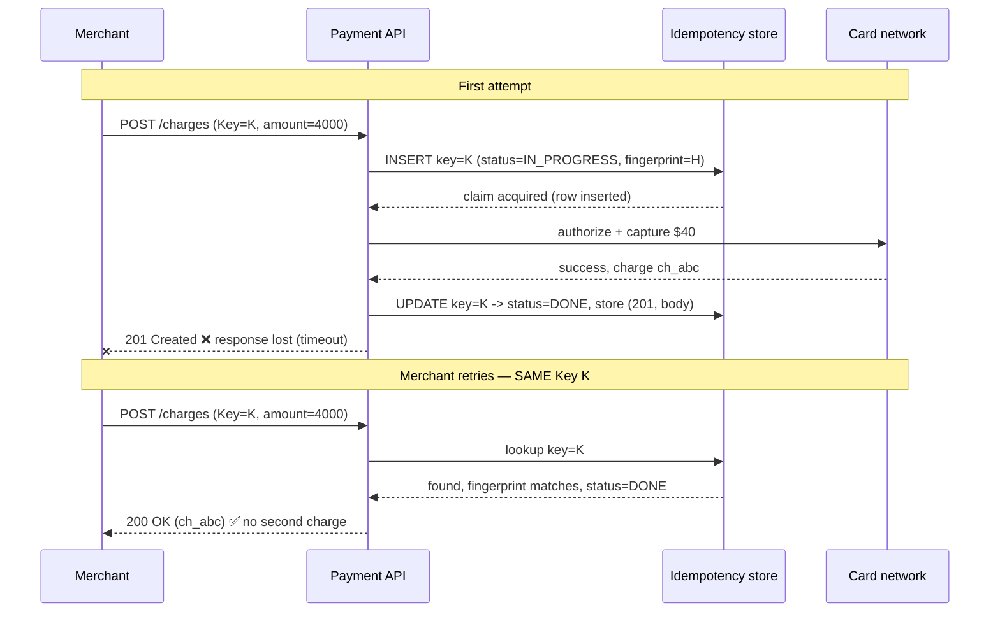
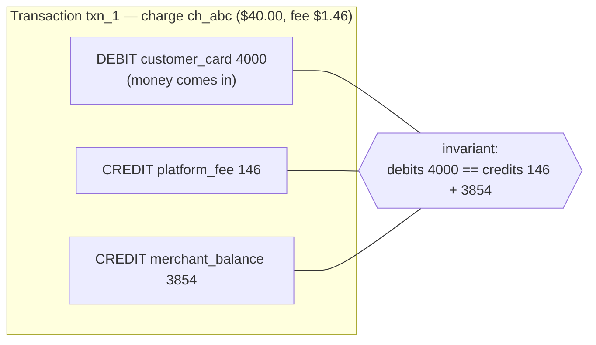
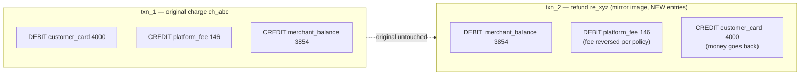
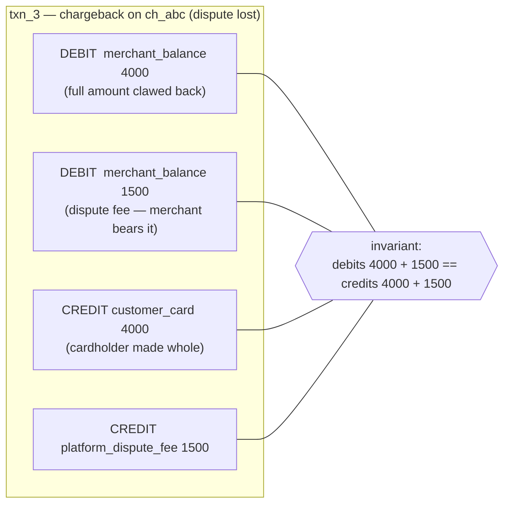
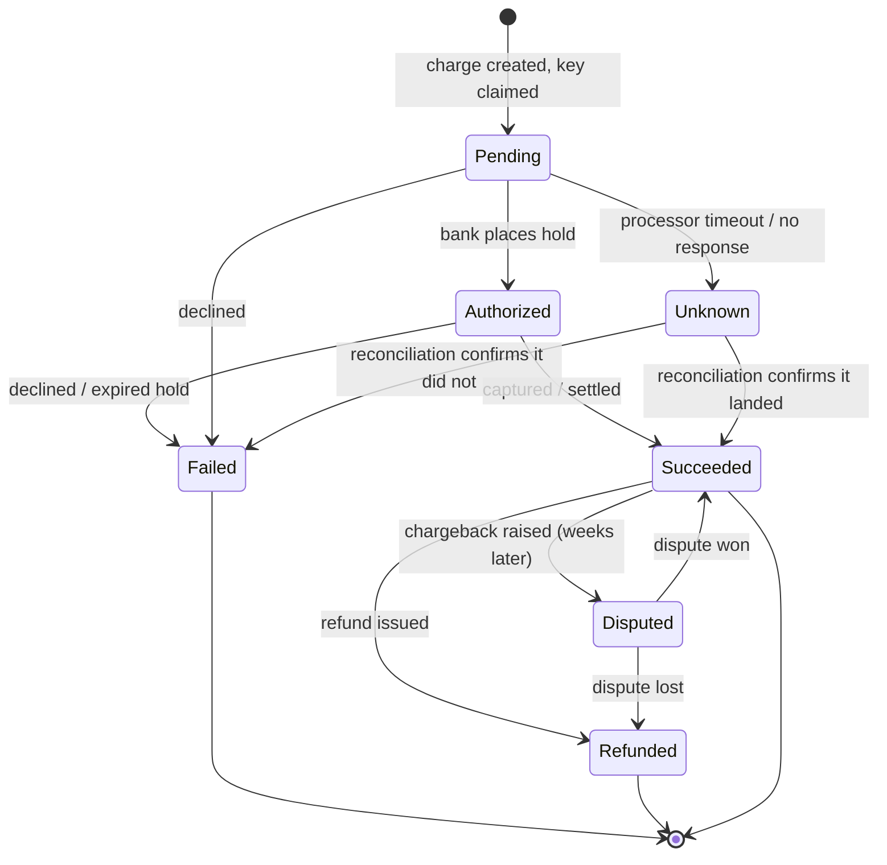
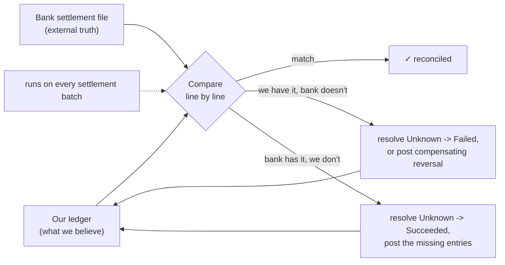
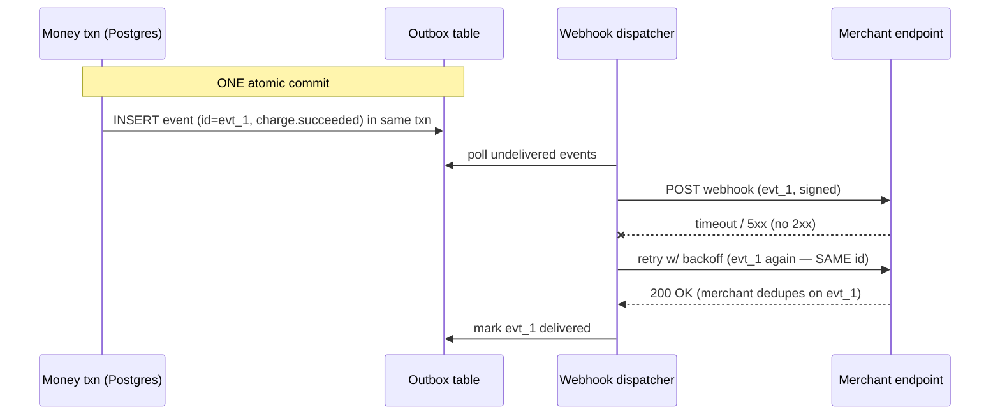

# Mock: Stripe-Style Payment — System Design Round

This is a verbatim-style transcript of a **fintech payment system-design round** in the Stripe archetype: roughly 50 minutes, one deceptively small prompt ("design a charge/payment API"), and an interviewer whose real job is to find out whether you can be trusted with money. The FAANG design round (see [T02](./T02-mock-faang-staff-system-design.md)) scores you on scale and cleverness; a payments round inverts that. Here the dominant axis is **correctness** — can a retried request never double-charge, does money ever silently appear or vanish, do your numbers reconcile against a bank's numbers at the end of the day? A candidate who designs a beautifully scalable system that can double-charge a customer *fails*. A candidate who designs a boring, correct, auditable system that is merely adequate at scale *passes*.

Read it the way the chapter intends. Cover the coaching callouts and predict, turn by turn, what the interviewer is scoring and where the candidate is about to be probed. The candidate here is strong but human: they reach for idempotency keys early and model money correctly, then make one real miss — they store the key and replay the response, but initially forget to detect the *same key with different parameters*, which is a subtle correctness hole the interviewer has to fish for. They recover cleanly, which is itself the signal a fintech interviewer wants. This is a **representative mock**, not a leaked question; "Stripe-style" denotes the format and the correctness bar, not any one company's loop.

> [!NOTE]
> **Setup**
> **Candidate profile.** ~8 years' experience, currently senior backend, interviewing for a **senior/staff payments role**. Has built REST APIs and worked with relational databases, but has never formally designed a money-movement system — exactly the adjacent-but-unfamiliar prompt these rounds favor, because they want to see whether correctness instincts generalize.
>
> **The interviewer's hidden rubric (the fintech signals).** This interviewer is *not* primarily scoring scale. In priority order, they are scoring:
> 1. **Correctness obsession** — does the candidate reach for "can this double-charge / lose money?" as their *first* instinct, not an afterthought?
> 2. **Idempotency & exactly-once reasoning** — `Idempotency-Key`, key→response storage, fingerprint mismatch, the concurrency race, TTL — at the mechanism level.
> 3. **Money modeling** — integer minor units, never floats; currency as data.
> 4. **Ledger / accounting model** — immutable append-only double-entry; debits == credits as an enforced invariant; balances derived, not mutated.
> 5. **Consistency trade-offs** — knows *where* strong consistency is non-negotiable and where eventual is fine.
> 6. **Failure handling** — external processor failures, the charge state machine, the reconciliation loop against the bank.
> 7. **API design & communication** — a clean contract, honest about guarantees ("effectively-once," not "exactly-once delivery"), structured and time-aware.
>
> **Time budget (≈50 min).** Requirements & scope 7 · Estimation 4 · API design 6 · Idempotency deep dive 10 · Money modeling 4 · Ledger 8 · Processor failures + reconciliation + state machine 7 · Consistency 3 · Trade-offs & wrap-up 1.
>
> **Note on weighting.** In a fintech round, correctness outweighs cleverness by a wide margin. A clever-but-unsafe answer scores *below* a plain-but-safe one. If you ever have to choose between "impressive" and "provably won't lose money," choose the latter out loud — that choice is itself the signal.

## The Transcript

### Phase 1 — Clarifying Requirements & Scope (≈7 min)

**Interviewer:** Let's design a payment API — something like Stripe's charge endpoint. A merchant's backend calls us to charge a customer's card. Take it from there.

**Candidate:** Before I draw anything, let me scope it out loud, because "charge a card" hides the hard part. The hard part isn't the happy path — it's what happens when the network, our service, or the bank fails *halfway*. So let me frame the requirements around correctness first, then scale.

Functionally: a merchant backend does something like `POST /charges` with an amount, a currency, and a payment token, and we move money from the customer's card to the merchant's balance, minus our fee. We need to **track the charge's lifecycle** (it's not instantaneous — there's an authorization, then a capture/settlement that the bank drives), let the merchant **read the status** later, and support **refunds**. Behind all of that, every cent has to land in an **auditable ledger** that reconciles against what the bank actually settled.

Now the non-functional requirements, and for a payments system I'd put these in a very deliberate order:

- **Correctness, first and non-negotiable.** A retried request must *never* double-charge. We must never tell a merchant a charge succeeded and then lose it, and we must never create or destroy money in our books. This dominates everything else.
- **Durability.** Once we accept a charge, it survives crashes. No money-moving decision lives only in memory.
- **Availability** — high, but I'll trade a little availability for correctness if I'm ever forced to. I'd rather reject a charge I can't process safely than process it unsafely.
- **Latency** — a charge involves a synchronous round-trip to a card network, so realistically a few hundred milliseconds to a couple of seconds; this is not a sub-millisecond system.
- **Scale** — I'll size it, but I'll say up front it's modest compared to, say, a social feed: thousands of charges per second is already a very large payments business.

Out of scope unless you want them: fraud/risk scoring (I'll treat it as a service we call, not design it), the full dispute/chargeback workflow beyond modeling its state, PCI tokenization of the raw card (I'll assume we receive a token, never a PAN), and payouts/bank transfers to the merchant's bank account. Does that framing match what you want?

> [!TIP]
> Watch the very first move: the candidate reframes "charge a card" as "what happens when it fails halfway," and *orders the non-functionals with correctness at the top*. In a FAANG round you lead with scale; in a fintech round you lead with correctness. An interviewer here forms 60% of their impression in the first two minutes based purely on whether "can this double-charge?" was the candidate's instinct or an afterthought they had to be dragged toward.

**Interviewer:** Good framing. Refunds and disputes are in scope conceptually — I want to see them in your state machine — but you don't need to design the payout rails. One thing: when you say "never double-charge," how confident are you that you can actually guarantee that?

**Candidate:** I can guarantee it for *our* side of the boundary, and I want to be precise about where the boundary is, because over-promising here is itself a red flag. I can guarantee that a retried request from the merchant produces **at most one** charge in our system — that's the idempotency-key mechanism I'll build. What I *cannot* guarantee with absolute physics is exactly-once *delivery* across the card network, because that's an external party over an unreliable link. So the honest claim is: **exactly-once from the merchant's point of view at our API, and at-least-once with strong deduplication toward the bank.** I'd rather state that boundary precisely than claim end-to-end exactly-once, which isn't achievable.

> [!IMPORTANT]
> That answer — drawing the line between what's guaranteeable and what isn't — is a *senior+* signal disguised as humility. Junior candidates claim "exactly-once" as an absolute and reveal they don't know where the guarantee breaks. The candidate already named the merchant-network edge and the bank edge as the two unreliable boundaries; the entire rest of the design hangs off those two edges.

**Interviewer:** Make that concrete for me. Tell me a story about a time this boundary actually bit someone — a real double-charge.

**Candidate:** Here's the canonical incident, and it's almost always the same shape. A customer on the merchant's checkout page taps "Pay $40" once. The merchant's backend fires `POST /charges` to us. We authorize and capture the card successfully — the money *did* move — and we start sending back the `201 Created`. But the response packet dies somewhere: the merchant's load balancer hit its 5-second read timeout, or their app server was redeployed mid-flight, or a flaky NAT dropped the connection. From the merchant's code's point of view, the call **threw a `SocketTimeoutException`** — it has *no idea* whether we charged the card. Their HTTP client library, configured with a default retry policy, helpfully fires the *exact same request* again. If that retry carries no idempotency key — or a *fresh* key each time — we treat it as a brand-new charge, authorize and capture a *second* $40, and the customer sees two $40.00 line items on their statement. They charge back both, the merchant eats the dispute fees, and someone files a Sev-2.

The fix is the whole point of this design: the merchant sends the *same* `Idempotency-Key` on the original and the retry, and our atomic claim makes the retry a no-op that replays the first response. The thing I want to stress is that the timed-out POST is not an exotic edge case — it is the **single most common way money gets double-charged in production**, and it happens on a perfectly healthy day with no bug in our charging logic at all. The bug is purely "a retried mutation with no dedup token."

> [!NOTE]
> Notice what the candidate did when asked for "a story": they gave a *specific, sensory* failure — a tapped button, a 5-second LB timeout, a `SocketTimeoutException`, a client-library retry — not an abstract "the network might fail." Interviewers remember candidates who can narrate an incident at the packet level, because it proves the failure mode is something they've actually reasoned through (or lived through) rather than a phrase they memorized. When you rehearse this round, practice telling *one* concrete double-charge story you can deliver in 30 seconds.

### Phase 2 — Capacity Estimation (≈4 min)

**Candidate:** Let me put rough numbers on it, mostly to show that scale is *not* where this problem is hard, so we spend our time on correctness.

```text
ASSUMPTIONS
- A large payments business: ~10M successful charges / day
- Average charge value: $40.00  -> store as 4000 (integer cents)

THROUGHPUT
- Charges/day        = 10,000,000
- Seconds/day        ≈ 86,400
- Average write QPS  = 10M / 86,400  ≈ 116 /s
- Peak factor (Black Friday, diurnal) ~10x => peak ≈ 1,200 /s writes
- Reads (status checks, dashboards) ~5x writes => ~6,000 /s peak reads

STORAGE (this is the interesting part — money records are forever)
- One charge is NOT one row. It's:
    1 charge record
    + several immutable ledger entries (debit card, credit merchant, credit fee)
    + N attempt / state-transition rows
  Call it ~6 immutable rows per charge.
- Rows/day ≈ 10M x 6 = 60M ledger+event rows / day
- Per row ≈ 250 bytes -> ~15 GB/day of immutable financial data
- Retention: effectively FOREVER (legal/audit) -> ~5.5 TB/year, growing,
  archived to cheap columnar storage but never deleted.

IDEMPOTENCY STORE
- One key per charge attempt; TTL ~24h (only protects the retry window)
- ~10M keys/day, expiring -> a few GB live at any time, easy.
```

So the headline: **~1,200 writes/s at peak — small.** The estimation tells me the engineering challenge isn't QPS; a single well-sharded relational database can handle this write volume comfortably. The challenge is that **every one of those 60M daily rows is immutable financial truth that must net to zero and be retained essentially forever.** That reframes the design: I'd happily choose a boring, strongly-consistent relational store over an exotic scalable one, because correctness and auditability beat throughput here.

> [!TIP]
> The single best line is **"the challenge isn't QPS, it's that every row is immutable financial truth retained forever."** In a FAANG round, low QPS would be disappointing. In a fintech round, *recognizing that low QPS frees you to pick the boring, correct, strongly-consistent datastore* is exactly the judgment being tested. Estimation here isn't about big numbers — it's about justifying why you get to use Postgres instead of an eventually-consistent KV store.

**Interviewer:** Agreed, the volume is manageable. Show me the API.

### Phase 3 — API Design (≈6 min)

**Candidate:** The write surface is small and deliberate. The key design decision is on the very first endpoint: idempotency is a **required header**, not an optional nicety.

```text
POST /v1/charges
  Idempotency-Key: <merchant-generated UUID>     # header, REQUIRED on writes
  body (application/json):
    amount        : 4000              # integer, MINOR units (cents). never a float.
    currency      : "usd"             # ISO-4217 code, stored as data
    source        : "tok_visa_xxx"    # a tokenized payment method, never a raw PAN
    description   : "Order #1234"      # optional, opaque to us
    metadata      : { order_id: ... }  # merchant's correlation data
  -> 201 Created
     { id: "ch_abc", status: "succeeded", amount: 4000, currency: "usd",
       fee: 146, net: 3854, created: <ts> }
  -> 200 OK (on an idempotent replay — SAME body returned, no second charge)
  -> 409 Conflict (a request with this key is currently in progress)
  -> 422 Unprocessable (same key, DIFFERENT params — reused key, client bug)

GET  /v1/charges/{id}
  -> { id, status, amount, currency, fee, net, attempts: [...], created }

POST /v1/charges/{id}/refunds
  Idempotency-Key: <merchant-generated UUID>     # refunds are mutations too
  body: { amount: 4000 }                          # full or partial
  -> 201 { id: "re_...", status: "succeeded", amount: 4000 }
```

Three deliberate choices. First, the **merchant generates the `Idempotency-Key`**, not us — only the merchant knows that two transmissions are "the same logical charge," because only they know they hit retry after a timeout. Second, **`amount` is an integer in minor units plus a separate `currency`** — I'll defend that hard in a minute; there is no float anywhere near money. Third, **refunds carry their own idempotency key**, because a retried refund double-refunding is just as bad as a double-charge — money flowing the other way is still money.

> [!INTERVIEW]
> **Meta-insight:** the discriminator on API design in a payments round is *which guarantees are encoded in the contract itself*. A weak candidate adds idempotency as an optional convenience. A strong one makes `Idempotency-Key` **required on every mutation** and bakes the four distinct responses (`201` new, `200` replay, `409` in-progress, `422` reused-with-different-params) into the contract. Those four responses *are* the idempotency mechanism made visible at the API surface — an interviewer reads them as proof you've actually thought the failure cases through, before you've even described the storage.

**Interviewer:** I noticed you returned a `422` for "same key, different params." Hold that thought — we'll come back to it. Walk me through what actually happens on the server when a charge comes in.

### Phase 4 — The Idempotency Mechanism (≈10 min)

**Candidate:** Here's the core flow. The whole point is to handle the one ambiguity that makes payments hard: **the merchant gets a timeout and cannot tell whether we processed the charge or not.** They have to be able to safely retry, and our job is to make that retry harmless.



The mechanism, step by step:

1. **Atomic claim before any side effect.** When a charge arrives, I first do an atomic *insert-if-absent* of the idempotency key — a `SET key NX` in Redis, or, since I already chose a relational store, an `INSERT` against a `UNIQUE`-constrained column. Critically this happens **before** I touch the card network. The insert either succeeds (I'm the first, I own this charge) or fails because the row already exists (it's a retry or a concurrent duplicate).

2. **Store the response under the key.** When the charge completes, I update that same row with the final HTTP status and response body. Now the key maps to a saved outcome.

3. **On a retry, replay the saved response.** A second request with the same key finds a `DONE` row and returns the *stored* response verbatim — same charge ID, same status — and never calls the card network again. That's what makes the merchant's retry loop safe.

4. **TTL.** I keep keys ~24 hours. The key only protects against a retry within the merchant's retry window, which is minutes to hours, never days — so I expire keys to keep the store small. After expiry, a fresh request with the same key would execute again, which is fine because no sane retry loop is still going a day later.

Here's the SQL skeleton, leaning on the database to do concurrency control for me:

```sql
CREATE TABLE idempotency_key (
  merchant_id    BIGINT       NOT NULL,
  idem_key       VARCHAR(255) NOT NULL,
  fingerprint    CHAR(64)     NOT NULL,            -- hash of route + params
  status         VARCHAR(16)  NOT NULL DEFAULT 'IN_PROGRESS',
  response_code  INT,
  response_body  JSONB,
  created_at     TIMESTAMPTZ  NOT NULL DEFAULT now(),
  PRIMARY KEY (merchant_id, idem_key)    -- a concurrent duplicate INSERT just fails
);
```

```java
// The atomic claim — the first INSERT wins, the racing duplicate gets a violation.
try {
    jdbc.update("""
        INSERT INTO idempotency_key (merchant_id, idem_key, fingerprint, status)
        VALUES (?, ?, ?, 'IN_PROGRESS')
        """, merchantId, key, fingerprint);
    return ClaimResult.PROCEED;                 // we own it — go charge the card
} catch (DuplicateKeyException dup) {
    var row = load(merchantId, key);            // someone else got here first
    if (row.status().equals("IN_PROGRESS"))
        return ClaimResult.IN_PROGRESS;         // -> 409, a concurrent attempt is running
    return ClaimResult.replay(row.code(), row.body());   // -> replay stored response
}
```

**Interviewer:** Two concurrent requests with the same key arrive at the exact same moment. What happens?

**Candidate:** That's the race the `UNIQUE` constraint exists to win. Both threads try to `INSERT` the same `(merchant_id, idem_key)`; the database guarantees **exactly one** succeeds, and the other gets a duplicate-key violation. The winner proceeds to charge the card. The loser catches the violation, sees the row is still `IN_PROGRESS`, and returns a `409 "request in progress"` — it does *not* also call the card network. The merchant can retry the 409 a moment later and, by then, the row is `DONE`, so they get the replayed response. The key insight is that **the side effect — the actual card charge — happens only on the path that won the atomic claim.** Concurrency control is the database's job, and I'm using a primitive (unique constraint) that's correct under contention rather than a check-then-act that has a race window.

> [!WARNING]
> The classic trap here is a **check-then-act** idempotency implementation: "look up the key; if absent, charge; then write the key." That has a race — two concurrent requests both read "absent," both charge, and you've double-charged the customer. In payments that bug is a *headline*. The only safe pattern is an **atomic claim** (insert-if-absent / `SET NX` / `UNIQUE` constraint) where the database serializes the contenders. If a candidate describes "check if exists, then insert" as two separate steps, that's an instant correctness flag.

**Interviewer:** Some candidates reach for a distributed lock instead — grab a lock on the key in Redis, do the work, release it. Why did you pick a `UNIQUE` constraint over a lock?

**Candidate:** Because a lock makes me responsible for things the database already does for free, and every one of those responsibilities is a way to lose money. With a lock I have to answer: what's the lock's TTL? If I set it to 5 seconds and the card-network call takes 7, the lock **expires while I'm still charging**, a second request acquires it, and now two threads are both mid-charge — I'm back to the double-charge I was trying to prevent. If I set the TTL too long and my process crashes after acquiring, the key is wedged until it expires. And releasing a lock I no longer safely own (because it already expired and someone else holds it) is its own famous bug — that's the whole reason Redlock exists and is still argued about. A `UNIQUE` constraint has *none* of those questions: the row either inserts or it doesn't, the decision is durable the instant the transaction commits, there's no lease to expire, and if my process dies the row simply stays `IN_PROGRESS` for a sweeper to reconcile rather than silently freeing itself for a duplicate. 

The deeper point is that a lock protects a *critical section in time*, but idempotency is about a *durable fact* — "this key has been claimed" — that must outlive any single request, any process restart, any lock lease. A constraint stores the fact; a lock only guards a window. So I reach for the constraint and treat the database's contention handling as the feature, not as something to reinvent. I'd only consider a lock as an *optimization* on top — to make the loser fail fast with a `409` instead of waiting on a constraint violation — never as the *correctness* mechanism.

> [!TIP]
> "Lock vs. unique constraint" is a favourite payments follow-up because it separates people who think in terms of *time windows* from people who think in terms of *durable facts*. The strong answer names the **TTL dilemma** (too short → lock expires mid-charge → double-charge; too long → wedged on crash) and the **lost-lease release bug**, then reframes idempotency as a durable claim that must survive process death — which a row does and a lease doesn't. If a candidate's instinct is "just grab a Redis lock," probe the TTL until the double-charge falls out; if they reach for the constraint and can explain *why*, that's the staff-level instinct.

**Interviewer:** Good — you've got the race right. Now go back to that `422` you put in the API. You store the key and replay the response. But what is the `fingerprint` column actually *for*? Walk me through a merchant who reuses the same key with a different amount.

**Candidate:** *(pauses)* Right — let me make sure I actually use that column, because I declared it but I haven't fully justified it. So... the scenario: a merchant sends `Key=K, amount=4000`, it succeeds, and then — by a bug in their code — they send `Key=K, amount=9900` for a genuinely *different* charge. If I only key on the idempotency key and blindly replay, I'd return the *old* `$40.00` charge response for what was meant to be a *new* `$99.00` charge. The merchant thinks they charged $99; we charged $40; their books and ours silently diverge. That's a real correctness hole, and I glossed over it.

The fix is the **fingerprint**: when I first store the key, I also store a hash of the request — the route plus the relevant parameters (`amount`, `currency`, `source`). On any subsequent request with the same key, I recompute the fingerprint and compare:

- **Same key, fingerprint matches** → it's a genuine retry of the same logical request → replay the stored response (`200`). ✅
- **Same key, fingerprint differs** → the key is being reused for a *different* request → that's almost always a client bug, and silently replaying would be wrong, so I **reject with `422`** and force them to fix it. ❌

So the three rules together are: matching retry replays, concurrent duplicate gets a 409, and **same-key-different-params is rejected, never silently replayed.** I should have led with the fingerprint instead of treating the key alone as sufficient — keying without fingerprinting is a subtly broken idempotency implementation.

```java
var row = load(merchantId, key);
if (row != null) {
    if (!row.fingerprint().equals(currentFingerprint))
        return ClaimResult.MISMATCH;            // -> 422, key reused with different params
    if (row.status().equals("DONE"))
        return ClaimResult.replay(row.code(), row.body());   // -> 200, safe retry
    return ClaimResult.IN_PROGRESS;             // -> 409
}
```

> [!IMPORTANT]
> This is the deliberate human miss, and it's a *good* one to study because it's the most commonly botched part of idempotency in the wild. The candidate built the key→response store and the concurrency race correctly, but initially treated "same key" as automatically meaning "same request" — forgetting that a reused key with *different* params must be detected, not replayed. What recovers it to a strong outcome: when probed, they don't get defensive, they **immediately reconstruct the exact failure** (`$99` charge silently returns the `$40` response → books diverge), name the fingerprint as the fix, and own the gap ("keying without fingerprinting is subtly broken"). A candidate who recovers a correctness hole *by reasoning about how money diverges* scores far better than one who just recites "add a fingerprint." For the full mechanism, see the Stripe case study in [L5/C12](../../L5-architecture-leadership/C12-real-world-case-studies/T02-stripe-idempotency-ledgers-api-longevity.md) and the general theory in [idempotency & deduplication](../../L5-architecture-leadership/C02-distributed-systems-and-system-design/T07-idempotency-and-deduplication.md).

**Interviewer:** Good recovery. One more: you said exactly-once at the API but at-least-once toward the bank. Reconcile those for me.

**Candidate:** The merchant-facing guarantee is exactly-once because the idempotency key collapses all their retries into one charge. But internally, after I've claimed the key, *my* call to the card network can itself time out — and now I'm the one who can't tell whether the bank processed it. So toward the bank I'm at-least-once: I may have to retry, which means I might submit the same authorization twice. I make that safe two ways: I pass a **provider-side idempotency token** where the processor supports one (most do — it's the same pattern one layer down), and where it doesn't, I rely on the **reconciliation loop** to catch a rare duplicate after the fact and post a compensating correction. So the honest end-to-end story is **at-least-once delivery plus idempotent processing at each hop, which composes to effectively-once** for the observable outcome — not the impossible "exactly-once delivery."

### Phase 5 — Money Modeling (≈4 min)

**Interviewer:** You keep writing `4000` for forty dollars. Why not just store `40.00`?

**Candidate:** Because money must be **exact**, and binary floating point can't represent most decimal fractions exactly — `0.1 + 0.2` isn't `0.3` in IEEE-754, it's `0.30000000000000004`. Sum a ten-cent item a thousand times as a `double` and you drift off $100.00. Across millions of charges that drift is both an accounting failure and, frankly, a compliance and fraud surface. So I store money as an **integer count of the smallest currency unit** — `4000` is 4000 cents = $40.00 — plus a separate ISO-4217 `currency` code, because the number of minor units per major unit is currency-specific (the yen has *no* minor unit, so `500` is ¥500).

```java
// WRONG — money as double. Drifts, and == is meaningless.
double total = 0.0;
for (int i = 0; i < 1000; i++) total += 0.10;   // 100.00000000000007 ❌

// RIGHT — integer minor units. Exact, fast, overflow-checked.
public record Money(long minorUnits, Currency currency) {
    public Money plus(Money o) {
        if (!currency.equals(o.currency)) throw new IllegalArgumentException("currency mismatch");
        return new Money(Math.addExact(minorUnits, o.minorUnits), currency);  // checked add
    }
}
```

I persist it as a `BIGINT amount_minor` plus a `CHAR(3) currency` — never a `FLOAT` or `DOUBLE` column anywhere near money. The one place I'd reach for `BigDecimal` (with an explicit `RoundingMode`, and constructed from a `String` not a `double`) is genuine decimal arithmetic — computing a 2.9% + 30¢ fee, tax, or FX conversion — and even then I round to whole minor units and store the integer. Currency is *data*, not a formatting concern: a `Money` is a `(long, currency)` pair and you can never add two different currencies.

> [!WARNING]
> Two Java traps an interviewer may probe. (1) `new BigDecimal(0.1)` takes a `double` and faithfully copies its binary imprecision — always use the `String` constructor `new BigDecimal("0.1")`. (2) `BigDecimal.equals` compares *scale*, so `new BigDecimal("2.0").equals(new BigDecimal("2.00"))` is `false` — use `compareTo() == 0` for value equality. If a candidate stores money as `double`, most fintech interviewers stop scoring depth right there; it's treated as disqualifying for money-touching code.

**Interviewer:** Have you ever actually seen a float bug in money in the wild? What did it look like?

**Candidate:** Yes, and the painful thing is they're nearly invisible until they're a reconciliation alarm. The textbook one: a marketplace computed each seller's payout as `orderTotal * commissionRate` in `double`, then summed thousands of those `double`s into a daily payout batch. Each individual line looked perfect on a receipt — `$12.34`, `$5.67` — because the UI rounded to two decimals when it *displayed* them. But the stored values carried a tiny binary tail, and once you summed 40,000 of them the accumulated error crossed a cent. The daily payout total was off by `$0.03` against the sum the bank settled, every single day, and the reconciliation job flagged a mismatch it couldn't auto-resolve. An engineer spent two days hunting a "missing three cents" that was never missing — it was *manufactured* by float addition not being associative. The fix was the same `Money(long, currency)` discipline: round each fee to whole minor units at the moment it's computed, store the integer, and only ever sum integers. The lesson candidates miss is that the float bug doesn't show up where you do the math — it shows up *downstream in reconciliation*, days later, as a tiny stubborn drift, which is exactly why it's so expensive to diagnose.

```java
// The trap, reproduced. Each line "looks" fine; the SUM is wrong.
double[] fees = new double[40_000];
java.util.Arrays.fill(fees, 0.29);          // 29¢ commission, stored as double
double total = 0.0;
for (double f : fees) total += f;            // 11600.000000000XXX — drifts off 11600.00 ❌

// The discipline. Round to minor units the instant you compute, then sum longs.
long totalMinor = 0;
for (int i = 0; i < 40_000; i++) {
    long feeMinor = new java.math.BigDecimal("0.29")
        .movePointRight(2)                   // -> 29 (cents), from a STRING, never a double
        .setScale(0, java.math.RoundingMode.HALF_EVEN)
        .longValueExact();
    totalMinor = Math.addExact(totalMinor, feeMinor);   // exact, overflow-checked
}
// totalMinor == 1_160_000 cents == $11,600.00, exactly, forever. ✅
```

> [!IMPORTANT]
> The "have you *seen* it?" question is a trap-with-a-trap: the interviewer doesn't want the textbook line "`0.1 + 0.2 != 0.3`," they want evidence you know *where the bug surfaces*. The strong answer locates it **downstream in reconciliation, as a sub-cent drift that compounds over a large sum** — not at the call site — and names the cure (round to minor units at computation time, sum integers, never sum doubles). Saying "I'd use `BigDecimal`" is only half-right; `BigDecimal` *carelessly summed and never rounded to minor units* still leaves you a stored value that diverges from what the bank settles. The discipline is integer minor units *as the unit of storage*, with `BigDecimal` confined to the rounding step.

### Phase 6 — The Double-Entry Ledger (≈8 min)

**Interviewer:** Where does the money actually live in your system? Show me the data model for the money itself.

**Candidate:** Not as a mutable `balance` column — that would be lossy and race-prone. Money lives in an **immutable, append-only, double-entry ledger**, the same model accountants have used for centuries precisely because it's *self-checking*. Every money movement records balanced **debits and credits** across accounts, and the system enforces one inviolable invariant:

> For every transaction, the sum of debits equals the sum of credits. The ledger as a whole always nets to zero.

If a bug ever tries to post an unbalanced entry, the invariant breaks **loudly and immediately** — you cannot silently conjure or lose money. A $40.00 charge with a $1.46 fee posts as one balanced transaction:



The table is append-only — there is *no* `UPDATE` or `DELETE` of a posted entry:

```sql
CREATE TABLE ledger_entry (
  id           BIGINT GENERATED ALWAYS AS IDENTITY PRIMARY KEY,
  txn_id       UUID         NOT NULL,        -- groups one balanced set
  account      VARCHAR(64)  NOT NULL,        -- 'customer_card','platform_fee','merchant_balance'
  direction    CHAR(1)      NOT NULL CHECK (direction IN ('D','C')),
  amount_minor BIGINT       NOT NULL CHECK (amount_minor > 0),
  currency     CHAR(3)      NOT NULL,
  created_at   TIMESTAMPTZ  NOT NULL DEFAULT now()
  -- NO update / delete. Corrections are NEW compensating transactions.
);
-- enforce per-txn balance before commit (deferred constraint or app-level check):
--   SUM(debits) == SUM(credits) for each txn_id
```

Two properties make this powerful:

- **Immutability / append-only.** You never mutate a posted entry. A refund or a correction is a **new compensating transaction** that reverses the original, so the full history is preserved. That's what gives **auditability** — you can replay the ledger from the beginning and reconstruct any account's balance at any point in time, and an auditor can verify nothing was tampered with.
- **Double-entry.** Because every movement touches at least two accounts and must balance, the ledger is *internally consistent by construction*, which is exactly what makes reconciliation against the bank tractable.

So a **balance is a derived value**, never a stored mutable number: `balance(account) = Σ credits − Σ debits` over the immutable entries. At high volume you keep periodic *snapshots* so you don't re-sum all history on every read, but the snapshot is always reproducible from the entries — it's a cache, not the source of truth.

> [!TIP]
> The discriminator here is refusing to model a balance as a mutable column. A weaker answer is `UPDATE accounts SET balance = balance + 4000` — which is lossy (no history), race-prone (lost updates under concurrency), and unauditable. The strong answer is **immutable double-entry + derived balances**, and the *tell* that the candidate has internalized it is the line "a refund is a new compensating transaction, never an `UPDATE`." This is the same discipline as event sourcing: never mutate history, derive state by folding the log.

**Interviewer:** A refund comes in for that charge. Show me what the ledger does — and how the charge and the ledger entries stay consistent.

**Candidate:** The refund posts a **new** transaction that's the mirror image — debit `merchant_balance`, credit back to `customer_card` (and reverse the fee per our policy). The original entries are never touched. And the crucial bit on consistency: **the charge-status update and the ledger entries must commit in the same local database transaction.** I write the charge record (or its state change), the balanced ledger entries, and — atomically with them — I update the idempotency-key row to `DONE` with the saved response. All in one ACID transaction in the same relational store. That single-database atomicity is the whole reason I picked a strongly-consistent relational store back in estimation: it's only ~1,200 writes/s, so I *can* keep "money moved" and "we recorded that money moved" in one transaction. If those two facts could ever commit separately, I'd have a window where the bank charged the card but our ledger doesn't know — which is exactly the inconsistency reconciliation exists to catch, and I'd rather not manufacture it internally when one transaction avoids it entirely.

Concretely, the refund of that same `$40.00` charge is its own balanced transaction, and you can read it right alongside the original:



After both transactions, `balance(customer_card)` nets to zero across the pair, `merchant_balance` is back where it started, and — this is the whole point — **the audit trail shows the charge *and* the refund as two distinct, immutable facts**, not a charge that "became" a refund. An auditor (or a dispute analyst, or our own reconciliation loop) can replay both and prove exactly what happened and when.

**Interviewer:** Now make it nastier. A chargeback comes back from the bank weeks later — the cardholder disputed it and won. The fee structure is different from a refund. Walk the ledger through it.

**Candidate:** Right, a chargeback is *not* a refund even though money flows the same direction, and the ledger has to make that distinction visible because the **economics differ** and an auditor will ask. Two things change versus a voluntary refund. First, the network typically claws back the original amount *and* levies a non-refundable **dispute fee** on us (say `$15.00`) — so unlike a refund, the platform doesn't get its processing fee back *and* it's out an extra fixed cost. Second, this is driven by the bank, not the merchant, so it flows through the **state machine** (`Succeeded -> Disputed -> Refunded`) and arrives weeks after the original — which is one more reason ledger entries are retained forever and never deleted. In the ledger it's, again, a brand-new balanced transaction:



The invariant still holds — debits equal credits — which is *exactly* why I trust the double-entry model under a transition this messy: I can't accidentally make the dispute fee appear from nowhere, because if I forget the balancing credit the post is rejected loudly. The original charge entries and any refund entries are all still there, untouched. So the full lifecycle of `ch_abc` is a *stack of immutable transactions* — charge, maybe a partial refund, then a chargeback — and the account balances are always the running fold over that stack. That's the property that makes me sleep at night: nothing in money's history is ever rewritten, only appended to.

> [!TIP]
> The chargeback follow-up tests whether a candidate treats "money flows back to the customer" as one undifferentiated thing. It isn't: a **refund** is merchant-initiated and usually reverses the fee; a **chargeback** is bank-initiated, claws back the amount, and adds a **non-refundable dispute fee** the merchant eats — different accounts, different economics, different state-machine path, arriving weeks later. The strong signal is modeling them as *distinct* compensating transactions (not reusing the refund path) while showing the balance invariant survives both. Bonus signal: connecting "chargebacks arrive weeks later" back to "therefore ledger entries are retained forever" — tying the data-retention decision to a concrete business event.

### Phase 7 — Processor Failures, State Machine & Reconciliation (≈7 min)

**Interviewer:** The card network call itself is the unreliable part. Walk me through the charge's lifecycle and what happens when the processor fails or goes silent.

**Candidate:** A charge isn't a boolean — it's a **state machine**, and part of that state lives at the bank, which I can only *observe* asynchronously, not control.



The dangerous transition is the **timeout**: I sent the authorization and the processor went silent, so I genuinely don't know if the card was charged. I move the charge to an explicit **`Unknown`** state rather than guessing — I do *not* mark it failed (might double-charge on retry) and I do *not* mark it succeeded (might tell the merchant we got money we didn't). `Unknown` is a real, first-class state that the reconciliation loop will resolve. For ordinary transient failures — a 5xx or a 429 from the processor — I retry with **exponential backoff and jitter**, capped at a few attempts, always carrying the provider idempotency token so a retry can't double-submit. Permanent failures — card declined, invalid token — go straight to `Failed`, no retry. Anything still unresolved after retries lands in `Unknown` for reconciliation, never silently dropped.

**Interviewer:** So how does `Unknown` ever get resolved? You can't 2PC with a bank.

**Candidate:** Exactly — you can't hold a transaction lock inside someone else's bank, so two-phase commit across the bank is impossible. The substitute is the **reconciliation loop**: a continuous, idempotent batch process that compares our ledger against the bank's authoritative settlement files (which arrive hours later) and converges any divergence.



Two design choices echo everything earlier: corrections are **compensating entries** (append-only, never destructive edits to the ledger), and the loop is **idempotent** so re-running it over the same settlement file is safe — it converges, it doesn't oscillate. A charge stuck in `Unknown` is resolved when the settlement file either contains it (→ `Succeeded`, post the entries) or doesn't (→ `Failed`, or reverse a duplicate we accidentally double-submitted). This is a saga-shaped pattern: forward steps plus compensating actions, with the ledger recording every step.

> [!WARNING]
> "Eventually consistent with the bank" means **your database can be temporarily wrong**, and you must design for it honestly: never tell a merchant money has *settled* based only on your internal `Pending`/`Unknown` belief, expose the state machine truthfully (including `Unknown`), and make every correction reversible via a compensating entry rather than an in-place edit. The candidate inventing an explicit `Unknown` state instead of forcing a premature success/fail is the senior signal here — it's the state that prevents both double-charges *and* phantom revenue.

**Interviewer:** Walk me through one concrete mismatch end to end. The settlement file says a charge was `captured`, but your ledger has it `pending`. Step by step — how does the loop resolve it without making things worse?

**Candidate:** This is the bread-and-butter reconciliation case and it's worth being precise, because the *wrong* fix here is how you turn one mismatch into two. The setup: we sent the capture, the processor went silent (timeout), so our charge is sitting in `Unknown` — or, in your framing, our ledger never posted the `merchant_balance` credit, so internally it reads `pending`. Hours later the bank's settlement file lands and line `ch_abc` says `captured, 4000, settled`. So the **external truth says the money moved and our books don't know it.** Here's the loop, step by step:

```mermaid
sequenceDiagram
  participant Loop as Reconciliation loop
  participant File as Settlement file (bank truth)
  participant L as Our ledger (Postgres)
  participant CS as Charge state

  Loop->>File: read line for ch_abc
  File-->>Loop: captured, amount=4000, settled
  Loop->>L: does a posted txn exist for ch_abc?
  L-->>Loop: NO posted credit (charge is Unknown/pending)
  Note over Loop: divergence: bank has it, we don't
  Loop->>L: BEGIN (one atomic txn)
  Loop->>L: INSERT balanced entries (D customer_card / C fee / C merchant_balance)
  Loop->>CS: UPDATE ch_abc: Unknown -> Succeeded
  Loop->>L: COMMIT
  Note over Loop,CS: re-running over the SAME file now finds the txn -> no-op
```

The three things that keep this safe. **(1) Idempotent keying on the bank's reference.** Before I post anything, I check whether a ledger transaction already exists for this settlement line — keyed on the processor's own transaction reference, not just our charge ID. If it exists, I do nothing. That's what makes re-running the loop over yesterday's file a no-op instead of a *second* phantom credit — reconciliation is a retried mutation, so it needs the same idempotency discipline as the charge path itself. **(2) Append, never edit.** I resolve `Unknown -> Succeeded` and post the *missing* entries as a new balanced transaction; I don't reach back and mutate the original `pending` row's amount. **(3) One atomic commit** of the entries plus the state transition, same as the live path. So the resolution is: bank says captured, we had no record, we post the entries and advance the state — and crucially, if the *opposite* mismatch happens (our ledger shows captured but the settlement file never lists it after the settlement window closes), I treat *our* record as suspect and post a **compensating reversal**, because the bank's settlement file is the authority on what actually settled, not our optimistic local state.

> [!IMPORTANT]
> The discriminator on "captured vs. pending" is whether the candidate makes reconciliation **idempotent on the bank's reference** and **resolves by appending**, not editing. The naive loop — "for each settled line, post a credit" — double-credits the moment it runs twice (and it *will* run twice; settlement files get re-sent and jobs get retried). The strong answer keys dedup on the processor's transaction reference, posts missing entries as a new balanced transaction, and — the senior tell — names the **direction of authority**: when our optimistic state and the bank's settlement disagree, the *settlement file wins* and we post a compensating correction against ourselves. That "who is the source of truth" call is the entire reconciliation loop in one sentence.

**Interviewer:** Two more on the lifecycle. First: not every charge captures the full amount at once — think a hotel that authorizes $500 but only captures $300 at checkout. How does a partial capture sit in your state machine and ledger?

**Candidate:** Good case, because it splits *authorization* from *capture* in a way the happy path hides. The auth places a hold for `$500` — that's `Pending -> Authorized`, and importantly **an auth moves no money into the ledger**; it's a promise, a reserved limit on the card, so I record it as charge state, not as a ledger posting. At checkout the merchant captures `$300`. *That* is when money moves, so the ledger transaction posts for `3000` minor units, not `5000` — debit `customer_card 3000`, credit fee + `merchant_balance`. The remaining `$200` of the hold is released (the auth expires or I send a void), which again touches no ledger because nothing settled there. So the rule I'd encode: **the ledger only ever records captured/settled amounts; authorizations and holds are state, not money.** Partial captures also imply I track `amount_authorized` versus `amount_captured` on the charge, and a capture can't exceed the remaining authorized amount — same shape as the refund invariant, just on the capture side. If the business needs multiple partial captures against one auth (split shipments), each capture is its own balanced ledger transaction, and the charge stays `Authorized` until the auth is fully consumed or expires.

**Interviewer:** Second: be exhaustive about the *failure* transitions specifically. What can go wrong from `Authorized`, and where does each land?

**Candidate:** From `Authorized` the unhappy exits are: the **hold expires** before capture (auths are good for days, not forever) — that's `Authorized -> Failed`, and since no money ever moved, there's no ledger reversal, just a state change. The **capture itself is declined** — rarer than an auth decline but it happens (the bank reverses the hold) — also `Authorized -> Failed`. The **capture times out** — and now I'm in the same boat as the original charge timeout: I send the capture, the processor goes silent, I genuinely don't know if it landed, so it goes to `Unknown`, *not* `Failed`, and the reconciliation loop resolves it against the settlement file exactly as we discussed. The principle that ties all of these together is the one from the very start: **a timeout is never a failure — it's an `Unknown` — and only a confirmed signal (an explicit decline, or a settlement file) is allowed to move a charge to a terminal state.** Guessing "failed" on a timeout is how you tell a merchant a charge died when the card was actually captured, which is phantom-revenue in reverse and just as bad.

> [!INTERVIEW]
> **Meta-insight:** the partial-capture and failure-transition probes test the same instinct from two angles — *does the candidate keep "money moved" and "state changed" as separate facts?* The clean answer is the rule "**the ledger records only settled money; authorizations, holds, and declines are state, not postings**," plus the unwavering "**timeout → `Unknown`, never `Failed`.**" Interviewers love walking the unhappy edges of a state machine because the happy path is memorizable but the failure transitions reveal whether you've actually internalized *which events are allowed to move money* versus merely change a status. If you can recite every arrow *into* `Failed` and `Unknown` and justify why a timeout never goes straight to `Failed`, you've shown the state machine is a real model in your head, not a diagram you drew once.

### Phase 8 — Consistency Trade-Offs (≈3 min)

**Interviewer:** Be precise: where in this system do you *require* strong consistency, and where is eventual consistency acceptable?

**Candidate:** I'd draw a hard line through the system.

**Strong consistency is non-negotiable** for: the **idempotency-key claim** (the atomic insert must be linearizable or two concurrent requests can both win and double-charge), and the **ledger write together with the charge state** (debits == credits and "money moved ⇔ we recorded it" must be one atomic, immediately-consistent transaction — there is no acceptable window where they disagree). These are the money-moving core, and they all live in one strongly-consistent relational store specifically so I can get that atomicity cheaply at our modest QPS.

**Eventual consistency is perfectly fine** for: **reconciliation with the bank** (it's inherently asynchronous — settlement files arrive hours later — so eventual convergence is the *only* option, not a compromise); **read replicas serving the merchant dashboard and `GET /charges`** (a status read being a second or two stale is harmless); and **analytics, reporting, and search indexes** downstream of the ledger. The discipline is: **strong consistency on the write path that moves money; eventual everywhere that merely observes it.** Choosing eventual where it's *forced* (the bank) and strong where it's *required* (the claim and the ledger) — and not paying for strong consistency where it buys nothing — is the trade-off I'd defend.

> [!TIP]
> The trap is a candidate who says "strong consistency everywhere" (needlessly expensive, and impossible at the bank edge) or "eventual is fine, it's just payments" (catastrophic on the claim/ledger path). The staff-level answer **partitions the system by guarantee**: linearizable money-moving core, eventually-consistent observation and reconciliation. Knowing *which* writes must be atomic — and that the bank edge gives you no choice but eventual — is the whole point of the question.

**Interviewer:** Last topic. The merchant doesn't sit and poll `GET /charges` forever — at some point you push them an event. How do you deliver a `charge.succeeded` webhook to a merchant, and what guarantee do you offer?

**Candidate:** I offer **at-least-once delivery**, and I'm deliberate about saying "at-least-once," not "exactly-once," for the same reason as everywhere else in this design: I'm crossing an unreliable boundary I don't control (the merchant's HTTP endpoint), so the honest guarantee is "I will keep trying until you acknowledge, which means you may receive a duplicate." The mechanics: when a charge reaches a terminal state, I don't fire an HTTP call inline with the money-moving transaction — that would couple my commit to the merchant's uptime. Instead I write an **outbox** row in the *same* atomic transaction as the ledger+state commit, so the event is durably enqueued if and only if the money fact committed. A separate dispatcher reads the outbox and POSTs the webhook, retrying with **exponential backoff** until it gets a `2xx`, and parking it in a dead-letter queue after, say, a day of failures (where the merchant can also re-fetch via the API). 

The flip side of at-least-once is that **the merchant must dedupe**, so I make that easy: every webhook carries a stable **event ID** and is **signed** (HMAC over the body with a shared secret) so they can verify it's really from us and ignore replays. So the symmetry is kind of beautiful — the merchant uses an idempotency key so *my* retries toward *them* don't double-charge; I send a stable event ID so *their* handling of *my* retries doesn't double-process. Idempotency keys on the way in, idempotent event IDs on the way out — same principle, both directions of the boundary.



> [!INTERVIEW]
> **Meta-insight:** webhooks are where the interviewer checks whether your idempotency thinking is *a principle* or *a trick you memorized for the charge endpoint*. The principle is symmetric: **any retried mutation across an unreliable boundary needs a stable dedup token and at-least-once delivery** — inbound it's the merchant's `Idempotency-Key`, outbound it's your signed `event ID`. The strong answer also names the **transactional outbox** (write the event in the same commit as the money fact, so you can't deliver an event for a charge that didn't commit, nor commit a charge whose event silently vanished) and **signing** (so the merchant can trust and dedupe). If a candidate says "we'll just call their webhook URL after the charge," ask what happens when that call times out — and watch whether they reinvent the entire idempotency story they already told you, or recognize it's the same one.

### Phase 9 — Trade-Offs & Wrap-Up (≈1 min)

**Interviewer:** We're near time. Give me your key trade-offs and what you'd build first.

**Candidate:** Three deliberate trade-offs. **Boring strongly-consistent relational store over an exotic scalable one** — justified because QPS is modest and single-transaction atomicity of ledger+state+key is worth far more than throughput here. **At-least-once + idempotent processing = effectively-once**, instead of claiming impossible exactly-once delivery across the bank. **An explicit `Unknown` state plus async reconciliation** instead of pretending the bank is synchronous, because you cannot 2PC across a bank.

If I were building it for real, in order: (1) the charge API with the **idempotency claim + fingerprint** and a single-channel happy path — that's the correctness foundation everything else rides on; (2) the **double-entry ledger** with the balance invariant enforced; (3) the **state machine including `Unknown`** and processor retry handling; (4) the **reconciliation loop** against settlement files; (5) refunds and dispute states. Each layer is independently shippable and testable, and notice the *correctness* primitives come first and scale never enters the list — which is the right priority order for money.

**Interviewer:** That's a good place to stop. Thanks.

## Debrief & Scorecard

The candidate led with correctness, reached for idempotency keys and integer money as first instincts, and modeled the ledger and reconciliation correctly. The one real miss — initially treating "same idempotency key" as sufficient and forgetting fingerprint-based detection of reused keys — is the single most commonly botched part of idempotency, and the recovery was textbook: reconstruct the exact way money diverges, name the fix, own the gap. For a fintech round, that arc (correct instincts, one real correctness hole, clean reasoning-based recovery) reads as **trustworthy with money**, which is the whole point.

| Dimension | Signal observed | Verdict | What would raise it |
|---|---|---|---|
| Correctness obsession | Reframed "charge a card" as "what fails halfway"; ordered non-functionals with correctness first | **Strong** | Already strong; nothing material. |
| Idempotency & exactly-once | Atomic claim before side effect, replay, 409 race, TTL, effectively-once boundary stated honestly | **Strong** | State the fingerprint rule *before* being probed (see next row). |
| Fingerprint / reused-key detection | Declared the column but initially didn't use it; **missed** same-key-diff-params until probed | **Mixed → recovered** | Lead with "key + fingerprint" as one unit; this is the gap between Mixed and Strong. |
| Money modeling | Integer minor units, currency as data, `BigDecimal` traps, overflow-checked add | **Strong** | None material. |
| Double-entry ledger | Immutable append-only, debits==credits invariant, derived balances, compensating refunds | **Strong** | Mention periodic snapshot/checkpoint reads *unprompted* for high volume. |
| Processor failure & reconciliation | Explicit `Unknown` state, backoff+jitter, provider idempotency token, idempotent recon loop | **Strong** | Note dispute/chargeback timelines (weeks) drive retention; touched but light. |
| Consistency trade-offs | Partitioned system: linearizable money core, eventual for observation + bank | **Strong** | None material. |
| Communication / leadership | Time-aware, drew precise guarantee boundaries, owned the miss without defensiveness | **Strong** | None material. |

**Overall: Hire (lean strong) for a senior payments role; borderline-strong for staff.** The fingerprint miss is the only thing between this and an emphatic yes. Because it was a *correctness* hole rather than a scale detail, a strict fintech interviewer weights it more heavily than they would in a FAANG round — but the recovery, reasoned through *how money diverges* rather than recited, is exactly what restores trust. The fix that raises this to an unambiguous staff "strong" is small and learnable: treat "idempotency key" and "request fingerprint" as a single inseparable unit, never the key alone.

## Where You'll See This On The Job

Don't file this round under "payments, only relevant if I interview at Stripe." The two load-bearing ideas — **idempotency on retried mutations** and a **ledger as the system of record** — show up the moment any system has to be correct under retries, which is essentially every backend that mutates state across a network. The payments framing just makes the cost of getting it wrong *legible*: a double-charge is a number on someone's statement. Elsewhere the same bug is quieter but no less real.

- **Any retried mutation needs an idempotency key.** A mobile client fires "place order" twice on a flaky connection. A Kafka consumer redelivers a message after a rebalance. A cron job that "send the invoice email" runs again after a deploy interrupts it. A `terraform apply` that's really an `upsert`. A webhook *you* receive from a third party that they deliver at-least-once. In every one of these, the fix is the *exact* pattern from this round: an atomic claim on a stable key *before* the side effect, the side effect only on the winning path, and a stored result to replay. The phrase "make this operation idempotent" is one of the most common things you'll hear in a real backend design review, and most engineers can *say* it without being able to *build* it correctly under concurrency — which is precisely why interviewers probe it.
- **Any system of record for money, credits, or inventory is a ledger.** Wallets and store credit, loyalty points, prepaid balances, API-usage metering and billing, gift cards, ad-spend budgets, in-game currency, and — critically — **inventory and stock levels** are all the same shape: a quantity that must never be silently created or destroyed, must be auditable, and must reconcile against an external truth (a warehouse count, a bank settlement, a partner's report). The strong move in all of them is the same: **immutable append-only entries, derive the balance by folding the log, corrections are compensating entries, never an in-place `UPDATE`.** An e-commerce "we oversold the last unit" bug and a "we double-charged the card" bug are the *same* bug — a mutable counter raced under concurrency — and the same ledger discipline fixes both.
- **Reconciliation against an external source of truth is everywhere.** Syncing your DB against a payment processor, a shipping carrier's tracking feed, a third-party CRM, an inventory management system, or another microservice's state — all of it is the reconciliation loop from this round: compare, find divergence, converge idempotently, let the authoritative source win. The instant two systems hold "the same" data, you own a reconciliation problem whether you've named it or not.

The interview tests payments because money makes correctness *undeniable*. But the engineer who internalizes "retried mutation → idempotency key" and "system of record for a conserved quantity → append-only ledger" is reaching for the right primitive in a dozen non-payment systems for the rest of their career. That generality is *why* this round is a staple far beyond fintech companies.

> [!NOTE]
> If you take one transferable sentence from this entire transcript into your day job, make it this: **"Is this a retried mutation, and is this a system of record for a conserved quantity?"** Ask it of any new feature that touches a counter or moves something across a network. A surprising number of production incidents — duplicate orders, lost inventory, double-sent emails, drifting balances — are just this round's two lessons going unlearned in a non-payments codebase.

## Variations

Rehearse these out loud — each flips one assumption and forces a different correctness pressure:

- **"The merchant retries with the same key but a different amount."** The fingerprint variation — articulate *why* silent replay diverges the books, and exactly which response (`422`) you return and why not `200`.
- **"Your service crashes after charging the card but before storing the response under the key."** Now the key row is stuck `IN_PROGRESS`. How does a retry behave (409 vs. replay)? How do you recover the orphaned `IN_PROGRESS` — a sweeper, a reconciliation pass, a timeout-to-`Unknown`?
- **"Process a refund for $0.01 more than the original charge."** Forces ledger validation: a refund can't exceed remaining refundable amount; show the invariant check and the `422`.
- **"You support 135 currencies, and a merchant in JPY charges a customer in USD."** FX conversion: where does `BigDecimal` + explicit rounding enter, how do you store both legs, and what does the ledger look like across two currencies?
- **"A chargeback arrives 6 weeks after the charge."** Drives the dispute branch of the state machine, why ledger entries are retained forever, and why you can never have deleted the original. Be ready to distinguish a **chargeback** (bank-initiated, claws back amount *plus* a non-refundable dispute fee the merchant eats, different ledger accounts) from a voluntary **refund** (merchant-initiated, usually reverses the fee) — reusing the refund path for a chargeback is a tell that you haven't modeled the economics.
- **"They'd rather use a Redis lock than a unique constraint."** Defend the constraint by walking the **TTL dilemma** out loud: a lock TTL shorter than the card-network latency expires mid-charge and lets a duplicate in (double-charge); a longer TTL wedges the key if the process crashes; and releasing a lease you no longer own is its own bug. Frame idempotency as a *durable fact* that must outlive any lock lease, not a *time window*.
- **"The processor says `captured`, but your ledger says `pending`."** The reconciliation walkthrough: key dedup on the **bank's transaction reference** (not just your charge ID) so a re-run is a no-op, post the *missing* entries as a new balanced transaction, advance `Unknown -> Succeeded`, and — the senior tell — name that **the settlement file is the authority** when it disagrees with your optimistic local state.
- **"A hotel authorizes \$500 but only captures \$300 at checkout."** Partial capture: an **auth moves no money into the ledger** (it's a hold, recorded as state), the **capture** posts the ledger transaction for the captured amount only, and a capture can't exceed the remaining authorized amount. Tests whether you keep "money moved" and "state changed" as separate facts.
- **"Your `charge.succeeded` webhook to the merchant times out."** At-least-once delivery: a **transactional outbox** written in the same commit as the money fact, a dispatcher retrying with backoff to a dead-letter queue, and a **signed, stable event ID** so the merchant can dedupe. Watch for the symmetry — idempotency key inbound, event ID outbound, same principle both ways across the boundary.
- **"You summed thousands of `double` fees and your daily payout is off by three cents."** The floating-point money bug: explain that the drift surfaces *downstream in reconciliation*, not at the call site, and that the fix is rounding to whole minor units at computation time and summing integers — `BigDecimal` carelessly summed and never rounded still diverges from what the bank settles.
- **"Move this to 50k charges/s."** *Now* scale bites: how do you shard the ledger while preserving per-transaction balance atomicity, and what breaks about single-database reconciliation?

## Practice

1. **Redo the round on a 50-minute timer, out loud.** Draw the idempotency sequence, the ledger posting, and the state machine from memory. Score yourself against the rubric in the Setup note — especially "was correctness my *first* instinct?"
2. **Surface the fingerprint proactively.** Re-run and present "key + fingerprint" as one mechanism in the API phase, before any probe. Feel how much stronger the arc is when the reused-key hole never appears.
3. **Implement the race.** Build the idempotency store on a `UNIQUE`-constrained table; fire two threads with the same key and assert exactly one charges and the other gets a 409 — then add a different-param third request and assert a 422.
4. **Build the ledger.** Create `ledger_entry`, post a `$40.00` charge as a balanced debit/credit set (net + fee), derive the merchant balance with a query, then issue a refund as a *compensating* transaction (no `UPDATE`) and re-derive.
5. **Reason through `Unknown`.** Write the pseudocode for a reconciliation loop that resolves `Unknown` charges from a settlement file, and argue why re-running it on the same file is safe.
6. **Reproduce the float bug, then kill it.** Sum `0.29` forty-thousand times as a `double` and watch it drift off `$11,600.00`; then redo it rounding each fee to minor units with a `String`-constructed `BigDecimal` and summing `long`s with `Math.addExact`. The goal is to *feel* that the error surfaces in the **sum**, not the line — which is why it hides until reconciliation.
7. **Model the chargeback as its own transaction.** Post the original `$40.00` charge, then a chargeback that claws back `4000` *and* a `$15.00` non-refundable dispute fee the merchant bears. Assert the balance invariant (debits == credits) holds on the chargeback transaction, the original entries are untouched, and `merchant_balance` reflects amount + fee out — proving you modeled it as distinct from a refund.
8. **Walk a partial capture.** Authorize `$500` (no ledger posting — it's state), capture `$300` (post the ledger transaction for `3000` only), release the remaining `$200` hold (again no posting), and assert the merchant balance reflects exactly the captured amount. Enforce "a capture can't exceed remaining authorized."
9. **Build the outbox + dedupe symmetry.** Write a webhook event row in the *same* transaction as a charge's terminal state, dispatch it with retry/backoff, and on the receiving side dedupe on a stable event ID — then assert that a redelivered event is processed exactly once by the consumer even though it was *sent* twice.
10. **Argue the lock-vs-constraint TTL dilemma out loud.** Without writing code, rehearse the 30-second answer for why a Redis lock's TTL forces an unwinnable choice (expire mid-charge → double-charge; too long → wedge on crash) and why a `UNIQUE` constraint stores a durable fact that needs no lease. Time yourself; it should land in under a minute.
11. **Study the source.** Re-read the [Stripe case study](../../L5-architecture-leadership/C12-real-world-case-studies/T02-stripe-idempotency-ledgers-api-longevity.md) and [idempotency & deduplication](../../L5-architecture-leadership/C02-distributed-systems-and-system-design/T07-idempotency-and-deduplication.md) before your next payments mock.

## Recap

- **Lead with correctness, not scale.** In a fintech round, "can this double-charge or lose money?" is the *first* instinct; ordering the non-functionals with correctness on top wins the first two minutes.
- **Idempotency is an atomic claim, not a check-then-act.** Insert-if-absent (`UNIQUE` / `SET NX`) *before* the side effect; the side effect runs only on the winning path; concurrent duplicates get a 409.
- **The key alone is not enough — fingerprint it.** Same key + same params replays; same key + *different* params must be rejected (`422`), never silently replayed, or the merchant's and your books diverge.
- **Money is integer minor units + a currency code, never a float;** reach for `String`-constructed `BigDecimal` only for genuine decimal math, and round to whole minor units.
- **Money lives in an immutable, append-only, double-entry ledger** where debits == credits is an enforced invariant, balances are *derived*, and refunds/corrections are *compensating* transactions — never an `UPDATE`.
- **The bank edge is asynchronous and uncontrollable:** model an explicit `Unknown` state, retry toward the processor at-least-once with a provider idempotency token, and converge via an idempotent reconciliation loop — because you cannot 2PC across a bank.
- **Partition by guarantee:** linearizable on the money-moving write path (claim + ledger), eventual everywhere that merely observes money (dashboards, reconciliation, analytics).
- **Prefer a `UNIQUE` constraint over a distributed lock for the claim.** A lock's TTL is an unwinnable choice — too short expires mid-charge and double-charges, too long wedges on crash — and a lease can be lost; idempotency is a *durable fact* that must outlive any lock, which a constrained row is and a lease isn't.
- **The float bug surfaces downstream, in reconciliation, not at the call site.** A sub-cent drift compounds over a large sum; round each amount to whole minor units *at computation time* and sum integers — `BigDecimal` carelessly summed and never rounded still diverges from what the bank settles.
- **A refund and a chargeback are different compensating transactions.** A refund is merchant-initiated and usually reverses the fee; a chargeback is bank-initiated, claws back the amount, and adds a non-refundable dispute fee the merchant eats — model them as distinct, and the balance invariant must survive both.
- **The ledger records only settled money; authorizations and holds are state, not postings.** A partial capture posts the captured amount only; a timeout is always `Unknown`, never `Failed` — only a confirmed signal (an explicit decline or a settlement file) may move a charge to a terminal state.
- **Reconciliation is itself a retried mutation:** key its dedup on the bank's transaction reference so re-runs are no-ops, resolve by *appending* compensating entries (never editing), and let the **settlement file win** when it disagrees with your optimistic local state.
- **Idempotency is symmetric across the boundary:** the merchant's `Idempotency-Key` makes *your* retries toward them safe; a signed, stable **event ID** plus a transactional **outbox** and at-least-once delivery makes *their* handling of *your* webhook retries safe — same principle, both directions.
- **The two ideas generalize far beyond payments:** *any* retried mutation needs an idempotency key, and *any* system of record for a conserved quantity (money, credits, inventory) wants an append-only ledger with derived balances and compensating corrections.
- **Recover by reasoning, not reciting.** The fingerprint miss became acceptable because the candidate reconstructed *how money diverges* and owned the gap — recovery quality is itself scored in fintech rounds.

## Next

Continue to [Indian Unicorn Senior — Coding (Razorpay-style)](./T05-mock-indian-unicorn-senior-coding.md) — a senior coding + LLD round in the Indian product-company archetype, where a clean algorithm is necessary but a well-structured, extensible object model is what actually moves the verdict.
