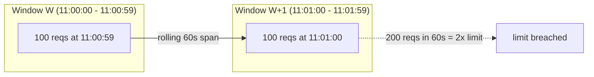
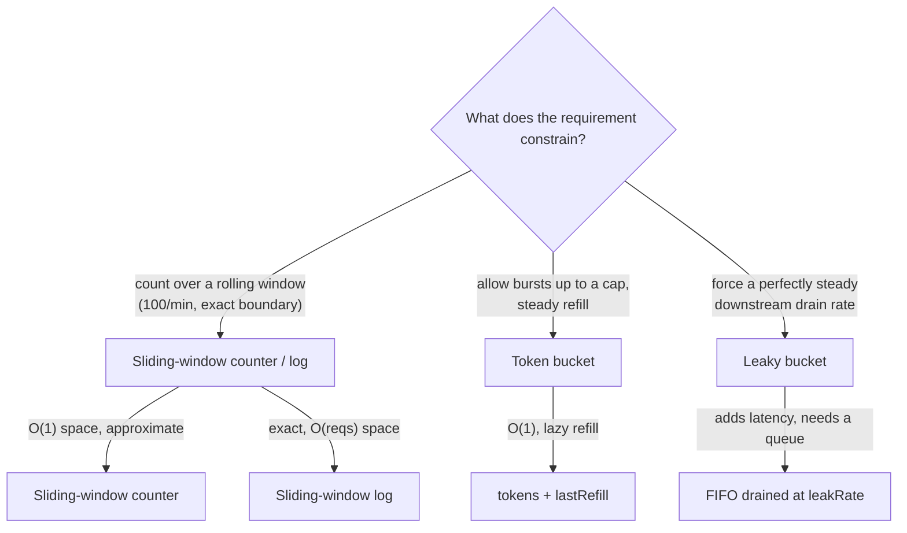
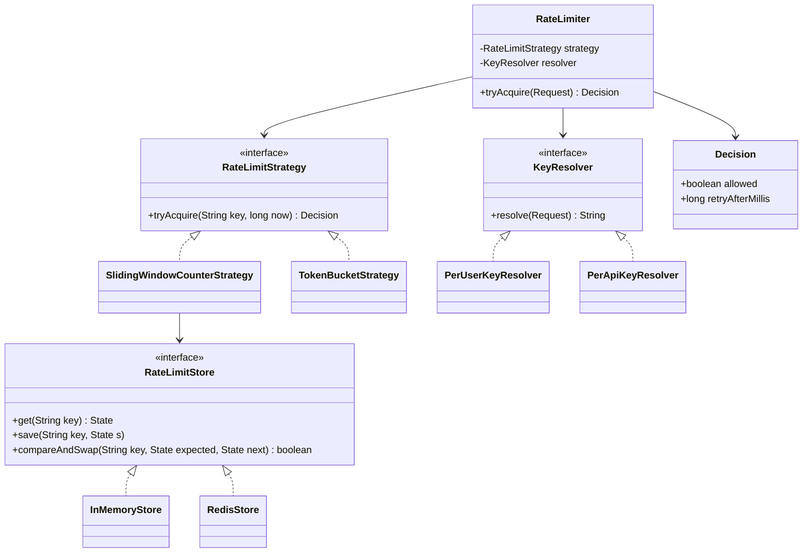

# Mock: Indian Unicorn Senior — Coding + LLD Round

This is a full, turn-by-turn transcript of a **~60-minute senior round at an Indian product unicorn** — the Razorpay / Flipkart / Swiggy archetype: a payments-or-commerce company that runs at scale, hires hard, and moves **fast**. The round is deliberately two-headed: first a **DSA-flavored coding problem** (implement an API rate limiter), then an immediate pivot to **low-level design** ("now make it a reusable library"). Indian product companies tend to weight this combination heavily — they want to see that you can write correct, optimal code *and* shape it into clean, extensible OOP, often inside a single hour. The interviewer talks quickly, expects you to keep pace, and is allergic to hand-waving.

Read it twice. The **first pass**, cover the coaching callouts and try to predict what the interviewer is scoring at each turn. The **second pass**, read the callouts and the debrief. This is a *representative* mock built to teach the signals — it is **not** a leaked or proprietary question. The rate limiter is one of the most common backend coding-plus-design prompts in the Indian product circuit precisely because it touches algorithms, concurrency, and OOP all at once. For the algorithm theory behind the choices made here, see [the deep dive on rate-limiting algorithms](../../L5-architecture-leadership/C02-distributed-systems-and-system-design/T13-rate-limiting-algorithms.md).

> [!NOTE]
> **Setup.**
> **Candidate:** ~6 years backend, mostly Java/Spring at a mid-size fintech; comfortable with concurrency and OOP, has used Redis but not built a rate limiter from scratch. Interviewing for **Senior Software Engineer (SDE-3 / senior)**.
> **Interviewer:** a senior engineer on the API-gateway team, fast-paced, scoring against a **hidden rubric** with six signals:
> 1. **DSA correctness & optimality** — right algorithm, right complexity, no off-by-one in the window math.
> 2. **Clean OOP / LLD** — interfaces, the Strategy pattern, SOLID; is it actually reusable?
> 3. **Edge cases** — boundary bursts, clock issues, first-request, concurrent callers.
> 4. **Code quality** — readable, compiles, idiomatic Java.
> 5. **Communication** — narrates trade-offs, takes the hint, doesn't go silent.
> 6. **Speed** — keeps pace; doesn't burn 20 minutes clarifying a 5-minute problem.
> **Time budget:** Part A (coding) ~30 min · Part B (LLD) ~25 min · ~5 min wrap-up.

## The Transcript

### Part A — Coding: Sliding-Window Rate Limiter

#### Phase 1 — Clarify The Problem (0:00–0:04)

**Interviewer:** Quick warm-up that turns into the main problem. Implement an **API rate limiter**. A client makes requests; you decide `allow` or `reject`. Say the limit is "100 requests per minute." Start whenever you're ready — I like people who move quickly, so don't over-clarify.

**Candidate:** Got it, I'll keep clarifying tight. Three things that actually change the algorithm. First — is the limit **per client/key** (per user, per API key) or one global counter? I'll assume per-key. Second — do we need **strict** enforcement (never allow the 101st in any 60-second window) or is approximate okay for throughput? Third — single process, or is this fronting a **distributed** fleet where many gateway nodes share the count?

**Interviewer:** Per-key, yes. Treat correctness as important — bursting at the boundary is something we actually hit in production, so I care about it. Build it **single-process first**; we'll talk distributed at the end. Go.

> [!TIP]
> Three crisp questions in under a minute, each one tied to a fork in the implementation, then *go*. At a fast-paced unicorn, over-clarifying reads as stalling. The candidate signposted "I'll keep clarifying tight" — that one phrase tells the interviewer you heard "move quickly" and adjusted.

> [!NOTE]
> **Why this problem, concretely.** A payments unicorn lives or dies on its API staying up. Rate limiting is the first wall protecting it, and it shows up in at least four shapes the interviewer has seen on the job:
> - **Protecting the payments API from abuse.** A single misbehaving integration — or an attacker spraying `POST /payments` with stolen card numbers to test which ones are live ("card testing") — can drown the gateway. A per-key limiter caps each caller so one bad actor can't starve everyone else.
> - **Per-merchant quotas.** A merchant on the free tier gets 100 checkout calls/min; an enterprise merchant gets 50,000. The *same* limiter, keyed by `merchantId`, enforces the contract the sales team sold — and it's the thing finance points to when a merchant disputes their bill.
> - **Login-attempt throttling.** The auth service caps failed-login attempts per account and per source IP — 5 failures, then a cool-down — to blunt credential-stuffing without locking out a user who simply fat-fingered their password twice.
> - **A partner integration hammering you.** A logistics partner's nightly batch job goes rogue after a deploy and fires 40,000 webhook acks/sec at your endpoint. The limiter is what keeps that from cascading into your checkout path.
>
> When the interviewer says "bursting at the boundary is something we actually hit in production," that is not a textbook flourish — it's a postmortem they lived through.

#### Phase 2 — Pick The Algorithm (0:04–0:10)

**Candidate:** Let me lay out the options so my choice is deliberate, because the interesting part of this problem *is* the boundary behavior you just flagged.

**Candidate:** The simplest is a **fixed-window counter**: bucket time into 60-second windows, keep a count per key per window, increment on each request, reject past the limit, reset at the window edge. It's O(1) time and O(1) space per key. But it has a well-known flaw —

**Interviewer:** — the boundary burst. Show me you actually understand it, don't just name it.

**Candidate:** Right. Suppose the limit is 100/minute. A client sends 100 requests in the last second of window *W* — say 11:00:59 — all allowed because the window's count starts at zero and fills to 100. The window resets at 11:01:00, and they send another 100 in the first second of window *W+1*. Both windows are individually legal, but in the **rolling 60-second span from 11:00:59 to 11:01:59 they sent 200 requests** — double the limit. Fixed window enforces the limit per *calendar* window, not per *rolling* window, so a burst straddling the edge slips through.

**Candidate:** And it's worse than "one bad client" in practice, because of synchronization. I've seen this exact failure: a fleet of mobile clients had a retry loop that woke up on a *whole-minute boundary* — they all scheduled work for `:00`. With a fixed-window limiter, every client's allowance reset at `:00` simultaneously, so thousands of them fired their first batch at `11:01:00.000`, then the tail of their previous-minute batch had landed at `11:00:59.xxx`. The two halves stacked: a clean 2x spike on the database connection pool at the top of every minute, like clockwork. The graph looked like a comb. Fixed window didn't just *allow* the boundary burst — it actively *encouraged* every client to align to the same edge, so the bursts superimposed. Sliding window spreads that out because there's no single magic reset instant everyone races to.

> [!WARNING]
> **The "doubled our load" trap is real and it's sneaky.** The danger of fixed-window isn't only that one client can sneak 2x through — it's that *clock-aligned* resets cause many clients to burst at the same instant. A limiter that's supposed to *smooth* load can amplify it into a periodic spike. If you ever see a sawtooth or comb pattern on a per-minute boundary in production dashboards, "fixed-window rate limiter" should be the first suspect.



**Candidate:** Two ways to fix it. The exact fix is a **sliding-window log**: store the timestamp of every request in a window, and on each call drop timestamps older than `now - 60s` and count what's left. That's *precise* — it's a true rolling window — but it's **O(requests-in-window) memory per key** and O(log n) or O(n) per request to prune. At 100/min that's fine; at 10,000/min per key it's a memory problem.

**Candidate:** The middle ground — and what I'll build — is the **sliding-window counter**. Keep the count for the current fixed window *and* the previous window, then estimate the rolling count as: `currentCount + previousCount * (overlap fraction of the previous window still inside the rolling window)`. It's **O(1) time and O(1) space per key** like fixed window, but it smooths the boundary burst because the previous window's tail is weighted in. It's a slight approximation, but it kills the 2x-burst problem, which is exactly your concern.

> [!TIP]
> This is the senior arc on an algorithm question: enumerate the candidates (fixed window / sliding log / sliding counter), state each one's complexity *and* its failure mode, then pick one and tie the choice back to the interviewer's stated concern ("exactly your concern"). The candidate didn't just say "I'll use sliding window" — they earned the choice.

**Interviewer:** Before you code — you skipped the bucket family. Where do **token bucket** and **leaky bucket** fit, and why aren't you reaching for one of those?

**Candidate:** Good catch, they're the other half of the design space, and they answer a *different* question. The window algorithms answer "how many requests in the last N seconds?" The bucket algorithms answer "what *shape* of traffic do I allow?"

**Candidate:** **Token bucket:** a bucket holds up to `burstCapacity` tokens and refills at `refillRate` tokens/sec. Each request takes one token; no token, reject. The point is it **allows controlled bursts** — if a client's been quiet, tokens accumulate up to the cap, so they can fire a short burst, then they're throttled to the steady refill rate. It's O(1) time and O(1) space (`tokens` + `lastRefillMillis`), refilled lazily so there's no background timer. This is what you'd actually want for, say, a partner API where occasional bursts are fine but sustained abuse isn't — it's the most common choice for public API gateways for that reason.

**Candidate:** **Leaky bucket:** think of a queue draining at a fixed rate — requests enter, leave at a constant `leakRate`, and the queue has a max depth. It **smooths** output to a perfectly steady rate, which is great when the *downstream* can only take a fixed throughput — a legacy core-banking system that falls over above 500 TPS, say. The cost is added latency (requests wait in the bucket) and you need a real queue, so it's heavier.

**Candidate:** Here's the contrast that drives my choice. Token bucket limits the *rate but permits bursts*; leaky bucket *forbids bursts and enforces a steady drain*; sliding-window counter limits the *count over a rolling window* and is the most faithful to a "100 per minute" SLA stated as a count. You said the requirement is "100 requests per minute" and that **boundary correctness** is what bites you — that's a *count over a rolling window* problem, not a *traffic-shape* problem, so the sliding-window counter is the tightest fit. If you'd said "smooth bursts up to a cap," I'd have reached for token bucket. I'll keep it behind a Strategy interface either way so swapping is a one-class change — which is exactly Part B.



> [!INTERVIEW]
> **Meta-coaching.** The interviewer threw a "you skipped X" probe — a classic test of *breadth*, not a request to change course. The candidate handled it perfectly: showed they know the bucket family cold, then *re-justified* the original choice against the stated requirement rather than flip-flopping. Knowing four algorithms is table stakes at senior; knowing *which axis each one constrains* — count-over-window vs. traffic-shape — is the discriminator. Never let a breadth probe stampede you into abandoning a choice you can defend.

**Interviewer:** Good. Sliding-window counter it is. Write it.

#### Phase 3 — Implement (0:10–0:22)

**Candidate:** Let me get the window math right before I type. I bucket time into fixed `windowSizeMillis` slots. For a key I track: the **current window's start timestamp**, the **current window's count**, and the **previous window's count**. When a request comes in at time `now`:

1. Compute which window `now` falls in.
2. If it's a *new* window, roll: previous count becomes the old current count (or 0 if we skipped a window entirely), current count resets to 0, update the window start.
3. Estimate the rolling count: `currentCount + previousCount * (1 - elapsedFractionOfCurrentWindow)`.
4. If estimate `< limit`, increment current count and allow; else reject.

```java
import java.util.Map;
import java.util.concurrent.ConcurrentHashMap;

public class SlidingWindowCounterRateLimiter {

    private final long limit;
    private final long windowMillis;
    private final Map<String, Window> windows = new ConcurrentHashMap<>();

    public SlidingWindowCounterRateLimiter(long limit, long windowMillis) {
        if (limit <= 0 || windowMillis <= 0)
            throw new IllegalArgumentException("limit and windowMillis must be > 0");
        this.limit = limit;
        this.windowMillis = windowMillis;
    }

    /** Per-key sliding-window state. Mutations are guarded by 'this' (the Window). */
    private static final class Window {
        long currentStart;   // start timestamp of the current fixed window
        long currentCount;   // requests counted in the current window
        long previousCount;  // requests counted in the immediately previous window
    }

    public boolean allow(String key, long nowMillis) {
        Window w = windows.computeIfAbsent(key, k -> new Window());
        synchronized (w) {
            roll(w, nowMillis);

            // Fraction of the current window that has already elapsed, in [0, 1).
            double elapsedFraction = (nowMillis - w.currentStart) / (double) windowMillis;
            // Weight the previous window by the part of it still inside the rolling window.
            double estimatedCount = w.currentCount + w.previousCount * (1.0 - elapsedFraction);

            if (estimatedCount < limit) {
                w.currentCount++;
                return true;
            }
            return false;
        }
    }

    /** Advance the window(s) so 'now' falls inside the current window. */
    private void roll(Window w, long now) {
        if (w.currentStart == 0) {                 // first request for this key
            w.currentStart = floorToWindow(now);
            return;
        }
        long windowsElapsed = (now - w.currentStart) / windowMillis;
        if (windowsElapsed == 0) {
            return;                                 // still in the same window
        } else if (windowsElapsed == 1) {
            w.previousCount = w.currentCount;       // exactly one window passed
            w.currentCount = 0;
        } else {
            w.previousCount = 0;                    // skipped >= 2 windows: both are stale
            w.currentCount = 0;
        }
        w.currentStart = floorToWindow(now);
    }

    private long floorToWindow(long now) {
        return now - (now % windowMillis);
    }
}
```

**Candidate:** A couple of decisions I made explicit. I floor the window start to a multiple of `windowMillis` so windows are aligned and `elapsedFraction` is well-defined. I handle three roll cases: same window (no-op), exactly one window elapsed (slide previous = current), and **two-or-more** windows elapsed — in that case both counts are stale, so I zero both rather than carrying garbage forward. That last branch is the one people forget; if a key goes quiet for five minutes, its old `currentCount` must not leak into the estimate.

> [!IMPORTANT]
> *Signal logged: edge cases — Strong.* The "skipped two or more windows" branch and the first-request (`currentStart == 0`) branch are the two off-by-one traps in this problem. Catching both, unprompted, with a one-line justification each, is exactly what "correctness is important" was probing.

**Interviewer:** Why did you take `nowMillis` as a parameter instead of calling `System.currentTimeMillis()` inside?

**Candidate:** Testability, mainly — I want to drive the clock from a test so boundary-burst cases are deterministic instead of relying on `Thread.sleep`. In production I'd inject a `java.time.Clock` or a `LongSupplier` and have a thin overload `allow(key)` that calls `clock.millis()`. It also keeps the method pure-ish: same inputs, same decision.

> [!TIP]
> Injecting the clock so the boundary-burst test is deterministic is a senior tell on *any* time-based problem. The interviewer's question was a probe — calling `System.currentTimeMillis()` inline would have been the junior answer and would have made the very edge case they care about (the boundary) untestable.

> [!NOTE]
> **In Practice — what a quiet key costs you.** The "skipped two-or-more windows → zero both counts" branch isn't just correctness theater; it's also a *memory* decision in disguise. In a real payments fleet you'll have millions of distinct keys (every merchant, every API key, every active user), and the long tail of them goes quiet for hours. If your `Window` objects never expire, that `ConcurrentHashMap` grows unbounded and you get a slow OOM in week three of a launch. In-process, you'd pair the zero-out logic with an eviction policy — a `Caffeine` cache with `expireAfterAccess(2 * windowMillis)` is the idiomatic move — so idle keys evaporate. The Redis version gets this for free via TTL (you'll see it in Part B). Interviewers at scale-conscious shops love it when you connect "zero the stale count" to "and also evict the stale *key*."

#### Phase 4 — Complexity & Correctness (0:22–0:27)

**Interviewer:** Complexity, and convince me the boundary burst is actually fixed.

**Candidate:** **Time:** `allow` is **O(1)** — one `ConcurrentHashMap` lookup, a constant amount of window arithmetic, no scan. **Space:** **O(number of distinct keys)**, with each key holding a fixed-size `Window` (three longs). That's the win over the sliding-window *log*, which would be O(requests-per-window) per key.

**Candidate:** On the burst: replay the earlier scenario with `limit = 100`, `windowMillis = 60000`. The 100 requests at 11:00:59 fill `currentCount` to 100 in window *W*. At 11:01:00 we roll: `previousCount = 100`, `currentCount = 0`, new window starts. Now at 11:01:00 the elapsed fraction of the new window is ~0, so the estimate is `0 + 100 * (1 - 0) = 100`. That's **not** `< 100`, so the very first request of *W+1* is **rejected**. The previous window's full weight is still counted because almost none of the rolling window has moved past it. As the new window progresses, that weight decays linearly — half a window later the estimate from history is ~50, leaving room for ~50 new requests. So the rolling total stays near 100, never 200. Burst fixed.

> [!IMPORTANT]
> *Signal logged: DSA correctness & Big-O — Strong.* Correct O(1)/O(keys), and — more importantly — the candidate *re-ran the interviewer's own adversarial scenario through their code* and showed the rejection numerically. Naming the algorithm proves recall; tracing the burst through it proves understanding.

**Candidate:** One honest caveat: the counter is an **approximation**. It assumes the previous window's requests were spread uniformly, so a pathological distribution can be off by a few percent at the edges. For rate limiting that's almost always acceptable — we're protecting a service, not billing — and we get O(1) space for it. If someone needed *exact* enforcement I'd switch to the sliding-window log and pay the memory.

> [!INTERVIEW]
> **Meta-coaching.** Notice the candidate volunteers the approximation *weakness* of the algorithm they just championed. Counterintuitively this raises the score: it signals they chose sliding-window-counter with eyes open, knowing the trade-off, rather than because it was the only one they knew. Owning the limitation of your own choice is a stronger move than defending it.

### Part B — Low-Level Design: A Reusable Rate-Limiter Library

#### Phase 5 — Reframe As A Library (0:27–0:33)

**Interviewer:** Now the design half. That class is fine for one algorithm in one process. I want a **reusable rate-limiter library** other teams drop into their services. They'll want different algorithms, different keys (per-user, per-API-route, per-tenant), and some will run in-memory while others need Redis because they're a fleet. Design it. Sketch the classes; you don't have to fully implement everything.

**Candidate:** So the job is to turn one concrete algorithm into a small, pluggable framework. The axes of variation you listed map cleanly onto **three separate abstractions**, so I'll separate them rather than let one class know about all three:

1. **The algorithm** — sliding-window counter, fixed window, token bucket. This is the **Strategy** pattern: a `RateLimitStrategy` interface, one implementation per algorithm.
2. **The key** — how we derive the bucket identity from an incoming request (user id, API route, IP, tenant). A `KeyResolver` so callers compose what "per-key" means.
3. **The storage** — where window/counter state lives: in-memory map vs. Redis. A `RateLimitStore` interface so the same strategy runs locally or distributed.

**Candidate:** A top-level `RateLimiter` facade wires the three together. That gives me single-responsibility per piece (SRP), and I can add a new algorithm or a new backend **without touching the others** (open/closed). Let me draw it.



> [!TIP]
> Mapping each axis of variation the interviewer named ("different algorithms / different keys / in-memory vs Redis") onto its own interface is the move that makes an LLD answer *land*. It shows you decompose by reason-to-change (SRP) rather than dumping everything into one configurable god-class. The diagram makes the relationships legible in seconds — at a fast-paced shop, that speed matters.

#### Phase 6 — Sketch The Key Classes (0:33–0:45)

**Candidate:** Let me write the interfaces and the facade, then refit my Part A algorithm to the `RateLimitStrategy` interface so it's clearly the same code, just behind an abstraction.

```java
// --- Result type: richer than a boolean so callers can set Retry-After headers ---
public record Decision(boolean allowed, long retryAfterMillis) {
    public static Decision allow()              { return new Decision(true, 0); }
    public static Decision deny(long retryMs)   { return new Decision(false, retryMs); }
}

// --- Strategy: one implementation per algorithm ---
public interface RateLimitStrategy {
    Decision tryAcquire(String key, long nowMillis);
}

// --- Key resolution: how a request maps to a bucket ---
public interface KeyResolver {
    String resolve(Request request);
}

public final class PerUserKeyResolver implements KeyResolver {
    public String resolve(Request request) {
        return "user:" + request.userId();
    }
}

public final class PerApiKeyResolver implements KeyResolver {
    public String resolve(Request request) {
        return "api:" + request.route();   // e.g. "api:POST /payments"
    }
}
```

**Candidate:** The facade is tiny — it just composes resolver and strategy, which is the point. Configuration (limit, window, which algorithm, which store) is passed in at construction, so the same `RateLimiter` type serves every team; they differ only in what they wire in.

```java
public final class RateLimiter {

    private final RateLimitStrategy strategy;
    private final KeyResolver resolver;

    public RateLimiter(RateLimitStrategy strategy, KeyResolver resolver) {
        this.strategy = strategy;
        this.resolver = resolver;
    }

    public Decision tryAcquire(Request request) {
        String key = resolver.resolve(request);
        return strategy.tryAcquire(key, System.currentTimeMillis());
    }
}
```

**Candidate:** And here is my Part A algorithm, refit to the interface and made thread-safe per key. I keep the per-key `synchronized` block from before — important point: a single global lock here would serialize *all* keys and destroy throughput, so I lock **per `Window`**, which means requests for different keys never contend. That's the same lock-striping idea, but the keys give me natural stripes for free.

```java
public final class SlidingWindowCounterStrategy implements RateLimitStrategy {

    private final long limit;
    private final long windowMillis;
    private final ConcurrentHashMap<String, Window> windows = new ConcurrentHashMap<>();

    public SlidingWindowCounterStrategy(long limit, long windowMillis) {
        this.limit = limit;
        this.windowMillis = windowMillis;
    }

    private static final class Window {
        long currentStart, currentCount, previousCount;
    }

    @Override
    public Decision tryAcquire(String key, long now) {
        Window w = windows.computeIfAbsent(key, k -> new Window());
        synchronized (w) {                     // per-key lock: different keys don't contend
            roll(w, now);
            double elapsed = (now - w.currentStart) / (double) windowMillis;
            double estimate = w.currentCount + w.previousCount * (1.0 - elapsed);
            if (estimate < limit) {
                w.currentCount++;
                return Decision.allow();
            }
            long retryAfter = w.currentStart + windowMillis - now;  // until window rolls
            return Decision.deny(Math.max(0, retryAfter));
        }
    }

    private void roll(Window w, long now) {
        if (w.currentStart == 0) { w.currentStart = floor(now); return; }
        long elapsed = (now - w.currentStart) / windowMillis;
        if (elapsed == 1)      { w.previousCount = w.currentCount; w.currentCount = 0; }
        else if (elapsed >= 2) { w.previousCount = 0;             w.currentCount = 0; }
        if (elapsed >= 1)      { w.currentStart = floor(now); }
    }

    private long floor(long now) { return now - (now % windowMillis); }
}
```

> [!WARNING]
> The trap in the LLD half is to introduce a `RateLimitStore` interface and then *not* think about its concurrency contract. An in-memory store can guard state with a per-key lock; a Redis store **cannot** — the per-key lock lives in one JVM and means nothing to other nodes. If you carry the `synchronized` block straight into a distributed design, you've shipped a race. The candidate is about to be tested on exactly this.

**Interviewer:** Your `synchronized (w)` works in one JVM. I deploy this on 20 gateway nodes behind a load balancer, all sharing the limit. Does your design still hold? What breaks, and what changes — minimally?

**Candidate:** The **structure** holds, the **`synchronized` does not**. The whole reason I put storage behind a `RateLimitStore` interface is this moment: in-memory, state lives in the JVM and a per-`Window` lock is correct. Distributed, the 20 nodes must share one counter, so state moves to **Redis**, and a JVM lock is meaningless across processes — node A's `synchronized` says nothing to node B. So two things change, and *only* these two:

1. **State moves to `RedisStore`.** The sliding-window counter maps onto Redis hashes: a hash per key holding `currentStart`, `currentCount`, `previousCount`.
2. **Atomicity moves to Redis.** The read-roll-estimate-increment must be **atomic across nodes**, so I run it as a **Lua script** (`EVAL`) — Redis executes it single-threaded and atomically, which replaces the in-process lock. The script does the same roll-and-estimate logic server-side and returns allow/deny. Set a TTL of `2 * windowMillis` on the key so idle keys self-evict and we don't leak memory in Redis.

**Candidate:** Critically, my **`RateLimitStrategy` and `RateLimiter` don't change at all** — only the strategy's *storage and atomicity mechanism* swaps. That's the payoff of separating storage from algorithm: distribution is a backend change, not a redesign. I'd add a `RedisSlidingWindowStrategy` (or parameterize the existing one with a `RateLimitStore`) and the facade is untouched.

> [!IMPORTANT]
> *Signal logged: LLD + distributed judgment — Strong.* The candidate predicted the JVM-lock-across-nodes failure, then showed their abstraction *absorbed* the change: Lua-script-on-Redis for cross-node atomicity, TTL for self-eviction, facade untouched. "Only these two things change, and only these two" is the sentence that proves the design was actually extensible, not extensible-on-a-slide.

**Interviewer:** Spell out the race the Lua script avoids. Why can't I just `GET` the counter, check it in Java, and `SET` it back?

**Candidate:** Because that's a **read-modify-write across the network**, and it's the textbook lost-update race. Picture two gateway nodes, the limit is 100, the counter is currently at 99. Node A does `GET` → 99. Before A writes back, Node B does `GET` → also 99. Both compute `99 < 100`, both decide *allow*, both `SET` 100. Two requests got through on the *same* last token — the counter should be 101 and one should have been rejected. Under sustained load this isn't rare; it's the steady state, and the more nodes you add the more the limit leaks. The check and the increment have to be **one atomic step**, and "atomic across processes" is exactly what a single Redis command — or a Lua script — gives you, because Redis runs commands single-threaded on one shard.

**Candidate:** For the *fixed-window* case you don't even need Lua — the canonical trick is `INCR` then `EXPIRE`:

```
INCR  ratelimit:user:42:window:11_01     -> returns the new count atomically
EXPIRE ratelimit:user:42:window:11_01 120  (only needs to be set once, on creation)
```

`INCR` is atomic and *returns* the post-increment value, so the node increments-and-reads in one round trip — no read-then-write gap, no lost update. The window is baked into the *key name* (`...:window:11_01`), so a new minute is literally a new key, and the `EXPIRE` self-evicts it. The one subtlety: `INCR` increments *before* you know if you're over the limit, so an over-limit request still bumps the counter — fine for fixed window since it resets anyway, but it does mean a flood of rejected requests keeps the count pinned high. People often guard the `EXPIRE` so it's only set when `INCR` returns 1 (first request in the window), to avoid resetting the TTL on every call.

**Candidate:** I'm using the *sliding-window counter*, though, which needs three fields read, the roll computed, the estimate evaluated, and a conditional increment — that's more than one command, so `INCR` alone can't express it. That's why I reach for **Lua via `EVAL`**: the whole roll-estimate-decide-increment sequence ships to Redis as one script and executes atomically. Sketching the shape:

```lua
-- KEYS[1] = the per-key hash; ARGV: now, windowMillis, limit
local h = redis.call('HMGET', KEYS[1], 'start', 'cur', 'prev')
local start, cur, prev = tonumber(h[1]) or 0, tonumber(h[2]) or 0, tonumber(h[3]) or 0
local now, win, limit = tonumber(ARGV[1]), tonumber(ARGV[2]), tonumber(ARGV[3])
local elapsedWindows = (start == 0) and 0 or math.floor((now - start) / win)
if start == 0 or elapsedWindows >= 2 then prev, cur = 0, 0
elseif elapsedWindows == 1 then prev, cur = cur, 0 end
if start == 0 or elapsedWindows >= 1 then start = now - (now % win) end
local elapsedFrac = (now - start) / win
local estimate = cur + prev * (1 - elapsedFrac)
if estimate < limit then
  redis.call('HMSET', KEYS[1], 'start', start, 'cur', cur + 1, 'prev', prev)
  redis.call('PEXPIRE', KEYS[1], 2 * win)   -- self-evict idle keys
  return 1                                   -- allowed
end
return 0                                      -- denied
```

It's the *same window math from Part A*, just executed inside Redis so all 20 nodes share one atomic counter. The Java `RedisStore` becomes a thin caller of this script; the strategy and facade are untouched.

```mermaid
sequenceDiagram
  participant N1 as Gateway Node 1
  participant N2 as Gateway Node 2
  participant R as Redis (single shard)
  Note over N1,N2: limit=100, counter at 99
  N1->>R: "EVAL slidingWindow.lua key now"
  activate R
  R-->>N1: "1 (allowed) — counter now 100"
  deactivate R
  N2->>R: "EVAL slidingWindow.lua key now"
  activate R
  R-->>N2: "0 (denied) — estimate >= 100"
  deactivate R
  Note over R: "single-threaded EVAL serializes the<br/>read-roll-decide-increment; no lost update"
```

> [!IMPORTANT]
> *Signal logged: distributed atomicity — Strong.* The candidate named the lost-update race concretely (two nodes, both read 99, both allow), gave the lightweight `INCR`+`EXPIRE` answer for fixed window *and* explained why the sliding counter needs full `EVAL`, and tied it back to "same math, atomic now." This is the difference between "I'd use Redis" (everyone says it) and "here's the exact race and the exact primitive that closes it" (senior).

> [!WARNING]
> **Redis atomicity has a sharp edge once you cluster.** `EVAL` is atomic *on a single shard*. The moment your keys span shards in Redis Cluster, a script touching keys on different shards is illegal — Redis requires all `KEYS[]` for one `EVAL` to live on the same slot. For a rate limiter this is usually fine because each script touches exactly one key (one bucket), so you naturally stay single-shard. But if an interviewer pushes on "what if you shard Redis," the right answer is "each bucket's state is one key, and I use a hash-tag like `ratelimit:{user:42}:...` so all of one bucket's data lands on one slot" — not "I'll add a distributed lock," which reintroduces the very coordination cost you used Redis to avoid.

#### Phase 7 — SOLID & Extensibility Check (0:45–0:50)

**Interviewer:** Quickly — defend this against "you over-engineered it." Three interfaces for a rate limiter?

**Candidate:** Fair challenge, and over-abstraction is a real failure mode. My defense is that each interface earns its place against a *change you explicitly asked for*:

- **`RateLimitStrategy`** — you said teams want different algorithms (token bucket for some, sliding window for others). Without it, adding token bucket means editing the limiter. With it, I add a class. **Open/closed**, and the requirement is real, not hypothetical.
- **`KeyResolver`** — you said per-user *and* per-route *and* per-tenant. That's three+ keying schemes; a `switch` on key-type inside the limiter would grow forever. **Single responsibility.**
- **`RateLimitStore`** — you said in-memory *and* Redis. This is the one that paid off most: it's why the distributed pivot was a backend swap.

**Candidate:** What I'd **resist** adding until asked: a config DSL, a metrics decorator, pluggable serialization. Those are speculative. The rule I use is "abstract on the axes the requirements already vary along, not on axes I imagine." Three interfaces, three stated variation axes — that's matched, not gold-plated.

> [!TIP]
> "Abstract on the axes the requirements *already* vary along" is the one-liner that wins the over-engineering debate. Junior LLD adds interfaces reflexively; senior LLD justifies each one against a concrete, stated change and explicitly *names what it refused to abstract*. Saying what you left out is as strong as what you put in.

> [!IMPORTANT]
> *Signal logged: clean OOP / SOLID — Strong; communication — Strong.* Each abstraction tied to a real requirement, plus an explicit list of abstractions deliberately omitted. This converts a potential "over-engineered" ding into a demonstration of restraint.

**Interviewer:** Prove the Strategy split actually pays off. A team comes to you next sprint: "we need **token bucket** for our partner API — allow short bursts, steady refill." Walk me through *exactly* what you add and what you touch.

**Candidate:** One new class, zero edits to anything existing. I add `TokenBucketStrategy implements RateLimitStrategy` — that's the only thing the requirement forces:

```java
public final class TokenBucketStrategy implements RateLimitStrategy {

    private final long capacity;          // max tokens (the burst cap)
    private final double refillPerMillis; // steady refill rate
    private final ConcurrentHashMap<String, Bucket> buckets = new ConcurrentHashMap<>();

    public TokenBucketStrategy(long capacity, double refillPerMillis) {
        this.capacity = capacity;
        this.refillPerMillis = refillPerMillis;
    }

    private static final class Bucket {
        double tokens;
        long lastRefillMillis;
    }

    @Override
    public Decision tryAcquire(String key, long now) {
        Bucket b = buckets.computeIfAbsent(key, k -> {
            Bucket fresh = new Bucket();
            fresh.tokens = capacity;          // start full so a fresh key can burst
            fresh.lastRefillMillis = now;
            return fresh;
        });
        synchronized (b) {                    // per-key lock, same striping idea as before
            double refill = (now - b.lastRefillMillis) * refillPerMillis;
            b.tokens = Math.min(capacity, b.tokens + refill);   // lazy refill, no timer
            b.lastRefillMillis = now;
            if (b.tokens >= 1.0) {
                b.tokens -= 1.0;
                return Decision.allow();
            }
            long waitMs = (long) Math.ceil((1.0 - b.tokens) / refillPerMillis);
            return Decision.deny(waitMs);     // when the next token will be available
        }
    }
}
```

**Candidate:** Now the wiring. The team constructs `new RateLimiter(new TokenBucketStrategy(burst, refill), new PerApiKeyResolver())` and they're done. I did **not** touch `RateLimiter`, `KeyResolver`, `Decision`, or `SlidingWindowCounterStrategy`. That's the open/closed principle paying its rent literally — *open* for the new behavior, *closed* against edits to working code. And if that partner API runs on a fleet, the same token-bucket math goes into a Lua script behind `RedisStore` exactly like the sliding counter did; the strategy interface doesn't know or care whether its storage is a local map or Redis. The two axes — *which algorithm* and *where the state lives* — vary independently, which is the entire reason I split them.

> [!TIP]
> When an interviewer says "prove the abstraction pays off," the winning move is to *actually write the new class and then enumerate what you did not touch*. "One class added, four classes untouched" is a concrete, falsifiable claim about your design's extensibility — far stronger than asserting "it's pluggable." The Strategy pattern's whole promise is "add a sibling, edit nothing"; demonstrate the promise, don't just name the pattern.

> [!NOTE]
> **In Practice — where this design lives in a real codebase.** A production rate-limiter library almost always grows exactly these seams. Look at how Resilience4j models its `RateLimiter` (an interface with `AtomicRateLimiter` and `SemaphoreBasedRateLimiter` implementations) or how Bucket4j separates the *bandwidth/algorithm* config from the *backend* (in-JVM, Hazelcast, Redis, JCache). They independently discovered the same decomposition this candidate reached on a whiteboard: algorithm behind an interface, storage behind another, configuration injected at construction. That convergence is the tell that the abstraction is *natural*, not invented — which is precisely why it survives the "you over-engineered it" challenge.

#### Phase 8 — Wrap-Up Follow-ups (0:50–0:55)

**Interviewer:** Two rapid-fire to close. One: a brand-new key's first-ever request — any race? Two: what's your failure mode if Redis is down?

**Candidate:** **First-request race:** `computeIfAbsent` is atomic in `ConcurrentHashMap`, so two threads racing to create the same key's `Window` get the *same* instance — only one `new Window()` wins — and then both serialize on the per-`Window` lock. No lost update. In the Redis version the Lua script handles a missing key as "fresh window," so concurrent first-requests are serialized by Redis itself. Safe in both.

**Candidate:** **Redis down:** that's a policy choice and I'd make it configurable, defaulting to **fail-open** — if the limiter can't reach Redis, *allow* the request rather than reject. Rationale: a rate limiter is a *protection* mechanism; if it fails closed, a Redis blip takes down every API behind it, turning a safety device into the outage. Fail-open degrades to "unlimited" briefly, which is far less bad than a total outage. I'd pair it with a circuit breaker and an alert so we know we're flying without the limiter, and a short local in-memory fallback limiter so we're not *completely* unprotected during the blip.

> [!IMPORTANT]
> *Signal logged: edge cases + ops judgment — Strong.* `computeIfAbsent` atomicity is the precise answer to the first-request race (not "I'd add a lock"), and **fail-open with a circuit breaker** is the production-correct call for a protection component — fail-closed here would amplify an outage. Both answers are short and exact, matching the rapid-fire pace.

## Debrief & Scorecard

| Rubric dimension | Signal shown | Rating |
|---|---|---|
| DSA correctness & optimality | Enumerated fixed/log/counter with complexity + failure mode each; correct O(1) time, O(keys) space; window math right including skipped-windows and first-request branches | **Strong** |
| Clean OOP / LLD | Three interfaces (Strategy / KeyResolver / Store) each mapped to a stated variation axis; tiny facade; SOLID defended and over-abstraction explicitly refused | **Strong** |
| Edge cases | Boundary burst traced numerically; two-or-more-windows-elapsed branch; first-request race via `computeIfAbsent`; Redis-down fail-open | **Strong** |
| Code quality | Compiles, idiomatic, sentinel-free; `record Decision` with `retryAfterMillis`; injected clock for testability | **Strong** |
| Communication | Narrated trade-offs, took every hint, volunteered the algorithm's own weakness, justified abstractions out loud | **Strong** |
| Speed | Clarified in under a minute, coded Part A in ~12 min, left full time for LLD; never went silent | **Strong** |

**Verdict: Hire (Senior).** The candidate hit the exact thing this archetype tests — strong DSA *and* clean LLD inside one fast hour. They earned the algorithm choice instead of asserting it, traced the interviewer's own burst scenario through their code, and built an OOP design whose storage abstraction made the distributed pivot a backend swap rather than a rewrite. No real stumble; the early fixed-window proposal was a *setup* for the boundary-burst discussion, not an error, and they upgraded to sliding-window-counter the moment correctness was flagged.

**The 2–3 changes that would raise the score toward Strong-Hire / Senior+:**

1. **Inject the clock into the strategy, not just defend it in Part A.** The facade still calls `System.currentTimeMillis()` directly; threading a `Clock` through the strategy from the start would make the whole library testable by construction and is a small, consistent improvement.
2. **Write the Redis Lua script, even in pseudo-code, on the board.** The candidate *described* the atomic `EVAL` correctly; sketching the 6-line script (HGET the three fields, roll, compute estimate, HINCRBY or reject, EXPIRE) would have converted "I know the approach" into "I've done this," which is the Senior+ line.
3. **Quantify the approximation error.** Saying "off by a few percent at the edges" is good; stating the worst case (a previous window fully front-loaded vs. assumed-uniform can over- or under-count by up to `previousCount` weighting) would show the same numeric rigor applied to the burst, applied to the weakness.

## Where You'll See This On The Job

This problem is a coding-interview favorite *because* it's load-bearing infrastructure at almost every backend company. The skills it tests aren't hypothetical:

- **API gateways and ingress.** Every request to a payments unicorn passes a rate-limit check at the edge — usually in the gateway (Kong, Envoy, an in-house Spring filter) before it ever reaches a service. When you build or tune that filter, you are making exactly the choices in this transcript: which algorithm, per-what key, in-memory or Redis, fail-open or fail-closed.
- **Protecting a payments API from abuse.** The "card-testing" attack — an attacker firing thousands of `POST /authorize` calls with stolen card numbers to find live ones — is blunted first by per-IP and per-key rate limits. The limiter is the cheapest, fastest layer of fraud defense, sitting in front of the expensive ML-based scoring.
- **Per-merchant / per-tenant quotas.** SaaS and API-product companies *sell* rate limits as part of the plan ("Pro: 10k req/min"). The limiter is how the contract becomes real, and `KeyResolver` keyed by `tenantId` plus a tier-based limit lookup is the production shape of "Tiered limits" below. When a customer disputes throttling, the on-call engineer reads the limiter's decision log.
- **Login and OTP throttling.** Auth services cap failed logins per account and per IP, and cap OTP/SMS sends per phone number per hour — both to stop credential stuffing and to stop attackers running up your SMS bill. Same limiter, different key.
- **Outbound throttling to fragile downstreams.** It runs the other way too: when *you* call a partner's API that allows 50 req/sec, you put a rate limiter (often token or leaky bucket) on your *outbound* path so you don't get yourself banned. The "leaky bucket smooths to a steady drain" discussion is exactly this case.
- **Operating it, not just building it.** The fail-open-with-circuit-breaker decision, the TTL to bound Redis memory, the Caffeine eviction in-process, the "comb pattern means a fixed-window limiter" diagnosis — these are the things that show up in incident reviews. Knowing them is what separates "I implemented a rate limiter once" from "I own the rate-limiting layer."

> [!TIP]
> If you've never built one, you can still ground your answer: pick one of these scenarios (the per-merchant quota is the most relatable for a product company) and narrate your design *through* it. "Say we're capping a free-tier merchant at 100 checkout calls a minute…" makes every abstract choice concrete and signals you've thought about where the code actually runs.

## Variations

- **Token bucket instead.** "Use token bucket — we want to allow bursts up to a cap but enforce a steady refill rate." Implement `TokenBucketStrategy`: store `tokens` and `lastRefillMillis`, lazily refill `elapsed * refillRatePerMillis` capped at `burstCapacity` on each call, take a token if available. Same interface — this is the payoff of the Strategy split. (Full implementation is in Phase 7 above.)
- **Distributed from the start.** If the interviewer opens with "20 nodes, shared limit," go straight to Redis + Lua and discuss why the sliding-window-log gets expensive in Redis (a sorted set per key, `ZREMRANGEBYSCORE` to prune) versus the counter's tiny hash.
- **Exact enforcement demanded.** "I need to *never* allow the 101st in any rolling minute, no approximation." Switch to the sliding-window log, accept O(requests) memory per key, and discuss pruning cost — the same fixed/log/counter trade-off, resolved the other way.
- **Tiered limits.** "Free users 100/min, paid 10,000/min, internal unlimited." Show the `KeyResolver` returning a key plus the `RateLimiter` selecting limit by tier — or a `LimitPolicy` lookup — without touching the algorithm.
- **`Retry-After` and headers.** Extend the `Decision` to drive `X-RateLimit-Remaining` and `Retry-After` response headers; the `retryAfterMillis` field is already there for it.
- **Leaky bucket for a fragile downstream.** "Our core-banking system falls over above 500 TPS — shape traffic to a steady drain." Switch to a leaky-bucket strategy backed by a bounded FIFO drained at `leakRate`; discuss the latency it adds (requests wait) and what you do when the bucket is full (reject vs. block-with-timeout). This is the one case where you *want* to forbid bursts, not just count them.
- **Sharded Redis.** "We outgrew one Redis — shard it." Because each bucket's state is a single key, you keep all of one bucket's fields on one slot with a hash-tag (`ratelimit:{user:42}:...`) so the `EVAL` stays single-shard and atomic. Discuss why a cross-shard script is illegal and why a distributed lock would be the wrong fix.
- **Cost-weighted / token-cost limits.** "Not every request is equal — a bulk export should cost 50 tokens, a health check 0." Generalize `tryAcquire` to take a `cost` (or have the strategy charge N tokens), so an expensive endpoint draws down the budget faster. Token bucket handles this most naturally; the sliding counter increments by `cost` instead of 1.
- **Observability hooks.** "We need to see *who's* getting throttled and how often." Add a metrics/event seam (a `RateLimitListener` or a thin decorator over `RateLimitStrategy`) emitting allow/deny counts per key-prefix — and note that you'd add this as a *decorator*, not by editing the strategy, keeping the algorithm classes single-responsibility. This is the "metrics decorator" the candidate deliberately *refused* to build pre-emptively, added only once the requirement is real.

## Practice

Do these on a timer, out loud, in an empty editor. See [the DSA chapter](../C02-dsa-for-interviews/) for the sliding-window pattern, and the [rate-limiting algorithms deep dive](../../L5-architecture-leadership/C02-distributed-systems-and-system-design/T13-rate-limiting-algorithms.md) for the theory behind each variant.

1. **15 min:** Implement the sliding-window-counter `allow(key, now)` from scratch with an **injected clock**, and write the boundary-burst test (100 reqs at the window edge, then assert the first request of the next window is rejected). No looking back at this transcript.
2. **10 min:** Refactor into the `RateLimitStrategy` / `KeyResolver` / `RateLimitStore` interfaces and the `RateLimiter` facade. Then add a second algorithm (token bucket) and confirm the facade is untouched.
3. **10 min, spoken:** Answer "now make it work across 20 nodes" in under three minutes — name what changes (Redis + Lua + TTL) and what doesn't (the facade), without redesigning.
4. **5 min, spoken:** Defend the design against "you over-engineered it," tying each interface to a stated requirement and naming what you refused to abstract.
5. **10 min:** Implement the **sliding-window log** variant and feel where the O(1) space guarantee is lost, so you can speak to the exact-vs-approximate trade-off from experience.
6. **8 min, spoken:** Answer the breadth probe out loud — "where do token bucket and leaky bucket fit, and why aren't you using one?" — in under two minutes, naming the axis each algorithm constrains (count-over-window vs. burst-with-refill vs. steady-drain) without abandoning your choice.
7. **10 min:** Write the lost-update race on the board for a `GET`/check/`SET` counter on two nodes (both read 99, both allow), then write the `INCR`+`EXPIRE` fix for fixed window *and* explain why the sliding counter needs `EVAL` instead. This is the single most common distributed-rate-limit follow-up.
8. **8 min:** Implement `TokenBucketStrategy` against the same `RateLimitStrategy` interface, wire it into the facade, and prove by inspection that you touched **zero** existing classes. Add a `cost` parameter so an expensive endpoint draws more tokens.
9. **5 min, spoken:** Take one concrete scenario from "Where You'll See This On The Job" (per-merchant quota is the most relatable) and narrate your *entire* design through it, so every abstract choice has a real referent.
10. **6 min:** Sketch the Redis Lua script for the sliding-window counter — `HMGET` the three fields, roll, estimate, conditional `HMSET`+`PEXPIRE`, return allow/deny — until you can write it without looking. Converting "I know the approach" into "I've written it" is the Senior+ line the debrief flagged.

## Recap

- **Earn the algorithm.** Enumerate fixed-window / sliding-log / sliding-counter, give each its complexity *and* its failure mode, then pick one and tie it to the interviewer's stated concern. The **fixed-window boundary burst** (2x the limit across a window edge) is the why; the **sliding-window counter** is the O(1)-space fix that smooths it.
- **Get the window math exact.** The two off-by-one traps are the **first request** (`currentStart == 0`) and **two-or-more windows elapsed** (zero both counts — don't leak stale state). Trace the burst numerically to prove the fix.
- **Inject the clock** so time-based edge cases are deterministic instead of `Thread.sleep`-flaky.
- **Decompose LLD by axis of variation.** Algorithm → Strategy, key → `KeyResolver`, storage → `RateLimitStore`. Each interface earns its place against a *stated* requirement; name what you refused to abstract to defend against over-engineering.
- **Storage abstraction is what makes the distributed pivot cheap.** Per-`Window` `synchronized` is correct in-process but meaningless across JVMs; distributed means **Redis + an atomic Lua `EVAL`** for cross-node atomicity plus a **TTL** for self-eviction — and the facade doesn't change.
- **Ops judgment closes it:** `computeIfAbsent` for the first-request race, and **fail-open + circuit breaker** when Redis is down, because a protection component must not become the outage.
- **Know the whole algorithm family and which axis each constrains.** Window algorithms answer *"how many in the last N seconds"* (sliding-window counter = O(1) approx, sliding-window log = exact but O(reqs)); bucket algorithms answer *"what shape of traffic"* (**token bucket** = allow bursts up to a cap then steady refill; **leaky bucket** = forbid bursts, drain at a fixed rate for a fragile downstream). A breadth probe ("why not token bucket?") is a test of range, not a request to switch — re-justify against the stated requirement.
- **The distributed race has a name and a fix.** Naive `GET`/check/`SET` across nodes is a **lost update** (two nodes read 99, both allow). Fixed window closes it with atomic `INCR`+`EXPIRE`; the sliding counter needs a full `EVAL` Lua script because it reads three fields, rolls, estimates, and conditionally increments — all of which must be one atomic step on a single Redis shard.
- **Prove extensibility by adding a class and naming what you didn't touch.** A new algorithm (token bucket) is *one* `RateLimitStrategy` implementation with the facade, resolver, `Decision`, and the existing strategy all untouched — open/closed paying rent. Real libraries (Resilience4j, Bucket4j) converge on this same algorithm-vs-storage split, which is the sign it's natural, not gold-plating.
- **It's production infrastructure, not a toy.** Rate limiting protects payments APIs from card-testing abuse, enforces per-merchant quotas you *sold*, throttles logins and OTPs against credential stuffing, and shapes your *outbound* calls to fragile partners. Grounding the answer in one of these (per-merchant quota is most relatable) makes every abstract choice concrete.

## Next

[Banking JVM-Deep Interview](./T06-mock-banking-jvm-deep-interview.md) — the next mock leaves product-startup speed behind for an investment-bank archetype, where the rubric goes deep on the **JVM and concurrency internals**: memory model, garbage collection, lock contention, and the kind of "what does this print, and why" questions that test how the runtime actually behaves under the hood.
