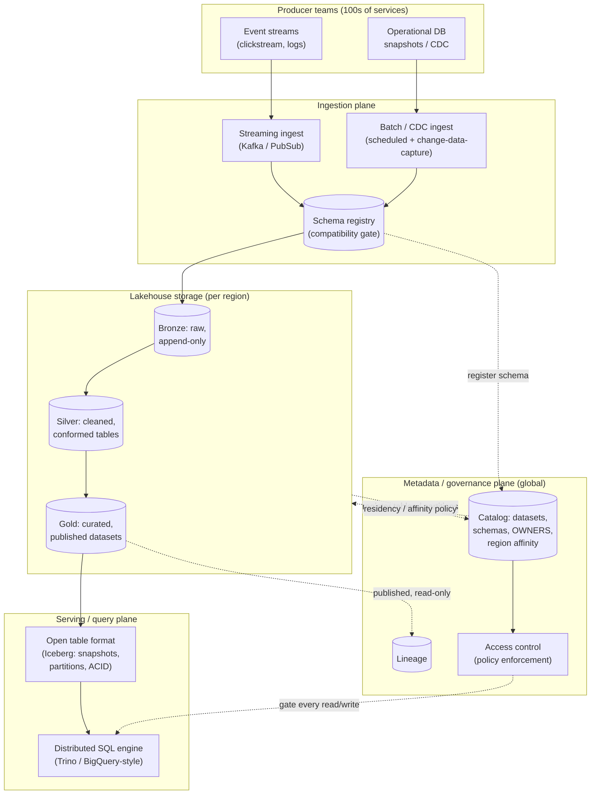
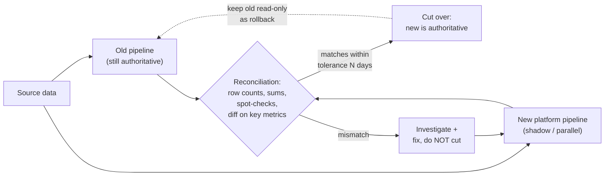

# Mock: Staff Architect (Google L6-Style)

This is a verbatim-style transcript of a **staff-architect round** in the Google L6 archetype: an open, deliberately *under-specified* prompt — "design a company-wide, multi-region data platform" — run over roughly 50–60 minutes by an interviewer whose job is to find the ceiling of your **judgment**, not to check whether you can name a columnar format. The round blends deep system design *with* technical leadership and ambiguity-handling. There is no single correct answer; there is barely a defined question. That is the point. At L6 the bar is not "produce a working architecture" — a senior engineer can do that once the requirements are pinned. The bar is **scope, ambiguity-handling, and driving direction**: can you take a vague, organization-sized problem, *carve a defensible charter out of it*, sequence a migration that real teams will actually adopt, and reason about what's reversible versus what you're stuck with for a decade.

Read it the way the chapter intends. Cover the coaching callouts and predict, turn by turn, what the interviewer is scoring. The candidate here is strong but human: they **over-scope at the start** — reaching for the whole platform at once — the interviewer nudges, and the candidate *cuts scope crisply* and states a concrete charter. That cut is one of the strongest staff signals in the whole transcript, not a stumble. This is a **representative mock**, not a leaked question; "Google L6" denotes the format and bar — open-ended, ambiguity-first, influence-aware — not any one company's loop.

A useful picture to carry through the whole round: **a company-wide data platform is a city's shared water system.** There are reservoirs (the storage lake), treatment plants (the cleaning and conforming stages), a network of pipes (ingestion and serving), and meters on every building (per-tenant quota and chargeback). Nobody runs to the reservoir with a bucket; every neighbourhood — every team — taps the same mains and trusts the water is clean, available, and metered. The architect's job is *not* to hand each neighbourhood its own well. It's to design the one shared system that fifty neighbourhoods can rely on, and to decide which pipes you can re-lay next year versus which you're committing concrete to for a decade. Hold that image; the transcript returns to it.

> [!NOTE]
> **What L6 Really Tests (read before the transcript).** A senior engineer, given pinned requirements, can produce a working architecture — that is *table stakes*, not the L6 bar. This round is scoring three things a title-bump actually requires:
> - **Scope.** Can you take an org-sized, deliberately vague prompt and *carve a defensible charter* out of it — naming what's in, what's deferred, and a success metric — instead of freezing or boiling the ocean? On the job this is the difference between a platform that ships a coherent v1 and one that spends a year building four half-platforms nobody adopts.
> - **Influence.** Can you drive fifty teams toward one standard *without* the authority to order any of them? Real staff+ work is almost never "I told them to." It's "I made the right thing the easy thing, was right about the trade-offs, and the org chose it."
> - **Sequencing.** Can you order the work so the org *feels* value early and so the irreversible decisions are made consciously and late? Migration order, rollout order, and reversible-vs-irreversible calls are where staff judgment is visible.
>
> Everything in the rubric below rolls up to those three. When you cover the coaching callouts, ask of each turn: *is this scoring scope, influence, or sequencing — and which way did the candidate move it?*

> [!NOTE]
> **Setup**
> **Candidate profile.** ~11 years' experience, currently senior/lead, interviewing for **Staff Engineer (L6/E6/IC6)**. Has built and operated large backend services and owned one cross-team migration, but has never been *the* architect for a platform consumed by dozens of internal teams. Exactly the adjacent-but-bigger-than-anything-they've-owned prompt that staff architect rounds favor — it tests whether they think at org scale, not just service scale.
>
> **The interviewer's hidden rubric (the staff-architect signals).** The interviewer is not scoring "is the design correct." They are scoring:
> 1. **Frames an ambiguous problem** — turns a vague prompt into a concrete charter with a stated success metric, instead of either freezing or boiling the ocean.
> 2. **Technical depth at scale** — can go to mechanism level (partitioning, replication, consistency) when probed, not just box-drawing.
> 3. **Trade-off articulation** — names the axis, picks a point on it, and says *why* and *what it costs*.
> 4. **Org / cross-team thinking** — rollout, migration, adoption, governance — treats the platform as a *product with internal customers*, not just a system.
> 5. **Risk & failure thinking** — failure modes, blast radius, and which decisions are reversible vs. one-way doors.
> 6. **Drives the conversation** — owns direction, time-boxes, makes calls and defends them, invites the interviewer in without waiting to be led.
>
> **Time budget (≈55 min).** Scope the ambiguity & pick a charter 8 · Requirements & constraints 7 · High-level architecture 10 · Deep dives (partitioning, replication/consistency, schema evolution, hot tenants) 16 · Org / rollout / migration 9 · Risks & failure modes 4 · Wrap 1.

## The Transcript

### Phase 1 — Scoping the Ambiguity & Picking a Charter (≈8 min)

**Interviewer:** We want to build a company-wide data platform. Many internal teams need to get data in, store it, and query it. Design it.

**Candidate:** Okay. That prompt is enormous on purpose, so before I draw anything let me think out loud about what "data platform" could mean, because there are at least four products hiding in that sentence, and I'd build them differently. There's the **ingestion** layer — getting events and table snapshots in from hundreds of services. There's **storage** — a lake, a warehouse, or both. There's **serving** — interactive analytics, ML feature reads, dashboards, and low-latency point lookups, which have wildly different SLAs. And there's the **metadata/governance** spine — catalog, schemas, lineage, access control — which ties it together. I could spend the whole hour on any one of these.

Here's what I want to do: build the whole platform's skeleton, then go deep on the spine and on storage, because that's where the irreversible decisions live —

**Interviewer:** Hold on — you've got 55 minutes and you just listed four platforms. If you had to ship *one* thing first that real teams adopt, what is it?

> [!INTERVIEW]
> **The staff bar, exposed in one exchange.** The interviewer just did the single most common thing in an L6 architect round: handed an impossibly broad prompt and waited to see whether the candidate would try to *boil the ocean*. The candidate's first instinct — "build the whole skeleton then go deep on everything" — is the trap. It reads as senior-strong (they clearly *can* enumerate the space) but staff-weak (they haven't shown they can **carve a charter**). The nudge isn't a gotcha; it's the rubric talking. What happens in the next 90 seconds — do they cut crisply, or do they negotiate for more scope — is most of the score.

**Candidate:** Fair — I over-reached. Let me cut hard. *(pauses)* The one thing worth shipping first, and the spine everything else hangs off, is **batch and near-real-time ingestion into a governed storage layer with a shared catalog**, serving analytical (OLAP) reads. So my **charter for this hour**: design the multi-region ingestion → storage → analytical-serving path, with the metadata/governance spine as a first-class component, and I'll explicitly *defer* two things — the low-latency online-serving / ML-feature path, and the BI/dashboard product on top — as separate downstream consumers that read from this platform's published tables. They're real, they're just not in this charter.

And let me state what "success" means so we can both judge the design against it: a team can **self-serve onboard a new dataset in under a day** without filing a ticket to my team, datasets are **discoverable and access-controlled by default**, fresh data is queryable within an **SLA appropriate to its tier** (minutes for near-real-time, hours for batch), and the platform survives a **single-region failure** without data loss. If the design doesn't move those four numbers, it's not done.

**Interviewer:** Good. That's the charter. Use it.

> [!TIP]
> Watch the recovery move, because it's the whole topic in miniature. The candidate doesn't get defensive ("well, you said *company-wide*..."). They say "I over-reached," then in one breath: pick the spine, name the success metric, and *declare what's deferred and why*. Deferring the online-serving path isn't ducking the hard part — it's saying "I know it exists, it has a different SLA, and conflating it with analytics is how data platforms become unmaintainable." At senior level you answer the question; at staff level you **decide what the question is** and defend the boundary.

> [!IMPORTANT]
> **The over-scoping moment is the single highest-signal beat in the round — and it happens to almost everyone.** In real L6 loops, the most common way a *strong* candidate underperforms is not getting a mechanism wrong; it's enumerating the whole space and then trying to build all of it, running out of clock at 40 minutes with four shallow half-designs and no charter. The candidate above does the exact thing that recovers it: when nudged, they **cut scope crisply and out loud** rather than negotiating to keep more. In the water-system analogy, the interviewer asked "which pipe do you lay *first*, that a neighbourhood will actually connect to?" — and the candidate stopped trying to plumb the entire city in one pass and committed to the trunk main: ingestion → governed storage → analytical reads. The crisp cut *is* the staff signal. If you take one rep from this whole topic, it's this: rehearse cutting scope on demand without flinching.

> [!INTERVIEW]
> **War story behind this beat.** A common real-world version: a newly-minted staff engineer is handed "unify our data infrastructure" and spends the first quarter writing a 40-page design doc covering ingestion, storage, serving, ML features, BI, and governance — all of it, to "do it right." Six months in, nothing has shipped that a team can use, three partner teams have lost patience, and a peer who quietly shipped a single self-serve ingestion path has all the momentum. The lesson the candidate has clearly internalized: **a charter you can ship beats a vision you can't.** "Company-wide" describes the *destination*, not the *first deliverable*. The interviewer's nudge is compressing that six-month lesson into ninety seconds — and watching whether you already know it.

### Phase 2 — Requirements & Constraints (≈7 min)

**Candidate:** Let me pin the constraints that actually shape the architecture, because "data platform" hides four design-driving requirements.

First, **multi-tenancy**. Dozens-to-hundreds of internal teams share this. That means tenant **isolation** (one team's bad query can't starve another's), **chargeback/quota** (cost is attributable per tenant or the platform becomes a tragedy of the commons), and **blast-radius containment** (one team's schema mistake can't corrupt a shared table). Multi-tenant is the requirement that turns a storage system into a *platform*.

Second, **multi-region**. I'll assume we operate in, say, three regions across two continents, for latency-to-producers, for DR, and possibly for **data residency** — EU data may be legally required to stay in the EU. Residency is the constraint that can override every other design choice, so I want to confirm it early: do we have hard residency requirements, or is multi-region purely for availability and latency?

**Interviewer:** Assume yes — some datasets are EU-residency-bound, most are not. It's per-dataset.

**Candidate:** That's a big one, thank you — it means **region affinity is a property of the dataset, declared in the catalog**, not a global platform setting. Some datasets are pinned to EU and must never replicate out; others are global and replicate freely. The catalog has to enforce that, which elevates the catalog from "nice directory" to "policy enforcement point." I'll come back to that.

The mental model I'd use for the regions, by the way, is **franchising a proven store**. Head office designs one store — the layout, the supply chain, the brand standard — and then each region runs its own location *locally* (its own staff, its own till, serving its own neighbourhood quickly) but to *one standard*. You don't redesign the store per region; you franchise the proven one and let local rules apply on top. Multi-region here is the same: one platform design, instantiated per region for latency and DR, with *local* policy overrides — and EU residency is exactly that local rule. The EU "franchise" keeps its customers' data on its own premises and is legally forbidden from shipping it to the other stores; the global franchises share freely. The catalog is head office: it owns the one standard *and* records which local rules bind which dataset.

> [!NOTE]
> **In Practice — why "per-dataset, catalog-declared" is the load-bearing phrase.** A weaker candidate says "we'll be multi-region for DR" and moves on, treating region as a *platform-wide* setting. The candidate here makes region affinity a **per-dataset property the catalog enforces**, which is what real residency law actually requires: GDPR doesn't care that your *platform* is in the EU, it cares that a *specific dataset* of EU personal data doesn't leave. On the job this single decision ripples everywhere — replication, query routing, backup, even where a failed job's debug logs are allowed to land. Declaring it in the catalog (data, not config) means the rule travels *with* the dataset and is enforced by software, not by a wiki page everyone forgets. That is the difference between "we said we're compliant" and "we *cannot* be non-compliant by construction."

Third, **freshness and consistency tiers**. Not all data needs the same guarantees, and pretending it does is how you overpay. I'd offer **tiers**: a *batch* tier (hours-fresh, eventually consistent, cheapest), a *near-real-time* tier (minutes-fresh, eventually consistent), and I'll flag that anything needing *strong* read-your-writes or cross-region transactions is out of charter — that's the online-serving system, not the analytics platform. Pushing teams to declare their tier is itself a governance lever.

Fourth, **schema evolution as a first-class problem**, not an afterthought. With hundreds of producers, schemas *will* change weekly, and a breaking change by one producer cannot break every downstream consumer. So schema compatibility rules and a schema registry are load-bearing infrastructure, not a feature.

```text
DESIGN-DRIVING CONSTRAINTS  (the four that shape everything)
1. Multi-tenant   -> isolation, per-tenant quota/chargeback, blast-radius limits
2. Multi-region   -> per-DATASET residency + affinity (catalog-enforced), DR
3. Freshness tiers-> batch (hrs) / near-real-time (min); strong-consistency = OUT
4. Schema evolution-> registry + compatibility rules are infrastructure, not nice-to-have

SUCCESS METRICS (from the charter)
- Self-serve onboard a dataset < 1 day, no ticket to platform team
- Discoverable + access-controlled by default
- Queryable within tier SLA
- Survive single-region loss, zero data loss
```

> [!IMPORTANT]
> The candidate did something senior candidates skip: they let a *constraint* (per-dataset residency) **change the architecture** in real time — promoting the catalog from a directory to a policy-enforcement point. That's the difference between requirements-gathering as a checklist and as design. The line "residency can override every other design choice, so confirm it early" is staff-grade risk sequencing: surface the one-way-door constraint *before* you've built on an assumption it invalidates.

**Interviewer:** Before you draw — roughly how big is this? Give me an order of magnitude so I know what scale we're designing for.

**Candidate:** Let me size it just enough to pick the right tools, not to false-precision it — at platform scale the *shape* of the numbers matters more than the exact value.

```text
ROUGH SIZING  (order of magnitude, to pick tools — not a capacity plan)
- Producer teams:                ~100s of services across ~50 teams
- Datasets under management:      ~10,000 tables, growing
- Daily ingest volume:            ~100 TB/day (events dominate)
- Total stored (hot + warm):      ~10s of PB on object storage
- Peak streaming ingest:          ~ low-millions of events/sec aggregate
- Interactive analytical queries:  ~10,000s/day, bursty (business hours)
- Catalog ops (read every query): ~100,000s/day  -> catalog is HOT, must cache
```

Two numbers drive tool choice. **10s of petabytes** rules out anything that couples storage to compute pricing — at this volume, paying for warehouse-resident storage 24/7 is the cost mistake, which is why I want cheap object storage with elastic compute on top. And the **catalog is read on every single query** — 100K+ ops/day on the critical path — so it *cannot* be a slow metadata DB; it has to be HA and heavily cached, which reinforces why I'm treating it as a first-class, hardened component rather than a directory. The streaming peak (low-millions/sec) says the ingest bus is a real distributed log, not a queue I can hand-roll. I won't over-fit beyond that — exact QPS won't change the architecture, only the cluster sizing.

> [!TIP]
> Notice the candidate *refuses* false precision — "size it enough to pick the right tools" — and converts the two load-bearing numbers (PB-scale storage, catalog-on-every-query) directly into design constraints, then stops. A weak candidate either skips sizing entirely (and then can't justify storage/compute decoupling) or computes a page of QPS no decision depends on. At platform scale, the *shape* of the number (PB not TB; catalog is hot) is what drives the architecture.

**Interviewer:** While we're on scale — at tens of petabytes and tens of millions of dollars a year, *cost* is a first-class design axis, not an afterthought. Where does the money go, and what in your design controls it?

**Candidate:** Right — at this size, efficiency *is* a feature, and if I don't design for it the bill compounds silently until finance comes asking why the platform costs more than the products on top of it. Let me name where the money actually goes, biggest first, because the cost shape drives the design as much as the load shape did.

```text
WHERE THE MONEY GOES  (platform-scale cost shape, biggest first)
1. Standing compute      Warehouse/cluster sized for PEAK, idle nights/weekends
                         -> the classic overspend. Fix: decouple, scale-to-zero.
2. Storage of zombies    10,000 tables, but ~half are never queried after week 1
                         -> pay PB-scale storage for data nobody reads.
3. Repeated full scans   SELECT * over partitioned tables; no pruning
                         -> compute burned re-reading data that never changed.
4. Small-file overhead   Over-partitioning -> metadata + IO amplification
                         -> you pay to LIST and OPEN millions of tiny files.
5. Cross-region egress    Replicating data nobody in that region reads
                         -> network egress is the silent line item.
```

The design *already* attacks the top items, which is the point — efficiency isn't a separate workstream, it falls out of the architecture. **Decoupled storage/compute** kills #1: compute scales to zero between bursts instead of idling at peak 24/7. **Tiered storage** (hot object storage → warm → cold/archive, by access recency) attacks #2 and #5: a table nobody has queried in 90 days drops to archive pricing automatically. **Partitioning and clustering** attack #3 by making pruning the default, and **compaction** attacks #4 by rewriting small files into large ones.

But the lever I trust most over the long run is **chargeback visibility**. When each tenant *sees* "your daily full-table scan costs $4,000/month," the behaviour changes without me policing it — the same meter-on-every-building idea from the water system. Quotas stop acute blowups; the meter prevents chronic waste. So the cost model isn't a spreadsheet I bolt on at the end — it's the catalog tagging every byte and every query to an owner, which I get *for free* because the governance plane already attributes everything to a dataset owner.

> [!IMPORTANT]
> **In Practice — efficiency is an architecture property, not a cleanup project.** The senior instinct is to treat cost as a later optimization ("we'll right-size the cluster in Q3"). The staff instinct the candidate shows is to notice that **the same decisions that make the platform reversible and governed also make it cheap**: decoupling buys both engine-optionality *and* scale-to-zero; the governance plane that enforces residency *also* attributes cost per owner. When one mechanism pays for three properties, you've found a load-bearing decision. On real platforms, the teams that bolt cost on last spend the following year in a "cost task force"; the ones that designed attribution and tiering in from day one never need one.

### Phase 3 — High-Level Architecture (≈10 min)

**Candidate:** Here's the shape. The spine is **ingestion → a lakehouse storage layer in tiers → a query/serving layer → and a metadata/catalog/governance plane that sits across all of it**. Let me draw it, then walk the cuts and justify each one.



Walking the cuts. **Ingestion is split into streaming and batch/CDC** deliberately, because the two have different failure and ordering semantics — events are high-volume and append-only; operational-DB capture is change-data-capture with update/delete semantics — and forcing them through one path makes both worse. Both go through the **schema registry first**, which is the compatibility gate: a producer cannot land data whose schema breaks the registered contract. That single chokepoint is what makes "one producer's change can't break every consumer" actually true.

**Storage is a three-tier lakehouse** — bronze (raw, append-only, the immutable record of what arrived), silver (cleaned and conformed), gold (curated, *published* datasets other teams consume). The reason for tiers isn't fashion: it's that **bronze is your replayability insurance**. If a transformation bug corrupts silver, I can rebuild from immutable bronze. I'd store all of it on object storage with an **open table format like Iceberg** over it — that gives me ACID snapshots, schema evolution, partition pruning, and time-travel *without* coupling storage to a single proprietary engine.

**The serving plane is a distributed SQL engine over the table format**, decoupled from storage — so compute scales independently of data, multiple engines can read the same tables, and I'm not locked into one vendor's compute.

And the **governance plane is global and sits across everything**: the catalog holds datasets, schemas, owners, and — critically — **region affinity / residency policy**, and access control gates *every* read and write through it. That's the component that turns this from "a lake some teams dump into" into a governed platform.

**Interviewer:** Why decouple the query engine from storage? Most teams would just use one warehouse.

**Candidate:** Three reasons, in priority order. **Cost and elasticity** — analytical load is bursty; decoupling lets compute scale to zero between query bursts while storage stays cheap, instead of paying for a warehouse sized for peak 24/7. **Engine optionality** — a Trino-style engine for interactive SQL, a Spark job for heavy ETL, and an ML framework can all read the *same* Iceberg tables; coupling storage to one engine forces every workload through one tool's strengths and weaknesses. **Lock-in / reversibility** — and this is the staff reason — an open table format on object storage is a **reversible** decision: I can swap the query engine in two years without migrating petabytes. A proprietary warehouse that owns both storage and compute is a **one-way door**: getting out means a multi-quarter data migration. At platform scale, optionality on the irreversible layer is worth real complexity.

> [!INTERVIEW]
> **Decompose, then defend each cut — at *org* altitude.** The senior version of this answer draws the same five boxes. The staff version justifies each boundary by a *property the org will feel*: bronze exists because it's replayability insurance; storage/compute are split because one is reversible and the other is a one-way door; the catalog is global because residency policy must be enforced in one place. Notice the candidate consistently reaches for **reversibility** as the deciding axis. That word — *one-way door vs. two-way door* — is the single most reliable tell of someone who has owned a decision they couldn't take back.

### Phase 4 — Deep Dives (≈16 min)

**Interviewer:** Let's go deep. Partitioning — how do you lay out a big gold table that everyone queries?

**Candidate:** Partition by the **dominant query predicate**, which for analytical data is almost always **time** — `event_date` — because nearly every analytical query has a time range, and date partitioning lets the engine prune to just the relevant days instead of scanning the whole table. Then I'd consider a **secondary partition or clustering key** by the next-most-common high-cardinality filter — often `tenant_id` or a region/event-type — so multi-tenant queries prune to one tenant's data and don't scan everyone's.

But the failure mode I'd design *against* up front is **small files / over-partitioning**. If I partition by `(date, tenant, event_type, country)`, a low-volume tenant produces thousands of tiny files per day, and analytical engines die on small-file overhead — metadata explodes and scans get slow. So I'd partition coarsely (date, maybe tenant) and use the table format's **clustering / sort-within-partition** for the finer keys, plus a **background compaction** job that rewrites small files into large ones. Iceberg's hidden partitioning and compaction are exactly for this. The rule I'd hand teams: *partition for pruning, cluster for the rest, and never let a partition key be high-cardinality enough to make tiny files.*

**Interviewer:** Now the hard one — multi-region replication and consistency. A dataset lives in three regions. What's the model?

**Candidate:** I'll be explicit that this is an **analytical platform, so I'm choosing availability and partition-tolerance over strong cross-region consistency** — eventual consistency with a bounded staleness SLA is the right point on the spectrum here. I'm *not* building cross-region ACID transactions; that's the online-serving system I scoped out. Within that, three patterns by dataset class:

```text
DATASET CLASS          REPLICATION MODEL                    CONSISTENCY
EU-residency-pinned    NO cross-region replication.         N/A (single region)
                       Pinned to EU region. Catalog
                       enforces; reads route to EU.

Global, write-once     Async replicate object storage +     Eventual; bounded
(immutable snapshots)  Iceberg metadata to all regions.     staleness SLA
                       Snapshots are immutable -> no         (e.g. < 15 min).
                       write conflicts EVER.

Global, mutable        Single WRITER region per dataset      Eventual at readers;
(upserts/deletes)      (home region owns writes); async      no multi-writer
                       replicate to reader regions.          conflicts.
```

The key insight that makes this *tractable* rather than a distributed-consensus nightmare: **lakehouse data is largely immutable snapshots**. A gold table is published as a new immutable Iceberg snapshot; readers in other regions just need that snapshot's files and metadata replicated to them. Immutable data has **no write-conflict problem** — there's nothing to reconcile — so cross-region replication degenerates to "copy these new files and flip a metadata pointer," which async replication handles fine with a bounded-staleness SLA.

For the genuinely mutable case (CDC tables with upserts/deletes), I avoid multi-writer entirely with a **single home region per dataset** that owns all writes; other regions are read replicas. That sidesteps the hardest distributed-systems problem — conflicting concurrent writes across regions — by *design choice*, not by solving consensus. If a team truly needs active-active multi-region writes with conflict resolution, that's a strong signal they want the online OLTP system, not the analytics platform, and I'd route that conversation there rather than contort this platform to do it.

> [!WARNING]
> The trap on a multi-region question is to start reaching for Paxos/Raft and cross-region quorums to make analytics "strongly consistent." That's solving a problem you don't have at a cost you can't afford. The strong move is the candidate's: **state the CAP point explicitly** (AP with bounded staleness), then exploit the domain property — *analytical data is mostly immutable snapshots* — to make replication trivial, and for the one mutable case, **dodge multi-writer conflicts entirely** with single-home-region ownership. Naming "if they need active-active writes, that's a different system" is scoping discipline under a hard probe, not dodging.

**Interviewer:** Schema evolution. A producer adds a column, then later renames one, then wants to change a type. Walk me through it.

**Candidate:** Schema changes split into three compatibility classes, and the registry enforces which are allowed:

1. **Backward-compatible (add a nullable column, add an enum value):** *allowed automatically.* Old consumers ignore the new column; new consumers read it. The registry accepts the new schema version, the table format evolves the schema in place (Iceberg tracks columns by **ID, not by position or name**, which is why an add is safe and cheap).

2. **Rename a column:** this is the subtle one. Because the table format tracks columns by **ID**, a *true* rename (keep the ID, change the display name) is metadata-only and safe. The danger is a producer who "renames" by dropping the old column and adding a new one — that's a drop+add, which silently breaks every consumer reading the old name. So the registry has to distinguish a real rename from a drop+add, and **reject drop-of-a-referenced-column** unless it goes through a deprecation flow.

3. **Type change (e.g. int → string):** generally **breaking** and *not* auto-allowed. The platform's answer isn't "no" — it's a **versioned migration**: publish a new table version / a new column, dual-write or backfill, migrate consumers, then retire the old. The governance lever is that the registry blocks the silently-breaking version, and the catalog's **lineage** tells me exactly which downstream datasets and teams I'd break, so I can notify them *before* it ships.

The principle: **the producer cannot unilaterally break consumers.** Compatibility is enforced at the registry (a write-time gate), and lineage makes the blast radius of any proposed change *visible* before it lands. That's schema evolution as governance, not as a migration fire drill.

**Interviewer:** Last deep dive — hot tenants. One team runs a massive query or floods ingestion and degrades everyone. What happens?

**Candidate:** This is the multi-tenant isolation requirement coming due, and it bites on **two axes — ingest and query** — with different mitigations.

On **ingest**: per-tenant **quotas and rate limits** at the ingestion gate, and because tenants share Kafka/storage, I want per-tenant **partition/throughput allocation** so one tenant's flood backs up *their* lane, not the shared one. If a tenant exceeds quota, I throttle or shed *their* traffic and alert *them* — the blast radius stays inside that tenant.

On **query**: this is where shared compute hurts most. Mitigations in order of strength — (1) **resource groups / query admission control** in the SQL engine: each tenant gets a CPU/memory pool, and a runaway query is queued or killed rather than allowed to consume the cluster; (2) **per-query limits** — max scan bytes, max runtime, max concurrency per tenant — so a `SELECT *` over a petabyte gets rejected at planning time with a helpful error, not after it's eaten the cluster; (3) for the worst offenders or premium tenants, **compute isolation** — their own warehouse/cluster, which the decoupled storage layer makes cheap because they read the *same* tables without copying data.

And the **chargeback loop** is the real long-term fix: when each tenant *sees and pays for* their compute and storage cost, the incentive to run a daily full-table scan disappears on its own. Quotas stop the acute incident; chargeback prevents the chronic one. Isolation is partly a systems problem and partly an economics problem, and a platform that only solves the systems half will keep fighting hot tenants forever.

**Interviewer:** One more on the governance side, because it's where these platforms quietly fail. Ten thousand datasets, hundreds of producers — six months in, *nobody knows what data exists, who owns it, or where a given column came from.* How does your design stop that?

**Candidate:** This is the part that decides whether the platform is an asset or a swamp, so it's worth being concrete. Three things have to be true, and all three are properties of the governance plane, not features I add later: **every dataset is discoverable, every dataset has an accountable owner, and every column has traceable lineage.** Let me take them in turn.

**Discoverability and ownership** come from making the catalog the *mandatory* front door. You cannot publish a gold dataset without it being registered, tagged, and assigned an owning team — that's a write-time gate, same pattern as the schema registry. No owner, no publish. So "who owns this?" is never a forensic investigation; it's a catalog lookup. In the water-system analogy: every pipe in the city is on the map, and every pipe has a named crew responsible for it — there are no mystery pipes running under the street that nobody will admit to.

**Lineage** is the column-level provenance graph: this gold column was derived from these silver columns, which came from these bronze tables, which came from this producer's stream. I'd capture it *automatically* from the transformation layer — the ETL/SQL jobs declare their inputs and outputs, so lineage is a byproduct of running the pipeline, not a diagram someone maintains by hand (which always rots). Automatic lineage is what makes three otherwise-impossible things tractable:

```text
WHAT AUTOMATIC LINEAGE BUYS YOU
- Impact analysis:  "If I change THIS column, who breaks?" -> query the graph
                    BEFORE shipping. (Same engine the schema-evolution gate uses.)
- Incident triage:  "Gold table X is wrong." -> walk lineage UPSTREAM to find the
                    bad transform or bad source, fast.
- Compliance:       "Where does EU-personal-field Y flow?" -> walk DOWNSTREAM.
                    Required for residency AND for GDPR erasure ("delete all
                    derivatives of this user's data").
```

The principle is the same one running through the whole design: **governance is enforced in the platform as a property, not administered by my team as a service.** Ownership is a publish-time requirement, lineage is a pipeline byproduct, PII tagging is a catalog rule. I don't want a "data governance team" filing tickets to keep the catalog accurate — that's the swamp-prevention model that always loses the race against ten thousand datasets. I want the platform to make the *correct* state the *only* state you can be in.

> [!NOTE]
> **In Practice — lineage is the difference between a data platform and a data swamp.** Real-world "data lakes" rot into "data swamps" for exactly the reason the interviewer names: data goes in, nobody records where it came from or who owns it, and within a year you have ten thousand tables and zero trust. The staff-level insight is that you cannot *administer* your way out of this at scale — manual catalogs and quarterly "data cleanup" sprints always lose. You have to make provenance and ownership **automatic and mandatory**: captured from the pipeline, gated at publish time. When a regulator later asks "show me everywhere this customer's data flows," the team with automatic lineage runs a graph query; the team without it starts a multi-week archaeology project and hopes.

> [!TIP]
> The discriminator across all four deep dives is the same: the candidate **goes to mechanism level** (column-ID-based evolution, single-home-region writers, query admission control, partition-for-pruning) *and* ties each back to a platform property (replayability, residency, isolation, cost). And on hot tenants, the staff move is naming **chargeback** — the *economic* lever — alongside the technical ones. Senior engineers fix the incident; staff engineers fix the incentive that keeps causing it.

### Phase 5 — Org, Rollout & Migration (≈9 min)

**Interviewer:** Architecture's solid. Now the part that actually decides whether this succeeds: you've got dozens of teams already storing data in a mess of ad-hoc warehouses, scripts, and S3 buckets. How do you get them onto this platform?

**Candidate:** This is the part where most platforms die, so I'll spend real time here. The mistake I want to *avoid* is a big-bang mandate — "everyone migrates to the platform by Q3" — because that maximizes risk, gives me no early feedback, and turns every team into an adversary. I'd sequence it as **prove value on a lighthouse, then make adoption the easy path, then deprecate the old way last**.

```text
ROLLOUT SEQUENCE (de-risked, value-first)

Phase 0  Build the spine + onboard ONE lighthouse team
         - Pick a willing team with real pain (e.g. their ad-hoc
           pipeline is fragile and they WANT off it).
         - Migrate their highest-value dataset. Make THEM successful.
         - Output: a reference success story + the rough edges found.

Phase 1  Self-serve onboarding (the adoption flywheel)
         - The < 1-day self-serve onboarding from the charter.
         - Dual-run: new platform alongside their old store; compare
           outputs before cutover. Reversible at every step.

Phase 2  Make the platform the DEFAULT, not the mandate
         - New datasets default to the platform.
         - Migration toolkit + white-glove help for the next cohort.
         - Publish cost savings + reliability wins from Phase 0/1.

Phase 3  Deprecate the old paths (LAST, with a runway)
         - Only after the platform is demonstrably better AND most
           teams are on it. Long deprecation runway, clear dates,
           help to migrate stragglers. Mandate is the closer, not the opener.
```

The principle is **pull, not push**: I want teams migrating because the platform is *better* — self-serve, cheaper via chargeback visibility, governed by default — not because they were ordered to. The lighthouse team in Phase 0 is doing double duty: it de-risks the platform (real workload finds real bugs) and it produces the social proof that makes Phase 1 and 2 sell themselves. **Migration is a product and adoption problem, and the architecture only matters if teams actually move.**

The analogy I'd give my own team for this is **renovating a building while people keep working in it.** You do not evacuate the whole building, gut it, and hope everyone comes back — that's the big-bang mandate, and it's how you end up with an empty building. You renovate one floor at a time, you keep the elevators and the old plumbing running *in parallel* until the new floor is proven, and only when people are happily working on the new floor do you close the old one. Every team keeps shipping the entire time. That parallelism — old store and new platform running side by side, outputs compared before anyone commits — is the whole reason a migration of this size doesn't take the org down with it.

**Interviewer:** Push on that — "compare outputs before cutover" is easy to say. These are *data* migrations. If the new platform silently produces *slightly different numbers* than the old pipeline, a finance team reports the wrong revenue and you've got a credibility crisis, not a bug. How do you migrate without risking integrity?

**Candidate:** That's the failure I'd lose sleep over, because a data-integrity break doesn't page you — it ships a wrong number into a board deck and you find out weeks later. So I'd never do a hard cutover for a dataset that matters. The pattern is **shadow-run, then reconcile, then cut over — and the reconciliation is the gate, not the calendar.**



The non-negotiables in that loop: (1) the **old pipeline stays authoritative** until reconciliation passes — the new one runs in *shadow*, producing numbers nobody acts on yet; (2) I **reconcile on the metrics that matter** — not just "did rows land," but "do the daily revenue totals, the distinct-user counts, the key aggregates *match the old system within tolerance* for N consecutive days"; (3) cutover is **gated on the reconciliation passing**, never on a date — if the numbers don't match, the migration *waits*, and the mismatch is a finding, not a delay to push through; and (4) after cutover I keep the **old path read-only as a rollback** for a runway, so if something surfaces later I can fall back instantly. This is the renovation principle applied to data: the old floor stays open and identical until the new floor is *proven* identical, not merely *built*.

> [!WARNING]
> **In Practice — the most dangerous data migration is the one that "looks fine."** Operational migrations fail loudly: a service is down, you roll back, everyone knows. Data migrations fail *silently*: the new pipeline runs green, lands rows, and produces numbers that are subtly wrong — a timezone off by one, a dedup rule that differs, a null handled differently — and the first symptom is a stakeholder acting on a bad number weeks later. The staff-level discipline the candidate shows is making **reconciliation the cutover gate** and keeping the old system authoritative until the new one *proves* equivalence on the metrics that matter. "We diffed the outputs for two weeks and they matched within tolerance before we cut over" is the sentence that separates an engineer who has *survived* a data migration from one who has only *planned* one.

**Interviewer:** Who *owns* a dataset once it's on the platform — your team, or the producing team? Because that decides whether your platform team becomes a bottleneck.

**Candidate:** Producing teams own their datasets; my team owns the *platform*, not the *data*. That distinction is the whole game. If my team becomes the approver for every schema change and every access grant, I've just recreated the ticket queue I set out to delete, and I become the bottleneck that kills adoption. So the model is **federated ownership with central policy**:

```text
OWNERSHIP MODEL (federated, to avoid becoming the bottleneck)
- PLATFORM TEAM owns:  the ingestion/storage/serving substrate, the catalog
                       and registry SOFTWARE, the GUARDRAILS (compat rules,
                       residency enforcement, default-deny access), reliability.
- PRODUCING TEAM owns: their datasets — schema, quality, the access-grant
                       decision for their data, the chargeback bill.
- GOVERNANCE is POLICY-as-code, not approval-by-ticket:
  e.g. "all PII columns must be tagged + encrypted" is ENFORCED by the
  registry/catalog automatically; the platform team doesn't review each table.
```

I govern by **policy enforced in the platform**, not by review. "Every PII column must be tagged and access-controlled" is a rule the catalog enforces automatically — a producer can't publish a dataset that violates it — so I get governance *without* a human approving each change. The platform team's job is to make the *paved road* (the self-serve path) the easy one and the *off-road* (bespoke pipelines, manual exceptions) the hard one, then get out of the way. Centralized control feels safer but turns the platform team into the org's bottleneck; **federated ownership with automated guardrails is how a platform scales to hundreds of teams without scaling my team to hundreds of people.**

> [!TIP]
> This is the question that separates "I built a system" from "I built a *platform*." The bottleneck failure mode is subtle and extremely common: a well-meaning platform team makes itself the approver for safety, and within a year every dataset change waits on their queue — the exact friction the platform was supposed to remove. The staff answer is **federated ownership + policy-as-code**: own the guardrails, not the data; enforce rules in software, not in a review meeting. "Govern by policy, not by ticket" is the line that shows the candidate has seen a platform team become its own worst enemy.

**Interviewer:** Let's make the rollout concrete. You've got fifty teams to onboard and a small platform team. You can't white-glove all fifty. What order do you onboard them in, and why that order?

**Candidate:** I'd refuse to treat the fifty as a flat list to grind through — the *order* is a lever, and choosing it well is most of whether this succeeds. I'd sequence by a mix of **value, willingness, and representativeness**, in deliberate waves rather than one big queue:

```text
ONBOARDING 50 TEAMS  (waves, not a flat queue)

Wave 0  The lighthouse (1 team)
        Willing + real pain + a high-visibility dataset. Goal: a success
        story and the rough edges. White-glove it; spend disproportionately.

Wave 1  Early adopters (~5 teams)
        Pick teams that are (a) willing, (b) DIVERSE in shape -- one streaming-
        heavy, one CDC-heavy, one EU-residency, one hot-tenant risk. Goal:
        prove the paved road across the real variety, not just the easy case.
        Each one hardens the self-serve path for everyone after.

Wave 2  The fast majority (~30 teams)
        By now self-serve is real. These onboard THEMSELVES via the toolkit;
        platform team handles exceptions only. This is where leverage shows:
        30 teams, near-zero per-team cost, because waves 0-1 paid down the
        rough edges. Publish a leaderboard / cost wins to pull the rest.

Wave 3  The long tail + the hard cases (~14 teams)
        Stragglers, the genuinely-hard pipelines, and the reluctant. Mix of
        white-glove and (eventually) deprecation pressure on the old path.
        The mandate, if any, lands HERE -- last, on the few, with a runway.
```

The logic: **waves 0–1 are an investment in the *tooling*, not just in those six teams.** Every rough edge a diverse early team hits is one the next thirty never see — I'm paying down friction on the self-serve path while the stakes are low and the teams are friendly. By Wave 2 the marginal cost of onboarding a team is supposed to approach *zero*, because the paved road does the work; if it isn't near-zero, I've learned the platform isn't actually self-serve yet and I should *not* have opened the floodgates. Picking the early cohort for **diversity of shape** is the subtle part — if all my early adopters are easy streaming cases, I "prove" a paved road that collapses the first time a CDC or residency team tries it. Representativeness early is what makes the self-serve claim *true* rather than aspirational.

> [!NOTE]
> **In Practice — sequencing is leverage, and it's a thing staff+ engineers get judged on.** The naive plan is "onboard teams as they ask." The staff plan treats the *order* as a design decision: lighthouse first for proof, a *deliberately diverse* early cohort to harden the tooling against real variety, then the majority self-serving at near-zero marginal cost, then the hard tail and any mandate *last*. The tell is the candidate reasoning about **what each wave buys the next wave** — early teams are paying down friction for the majority — rather than just draining a queue. On the job this is the difference between a rollout that accelerates (each wave easier than the last) and one that stays linear-cost forever because the team never invested the early waves in the tooling.

**Interviewer:** Suppose one influential team flat-out refuses. They've got a finely-tuned in-house pipeline, they think yours is worse for their use case, and they're senior enough that other teams watch what they do. How do you handle it?

**Candidate:** First — I assume they might be **right**, and I'd want to know that before I spend any capital pushing. So step one is genuinely understanding *why*: I'd sit with them and get the specific objection. Usually it's one of three things — (a) a **real capability gap** (the platform genuinely can't do something their pipeline does — say, sub-second freshness their use case needs); (b) a **cost/effort objection** (migration cost exceeds the benefit *for them*, even if it's net-positive for the org); or (c) **trust/control** (they don't want to depend on my team's roadmap and on-call).

If it's **(a), a real gap** — they've found a requirement I scoped out or under-built. That's *valuable*; I'd thank them, and either it's genuinely the online-serving use case (in which case they're *correctly* not on this platform — I'd say so publicly, which builds trust), or it's a real gap I should fix and they've just written my roadmap. I do *not* force a team onto a platform that can't serve them.

If it's **(b), cost/effort** — this is an org-level decision, not a me-vs-them argument. I'd quantify the org-wide cost of the long tail of bespoke pipelines (duplicated effort, governance gaps, no lineage, residency risk) versus their local optimum, and bring that to whoever owns the trade-off — their lead and mine, and if needed an architecture review. I make the case on *org cost*, and then **I let the decision be made at the right level and I commit to it either way.** I don't need to win the argument personally; I need the org to make an informed call.

If it's **(c), trust** — that's earned, not argued. I'd offer them an escape hatch (the open table format means they can read platform data with *their own* engine — they don't have to adopt my compute to benefit from my storage and governance), and let them adopt incrementally. Partial adoption that builds trust beats a forced full migration that creates an enemy.

The thing I would *not* do is escalate to authority to force them in early. Burning a respected team — who other teams are watching — to win a mandate would cost me far more adoption than I'd gain. **Influence at staff level is making the platform the obvious choice and being right about the trade-offs, not winning a reporting-line fight.**

> [!INTERVIEW]
> **This is the most L6-specific moment in the transcript — read it twice.** The interviewer is not testing system design anymore; they're testing **influence without authority**. The weak answers are the two extremes: cave ("okay, they can opt out, whatever") or steamroll ("I'd escalate and get a mandate"). The staff answer does neither: *assume they might be right*, **diagnose the real objection**, route the genuine-gap case to honesty (maybe they shouldn't be on the platform — say so), route the cost case to the **right decision-maker** and commit either way, and route the trust case to an **incremental on-ramp**. Owning the platform's success *without* owning the people is the entire L6 job, and this answer demonstrates it.

> [!IMPORTANT]
> **In Practice — driving alignment without authority is the literal day job.** Here is the real-world shape of this scenario, because it is *extremely* common. A respected team has a hand-tuned pipeline they're proud of; your platform threatens it; and because they're senior, the rest of the org is watching whether you bulldoze them or work with them. Three things separate the staff move from the failure modes:
> - **You diagnose before you persuade.** The first conversation is *listening*, not selling. Half the time the "refusal" is a real capability gap that just wrote your roadmap, or a use case that genuinely belongs on a different platform — and saying so *publicly* earns more trust than any mandate could.
> - **You escalate the *decision*, not the *conflict*.** For the cost case, you don't go to a VP to "make them comply." You bring the *org-wide cost trade-off* to whoever owns it, let the decision be made at the right altitude, and **commit either way** — including if the org decides the team's local optimum is fine. You're not trying to win; you're trying to get an informed call made.
> - **You protect the watchers.** Burning a respected team to win one mandate is the most expensive thing you can do, because the other forty-nine teams are learning whether the platform is a partner or a hammer. The candidate names this explicitly. In the franchising analogy: head office doesn't win by sending lawyers to a profitable franchisee who's bending the brand — it wins by making the standard so obviously better that the franchisee *asks* to adopt it, and by being honest when the franchisee's local market really is different.
>
> The whole answer demonstrates the thing the title-bump actually requires: you are accountable for the platform's success across teams you do *not* manage, and your only durable tools are being right about the trade-offs and making the right thing the easy thing.

### Phase 6 — Risks & Failure Modes (≈4 min)

**Interviewer:** Pressure-test it. What breaks, and which decisions scare you most?

**Candidate:** Let me separate **operational failures** (things that page someone) from **architectural risks** (things I might regret in two years), because they're scored differently and mitigated differently.

```text
OPERATIONAL FAILURE        EFFECT                       MITIGATION
Catalog / governance       EVERY read/write gates on    Catalog must be HA + multi-region,
plane down                 it -> total platform stall   aggressively cached; degrade to
                           (it's the SPOF I created)    cached policy, fail reads OPEN-but-
                                                        logged, fail writes CLOSED.
Region loss                Datasets homed there         Global datasets: serve from replica.
                           unavailable                  EU-pinned: accept unavailability
                                                        (residency > availability), document it.
Bad transformation         Corrupts silver/gold         Rebuild from immutable BRONZE; that's
corrupts published data    consumed by many teams       exactly why bronze exists. Snapshot
                                                        time-travel to roll back gold.
Hot tenant floods          Shared-resource degradation  Quotas + query admission (Phase 4).

ARCHITECTURAL RISK         WHY IT SCARES ME             HOW I DE-RISK
Table-format choice        Hard to reverse at PB scale  It's a ONE-WAY DOOR -> open format on
(Iceberg vs proprietary)                                object storage keeps engine reversible.
                                                        Most consequential call I'm making.
Over-centralizing          Platform team becomes the    Self-serve + chargeback push ownership
governance                 bottleneck I tried to remove BACK to tenants. Govern by policy, not
                                                        by ticket queue.
```

The one that scares me most is the **catalog as a single point of failure** — I deliberately made it the policy-enforcement point, which is architecturally right but means it's on the critical path of *everything*. So it has to be the most operationally hardened component: multi-region, HA, heavily cached, with a *thought-through* degradation mode — on catalog outage I'd fail reads **open-but-audited** (let queries run against last-known policy rather than freezing all analytics) but fail writes **closed** (don't let unverified data land). That open-vs-closed-by-operation choice is exactly the kind of decision I'd write up in an ADR, because reasonable people will disagree and it should be a documented, deliberate call — not an accident of whatever the code happened to do.

> [!WARNING]
> "It's distributed, so it's resilient" is a non-answer. The tells of someone who has *operated* a platform: they **find the SPOF they themselves created** (the candidate built the catalog as a chokepoint and *says so*), they pick a **failure direction per operation** (reads open-but-audited, writes closed), and they separate "what pages tonight" from "what I'll regret in two years." Naming the table-format choice as *the* one-way door — and that it's the most consequential decision in the whole design — is the risk-prioritization a staff architect is hired for.

**Interviewer:** You keep using "one-way door." Sort your major decisions into reversible and irreversible, and tell me how that sorting changes how you'd *make* them — speed, ceremony, who signs off.

**Candidate:** Happy to, because that sort *is* my decision-making process — I spend ceremony where it's expensive to be wrong and move fast where it's cheap. The reversibility of a decision should set how much I deliberate over it, who I pull in, and whether it gets an ADR.

```text
DECISION                          DOOR        HOW I MAKE IT
Table format on object storage    ONE-WAY     Most ceremony. PB-scale to reverse.
(Iceberg vs proprietary)          (hard)      ADR, prototype, broad review, pick
                                              the most-OPTIONAL choice on purpose.
Storage/compute decoupling        ONE-WAY-ish Hard to undo once everything reads
                                              the lake. Treated like irreversible.
Single-home-region for mutable    TWO-WAY     Reversible per dataset later. Decide
datasets                          (reversible) fast, revisit if a team proves need.
Which SQL engine (Trino vs ...)   TWO-WAY     The WHOLE POINT of the open format:
                                              swap engines without moving data.
                                              Decide fast, change cheaply.
Partition / clustering keys       TWO-WAY     A compaction/rewrite away. Pick a
                                              sane default, let teams tune later.
Catalog fail-open vs fail-closed  REVERSIBLE  But high-stakes -> ADR anyway, because
                                              reasonable people disagree.
```

The rule I'd state out loud: **for one-way doors, optimize for optionality and pay for ceremony — prototype, write the ADR, pull in the people who'd live with it, and deliberately choose the *most reversible* option even if it costs complexity now** (that's exactly why I took the open table format over the simpler proprietary warehouse). **For two-way doors, optimize for speed — pick a sensible default, ship, and change it later if reality disagrees**, because deliberating a reversible decision to death is its own waste. The one nuance: a couple of decisions are *technically* reversible but *high-stakes* — the catalog's fail-open-vs-closed direction is one — and those still earn an ADR, not because they're irreversible but because they're contentious enough that I want the reasoning written down so the next person doesn't silently flip it. So the axis isn't only "can I undo it," it's "can I undo it" *times* "how much does being wrong cost" — and the table format scores maximum on both, which is why it's the decision I most want to get right.

> [!TIP]
> **In Practice — reversibility is the staff engineer's clock-management tool.** The trap is treating every decision with equal gravity — which either burns the whole hour (and the whole quarter) deliberating reversible choices, or rushes the irreversible ones. The candidate's sort shows the real skill: **match the ceremony to the cost of being wrong.** Engine choice gets decided in a sentence *because* the open format made it cheap to change; the table format gets an ADR and a prototype *because* you're stuck with it at petabyte scale for years. On the job, "is this a one-way or two-way door?" is the first question a good staff engineer asks before deciding *how much process* a decision deserves — and getting that meta-decision right is most of what makes them fast *and* safe at the same time.

### Phase 7 — Wrap-Up (≈1 min)

**Interviewer:** We're at time. Thirty seconds — the bets you made.

**Candidate:** Three bets. **I cut scope to the analytical ingestion→storage→serving spine plus governance, and deferred online-serving** — because conflating those SLAs is how data platforms rot. **I chose an open lakehouse over a proprietary warehouse** — more moving parts now, but the storage layer stays reversible, which at petabyte scale is the bet I most want to get right. And **I made adoption a pull, not a mandate** — lighthouse, self-serve, default, deprecate-last — because the best architecture nobody migrates to is worth nothing. If I revisited anything, it'd be hardening the catalog SPOF earlier, since I made it load-bearing.

**Interviewer:** Good place to stop. Thanks.

## Debrief & Scorecard

The candidate's defining moment was early: handed an ocean, they reached to boil it, got nudged, and **cut to a defensible charter with a success metric in under two minutes** — then never lost the thread again. The architecture was sound and, more importantly, every cut was justified by an org-scale property (reversibility, residency, replayability, isolation). The standout was the dissenting-team answer, which handled influence-without-authority the way an L6 is expected to: assume they might be right, diagnose, route to the right decision-maker, commit either way. The one self-identified weakness — making the catalog a SPOF and only hardening it under probing — is the honest gap, and the candidate named it before the interviewer had to push.

The deeper probes only reinforced the picture. On **cost**, the candidate refused to treat efficiency as a later cleanup and showed that the *same* decisions buying reversibility and governance also control the bill — a load-bearing-decision insight, not a list of optimizations. On **governance and lineage**, they made provenance and ownership *automatic and mandatory* rather than administered, which is the only model that survives ten thousand datasets. On the **data-integrity migration** probe — the trap where a subtly-wrong number ships to a finance report — they reached for shadow-run-then-reconcile-then-gate rather than a hard cutover, the discipline of someone who has survived a real data migration. And asked to **sort decisions by reversibility**, they matched ceremony to the cost of being wrong rather than treating every call with equal gravity. Across all of it, the same three threads held: scope (the charter cut), influence (the dissenting team, the onboarding waves), and sequencing (rollout order, reversible-vs-irreversible).

| Dimension | Signal observed | Verdict | What would raise it |
|---|---|---|---|
| Frames an ambiguous problem | Over-scoped initially (**stumble**), then cut to a concrete charter + success metric crisply on the nudge | **Strong (self-corrected)** | Carve the charter *before* the nudge — propose the cut proactively, not in response to a prompt. |
| Technical depth at scale | Mechanism-level on partitioning (small-file trap), replication (immutable-snapshot insight), schema evolution (column-ID), hot tenants (admission control) | **Strong** | Put rough capacity/cost numbers on a tier to show the SLA math, as in the system-design round. |
| Trade-off articulation | Named the axis, picked a point, stated the cost — consistently framed via reversibility / one-way doors | **Strong** | None material. |
| Org / cross-team thinking | Lighthouse→self-serve→default→deprecate-last; chargeback as incentive; migration as a product | **Strong** | Name a concrete adoption metric (e.g. % of new datasets defaulting to the platform) as the rollout KPI. |
| Risk & failure thinking | Separated operational from architectural risk; found own SPOF; per-operation fail direction; named the one-way door | **Strong** | Harden the catalog SPOF *in the design phase*, not only when pressure-tested. |
| Cost / efficiency at scale | Named the cost shape (standing compute, zombie data, scans, small files, egress); tied each to a design lever already present; chargeback as the durable fix | **Strong** | Attach a rough $-per-tier figure to make the efficiency case quantitative, not only structural. |
| Governance / lineage | Mandatory ownership at publish; automatic column-level lineage as a pipeline byproduct; impact analysis / triage / GDPR-erasure framed off it; "enforced, not administered" | **Strong** | Sketch the lineage data model (graph schema) when probed, to show it's a concrete component, not a slogan. |
| Migration safety (data integrity) | Refused hard cutover; shadow-run → reconcile-on-metrics-that-matter → gate-on-reconciliation → old-as-rollback; named the silent-wrong-number failure | **Strong** | State a concrete reconciliation tolerance and the metrics checked, to show the gate is operational, not aspirational. |
| Drives the conversation | Owned scope, time-boxed, made calls and defended them, surfaced residency constraint early | **Strong** | None material. |

**Overall: Hire at Staff (lean strong).** The only thing between this and an emphatic yes is *proactivity on the two hardest sub-problems* — carving the charter before being nudged, and hardening the catalog SPOF before being probed. Both are "surface it unprompted" gaps, not judgment gaps. Most interviewers write "hire" with a note that the candidate already operates at L6 on ambiguity and influence, and just needs to reach for the hardest part *first* rather than *when asked*.

## Variations

Rehearse these out loud — each flips one assumption and forces a different pressure:

- **"Now design the online-serving / ML-feature path you deferred."** The part you scoped out becomes the charter: low-latency point reads, read-your-writes, possibly cross-region writes. Where does strong consistency force a different architecture entirely?
- **"Make the monolith multi-region active-active instead."** A different open-ended L6 prompt: active-active writes, conflict resolution, split-brain, session affinity. Far less of the data is conveniently immutable.
- **"A regulator demands all EU data be deletable within 30 days (GDPR erasure)."** Immutable bronze and time-travel now *fight* you. How do erasure and immutability coexist? (Hint: crypto-shredding, tombstones, partition-level rewrite.)
- **"Cut platform cost 40%."** Forces the storage/compute economics — tiered storage, compaction, killing zombie datasets via chargeback, compute-to-zero. Show the cost model.
- **"Two teams both claim ownership of the same gold dataset."** Pure governance/org: how does the catalog model ownership, and how do you adjudicate without a reporting-line fight?
- **"Onboard fifty teams in two quarters with a four-person platform team."** Forces the *sequencing-as-leverage* answer: lighthouse → diverse early cohort → self-serving majority → hard tail last. Where does the marginal cost of a team have to hit ~zero, and what does it mean if it doesn't?
- **"Your most influential team has built something genuinely better than your platform for their use case."** The dissenting-team scenario, but where they're *right*. Do you fold their approach into the platform, bless them as a sanctioned exception, or admit they belong on a different system — and how do you decide *publicly* without looking weak?
- **"A subtly-wrong number from the migrated pipeline already shipped to a finance report."** The data-integrity nightmare made real. Walk the incident: detect, contain, communicate to the stakeholder, root-cause via lineage, and what you change so reconciliation catches it next time.
- **"Finance says the platform itself costs more than the products running on it. Defend or cut."** The cost-as-first-class-axis variation under pressure: where does the money go, which of your design choices already control it, and what's the first lever you pull?
- **"It's two years later and the platform team has quietly become the bottleneck again — every schema change waits on your queue. What went wrong and how do you unwind it?"** The federation-failure post-mortem: which guardrail silently turned into a review gate, and how do you push ownership back out without a governance incident?

## Practice

1. **Redo the whole round on a 55-minute timer, out loud.** Draw the architecture from memory. Score yourself against the Setup rubric — especially: *did you carve a charter, or boil the ocean?*
2. **Carve the charter in the first 90 seconds.** Re-run and propose the scope cut + success metric *before* any nudge. Feel how much stronger the open is when the cut is proactive — that's the single highest-leverage rep here.
3. **Defend every boundary by reversibility.** For each box in your diagram, say one sentence: "this is a one-way door because ___" or "this stays reversible because ___." If you can't, you haven't found the load-bearing decision.
4. **Drill the dissenting-team scenario cold.** Have someone play the influential refuser. Practice *diagnosing* (a/b/c) before responding, and routing each to honesty / decision-maker / on-ramp — never to escalation.
5. **Study the framework and the case studies.** Re-read the [system design methodology](../../L5-architecture-leadership/C02-distributed-systems-and-system-design/T16-system-design-methodology-framework.md), the [real-world case studies](../../L5-architecture-leadership/C12-real-world-case-studies/) (Meta's data infra and Uber's geo-sharding are highest-yield here), and the [software architecture chapter](../../L5-architecture-leadership/C01-software-architecture/) before your next mock.
6. **Sort your decisions into one-way and two-way doors — out loud, in 60 seconds.** Take any design you've drawn and call each major choice reversible or irreversible, then say how much ceremony each deserves. If you find yourself giving an ADR to a two-way door or hand-waving a one-way door, you've mis-matched ceremony to cost — which is the exact mistake Phase 6's decision-sort exists to drill out of you.
7. **Rehearse the data-migration safety story until it's reflexive.** Have someone push: "what if the migrated pipeline silently produces different numbers?" Practice answering with shadow-run → reconcile-on-the-metrics-that-matter → gate-cutover-on-reconciliation → keep-old-as-rollback, *without* reaching for a hard cutover. The renovation analogy (old floor stays open until the new floor is *proven* identical) is your anchor.
8. **Practice the cost-shape answer.** Without a spreadsheet, name where the money goes at PB scale (standing compute, zombie datasets, repeated scans, small files, egress) and tie each to a design lever you already have (decoupling, tiering, partitioning, compaction, chargeback). Efficiency should fall *out* of your architecture, not get bolted on — be able to show that in two minutes.
9. **Drill the onboarding-sequence question.** Given fifty teams and a small platform team, talk through the waves and — this is the part graders listen for — say *what each wave buys the next one*. If your early cohort isn't deliberately diverse (streaming, CDC, residency, hot-tenant), your "self-serve path" claim is aspirational, not proven.

## Recap

- **Carve a charter out of the ambiguity.** The L6 prompt is vague *on purpose*. Staff signal #1 is turning it into a concrete charter with a stated success metric — and deferring what doesn't belong — instead of boiling the ocean. The candidate over-scoped, got nudged, and *cut crisply*; do the cut proactively.
- **Justify every cut by an org-scale property.** Bronze = replayability insurance; storage/compute split = reversibility; global catalog = residency enforcement. Decompose, then defend each boundary by something the *organization* will feel.
- **Reach for reversibility as the deciding axis.** One-way doors (the table format at petabyte scale) get optionality and ADRs; two-way doors get speed. Naming which is which is the clearest tell of a staff architect.
- **Exploit domain properties to dodge hard problems.** Analytical data is mostly *immutable snapshots*, so multi-region replication degenerates to copy-and-flip-pointer; the one mutable case dodges multi-writer conflicts via single-home-region ownership. Don't reach for consensus you don't need.
- **Migration is a product, not a mandate.** Lighthouse → self-serve → default → deprecate-last. Pull teams in by being better (and by chargeback economics); the mandate is the closer, never the opener.
- **Influence without authority is the L6 job.** With a dissenting team: assume they might be right, diagnose the real objection, route the genuine gap to honesty, the cost case to the right decision-maker (commit either way), the trust case to an incremental on-ramp. Don't win the reporting-line fight; be right and make the platform obvious.
- **It all rolls up to scope, influence, and sequencing.** Those are the three things the L6 bar actually tests, and a working architecture is table stakes, not the bar. Scope = carve the charter; influence = align fifty teams you don't manage; sequencing = order the work so value lands early and irreversible calls land late and consciously.
- **Treat the platform as a city water system.** Shared reservoirs (storage), treatment (clean/conform tiers), pipes (ingest/serve), and meters on every building (per-tenant quota + chargeback). Nobody gets their own well; the architect designs the one shared system fifty neighbourhoods can trust — and decides which pipes can be re-laid versus which are concrete for a decade.
- **Cost is a first-class axis, and efficiency falls out of the architecture.** At PB/$10M scale, name where the money goes (standing compute, zombie data, repeated scans, small files, egress) and show the *same* decisions that bought reversibility and governance — decoupling, tiering, the cost-attributing catalog — also buy efficiency. Teams that bolt cost on last spend next year on a cost task force.
- **Governance is enforced, not administered — or the lake becomes a swamp.** Mandatory ownership at publish time, automatic column-level lineage as a pipeline byproduct, PII rules the catalog enforces. Automatic lineage is what makes impact analysis, incident triage, and GDPR-erasure tractable. You cannot manually catalog ten thousand datasets; make the correct state the only state.
- **Migrate like a renovation with people still working in it.** Never hard-cut a dataset that matters: shadow-run the new pipeline, reconcile on the metrics that matter for N consecutive days, gate cutover on the reconciliation (not the calendar), and keep the old path read-only as rollback. Data migrations fail *silently*; reconciliation-as-the-gate is what catches the subtly-wrong number before a stakeholder acts on it.
- **Sequencing is leverage — onboard in waves, not a queue.** Lighthouse for proof, a deliberately *diverse* early cohort to harden the tooling, the majority self-serving at near-zero marginal cost, the hard tail and any mandate last. Reason about what each wave buys the next; if the majority's marginal cost isn't near zero, the platform isn't actually self-serve yet.
- **Match ceremony to reversibility.** Sort decisions into one-way doors (table format at PB scale — ADR, prototype, choose for optionality) and two-way doors (engine choice, partition keys — decide fast, change cheaply). The cost of being wrong, not just whether you can undo it, sets how much process a decision earns.

## Next

Continue to [Cross-Functional Staff (Meta E6-Style)](./T08-mock-cross-functional-staff-meta-e6.md) — a cross-functional staff round where the pressure shifts from architecting a system to navigating people, priorities, and competing stakeholders across org boundaries.
