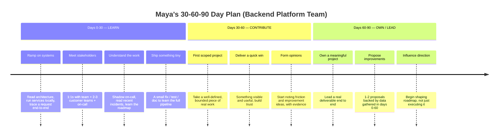
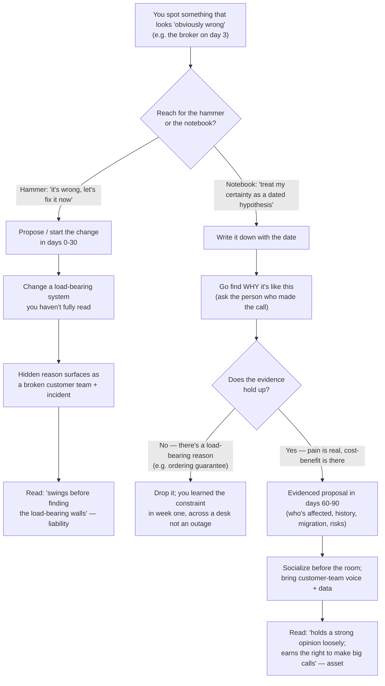

# Mock: The 90-Day Plan Presentation

This is a verbatim-style transcript of a **30-60-90 day plan presentation** — the exercise a senior or staff candidate is sometimes handed in a final-round loop, or in the first week of onboarding, where you present *how you'd spend your first three months* to a small panel: the hiring manager plus one or two peers you'd work alongside. It runs about 30 minutes including Q&A — roughly 10 minutes of you presenting and 20 minutes of the panel poking at it. There is no whiteboard algorithm and no system to design. The artifact is a plan, but the plan is a pretext: what the panel is actually buying is a window into your *judgment* — specifically, whether you can resist the urge to start fixing things before you understand them.

Read it the way you'd sit in on the real session. **Cover the coaching callouts and predict the read first** — at each turn ask: is this candidate planning to *learn before acting*, or is the plan secretly a list of things they've already decided are broken? Is the scope realistic for someone who has been there three weeks, or is it a fantasy of heroics? Then read the callout to check yourself. The candidate here is deliberately **strong-but-human**: their first draft of the plan leads with a big re-architecture proposed inside the first 30 days, a panelist gently probes it, and the candidate reframes to "learn first, propose later, with data" — that pivot is the single most important moment in the session. This is a representative mock; the panel and scenario are archetypal, not leaked.

> [!NOTE]
> **Where You'll See This On The Job (it's not just an interview exercise).** The 30-60-90 is a *real onboarding tool*, not a contrived interview puzzle. Plenty of teams hand every new senior or staff hire exactly this artifact in week one and ask them to fill it in and review it with their manager at the 30-, 60-, and 90-day check-ins. Some companies make it a literal field in the onboarding doc; others fold it into the "ramp plan" your manager drafts before you start. Many managers run it as a recurring 1:1 ritual: "show me your updated 30-60-90." So when an interview panel hands you this, they're not inventing a synthetic test — they're previewing the first conversation you'll have with your real manager. The candidate who treats it as a genuine planning instrument (something they'd actually *use* and *revise*) reads completely differently from the one who treats it as a performance. Practicing the real version makes the interview version automatic, and vice versa: the muscle is the same.

> [!NOTE]
> **Setup — Candidate Profile, Scenario & The Hidden Rubric**
>
> **Candidate:** "Maya," senior backend engineer, ~9 years, Java/Spring, joining a **backend platform team** — the team that owns shared services (auth, the internal API gateway, the messaging/event backbone, deployment tooling) that other product teams build on top of. She has been given a one-page brief about the team and 30 minutes to present a 30-60-90 day plan.
>
> **The panel:** "Raj," the hiring/engineering manager who'd be Maya's manager; "Lena," a staff engineer and the team's de facto tech lead; "Carlos," a senior engineer on a *consumer* team — a platform customer, deliberately on the panel to test stakeholder awareness. They take light notes and interrupt with questions.
>
> **The hidden rubric — what is actually being scored (never announced to the candidate):**
> - **Structured thinking:** is the plan organized around a sensible arc (learn → contribute → own), or is it a flat to-do list? Can she explain *why* this order?
> - **Learn-before-changing humility:** the core signal. Does she resist re-architecting on day 3? Does "I don't know yet" appear where it should? A plan full of confident fixes for a system she hasn't read is the top red flag.
> - **Prioritization:** with infinite things to do, can she name the *few* that matter and defend the cut?
> - **Stakeholder awareness:** does she know a platform team's "users" are other engineers, and does she plan to talk to them — not just read code?
> - **Realistic scope:** is 30/60/90 achievable by a human who is also ramping, or is it a hero fantasy?
> - **Communication & executive presence:** is the presentation clear, calm, and confident without being arrogant? Can she take a hard question without getting defensive?
> - **Time budget:** ~10 min presentation, then ~5 min on the listen-first probe, ~4 min prioritization, ~3 min stakeholders, ~3 min "success at 90 days," ~3 min "unclear roadmap," ~2 min wrap.

## The Transcript

### Phase 1 — The Plan Overview (Presentation)

**Raj:** Thanks for coming in, Maya. This last session is a bit different — no coding, no system design. We gave you a one-pager on the team; we'd like you to walk us through how you'd approach your first 90 days. Take about ten minutes, then we'll dig in. Go whenever you're ready.

**Candidate:** Thanks. I'll start with the shape of it and then go phase by phase. My plan is organized around a deliberate arc: **the first 30 days are for learning, the next 30 for contributing, and the last 30 for owning.** The reason for that order is simple — I'm joining a *platform* team. Platform code is load-bearing; other teams depend on it, and the blast radius of a careless change is large. The fastest way for me to do damage is to start changing things before I understand who relies on them and why they're the way they are. So I want to earn the right to make big calls by first understanding the system, the people, and the constraints. Here's the timeline at a glance.

**Candidate:** Let me walk each phase. **Days 0 to 30 — learn.** My single goal here is to become genuinely useful and dangerous-to-no-one. Concretely: I want to read the architecture docs and then verify them against reality, because docs lie — so I'll get every service running locally and trace one real request all the way through the gateway, auth, and the event backbone, so I have a mental model that's mine, not the wiki's. I'll sit down for 1:1s with everyone on the team, with the on-call rotation to understand what breaks at 3am, and with two or three of our *customer* teams to hear what it's like to build on our platform. I'll read the last quarter of incident write-ups, because incidents are where a system tells you the truth about itself. And I'll ship something genuinely tiny — a flaky-test fix, a doc correction, a one-line bug — specifically to learn the whole pipeline end to end: how you branch, review, test, deploy, and roll back here. Not to make an impact. To learn the machine by using it once on something low-stakes.

**Candidate:** Let me make that less abstract, because "learn the system" can be hand-wavy. If I were sketching the actual checklist for week one, it'd look like this. On the *systems* side: clone every repo and get the gateway, auth service, and event backbone all running locally on day one or two — and if I can't, that itself is a finding I'd write up, because if onboarding setup is broken for me it's broken for every new hire and every customer team trying to integrate. Then read the runbooks — the actual on-call runbooks, not the marketing-y architecture deck — because runbooks are where the real operational truth lives: what alerts fire, what the standard responses are, which dashboards matter. Then trace one real request end to end with a debugger and a distributed-trace view open side by side, and draw the path myself on paper. On the *incident* side: pull the last quarter of postmortems and build a little tally — which components show up most, what the recurring failure modes are, which "action items" from old postmortems never got done. That tally becomes a map of where the system actually hurts. On the *people* side: book 1:1s in the first week with my manager, with Lena as tech lead, with the current on-call, and with a named engineer on two or three customer teams — and in each one I'd ask the same three questions: "what do you wish I knew on day one," "what's the most painful thing about this platform," and "what would you not touch if you were me, and why." On the *pipeline* side: ship one tiny PR — ideally something I found while setting up, like a stale README command or a flaky test — and push it through the *entire* real pipeline so I learn branch-protection rules, the review culture, how CI gates work, how a deploy actually happens, and crucially how a *rollback* happens, before I ever ship anything that matters.

> [!TIP]
> **In Practice — name the artifacts, not just the activities.** Notice the difference between "I'll learn the system" and "I'll read the *runbooks*, build a *postmortem tally*, and push one tiny PR through the *real pipeline*." The second version is what a strong plan actually contains. Panels and managers both reward *specificity* because it's the cheapest proof you've done this before: vague learners say "I'll get up to speed," experienced ones name the concrete artifacts they'd touch (runbooks, postmortems, the local-dev setup, the deploy/rollback path) because they've learned which ones repay the time. When you draft your own, force every first-30 bullet to name a *thing you'd read, run, or ship* — not a feeling like "understand the architecture."

**Candidate:** **Days 30 to 60 — contribute.** By now I should have enough context to take a *scoped* first project — something bounded and well-defined that my manager and I agree on, where the requirements are clear enough that I'm not guessing. The aim is a **quick win**: something visible and real that delivers value and, just as importantly, builds the team's trust that I ship. I'll also start forming opinions in this window — noting friction, things that feel off — but I'll be *writing them down with evidence*, not acting on them yet.

**Candidate:** And to be concrete about what a *good* quick-win candidate looks like, because not every small task qualifies — the ones I'd reach for share three properties: they're **bounded** (clear start and end, low blast radius), they're **visible to the people whose trust I want** (the team, or better, a customer team), and they **teach me something** about the platform on the way. From the kinds of things I'd expect to find on a platform team: fixing the broken local-dev setup I hit in week one — which is invisible to leadership but every customer team integrating with us feels it, so it buys real goodwill; adding the missing dashboard or alert for a failure mode that showed up three times in the postmortem tally; writing the onboarding doc I wish I'd had, because I'm the last person who'll ever remember what was confusing; closing out a stale, well-scoped action item from an old incident that everyone agrees should be done but nobody's owned. What I'd *avoid* calling a quick win is anything that *sounds* impressive but is actually a multi-month rewrite in disguise — that's not a 30–60 quick win, that's the day-3 hammer wearing a smaller hat. A good quick win is small enough to land cleanly and real enough that someone says "oh good, finally."

**Candidate:** **Days 60 to 90 — own.** Now I take on something meaningful and own it end to end — a real deliverable with stakes. And this is where I'd surface one or two improvement proposals — but proposals backed by the data I gathered in the first 60 days, not hunches. By 90 days I'd want to be starting to influence the roadmap, not just executing it. Concretely, "owning" by day 90 means a few specific things I could point to: I'm on the on-call rotation and I've taken a real page without escalating in a panic; I'm the named owner of at least one service or a meaningful slice of one — I'm the person review requests get routed to and the person who'd get paged for it; and I've got one evidenced proposal — possibly the messaging investigation, if the data holds up — written up with who's affected, the incident history, the migration path and its risks, and a recommendation, sitting in front of the team as a real decision to make rather than a hunch I'm asserting. So the first big thing I'd want to tackle —

> [!TIP]
> Pause here and read the structure before the wobble lands. The arc — **learn → contribute → own** — is exactly right, and Maya does the thing strong candidates do: she explains *why* the order is what it is ("platform code is load-bearing, the blast radius is large"), which turns a generic template into reasoned judgment. The "ship something tiny *to learn the pipeline, not to make an impact*" line is a green flag — it shows she understands the first deliverable's purpose is *learning the machine*, not heroics. Watch what happens next, though: she's about to lead with the big fix.

**Candidate:** — so the first big thing I'd want to tackle: from the one-pager, it sounds like the event backbone is still on a older self-managed message broker, and I've migrated two teams off that pattern onto a managed streaming platform before. I think there's a strong case to **re-architect the messaging layer** in roughly the first month, because that's the kind of foundational change that pays off across every team that depends on us, and I'd want to come in and drive that early while I have momentum.

> [!WARNING]
> **There it is — the re-architecture on day 30, for a system she has not yet read.** This is the most common failure mode in a 90-day plan, and it's subtle because it sounds *ambitious and competent*. But look at what Maya just did: she proposed ripping out and replacing a load-bearing platform component in her first month, on the strength of a one-page brief and a pattern she saw at a *different* company. She doesn't yet know why it's on the current broker (maybe there's a hard reason), who depends on its exact semantics, what the migration would break, or whether it's even a pain point for anyone. A panel hears this as: *this person will come in and start swinging a hammer before learning where the load-bearing walls are.* The plan's own first 30 days say "learn, don't change" — and then the headline item contradicts it. Lena is about to probe. The recovery is the whole interview.

**Lena:** Can I stop you there? I like the overall shape — learn, contribute, own. But you just put a re-architecture of the messaging layer in roughly your first month. Walk me through that. **What if, on day 3, you look at the broker and you're sure it's the wrong choice — what do you actually do?**

### Phase 2 — The Listen-First Test

**Candidate:** That's a fair catch, and honestly — let me reframe what I said, because I think I led with the conclusion when I shouldn't have. You're right that I put a re-architecture in the first 30 days, and that contradicts my own principle that the first 30 days are for learning. Let me answer your day-3 question directly, because it's the real test.

**Candidate:** If on day 3 I'm *sure* the broker is wrong — I treat that certainty as a **hypothesis, not a verdict**, and I write it down with the date. Because "obviously wrong" on day 3 is almost always "I don't yet know the reason it's like this." Load-bearing platform decisions usually have a history: a constraint, a past incident, a dependency, a deliberate trade-off that isn't visible from the outside. So what I actually do is go *find the reason*. I'd ask Lena, or whoever made the call, "what drove choosing this broker, and what would it take to move off it?" Nine times out of ten there's context that either changes my mind or sharpens the proposal. The tenth time, it really is just legacy nobody loved — but now I can say so *with the receipts*, which is a completely different conversation than "the new person thinks our messaging is bad."

**Candidate:** So I'd pull the messaging re-architecture out of the first 30 days entirely. In days 0–30 it becomes a *question I'm investigating*, not a project I'm driving. If the evidence holds up — the migration pain is real, customer teams are hurting, the cost-benefit is there — then it becomes a **proposal in the 60–90 window**, backed by data: here's who's affected, here's the incident history, here's the migration path and its risks, here's why now. Learn first. Propose later. With data. The instinct to fix the big thing was right; the *timing* was wrong, and the timing is the whole point of a platform team.

> [!IMPORTANT]
> **Recovery complete — and the recovery is the signal.** This is the pivot the entire exercise exists to elicit. Maya does four things that flip the read from yellow to green: (1) she *names her own mistake* without getting defensive — "I led with the conclusion" — which is poise under a hard question; (2) she reframes certainty as a **hypothesis with a date**, the exact discipline a platform engineer needs; (3) she goes hunting for *why the system is the way it is* before judging it ("load-bearing decisions have a history"); and (4) she relocates the re-architecture from day 30 to the 60–90 *proposal* window, gated on evidence. The line "that's a completely different conversation than 'the new person thinks our messaging is bad'" shows she understands the *social* cost of premature confidence on a platform team, not just the technical risk. A candidate who *can't* make this pivot — who digs in and defends re-architecting on day 3 — usually fails the loop here regardless of how strong their coding was.

The cleanest way to see *why* the recovery matters is to put the two versions of the day-30 moment side by side — the same engineer, the same broker, two completely different reads:

| The day-30 moment | Ambitious-but-naive version | Listen-first version |
|---|---|---|
| **Headline of the plan** | "Re-architect the messaging layer in month one." | "Investigate the messaging layer in months one–two; *propose* if the data supports it." |
| **What it's based on** | A one-page brief and a pattern seen at a different company. | The same brief — but explicitly flagged as *not yet enough to act on*. |
| **Reaction to day-3 certainty** | "It's obviously the wrong broker, let's move." | "I'll treat that as a dated hypothesis and go find out *why* it's like this." |
| **First move** | Start scoping the migration. | Ask whoever made the call: "what drove this, and what would it take to move off it?" |
| **When the hidden reason surfaces** (ordering guarantee two teams hard-depend on) | Discovered mid-migration, as a broken customer team and an incident. | Discovered in week one, in a 1:1, before anything is touched. |
| **What the customer teams hear** | "The new person thinks our messaging is bad and is changing it." | "The new person asked us what hurts and is building a case with our voice in it." |
| **Where the change lands** | Day 30, on a system she hasn't read. | Day 60–90, as an evidenced proposal the team decides on together. |
| **The panel's read** | "Will swing a hammer before finding the load-bearing walls." | "Holds a strong opinion loosely; earns the right to make big calls." |
| **Same ambition?** | Yes — identical ambition. | Yes — identical ambition. Only the *timing and evidence* differ. |

> [!IMPORTANT]
> **In Practice — the difference is timing and evidence, not ambition.** Read the last row of that table again: *both* plans want to fix the broker. The naive plan isn't punished for being ambitious — it's punished for *acting before understanding*, which on a platform team converts ambition into an outage and a burned customer team. The listen-first plan keeps every ounce of the ambition and simply *sequences* it behind the learning and gates it on data. When you draft your own plan, this is the single most useful test: take your boldest item, and ask "is this in days 0–30 as a *fix*, or in days 60–90 as an *evidenced proposal*?" If it's the former, move it. You lose nothing but the risk.

**Lena:** Good. That's the answer I was hoping for. I'll tell you, just so you know the stakes: that broker is on the old stack because it gives us an ordering guarantee that two of our customer teams hard-depend on, and the managed option you're thinking of doesn't give it for free. So the "obviously wrong" choice has a load-bearing reason — which you'd have found in week one by asking.

**Candidate:** That's exactly the kind of thing I'd never have known from the outside — and exactly why I want to spend the first month asking before proposing. Thank you, that's a great example of the trap.

> [!INTERVIEW]
> **Meta-insight: the plan is an X-ray of judgment, not a project schedule.** No panel believes you'll execute your 90-day plan as written — the roadmap will have changed by your second week. So what are they actually reading? **Disposition.** A 30-60-90 plan reveals, in a low-stakes way, how you'll behave when you hit a real system you don't fully understand: do you reach for the hammer or the notebook? The candidate who proposes bold fixes for systems they haven't read is showing you how they'll treat *your* production code in month four. The candidate who says "I'd investigate why it's like this before I judge it" is showing you humility that scales. Ambition is cheap and everyone has it; *calibrated* ambition — knowing when to hold a strong opinion loosely — is what separates a senior hire who's an asset from one who's a liability. The plan is the cheapest possible test of that.

**Raj:** Let me ask the broader version of Lena's question, because it'll come up for real. **Suppose at day 60 you've done the homework and you genuinely disagree with the current architecture — not a hunch this time, you've got the data. What do you actually do? How do you push for change without being the new person who blows up the team?**

**Candidate:** This is the part I think people get wrong in the other direction — they're so worried about being the disruptive new hire that they sit on real findings, and then you've hired a senior person who doesn't move anything. So having disagreement at day 60 isn't a problem; it's the *whole point* of the learning. The question is how I carry it. Three things. First, I bring it as a **proposal, not a verdict** — written up with the evidence: here's the incident history, here's which customer teams are affected, here's the cost of the status quo, here's the migration path *and its risks*, here's my recommendation and the alternatives I considered. A document the team can argue with beats an opinion they have to either accept or reject. Second, I socialize it *before* the meeting — I'd walk Lena and the most-affected customer team through it one-on-one first, partly to pressure-test it (they'll find the hole I missed), and partly because nobody likes being surprised in a group setting by the new person declaring their thing is broken. Third, I'd be genuinely willing to be wrong — if Lena says "we tried this in 2023 and here's why it failed," that's not me losing, that's the system working; I'd rather find that out across a desk than across an outage. Disagreement carried that way *builds* trust, because it shows I do my homework and I respect the team's history. Disagreement carried as "I've decided we're doing it my way" burns it.

> [!INTERVIEW]
> **The disagreement question is the hammer probe in disguise.** Raj has just asked the same listen-first question from the other side: not "what if you're wrong on day 3" but "what if you're *right* on day 60." A surprising number of candidates fail *this* version — they hear "you've got the data" as permission to steamroll, and answer with some flavor of "I'd make the case and drive it through." The strong answer keeps the same humility even when the candidate is correct: a *proposal* not a verdict, *socialized before the room*, and held with genuine willingness to be wrong. The tell is the line "I'd rather find that out across a desk than across an outage" — it shows the candidate understands that the goal isn't to *win the argument*, it's to *make the right change stick*, and on a platform team the second requires the affected teams' buy-in, not just being technically correct. Being right is necessary; being right *in a way the team can adopt* is the senior skill.

### Phase 3 — Prioritization

**Raj:** Let's stay on the planning. Your first 30 days has a lot in it — read everything, run everything, trace a request, meet the whole team, meet customer teams, shadow on-call, read incidents, ship a fix. **That's a lot for 30 days while you're also just learning where the bathroom is. How do you prioritize? What actually comes first?**

**Candidate:** Right — and you're correct that as written it's more than 30 days of work if I tried to do it all deeply. So I'd sequence it by what *unblocks the most*. **Week one is environment and people, in parallel.** The single highest-leverage thing is getting all the services running locally and tracing one real request end to end — because until I can do that, every other piece of learning is abstract. In parallel, I'd book the 1:1s early, because people's calendars fill up and the *human* context is the slowest thing to acquire; code I can read alone at 9pm, but I can't 1:1 with Lena alone at 9pm.

**Candidate:** **Then I'd let the incidents and on-call shadowing tell me where to go deep.** I won't understand the *entire* platform in 30 days and I shouldn't try — that's boiling the ocean. So I'd read the incident history specifically to find *where the system actually hurts*, and go deep there, while staying shallow everywhere else. The tiny shipped fix I'd slot into week two or three, once I understand the pipeline enough to not break it. If I had to cut something under time pressure, I'd cut *breadth of code reading* — going deep on every service — before I'd cut *the stakeholder 1:1s or the incident review*, because the code will still be there in month two, but the relationships and the "where does it hurt" map are what make the rest of my 90 days land.

> [!TIP]
> This is the prioritization answer the rubric wants, and the tell is that Maya can **name what she'd cut and defend the cut**. Weak candidates, asked to prioritize an over-full list, just re-list it faster. Maya does three senior things: she sequences by *leverage* ("until I can trace a request, everything else is abstract"), she front-loads the *perishable* resource ("calendars fill up; I can read code alone at 9pm but can't 1:1 alone at 9pm"), and she explicitly *cuts breadth of code-reading before cutting relationships and incident review*. "I won't understand the entire platform in 30 days and I shouldn't try" is the anti-boil-the-ocean instinct — a senior plan is defined as much by what it *omits* as what it includes.

**Carlos:** Quick one from me. You keep saying "trace a request." Why that, specifically, over just reading the design docs faster?

**Candidate:** Because a request tracing through the real system tells me what's *actually* true — which services are really in the path, where the latency lives, what the real failure modes are, where the surprising coupling is. Docs tell me what someone *believed* was true when they wrote them, and on a platform that's been evolving, that's often six months stale. One real trace through your gateway and event bus will teach me more about how this platform actually behaves than a day of reading wikis. And it's *mine* — I built the mental model myself, so I trust it and I can reason from it.

**Lena:** Let me push on the scope once more, because I've seen people write a beautiful first-30 plan and then drown in it. Suppose your manager hands you a real ticket in week two — not a tiny one, a genuinely useful piece of work the team needs. Do you take it, or do you protect your learning time and say "not yet"?

**Candidate:** I'd take it *if it doubles as learning* — and I'd push back gently if it doesn't. The tiny first ship in my plan isn't a rule that I do nothing real for 30 days; it's that my *first* deliverable should be small enough that the cost of me not-yet-understanding the system is bounded. So if the week-two ticket is scoped, low-blast-radius, and routes through parts of the platform I want to learn anyway, that's perfect — it *is* the learning, and it builds trust faster than a doc fix. What I'd resist is being handed something *large and load-bearing* in week two, because then I'm making consequential changes to a system I don't understand yet, which is the exact risk the whole plan is built to avoid. So my answer isn't "protect my time at all costs" — it's "match the size of what I take on to the size of what I currently understand," and grow both together.

> [!IMPORTANT]
> **Realistic scope, tested at the seam.** Lena's probe is a trap in both directions: a candidate who says "I'd refuse real work to protect my learning" reads as rigid and precious, while one who says "sure, give me anything" reads as the day-3-hammer risk again. Maya threads it with a *principle* rather than a rule — "match the size of what I take on to the size of what I currently understand" — which is the genuinely senior formulation. It also reveals she understood her own plan's *intent* (bound the blast radius of early ignorance) rather than memorizing its *letter* (do nothing for 30 days). A candidate who can articulate the intent behind their plan, and flex the letter when reality intrudes, is showing the adaptability the panel actually cares about — because, again, nobody executes the plan as written.

### Phase 4 — Stakeholders: Who Do You Talk To First?

**Raj:** You've mentioned talking to customer teams a few times. **On a platform team — who would you talk to first, and why? Who matters?**

**Candidate:** This is the question I think people most often get wrong on a platform team, so I'm glad you asked. The instinct is to talk only to your own team. But a platform team's **users are other engineers** — the consumer teams who build on top of us. We don't have an external customer; *they* are the customer. So my stakeholder map is wider than just my reporting line.

**Candidate:** First, my own team and my manager — Raj, you and Lena — to understand the team's mission, the current roadmap, where the bodies are buried, and what "good" looks like here. Second, and almost as early, **two or three customer teams** — Carlos, your team would be high on that list. I want to hear, unfiltered, what it's like to build on our gateway and our event backbone: what's painful, what's confusing, what they've built workarounds for, what they wish we'd do. That's where the real roadmap signal lives, because their pain is our actual job. Third, the **on-call rotation and whoever owns our SLOs** — because the gap between "what we say we provide" and "what actually pages people at 3am" is where I'll learn what the platform's real reliability story is. If I had to rank: my manager for direction, then customer teams for *what actually matters*, then on-call for *what's actually broken*.

> [!TIP]
> The signal here is that Maya **knows a platform team's customers are other engineers** and plans to go *talk to them*, not just read their tickets. Many otherwise-strong candidates treat onboarding as a purely inward, code-reading activity and never mention the consumer teams — which, for a platform role, is a real miss, because the platform's whole reason to exist is those teams' productivity. Putting *customer teams* second only to her own manager, ahead of going deep on code, shows she's oriented around *impact on users* rather than just mastering the artifact. Carlos being on the panel is not an accident; the panel planted a customer-team voice specifically to see whether the candidate would notice he matters.

**Carlos:** And if my team tells you something painful about the platform in week one — something you suspect is real but you've been here six days — what do you do with that?

**Candidate:** I write it down, I thank you, and I *don't* immediately promise to fix it — because in week six I might learn there's a reason it's that way, like the broker's ordering guarantee Lena just mentioned. What I'd do is treat your pain as a high-priority *hypothesis to validate*: dig into whether it's widespread or just your team, whether there's history behind it, what fixing it would cost and break. If it holds up, it's a strong candidate for my 60–90 day proposal — and now I can bring it forward with your team's voice plus the evidence, which is far more persuasive than me asserting it. The worst thing I could do is either ignore you or over-promise on day six; I want to do neither.

**Lena:** One more on the ordering. You said manager first, then customer teams, then on-call. Be honest — **who do you talk to *literally first*, in your first day or two, and why that person?** Not the whole map, the single first conversation.

**Candidate:** Literally first is my manager — Raj — and not for the org-chart reason. It's because the most expensive mistake I can make in week one is to spend my limited attention learning the wrong things deeply. Raj is the one person who can tell me, on day one, "here's the thing that's actually on fire, here's the customer team you should befriend, here's the area I do *not* need you in." That conversation re-points everything else: which services I trace first, which 1:1s I prioritize, which incidents I read closely. So manager-first isn't deference — it's the highest-leverage *information* conversation available, because it shapes how I spend the other 29 days. The close-second is whichever customer team Raj points me at, because that's where I'll find the real pain that nobody wrote down. If Raj said "honestly I don't know yet, go figure it out," then my first conversation becomes the on-call engineer — because the person holding the pager always knows where the bodies are.

> [!TIP]
> **In Practice — "who first" is a leverage question, not a politeness question.** Weak candidates answer "who do you talk to first" as an etiquette question ("my manager, out of respect") or a completeness question (they re-list the whole stakeholder map). Maya answers it as a *leverage* question: the first conversation is the one that *re-points all the others*, which is why the manager goes first — not for hierarchy but because that 30 minutes changes how she spends the next month. Notice the fallback too: if the manager can't direct her, she defaults to *the person holding the pager*, because operational reality beats org charts. When you rehearse this, have a crisp single-name answer with the *reason being leverage*, plus a fallback for the "nobody can tell you" case — that combination reads as someone who's onboarded before.

### Phase 5 — What Does Success Look Like At 90 Days?

**Lena:** Zoom out for me. **What does success actually look like at the 90-day mark? How would you know you'd done well — and how would we?**

**Candidate:** I'd measure it on three axes, and deliberately *not* on "how much did I single-handedly change." First: **trust and self-sufficiency** — by 90 days I should be on the on-call rotation pulling my weight, shipping without hand-holding, and reviewing other people's changes credibly. The team should feel like headcount went *up*, not like they acquired a person who needs babysitting. Second: **delivered value** — I should have a quick win behind me from the 30–60 window and be owning a meaningful project by day 90, with something real shipped or clearly on track. Third: **earned influence** — I should have one or two well-evidenced improvement proposals on the table, taken seriously *because* they're backed by data and customer-team voices, not because I'm loud. That's the difference between influence and noise.

**Candidate:** The honest meta-version: at 90 days, success is that the team would be **unhappy to lose me** — not because I rewrote the platform, but because I'm reliable, I understand the system, I have the trust of the customer teams, and I've started making things better in a way that's *earned*. If at 90 days I've shipped a giant re-architecture but the team doesn't trust me and the customer teams think I steamrolled them, that's a *failure* dressed up as a success.

> [!IMPORTANT]
> **Stakeholder-aware definition of success: Strong.** Notice Maya defines success in terms the *team* would recognize — trust, self-sufficiency, on-call weight, earned influence — rather than a vanity metric of personal impact. The closing line is the senior move: she explicitly names the *anti-pattern* version ("shipped a giant re-architecture but the team doesn't trust me") and labels it a failure. That shows she understands the assignment isn't "be impressive in 90 days," it's "become a trusted, load-bearing member of a team that depends on trust." A candidate who defines 90-day success purely as "I shipped X big thing" is revealing that they'd optimize for visible heroics over team health — exactly the wrong instinct for a platform role.

**Lena:** Those are soft, though — "trust," "self-sufficiency." **If I made you turn each of those into something we could actually point at in the 90-day review, what would the concrete checks be?** I want to know you've thought about how we'd *tell*.

**Candidate:** Fair — let me make them falsifiable, because "trust" you can't measure but its *proxies* you can. For **self-sufficiency**: am I on the on-call rotation as a primary, not a shadow, by day 90? Have I closed PRs without my manager re-reviewing the basics? Are people routing questions about at least one area *to* me rather than me asking about everything? For **delivered value**: is there a shipped quick win I can name from the 30–60 window, and is the day-90 project shipped or visibly on track with no surprises in it? A cheap proxy: has a customer team said, unprompted, "that thing you did helped"? For **earned influence**: is there at least one evidenced proposal on the table that the team is *actually discussing* — taken seriously enough to be scheduled, debated, or accepted — rather than politely filed? And honestly, the simplest gut-check for all three is the one I'd ask *you*: if you ran a quick "would we be sad to lose Maya" poll on the team and the customer teams at day 90, what comes back? That single answer rolls up trust, value, and influence better than any dashboard, and it's the metric I'd actually optimize for.

> [!TIP]
> **In Practice — turn soft outcomes into observable proxies.** Lena's follow-up is a common second move on the success question: "great, now make it measurable." The pitfall is to either (a) retreat to vague restatements ("I'd just know") or (b) reach for vanity metrics ("lines of code, PRs merged") that reward activity over value. Maya does the senior thing — she keeps the *right* outcomes (trust, value, influence) and attaches **observable proxies** to each: primary on-call by day 90, PRs landing without basic re-review, questions routing *to* her, a proposal the team is *actually debating*, and the "would we be sad to lose them" gut-check. When you prep this, have one concrete proxy per success axis ready; "I can't measure trust directly, but here's what I'd watch for instead" is exactly the calibrated answer.

**Raj:** Flip it around for me. **What's the biggest risk in *your own* plan? Where do you think it could go wrong?**

**Candidate:** Two honest risks. The first is that I *under*-deliver in the name of learning — that I'm so careful for 30 days that the team starts to wonder when I'll actually do something. The mitigation is the tiny-but-real first ship and an explicit check-in with you, Raj, around day 30: "here's what I've learned, here's the scoped thing I'm picking up next, does that match what you need?" If I'm learning *and* visibly producing, the caution reads as diligence, not paralysis. The second risk is the opposite and more dangerous: that I *think* I've learned enough by day 30 and start acting with false confidence — the broker situation is the perfect example. The mitigation there is to keep proposals tied to *evidence I can show you*, not just my growing sense of how things work, so the check on my overconfidence is external, not just my own judgment. If I can't put the data on the table, the proposal isn't ready, full stop.

> [!TIP]
> Asking "what's the biggest risk in your *own* plan?" is a self-awareness probe, and it's where overconfident candidates faceplant — they say "honestly, not much, I think it's solid." Maya names *two real, opposing* failure modes of her own plan (too cautious / falsely confident) and gives each a concrete mitigation, with the second tying directly back to the broker lesson. The willingness to critique your own artifact, and to install an *external* check on your own overconfidence ("the check is the data on the table, not my judgment"), is exactly the metacognition that separates a senior hire you can trust with autonomy from one you have to supervise.

### Phase 6 — What If The Roadmap Is Unclear?

**Carlos:** Real-talk: our roadmap is not a clean document. Priorities shift, there's stuff half-decided. **What do you do if you show up and the roadmap is genuinely unclear — nobody can hand you a tidy list of what to work on?**

**Candidate:** That's the normal case, honestly — a tidy roadmap is the exception, not the rule. So my plan doesn't actually depend on one being handed to me. If the roadmap's unclear, the *learning* phase doesn't change at all — reading the system, meeting people, shadowing on-call, reading incidents all proceed regardless, and frankly they're *more* valuable when the roadmap is fuzzy, because incident history and customer-team pain are how I'd *help construct* a roadmap rather than wait for one.

**Candidate:** Concretely: I'd treat "the roadmap is unclear" as itself a signal, and I'd manage it in three moves. One — I'd get explicit alignment with you, Raj, on the *near-term* priority even if the long-term is fuzzy: "for the next 30 days, what's the one thing you'd most want me focused on once I'm ramped?" I don't need a year; I need the next bite. Two — I'd let the **customer-team pain and the incident history** point me at high-value work; if three teams independently complain about the same gateway behavior, that's a roadmap item writing itself, regardless of whether it's on a doc. Three — once I've got data in the 60–90 window, I'd *contribute to* clarifying the roadmap by bringing forward evidenced proposals — which is part of how a senior person earns influence: not by waiting for direction, but by helping create it. So an unclear roadmap doesn't stall me; it just means part of my job is helping make it clear.

> [!TIP]
> This answer scores because Maya turns an apparent problem — *no clear roadmap* — into a place where a senior person *adds value*. The weak answer is "I'd ask my manager what to work on" and stop (over-dependent), or "I'd just pick what I think is important" (the same day-3-hammer problem). Maya threads it: get the *near-term* bite explicitly ("I don't need a year, I need the next bite"), let *incident history and customer pain* surface high-value work that isn't yet written down, and then *help construct* the roadmap with evidenced proposals. "An unclear roadmap doesn't stall me; part of my job is helping make it clear" is precisely the proactivity expected at senior/staff — clarity is something you *create*, not something you wait to receive.

### Phase 7 — Wrap & Candidate's Questions

**Raj:** That's our time on the plan. Anything you want to ask us?

**Candidate:** Two. First — when a new person here brings forward an evidenced proposal in their first quarter, like the messaging investigation we discussed, what actually happens to it? I want to understand whether earned influence is real here or whether the roadmap is set far enough above the team that a well-argued proposal doesn't move it. Second — Lena, you mentioned the broker's ordering guarantee. What's the *one* piece of tribal knowledge about this platform that isn't written down anywhere and that you wish every new joiner knew on day one? I'd rather learn the load-bearing wall now than find it with a hammer.

> [!TIP]
> **Strong closing questions.** The first probes whether "earned influence" — which she built her whole 90-day arc around — is *real* at this company or theater; that's a genuine senior concern and signals she's thinking about how decisions actually get made. The second is a small masterstroke: asking for the *undocumented load-bearing knowledge* both demonstrates she internalized the entire lesson of the session (systems have hidden reasons; ask before you swing) and gives her a real head-start if she joins. Tying it back to "find the load-bearing wall now rather than with a hammer" closes the loop on the day-3 probe gracefully.

**Lena:** Good questions. And for what it's worth — the way you handled the messaging thing, pulling it back from a day-30 project to a question you'd investigate, is most of what we were looking for today. The plan itself we don't expect you to follow; the instinct behind the pivot is the thing.

## Debrief & Scorecard

After Maya leaves, the panel debriefs against the hidden rubric. Here is the calibrated read:

| Dimension | Signal Observed | Verdict | What Would Raise It |
|---|---|---|---|
| **Structured thinking** | Clear learn → contribute → own arc, *with the reasoning* for the order (platform code is load-bearing); sequenced first 30 days by leverage. | **Strong** | — |
| **Learn-before-changing humility** | Initially led with a day-30 re-architecture (red flag), but on one probe *fully* reframed: certainty → dated hypothesis, "find why it's like this," relocate to a 60–90 evidenced proposal. | **Strong (with a notch off the open)** | Don't put the big fix in days 0–30 at all in the first place; lead the plan with the investigation, not the conclusion. |
| **Prioritization** | Sequenced by leverage, front-loaded perishable 1:1s, named what she'd cut (breadth of code-reading) and defended it; explicitly rejected boiling the ocean. | **Strong** | — |
| **Stakeholder awareness** | Knew platform users are other engineers; ranked customer teams second only to her manager; planned to *talk to* them, not just read tickets; handled "painful feedback in week one" without over-promising. | **Strong** | — |
| **Realistic scope** | 90-day arc achievable; tiny first ship framed as *learning the pipeline*, not impact; meaningful ownership deferred to day 60+. | **Strong** | — |
| **Communication & executive presence** | Calm, clear, confident; took the hard re-architecture probe without defensiveness and *named her own miss*; strong closing questions. | **Strong** | — |
| **Definition of success** | Framed 90-day success as trust + self-sufficiency + earned influence; explicitly labeled "shipped a re-architecture but lost the team's trust" as a *failure*. | **Strong** | — |

**Overall verdict: Hire (Senior, leaning Strong).** The plan's *content* is solid, but what carried the session was the **listen-first pivot**: Maya opened with the single most common red flag — proposing to re-architect a load-bearing platform component in her first 30 days — and then, under a gentle probe, executed a complete and self-aware recovery, relocating it to an evidence-gated proposal and articulating *why* premature confidence is dangerous on a platform team. Because that recovery was full and unprompted-by-defensiveness, the panel reads it as genuine disposition, not a memorized line. The single thing that keeps it from an unqualified "Strong" is that she *led* with the re-architecture at all; a top-decile candidate never puts the big swing in days 0–30 and instead leads the plan with the *investigation*. The fix is mechanical and she clearly already knows it.

The whole judgment being scored collapses into one decision: *when you spot something that looks broken, which branch do you take?* This is the loop a strong onboarding plan keeps you on:

> [!INTERVIEW]
> **The meta-lesson of the 90-day presentation.** The exercise looks like it's testing planning; it's testing **judgment and humility under the temptation to look impressive**. The trap is built in: you're a senior or staff hire, you *want* to show ambition and impact, so the natural move is to fill the plan with bold fixes — and that's exactly the move that fails, because it reveals you'd change a system before understanding it. The candidates who pass treat their first 90 days as *earning the right* to make big calls: learn the system and the people, find out *why things are the way they are*, ship small to build trust, and only then propose changes — with data and with the affected teams' voices behind them. "Listen and learn before you act" sounds like a platitude until you watch a strong engineer fail this round by re-architecting a broker on day 3 of a brief they read for ten minutes. Ambition is assumed; *calibrated* ambition is the hire.

## Variations

The same exercise flexes by role and team situation. The *learn-first spine* never changes — what shifts is the shape of the contribution and where the humility is pointed. Rehearse these branches out loud:

- **IC vs. lead framing:** If you're presenting for a **staff/lead** role, the plan's *own* phase should shift from "ship a quick win" toward "identify the team's top one or two systemic problems and build the *case and coalition* to fix them" — your day-90 deliverable is influence and a funded direction, not just shipped code. The learn-first discipline is *identical*; only the contribution changes shape. Concretely: an IC's day-90 owned project is a *service or feature*; a lead's day-90 owned outcome is a *decision the team has aligned on and a path it's funded* — your "quick win" might be unblocking a stalled cross-team agreement rather than shipping code yourself. And a real difference in the *learning* phase: a lead's first-30 stakeholder map widens upward and sideways — your manager's manager, the partner teams' leads, whoever holds the budget — because a lead's influence runs through people you don't directly work with. The day-3-hammer trap mutates too: for a lead it's "reorganize the team / rewrite the roadmap in month one," and the recovery is the same — *that's a month-three proposal backed by what you learned, not a week-one declaration.*
- **Turnaround team:** You're joining a team in trouble — missed deadlines, low morale, a fragile system. The temptation to "fix it fast" is enormous and the trap is sharper. The strong move: learn *faster* (compress the listening into the first two weeks), but still diagnose before prescribing — and explicitly include "rebuild trust / stabilize" as a first-30 goal, because a turnaround that starts with the new person blaming the old code burns the very people you need. Real-world texture: in a turnaround, your earliest "quick win" is often *stopping the bleeding*, not building something new — fixing the one alert that pages the team every night so they can sleep, or killing the flaky deploy that everyone's afraid of, buys you more trust than any feature. And the people probe is acute: the existing engineers have usually been blamed already, so the fastest way to lose them is to walk in and confirm their fear that the new hire thinks they're the problem. The reframe to say out loud: "I'd assume the system is the way it is because smart people made reasonable calls under pressure I can't see yet — my first job is to understand those constraints, not to narrate what's wrong."
- **Greenfield / new team:** There's *no* legacy system to learn — so what does "learn before acting" even mean? It shifts to learning the *problem space, the users, and the constraints* before committing to an architecture: resist designing the whole system in week one, prototype to learn, and keep early decisions reversible. The humility target moves from "the existing system has hidden reasons" to "my first design will be wrong in ways I can't see yet." Real-world texture: greenfield's seductive trap is the *opposite* of the platform trap — instead of "don't touch the old thing," it's "go build the new thing immediately," and a blank canvas makes premature architecture feel like productivity. The learn-first move is to spend the first 30 days with *users and the problem*, not the framework: who's this for, what do they do today, what's the smallest thing that would help, what decisions can I defer? The strong day-90 isn't "I architected the platform"; it's "I shipped a thin slice that real users touched, learned where my assumptions were wrong, and kept the expensive decisions reversible until the evidence came in."
- **Aggressive panel:** A panelist insists "we hired you *because* we want bold change fast — why are you being so cautious?" The trap is to cave and promise day-30 heroics. The strong answer holds the line warmly: "Bold change is exactly what I'm planning — and the way I make it *stick* rather than *backfire* is to land it on evidence in month two or three. Fast and wrong on a platform team isn't bold, it's an outage." A useful extra move under this pressure is to *offer the fast thing that's actually safe*: "If you want visible momentum in month one, the fastest real win is usually fixing something that's already broken and uncontroversial — the local-dev setup, a noisy alert, a stale runbook — not re-architecting a load-bearing system before I understand it. I can be fast *and* right; I just won't be fast *and* reckless."
- **Highly remote / distributed team:** If the team is spread across time zones, the *perishable* resource isn't just calendars — it's the serendipitous context you'd normally pick up in a hallway. The plan adapts: over-invest in async learning (read every recent design doc, decision log, and incident thread, because in a remote team the writing *is* the institutional memory), book the 1:1s even earlier because cross-time-zone scheduling is slower, and explicitly ask in each one "where do decisions actually get made here — which channel, which doc, which meeting?" The learn-first instinct is unchanged; the *channels* for learning shift from observation to documentation.

## Practice

Build and pressure-test your own 30-60-90:

1. **Draft a real 30-60-90 for a specific team** (your current one, or a target role). Use the learn → contribute → own arc. For each phase write a *single* primary goal, then the concrete activities under it. If a phase has ten items, you haven't prioritized.
2. **Audit days 0–30 for hammers.** Read your first 30 days and circle anything that *changes* the system rather than *understands* it. Move every one of them to the 60–90 window as an *evidence-gated proposal*. If your headline first-month item is a big fix, you've set the trap for yourself — lead with the investigation instead.
3. **For every proposed change, write the sentence "I don't yet know ___."** Force yourself to name what you'd need to learn before you could responsibly propose it (who depends on it, why it's like this, what it would break). If you can't fill that blank, you don't understand it well enough to be proposing it.
4. **Map your stakeholders, and put your *users* on it.** Especially for a platform/infra role: who are the engineers or teams who depend on you? Plan an explicit early conversation with them, not just with your own team.
5. **Define 90-day success in the team's terms, not yours.** Write three success criteria. If all three are about *your* visible output and none are about *trust, self-sufficiency, or earned influence*, rewrite them.
6. **Drill the four killer probes** with a partner: *"What if you see something broken on day 3?" / "How do you prioritize all that?" / "Who do you talk to first?" / "What if the roadmap's unclear?"* Practice the day-3 answer until "I'd treat my certainty as a dated hypothesis and go find out why it's like this" is reflexive.
7. **Record a 10-minute delivery.** Listen back: did you lead with learning or with fixing? Did you name what you'd cut? Did you sound confident *and* humble — or confident *and* reckless? The line between those two is the whole exercise.
8. **Make every first-30 bullet name a concrete artifact.** Go through your Days 0–30 and check that each line names a *thing you'd read, run, or ship* — the runbooks, the postmortem tally, the local-dev setup, one tiny PR through the real pipeline — not a feeling like "understand the architecture." If a bullet can't be turned into "I will read/run/ship X," it's too vague to be a plan.
9. **Pressure-test your quick win against the three properties.** For your proposed 30–60 quick win, confirm it's *bounded* (clear start/end, low blast radius), *visible* to the people whose trust you want, and *teaches you something* about the system. If it fails any of the three — especially if it's secretly a multi-month rewrite — it's not a quick win, it's a hammer in a smaller hat. Pick a different one.
10. **Rehearse the "you're right at day 60" probe, not just "you're wrong at day 3."** Have a partner ask: "you've done the homework and you genuinely disagree with the architecture — now what?" Practice answering with *proposal-not-verdict, socialized-before-the-room, willing-to-be-wrong* until it's reflexive. Being right is the easy half; carrying a disagreement so the change actually *sticks* is the half that's scored.
11. **Translate your soft success criteria into observable proxies.** Take each 90-day success criterion (trust, self-sufficiency, influence) and write the *thing someone could point at*: "primary on-call by day 90," "PRs landing without basic re-review," "a proposal the team is actually debating." If you can't name a proxy, the criterion is too vague to defend when a panelist asks "how would we *tell*?"
12. **Run the variation drill.** Take your one plan and re-pitch it three ways out loud — as an IC, as a lead, and for a turnaround team — changing only the *contribution* shape while keeping the learn-first spine fixed. If your learn-first phase changes between versions, you've confused the contribution (which flexes) with the discipline (which doesn't).

## Recap

- The **30-60-90 presentation** is a final-round or first-week exercise where you present your first three months to a small panel (manager + 1–2 peers, ~30 min with Q&A). It looks like a planning test; it's a **judgment-and-humility** test.
- Structure the plan around a deliberate arc: **Days 0–30 LEARN** (ramp on systems, meet stakeholders, shadow on-call, read incidents, ship something *tiny* to learn the pipeline — no big changes), **Days 30–60 CONTRIBUTE** (a scoped first project, a quick win, start forming evidenced opinions), **Days 60–90 OWN** (lead a meaningful project, propose 1–2 *data-backed* improvements, begin influencing direction).
- The core signal is **listen and learn before you act.** The classic failure is proposing a re-architecture of a load-bearing system in the first 30 days, on a brief you read for ten minutes. Treat day-3 certainty as a **dated hypothesis**, go find out *why the system is the way it is*, and relocate big changes to an **evidence-gated 60–90 proposal**.
- **Prioritize ruthlessly and name your cuts.** Sequence by leverage, front-load the *perishable* resource (people's calendars), go deep where incidents say it hurts, and don't try to boil the ocean. A senior plan is defined by what it *omits*.
- **Know your stakeholders** — on a platform team your *users are other engineers*. Talk to customer teams early; their pain is your roadmap. Take their week-one feedback as a hypothesis to validate, not a promise to fulfill.
- **Define 90-day success in the team's terms:** trust, self-sufficiency, on-call weight, earned influence — not "how much did I single-handedly change." A big shipped change with the team's trust burned is a failure, not a win.
- **An unclear roadmap is normal** and is a place to *add value*: get the near-term bite explicitly, let incident history and customer pain surface high-value work, then help *construct* the roadmap with evidenced proposals.
- **Make the plan concrete, not vague.** Every first-30 bullet should name a *thing you'd read, run, or ship* — the runbooks, a postmortem tally, the local-dev setup, one tiny PR through the *real* pipeline (so you learn deploy *and rollback* before anything matters). Specificity is the cheapest proof you've onboarded before.
- **A real quick win has three properties:** *bounded* (low blast radius), *visible* to the people whose trust you want, and *teaches you something*. Fixing broken local-dev, adding a missing alert for a recurring incident, or writing the onboarding doc you wish you'd had beats anything that's secretly a multi-month rewrite.
- **The disagreement question is the hammer probe from the other side.** When you're *right* at day 60, carry it as a **proposal not a verdict**, *socialize it before the room*, and stay genuinely willing to be wrong. The goal isn't to win the argument; it's to make the right change *stick* — which on a platform team needs the affected teams' buy-in, not just being technically correct.
- **Turn soft success criteria into observable proxies.** "Trust" and "self-sufficiency" aren't measurable, but their proxies are: primary on-call by day 90, PRs landing without basic re-review, questions routing *to* you, a proposal the team is *actually debating*. Have one concrete proxy per success axis ready for "how would we tell?"
- **The 30-60-90 is a real onboarding tool, not just an interview exercise** — many managers hand it to every new senior hire and review it at the 30/60/90 check-ins. Treating it as a genuine instrument you'd actually use and revise reads completely differently from treating it as a performance.
- **The exercise flexes by situation but the learn-first spine is fixed.** For a *lead*, the day-90 deliverable is influence and a funded direction; in a *turnaround*, the first quick win is *stopping the bleeding* and the people are already blamed, so don't pile on; in *greenfield*, "learn first" means the problem and users before the architecture, keeping early decisions reversible. Only the contribution changes shape — the humility never does.

## Next

Continue to [Anti-Patterns: What NOT To Say](./T15-anti-patterns-what-not-to-say.md), which catalogs the phrases and moves — like proposing a re-architecture on day 3 — that quietly sink otherwise-strong candidates across every round. For building the narrative and positioning that underpins a confident onboarding plan, see the [Resume, Profile & Career chapter](../C05-resume-profile-and-career/); for the deeper people-and-org skills a senior hire grows into as they start influencing roadmaps and leading platform direction, see [Engineering Leadership](../../L5-architecture-leadership/C03-engineering-leadership/).
